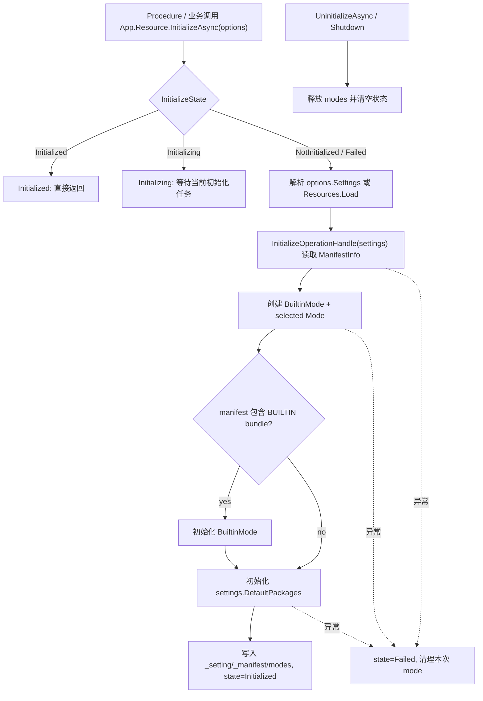

# resource-explicit-initialize design

## 0. 术语约定

| 术语 | 当前定义 | 本次约定 |
|---|---|---|
| Resource 同步外壳 | `ResourceModule.Startup()` 只清空 `_setting` / `_manifest` / `modes` | `Startup()` 只重置初始化状态和同步容器，不读取 settings / manifest，不初始化 package |
| 显式初始化 | 当前没有公开 `ResourceModule.InitializeAsync()`，但已有 `InitializeOperationHandle` 能按 mode 读取 manifest | `InitializeAsync(options)` 是唯一异步 ready 入口，负责 settings、manifest、mode、builtin/default package |
| 初始化状态 | 当前只有 `_setting == null || _manifest == null` 隐式判断 | `ResourceInitializeState` 明确表达 `NotInitialized / Initializing / Initialized / Failed` |
| 初始化 options | 当前没有 Resource 初始化参数对象 | `ResourceInitializeOptions` 允许调用方显式传入 `ResourceSettings`，未传时从 `Resources.Load<ResourceSettings>("ResourceSettings")` 读取 |
| 反初始化 | 当前同步 `Shutdown()` 直接释放 mode | `UninitializeAsync()` 显式释放已初始化 mode/package 状态，`Shutdown()` 只做最后同步清理 |

防冲突结论：

- 本 feature 不改 manifest schema，不改 `ManifestInfo / PackageInfo / BundleInfo / AssetInfo` 字段。
- 本 feature 不重新设计 `InitializeOperationHandle` 的 mode source router；它已承载 EditorSimulator / Offline / Online / Web 清单读取。
- 本 feature 不做 Procedure bootstrap，不删除 `Startup.cs`。

## 1. 决策与约束

### 需求摘要

做什么：给 `ResourceModule` 增加显式 `InitializeAsync(ResourceInitializeOptions options = null)` 和 `UninitializeAsync()`；同步 `Startup()` 只保留外壳初始化，资源加载、package 初始化、UI/Sound/Config 等调用方必须在显式初始化完成后再使用资源 API。

为谁：后续 Procedure bootstrap、资源调用侧，以及依赖 `App.Resource` 按需同步获取模块外壳但不希望属性访问隐式等待异步 ready 的运行时流程。

成功标准：

- `App.Resource` 可同步创建 Resource 外壳，但 `InitializeState == NotInitialized`，`IsInitialized == false`。
- `InitializeAsync()` 读取 settings、调用现有 `InitializeOperationHandle` 得到 manifest、创建 builtin mode 和 selected mode、初始化可选 `BUILTIN` 与默认 packages。
- 重复 `InitializeAsync()`：已初始化直接返回；初始化中等待同一次任务；失败后允许重试。
- `UninitializeAsync()` 释放 mode/provider 状态并回到 `NotInitialized`。
- 资源加载 / package / unload API 未初始化时抛明确 `GameException("ResourceModule is not initialized. Call InitializeAsync first.")`。
- Runtime 与 Runtime.Tests 编译通过，并新增测试覆盖最小状态机。

### 明确不做

- 不在 `App.Resource` / `App.GetModule<ResourceModule>()` 中隐式调用或等待 `InitializeAsync()`。
- 不做 Procedure bootstrap 示例；那由后续 `procedure-bootstrap-flow` 承接。
- 不删除 `Startup.cs`。
- 不新增 Addressables、缓存下载、差量更新、远端回滚或 CDN 发布策略。
- 不改变 `ManifestOperationHandle` / `PublishVersionOperationHandle` 的公开语义。
- 不改 UI/Sound/Config 的资源调用流程；它们继续调用 `App.Resource`，未初始化时由 Resource API 抛错。

### 复杂度档位

走运行时模块默认档位，偏 `Robustness = L2`：需要覆盖重复初始化、初始化中复用任务、失败重试、显式反初始化、未 ready API 错误和 shutdown 同步兜底。

### 关键决策

1. 初始化状态放在 `ResourceModule` 内部。
   - Resource 的 ready 语义只属于 Resource，不扩散到 App resolver。
   - 后续 Procedure 只需要 `await App.Resource.InitializeAsync()`。

2. 失败后允许重试。
   - 资源 manifest 或远端 publish pointer 可能因为配置或网络临时失败。
   - `Failed` 状态下再次调用 `InitializeAsync()` 会重新执行完整流程。

3. `ResourceInitializeOptions.Settings` 为可选覆盖入口。
   - 测试和业务 bootstrap 可以传入临时 `ResourceSettings`。
   - 未传时使用 `Resources.Load<ResourceSettings>("ResourceSettings")` 保持项目默认入口。

4. `UninitializeAsync()` 先释放 mode，再清空 `_setting` / `_manifest`。
   - 已初始化的 provider/package 由 `ModeBase.Release()` 释放。
   - 当前 `Release()` 多为同步 void 或 async void 包装，首版不改 mode/provider 的释放契约。

## 2. 名词与编排

### 2.1 名词层

#### 现状

- `ResourceModule.Startup()` 当前只清空 `_setting` / `_manifest` / `modes`，没有公开初始化入口。
- `InitializeOperationHandle` 已能基于 `ResourceSettings.Mode` 读取 manifest：
  - `EditorSimulator` 反射 Editor provider。
  - `Offline` 读取本地 / StreamingAssets manifest。
  - `Online` / `Web` 读取 publish pointer 后读取 version manifest。
- `InitializePackageAsync(package)`、`LoadAssetAsync(location)` 等 API 通过 `EnsureReady()` 判断 `_setting == null || _manifest == null`，错误文本为 `ResourceModule is not initialized.`。

#### 变化

新增初始化状态：

```csharp
public enum ResourceInitializeState
{
    NotInitialized = 0,
    Initializing = 1,
    Initialized = 2,
    Failed = 3
}
```

新增初始化参数：

```csharp
public sealed class ResourceInitializeOptions
{
    public ResourceSettings Settings { get; set; }
}
```

`ResourceModule` 对外契约：

```csharp
public sealed partial class ResourceModule : GameModuleBase
{
    public bool IsInitialized { get; }
    public ResourceInitializeState InitializeState { get; }
    public ResourceSettings Settings { get; }
    public ManifestInfo Manifest { get; }

    public UniTask InitializeAsync(ResourceInitializeOptions options = null);
    public UniTask UninitializeAsync();
}
```

接口示例：

```csharp
await App.Resource.InitializeAsync();
await App.Resource.InitializePackageAsync("Main");
var handle = await App.Resource.LoadAssetAsync("Assets/Game/UI/Login.prefab");
```

测试示例：

```csharp
var settings = ScriptableObject.CreateInstance<ResourceSettings>();
settings.Mode = ResourceMode.Offline;
settings.ManifestName = tempManifestPath;
await App.Resource.InitializeAsync(new ResourceInitializeOptions { Settings = settings });
```

### 2.2 编排层



#### 现状

- Resource 的 ready 状态通过 `_setting/_manifest` 隐式表达。
- `Startup()` 已不能 await manifest/package 初始化，因此资源模块只有外壳，没有显式完成 ready 的入口。
- 测试只能验证未初始化时会抛错，不能验证从 manifest 到 package 的 ready 流程。

#### 变化

1. `Startup()` 初始化状态：
   - 清空 `_setting`、`_manifest`、`modes`。
   - 设置 `InitializeState = NotInitialized`。
   - 清空 pending 初始化任务。

2. `InitializeAsync(options)`：
   - `Initialized`：直接返回。
   - `Initializing`：等待已有 `UniTaskCompletionSource`。
   - `NotInitialized` / `Failed`：新建 completion，进入 `Initializing`。
   - 解析 settings：优先 `options.Settings`，否则 `Resources.Load<ResourceSettings>("ResourceSettings")`。
   - settings 为空抛 `GameException("ResourceSettings not found.")`。
   - 调用 `App.Operation.WaitCompletionWithKeyAsync<InitializeOperationHandle>(this, settings)` 获取 manifest。
   - 根据 manifest 创建 `BuiltinMode` 与 selected mode；selected mode 为空或重复时按当前 mode 规则处理。
   - manifest 中存在 `BUILTIN` bundle 时初始化 builtin mode，否则跳过。
   - 初始化 `settings.DefaultPackages` 中非空 package；任一失败抛包含 package 名的 `GameException`。
   - 成功后写入 `_setting` / `_manifest` / `modes`，状态转 `Initialized`。

3. 失败处理：
   - 本次创建的 mode 必须 `Release()`。
   - `_setting` / `_manifest` 置空，`modes` 清空。
   - 状态转 `Failed`，completion 设置异常。
   - 下次 `InitializeAsync()` 允许重试。

4. `UninitializeAsync()`：
   - `NotInitialized` / `Failed`：同步清空状态后返回。
   - `Initializing`：等待当前初始化结束后再释放；如果初始化失败，清空状态并返回。
   - `Initialized`：释放所有 mode，清空 `_setting` / `_manifest` / `modes`，状态回到 `NotInitialized`。

5. `Shutdown()`：
   - 不 await。
   - 同步释放 `modes` 并清空状态；如果正在初始化，不等待，由完成回调进入失败或被清空状态保护。

#### 流程级约束

- 错误语义：未初始化 API 统一抛 `ResourceModule is not initialized. Call InitializeAsync first.`。
- 幂等性：`InitializeAsync()` 已初始化直接返回；初始化中等待同一次任务；失败后允许重试。
- 顺序：manifest 成功后才能写入 settings/manifest/modes；默认 package 成功后才标记 Initialized。
- 回滚：初始化失败不能留下半 ready 的 mode/provider。
- 边界：Resource 初始化不由 App 自动触发；Procedure 或业务 bootstrap 显式调用。

### 2.3 挂载点清单

1. `ResourceModule.InitializeAsync(options)`：删除后无法显式进入资源 ready。
2. `ResourceInitializeState` / `IsInitialized`：删除后调用侧无法观察初始化状态。
3. `ResourceInitializeOptions.Settings`：删除后测试和业务无法覆盖 settings 来源。
4. `UninitializeAsync()`：删除后无法显式释放资源 ready 状态。
5. `EnsureReady()` 错误语义：删除后未初始化调用会退回模糊错误。

### 2.4 推进策略

1. 状态契约骨架：新增 `ResourceInitializeState`、`ResourceInitializeOptions`、状态属性和 `InitializeAsync` / `UninitializeAsync` 空壳。
   - 退出信号：未初始化 Resource 外壳可观察到 `NotInitialized`。
2. 初始化编排：接通 settings 解析、`InitializeOperationHandle`、mode 创建、builtin/default package 初始化。
   - 退出信号：传入本地 manifest settings 可完成 `InitializeAsync()` 并进入 `Initialized`。
3. 幂等与失败处理：补初始化中复用、已初始化直接返回、失败回滚和失败后重试。
   - 退出信号：重复初始化不重复创建，失败不残留半 ready 状态。
4. 反初始化与 shutdown 收口：实现 `UninitializeAsync()`，让 `Shutdown()` 同步清空状态。
   - 退出信号：初始化后可显式回到 `NotInitialized`，未初始化 API 恢复明确报错。
5. 测试补齐：覆盖未初始化错误、成功初始化、重复初始化、失败重试、显式反初始化。
   - 退出信号：Runtime.Tests 编译通过，ResourceModuleTests 覆盖状态机最小闭环。

### 2.5 结构健康度与微重构

##### 评估

- compound convention 检索：未命中 Resource 初始化状态机相关稳定 convention。
- 文件级 — `ResourceModule.cs`：文件偏长，但本次变更集中在 Resource 门面状态机，属于当前类的核心职责。
- 文件级 — `ResourceModule.InitializeOperationHandle.cs`：已承担 manifest source router，本次只复用，不改职责。
- 目录级 — `Assets/GameDeveloperKit/Runtime/Resource/`：已有多份 partial 文件；新增一个小 enum / options 文件可能增加同层文件，但可以提升公开契约可读性。

##### 结论：不做前置微重构

本 feature 不先拆 `ResourceModule.cs`。实现时可新增小类型文件 `ResourceInitializeState.cs` / `ResourceInitializeOptions.cs`，但不做目录重组。原因是当前重点是显式 ready 状态机，拆 mode/provider 文件会扩大范围。

## 3. 验收契约

| 编号 | 输入 / 触发 | 期望可观察结果 |
|---|---|---|
| N1 | `App.Resource` 首次访问后未调用 `InitializeAsync()` | `IsInitialized == false`，`InitializeState == NotInitialized` |
| N2 | 未初始化时调用 `LoadAssetAsync("asset")` | 抛 `GameException`，消息包含 `Call InitializeAsync first` |
| N3 | `InitializeAsync(options)` 传入有效 local manifest settings，且无 default package | 状态转 `Initialized`，`Settings` / `Manifest` 非空 |
| N4 | `InitializeAsync()` 已完成后再次调用 | 直接返回同一 ready 状态，不重复清空或重建 |
| N5 | 两次并发调用 `InitializeAsync()` | 第二次等待第一次，最终同为成功或同为失败 |
| N6 | manifest 读取失败 | 状态转 `Failed`，`IsInitialized == false`，不留下 modes ready 状态 |
| N7 | 失败后修正 settings 再调用 `InitializeAsync()` | 允许重试并可进入 `Initialized` |
| N8 | `UninitializeAsync()` 在 Initialized 后调用 | 释放 modes，清空 `Settings` / `Manifest`，状态回 `NotInitialized` |
| N9 | manifest 包含 `BUILTIN` bundle | 初始化时尝试初始化 BuiltinMode |
| N10 | manifest 不包含 `BUILTIN` bundle | 初始化不会因 `BUILTIN not found` 失败 |
| N11 | `DefaultPackages` 中 package 不存在 | 初始化失败，异常消息包含 package 名 |
| B1 | grep `App.Resource` / `GetModule<ResourceModule>()` | 不存在隐式调用 `InitializeAsync()` |
| B2 | Runtime / Runtime.Tests 编译 | `dotnet build` 通过 |

反向核对项：

- 不在 `Startup()` 中 await manifest 或 package 初始化。
- 不删除 `Startup.cs`。
- 不修改 manifest schema。
- 不改 UI/Sound/Config 的资源调用契约。

## 4. 与项目级架构文档的关系

验收通过后需要更新 `.codestable/architecture/ARCHITECTURE.md`：

- Resource 小节记录 `InitializeAsync(options)` / `UninitializeAsync()` 成为显式 ready 入口。
- 记录 `App.Resource` 只创建同步外壳，资源 API 未初始化时抛 `Call InitializeAsync first`。
- 记录后续 Procedure bootstrap 应显式 `await App.Resource.InitializeAsync()`。
