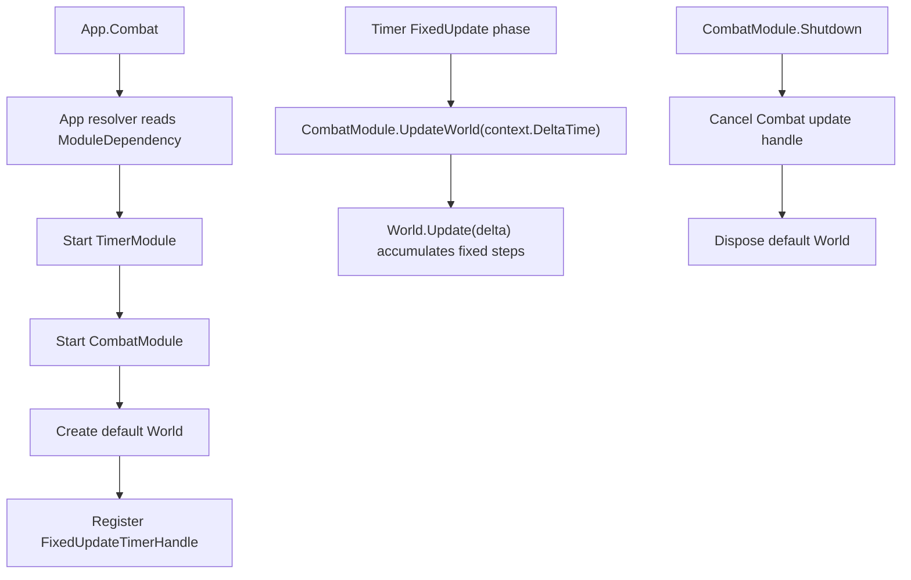

# combat-timer-consumer design

## 0. 术语约定

| 术语 | 定义 | 防冲突结论 |
|---|---|---|
| `CombatUpdateHandle` | CombatModule 保存的 `FixedUpdateTimerHandle` 字段，用于驱动默认 world 更新 | 不新增公开 handle 类型；`FixedUpdateTimerHandle` 当前是 sealed 类型，只保存实例 |
| `CombatRuntimeDriver` | Combat 旧的私有 `MonoBehaviour` update driver | 本 feature 删除该 driver，不再创建 `GameDeveloperKit.CombatRoot` |
| `ModuleDependency(typeof(TimerModule))` | CombatModule 对 TimerModule 的同步启动依赖声明 | 覆盖 Combat 首版本地 driver 决定，按 roadmap 统一调度契约执行 |
| `UpdateWorld` | CombatModule 内部调用默认 `World.Update(deltaTime)` 的计算入口 | 保留为内部计算节点，驱动来源从 Unity driver 改为 Timer fixed update handle |

## 1. 决策与约束

### 需求摘要

本 feature 消费 `runtime-scheduling-diagnostics` roadmap 的 `combat-timer-consumer` 条目：CombatModule 删除独立 runtime update driver，改为通过 Timer 的 `FixedUpdateTimerHandle` 推进默认 world。Combat 仍按需启动，不进入默认预加载，也不扩展多 world 调度、网络同步或回滚确定性。

成功标准：

- `App.Register<CombatModule>()` 或访问 `App.Combat` 时，App resolver 先启动 `TimerModule`，再启动 `CombatModule`。
- Combat startup 创建默认 `World`，并注册一个 Timer fixed update handle，handle tag 为 `CombatModule.Update`，owner 为 CombatModule 实例。
- Timer FixedUpdate 推进时调用默认 `World.Update(context.DeltaTime)`。
- Combat shutdown / unregister 会取消 update handle，再 dispose 默认 world。
- Combat 不再创建 `GameDeveloperKit.CombatRoot` 或 `CombatRuntimeDriver`。

### 明确不做

- 不迁移 Procedure 或 Debug driver；它们已由前置 feature 完成。
- 不新增 Combat Update / LateUpdate / FixedUpdate 配置开关；首版固定使用 Timer FixedUpdate。
- 不新增多 world 全局调度、系统分组、网络锁步、回滚同步或表现同步。
- 不改变 `World.Update(float)` 的固定步累积语义。
- 不把 CombatModule 纳入默认启动计划。
- 不新增第二套 update consumer 接口。

### 复杂度档位

走 Runtime 模块接线默认档位，偏离点：

- `Integration = module-dependency`：Combat 通过 `[ModuleDependency(typeof(TimerModule))]` 明确依赖 Timer，而不是保留旧独立 driver。
- `Robustness = L2`：update handle 由 Timer 异常隔离承接；Combat shutdown 必须取消 handle 后再释放 world。
- `Observability = instrumented`：Timer snapshot 可看到 Combat fixed update handle，便于验收和后续 module profile handles 展示。

### 关键决策

1. CombatModule 声明 TimerModule 依赖。
   - 当前 App resolver 已支持 `[ModuleDependency]`，roadmap 已拍板 Timer 是 Runtime update 统一调度入口。

2. 使用 `FixedUpdateTimerHandle` 承接默认 world update。
   - Combat 的 `World.Update(float)` 内部把真实 delta 累积成固定帧 `Step()`，因此驱动入口选择 Timer FixedUpdate phase。
   - callback 使用 `TimerUpdateContext.DeltaTime`，保持旧 driver 传入 `UnityEngine.Time.deltaTime` 的口径。

3. 直接启动 CombatModule 时如果 Timer 未注册则明确失败。
   - 标准路径由 App resolver 先启动 Timer；直接 `new CombatModule().Startup()` 没有 Timer 时不创建受控 fallback，也不静默停在无驱动状态。

4. 删除 Combat runtime root。
   - 迁移后 Combat 不再需要 `GameDeveloperKit.CombatRoot` GameObject。
   - `RootName` 可暂时保留用于外部编译兼容和测试确认“不再创建”，但不再代表运行时必须存在的对象。

## 2. 名词与编排

### 2.1 名词层

#### 现状

- `CombatModule` 位于 `Assets/GameDeveloperKit/Runtime/Combat/CombatModule.cs`，startup 创建默认 `World`、`GameDeveloperKit.CombatRoot` 和私有 `CombatRuntimeDriver`。
- `CombatRuntimeDriver` 是 `CombatModule` 内部 `MonoBehaviour`，Unity `Update()` 中调用 `CombatModule.Update(Time.deltaTime)`。
- `World.Update(float deltaTime)` 位于 `Assets/GameDeveloperKit/Runtime/Combat/World.cs`，负责把真实 delta 累积到固定步并调用 `Step()`。
- `TimerModule` 已提供 `OnFixedUpdate(Action<TimerUpdateContext>, owner, tag)` 和 `TimerSnapshot.Updates`。

#### 变化

- `CombatModule` 增加 `[ModuleDependency(typeof(TimerModule))]`，确保按需访问 `App.Combat` 时 Timer 先启动。
- `CombatModule` 保存 `FixedUpdateTimerHandle m_UpdateHandle`，startup 注册到 Timer FixedUpdate。
- `CombatModule.Startup()` 不再创建 `GameObject` / `CombatRuntimeDriver`，只创建默认 world 并注册 fixed update handle。
- `CombatModule.Shutdown()` 先取消 update handle，再 dispose 默认 world。
- `CombatRuntimeDriver` 从 CombatModule 中删除。

接口示例：

```csharp
// 来源：Assets/GameDeveloperKit/Runtime/Combat/CombatModule.cs CombatModule
[ModuleDependency(typeof(TimerModule))]
public sealed class CombatModule : GameModuleBase
{
    private FixedUpdateTimerHandle m_UpdateHandle;
}
```

```csharp
// 来源：Assets/GameDeveloperKit/Runtime/Combat/CombatModule.cs CombatModule.Startup
public override void Startup()
{
    World = new World();
    RegisterUpdateHandle();
}
```

### 2.2 编排层



#### 现状

- Combat update 由 `CombatRuntimeDriver.Update()` 每帧读取 Unity `Time.deltaTime`。
- Combat startup 创建常驻 `GameDeveloperKit.CombatRoot`。
- Combat 与 Timer 没有声明依赖，Timer snapshot 看不到 Combat update 状态。

#### 变化

- `CombatModule.Startup()` 创建默认 `World` 后注册 fixed update handle。
- fixed update callback 调用 `UpdateWorld(context.DeltaTime)`，再调用默认 `World.Update(deltaTime)`。
- `CombatModule.Shutdown()` 取消 update handle，再 dispose world。
- Combat 不再创建或销毁 runtime root GameObject。

#### 流程级约束

- update handle tag 固定为 `CombatModule.Update`，owner 为 CombatModule 实例。
- Combat 重复 startup 不应留下多个 active update handle。
- Combat shutdown / unregister 后，Timer snapshot 中不应再存在 owner 为该 CombatModule 的 update handle。
- update callback 抛异常时由 Timer update handle 的 `LastException` 记录，不阻断其他 Timer handles。
- Timer Update / LateUpdate 不驱动 Combat；Combat 只挂 FixedUpdate phase。
- standalone `new CombatModule().Startup()` 且 Timer 未注册时抛 `GameException`，不创建 fallback driver。

### 2.3 挂载点清单

- `CombatModule` 类型声明：新增 `[ModuleDependency(typeof(TimerModule))]`。
- `CombatModule.Startup()`：创建默认 world 并注册 `FixedUpdateTimerHandle` 到 Timer FixedUpdate。
- `CombatModule.Shutdown()`：取消 Combat update handle 并释放默认 world。
- `CombatModule` Unity lifecycle：移除 `CombatRuntimeDriver` / `GameDeveloperKit.CombatRoot` update 挂入点。

### 2.4 推进策略

1. 编排骨架：让 CombatModule 声明 TimerModule 依赖并保存 fixed update handle。
   - 退出信号：`App.Register<CombatModule>()` 后 Timer 已注册，Combat update handle 出现在 Timer snapshot。
2. 驱动迁移：把默认 world update 接到 Timer FixedUpdate handle。
   - 退出信号：推进 Timer FixedUpdate 后默认 world 按 delta 累积并产生固定步 tick。
3. Runtime driver 收口：移除 CombatRuntimeDriver 和 CombatRoot 创建/销毁路径。
   - 退出信号：反射确认 CombatModule 不再声明嵌套 driver，startup 后不存在 Combat root。
4. 测试覆盖：补 Combat 与 Timer 接线相关测试并更新旧 root 断言。
   - 退出信号：Combat tests 覆盖依赖启动、FixedUpdate 驱动、Update/LateUpdate 不驱动、shutdown 取消、无独立 driver。
5. 验证与回写：跑 Runtime / Tests 快速编译，完成 acceptance 回写。
   - 退出信号：编译通过，checklist checks 全部 passed，roadmap item 标记 done。

### 2.5 结构健康度与微重构

##### 评估

- compound convention 检索：未命中 Combat Timer / 目录组织相关 convention。
- 文件级 — `Assets/GameDeveloperKit/Runtime/Combat/CombatModule.cs`：约 119 行，职责集中在模块生命周期、默认 world 和旧 runtime driver；本次删除 driver 并新增 Timer 接线，属于同一 lifecycle 职责的收口，净职责减少。
- 文件级 — `Assets/GameDeveloperKit/Tests/Runtime/CombatModuleTests.cs`：约 300 行，已有 Combat 模块与 world 行为测试集中在同一文件；本次补接线测试仍是同一模块测试主题。
- 目录级 — `Assets/GameDeveloperKit/Runtime/Combat/`：当前 8 个 C# 文件，本次不新增 runtime 文件。

##### 结论：不做前置微重构

本 feature 直接在 `CombatModule` 内完成 driver 到 Timer fixed update handle 的迁移。拆分 CombatModule 或 CombatModuleTests 会把行为迁移和结构整理混在一起，风险高于收益。

## 3. 验收契约

### 关键场景清单

- N1：调用 `App.Register<CombatModule>()` 或访问 `App.Combat` -> `TimerModule` 已由 resolver 先注册。
- N2：Combat startup 后读取 `App.Timer.Snapshot().Updates` -> 存在 tag 为 `CombatModule.Update`、owner 为 `App.Combat` 的 fixed update handle。
- N3：默认 world frame rate 为 10，推进 Timer Update 一次后再推进 FixedUpdate `deltaTime = 0.25f` -> world tick 增加 2，world time 为 0.2。
- N4：推进 Timer Update / LateUpdate -> Combat world tick 不增加。
- N5：`App.Unregister<CombatModule>()` 后读取 Timer snapshot -> Combat update handle 已被取消并清理。
- N6：Combat startup 后场景中不存在 `GameDeveloperKit.CombatRoot`。
- E1：直接 `new CombatModule().Startup()` 且 Timer 未注册 -> 抛 `GameException`。
- E2：default world 在 update 中抛异常 -> Timer update handle 记录 `LastException`，异常不从 Timer FixedUpdate 传播。

### 明确不做的反向核对项

- 代码中不应再存在 `CombatRuntimeDriver` 类型。
- 代码中不应新增 Combat Update / LateUpdate / FixedUpdate 配置。
- 代码中不应新增多 world 全局调度、系统分组、网络锁步、回滚同步或表现同步。
- 代码中不应改变 `World.Update(float)` 的固定步累积语义。
- 代码中不应恢复 Runtime `Startup.cs` 或默认预加载列表。
- 代码中不应新增第二套 update consumer 接口。

## 4. 与项目级架构文档的关系

acceptance 阶段需要更新 `.codestable/architecture/ARCHITECTURE.md`：

- Combat 小节补充：CombatModule 声明 TimerModule 依赖，startup 注册 Timer `FixedUpdateTimerHandle` 推进默认 world。
- Combat 小节补充：Combat 不再创建 `GameDeveloperKit.CombatRoot` / `CombatRuntimeDriver`。
- 已知约束补充：Combat Timer FixedUpdate 驱动边界，Combat 只按需启动，不做多 world 调度或网络同步。
