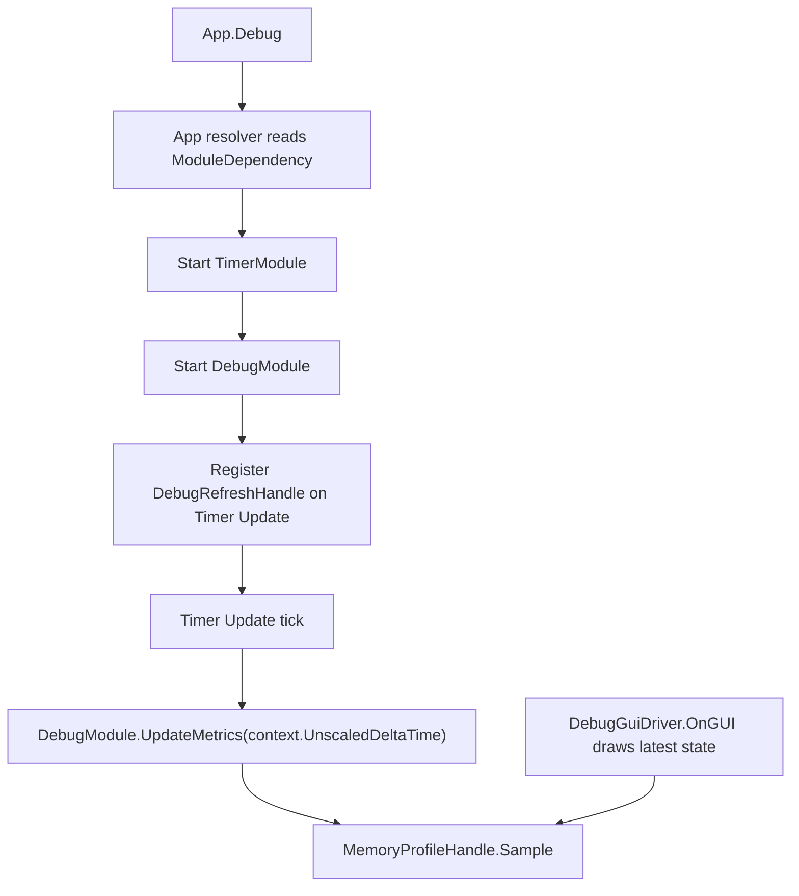

# debug-timer-refresh design

## 0. 术语约定

| 术语 | 定义 | 防冲突结论 |
|---|---|---|
| `DebugRefreshHandle` | Debug 内部注册到 Timer 的 Update update handle，用于驱动 metrics/profile refresh | 只负责 Debug refresh，不是新的公开 Timer handle 类型 |
| `DebugGuiDriver` | Debug IMGUI 的 Unity 生命周期桥接组件 | 本 feature 后只保留 `OnGUI()` 绘制桥接，不再通过 `Update()` 采样 metrics |
| `MemoryProfileHandle.Sample` | Debug 内建内存/metrics profile 的采样入口 | 继续作为计算节点，驱动来源从 GUI driver 改为 Timer handle |
| `ModuleDependency(typeof(TimerModule))` | DebugModule 对 TimerModule 的同步启动依赖声明 | 适配 App 按需 resolver，不回到默认预加载模型 |

## 1. 决策与约束

### 需求摘要

本 feature 消费 `runtime-scheduling-diagnostics` roadmap 的 `debug-timer-refresh` 条目：Debug metrics sampling 改由 Timer 的 `UpdateTimerHandle` 驱动，`DebugGuiDriver` 不再实现 `Update()`。这样 Debug 的刷新节奏进入统一 runtime scheduling 路径，后续 Procedure / Combat 也能按同一模式迁移。

成功标准：

- `App.Debug` 第一次按需访问时，App resolver 先启动 `TimerModule`，再启动 `DebugModule`。
- Debug startup 注册一个 Timer update handle，Timer Update 推进时触发 `MemoryProfileHandle.Sample()`。
- `DebugGuiDriver` 不再通过 Unity `Update()` 调用 `DebugModule.UpdateMetrics()`，只保留 `OnGUI()`。
- Debug shutdown / unregister 会取消 refresh handle，Timer snapshot 不再保留 Debug refresh handle。

### 明确不做

- 不把 IMGUI `OnGUI()` 改成 Timer 调用。
- 不迁移 Procedure / Combat driver；它们是后续 roadmap item。
- 不新增 NetworkModule、日志发送、transport、重试或批量上传。
- 不重命名 `GameDeveloperKit.Logger` namespace。
- 不改 `MemoryProfileHandle` 的采样算法、采样间隔语义或 sample ring buffer 容量。
- 不新增第二套 profile 接口。

### 复杂度档位

走 Runtime 模块接线默认档位，偏离点：

- `Integration = module-dependency`：Debug 需要通过 `[ModuleDependency(typeof(TimerModule))]` 明确依赖 Timer，而不是依靠旧默认启动顺序。
- `Robustness = L2`：refresh handle 由 Timer 的 update handle 异常隔离承接；Debug shutdown 必须取消 handle。
- `Observability = instrumented`：Timer snapshot 可看到 Debug refresh handle，便于验收和后续 Debug Timers tab 展示。

### 关键决策

1. DebugModule 声明 TimerModule 依赖。
   - 当前 App 已经按 `[ModuleDependency]` 递归启动模块，Debug 的 refresh 默认需要 Timer，因此依赖应该写在模块类型上。

2. 使用内部 `DebugRefreshHandle` 承接 refresh。
   - Debug 保存 handle 引用，shutdown 时取消。
   - refresh callback 使用 `TimerUpdateContext.UnscaledDeltaTime`，保持旧 `DebugGuiDriver.Update()` 使用 `Time.unscaledDeltaTime` 的采样口径。

3. 保留 `UpdateMetrics(float deltaTime)` 作为内部计算入口。
   - 现有测试和 `MemoryProfileHandle.Sample()` 仍能直接验证采样计算。
   - 本 feature 只改变驱动来源，不改变计算逻辑。

## 2. 名词与编排

### 2.1 名词层

#### 现状

- `DebugModule` 位于 `Assets/GameDeveloperKit/Runtime/Debug/DebugModule.cs`，管理 Debug lifecycle、profile registry、Unity log capture、Console/Command 薄入口和 `UpdateMetrics(float deltaTime)`。
- `MemoryProfileHandle` 位于 `Assets/GameDeveloperKit/Runtime/Debug/Profiles/MemoryProfileHandle.cs`，通过 `Sample(deltaTime)` 累计采样间隔并更新 `DebugMetricSnapshot`。
- `DebugGuiDriver` 位于 `Assets/GameDeveloperKit/Runtime/Debug/Console/DebugGuiDriver.cs`，当前同时实现 Unity `Update()` metrics 采样和 `OnGUI()` 绘制。
- `TimerModule` 已提供 `OnUpdate(Action<TimerUpdateContext>, owner, tag)` / `Register(TimerHandle, owner, tag)` 和 `TimerSnapshot.Updates`。

#### 变化

- `DebugModule` 增加 `[ModuleDependency(typeof(TimerModule))]`，确保按需访问 `App.Debug` 时 Timer 先启动。
- `DebugModule` 增加内部 refresh handle 引用，并在 startup / shutdown 中注册和取消。
- `UpdateTimerHandle` 允许派生，以便内部 `DebugRefreshHandle` 能按 roadmap 契约表达 Debug 的 refresh 适配器。
- `DebugGuiDriver` 删除 Unity `Update()` 采样职责，只保留 `OnGUI()` -> `DrawGui()`。

接口示例：

```csharp
// 来源：Assets/GameDeveloperKit/Runtime/Debug/DebugModule.cs DebugModule.Startup
[ModuleDependency(typeof(TimerModule))]
public class DebugModule : GameModuleBase
{
    public override void Startup()
    {
        RegisterRefreshHandle();
    }
}
```

```csharp
// 来源：Assets/GameDeveloperKit/Runtime/Debug/DebugModule.cs DebugRefreshHandle
internal sealed class DebugRefreshHandle : UpdateTimerHandle
{
    public DebugRefreshHandle(DebugModule module);
}
```

### 2.2 编排层



#### 现状

- Debug metrics refresh 由 `DebugGuiDriver.Update()` 每帧读取 Unity `Time.unscaledDeltaTime` 并调用 `DebugModule.UpdateMetrics()`。
- Debug 对 Timer 只通过 `App.TryGetRegistered<TimerModule>()` 读取 tick 或 Timers tab snapshot，不声明启动依赖。
- Timer update handle 已具备注册、异常隔离、snapshot 和 owner/tag。

#### 变化

- `DebugModule.Startup()` 在 profile 初始化和 Unity log capture 之后注册 refresh handle。
- `DebugModule.Shutdown()` 先取消 refresh handle，再清理 profile/log/gui 状态。
- `DebugRefreshHandle` 的 callback 调用 `UpdateMetrics(context.UnscaledDeltaTime)`；metrics disabled / module disabled 的现有 guard 继续由 `UpdateMetrics()` / `MemoryProfileHandle.Sample()` 承担。
- `DebugGuiDriver.OnGUI()` 继续绘制 Console、Profiles、Timers、Tools、Settings；不再参与采样。

#### 流程级约束

- refresh handle tag 固定为 `DebugModule.Refresh`，owner 为 DebugModule 实例。
- Debug 重复 startup 不应留下多个 active refresh handle。
- Debug shutdown / unregister 后，Timer snapshot 中不应再存在 owner 为该 DebugModule 的 refresh handle。
- refresh callback 抛异常时由 Timer update handle 的 `LastException` 记录，不阻断其他 Timer handles。
- 如果 DebugModule 被直接 new 后 standalone startup 且 Timer 未注册，本 feature 不提供额外独立 driver；标准路径是 App resolver。

### 2.3 挂载点清单

- `DebugModule` 类型声明：新增 `[ModuleDependency(typeof(TimerModule))]`。
- `DebugModule.Startup()`：注册 `DebugRefreshHandle` 到 Timer Update。
- `DebugModule.Shutdown()`：取消 Debug refresh handle。
- `DebugGuiDriver` Unity lifecycle：移除 `Update()` metrics 采样挂入点，保留 `OnGUI()` 绘制挂入点。

### 2.4 推进策略

1. 编排骨架：让 DebugModule 声明 TimerModule 依赖并保存 refresh handle。
   - 退出信号：`App.Register<DebugModule>()` 后 Timer 已注册，Debug 持有可取消的 refresh handle。
2. 驱动迁移：把 metrics sampling 接到 Timer Update handle。
   - 退出信号：手动推进 `App.Timer.Update(Update, delta, unscaledDelta)` 后 Debug metrics 产生 sample。
3. GUI driver 收口：移除 `DebugGuiDriver.Update()` 中的 metrics sampling。
   - 退出信号：反射确认 `DebugGuiDriver` 不再声明非公开 `Update()` 方法。
4. 测试覆盖：补 Debug 与 Timer 接线相关测试。
   - 退出信号：Debug tests 覆盖依赖启动、Timer 驱动采样、shutdown 取消和 GUI driver 无 Update。
5. 验证与回写：跑 Runtime / Tests 快速编译，完成 acceptance 回写。
   - 退出信号：编译通过，checklist checks 全部 passed，roadmap item 标记 done。

### 2.5 结构健康度与微重构

#### 评估

- 文件级 — `Assets/GameDeveloperKit/Runtime/Debug/DebugModule.cs`：约 481 行，职责偏多，但本次只新增一个 Timer 接线字段、两个 lifecycle helper 和一个小型内部 handle，属于 Debug lifecycle 的自然延伸。
- 文件级 — `Assets/GameDeveloperKit/Runtime/Debug/Console/DebugGuiDriver.cs`：约 510 行，职责偏多；本次删除 `Update()` 采样职责，实际降低 driver 职责。
- 文件级 — `Assets/GameDeveloperKit/Runtime/Timer/Handle/UpdateTimerHandle.cs`：小文件，只需放开 sealed 以允许 roadmap 约定的内部派生。
- 目录级 — `Assets/GameDeveloperKit/Runtime/Debug/`：已有 `Console` / `Profiles` / `Metrics` 分组，本次不新增文件，不扩大目录摊平。

#### 结论：不做前置微重构

理由：本 feature 是接线迁移，核心 diff 应保持小而可验。DebugModule / DebugGuiDriver 的拆分属于更大的结构整理，不能混进本次行为变更。当前改动通过删除 GUI driver 的 update 职责，已经朝后续拆分方向收敛。

#### 超出范围的观察

- `DebugModule.cs` 和 `DebugGuiDriver.cs` 都已接近或超过 500 行，后续如果继续增加 Debug 子域，建议走 `cs-refactor` 拆 lifecycle / GUI drawing 协作者；本 feature 不做。

## 3. 验收契约

### 关键场景清单

- N1：调用 `App.Register<DebugModule>()` 或访问 `App.Debug` → `TimerModule` 已由 resolver 先注册。
- N2：Debug startup 后读取 `App.Timer.Snapshot().Updates` → 存在 tag 为 `DebugModule.Refresh`、owner 为 `App.Debug` 的 update handle。
- N3：设置 `MetricSampleInterval = 0.1f`，推进 Timer Update `unscaledDeltaTime = 0.2f` → `App.Debug.Metrics` 更新，`MemoryProfile.SamplesCount == 1`。
- N4：关闭 `App.Debug.Enabled` 后推进 Timer Update → metrics 不继续采样。
- N5：`App.Unregister<DebugModule>()` 后读取 Timer snapshot → Debug refresh handle 已被取消并清理。
- B1：直接调用 `App.Debug.UpdateMetrics(0.2f)` → 旧内部采样计算仍能更新 metrics。
- E1：refresh callback 抛异常时由 Timer update handle 隔离；本 feature 不新增额外异常传播路径。

### 明确不做的反向核对项

- `DebugGuiDriver` 中不应再存在 `Update()` 方法。
- 代码中不应新增 NetworkModule、debug transport、retry、batch upload 或 sender。
- 代码中不应迁移 Procedure / Combat driver。
- 代码中不应新增第二套 profile 接口。
- 代码中不应重命名 `GameDeveloperKit.Logger` namespace。

## 4. 与项目级架构文档的关系

acceptance 阶段需要更新 `.codestable/architecture/ARCHITECTURE.md`：

- Debug 小节补充：DebugModule 声明 TimerModule 依赖，startup 注册 Timer `UpdateTimerHandle` 采样 metrics。
- Debug 小节补充：`DebugGuiDriver` 只保留 IMGUI `OnGUI` 桥接，不再负责 metrics/profile refresh。
- Timer / 已知约束补充：Debug 是首个 runtime module update adapter 落地项，Procedure / Combat 仍是后续 roadmap item。
