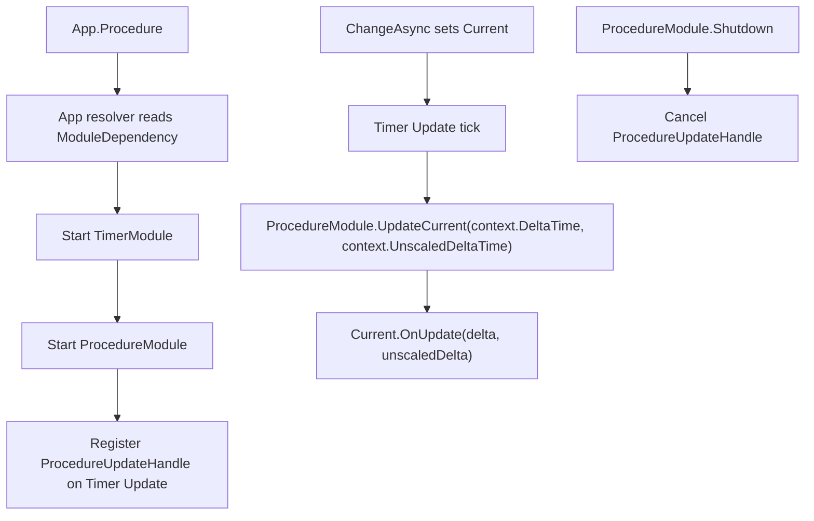

# procedure-timer-consumer design

## 0. 术语约定

| 术语 | 定义 | 防冲突结论 |
|---|---|---|
| `ProcedureUpdateHandle` | Procedure 内部注册到 Timer 的 `UpdateTimerHandle`，用于驱动当前 procedure 的 `OnUpdate` | 只负责 Procedure update 适配，不是新的公开 Timer handle 类型 |
| `ProcedureRuntimeDriver` | Procedure 旧的私有 `MonoBehaviour` update driver | 本 feature 删除该 driver，不再创建 `GameDeveloperKit.ProcedureRoot` |
| `ModuleDependency(typeof(TimerModule))` | ProcedureModule 对 TimerModule 的同步启动依赖声明 | 覆盖早期 Procedure 设计里“不依赖 Timer”的旧决定，按当前 roadmap 统一调度契约执行 |
| `UpdateCurrent` | ProcedureModule 内部调用当前 procedure `OnUpdate(deltaTime, unscaledDeltaTime)` 的计算入口 | 保留为内部计算节点，驱动来源从 Unity driver 改为 Timer update handle |

## 1. 决策与约束

### 需求摘要

本 feature 消费 `runtime-scheduling-diagnostics` roadmap 的 `procedure-timer-consumer` 条目：ProcedureModule 删除独立 runtime update driver，改为通过 Timer 的 `UpdateTimerHandle` 推进当前 procedure。这样 Procedure 的每帧更新进入统一 runtime scheduling 路径，后续 module profile handles 能从 Timer snapshot 统一观察 Debug / Procedure / Combat 等 adapter。

成功标准：

- `App.Register<ProcedureModule>()` 或访问 `App.Procedure` 时，App resolver 先启动 `TimerModule`，再启动 `ProcedureModule`。
- Procedure startup 注册一个 Timer update handle，handle tag 为 `ProcedureModule.Update`，owner 为 ProcedureModule 实例。
- Timer Update 推进时调用当前 procedure 的 `OnUpdate(context.DeltaTime, context.UnscaledDeltaTime)`。
- 切换期间不调用任何 procedure 的 `OnUpdate`，离开的 procedure 不再收到 update。
- Procedure shutdown / unregister 会取消 update handle，Timer snapshot 不再保留 Procedure update handle。
- Procedure 不再创建 `GameDeveloperKit.ProcedureRoot` 或 `ProcedureRuntimeDriver`。

### 明确不做

- 不迁移 Combat driver；它是后续 roadmap item。
- 不改变 Procedure enter / leave / pending request 的异步切换语义。
- 不新增 Procedure 的 LateUpdate / FixedUpdate 配置开关；首版固定使用 Timer Update。
- 不把 Resource / Config / UI / Command / Event 的职责并入 Procedure。
- 不新增内建 BootstrapProcedure、LoginProcedure 或业务流程模板。
- 不重新引入 Runtime `Startup.cs` 或默认模块预加载。
- 不新增第二套 update consumer 接口。

### 复杂度档位

走 Runtime 模块接线默认档位，偏离点：

- `Integration = module-dependency`：Procedure 需要通过 `[ModuleDependency(typeof(TimerModule))]` 明确依赖 Timer，而不是保留旧独立 driver。
- `Robustness = L2`：update handle 由 Timer 的异常隔离承接；Procedure shutdown 必须取消 handle。
- `Observability = instrumented`：Timer snapshot 可看到 Procedure update handle，便于验收和后续 module profile handles 展示。

### 关键决策

1. ProcedureModule 声明 TimerModule 依赖。
   - 早期 ProcedureModule 为了避免启动顺序耦合选择本地 driver；当前 App resolver 已经支持 `[ModuleDependency]`，roadmap 也已拍板 Timer 是 Runtime update 统一调度入口。

2. 使用内部 `ProcedureUpdateHandle` 承接 update。
   - Procedure 保存 handle 引用，shutdown 时取消。
   - callback 使用 `TimerUpdateContext.DeltaTime` / `UnscaledDeltaTime`，保持旧 driver 使用 `Time.deltaTime` / `Time.unscaledDeltaTime` 的口径。

3. 删除 Procedure runtime root。
   - 迁移后 Procedure 不再需要 `GameDeveloperKit.ProcedureRoot` GameObject。
   - `RootName` 仍可暂时保留为兼容测试/外部编译引用，但不再代表运行时必须存在的对象。

## 2. 名词与编排

### 2.1 名词层

#### 现状

- `ProcedureModule` 位于 `Assets/GameDeveloperKit/Runtime/Procedure/ProcedureModule.cs`，管理 procedure 注册表、当前流程、切换状态、pending request，并创建 `ProcedureRuntimeDriver`。
- `ProcedureRuntimeDriver` 是 `ProcedureModule` 内部 `MonoBehaviour`，Unity `Update()` 中调用 `UpdateCurrent(Time.deltaTime, Time.unscaledDeltaTime)`。
- `ProcedureBase.OnUpdate(float deltaTime, float unscaledDeltaTime)` 是业务流程每帧更新公开契约。
- `TimerModule` 已提供 `Register(TimerHandle, owner, tag)` / `OnUpdate(...)` 和 `TimerSnapshot.Updates`。

#### 变化

- `ProcedureModule` 增加 `[ModuleDependency(typeof(TimerModule))]`，确保按需访问 `App.Procedure` 时 Timer 先启动。
- `ProcedureModule` 用内部 `ProcedureUpdateHandle : UpdateTimerHandle` 注册到 Timer Update。
- `ProcedureModule.Startup()` 不再创建 `GameObject` / `ProcedureRuntimeDriver`，只初始化状态并注册 update handle。
- `ProcedureModule.Shutdown()` 先取消 update handle，再执行 current leave / release / pending 清理。
- `ProcedureRuntimeDriver` 从 ProcedureModule 中删除。

接口示例：

```csharp
// 来源：Assets/GameDeveloperKit/Runtime/Procedure/ProcedureModule.cs ProcedureModule
[ModuleDependency(typeof(TimerModule))]
public sealed class ProcedureModule : GameModuleBase
{
    public override void Startup()
    {
        RegisterUpdateHandle();
    }
}
```

```csharp
// 来源：Assets/GameDeveloperKit/Runtime/Procedure/ProcedureModule.cs ProcedureUpdateHandle
private sealed class ProcedureUpdateHandle : UpdateTimerHandle
{
    public ProcedureUpdateHandle(ProcedureModule module);
}
```

### 2.2 编排层



#### 现状

- Procedure update 由 `ProcedureRuntimeDriver.Update()` 每帧读取 Unity `Time.deltaTime` / `Time.unscaledDeltaTime`。
- Procedure startup 创建常驻 `GameDeveloperKit.ProcedureRoot`。
- Procedure 与 Timer 没有声明依赖，Timer snapshot 看不到 Procedure update 状态。

#### 变化

- `ProcedureModule.Startup()` 初始化 current/changing/pending 状态后注册 update handle。
- `ProcedureUpdateHandle` 的 callback 调用 `UpdateCurrent(context.DeltaTime, context.UnscaledDeltaTime)`。
- `UpdateCurrent()` 继续负责 `Current == null` / `IsChanging` guard。
- `ProcedureModule.Shutdown()` 取消 update handle，再执行 current leave/release 和注册表清理。
- Procedure 不再创建或销毁 runtime root GameObject。

#### 流程级约束

- update handle tag 固定为 `ProcedureModule.Update`，owner 为 ProcedureModule 实例。
- Procedure 重复 startup 不应留下多个 active update handle。
- Procedure shutdown / unregister 后，Timer snapshot 中不应再存在 owner 为该 ProcedureModule 的 update handle。
- update callback 抛异常时由 Timer update handle 的 `LastException` 记录，不阻断其他 Timer handles。
- Timer Update 之外的 LateUpdate / FixedUpdate 不驱动 Procedure。
- standalone `new ProcedureModule().Startup()` 且 Timer 未注册时不创建 fallback driver；标准路径是 App resolver。

### 2.3 挂载点清单

- `ProcedureModule` 类型声明：新增 `[ModuleDependency(typeof(TimerModule))]`。
- `ProcedureModule.Startup()`：注册 `ProcedureUpdateHandle` 到 Timer Update。
- `ProcedureModule.Shutdown()`：取消 Procedure update handle。
- `ProcedureModule` Unity lifecycle：移除 `ProcedureRuntimeDriver` / `GameDeveloperKit.ProcedureRoot` update 挂入点。

### 2.4 推进策略

1. 编排骨架：让 ProcedureModule 声明 TimerModule 依赖并保存 update handle。
   - 退出信号：`App.Register<ProcedureModule>()` 后 Timer 已注册，Procedure update handle 出现在 Timer snapshot。
2. 驱动迁移：把当前 procedure update 接到 Timer Update handle。
   - 退出信号：手动推进 `App.Timer.Update(Update, delta, unscaledDelta)` 后当前 procedure 收到相同 delta。
3. Runtime driver 收口：移除 ProcedureRuntimeDriver 和 ProcedureRoot 创建/销毁路径。
   - 退出信号：反射确认 ProcedureModule 不再声明嵌套 driver，startup 后不存在 Procedure root。
4. 测试覆盖：补 Procedure 与 Timer 接线相关测试并更新旧 root 断言。
   - 退出信号：Procedure tests 覆盖依赖启动、Timer 驱动更新、shutdown 取消、切换中跳过和无独立 driver。
5. 验证与回写：跑 Runtime / Tests 快速编译，完成 acceptance 回写。
   - 退出信号：编译通过，checklist checks 全部 passed，roadmap item 标记 done。

### 2.5 结构健康度与微重构

##### 评估

- compound convention 检索：未命中 Procedure Timer / 目录组织相关 convention。
- 文件级 — `Assets/GameDeveloperKit/Runtime/Procedure/ProcedureModule.cs`：约 465 行，集中承担 registry、change 状态机、pending request 和旧 runtime driver；本次删除 driver 并新增 Timer 接线，属于同一 lifecycle 职责的收口，净职责减少。
- 文件级 — `Assets/GameDeveloperKit/Tests/Runtime/ProcedureModuleTests.cs`：约 709 行，已有 Procedure 行为测试集中在同一文件；本次补接线测试会继续增大文件，但仍是同一模块测试主题。
- 目录级 — `Assets/GameDeveloperKit/Runtime/Procedure/`：当前 3 个 C# 文件，本次不新增 runtime 文件。

##### 结论：不做前置微重构

本 feature 直接在 `ProcedureModule` 内完成 driver 到 Timer handle 的迁移。拆分 ProcedureModule 或 ProcedureModuleTests 会把行为迁移和结构整理混在一起，风险高于收益。

##### 超出范围的观察

- `ProcedureModuleTests.cs` 已超过 700 行。后续如果继续增加 diagnostics/profile 测试，建议走 `cs-refactor` 按行为域拆测试文件；本 feature 不做。

## 3. 验收契约

### 关键场景清单

- N1：调用 `App.Register<ProcedureModule>()` 或访问 `App.Procedure` -> `TimerModule` 已由 resolver 先注册。
- N2：Procedure startup 后读取 `App.Timer.Snapshot().Updates` -> 存在 tag 为 `ProcedureModule.Update`、owner 为 `App.Procedure` 的 update handle。
- N3：当前流程为 A，推进 Timer Update `deltaTime = 0.03f`、`unscaledDeltaTime = 0.04f` -> A 的 `OnUpdate(0.03f, 0.04f)` 被调用。
- N4：当前流程由 A 切到 B 后推进 Timer Update -> A 不再更新，B 更新。
- N5：切换正在等待目标初始化时推进 Timer Update -> 当前流程不继续更新。
- N6：`App.Unregister<ProcedureModule>()` 后读取 Timer snapshot -> Procedure update handle 已被取消并清理。
- N7：Procedure startup 后场景中不存在 `GameDeveloperKit.ProcedureRoot`。
- E1：当前 procedure 的 `OnUpdate` 抛异常 -> Timer update handle 记录 `LastException`，异常不从 Timer Update 传播。

### 明确不做的反向核对项

- 代码中不应再存在 `ProcedureRuntimeDriver` 类型。
- 代码中不应新增 Combat driver 迁移。
- 代码中不应新增 Procedure LateUpdate / FixedUpdate 配置。
- 代码中不应新增 Resource / Config / UI / Command / Event 的职责实现。
- 代码中不应新增内建 BootstrapProcedure / LoginProcedure runtime 类型。
- 代码中不应恢复 Runtime `Startup.cs` 或默认预加载列表。

## 4. 与项目级架构文档的关系

acceptance 阶段需要更新 `.codestable/architecture/ARCHITECTURE.md`：

- Procedure 小节补充：ProcedureModule 声明 TimerModule 依赖，startup 注册 Timer `UpdateTimerHandle` 推进 current procedure。
- Procedure 小节补充：Procedure 不再创建 `GameDeveloperKit.ProcedureRoot` / `ProcedureRuntimeDriver`。
- Timer / 已知约束补充：Procedure 是第二个 runtime module update adapter 落地项，Combat 仍是后续 roadmap item。
