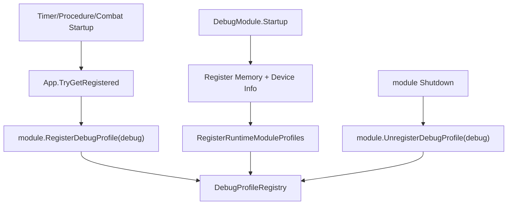

# runtime-module-profile-handles design

## 0. 术语约定

| 术语 | 定义 | 防冲突结论 |
|---|---|---|
| `Module Profile Handle` | 运行时模块自带的 `ProfileHandle`，在 Debug Profiles tab 中自绘模块状态 | 复用现有 `ProfileHandle`，不新增第二套 profile 接口 |
| `TimerProfileHandle` | Timer 模块状态 profile，展示 tick/time/handle 数量和 update handle 摘要 | 当前代码没有同名类型；作为 TimerModule 内部 profile 处理 |
| `ProcedureProfileHandle` | Procedure 模块状态 profile，展示 current/changing/pending/update handle 状态 | 当前代码没有同名类型；作为 ProcedureModule 内部 profile 处理 |
| `CombatProfileHandle` | Combat 模块状态 profile，展示 default world tick/time/frame rate/update handle 状态 | 当前代码没有同名类型；作为 CombatModule 内部 profile 处理 |
| `optional debug profile registration` | 模块启动时如果 Debug 已注册就挂 profile；Debug 启动时回扫已注册模块 | 不把 Timer/Procedure/Combat 声明为依赖 Debug，避免诊断能力反向绑死 runtime 模块 |

## 1. 决策与约束

### 需求摘要

本 feature 消费 `runtime-scheduling-diagnostics` roadmap 的 `runtime-module-profile-handles` 条目：Timer、Procedure、Combat 已经收敛到 Timer update handle 调度后，需要在 Debug Profiles tab 中统一暴露运行状态，便于运行时查看 tick、handle、当前流程、pending change 和 Combat world 状态。

成功标准：

- `DebugModule` 仍默认只内建注册 Memory 和 Device Info；Debug 状态 profile 不回归。
- `TimerModule` 启动且 Debug 已存在时，Profiles tab 自动出现 `Timer` profile；Debug 后启动时也能回扫已存在 Timer。
- `ProcedureModule` / `CombatModule` 在 Debug 前或 Debug 后启动时，都能把各自 profile 注册到 Debug。
- 模块 shutdown / unregister 时，如果 Debug 仍存在，会从 Profiles tab 注销自己的 profile。
- profile 绘制使用现有 `ProfileHandle.Name` + 派生类 `Draw()` 契约，不新增 table/snapshot profile API。

### 明确不做

- 不新增 DebugModule sink、analytics、transport 或旧 Debug 状态 profile。
- 不把 DebugModule 作为 Timer / Procedure / Combat 的 `[ModuleDependency]`。
- 不把 Debug Timers tab 删除或迁移；本 feature 只让 Profiles tab 也能看到 runtime module 状态。
- 不新增网络日志 bridge、NetworkModule payload 或发送逻辑。
- 不改变 Timer / Procedure / Combat 的调度语义、tick 口径或 world/procedure 更新流程。

### 复杂度档位

走 Runtime diagnostics 默认档位，偏离点：

- `Integration = optional-module-hook`：运行模块通过 `App.TryGetRegistered<DebugModule>()` 软接入 Debug；Debug 启动时回扫已注册模块。
- `Observability = profile-self-draw`：每个模块的 profile 直接从模块现有公开/内部状态绘制，不新增跨模块 DTO。
- `Robustness = L1`：Profile draw 异常继续由 `DebugProfileRegistry` 隔离；模块注册/注销 profile 走 registry 引用去重。

### 关键决策

1. 模块 profile 由模块自身持有。
   - Timer/Procedure/Combat 最了解自身状态，profile 可以读取已有字段和 snapshot。
   - 不新增公开状态对象，也不要求 DebugModule 复制模块内部状态。

2. Debug 接入是可选能力。
   - Timer/Procedure/Combat 不声明 Debug 依赖；无 Debug 时模块照常运行。
   - 模块 startup 后发现 Debug 已注册则注册 profile；Debug startup 后回扫已注册模块，覆盖“先模块后 Debug”的启动顺序。

3. profile 类保持模块内部实现。
   - 当前 Unity csproj 是生成文件，本次不为小型自绘 profile 额外扩散公开文件和 project include。
   - 内部嵌套类可以读取模块私有状态，避免为了诊断显示新增多余 public API。

## 2. 名词与编排

### 2.1 名词层

#### 现状

- `ProfileHandle` 位于 `Assets/GameDeveloperKit/Runtime/Debug/Profiles/ProfileHandle.cs`，公开契约只有 `Name` 和派生类自绘 `Draw()`。
- `DebugModule` 位于 `Assets/GameDeveloperKit/Runtime/Debug/DebugModule.cs`，startup 只注册 `MemoryProfileHandle` 和 `DeviceInfoProfileHandle`。
- `TimerModule.Snapshot()` 已暴露 tick/time/delta 与 active delay/countdown/interval/update handles。
- `ProcedureModule` 已暴露 `CurrentType`、`IsChanging`、`HasPendingChange`、`PendingChangeType`，并保存内部 Timer update handle。
- `CombatModule` 已暴露默认 `World`，world 公开 `Tick`、`Time`、`FrameRate`、`FixedDeltaTime`。

#### 变化

- `TimerModule` 增加内部 `TimerProfileHandle : ProfileHandle`，Name 为 `Timer`，Draw 从 `Snapshot()` 展示 clock 和 handle 摘要。
- `ProcedureModule` 增加内部 `ProcedureProfileHandle : ProfileHandle`，Name 为 `Procedure`，Draw 展示 current/pending/change 状态和 update handle 摘要。
- `CombatModule` 增加内部 `CombatProfileHandle : ProfileHandle`，Name 为 `Combat`，Draw 展示 default world 与 fixed update handle 摘要。
- `DebugModule.Startup()` 注册 Memory / Device Info 后，回扫已注册 Timer / Procedure / Combat 并调用模块内部 debug profile 注册方法。
- Timer / Procedure / Combat startup/shutdown 在 Debug 已注册时注册/注销自身 profile。

接口示例：

```csharp
// 来源：Assets/GameDeveloperKit/Runtime/Debug/Profiles/ProfileHandle.cs ProfileHandle
public abstract class ProfileHandle
{
    public abstract string Name { get; }
    protected internal abstract void Draw();
}
```

```csharp
// 来源：Assets/GameDeveloperKit/Runtime/Timer/TimerModule.cs TimerModule
internal void RegisterDebugProfile(DebugModule debug);
internal void UnregisterDebugProfile(DebugModule debug);
```

### 2.2 编排层



#### 现状

- Debug Profiles tab 只显示手动注册 profile，以及 Debug startup 默认注册的 Memory / Device Info。
- Timer 状态只在 Debug Console 的 Timers tab 中绘制，Profiles tab 没有 Timer profile。
- Procedure / Combat 已能通过 Timer snapshot 看到 update handle，但 Profiles tab 看不到 current procedure 或 world 状态。

#### 变化

- 各模块 startup 后调用内部 `TryRegisterDebugProfile()`；Debug 不存在时 no-op。
- Debug startup 后调用 `RegisterRuntimeModuleProfiles()`，对已注册的 Timer / Procedure / Combat 补挂 profile。
- 各模块 shutdown 前调用内部 `TryUnregisterDebugProfile()`；Debug 不存在或 profile 已被 Debug shutdown 清空时 no-op。
- `DebugProfileRegistry.Register()` 已按引用去重，因此 Debug 回扫与模块 startup 重复调用不会产生重复 profile。

#### 流程级约束

- Debug 仍只把 Memory 和 Device Info 当作内建默认 profile；模块 profile 是“已启动模块的运行时诊断表”。
- Timer / Procedure / Combat 不因 Debug 缺失而抛错。
- profile 名称固定为 `Timer` / `Procedure` / `Combat`。
- 单个 profile draw 抛异常时继续由 `DebugProfileRegistry.Draw()` 隔离，不在模块侧额外捕获。
- 模块 shutdown 时先注销 profile，再清理关键运行状态，避免 Debug Profiles tab 残留已释放模块引用。

### 2.3 挂载点清单

- `DebugModule.Startup()`：在内建 profile 注册后回扫已注册 runtime modules。
- `TimerModule.Startup()` / `Shutdown()`：软注册/注销 Timer profile。
- `ProcedureModule.Startup()` / `Shutdown()`：软注册/注销 Procedure profile。
- `CombatModule.Startup()` / `Shutdown()`：软注册/注销 Combat profile。

### 2.4 推进策略

1. 编排骨架：给 Debug 和三个 runtime 模块建立可选 profile 注册/回扫路径。
   - 退出信号：Debug 先启动或后启动时，都能把已启动模块 profile 放入 registry。
2. Timer profile：实现 Timer 自绘 profile，展示 clock 和 handle 摘要。
   - 退出信号：`Timer` profile 注册后 draw 使用 `TimerSnapshot`，不引入新公开 DTO。
3. Procedure / Combat profile：实现 current procedure 与 default world 自绘 profile。
   - 退出信号：`Procedure` / `Combat` profile 能读取已有模块状态和 update handle 状态。
4. 测试覆盖：补 Debug/Profile registry 与模块启动顺序相关测试。
   - 退出信号：覆盖 Debug-before/after、模块 shutdown 注销、默认内建 profile 不回归 Debug profile。
5. 验证与回写：跑 Runtime / Tests 快速编译，完成 acceptance 回写。
   - 退出信号：编译通过，checklist checks 全部 passed，roadmap item 标记 done。

### 2.5 结构健康度与微重构

##### 评估

- compound convention 检索：未命中 runtime profile / 目录组织相关 convention。
- 文件级 — `Assets/GameDeveloperKit/Runtime/Debug/DebugModule.cs`：约 560 行，已有 profile lifecycle 与 Timer refresh 接线；本次只新增 runtime profile 回扫方法，仍属于 Debug profile registry lifecycle。
- 文件级 — `Assets/GameDeveloperKit/Runtime/Timer/TimerModule.cs`：约 490 行，已有 Timer lifecycle、snapshot、handle 注册；本次新增一个小型内部 profile 和软 Debug 注册，不改变调度主体。
- 文件级 — `Assets/GameDeveloperKit/Runtime/Procedure/ProcedureModule.cs`：约 460 行，已有 lifecycle、change 状态机和 update handle；本次 profile 只读取已有状态。
- 文件级 — `Assets/GameDeveloperKit/Runtime/Combat/CombatModule.cs`：约 100 行，职责集中；本次 profile 只读取默认 world 与 update handle。
- 目录级 — `Assets/GameDeveloperKit/Runtime/Debug/Profiles/`：已有多个 profile 相关文件，但本次不新增 Debug profile 基类或表格协议文件。

##### 结论：不做前置微重构

本 feature 的 profile 类保持在对应模块内部，减少额外公开状态面和 Unity 生成 csproj include 变更。DebugModule 只新增回扫接线，不拆分现有 profile registry lifecycle。

##### 超出范围的观察

- `DebugGuiDriver` 仍保留单独 Timers tab，和新的 Timer profile 会有部分信息重复。是否合并 tab 属于 Debug Console 信息架构调整，建议后续另起 feature/refactor。

## 3. 验收契约

### 关键场景清单

- N1：只启动 DebugModule -> Profiles 中存在 Memory、Device Info、Timer；不存在 Debug 状态 profile。
- N2：先启动 TimerModule，再启动 DebugModule -> Profiles 中出现 Timer profile。
- N3：先启动 DebugModule，再启动 ProcedureModule -> Profiles 中出现 Procedure profile。
- N4：先启动 CombatModule，再启动 DebugModule -> Profiles 中出现 Combat profile。
- N5：注销 ProcedureModule / CombatModule / TimerModule -> Debug Profiles 中对应 profile 被移除。
- N6：Timer profile draw -> 能读取 tick/time/delta 和 delay/countdown/interval/update handle 数量，不抛异常。
- N7：Procedure profile draw -> 能读取 current type、changing、pending type 和 update handle 状态，不抛异常。
- N8：Combat profile draw -> 能读取 default world tick/time/frame rate/fixed delta 和 update handle 状态，不抛异常。

### 明确不做的反向核对项

- 代码中不应新增 Debug sink / analytics / transport API。
- 代码中不应把 DebugModule 加为 Timer / Procedure / Combat 的 ModuleDependency。
- 代码中不应恢复 Debug 状态默认 profile。
- 代码中不应删除 Debug Console 的 Timers tab。
- 代码中不应新增 Network debug log bridge 或 payload。

## 4. 与项目级架构文档的关系

acceptance 阶段需要更新 `.codestable/architecture/ARCHITECTURE.md`：

- Debug 小节补充：Debug startup 会回扫已注册 Timer / Procedure / Combat 并注册模块 profile；模块启动时也会在 Debug 已存在时软注册 profile。
- Timer 小节补充：Timer 提供 `Timer` profile，自绘 clock 与 handles 状态。
- Procedure 小节补充：Procedure 提供 `Procedure` profile，自绘 current/pending/change/update handle 状态。
- Combat 小节补充：Combat 提供 `Combat` profile，自绘 default world 与 fixed update handle 状态。
