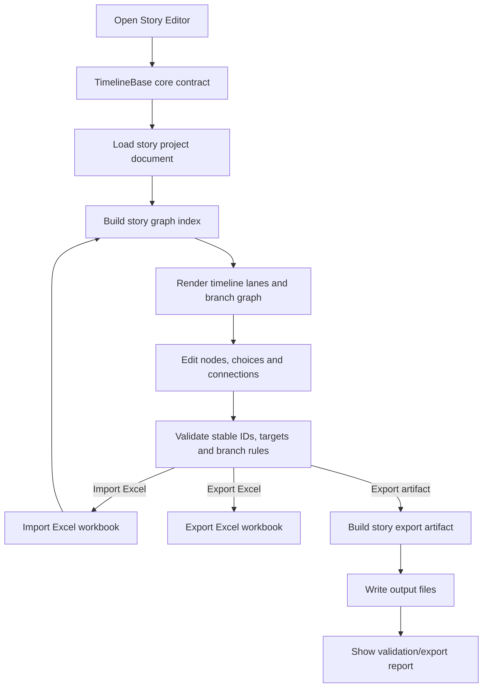

# story-editor design

## 0. 术语约定

| 术语 | 定义 | 防冲突结论 |
|---|---|---|
| story project | 一个剧情作者工程，保存节点、分支、布局、导入/导出配置和版本信息 | 这是编辑器侧源文档，不等于 Excel，也不等于运行时存档 |
| story graph | 剧情逻辑图，节点与分支边组成的有向图 | 逻辑关系以节点 ID / 边为准，不以时间轴上的视觉顺序为准 |
| timeline lane | 编辑器里的视觉布局轨道，用来摆放节点 | 只是展示层，不是剧情顺序的唯一真相 |
| story node | 剧情中的一个 beat、对白段、选择触发点或结尾节点 | 不是 `Procedure` 节点，也不是 UI 节点 |
| story choice | 节点上可弹出的一个选项 | 不是普通下拉框的选项数据 |
| branch edge | 从一个 choice 指向后续节点的连接 | 这是剧情分支，不是配置分组 |
| `TimelineBase` | Core 下所有 timeline 类的通用基类，提供时间轴身份、时长、当前时间和求值入口 | 它是薄 Core 抽象，不负责播放调度、存档、配置加载或 Editor UI |
| story export artifact | 从 story project 导出的结构化剧情配置文件 | 本 feature 只保证结构稳定和可校验，不指定运行时由哪个模块读取 |
| Excel exchange workbook | 用于导入 / 导出的表格文件 | 只是交换格式，不是唯一真源 |

## 1. 决策与约束

### 需求摘要

做什么：新增一个 Unity Editor 剧情时间线工具，能在时间线上摆放剧情节点、配置选项和分支；同时在 Core 下提供 `TimelineBase`，作为后续所有 timeline 类的共同基类；编辑器支持 Excel 导入 / 导出，校验节点关系，并输出结构稳定的剧情配置文件。

为谁：负责剧情内容的策划 / 叙事设计师，以及需要拿到稳定剧情配置产物的玩法程序。

成功标准：

- 能在 Editor 里创建 / 打开一个 story project，并看到可编辑的 timeline 视图。
- Core 下存在 `TimelineBase`，剧情编辑器自己的 timeline 类型继承它。
- 能在节点上挂选项，选项能连到后续节点，分支关系可视化且可校验。
- 能从 Excel 导入剧情内容，并把同一份内容导回 Excel。
- 导入、导出和 story export artifact 之间的 node id / choice id / branch target 保持稳定。
- story export artifact 包含后续流程可读取的节点、选项、分支和元数据。
- Excel 不是唯一源文档；编辑器的 story project 仍保留为作者源文档。

### 明确不做

- 不做完整的对话播放器、字幕系统、语音同步、镜头轨道或过场动画时间线。
- 不替代 `ProcedureModule`，也不把剧情编辑器做成顶层流程状态机。
- 不把 Excel 当成唯一真源，Excel 只是交换格式。
- 不联动 `ConfigModule`、`DataModule`、`ProcedureModule`、`ResourceModule` 等运行时模块。
- 不定义玩家剧情进度、存档格式或运行时播放 API。
- 不在这一步引入框架级 `StoryModule`。
- `TimelineBase` 不内建 Unity Update、Timer handle、播放队列、资源加载、存档或配置读取。

### 复杂度档位

- `Robustness = L3`：Excel、导入文件和配置输出都是外部输入，必须有明确校验和错误语义。
- `Structure = modules`：编辑器作者工具、Excel exchange、graph validation 和 export artifact 分开，不塞进一个大窗口。
- `Concurrency = single-runner`：导入、导出、校验和 artifact 写入同一时间只允许一个任务。
- `Idempotency = idempotent`：同一份 workbook 重复导入、同一张图重复导出不应引入重复节点或漂移。

### 关键决策

1. 以 story project 作为作者侧源文档，Excel 只是 round-trip 交换格式。
   - 采用：编辑器直接维护图结构和布局，导入 / 导出时才映射到 workbook。
   - 拒绝：把 Excel 当成唯一编辑源，靠行号和 sheet 顺序当真相。
   - 原因：分支图需要稳定 ID 和显式连接，单靠表格顺序太脆。

2. 逻辑身份用稳定 ID，时间线位置只管展示。
   - 采用：node id、choice id、branch target 作为逻辑关系主键。
   - 拒绝：用 timeline 上的前后顺序代替逻辑边。
   - 原因：节点拖拽、重排、分轨后，关系不应该跟着布局一起变。

3. 导出只产出 artifact，不绑定 runtime module。
   - 采用：story export artifact 只声明结构、ID、节点、选项和分支。
   - 拒绝：在本 feature 里决定 `ConfigModule` / `DataModule` / `ProcedureModule` 如何接入。
   - 原因：这些模块明确是运行时职责，剧情编辑器只负责 authoring 产出。

4. 首版只做编辑器与文件产出，不做 runtime presenter。
   - 采用：编辑器输出可校验文件和导出报告。
   - 拒绝：这一步就把 UI 播放器、镜头、语音、流程控制或存档接入全包进来。
   - 原因：那会把一个作者工具膨胀成运行时系统。

5. `TimelineBase` 是 Core 薄基类，不是 runtime 播放器。
   - 采用：`TimelineBase` 只表达 `Name`、`Duration`、`CurrentTime`、`Seek/Evaluate` 和 `Release` 这类所有 timeline 都能共享的最小契约。
   - 拒绝：把分支图、节点集合、轨道 UI、Excel 导入、播放调度或 `TimerModule` 接入塞进基类。
   - 原因：Core 基类会被后续所有 timeline 继承，必须保持窄而稳定。

## 2. 名词与编排

### 2.1 名词层

#### 现状

- `Assets/GameDeveloperKit/Runtime/Core/` 当前有 `IReference`、`ReferencePool`、`GameException`、`IGameModule` 和 dependency attributes，但没有 timeline 基类。
- `Assets/GameDeveloperKit/Runtime/Config/ConfigModule.cs`、`Assets/GameDeveloperKit/Runtime/Data/DataModule.cs`、`Assets/GameDeveloperKit/Runtime/Procedure/ProcedureModule.cs` 都是运行时模块，不是本 feature 的联动落点。
- `Assets/GameDeveloperKit/Editor/` 里已有 LubanConfigEditor、ResourceEditor、TagEditor 等工具，但没有剧情时间线编辑器。
- 仓库里没有剧情时间线编辑器、story graph、choice 分支或 Excel round-trip 的现成 authoring 契约。

#### 变化

- `StoryProject`：剧情作者工程的顶层文档，保存 meta、graph、布局、导入 / 导出配置和版本信息。
- `TimelineBase`：Core 通用基类，剧情 timeline 和后续其他 timeline 统一继承它。
- `StoryGraph`：节点与分支边组成的逻辑图。
- `StoryNode`：剧情 beat、对白段、选择触发点或结尾节点。
- `StoryChoice`：一个可供玩家选择的分支选项。
- `StoryBranch`：从一个 choice 指向后续节点的显式连接。
- `StoryWorkbook`：Excel 导入 / 导出时使用的中间模型。
- `StoryExportArtifact`：导出的结构化配置产物，包含 meta、nodes、choices、branches 和 schema/version。
- `StoryExportReport`：导出结果，记录输出路径、schema version、节点数、选项数、分支数和错误。

接口示例：

```csharp
public abstract class TimelineBase : IReference
{
    public virtual string Name => GetType().Name;
    public float Duration { get; protected set; }
    public float CurrentTime { get; private set; }

    public void Seek(float time);
    public void Evaluate(float time);
    protected abstract void OnEvaluate(float time);
    public virtual void Release();
}
```

```csharp
StoryTimeline timeline = project.Timeline;
timeline.Seek(12.5f);
timeline.Evaluate(timeline.CurrentTime);
StoryNode node = project.Graph.GetNode("intro_010");
IReadOnlyList<StoryChoice> choices = node.Choices;
```

```csharp
StoryImportReport importReport = StoryWorkbookImporter.Import(workbookPath, project);
StoryExportReport exportReport = StoryWorkbookExporter.Export(project, workbookPath);
```

```csharp
StoryExportArtifact artifact = StoryExporter.Build(project);
StoryExportReport report = StoryExporter.Write(artifact, outputPath);
```

### 2.2 编排层



#### 现状

- 现在没有 story graph 的加载、编辑、校验或 round-trip 编排。
- 现有 Editor 工具都偏单域：配置编辑、资源编辑、标签编辑各自负责自己的窗口和导入导出流程。

#### 变化

1. story project 作为作者侧唯一入口。
   - 编辑器 timeline 类型继承 `TimelineBase`。
   - 编辑器先加载 project，再从 project 生成 graph index。
   - timeline 视图只负责展示和编辑，不当逻辑主键。

2. choice 节点显式产生 branch edge。
   - 一个 node 可以有 0 个或多个 choices。
   - 每个 choice 指向一个后续 node，分支和回收都通过显式 edge 表达。

3. Excel 导入 / 导出使用同一套 normalized workbook 结构。
   - 导入时把 workbook 还原成 project。
   - 导出时把 project 拆成 workbook。
   - 首版把 graph 约束成 forward-only；merge points 可用，未经标注的回边 / 循环拒绝。

4. 导出产物只表达 authoring 结果。
   - story export artifact 包含 schema version、story meta、nodes、choices、branches。
   - 导出前必须通过 graph validation。
   - 后续运行时读取、播放、存档另起 feature 设计。

#### 流程级约束

- 错误语义：重复 node id、缺失 choice target、非法 branch、Excel 解析失败、导入缺列、导出失败都必须带 story id / node id / choice id / workbook path。
- 幂等性：同一 workbook 导入同一空 project 时结果应一致；同一 project 重复导出不得产生新的逻辑 ID。
- 顺序：先建 index，再 validate，再 export；不允许带着无效 graph 输出 artifact。
- 并发：导入、导出、校验、artifact 写入都单 runner；运行中不并行写同一个 project。
- 可观测点：import / export report 要显示节点数、choice 数、branch 数和被拒绝项。

### 2.3 挂载点清单

1. `GameDeveloperKit/Story Editor` 菜单项：删除后用户无法打开剧情编辑器。
2. `TimelineBase` Core 契约：删除后 story timeline 和后续 timeline 类型失去共同基类。
3. story project 创建 / 打开入口：删除后没有作者源文档，编辑器失去工作对象。
4. Excel import / export 按钮：删除后无法和外部表格交换剧情内容。
5. story export artifact schema：删除后无法产出结构稳定的剧情配置文件。
6. validation / export report：删除后导入导出错误无法定位到具体 node / choice / workbook path。

拔除沙盘：去掉这些挂载点后，剧情时间线编辑、Excel round-trip 和结构化剧情配置导出应一起消失；运行时模块不受影响。

### 2.4 推进策略

1. Core 时间线基类：建立 `TimelineBase` 的最小时间轴契约。
   - 退出信号：剧情 timeline 类型能继承 `TimelineBase`，并通过 `Seek/Evaluate` 驱动当前时间求值。
2. 编辑器外壳和 project 契约：把 project / graph / node / choice 的 authoring 形状定下来。
   - 退出信号：能打开空 project，生成稳定 node id，并保存基础元数据。
3. 时间线画布和节点编辑：实现节点摆放、移动、删除、连接和选项编辑。
   - 退出信号：能在画布上增删节点，choice edge 能可视化连到目标节点。
4. 图校验和归一化：实现 ID、target、branch 规则检查以及导出前归一化。
   - 退出信号：非法图会被拒绝，合法图能标记为可导出。
5. Excel 导入：把 workbook 还原成 story project。
   - 退出信号：一份已知样例 workbook 能完整导入，节点和分支数匹配。
6. Excel 导出：把 story project 写回 workbook。
   - 退出信号：导出后重新导入，支持字段的逻辑内容保持一致。
7. 配置产物导出：从 project 生成 story export artifact 和导出报告。
   - 退出信号：输出文件包含 meta、nodes、choices、branches 和 schema version，报告显示数量与路径。
8. 验证覆盖：补齐 Core 基类、导入 / 导出 / 校验 / artifact 导出的测试或手工证据。
   - 退出信号：关键验收场景都有可复核结果。

### 2.5 结构健康度与微重构

##### 评估

- 文件级 — `Assets/GameDeveloperKit/Runtime/Core/`：当前没有 timeline 基类；新增一个薄 `TimelineBase` 不要求搬迁现有 Core 文件。
- 文件级 — `Assets/GameDeveloperKit/Runtime/Config/ConfigModule.cs` / `Assets/GameDeveloperKit/Runtime/Data/DataModule.cs` / `Assets/GameDeveloperKit/Runtime/Procedure/ProcedureModule.cs`：本 feature 不修改这些 runtime 模块。
- 目录级 — `Assets/GameDeveloperKit/Editor/StoryEditor/`：这是新目录，当前为空，适合一开始就按 window / model / importer / exporter / validator 分离。
- 目录级 — `Assets/GameDeveloperKit/Runtime/`：不新增 story runtime 目录；剧情编辑器不把 authoring 契约落进 runtime 层。

##### 结论：不做微重构

本次不搬迁现有 Runtime 模块，也不重组现有 Editor 工具目录。原因：`TimelineBase` 可以作为单个 Core 基类新增，Story Editor 可以直接落到新的 Editor story 目录里，产物只是文件和 report，不需要 runtime 模块作为前置。

##### 建议沉淀的 convention

- 编辑器作者工具按 `window / model / importer / exporter / validator` 分文件。
- Editor-only 工作流放 `Editor/StoryEditor/`。
- 所有 timeline 类继承 Core 下的 `TimelineBase`，但 `TimelineBase` 只放通用时间轴契约。
- `ConfigModule`、`DataModule`、`ProcedureModule` 保持 runtime 边界，不加 story editor 专用入口。

##### 超出范围的观察

- 如果后续要做镜头、音频、动画、过场同步，那是另一条 timeline / cutscene feature，不是本次剧情节点编辑器。
- 如果后续要做运行时读取、对话播放器、存档或程序化剧情状态机，那应另起 runtime feature，不并入这次 editor authoring。

## 3. 验收契约

| 编号 | 输入 / 触发 | 期望可观察结果 |
|---|---|---|
| N1 | 定义 story timeline 类型 | 它继承 Core 下的 `TimelineBase`，不依赖 `ConfigModule` / `DataModule` / `ProcedureModule` |
| N2 | 调用 `TimelineBase.Seek/Evaluate` | 当前时间被限制在合法范围内，并触发派生 timeline 的求值入口 |
| N3 | 打开 Story Editor 并创建一个新 project | 出现空 timeline，能保存基础元数据 |
| N4 | 在一个 node 上添加两个 choice 并分别连接到后续节点 | timeline 中能看到两条 branch edge，target 可校验 |
| N5 | 拖动 node 改变视觉位置 | 逻辑 ID 和 branch target 不变，只改变布局 |
| N6 | 导入一份有效 Excel workbook | project 中的 node / choice / branch 数与 workbook 一致 |
| N7 | 导出当前 project 到 Excel 后重新导入 | 支持字段的逻辑内容保持一致，稳定 ID 不漂移 |
| N8 | 导出 story export artifact | 输出文件包含 schema version、meta、nodes、choices、branches |
| N9 | 查看 export report | 报告显示输出路径、节点数、选项数、分支数和 schema version |
| B1 | workbook 中存在重复 node id 或缺失 choice target | 导入失败，错误信息包含 workbook path 和 offending id |
| B2 | workbook 中存在未经标注的回边 / 循环 | 校验失败，错误信息明确指出循环或非法 branch |
| B3 | workbook 缺少 node / choice 必填列 | 导入失败，不生成半成品 project |
| E1 | 实现中把 Excel 当成唯一真源，编辑器不保留 story project | 判定为错误 |
| E2 | 实现中修改或依赖 `ConfigModule` / `DataModule` / `ProcedureModule` / `ResourceModule` | 判定为错误 |
| E3 | 实现中为这一步新增完整 runtime 对话播放器 / 过场系统 | 判定为超范围 |
| E4 | 实现中定义玩家剧情进度、存档格式或运行时播放 API | 判定为超范围 |
| E5 | `TimelineBase` 内置 Timer/Update 播放调度、资源加载、存档或配置读取 | 判定为错误 |

### 明确不做的反向核对项

- 不应出现把 timeline 位置当作节点主键的实现。
- 不应出现 Excel row order 决定剧情逻辑的实现。
- 除新增 Core `TimelineBase` 外，不应出现改动 runtime 模块来实现本 feature 的行为。
- `TimelineBase` 不应出现 Timer、Config、Data、Procedure、Resource 或 Editor API 依赖。
- 不应出现完整的 runtime 对话 / 镜头 / 音频播放器实现。
- 不应出现玩家进度、存档或运行时播放 API。

## 4. 与项目级架构文档的关系

验收通过后需要更新 `.codestable/architecture/ARCHITECTURE.md`：

- 记录 Story Editor 是 Editor-only authoring 工具。
- 记录 Core 提供 `TimelineBase` 作为后续所有 timeline 类的共同基类。
- 记录 story project / story graph / story export artifact 的概念分层。
- 记录 Excel 只是 authoring round-trip 交换格式，不是唯一源文档。
- 记录本 feature 不联动 runtime modules；后续运行时读取 / 播放 / 存档另起 feature。
