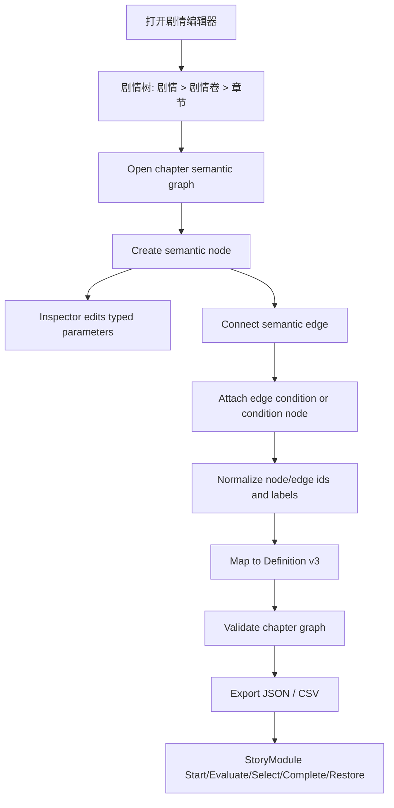

# story-editor semantic graph redesign

## 0. 术语约定

| 术语 | 定义 | 防冲突结论 |
|---|---|---|
| Story Editor | Unity Editor 内的剧情 authoring 工具 | Editor-only，不播放剧情，不负责资源加载 |
| story / 剧情 | 一份剧情定义的根，包含版本和初始剧情卷 | 对应 runtime `Definition`，v3 不再把 volume 作为执行层；入口章节由初始剧情卷决定 |
| editor volume / 剧情卷 | Editor 里的章节分组，保存卷标题与初始章节 | 只服务 authoring 导航和组织；不进入 runtime `Definition` / snapshot 主契约 |
| chapter / 章节 | 一张可执行语义图，包含 entry node、semantic nodes 和 edges | 继续对应 runtime `ChapterDefinition`，但不再包含 owner action/transition 子集合 |
| semantic node / 语义节点 | 图上的一等剧情步骤，如 Dialogue、Play Video、Choice、Set Flag、MiniGame、Condition Branch | 替代 v2 `story node + Actions/Interactions/Transitions` 附件模型 |
| action node / 功能节点 | 会触发表现或外部系统的语义节点，如 Play Video、Dialogue、Emit Event、Set Flag | 不是某个 story node 的子参数；直接进入主流程 |
| interaction node / 交互节点 | 需要玩家或外部输入的语义节点，如 Choice、QTE、Hotspot、MiniGame | 以语义出口推进，而不是通过 hidden interaction id |
| edge / 连线 | 从节点某个语义出口到目标节点/章节/剧情结束的跳转 | 替代默认 transition node；edge 可带 label、conditions、target |
| port label / 出口标签 | 用户可见的出口名，如 完成、成功、失败、选项：救人 | 与内部稳定 `portId` 分离，禁止把 `next_2` 当主要标题 |
| parameter / 参数 | 节点类型化字段，如 Clip、Text Key、Event Id、Wait Result | Editor 不暴露 `Payload` 名称；导出 runtime 时再映射到 `Payload` |
| condition node / 条件节点 | 可复用或可组合的条件计算节点，如 Flag Check、Compare、And/Or/Not | 简单条件可挂在 edge 上，复杂条件才展开成节点 |
| auxiliary node / 辅助节点 | 只服务编辑体验或整理图的节点，如 Reroute、Comment、Group、Portal、Bookmark、Todo | 不一定进入 runtime；导出时按类型忽略或转为 debug metadata |
| story tree | 左侧导航树：剧情 > 剧情卷 > 章节 | 不列出 unit、node、action、condition、edge；剧情卷是编辑器分组，不是 runtime 执行层 |

## 1. 决策与约束

### 需求摘要

做什么：把 v2 的 `story > volume > chapter > story node + action/interaction/condition/transition 附件` 重设计为 v3 的 `story > chapter > semantic nodes + edges`。GraphView 是主要编辑面，action/function/interaction/condition/auxiliary 都可以是节点；transition 默认是语义连线；Inspector 只编辑选中节点或 edge 的少量类型化参数，不再暴露 `Payload`、owner port、`next_2` 这类内部结构。

为谁：剧情策划、叙事设计师、玩法程序，以及需要消费稳定 runtime definition 的表现层实现者。

成功标准：

- 左侧 story tree 只显示 `剧情 / 剧情卷 / 章节`，不再出现 unit 或图元素明细；剧情卷只作为编辑器分组。
- 章节画布里的节点标题表达剧情意图，如 `播放开场视频`、`选择：是否救人`、`小游戏：撬锁`，而不是 `next_2` 或内部 id。
- Action/function 节点是一等流程节点，可从画布菜单和端口拖拽创建，不需要先右键某个 owner story node。
- Transition 默认是 edge，edge 的出口显示语义 label；只有 debug 或复杂路由需要时才显示独立辅助节点。
- `Payload` 在 UI 中替换为节点类型化 Parameters；runtime 可继续用 `Payload` 作为导出内部格式。
- Runtime definition 以 chapter graph 的 nodes + edges 推进，不再要求 `VolumeDefinition`、owner `Actions/Interactions/Transitions` 或 `UnitDefinition` 主流程。
- CSV/JSON export 使用 chapters、nodes、edges、parameters、conditions、layout；不输出 volumes / units / owner-actions / owner-transitions sheet。

### 明确不做

- 不做运行时表现层：不播放视频、音频、对白、镜头、动画或小游戏。
- 不把 Resource/Localization/Data/Procedure 接入 StoryModule；调用方仍负责加载定义、解析文本和持久化 snapshot。
- 不引入 Lua、表达式 VM、通用变量黑板或任务系统；条件、flag、外部动作结果仍由调用方 resolver/handler 提供。
- 不把 volume 或 unit 作为 runtime 主执行层；volume 只作为 editor 剧情卷/章节分组，不进入 runtime snapshot。
- 不把 transition 默认做成节点；普通跳转必须由 edge 表达。
- 不在 UI 中把 `Payload`、`next_2`、owner port、target port 当成策划主要编辑概念。
- 不把 Inspector 当主要建图入口；新增节点/edge 必须能从 graph contextual menu、端口拖拽或快捷操作创建。

### 复杂度档位

- `Robustness = L3`：runtime definition 和 snapshot 属于生产运行契约，必须强校验并保证失败不半更新。
- `Structure = modules`：runtime contract、execution、editor graph、inspector、mapping、validation、export/csv 分模块组织。
- `Evolvability = active`：剧情节点类型会继续扩展，v3 要给节点 registry / parameter schema 留扩展点。
- `Testability = tested`：runtime 推进、mapper、CSV round-trip、graph 结构、迁移都要有自动测试或可复核记录。
- `Compatibility = breaking-v3`：允许打破 v2 volume/owner action 模型，但迁移报告要明确指出无法自动迁移的 edge/parameter。
- `Idempotency = idempotent`：重复导入/导出不改变 story/chapter/node/edge id；拖动画布只改 layout。

### 关键决策

1. 删除 volume 作为 runtime 执行层。
   - 采用：`Definition` 直接持有 `EntryChapterId + Chapters`。
   - 拒绝：保留 `VolumeDefinition` 但 UI 隐藏。
   - 原因：当前复杂度主要来自多余层级；用户尚未证明需要卷级 runtime 状态。

2. Semantic node 是图的一等单位。
   - 采用：Dialogue、Play Video、Choice、MiniGame、Set Flag、Emit Event、Condition Branch 等都是 `NodeDefinition`。
   - 拒绝：抽象 story node 挂 Actions/Interactions/Transitions。
   - 原因：作者关心的是剧情步骤，不是 owner/附件关系。

3. Edge 取代默认 transition node。
   - 采用：edge 存 `fromNodeId/fromPortId/fromPortLabel/target/conditions`。
   - 拒绝：每条 transition 都占一个节点。
   - 原因：普通跳转是连线语义；做成节点会让图像底层执行管线。

4. Action/function 节点继续上图。
   - 采用：表现、事件、flag、小游戏、外部等待都作为可连接节点。
   - 拒绝：把 action 参数塞回 Inspector 隐藏列表。
   - 原因：节点式比在 Inspector 填一堆参数更直观，且能表达顺序。

5. Parameters 替代 UI Payload。
   - 采用：Editor 为每个 node kind 展示类型化字段；导出时映射到 runtime `Payload` 或 `ParameterBag`。
   - 拒绝：直接暴露 payload key/value 作为主要编辑方式。
   - 原因：`Payload` 是程序通用扩展点，不是策划概念。

6. 辅助节点分 runtime 与 editor-only。
   - 采用：Reroute/Comment/Group/Bookmark/Todo/Portal 等可存在于 authoring graph；导出时按类型忽略、转 edge metadata 或转 chapter jump。
   - 拒绝：把所有辅助节点都塞进 runtime 执行状态。
   - 原因：编辑体验需要整理工具，但 runtime 不应承担无执行意义的节点。

## 2. 名词与编排

### 2.1 名词层

#### 现状

- `Assets/GameDeveloperKit/Runtime/Story/Definition/Definition.cs` 当前 `Definition` 保存 `EntryVolumeId`、`EntryChapterId` 和 `Volumes`；`VolumeDefinition` 在同文件内组织 chapters。
- `NodeDefinition.cs` 当前 `NodeDefinition` 保存 `NodeType`、`Duration`、`Payload`、`Actions`、`Interactions`、`Transitions`、`Conditions`，动作/交互/跳转都是 owner node 的子集合。
- `NodeType.cs` 当前只覆盖 `Start/End/Dialogue/Image/Video/Choice/Event/MiniGame/Jump/Custom`，没有区分 function/action、condition、flow helper、auxiliary。
- `Timeline.cs` 当前进入节点后 `QueueActions()`，`ActivateInteractions()`，再按 `TransitionDefinition.PortId` 推进；`CompleteExternal(actionId, outcomeId)` 和 `Select(interactionId)` 都依赖当前 node 的子集合。
- `StoryAuthoringAsset` 当前保存 `Volumes -> Chapters -> Nodes`，node 内部保存 `Actions/Interactions/Transitions/Conditions`；还保留 legacy unit 字段用于迁移。
- `StoryGraphView` 当前维护 `StoryGraphNodeView` 与 Action/Interaction/Transition/Condition view 的 owner 关系，存在 `ActionOwnerConnected`、`TransitionOwnerConnected`、`ConditionConnected` 等底层端口事件。

#### 变化

运行时主契约变为：

```csharp
public sealed class Definition
{
    public string StoryId { get; }
    public string Version { get; }
    public string EntryChapterId { get; }
    public IReadOnlyList<ChapterDefinition> Chapters { get; }
}

public sealed class ChapterDefinition
{
    public string ChapterId { get; }
    public string Title { get; }
    public string EntryNodeId { get; }
    public IReadOnlyList<NodeDefinition> Nodes { get; }
    public IReadOnlyList<EdgeDefinition> Edges { get; }
}

public sealed class NodeDefinition
{
    public string NodeId { get; }
    public string Title { get; }
    public NodeKind Kind { get; }
    public ParameterBag Parameters { get; }
}

public sealed class EdgeDefinition
{
    public string EdgeId { get; }
    public string FromNodeId { get; }
    public string FromPortId { get; }
    public string FromPortLabel { get; }
    public TransitionTarget Target { get; }
    public IReadOnlyList<ConditionReference> Conditions { get; }
}
```

新增 / 变更名词：

- `NodeKind` 替代或扩展 `NodeType`，按作者语义分组：
  - Flow：`Start`、`End`、`JumpChapter`、`Branch`、`Switch`、`Sequence`、`Parallel`、`Wait`、`Random`、`Merge`
  - Action：`Dialogue`、`Narration`、`PlayVideo`、`ShowImage`、`PlayAudio`、`StopAudio`、`Camera`、`Animation`、`EmitEvent`、`SetFlag`、`ClearFlag`、`ExternalAction`
  - Interaction：`Choice`、`Qte`、`Hotspot`、`InputWait`、`MiniGame`
  - Condition：`Condition`、`FlagCheck`、`Compare`、`And`、`Or`、`Not`、`Once`、`Cooldown`
  - Auxiliary：`Reroute`、`Comment`、`Group`、`PortalIn`、`PortalOut`、`Bookmark`、`Todo`、`DebugLog`
- `ParameterBag` 继续承担 runtime 通用参数；Editor 层通过 `NodeParameterSchema` 把它显示成具体字段，不出现 `Payload` 文案。
- `EdgeDefinition` 是唯一默认跳转表达；`TransitionDefinition` 降级为 obsolete 迁移输入或删除。
- `PortDefinition` 可作为 node schema 的一部分存在，描述默认出口 id/label/capacity，如 Video 的 `completed` 显示 `完成`，MiniGame 的 `success/failure/cancel` 显示 `成功/失败/取消`。
- `Snapshot` 收敛为 `StoryId/Version/ChapterId/NodeId/CurrentTime/PendingNodeIds/ActiveNodeIds/History/Completed`，不再记录 VolumeId。

接口示例：

```csharp
// 来源：Runtime/Story/Definition/Definition.cs Definition
var story = new Definition(
    "main_story",
    "1.0.0",
    "chapter_01",
    new[] { chapter });

// 来源：Runtime/Story/Definition/NodeDefinition.cs NodeDefinition
var video = new NodeDefinition(
    "play_intro",
    "播放开场视频",
    NodeKind.PlayVideo,
    new ParameterBag(new Dictionary<string, string>
    {
        ["clip"] = "intro.mp4",
        ["wait"] = "true"
    }));

// 来源：Runtime/Story/Definition/EdgeDefinition.cs EdgeDefinition
var edge = new EdgeDefinition(
    "edge_intro_done",
    "play_intro",
    "completed",
    "完成",
    TransitionTarget.Node("choice_help"));
```

编辑器 authoring model 变为：

- `StoryAuthoringAsset`
  - `StoryId`
  - `Version`
  - `EntryChapterId`
  - `Chapters`
  - `Layout`
  - import/export settings
- `StoryAuthoringChapter`
  - `ChapterId`
  - `Title`
  - `EntryNodeId`
  - `Nodes`
  - `Edges`
- `StoryAuthoringNode`
  - `NodeId`
  - `Title`
  - `NodeKind`
  - `Parameters`
  - `EditorOnly` / `AuxiliaryKind` metadata when needed
- `StoryAuthoringEdge`
  - `EdgeId`
  - `FromNodeId`
  - `FromPortId`
  - `FromPortLabel`
  - `TargetKind`
  - `TargetNodeId / TargetChapterId / StoryEnd`
  - `Conditions`
- `StoryGraphLayout`
  - node position / group / collapsed state / comments / bookmarks

### 2.2 编排层



#### 现状

- v2 编辑器左侧是 story/volume/chapter，运行时也保存 volume；用户已经反馈整个系统层级过重。
- v2 GraphView 可以创建 story/action/interaction/condition/transition 节点，但 action/interaction/transition/condition 依旧围绕 owner story node；画布需要 owner port、target port、condition input 等内部端口。
- v2 节点和 port 标题容易显示 `next_2`、`Transition` 等内部 id，无法表达剧情步骤。
- v2 Inspector 仍需要编辑 payload key/value、target kind、port id 等内部字段。
- v2 Runtime 进入一个 node 后再触发 node.Actions、node.Interactions，并按 node.Transitions 推进。

#### 变化

1. Story tree。
   - 左侧只显示三层：剧情、剧情卷、章节。
   - Story row Inspector 编辑 story id、version、入口剧情卷；不直接编辑 entry chapter。
   - Volume row Inspector 编辑卷标题、入口章节下拉；卷只作为编辑器分组，不进入 runtime 执行状态。
   - Chapter row 打开对应 semantic graph；Inspector 编辑章节标题；chapter id 与 entry node 只在 debug 折叠区显示。
   - Unit / node / action / condition / edge 都不出现在左侧树。

2. Semantic graph。
   - 画布右键菜单按分类创建节点：Flow / Action / Interaction / Condition / Auxiliary。
   - 端口拖出空白处弹出创建菜单，并根据拖出的端口过滤可创建节点。
   - Action/function 节点可直接连入主流程，不需要先绑定 owner story node。
   - 普通 transition 是 edge；edge 上显示 `fromPortLabel`，例如 `完成`、`成功`、`失败`、`选项：离开`。
   - 节点标题优先显示 `Title`，默认由 node kind + 参数生成，如 `播放视频：intro.mp4`；内部 `NodeId` 只在 Inspector/debug 区域显示。

3. 节点 schema 与参数。
   - `NodeParameterSchema` 定义每种 NodeKind 的字段、默认 ports、是否 runtime node、是否 editor-only。
   - Inspector 根据 schema 渲染参数：Text Key、Clip、Speaker、Event Id、Flag Key、Compare Operator 等。
   - `Payload` 文案从 UI 消失；导出时 schema 把 parameters 序列化为 runtime `ParameterBag`。

4. Conditions。
   - 简单条件可直接挂在 edge 上，显示为 edge badge，如 `if has_key`。
   - 复用或组合条件时创建 condition node，输出连到 edge condition slot 或 Branch/Switch 节点。
   - Condition node 是一等节点，但不是每个条件都强制成节点。

5. Auxiliary。
   - `Reroute` 只整理 edge，不导出 runtime node。
   - `Comment/Group/Bookmark/Todo` 只保存 authoring layout；Todo 在导出时可产生 warning。
   - `PortalIn/PortalOut` 用于长距离连接；Normalize 时转成普通 edge。
   - `DebugLog` 可配置为 editor-only 或 runtime debug node；默认不进入正式导出。

6. Runtime。
   - `Start(storyId, chapterId)` 进入 entry node。
   - 进入 action/function 节点后发出对应 request；若节点 schema 标记 `wait=true` 或有 required external result，则等待 `CompleteExternal(nodeId, outcomeId)`。
   - 进入 interaction 节点后激活交互；`Select(nodeId, portId)` 沿对应 edge 推进。
   - 进入 immediate flow 节点（Start/Branch/Switch/Jump/Reroute-normalized）时自动沿可用 edge 推进。
   - chapter target 进入目标 chapter entry node；story end 完成。

7. 导入导出。
   - JSON/CSV sheet 改为 `story`、`chapters`、`nodes`、`edges`、`parameters`、`conditions`、`layout`、`warnings`。
   - 移除 `volumes.csv`、`units.csv`、`actions.csv`、`interactions.csv`、`transitions.csv` 作为主 sheet；迁移工具可读取旧 sheet 并生成报告。

#### 流程级约束

- 错误语义：所有 runtime/export 错误至少带 story id；继续带 chapter/node/edge/port/condition/parameter id。
- 幂等性：Normalize 只补缺失 id/label，不改已有稳定 id；重复导入同一 CSV 不产生重复 node/edge。
- 顺序：authoring asset 可保存草稿；runtime export 必须通过 Normalize + Map + Validate。
- UI 语义：画布主要文本不得显示内部 fallback id，除非打开 debug/details；`next_2` 只能作为内部 id。
- 可观察点：validation report 显示 chapter/node/edge/condition/parameter 数量、editor-only 节点数量、迁移警告。
- 扩展点：新增节点类型必须通过 schema registry 注册 kind、display name、default ports、parameters、runtime handler kind。
- 范围守护：StoryModule 不直接调用 Resource/Localization/Data/Procedure；只发 request/context 给外部。

### 2.3 挂载点清单

1. `GameDeveloperKit/剧情编辑器` 菜单项 — 保留 Story Editor 的唯一入口。
2. Story Editor graph node registry — 新增 semantic node/action/condition/auxiliary 节点创建入口；删除 owner action/transition 作为主要入口。
3. Story runtime definition contract — 修改公开 `Definition/ChapterDefinition/NodeDefinition/EdgeDefinition/Snapshot` 契约，删除 runtime volume 主层。
4. StoryModule runtime entry — 修改 `Register/Start/Restore` 消费 v3 chapter graph。
5. Story export/import pipeline — 修改 JSON/CSV exchange 主 sheet 为 story/chapters/nodes/edges/parameters/conditions/layout。

拔除沙盘：删除以上挂载点后，v3 剧情运行时和语义图编辑器应整体消失；Resource/Localization/Data/Procedure 不受影响。

### 2.4 推进策略

1. Runtime v3 契约：定义 story/chapter/node/edge/parameter/snapshot，删除 volume 与 owner action/transition 主契约。
   - 退出信号：Definition v3 可表达章节语义图，旧 v2 数据有迁移报告。
2. Node schema registry：建立 NodeKind 分类、默认 ports、typed parameter schema、editor-only 标记。
   - 退出信号：PlayVideo/Dialogue/Choice/MiniGame/Branch/SetFlag/EmitEvent/Reroute/Comment 等节点 schema 可查询。
3. Runtime execution v3：按 semantic node + edge 重写校验、启动、自动推进、选择、外部完成、snapshot restore。
   - 退出信号：Start/Action/Interaction/Branch/ChapterJump/StoryEnd/Snapshot 核心测试通过。
4. Authoring model v3：StoryAuthoringAsset 改为 chapters/nodes/edges/layout/parameters，迁移 v2 owner action/transition 数据。
   - 退出信号：旧 asset 导入后生成 semantic nodes/edges 或明确迁移警告。
5. GraphView semantic UI：画布菜单、端口拖拽创建、语义 edge、辅助节点、grid/drag/zoom 重建。
   - 退出信号：Action/Interaction/Condition/Auxiliary 节点可直接创建、连接、移动，不需要 owner port。
6. Inspector schema UI：按 NodeParameterSchema 渲染 typed parameters；移除 Payload/owner/next_2 主表单。
   - 退出信号：选中节点/edge 时只显示业务字段和 debug 折叠区。
7. Mapper / validator / exporter / CSV v3：按 semantic graph 导出 runtime definition 和 CSV。
   - 退出信号：JSON/CSV round-trip 保持 node/edge/parameter/condition id 和 label。
8. 验证覆盖与 UI 证据：补齐 runtime、editor mapper、CSV、迁移和图编辑路径验证。
   - 退出信号：关键验收场景都有自动测试或可复核记录，且不会触发 Resource/Localization/Data/Procedure。

### 2.5 结构健康度与微重构

##### 评估

- 文件级 — `Runtime/Story/Execution/Timeline.cs`：当前同时处理 volume、node actions、interactions、transitions、snapshot restore；v3 会改变执行模型，不能靠局部分支修补。
- 文件级 — `Runtime/Story/Module.Validation.cs`：当前校验围绕 volume/chapter/node 子集合；v3 需要 node/edge/parameter schema 校验。
- 文件级 — `Editor/StoryEditor/Window/StoryEditorWindow.cs`：窗口承担导航、Inspector、graph callbacks、CRUD、连接、导入导出入口；v3 不应继续把 schema UI 和 graph 逻辑塞进单窗口。
- 文件级 — `Editor/StoryEditor/Graph/StoryGraphView.cs`：当前包含 owner action/interaction/transition/condition edge dispatch 和 view cache；v3 需要按 semantic node/edge 重写。
- 目录级 — `Editor/StoryEditor/Graph/`：当前 graph view 与所有 node view 混在少数文件；v3 将新增 node palette、edge view、auxiliary view、schema-aware node view。
- 目录级 — `Runtime/Story/Definition/`：当前定义文件较集中但可继续一类型一文件；新增 EdgeDefinition/ParameterBag/NodeKind 可独立落文件。

##### 结论：做结构重组，但不先做无行为微重构

本次是契约级 v3 redesign，行为会整体变化；单独做“只搬不改行为”不能显著降低风险。实现时直接按 v3 目标拆分，不把旧 v2 大文件先做纯搬迁。

实现组织建议：

- Runtime 保持 `Definition / Execution / Integration / Events`，新增 `Definition/Schema` 或 `Story/Schema` 存 NodeKind 与 parameter schema。
- Editor 继续分 `Model / Graph / Inspector / Mapping / Validation / Excel / Export / Window`，其中 Graph 下拆 `Elements / Palette / Edges / Auxiliary`。
- `StoryEditorWindow` 只负责装配布局、selection 和顶层命令；Graph/Inspector 具体逻辑下沉到独立类。

##### 建议沉淀的 convention

- Story runtime 主契约以作者可理解层级命名：story / chapter / semantic node / edge；不把内部复用结构暴露成左侧导航概念。
- Story Editor 的结构编辑在 GraphView，Inspector 只编辑选中节点/edge 的 typed parameters；通用 `Payload` 不作为 UI 主概念。

##### 超出范围的观察

- 如果未来需要“卷”，优先作为 editor 分组或目录，不默认进入 runtime snapshot。
- 如果未来需要变量黑板、表达式或脚本，应另起 Story Variables / Expression feature，不塞进 v3 节点参数。
- 如果需要原生 `.xlsx`，另起 Excel package feature。

## 3. 验收契约

| 编号 | 输入 / 触发 | 期望可观察结果 |
|---|---|---|
| N1 | 打开 Story Editor | 左侧显示剧情根、剧情卷和章节；没有 Units 分组，也不列出 node/action/edge |
| N2 | 选中剧情根 / 剧情卷 | 剧情根 Inspector 可编辑 story id、version、入口剧情卷；剧情卷 Inspector 可用下拉选择入口章节 |
| N3 | 选中章节 | 中央打开 semantic GraphView，并显示 entry marker；章节主 Inspector 不要求手填 entry node |
| N4 | 画布右键 Create Action / Play Video | 创建 `PlayVideo` 语义节点，节点标题显示播放意图，不需要 owner story node |
| N5 | 画布创建 Dialogue / Emit Event / Set Flag | 节点作为主流程节点可连接，Inspector 显示 Text Key / Event Id / Flag Key 等 typed parameters |
| N6 | 创建 Choice 节点并添加选项 | 节点出现按选项 label 命名的出口，如 `选项：救人`，edge 不显示 `next_2` |
| N7 | 创建 MiniGame 节点 | 节点默认出口为 `成功 / 失败 / 取消`，外部完成结果可沿对应 edge 推进 |
| N8 | 创建 Branch / Flag Check / And / Or / Not | 条件节点可组合并连接到 edge 或 Branch/Switch，导出为 condition reference |
| N9 | 创建 Reroute / Comment / Group / Bookmark / Todo | 辅助节点可整理画布；runtime export 不把 editor-only 节点当执行节点，Todo 产生 warning |
| N10 | 端口拖到空白处创建节点 | 菜单按端口语义过滤节点，并自动创建 edge |
| N11 | 普通节点完成后连到下一个节点 | 导出生成 `EdgeDefinition`，edge 包含 from node、from port id、port label 和 target node |
| N12 | edge 连到 Jump Chapter / Story End | runtime 推进到目标章节 entry 或 completed |
| N13 | 注册 Definition v3 | StoryModule 校验 story/chapter/node/edge/parameter/condition 成功 |
| N14 | Start + Evaluate + Select | timeline 进入 entry node，action/interaction 节点按 schema 激活或等待，并沿语义 edge 推进 |
| N15 | CompleteExternal(nodeId, outcomeId) | 外部 action/mini-game 节点按 outcome edge 推进 |
| N16 | CreateSnapshot + Restore | chapter/node/time/pending/active/history/completed 保持一致，不需要 volume |
| N17 | CSV 导出后重新导入 | story/chapter/node/edge/parameter/condition/layout id 与 port label 保持一致 |
| B1 | 导入 v2 owner action/interaction/transition asset | 生成迁移报告，能转换的 action/interaction 变成 semantic nodes + edges，无法转换的 owner/port 明确定位 |
| B2 | edge target 缺失 | 校验失败，错误包含 story/chapter/node/edge/port |
| B3 | node parameter 缺失必填字段 | 校验失败，错误包含 node kind 和 parameter key |
| B4 | condition id 为空或 condition graph 断开 | 校验失败，错误包含 condition 所挂载的 edge/node |
| B5 | snapshot 指向不存在 chapter/node | Restore 失败，当前 timeline 不半更新 |
| E1 | UI 中仍出现 Units 分组，或把 Volume 当 runtime 执行入口展示 | 判定为错误 |
| E2 | UI 主表单仍显示 Payload key/value 作为主要参数 | 判定为错误 |
| E3 | 普通跳转仍必须创建 transition node | 判定为错误 |
| E4 | Action 只能从 owner story node 右键创建 | 判定为错误 |
| E5 | StoryModule 直接调用 Resource/Localization/Data/Procedure | 判定为超范围 |

### 明确不做的反向核对项

- 不应出现 runtime 主契约要求 `VolumeDefinition` 才能执行剧情。
- 不应出现 Story 根直接要求手填 entry chapter；entry chapter 应由剧情卷下拉决定，chapter 入口节点由章节内 Start 节点自动承担。
- 不应出现 `UnitDefinition`、UnitEnd port 或 unit reference node 作为新版主要工作流。
- 不应出现 GraphView 只有抽象 story node，而 PlayVideo/Dialogue/Choice/SetFlag/MiniGame 等功能仍藏在 Inspector 列表。
- 不应出现 UI 主标题显示 `next_2`、`transition_1`、owner、target 这类内部 id。
- 不应出现 runtime 播放视频/音频/对白 UI。
- 不应出现 Excel 行号或画布坐标决定剧情逻辑。

## 4. 与项目级架构文档的关系

验收通过后需要更新 `.codestable/architecture/ARCHITECTURE.md`：

- 记录 StoryModule v3 主契约是 story/chapter/semantic node/edge。
- 记录 volume/unit/owner action/owner transition 不再是 runtime 主执行层。
- 记录 Story Editor 左侧导航只显示剧情/剧情卷/章节，剧情卷仅为 editor 分组。
- 记录 GraphView 是 semantic node + edge 的主要编辑入口，Action/function/Interaction/Condition/Auxiliary 都可作为节点；Inspector 只做 typed parameters。
- 记录 `Payload` / `ParameterBag` 是 runtime 内部参数承载，Editor UI 不以 Payload 为主要概念。
