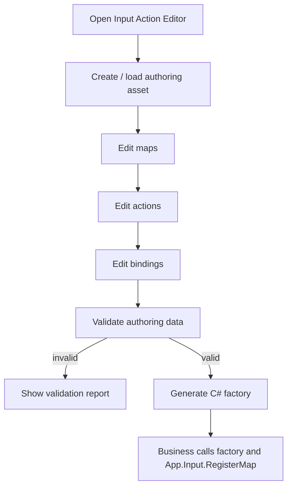

# input-action-editor design

## 0. 术语约定

| 术语 | 定义 | 防冲突结论 |
|---|---|---|
| Input Action Editor | Unity Editor 内的输入动作 authoring 工具，用来维护默认 action maps、actions 和 bindings | Editor-only 工具，不是 `InputModule` 本身，也不在运行时轮询输入 |
| input action authoring asset | 编辑器侧源文档，保存 action map / action / binding 草稿和生成设置 | 作者源文档，不等于运行时 `InputActionMap` 实例 |
| runtime input map | `GameDeveloperKit.Input.InputActionMap` 及其 `InputAction` / `InputBinding` 对象图 | 运行时主契约，必须能被 `App.Input.RegisterMap()` 接收 |
| binding row | 编辑器中一条按键、鼠标按钮或 axis 绑定配置 | 对齐 `InputBindingKind.Key/MouseButton/Axis`，不表示 Unity Input System binding |
| generated input factory | 由编辑器根据 authoring asset 生成的 `.g.cs` 工厂代码 | 生成运行时 `InputActionMap`，不保存玩家个人改键 |
| rebind / key remap | 玩家在运行时改键并保存偏好 | 本 feature 不做；后续需要 UI、Data/Config 和冲突处理另起 feature |

## 1. 决策与约束

### 需求摘要

做什么：新增一个 Unity Editor 输入动作编辑器，让开发者用可视化方式维护 `InputModule` 的默认 action map、action 和 binding。编辑器保存 authoring asset，校验名称、重复、非法绑定和生成设置，并输出可被业务调用的 C# 工厂代码，最终由业务在启动流程里把生成的 `InputActionMap` 注册到 `App.Input`。

为谁：维护默认键位、调试输入、UI/玩法 action map 的框架开发者和玩法程序。

成功标准：

- 能通过菜单打开 Input Action Editor，并创建 / 打开 input action authoring asset。
- 能新增 action map，设置 map name 和 enabled 默认值。
- 能在 map 下新增 action，并配置 Key、MouseButton、Axis 三类 binding。
- 能校验空白 map/action/axis 名、重复 map/action、非法 mouse button、空 binding 和无 action 的 map。
- 能从 authoring asset 生成 C# 工厂代码，代码创建 `InputActionMap`、`InputAction` 和 `InputBinding`，并可被调用方注册到 `App.Input`。
- 重复生成同一 authoring asset 不改变逻辑 id/name，不产生重复 action 或重复文件。
- 编辑器不修改 `InputModule` 的轮询、Timer 依赖、snapshot 或 runtime 查询语义。

### 明确不做

- 不做玩家运行时改键 UI、键位持久化、本地存档或冲突解决界面。
- 不新增 Unity Input System package，不修改 `Packages/manifest.json` 或 Runtime asmdef references。
- 不做设备热插拔、多玩家控制器分配、手柄布局识别或 binding composite。
- 不做 UI 焦点导航、EventSystem 替换、按钮导航或 UIModule 行为改写。
- 不把 input authoring asset 作为运行时自动加载资源；首版生成 C# 工厂，由业务显式调用。
- 不做 Excel / JSON 导入导出、远端配置下发或热更新输入配置。

### 复杂度档位

- `Robustness = L3`：authoring asset 和生成代码会长期进项目，必须强校验名称、重复、非法 binding 和输出路径。
- `Structure = modules`：新增 `Assets/GameDeveloperKit/Editor/InputEditor/`，窗口、authoring model、validator、generator、report 分文件，不塞进 Runtime/Input。
- `Idempotency = idempotent`：同一 asset 重复生成同一 factory 不应产生不同逻辑内容或重复类型。
- `Compatibility = current-only`：首版只对齐当前 `Runtime/Input/` 已落地的 Key、MouseButton、Axis，不承诺兼容 Unity Input System binding schema。

### 关键决策

1. 编辑器产物是 C# 工厂代码，不是运行时自动加载资产。
   - 采用：authoring asset 生成 `GameInputActions.g.cs` 这类工厂，返回 `InputActionMap[]` 或执行显式注册。
   - 拒绝：让 `InputModule` 在 Startup 自动读取 Editor asset 或 Resource asset。
   - 原因：当前 `InputModule` 的运行时契约是显式 `RegisterMap(InputActionMap)`；首版不引入 Data/Config/Resource 依赖。

2. authoring asset 是唯一编辑源，运行时对象每次由 factory 新建。
   - 采用：asset 保存默认 maps/actions/bindings；生成代码只作为可重复派生产物。
   - 拒绝：让用户直接编辑生成文件。
   - 原因：运行时 `InputActionMap` / `InputAction` 是可释放对象，直接序列化它们不适合作为长期 authoring 源。

3. 首版只覆盖当前 runtime 支持的三类 binding。
   - 采用：KeyCode、mouse button index、axis name + scale。
   - 拒绝：提前设计 gamepad device、Input System path、composite、processors。
   - 原因：`InputBinding` 当前公开契约只有 Key / MouseButton / Axis，编辑器不应虚构未落地 runtime 能力。

4. 生成代码只创建默认配置，不接管启动流程。
   - 采用：工厂提供 `CreateMaps()` 和可选 `RegisterTo(InputModule input)` helper。
   - 拒绝：在编辑器里自动改启动脚本或自动调用 `App.Input`。
   - 原因：不同项目会在 Procedure/bootstrap 的不同阶段注册输入；编辑器只产出清晰可调用代码。

## 2. 名词与编排

### 2.1 名词层

#### 现状

- `Assets/GameDeveloperKit/Runtime/Input/InputModule.cs` 已提供 `RegisterMap()`、`UnregisterMap()`、`SetMapEnabled()`、查询和 `Snapshot()`。
- `Assets/GameDeveloperKit/Runtime/Input/InputActionMap.cs` 保存 `Name`、`Enabled`、`Actions`，并校验重复 action。
- `Assets/GameDeveloperKit/Runtime/Input/InputAction.cs` 保存 `Name`、`Bindings` 和 `InputActionState`。
- `Assets/GameDeveloperKit/Runtime/Input/InputBinding.cs` 当前只支持 `Key(KeyCode)`、`MouseButton(int)` 和 `Axis(string, float)`。
- `Assets/GameDeveloperKit/Editor/` 现有工具以工具专属目录组织，例如 `ResourceEditor/`、`LubanConfigEditor/`、`TagEditor/` 和 `UI/`；当前没有 Input Editor。

#### 变化

- `InputActionAuthoringAsset`：Editor-only ScriptableObject，保存 map/action/binding authoring 数据和生成设置。
- `InputActionEditorWindow`：菜单入口和主窗口，负责打开 asset、编辑树、触发 validate/generate。
- `InputActionAuthoringModel`：窗口内可变模型，用于增删改 maps/actions/bindings。
- `InputActionAuthoringValidator`：把 authoring 数据按 runtime 规则校验，生成 report。
- `InputActionFactoryGenerator`：把通过校验的 authoring asset 生成 C# 工厂代码。
- `InputActionValidationReport` / `InputActionGenerateReport`：记录错误、警告、输出路径、map/action/binding 数量。

接口示例：

```csharp
// 来源：Assets/GameDeveloperKit/Runtime/Input/InputActionMap.cs InputActionMap
var gameplay = new InputActionMap("Gameplay");
var jump = new InputAction("Jump");
jump.AddBinding(InputBinding.Key(KeyCode.Space));
jump.AddBinding(InputBinding.MouseButton(0));
gameplay.AddAction(jump);

App.Input.RegisterMap(gameplay);
```

```csharp
// 来源：生成文件 GameInputActions.g.cs
public static partial class GameInputActions
{
    public static IReadOnlyList<InputActionMap> CreateMaps();

    public static void RegisterTo(InputModule input)
    {
        foreach (var map in CreateMaps())
        {
            input.RegisterMap(map);
        }
    }
}
```

### 2.2 编排层



#### 现状

- 运行时已有 `InputModule`，但默认 maps/actions 只能由代码手写创建。
- 没有统一的输入配置 authoring asset、EditorWindow、生成代码或校验报告。
- `InputModule` 不依赖 UI、Config、Data 或 Resource；输入采样由 Timer Update 驱动。

#### 变化

1. 打开和保存 authoring asset。
   - 通过 `GameDeveloperKit/Input Action Editor` 菜单打开窗口。
   - 用户创建或选择 input action authoring asset。
   - asset 保存 maps/actions/bindings、默认 enabled 状态、生成类型名和输出目录。

2. 编辑 map/action/binding。
   - 左侧树展示 maps 和 actions。
   - 右侧面板编辑 map name、enabled、action name 和 bindings。
   - binding kind 切换时只显示对应字段：KeyCode、mouse button index、axis name + scale。

3. 校验。
   - 校验 map name、action name、axis name 非空。
   - 校验 map name 全局唯一，action name 在 map 内唯一。
   - 校验 mouse button index >= 0，binding kind 是当前 runtime 支持类型。
   - 校验输出 class name 和 output folder 可生成 C#。
   - 失败时只更新 report，不写生成文件。

4. 生成 C# factory。
   - 生成文件只由 authoring asset 派生，带 `.g.cs` 后缀。
   - factory 创建全新的 `InputActionMap` 和 `InputAction` 对象，避免复用已释放对象。
   - 可选生成 `RegisterTo(InputModule input)`，但不自动调用 `App.Input`。
   - 生成前后不修改 runtime `InputModule`、`InputActionMap`、`InputAction` 或 `InputBinding`。

#### 流程级约束

- 错误语义：所有错误至少带 asset path；涉及元素时继续带 map/action/binding path；涉及生成时带 output folder 和 type name。
- 幂等性：重复打开/保存不改逻辑名称；重复生成同一 asset 输出稳定文本。
- 顺序：保存 authoring asset 可包含未通过校验的草稿；生成 factory 必须先 validate 成功。
- 并发：validate/generate 同一时间只允许一个运行，避免同时写同一输出文件。
- 扩展点：未来 Unity Input System adapter、用户 rebind persistence 和多玩家可以新增 binding provider / generator 分支，但不改变当前 runtime map/action 基本语义。
- 可观测点：report 显示 map/action/binding 数量、错误列表、输出路径和生成类型名。

### 2.3 挂载点清单

1. `GameDeveloperKit/Input Action Editor` 菜单项：删除后用户无法打开输入动作编辑器。
2. input action authoring asset 创建 / 打开入口：删除后没有编辑器源文档，只能手写默认输入代码。
3. map/action/binding 编辑视图：删除后无法可视化维护默认输入配置。
4. validation / generate report：删除后非法 binding 和生成失败无法定位到具体元素。
5. generated input factory：删除后编辑器无法产出可注册到 `InputModule` 的运行时代码。

拔除沙盘：去掉这些挂载点后，运行时 `InputModule` 仍可由业务手写注册 maps；只是 Editor 默认输入 authoring 和 factory 生成能力消失。

### 2.4 推进策略

1. 编辑器外壳与 authoring asset：建立菜单、窗口和 input action source document。
   - 退出信号：能创建 / 打开 asset，并保存空 maps 与生成设置。
2. map/action 静态编辑：搭建 map/action 树和详情面板。
   - 退出信号：能新增、重命名、删除 map/action，并保存 enabled 默认值。
3. binding 编辑：补齐 Key、MouseButton、Axis 三类 binding 的编辑控件。
   - 退出信号：能描述 Space 跳跃、mouse button 攻击、Horizontal axis 移动。
4. validator 与 report：按 runtime 输入规则校验 authoring 数据。
   - 退出信号：空名、重复、非法 mouse button、空 axis 和非法输出路径能定位到具体元素。
5. factory generator：生成可创建 `InputActionMap` 的 `.g.cs` 文件。
   - 退出信号：生成代码可编译，调用 `CreateMaps()` 后能得到与 asset 数量和名称一致的 maps/actions/bindings。
6. 验证覆盖：补齐 editor model、validator、generator 和范围守护。
   - 退出信号：Editor / Runtime 快速编译通过，关键验收场景有自动测试或手工证据。

### 2.5 结构健康度与微重构

##### 评估

- compound convention 检索：未命中“目录组织 / 命名 / 归属 / Input / Editor”相关 convention。
- 文件级 — `Assets/GameDeveloperKit/Runtime/Input/InputModule.cs` / `InputActionMap.cs` / `InputAction.cs` / `InputBinding.cs`：本 feature 只消费公开 API，不修改。
- 文件级 — `Assets/GameDeveloperKit/Runtime/App.cs`：已暴露 `App.Input`；本 feature 不新增 App 入口。
- 目录级 — `Assets/GameDeveloperKit/Editor/InputEditor/`：当前不存在；本 feature 会新增多个 Editor-only 文件，适合按工具目录新建。
- 目录级 — `Assets/GameDeveloperKit/Editor/`：已有多个工具目录，新增 `InputEditor/` 与现有模式一致，不需要重组根目录。

##### 结论：不做现有文件微重构

本次不搬迁 Runtime/Input、App 或现有 Editor 工具。Input Action Editor 作为新工具落到 `Assets/GameDeveloperKit/Editor/InputEditor/`，从一开始按 `Window/Model/Validation/Generation/UI` 或等价子域组织，避免把窗口、model、validator 和 generator 全塞进一个文件。这个组织规则只约束本 feature，不先沉淀为全项目 convention。

##### 超出范围的观察

- 如果后续要把 authoring asset 作为运行时可加载配置，需要新增 runtime DTO / loader，并决定 Resource、Config 或 Data 哪个模块承载；这涉及跨模块加载边界，建议另起 feature。
- 如果后续要做玩家运行时改键，需要 UI 设置界面、冲突检测和持久化策略，建议另起 `input-rebind-settings` 类 feature。

## 3. 验收契约

| 编号 | 输入 / 触发 | 期望可观察结果 |
|---|---|---|
| N1 | 通过菜单打开 Input Action Editor | 出现编辑器窗口，不启动或修改运行时 `InputModule` |
| N2 | 创建新的 input action authoring asset | 能保存生成类型名、输出目录和空 map 集合 |
| N3 | 新增 Gameplay map，默认 enabled=true | asset 中保存 map name 和 enabled 状态 |
| N4 | 在 Gameplay 下新增 Jump action | action 隶属于 Gameplay，且名称可编辑 |
| N5 | 给 Jump 添加 Key binding Space | 生成代码包含 `InputBinding.Key(KeyCode.Space)` |
| N6 | 给 Attack 添加 MouseButton binding 0 | 生成代码包含 `InputBinding.MouseButton(0)` |
| N7 | 给 MoveX 添加 Axis binding Horizontal，scale=-1 | 生成代码包含 `InputBinding.Axis("Horizontal", -1f)` 或等价常量表达 |
| N8 | 点击 Validate | report 显示 map/action/binding 数量，合法配置无 error |
| N9 | 点击 Generate Factory | 输出 `.g.cs` 文件，包含 `CreateMaps()`，生成代码可编译 |
| N10 | 调用生成 factory 并注册到 `App.Input` | `App.Input.Snapshot()` 能看到对应 map/action |
| B1 | map name 为空白 | validate 失败，report 定位到 map |
| B2 | 同一 asset 存在重复 map name | validate 失败，report 定位重复名称 |
| B3 | 同一 map 下存在重复 action name | validate 失败，report 定位 map/action |
| B4 | Axis binding 的 axis name 为空白 | validate 失败，report 定位 binding |
| B5 | MouseButton index < 0 | validate 失败，report 定位 binding |
| B6 | 输出 type name 不是合法 C# 标识符 | generate 前失败，不写 `.g.cs` |
| E1 | 未通过校验时点击 Generate | 不生成或不覆盖有效输出文件，report 显示失败原因 |
| E2 | 重复生成同一 asset | 输出逻辑内容稳定，不新增重复 action/map |

### 明确不做的反向核对项

- 不应出现对 `Packages/manifest.json` 或 Runtime asmdef 的修改来引入 Unity Input System。
- 不应出现玩家运行时改键 UI、持久化文件、设备热插拔、多玩家控制器分配或输入录像实现。
- 不应出现对 `UIModule`、EventSystem、UI 焦点导航或按钮导航的行为改动。
- 不应出现 `InputModule.Startup()` 自动读取 authoring asset 或 Resource asset 的路径。
- 不应出现修改 `InputModule` 的 Timer Update 采样、snapshot 或查询语义来迁就编辑器。

## 4. 与项目级架构文档的关系

验收通过后需要更新 `.codestable/architecture/ARCHITECTURE.md`：

- 记录 Input Action Editor 是 Editor-only authoring 工具，通过 input action authoring asset 保存默认输入配置源文档。
- 记录 Input Action Editor 的运行时主输出是生成的 C# factory，最终创建 `InputActionMap` / `InputAction` / `InputBinding` 并由业务显式注册到 `App.Input`。
- 记录首版只覆盖 legacy `KeyCode`、mouse button 和 axis，不引入 Unity Input System package。
- 记录本工具不做玩家 rebind UI、持久化、多玩家设备分配或 UI/EventSystem 导航。
