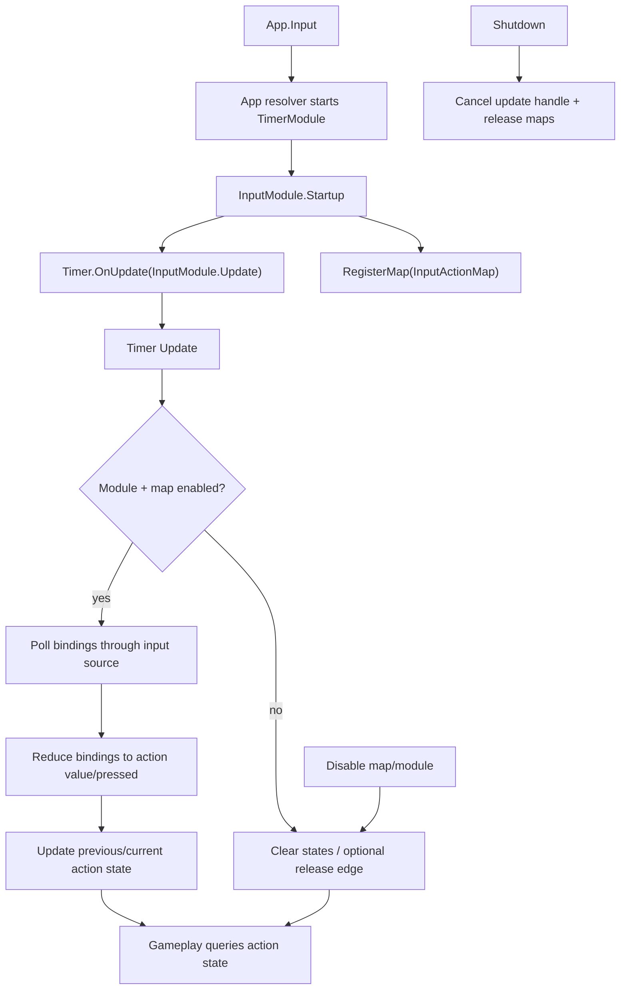

# input-module design

## 0. 术语约定

| 术语 | 当前定义 | 本次约定 |
|---|---|---|
| `InputModule` | 当前仓库没有运行时输入模块；UI requirement 中把输入系统适配列为不做 | GameDeveloperKit 运行时输入入口，通过 `App.Input` 访问，统一轮询输入并产出动作状态 |
| input action | 当前没有统一动作概念 | 业务语义动作，例如 `jump`、`attack`、`open_inventory`，不是具体按键 |
| binding | 当前没有统一绑定概念 | 一个 action 到底层输入源的映射，例如 `KeyCode.Space` 或 mouse button 0 |
| action map | 当前不存在 | 一组可一起启用/禁用的 input action，例如 `Gameplay`、`UI`、`Debug` |
| input snapshot | 当前不存在 | 某一帧所有 action 的 `IsPressed` / `WasPressedThisFrame` / `WasReleasedThisFrame` / `Value` 状态 |
| Unity Input System | `Packages/manifest.json` 当前没有 `com.unity.inputsystem` | 指 Unity 新输入系统包；首版不引入它，只预留 adapter 边界 |

防冲突结论：

- 本 feature 的 `InputModule` 不替代 `UIModule` 的 UI 窗口管理，也不处理 UI 焦点和导航。
- 本 feature 不把 CommandModule 扩展成输入层；Command 是可撤销业务操作历史，不是玩家输入读取。
- 首版只封装 Unity legacy `UnityEngine.Input` / `KeyCode` 能力，不新增 `com.unity.inputsystem` 依赖。

## 1. 决策与约束

### 需求摘要

做什么：新增运行时 `InputModule`，让业务能登记 action map、action 和 bindings，模块通过 Timer Update 每帧轮询底层输入，生成动作状态；调用方可以查询某个 action 是否按住、这一帧是否按下、这一帧是否松开、当前数值，并能启用/禁用某个 action map 或整个输入模块。

为谁：玩法、UI、调试工具、Procedure 和其他需要读取玩家输入的运行时系统。

成功标准：

- 访问 `App.Input` 可按需创建输入模块，并因模块依赖启动 `TimerModule`。
- 调用方可以创建/注册 `InputActionMap`，其中 action 可绑定键盘键、鼠标按钮和轴。
- Timer Update 后，action 状态能正确表达 pressed、pressed this frame、released this frame 和 value。
- 同一 action 多个 binding 任一触发即可让 action 触发。
- 禁用 action map 后，该组 action 不再触发；重新启用后继续轮询。
- `Snapshot()` 可读取当前 action 状态，便于调试和测试。
- `Shutdown()` 注销 Timer handle 并清空 action maps。

明确不做：

- 不新增 Unity Input System package，不修改 `Packages/manifest.json` 或 Runtime asmdef references。
- 不做用户自定义键位保存、设置界面、设备热插拔策略、多玩家本地输入或控制器分配。
- 不做复杂手势、组合键序列、连招判定、输入缓冲、录像回放或网络同步。
- 不做 UI 焦点、按钮导航、鼠标射线、EventSystem 或 uGUI 输入模块替换。
- 不做低延迟采样预算、后台线程输入、Job System 或跨线程安全承诺。
- 不替代 Procedure/Combat/UI 的业务决策；输入层只提供动作状态。

### 复杂度档位

走框架运行时模块默认档位，偏离点：

- `Robustness = L3`：action name、map name 和 binding 是外部/业务输入，必须校验空值、重复、非法类型和禁用状态。
- `Structure = modules`：新增 `Runtime/Input/`，action、map、binding、state、snapshot 和 adapter 分文件。
- `Performance = reasonable`：每帧轮询应避免明显重复分配，但首版不设输入延迟或 GC 预算。
- `Compatibility = active`：首版 API 允许未来接入 Unity Input System adapter 时调整，不承诺长期 ABI。
- `Concurrency = single-threaded orchestration`：公开 API 假定 Unity 主线程调用，轮询发生在 Timer Update。

### 关键决策

1. Input 是独立 Runtime 模块，并依赖 TimerModule 驱动。
   - Timer 已是 Procedure、Combat、Debug 等运行时消费方的 update 统一入口。
   - `InputModule` 声明 `[ModuleDependency(typeof(TimerModule))]`，Startup 注册 `UpdateTimerHandle`。
   - 不创建独立 `MonoBehaviour` driver，避免又多一个 Update root。

2. 公开层用 action/action map，不暴露业务直接读 KeyCode。
   - 业务读取 `GetAction("Gameplay", "Jump")` 或快捷查询 action 状态。
   - binding 可以是 Key、MouseButton、Axis 三类首版输入源。
   - 多设备概念先体现在 binding 类型，不定义 device registry。

3. 底层输入使用 adapter 隔离。
   - `IInputSource` 或内部等价接口负责读取 KeyCode、mouse button、axis。
   - 默认实现包住 `UnityEngine.Input`。
   - 测试可注入 fake source；未来 Unity Input System 可新增 source，不改 action map 语义。

4. action 状态按帧快照计算。
   - 每次 Timer Update 保存 previous/current pressed 和 value。
   - `WasPressedThisFrame = current && !previous`。
   - `WasReleasedThisFrame = !current && previous`。
   - action 多个 binding 时 pressed 为任一 binding pressed，value 取绝对值最大的 binding value 或按钮的 1/0。

5. action map 控制启用/禁用边界。
   - map disabled 时不轮询该 map；如果禁用前 action 处于 pressed，下一次 update 产生一次 released 边沿后清零，便于业务停止持续动作。
   - 全局 `InputModule.Enabled` 为 false 时所有 map 都不触发。

6. 首版不持久化 binding。
   - 默认 binding 由代码或配置创建后注册。
   - 用户改键和本地保存会涉及 UI、Data/Config 和冲突检测，后续另起 feature。

## 2. 名词与编排

### 2.1 名词层

#### 现状

- `Assets/GameDeveloperKit/Runtime/App.cs` 当前没有 `App.Input`。
- `Assets/GameDeveloperKit/Runtime/Timer/TimerModule.cs` 已提供 `OnUpdate(Action<TimerUpdateContext>)` 和 handle cancel，适合驱动每帧输入采样。
- `Assets/GameDeveloperKit/Runtime/UI/` 管窗口层级和 Back，不提供输入系统适配。
- `Assets/GameDeveloperKit/Runtime/Command/` 管可撤销命令历史，明确不做输入作弊码或输入 parser。
- `Packages/manifest.json` 没有 `com.unity.inputsystem`；Runtime asmdef references 里没有 Input System assembly。

#### 变化

新增运行时模块：

```csharp
[ModuleDependency(typeof(TimerModule))]
public sealed class InputModule : GameModuleBase
{
    public bool Enabled { get; set; }

    public override void Startup();
    public override void Shutdown();

    public void RegisterMap(InputActionMap map);
    public bool UnregisterMap(string mapName);
    public bool SetMapEnabled(string mapName, bool enabled);

    public bool IsPressed(string mapName, string actionName);
    public bool WasPressedThisFrame(string mapName, string actionName);
    public bool WasReleasedThisFrame(string mapName, string actionName);
    public float GetValue(string mapName, string actionName);
    public InputSnapshot Snapshot();
}
```

新增 action map 和 action：

```csharp
public sealed class InputActionMap : IReference
{
    public string Name { get; }
    public bool Enabled { get; set; }
    public IReadOnlyList<InputAction> Actions { get; }

    public void AddAction(InputAction action);
    public bool TryGetAction(string name, out InputAction action);
    public void Release();
}

public sealed class InputAction : IReference
{
    public string Name { get; }
    public IReadOnlyList<InputBinding> Bindings { get; }
    public InputActionState State { get; }

    public void AddBinding(InputBinding binding);
    public void Release();
}
```

新增 binding：

```csharp
public readonly struct InputBinding
{
    public InputBindingKind Kind { get; }
    public KeyCode KeyCode { get; }
    public int MouseButtonIndex { get; }
    public string AxisName { get; }
    public float Scale { get; }
}

public enum InputBindingKind : byte
{
    Key = 0,
    MouseButton = 1,
    Axis = 2,
}
```

接口示例：

```csharp
// 来源：Assets/GameDeveloperKit/Runtime/Input/InputModule.cs InputModule
var gameplay = new InputActionMap("Gameplay");
var jump = new InputAction("Jump");
jump.AddBinding(InputBinding.Key(KeyCode.Space));
jump.AddBinding(InputBinding.MouseButton(0));
gameplay.AddAction(jump);

App.Input.RegisterMap(gameplay);

if (App.Input.WasPressedThisFrame("Gameplay", "Jump"))
{
    // jump
}
```

```csharp
// 来源：Assets/GameDeveloperKit/Runtime/Input/InputModule.cs InputModule
App.Input.SetMapEnabled("Gameplay", false);
var pressed = App.Input.IsPressed("Gameplay", "Jump"); // false
```

### 2.2 编排层



#### 现状

- 框架没有统一输入 update handle。
- 业务如果读取输入，需要直接调用 `UnityEngine.Input.GetKey` / `GetMouseButton` / `GetAxis`。
- 没有 action map 启用/禁用、上一帧状态、snapshot 或测试 fake source。

#### 变化

1. Startup / Shutdown：
   - `Startup()` 初始化 map registry、默认 input source，注册 Timer Update handle，`Enabled = true`。
   - 如果已启动则 no-op。
   - `Shutdown()` 取消 update handle、释放 maps、清空 registry 和状态。

2. RegisterMap：
   - 校验 map 不为 null、name 非空。
   - 同名 map 重复注册抛 `GameException`，不替换旧 map。
   - map 内 action name 必须唯一，action bindings 必须有效。

3. Timer Update：
   - 每次 Update 遍历已注册 maps。
   - 模块 disabled 或 map disabled 时，已 pressed action 在下一次 update 产生一次 released 边沿后清零。
   - map enabled 时读取每个 action 的 bindings。
   - Key binding 读取 `Input.GetKey(key)`，MouseButton 读取 `Input.GetMouseButton(index)`，Axis 读取 `Input.GetAxisRaw(axisName)`。
   - 把多个 binding 归约成 action pressed/value，并更新边沿状态。

4. Query：
   - `IsPressed` / `WasPressedThisFrame` / `WasReleasedThisFrame` / `GetValue` 校验 mapName/actionName。
   - 未注册 map 或 action 抛 `GameException`，避免拼写错误静默变成“没按”。
   - `Snapshot()` 返回只读状态副本，供 Debug/测试读取。

5. Disable：
   - `SetMapEnabled(name, false)` 后该 map 不再读取底层输入。
   - 禁用时当前按住的 action 在下一次 update 进入 released 状态，然后归零。
   - 重新启用后从当前底层输入重新采样，不保留禁用前 pressed。

#### 流程级约束

- 错误语义：null map/action/binding name 抛 `ArgumentNullException`；空白 name、非法 mouse button、空 axis、重复 map/action 抛 `ArgumentException` 或 `GameException`。
- 幂等性：Startup 重复 no-op；Shutdown 重复无残留；取消已取消 handle 不抛；disabled map 反复禁用状态不变。
- 顺序：输入采样发生在 Timer Update phase；同一帧查询读取最近一次 snapshot，不主动触发新采样。
- 依赖：InputModule 依赖 TimerModule；不依赖 UI、Command、Procedure 或 Combat。
- 扩展点：底层 input source 可替换；未来 Unity Input System adapter、rebind persistence、multi-player 可在 adapter/map 层扩展。
- 可观测点：`Snapshot()` 暴露 map/action 状态；Debug profile 可后续读取 snapshot，但首版不接 Debug。

### 2.3 挂载点清单

1. `App.Input`：新增运行时输入模块访问入口。
2. `[ModuleDependency(typeof(TimerModule))]`：Input 通过 Timer Update 驱动采样。
3. `Assets/GameDeveloperKit/Runtime/Input/`：新增 input module、action map、action、binding、state、snapshot 和 input source adapter。
4. `InputActionMap` / `InputAction` / `InputBinding`：业务登记输入动作和绑定的公开契约。
5. `.codestable/architecture/ARCHITECTURE.md`：验收后记录 Input 子系统、Timer 驱动和首版不引入 Input System 包的边界。

拔除沙盘：删除 `Runtime/Input/`、移除 `App.Input`、清理业务侧 action map 注册和查询，并回滚架构记录后，输入动作能力应消失；Timer、UI、Command、Procedure、Combat 不应因此失效。

### 2.4 推进策略

1. 名词骨架：建立 `InputModule`、`InputActionMap`、`InputAction`、`InputBinding`、state 和 snapshot。
   - 退出信号：模块可启动，空 registry snapshot 可查询，公开类型可编译。
2. Timer 驱动与 input source：接入 Timer Update handle，建立 legacy `UnityEngine.Input` source 和测试 fake source 边界。
   - 退出信号：Update 调用能推进一次空采样，Shutdown 能取消 handle。
3. Action map 注册与校验：实现 map/action/binding 注册、重复校验、启用禁用。
   - 退出信号：合法 map 可注册，重复/非法输入给出明确错误。
4. 状态计算与查询：实现 key/mouse/axis 轮询、多 binding 归约、pressed/released 边沿和值查询。
   - 退出信号：模拟两帧输入能观察按下、按住、松开和 value。
5. 生命周期与验证：补齐 disable 清零、snapshot、shutdown、范围守护和编译验证。
   - 退出信号：Runtime 快速编译通过，关键验收契约有可观察证据。

### 2.5 结构健康度与微重构

##### 评估

- compound convention 检索：未命中“目录组织 / 命名 / 归属 / 输入 / Input”相关 convention。
- 文件级 — `Assets/GameDeveloperKit/Runtime/App.cs`：当前约 599 行，是模块入口和 resolver 聚合点；本次预计只新增 `using GameDeveloperKit.Input` 和 `App.Input` 属性，属于既有职责延伸，但文件已偏胖。
- 文件级 — `Assets/GameDeveloperKit/Runtime/Timer/TimerModule.cs`：本次只消费公开 `OnUpdate` / handle cancel，不改 TimerModule。
- 文件级 — `Assets/GameDeveloperKit/Runtime/UI/UIModule.cs` / `CommandModule.cs`：本次不改 UI/Command；只在边界中明确不接管它们职责。
- 目录级 — `Assets/GameDeveloperKit/Runtime/Input/` 当前不存在；预计新增 7 个左右小文件，不存在目录摊平旧债。

##### 结论：不做微重构

本次不做“只搬不改行为”的前置微重构。Input 是全新模块，主要落入新目录；`App.cs` 偏胖是系统性问题，拆分入口/resolver 会改模块生命周期结构，超出本 feature 的安全微重构范围。

##### 超出范围的观察

- `App.cs` 已继续增长，建议后续单独走 `cs-refactor` 评估模块入口和 resolver 拆分。
- 如果未来接入 Unity Input System、多玩家、重绑持久化和 UI 导航，`Runtime/Input/` 需要按 `Bindings/Adapters/Internal` 分组；首版先保持小文件平铺。

## 3. 验收契约

| 编号 | 输入 / 触发 | 期望可观察结果 |
|---|---|---|
| N1 | 访问 `App.Input` | 返回已启动的 `InputModule`，并已通过依赖启动 `TimerModule` |
| N2 | Startup 完成 | `Enabled == true`，已注册 update handle，snapshot 为空 |
| N3 | 注册 Gameplay map，Jump action 绑定 Space | map/action 可在 snapshot 中看到 |
| N4 | fake source 第 1 帧 Space 未按、第 2 帧 Space 按下 | 第 2 帧 `IsPressed == true` 且 `WasPressedThisFrame == true` |
| N5 | 第 3 帧 Space 继续按住 | `IsPressed == true` 且 `WasPressedThisFrame == false` |
| N6 | 第 4 帧 Space 松开 | `IsPressed == false` 且 `WasReleasedThisFrame == true` |
| N7 | Jump 同时绑定 Space 和 mouse button 0，任一输入按下 | Jump action pressed 为 true |
| N8 | MoveX 绑定 axis Horizontal，fake source 返回 -1 | `GetValue("Gameplay", "MoveX") == -1` 或按 scale 后值 |
| N9 | `SetMapEnabled("Gameplay", false)` 后底层 Space 按下 | Gameplay actions 不触发 pressed，snapshot 显示 map disabled |
| N10 | 模块 `Enabled = false` 后底层输入变化 | 所有 map 都不触发新 pressed |
| N11 | `Shutdown()` | update handle 被取消，maps 被释放，snapshot 清空 |
| B1 | `RegisterMap(null)` | 抛 `ArgumentNullException` |
| B2 | map name / action name / axis name 为空白 | 抛 `ArgumentException` |
| B3 | 重复注册同名 map 或同 map 下重复 action | 抛 `GameException`，旧注册不被替换 |
| B4 | mouse button index 小于 0 | 抛 `ArgumentException` |
| B5 | 查询不存在 map/action | 抛明确 `GameException`，不静默返回 false/0 |
| E1 | Timer 未能注册 update handle | `App.Input` 启动失败抛 `GameException` 或 snapshot 明确显示未驱动 |
| E2 | input source 读取 axis 抛异常 | 该异常可观察，不静默导致 action 永久卡住 |

### 明确不做的反向核对项

- 不新增 `com.unity.inputsystem`，不修改 `Packages/manifest.json` 或 Runtime asmdef references。
- 不新增用户改键 UI、持久化文件、设备热插拔、多玩家控制器分配、输入录像或网络同步。
- 不修改 `UIModule` 的窗口、Back、safe area 或 EventSystem 行为。
- 不修改 `CommandModule` 为输入 parser 或作弊码系统。
- 不新增独立 MonoBehaviour input driver；采样应通过 Timer Update handle。

## 4. 与项目级架构文档的关系

验收通过后需要更新 `.codestable/architecture/ARCHITECTURE.md`：

- 新增 Input 子系统：入口 `InputModule`、访问方式 `App.Input`、核心类型 `InputActionMap` / `InputAction` / `InputBinding` / `InputSnapshot`。
- 记录主流程：注册 action map、Timer Update 轮询底层输入、归约 bindings、更新每帧 action state、业务查询 snapshot。
- 记录依赖边界：Input 依赖 Timer；不依赖 UI、Command、Procedure、Combat；首版使用 legacy `UnityEngine.Input` adapter，不引入 Unity Input System。
- 记录流程级约束：公开 API 主线程调用、同帧查询读取最近 snapshot、map/module disabled 清零、非法绑定抛错。
- requirement `input-module` 在 acceptance 后可从 draft 升级为 current。
