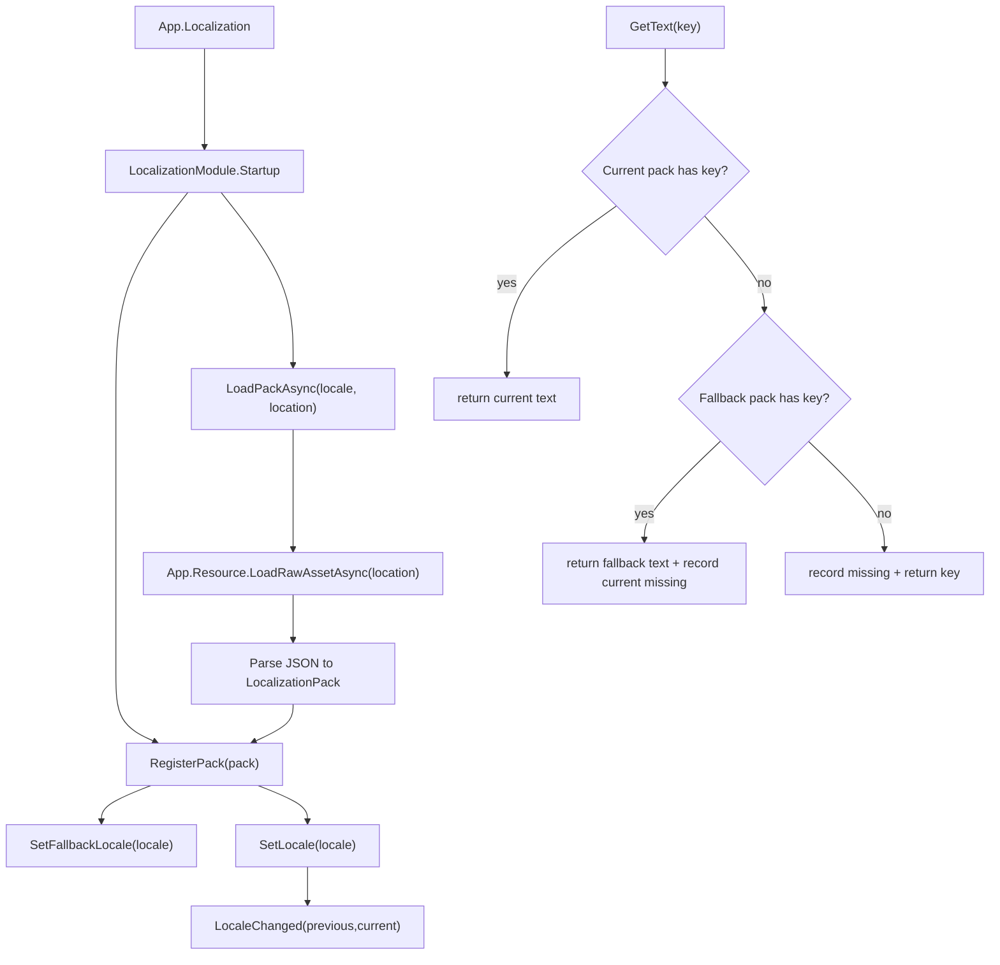

# localization-module design

## 0. 术语约定

| 术语 | 当前定义 | 本次约定 |
|---|---|---|
| `LocalizationModule` | 当前仓库没有运行时本地化模块；UI requirement 中把国际化列为不做 | GameDeveloperKit 运行时本地化入口，通过 `App.Localization` 访问，管理语言包、当前语言和文本查询 |
| locale / language | 当前代码没有统一语言概念 | 使用 `locale` 表示语言/地区代码，例如 `zh-CN`、`en-US`；公开 API 中叫 `Locale` |
| localization key | 当前没有统一文本 key | 稳定文本标识，例如 `ui.start.button`，业务用 key 取当前语言文本 |
| language pack | 当前没有语言包模型 | 一个 locale 对应的一组 key -> text 映射，可从内存字典或资源文本加载 |
| fallback locale | 当前不存在 | 当前语言缺少 key 时回退查询的默认语言 |
| localized text | UI/剧情/提示等运行时显示文本，目前由各业务自行保存 | 由 `LocalizationModule.GetText(key)` 返回的当前语言文本，不等同于字体、图片或布局 |

防冲突结论：

- 本 feature 使用 `LocalizationModule`，不把能力塞进 `UIModule`；UI 只作为未来可订阅语言变化并刷新文本的消费方。
- 本地化 key 不复用 Config 的 `Key` 类型；Config 的 `Key` 是表行主键，本地化 key 是文本资源标识。
- 本 feature 不使用 Unity Localization package，当前 `Packages/manifest.json` 未安装该依赖，首版不新增第三方或 Unity 包依赖。

## 1. 决策与约束

### 需求摘要

做什么：新增运行时 `LocalizationModule`，让业务可以加载一个或多个语言包，设置当前语言和默认回退语言，通过 key 读取当前语言文本，支持带参数格式化，语言切换时通知订阅者刷新，缺失 key 时按当前语言 -> fallback locale -> key 原文的顺序给出可观察回退。

为谁：UI、剧情、玩法提示、调试工具和其他需要在运行时显示多语言文本的业务开发者。

成功标准：

- 访问 `App.Localization` 可按需创建本地化模块外壳。
- 调用方可以用内存字典注册语言包，也可以从资源文本加载语言包。
- `SetLocale("en-US")` 后，`GetText("ui.start")` 返回 en-US 文本。
- 当前语言缺少 key 时，会查询 fallback locale；仍缺失时返回 key，并记录缺失项。
- `Format("battle.damage", value)` 能在当前语言文本上应用格式化参数。
- 语言变化会触发本地事件，调用方可刷新 UI。
- `Shutdown()` 清空语言包、缺失记录和订阅。

明确不做：

- 不做机器翻译、翻译审核、翻译记忆或外部本地化平台同步。
- 不做字体 fallback、字库拆分、RTL 排版、复数规则、性别语法、日期/货币/数字文化格式。
- 不做本地化图片、音频、Prefab 变体或 AssetBundle 分语言打包策略。
- 不自动扫描场景、prefab 或 `Text` / `TMP_Text` 并改写文案。
- 不改变 `UIModule`、`ConfigModule`、`ResourceModule` 的既有公开语义。
- 不在首版引入 Unity Localization package 或修改 `Packages/manifest.json`。
- 不承诺跨线程安全；公开 API 假定 Unity 主线程调用。

### 复杂度档位

走框架运行时模块默认档位，偏离点：

- `Robustness = L3`：文本 key、locale、资源内容都可能来自外部配置，必须校验空值、重复 key、格式错误、缺失 locale 和加载失败。
- `Structure = modules`：新增 `Runtime/Localization/`，公开契约、语言包、缺失记录、订阅事件和值对象分文件，避免堆进单个模块文件。
- `Compatibility = active`：首版 API 允许随项目文本管线演进调整，不承诺外部包级稳定 ABI。
- `Observability = logged`：缺失 key 和加载失败必须可通过 snapshot 或查询结果观察；不接 Debug profile。

### 关键决策

1. 本地化是独立 Runtime 模块。
   - UI 只管窗口、层级和组件绑定；本地化文本查询和语言切换不应成为 UI 内部功能。
   - Config 可承载静态配置表，但不承担“当前语言”和“缺失回退”的运行时状态。
   - Resource 只负责加载文本资源；语言包解析和查询属于 Localization。

2. 语言包首版使用简单 key-value 模型。
   - `LocalizationPack` 保存 `Locale` 和只读 `Dictionary<string, string>`。
   - 资源加载首版支持 JSON object 或 `{ "locale": "...", "entries": { ... } }` 两种形态。
   - 不在首版定义 CSV/Excel/Luban 输入；后续工具链可以生成同样的运行时 JSON。

3. 回退顺序固定且可观察。
   - 先查 `CurrentLocale` 对应语言包。
   - 缺失时查 `FallbackLocale`。
   - 仍缺失时返回 key 本身，并把 locale + key 记入 missing 表。
   - 这样 UI 不会出现空文本，缺翻译也不会悄悄消失。

4. 格式化只做 .NET `string.Format` 级别。
   - `Format(key, params object[] args)` 对 `GetText(key)` 的结果调用格式化。
   - 格式化参数错误抛 `GameException`，不吞掉格式错误。
   - 复数、性别、日期/货币文化格式等以后另起 feature。

5. 语言变化通知使用模块本地事件。
   - 暴露 `event Action<LocalizationChangedEventArgs> LocaleChanged` 或等价订阅。
   - 不强依赖 EventModule，避免本地化为了刷新 UI 强制启动事件模块。

6. 资源加载依赖 ResourceModule，但 Startup 不做 async ready。
   - `Startup()` 只初始化字典和状态。
   - `LoadPackAsync(locale, location)` 显式通过 `App.Resource.LoadRawAssetAsync(location)` 加载文本。
   - 调用方也可 `RegisterPack(pack)` 直接注入内存数据，便于测试和工具生成。

## 2. 名词与编排

### 2.1 名词层

#### 现状

- `Assets/GameDeveloperKit/Runtime/App.cs` 当前集中暴露 `App.UI`、`App.Config`、`App.Network` 等模块入口，没有 `App.Localization`。
- `Assets/GameDeveloperKit/Runtime/UI/` 已实现窗口、安全区和组件绑定；`.codestable/requirements/ui-module.md` 明确 UI 首版不覆盖国际化。
- `Assets/GameDeveloperKit/Runtime/Config/ConfigModule.cs` 可加载配置表并缓存 `Table<TRow>`，但没有当前语言、fallback 或文本缺失语义。
- `Assets/GameDeveloperKit/Runtime/Resource/ResourceModule.cs` 可加载 raw asset；本地化可以把语言包文本作为资源输入。
- `Packages/manifest.json` 没有 `com.unity.localization`；Runtime asmdef 不引用 Unity Localization。

#### 变化

新增运行时模块：

```csharp
public sealed class LocalizationModule : GameModuleBase
{
    public event Action<LocalizationChangedEventArgs> LocaleChanged;

    public string CurrentLocale { get; }
    public string FallbackLocale { get; }

    public override void Startup();
    public override void Shutdown();

    public void SetFallbackLocale(string locale);
    public void SetLocale(string locale);

    public void RegisterPack(LocalizationPack pack);
    public UniTask<LocalizationPack> LoadPackAsync(string locale, string location);
    public bool HasText(string key);
    public string GetText(string key);
    public string Format(string key, params object[] args);
    public LocalizationSnapshot Snapshot();
}
```

新增语言包值对象：

```csharp
public sealed class LocalizationPack : IReference
{
    public string Locale { get; }
    public IReadOnlyDictionary<string, string> Entries { get; }

    public bool TryGetText(string key, out string text);
    public void Release();
}
```

新增事件参数和缺失记录：

```csharp
public readonly struct LocalizationChangedEventArgs
{
    public string PreviousLocale { get; }
    public string CurrentLocale { get; }
}

public readonly struct MissingLocalizationEntry
{
    public string Locale { get; }
    public string Key { get; }
}
```

接口示例：

```csharp
// 来源：Assets/GameDeveloperKit/Runtime/Localization/LocalizationModule.cs LocalizationModule
App.Localization.RegisterPack(LocalizationPack.FromDictionary(
    "zh-CN",
    new Dictionary<string, string>
    {
        ["ui.start"] = "开始游戏",
    }));

App.Localization.SetFallbackLocale("zh-CN");
App.Localization.SetLocale("zh-CN");
var label = App.Localization.GetText("ui.start");
```

```csharp
// 来源：Assets/GameDeveloperKit/Runtime/Localization/LocalizationModule.cs LocalizationModule
await App.Localization.LoadPackAsync("en-US", "Localization/en-US");
App.Localization.SetLocale("en-US");
var damage = App.Localization.Format("battle.damage", 120);
```

### 2.2 编排层



#### 现状

- 没有语言包 registry、当前语言状态、fallback 语言、缺失记录或语言变化通知。
- UI、剧情和提示如果要显示文本，只能各自保存字符串或自行读配置。
- Resource 和 Config 可以作为数据来源，但没有“语言切换后刷新消费方”的编排。

#### 变化

1. Startup / Shutdown：
   - `Startup()` 初始化 pack registry、missing set、当前语言和 fallback。
   - 不自动加载任何默认语言包，不读取资源，不扫描场景。
   - `Shutdown()` 释放 pack、清空 missing、清空事件订阅和当前状态。

2. RegisterPack：
   - 校验 pack 不为 null、locale 非空、entries 非 null。
   - 同 locale 重复注册时替换旧 pack 并释放旧 pack，支持热重载式刷新。
   - 校验 entry key 非空；重复 key 在构造 pack 时拒绝。

3. LoadPackAsync：
   - 校验 locale 和 location。
   - 通过 `App.Resource.LoadRawAssetAsync(location)` 读取 UTF-8 文本。
   - 解析 JSON 为 `LocalizationPack`。
   - 解析成功后注册 pack；失败时不改 registry。
   - 资源句柄由本次加载流程释放，模块只保留解析后的 pack。

4. SetFallbackLocale / SetLocale：
   - locale 必须非空。
   - fallback 可以先设置为未加载 locale；查询时只在 pack 存在时生效。
   - `SetLocale` 切到同 locale no-op，不重复通知。
   - 切换语言时更新 `CurrentLocale` 并触发 `LocaleChanged`。

5. GetText / Format：
   - `GetText(key)` 校验 key 非空。
   - 当前语言 pack 存在且含 key 时返回当前文本。
   - 当前语言缺失时记录 `(CurrentLocale, key)`，再查 fallback。
   - fallback 命中时返回 fallback 文本。
   - fallback 也缺失时记录 fallback missing，并返回 key 原文。
   - `Format(key, args)` 对查询结果执行格式化；格式化失败抛 `GameException`。

#### 流程级约束

- 错误语义：null locale/key/location 抛 `ArgumentNullException`；空白字符串抛 `ArgumentException`；资源加载、JSON 解析、格式化失败抛 `GameException`。
- 幂等性：`SetLocale` 切到当前 locale no-op；重复 `Shutdown()` 后无残留；缺失记录按 locale + key 去重。
- 顺序：语言包注册成功后才影响查询；`SetLocale` 更新状态后再通知订阅者，订阅者读取 `CurrentLocale` 能看到新值。
- 依赖：只有 `LoadPackAsync` 依赖 `ResourceModule`；内存 `RegisterPack` 不要求资源模块 ready。
- 扩展点：后续可增加 Config/Luban/CSV provider、UI 自动绑定组件、本地化资产和复数规则；首版只固定文本 key 查询。
- 可观测点：`Snapshot()` 暴露 current/fallback、已加载 locale 列表和 missing entries；缺失 key 不静默吞掉。

### 2.3 挂载点清单

1. `App.Localization`：新增运行时本地化模块访问入口。
2. `Assets/GameDeveloperKit/Runtime/Localization/`：新增本地化公开契约、语言包、snapshot、事件参数和内部解析逻辑。
3. `LocalizationModule.LocaleChanged`：语言变化通知入口，供 UI/剧情/业务刷新显示文本。
4. `LocalizationPack` JSON 资源约定：运行时语言文本数据的资源输入边界。
5. `.codestable/architecture/ARCHITECTURE.md`：验收后记录 Localization 子系统、回退语义和不做范围。

拔除沙盘：删除 `Runtime/Localization/`、移除 `App.Localization`、清理业务侧 `GetText` / `LocaleChanged` 调用并回滚架构记录后，本地化能力应消失；UI、Config、Resource 本体不应因此失效。

### 2.4 推进策略

1. 名词骨架：建立 `LocalizationModule`、`LocalizationPack`、事件参数、missing entry 和 snapshot。
   - 退出信号：模块可按需启动，空状态可查询，公开类型可编译。
2. 语言包注册与查询：实现内存 pack 注册、locale/fallback 设置、`GetText` 和缺失回退。
   - 退出信号：当前语言命中、fallback 命中、全部缺失返回 key 三条路径可观察。
3. 资源加载与解析：实现 JSON raw asset 加载、解析、失败不污染 registry 和资源句柄释放。
   - 退出信号：有效 JSON 可注册语言包，非法 JSON 抛明确错误且旧状态不变。
4. 格式化与通知：实现 `Format`、`LocaleChanged` 和 snapshot missing 查询。
   - 退出信号：切换语言触发一次通知；格式参数正确返回文本，参数错误抛明确异常。
5. 生命周期与验证：补齐 shutdown、重复调用、空输入、重复 locale 和范围守护。
   - 退出信号：Runtime 快速编译通过，关键验收契约有可观察证据。

### 2.5 结构健康度与微重构

##### 评估

- compound convention 检索：未命中“目录组织 / 命名 / 归属 / 本地化 / Localization”相关 convention。
- 文件级 — `Assets/GameDeveloperKit/Runtime/App.cs`：当前约 599 行，是模块入口和 resolver 聚合点；本次预计只新增 `using GameDeveloperKit.Localization` 和 `App.Localization` 属性，属于既有职责延伸，但文件已偏胖。
- 文件级 — `Assets/GameDeveloperKit/Runtime/UI/UIModule.cs`：本次不改 UI；只在边界中说明未来可消费语言变化。
- 文件级 — `Assets/GameDeveloperKit/Runtime/Config/ConfigModule.cs` / `ResourceModule.cs`：本次不改公开语义；Localization 只调用 Resource raw asset API。
- 目录级 — `Assets/GameDeveloperKit/Runtime/Localization/` 当前不存在；新增 5 个左右小文件，不存在目录摊平旧债。

##### 结论：不做微重构

本次不做“只搬不改行为”的前置微重构。Localization 是全新模块，主要落入新目录；`App.cs` 虽然已经偏胖，但拆模块入口 registry 涉及 App 结构性重划，超出本 feature 的安全微重构边界。

##### 超出范围的观察

- `App.cs` 已继续增长为模块入口、resolver、生命周期和依赖回滚的聚合文件。后续模块继续增加时，建议另起 `cs-refactor` 讨论模块入口/registry 拆分，本 feature 不阻塞。
- 如果本地化后续接入 UI 自动文本组件、Luban 导表和本地化图片，`Runtime/Localization/` 可能需要按 `Text/Provider/Internal` 分组；首版先按小文件平铺。

## 3. 验收契约

| 编号 | 输入 / 触发 | 期望可观察结果 |
|---|---|---|
| N1 | 访问 `App.Localization` | 返回已启动的 `LocalizationModule` 实例 |
| N2 | Startup 完成 | `CurrentLocale` / `FallbackLocale` 为空或默认空状态，已加载 locale 数为 0，missing 数为 0 |
| N3 | 注册 zh-CN pack 后 `SetLocale("zh-CN")`，查询已存在 key | 返回 zh-CN 文本 |
| N4 | 注册 zh-CN fallback 和 en-US pack，当前 en-US 缺少 key | 返回 zh-CN fallback 文本，并记录 en-US 缺失 key |
| N5 | 当前语言和 fallback 都缺少 key | 返回 key 原文，并在 missing snapshot 中记录缺失 |
| N6 | `Format("battle.damage", 120)` 且文本为 `"Damage {0}"` | 返回 `"Damage 120"` |
| N7 | 订阅 `LocaleChanged` 后从 zh-CN 切到 en-US | 收到 PreviousLocale 为 zh-CN、CurrentLocale 为 en-US 的事件 |
| N8 | `SetLocale` 设置为当前 locale | no-op，不重复触发 `LocaleChanged` |
| N9 | `LoadPackAsync("en-US", location)` 加载有效 JSON raw asset | 注册 en-US pack，后续查询返回对应文本 |
| N10 | `Shutdown()` | pack 被释放，事件订阅、missing 和 locale 状态被清空 |
| B1 | `GetText(null)` / `SetLocale(null)` / `LoadPackAsync(null, path)` | 抛 `ArgumentNullException` |
| B2 | key、locale 或 location 为空白 | 抛 `ArgumentException` |
| B3 | fallback locale 尚未加载时查询缺失 key | 不抛空引用；按缺失规则返回 key 并记录 missing |
| B4 | 重复注册同 locale pack | 新 pack 替换旧 pack，旧 pack 被释放，后续查询使用新文本 |
| E1 | 资源加载失败 | `LoadPackAsync` 抛 `GameException`，registry 不新增半成品 pack |
| E2 | JSON 格式错误或 entries 不是对象 | `LoadPackAsync` 抛 `GameException`，旧 pack 不被破坏 |
| E3 | `Format` 参数数量不匹配 | 抛 `GameException`，不返回未格式化的错误文本 |

### 明确不做的反向核对项

- 不新增 `com.unity.localization` 或修改 `Packages/manifest.json`。
- 不新增机器翻译、翻译平台、字体 fallback、RTL、复数规则、日期/货币格式化、本地化图片或音频相关实现。
- 不修改 `UIModule` 的窗口打开、绑定生成和安全区语义。
- 不修改 `ConfigModule` 表加载语义或 `ResourceModule` raw asset 加载语义。
- 不新增自动扫描场景/prefab 文本并替换的逻辑。

## 4. 与项目级架构文档的关系

验收通过后需要更新 `.codestable/architecture/ARCHITECTURE.md`：

- 新增 Localization 子系统：入口 `LocalizationModule`、访问方式 `App.Localization`、核心类型 `LocalizationPack`、`LocalizationChangedEventArgs`、missing entry 和 snapshot。
- 记录主流程：注册/加载语言包、设置 fallback、设置当前 locale、查询 key、fallback 回退、缺失记录、语言变化通知。
- 记录依赖边界：`LoadPackAsync` 可读取 Resource raw asset；UI/剧情是消费方；Config/Resource/UI 不被 Localization 改写。
- 记录流程级约束：公开 API 主线程调用、缺失 key 返回 key 并记录、格式化失败抛异常、首版不引入 Unity Localization package。
- requirement `localization-module` 在 acceptance 后可从 draft 升级为 current。
