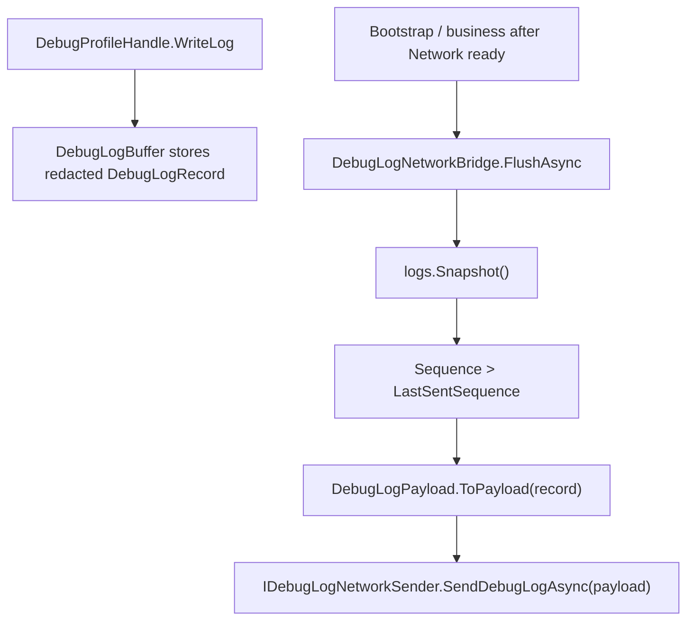

# network-debug-log-transport-contract design

## 0. 术语约定

| 术语 | 定义 | 防冲突结论 |
|---|---|---|
| `DebugLogRecord` | Debug 侧已经写入内存 buffer 的结构化日志记录，包含 sequence、timestamp、level、message、exception、context、tags | 只读取它，不把 sender/transport 放回 DebugModule |
| `DebugLogPayload` | Debug/Logger 侧面向发送实现的只读 payload，字段来自已脱敏 `DebugLogRecord` | 新增于 `GameDeveloperKit.Logger`，不复用 `Message`，避免强绑 socket 协议 |
| `IDebugLogNetworkSender` | Debug log 网络发送抽象，业务或具体网络实现负责把 payload 发到服务端 | 只定义 `SendDebugLogAsync(payload)`，不包含连接、鉴权、重试、批量或缓存 |
| `DebugLogNetworkBridge` | Debug/Logger 侧游标式 bridge，读取 Debug logs snapshot 中尚未发送的记录并调用 sender | 作为 Debug 日志导出契约新增；Network 可实现 sender，但不拥有该契约 |

## 1. 决策与约束

### 需求摘要

本 feature 消费 `runtime-scheduling-diagnostics` roadmap 的最后一条 `network-debug-log-transport-contract`：Debug 侧已经收敛为 profile-centric 门面，并且日志已进入 `DebugProfileHandle.Logs` 的已脱敏 buffer；现在需要在 Debug/Logger 侧定义可由 Network 或业务 sender 实现的实时日志发送接线契约。

成功标准：

- `GameDeveloperKit.Logger` 命名空间提供 `DebugLogPayload`、`IDebugLogNetworkSender` 和 `DebugLogNetworkBridge`。
- bridge 从 `DebugLogBuffer.Snapshot()` 读取记录，转换成 payload 后交给 sender。
- bridge 按 `Sequence` 维护游标，只发送尚未发送的新日志。
- payload 中的 `Exception` / `Context` 是导出用字符串字段，来自 `DebugLogRecord` 已脱敏对象的安全字符串化。
- DebugModule 不新增 sender、transport、sink、analytics 或旧输出扩展点。

### 明确不做

- 不实现具体服务端协议、HTTP endpoint、socket message、鉴权、连接状态、重试、批量上传、断线缓存或限流。
- 不让 DebugModule 持有 Network sender/transport，也不让 Debug 声明 `ModuleDependency(typeof(NetworkModule))`。
- 不在 bridge 中做二次 redaction；payload 只承接 Debug 已完成的 redaction 结果。
- 不新增本地日志持久化、rolling file、上传包或手动导出。
- 不改变 `DebugLogBuffer` 的 ring buffer 语义和 `DebugLogRecord` 的现有字段。
- 不把 `DebugLogPayload` 强制继承 `Message`；具体网络协议由 sender 实现决定。

### 复杂度档位

走 Runtime diagnostics 默认档位，偏离点：

- `Integration = explicit-bridge`：业务或 bootstrap 在 Network ready 后显式创建/调用 bridge；框架不自动发送。
- `Security = redaction-boundary`：Network 只读 Debug 已脱敏日志，不负责二次脱敏。
- `Reliability = best-effort-contract`：当前只定义单次发送契约和游标，不提供 retry/batch/offline cache。

### 关键决策

1. bridge 属于 Debug/Logger 的日志导出契约，不属于 `DebugModule` 生命周期，也不堆进 `NetworkModule`。
   - DebugModule 只暴露 `DebugLogBuffer` / `DebugLogRecord`，不持有 sender/transport。
   - bridge 通过构造参数接收 buffer 和 sender，保持 Debug 对网络生命周期无感；Network 或业务侧只负责实现 sender。

2. sender 接口不绑定 `NetworkModule`。
   - `NetworkModule` 当前已有 socket channel 与 HTTP API，但不同项目可能用 HTTP、socket 或自定义协议发送日志。
   - `IDebugLogNetworkSender` 只固定 payload 交付点，具体发送实现可包一层 `NetworkModule.SendHttpAsync()` 或 `IChannel.SendAsync()`。

3. bridge 使用 `Sequence` 作为游标。
   - `DebugLogRecord.Sequence` 单调递增，适合作为“已尝试发送到哪条”的最小状态。
   - ring buffer 被覆盖后，bridge 只发送 snapshot 中仍存在且 `Sequence > LastSentSequence` 的记录。

4. bridge 转换不做二次 redaction。
   - `Message`、`Category`、`Tags` 已在 Debug 写入 buffer 前处理。
   - `Exception` / `Context` 只做安全字符串化，确保 sender 接收稳定字符串字段。

## 2. 名词与编排

### 2.1 名词层

#### 现状

- `DebugLogRecord` 位于 `Assets/GameDeveloperKit/Runtime/Debug/Profiles/DebugLogRecord.cs`，namespace 仍为 `GameDeveloperKit.Logger`，字段包含 `Sequence`、`Timestamp`、`FrameCount`、`TimerTick`、`Level`、`Category`、`Message`、`Exception`、`Context`、`Tags`。
- `DebugLogBuffer.Snapshot()` 位于 `Assets/GameDeveloperKit/Runtime/Debug/Profiles/DebugLogBuffer.cs`，按 ring buffer 顺序返回只读记录列表。
- `NetworkModule` 位于 `Assets/GameDeveloperKit/Runtime/Network/NetworkModule.cs`，当前负责 channel registry 与 HTTP 请求；不承载 Debug log bridge 契约。
- `DebugModule` 已移除 sink、analytics、transport API，架构约束要求未来网络发送由外部 sender 读取已脱敏记录。

#### 变化

新增 payload：

```csharp
// 来源：Assets/GameDeveloperKit/Runtime/Debug/DebugLogPayload.cs
public readonly struct DebugLogPayload
{
    public DebugLogPayload(
        long sequence,
        DateTimeOffset timestamp,
        int frameCount,
        long timerTick,
        string level,
        string category,
        string message,
        string exception,
        string context,
        IReadOnlyList<string> tags);

    public long Sequence { get; }
    public DateTimeOffset Timestamp { get; }
    public int FrameCount { get; }
    public long TimerTick { get; }
    public string Level { get; }
    public string Category { get; }
    public string Message { get; }
    public string Exception { get; }
    public string Context { get; }
    public IReadOnlyList<string> Tags { get; }
}
```

新增 sender：

```csharp
// 来源：Assets/GameDeveloperKit/Runtime/Debug/IDebugLogNetworkSender.cs
public interface IDebugLogNetworkSender
{
    UniTask SendDebugLogAsync(DebugLogPayload payload);
}
```

新增 bridge：

```csharp
// 来源：Assets/GameDeveloperKit/Runtime/Debug/DebugLogNetworkBridge.cs
public sealed class DebugLogNetworkBridge
{
    public DebugLogNetworkBridge(DebugLogBuffer logs, IDebugLogNetworkSender sender);

    public long LastSentSequence { get; }
    public UniTask<int> FlushAsync();
    public static DebugLogPayload ToPayload(DebugLogRecord record);
}
```

接口示例：

```csharp
// 来源：Assets/GameDeveloperKit/Runtime/Debug/DebugLogNetworkBridge.cs
var bridge = new DebugLogNetworkBridge(App.Debug.Logs, sender);
var count = await bridge.FlushAsync();
```

### 2.2 编排层



#### 现状

- Debug 写入日志时已经在 `DebugProfileHandle.WriteLog()` 中完成 category/message/exception/context/tags redaction。
- `DebugLogBuffer.Snapshot()` 只提供当前 ring buffer 中的记录，不提供增量订阅。
- Network 没有 Debug 日志相关契约；Debug 也没有网络 transport 列表。

#### 变化

- 外部启动代码在 Debug 和具体 sender 所需依赖 ready 后创建 `DebugLogNetworkBridge(App.Debug.Logs, sender)`。
- 每次调用 `FlushAsync()` 时，bridge 获取当前 snapshot，遍历 `Sequence > LastSentSequence` 的记录。
- bridge 把每条 `DebugLogRecord` 转成 `DebugLogPayload`，调用 sender。
- 单条发送成功后更新 `LastSentSequence` 为该记录 sequence；sender 抛异常时停止本轮 flush，把异常向调用方抛出，并保留未成功记录的游标。
- `Exception` / `Context` 转换时捕获 `ToString()` 异常，写入 fallback 文本；这不是 redaction，只是导出 payload 字段稳定化。

#### 流程级约束

- `logs == null` 或 `sender == null` 抛 `ArgumentNullException`。
- `FlushAsync()` 返回本轮成功发送条数。
- 发送顺序保持 `DebugLogBuffer.Snapshot()` 顺序。
- `LastSentSequence` 只在 sender 成功返回后推进。
- sender 异常不被吞掉；连接、重试、延迟重试或错误记录由调用方/具体 sender 管理。
- bridge 不修改 Debug buffer，不清空日志，不改变 Debug 的 category/minimum level/filter/redaction 语义。

### 2.3 挂载点清单

- `Assets/GameDeveloperKit/Runtime/Debug/DebugLogPayload.cs`：新增 payload 值对象。
- `Assets/GameDeveloperKit/Runtime/Debug/IDebugLogNetworkSender.cs`：新增发送抽象。
- `Assets/GameDeveloperKit/Runtime/Debug/DebugLogNetworkBridge.cs`：新增游标式 flush bridge。

本 feature 不新增自动启动挂载点；删除上述三个契约后，Debug log network export 能力从框架视角消失，Debug/Network 其他能力不应失效。

### 2.4 推进策略

1. 名词骨架：新增 payload 和 sender 接口。
   - 退出信号：`GameDeveloperKit.Logger` 命名空间下公开契约可被测试引用。
2. 转换节点：实现 `DebugLogRecord` -> `DebugLogPayload` 映射与安全字符串化。
   - 退出信号：payload 字段完整保留 sequence/timestamp/frame/tick/level/category/message/tags，exception/context 为稳定字符串。
3. bridge 编排：实现 `FlushAsync()` 的 snapshot 遍历、sequence 游标和 sender 调用。
   - 退出信号：连续 flush 只发送新增记录，sender 失败时游标停在最后成功记录。
4. 测试覆盖：补 Debug 侧单测和 Network 命名空间反向边界测试。
   - 退出信号：覆盖正常转换、增量发送、失败游标、Debug 不恢复 transport 生命周期 API，Network 命名空间不出现 Debug bridge 类型。
5. 验证与回写：跑 Runtime / Tests 快速编译，完成 acceptance 与 roadmap 回写。
   - 退出信号：编译通过，checklist checks 全部 passed，roadmap item 标记 done。

### 2.5 结构健康度与微重构

##### 评估

- compound convention 检索：未命中目录组织 / 命名 / 归属相关 convention。
- 文件级 — `Assets/GameDeveloperKit/Runtime/Network/NetworkModule.cs`：职责是 channel registry 与 HTTP API；不承载 Debug bridge，避免把 Debug 导出契约混入网络模块生命周期。
- 文件级 — `Assets/GameDeveloperKit/Runtime/Debug/Profiles/DebugLogRecord.cs`：约 70 行，只读值对象；本次不改字段，避免扩大 Debug 公共面。
- 文件级 — `Assets/GameDeveloperKit/Runtime/Debug/Profiles/DebugLogBuffer.cs`：约 110 行，ring buffer 职责集中；本次通过 `Snapshot()` 读取，不改 buffer。
- 目录级 — `Assets/GameDeveloperKit/Runtime/Debug/`：Debug 公开导出契约以独立小文件承载，和 `NetworkModule` 文件隔离。

##### 结论：不做前置微重构

本次只新增 Debug/Logger 侧契约和小型 bridge，不把 Debug 类型堆进 `NetworkModule`。

##### 超出范围的观察

- 如果后续 Network 继续增加 Debug profile、连接指标、日志 sender 实现和协议 adapter，`Runtime/Network/` 可能需要按 `Debug/Channel/Http/Message` 分组；这属于后续目录整理，不阻塞本 feature。

## 3. 验收契约

### 关键场景清单

- N1：构造 `DebugLogPayload` → 所有字段按构造参数暴露，`Tags == null` 时使用空列表。
- N2：`DebugLogNetworkBridge.ToPayload(record)` → `Sequence/Timestamp/FrameCount/TimerTick/Level/Category/Message/Tags` 与 record 一致，level 是字符串。
- N3：record 的 exception/context 已是 redacted string 或 redacted exception → payload 的 `Exception` / `Context` 是对应字符串。
- N4：record 的 exception/context `ToString()` 抛异常 → ToPayload 不抛，payload 使用 fallback 文本。
- N5：首次 `FlushAsync()` 读取 2 条日志 → sender 按 snapshot 顺序收到 2 条，返回 2，`LastSentSequence` 到最新 sequence。
- N6：第二次 `FlushAsync()` 且没有新日志 → sender 不再收到旧日志，返回 0。
- N7：追加新日志后再次 `FlushAsync()` → 只发送 `Sequence > LastSentSequence` 的新记录。
- E1：sender 在第二条记录抛异常 → `FlushAsync()` 向调用方抛出，`LastSentSequence` 只推进到第一条成功记录，后续 flush 会重试失败记录。
- E2：构造 bridge 时 `logs == null` 或 `sender == null` → 抛 `ArgumentNullException`。

### 明确不做的反向核对项

- DebugModule 不应新增 `AddSink` / `AddAnalyticsSink` / `AddLogTransport` / `IDebugLogTransport` 等旧扩展点。
- DebugModule 不应持有 `IDebugLogNetworkSender` 或 `DebugLogNetworkBridge` 实例，也不暴露相关属性。
- `GameDeveloperKit.Network` 命名空间不应出现 `DebugLogPayload` / `IDebugLogNetworkSender` / `DebugLogNetworkBridge`。
- bridge 不应调用 `DebugRedactionUtility`，不做二次 redaction。
- bridge 不应实现 retry、batch、offline cache、throttle、auth 或具体 endpoint。
- `DebugLogPayload` 不应继承 `Message` 或强制绑定某种 socket/HTTP 协议。

## 4. 与项目级架构文档的关系

acceptance 阶段需要更新 `.codestable/architecture/ARCHITECTURE.md`：

- Debug 小节补充：实时网络日志由 Debug/Logger 侧 bridge 读取 `DebugLogBuffer` 中已脱敏 `DebugLogRecord`，DebugModule 不持有 sender/transport。
- Network 小节或总入口补充：Network 不承载 Debug log bridge 类型；需要网络发送时由具体 sender 使用 Network API。
- 已知约束补充：Debug log bridge 只做显式 flush 和游标，不提供鉴权、连接、重试、批量、缓存或限流；这些由具体 sender 或后续 feature 承担。

requirement `runtime-diagnostics` 可在 acceptance 后补充 `implemented_by`，但仍可能保持 draft，取决于用户故事中命令工具/更完整实时发送是否全部完成。
