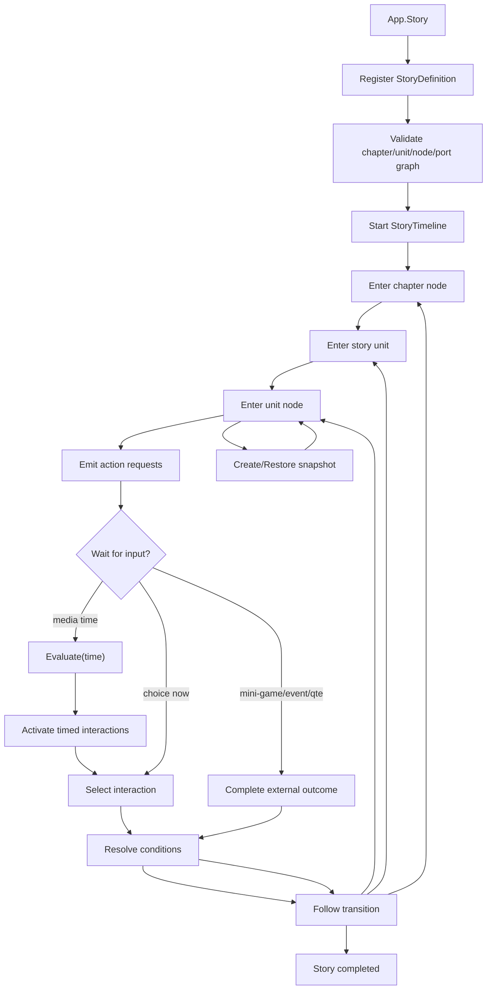

# story-module design

## 0. 术语约定

| 术语 | 定义 | 防冲突结论 |
|---|---|---|
| `TimelineBase` | Core 下所有 timeline 类的通用基类，提供名称、时长、当前时间和求值入口 | 薄基类，不负责播放调度、剧情图、资源加载、存档或 Editor UI |
| `StoryModule` | 运行时剧情执行模块，管理 definition registry 和当前 `StoryTimeline` | 不是剧情编辑器，也不是顶层 `ProcedureModule` |
| story definition | 一份运行时可消费的剧情定义，包含 story id、entry chapter、chapters、units 和 version | 来源可以是配置、资源、代码或后续编辑器导出，但本 feature 不规定加载来源 |
| story chapter | 剧情章节，负责宏观分支路径和剧情单元串接 | 对应参考文章里的章节层，不等于运行时 Procedure |
| story unit | 章节中的一段具体剧情内容，内部有自己的节点图 | 对应参考文章里的单元剧层，不等于 Unity Scene |
| story node | unit 内的执行节点，例如 start、end、dialogue、image、video、choice、event、mini-game、jump、custom | 不是 UI 节点，也不是 `ProcedureBase` |
| story port / transition | 节点的输出口和到下一个节点 / 单元 / 章节的跳转关系 | 分支以稳定 id 表达，不靠表格行号或视觉位置 |
| story interaction | 可等待玩家或外部系统回应的交互，例如选项、QTE、热点按钮、小游戏结果 | StoryModule 只暴露交互请求，不绘制按钮或处理输入 |
| story condition | 控制节点、选项或 transition 是否可用的条件引用 | 由外部 resolver 求值，不直接读取 DataModule 或业务变量 |
| story action | 节点进入时向表现层发出的请求，例如播放视频、显示图片、显示文本、触发自定义事件、打开小游戏 | 本地 action 请求，不默认进入 EventModule |
| `StoryTimeline` | 某次正在推进的剧情运行实例，继承 `TimelineBase`，持有当前位置、当前时间、pending action、active interactions 和 history | 不另起与 timeline 平行的 session 基类 |
| story snapshot | 可序列化剧情进度，记录 story/chapter/unit/node、current time、active interactions、history 和 pending external state | 是交给业务或 DataModule 持久化的值，不由 StoryModule 直接落盘 |

## 1. 决策与约束

### 参考素材

- 参考文章：<https://blog.csdn.net/qq_30448401/article/details/141814515>。
- 采纳：章节层与单元剧层拆分、GraphView 式节点语义、视频/图片/文本/小游戏/选项/事件/Jump 节点、定时出现选项、条件控制和外部事件扩展这些 runtime 语义。
- 不采纳到本 feature：GraphView、ScriptableObject 编辑器实现、Excel/多语言编辑器 UI、素材预览和节点 Inspector 细节；这些属于后续 Story Editor 或工具链。

### 需求摘要

做什么：新增运行时 `StoryModule`，让业务能注册 story definition，启动章节，进入剧情单元，执行媒体 / 文本 / 事件 / 小游戏 / Jump / Choice 等节点；通过条件 resolver、显式时间求值和外部完成结果推进剧情；同时在 Core 下保留并落地 `TimelineBase` 作为所有 timeline 类的共同基类。

为谁：需要承接复杂分支剧情、视频互动剧情、对话选择、小游戏结果分支或新手引导剧情的玩法程序，以及后续要接入剧情编辑器产物的工具链。

成功标准：

- Core 下存在瘦身 `TimelineBase`，不依赖 Timer、Config、Data、Procedure、Resource、Localization 或 Editor API。
- `StoryModule` 能注册 / 注销 story definition，并校验 story/chapter/unit/node/port/transition 的引用完整性。
- `StoryTimeline` 能按 entry chapter 启动，进入 story unit，并暴露当前节点产生的 action requests。
- 支持 start/end/dialogue/image/video/choice/event/mini-game/jump/custom 这些节点语义的最小运行时承载。
- 支持选项或 transition 的条件求值；含条件的 definition 在没有 resolver 时不会静默通过。
- 支持媒体时间求值：调用方传入时间后，timeline 暴露达到触发点的 interactions。
- 支持外部结果推进：小游戏、QTE、自定义事件等可以通过 outcome id 回到剧情图。
- 支持 snapshot 创建和恢复，恢复后 chapter/unit/node/time/pending interaction/history 保持一致。
- 首版不直接联动 ConfigModule / DataModule / ProcedureModule / ResourceModule / LocalizationModule；调用方负责加载定义、持久化 snapshot、解析文本和表现 UI。

### 明确不做

- 不做剧情编辑器、GraphView、Excel 导入导出、时间线画布或 authoring project。
- 不渲染对白文本、按钮、视频、图片、语音、镜头、动画或过场；只暴露 action / interaction 请求。
- 不替代 `ProcedureModule`，不管理游戏启动、登录、主菜单、战斗等顶层流程。
- 不直接调用 `ConfigModule` 读取配置，也不定义配置表 schema。
- 不直接调用 `DataModule` 保存进度，也不定义本地存档槽。
- 不直接调用 `ResourceModule` 加载视频、图片、音频或剧情定义。
- 不直接调用 `LocalizationModule` 解析文本；剧情 payload 使用文本 key / payload，显示层自行解析。
- 不自动注册 Timer update，不做自动播放器；时间推进来自调用方显式 `Evaluate(time)`。
- 不内置 Lua、表达式脚本 VM、任务系统或通用变量黑板；条件只通过外部 resolver。
- 不把旧 `story-editor` draft 推进到实现；editor 等 runtime 契约稳定后再回来设计。

### 复杂度档位

- `Robustness = L4`：definition、condition、action payload 和 snapshot 都可能来自工具链或外部配置，必须强校验并保证失败不半注册 / 半恢复。
- `Structure = module + core-contract + integration-contracts`：Core 的 `TimelineBase`、Runtime/Story 的定义模型、执行状态机和外部 integration 契约分开。
- `Concurrency = single-runner`：公开 API 假定 Unity 主线程调用；一个 `StoryModule` 首版只维护一个当前 `StoryTimeline`。
- `Idempotency = explicit-state`：重复注册同 story id 拒绝；`Restore(CreateSnapshot())` 得到相同 runtime 状态。
- `Extensibility = typed-payload`：节点类型、action payload、condition id 和 outcome port 允许后续扩展，但首版不引入动态脚本系统。

### 关键决策

1. 运行时使用“章节图 + 单元剧图”两层模型。
   - 采用：chapter 负责宏观路线，unit 负责具体节点执行。
   - 拒绝：所有节点塞进单张大图。
   - 原因：参考文章把章节编辑器和单元剧编辑器分开，这个分层对 runtime 也有价值，能避免宏观分支和具体表现混在一起。

2. StoryModule 是执行编排器，不是表现播放器。
   - 采用：节点进入时产生 `StoryActionRequest` / active interactions，调用方负责播放和显示。
   - 拒绝：StoryModule 内直接播放视频、创建 UI 按钮或加载资源。
   - 原因：剧情推进应独立于 UI、Resource、Sound、Localization，才能被不同表现层复用。

3. `StoryTimeline : TimelineBase` 承载当前运行实例。
   - 采用：`Evaluate(time)` 只处理当前节点或媒体时间上的触发点。
   - 拒绝：StoryModule 自动注册 Timer update。
   - 原因：有些剧情时间来自视频播放进度，有些来自 UI 或外部玩法，统一用调用方显式喂时间更稳。

4. 条件求值通过 resolver，而不是直接读 DataModule。
   - 采用：`IStoryConditionResolver` 或等价 delegate，由业务把变量和存档接进去。
   - 拒绝：StoryModule 内建变量黑板、脚本 VM 或 DataModule 读取。
   - 原因：条件含义属于业务域，框架只定义什么时候问、问什么、失败如何处理。

5. 外部动作与结果用 action / outcome 协议。
   - 采用：事件、小游戏、QTE、媒体播放等节点进入 pending 状态，调用方用 outcome id 完成。
   - 拒绝：把小游戏流程、事件派发或媒体生命周期写进 StoryModule。
   - 原因：这样能覆盖参考文章里的自定义事件和小游戏节点，又不让 StoryModule 吃掉业务系统。

6. Snapshot 记录执行状态，不替代存档。
   - 采用：snapshot 包含 story/chapter/unit/node/current time/active interactions/history/pending external state。
   - 拒绝：StoryModule 直接保存、回滚或管理存档版本。
   - 原因：DataModule 负责持久化；StoryModule 只说明“剧情现在在哪、等什么”。

## 2. 名词与编排

### 2.1 名词层

#### 现状

- `Assets/GameDeveloperKit/Runtime/Core/` 当前有 `IReference`、`GameException`、`IGameModule` 和 dependency attributes，没有 timeline 基类。
- `Assets/GameDeveloperKit/Runtime/App.cs` 通过 `App.GetModule<T>()` 和 `App.X` 属性按需解析 runtime module；还没有 `App.Story`。
- `Assets/GameDeveloperKit/Runtime/Procedure/ProcedureModule.cs` 是顶层流程状态机，依赖 Timer 驱动当前 `ProcedureBase.OnUpdate()`，不是剧情执行器。
- `Assets/GameDeveloperKit/Runtime/Config/ConfigModule.cs` 负责加载只读配置表；`Assets/GameDeveloperKit/Runtime/Data/DataModule.cs` 负责运行中数据保存和回滚；`Assets/GameDeveloperKit/Runtime/Resource/ResourceModule.cs` 负责资源加载。
- `.codestable/features/2026-06-19-localization-module/localization-module-design.md` 已设计 `LocalizationModule` 管文本 key 查询；StoryModule 不直接解析本地化文本。
- `.codestable/features/2026-06-18-story-editor/story-editor-design.md` 是 editor authoring draft，用户已明确先设计 runtime。

#### 变化

- `TimelineBase`：Core 通用时间轴基类，所有 timeline 类型共同继承。

```csharp
public abstract class TimelineBase : IReference
{
    public virtual string Name => GetType().Name;
    public float Duration { get; protected set; }
    public float CurrentTime { get; private set; }

    public void Seek(float time);
    public void Evaluate(float time);
    protected abstract void OnEvaluate(float time);
    public virtual void Release();
}
```

- `StoryModule`：运行时模块外壳，负责 definition registry、当前 timeline 生命周期、condition resolver 挂接和 snapshot restore。
- `StoryDefinition`：顶层剧情定义，包含 `StoryId`、`Version`、`EntryChapterId`、`Chapters`、`Units`。
- `StoryChapterDefinition`：章节图，包含 chapter node、unit reference、chapter transition 和 chapter end。
- `StoryUnitDefinition`：单元剧图，包含 unit start、unit nodes、unit end ports 和内部 transitions。
- `StoryNodeDefinition`：节点定义，包含 `NodeId`、`NodeType`、`Payload`、`Actions`、`Interactions`、`Ports`、`Conditions`。
- `StoryTransitionDefinition`：从 node port / interaction / outcome 指向目标 node、unit end 或 chapter node 的跳转。
- `StoryInteractionDefinition`：选项、QTE、热点按钮等交互定义，包含 trigger time、condition、display payload 和 output port。
- `StoryActionDefinition`：进入节点时的表现 / 事件请求，例如 display text、show image、play video、fire event、open mini-game。
- `StoryConditionReference`：条件 id + 参数，不在 definition 内直接写业务判断代码。
- `StoryTimeline`：运行实例，继承 `TimelineBase`，持有 current chapter/unit/node、pending actions、active interactions、history、completed。
- `StorySnapshot`：可序列化状态，包含 story/chapter/unit/node、current time、pending action/outcome、active interaction ids 和 history。
- `StoryActionRequestEventArgs` / `StoryNodeChangedEventArgs` / `StoryInteractionEventArgs`：本地通知参数，不进入全局 EventModule。

接口示例：

```csharp
App.Story.Register(definition);
App.Story.SetConditionResolver(resolver);

var timeline = App.Story.Start("main_story", "chapter_01");
var action = timeline.PendingActions[0];     // show text / play video / open mini-game
timeline.Evaluate(12.5f);                   // media time reaches choice trigger
var choices = timeline.ActiveInteractions;
timeline.Select("choice_help");
timeline.CompleteExternal("mini_game", "success");

var snapshot = timeline.CreateSnapshot();
App.Story.Restore(snapshot);
```

### 2.2 编排层



#### 现状

- 现在 runtime 没有章节图、单元剧图、节点 action、定时交互、条件 resolver、外部 outcome 或 snapshot restore 的统一入口。
- Procedure、Data、Config、Resource、Localization 各自有边界；剧情执行不能把这些模块的职责吞进去。

#### 变化

1. 模块解析与外壳启动。
   - `App.Story` 按需创建 `StoryModule`。
   - `StoryModule.Startup()` 初始化 definition registry、当前 timeline、condition resolver 和本地事件状态，不做异步读取。
   - 首版不声明 `[ModuleDependency]`。

2. Definition 注册与图校验。
   - 校验 story/chapter/unit/node id 非空且唯一。
   - 校验 entry chapter、unit reference、node transition、interaction target、outcome port 都存在。
   - 校验 media trigger time 在节点 duration 范围内。
   - 校验 jump / event immediate transition 有循环 guard 所需元数据；运行时仍允许显式循环，但禁止一次进入中无限空转。
   - 校验失败不写入 registry，错误包含 story/chapter/unit/node/port/interaction id。

3. Chapter -> Unit -> Node 执行。
   - `Start(storyId, chapterId)` 创建 `StoryTimeline`，进入 chapter entry。
   - chapter node 可引用 unit；进入 unit 后从 unit start node 开始。
   - unit end 通过 output port 回到 chapter transition；chapter end 标记 story completed。
   - jump 节点立即走目标 transition，但受单次推进 loop guard 保护。

4. Node action 与外部表现。
   - dialogue/image/video/event/mini-game/custom 节点进入时生成 action request。
   - display 文本使用 text key / payload；调用方可交给 LocalizationModule，但 StoryModule 不调用它。
   - media 资源只保存 location/key/payload；调用方可交给 Resource/Sound/VideoPlayer，但 StoryModule 不调用它们。
   - required action 未完成时 timeline 处于 waiting 状态；调用方用 `CompleteExternal(actionId, outcomeId)` 回传结果。

5. 定时交互与条件。
   - `Evaluate(time)` 更新 `CurrentTime` 并激活到达 trigger time 的 interactions。
   - option/QTE/hotspot 等 interaction 可携带 condition；显示前或选择时通过 resolver 求值。
   - definition 含 condition 但未设置 resolver 时，相关 interaction / transition 不静默通过，抛带 condition id 的 `GameException`。
   - 通过 resolver 的 interaction 才能进入 active list；选择后按 output port transition。

6. Snapshot 与恢复。
   - `CreateSnapshot()` 记录 story/chapter/unit/node/time、active interaction ids、pending action ids、history 和 completed。
   - `Restore(snapshot)` 要求 story definition 已注册且 version 匹配或兼容，current target 存在。
   - restore 失败时不半更新当前 timeline。
   - snapshot 不负责磁盘持久化，调用方可交给 DataModule。

7. 本地可观测点。
   - `NodeChanged` 观察 node 进入 / 离开。
   - `ActionRequested` 观察需要表现层执行的动作。
   - `InteractionActivated` 观察定时交互或可选项出现。
   - `StoryCompleted` 观察章节或全剧情完成。
   - 全部为同步本地事件，不通过 EventModule，也不保证跨线程。

#### 流程级约束

- 错误语义：所有错误至少带 story id；章节、单元、节点、交互、条件、outcome 相关错误继续带对应 id。
- 幂等性：重复注册同 story id 拒绝；`Restore(CreateSnapshot())` 不改变 current node、time、pending/active 状态和 history。
- 顺序：必须先 register definition，再 start / restore；未启动 timeline 时读取 current、select、complete external 必须明确失败。
- 并发：首版公开 API 假定 Unity 主线程调用，不做锁、后台线程或任务队列。
- 循环：显式分支循环允许；同一推进调用内的纯 jump/event 空转超过 guard 判定为错误，避免卡死。
- 扩展点：新节点类型、新 action payload、新 interaction 类型和新 condition 参数可以扩展；首版不提供脚本 VM。

### 2.3 挂载点清单

1. `App.Story` runtime module 入口：删除后业务无法按统一入口访问剧情执行能力。
2. `TimelineBase` Core 契约：删除后 `StoryTimeline` 和后续 timeline 类型失去共同基类。
3. `Assets/GameDeveloperKit/Runtime/Story/` runtime story 契约：删除后 definition、chapter、unit、node、action、interaction、condition、timeline 和 snapshot 失去承载位置。
4. Story definition 注册与校验 API：删除后运行时无法接收编辑器或配置产出的剧情定义。
5. `StoryTimeline` 执行 API：删除后无法 start/evaluate/select/complete external/restore。
6. Condition resolver 与 action/interaction 本地通知：删除后剧情无法接入业务条件、媒体表现、小游戏结果和定时交互。
7. Story snapshot API：删除后运行时剧情进度无法以稳定值对象交给业务或 DataModule 保存。

拔除沙盘：去掉这些挂载点后，运行时剧情执行能力应整体消失；Config/Data/Procedure/Resource/Localization 和旧 story-editor draft 不应受影响。

### 2.4 推进策略

1. Core 时间线基类：建立 `TimelineBase` 的最小时间轴契约。
   - 退出信号：派生类能通过 `Seek/Evaluate` 设置当前时间并触发 `OnEvaluate`，基类没有 Timer / Config / Data / Procedure / Resource / Localization / Editor 依赖。
2. Story 定义模型：建立 story/chapter/unit/node/port/transition/action/interaction/condition/snapshot 形状。
   - 退出信号：能用纯内存对象描述一个章节、一个剧情单元、视频节点、定时选项、小游戏结果和结尾。
3. Definition registry 与校验：实现注册表和跨 chapter/unit/node 的引用校验。
   - 退出信号：合法 definition 可注册；重复 id、缺失 target、非法 trigger time、缺失 outcome port 被拒绝并带定位。
4. Timeline 执行状态机：实现 start、进入 chapter/unit/node、transition、completed 和 loop guard。
   - 退出信号：entry chapter 能进入 unit start；jump 能立即跳转；纯空转循环会被 guard 拦截。
5. Action / interaction 编排：实现 action request、required pending、timed interaction activation、select 和 external outcome。
   - 退出信号：视频节点 `Evaluate(time)` 到触发点后出现选项；小游戏节点等待外部 success/fail 后进入对应分支。
6. Condition resolver：接入条件求值和缺 resolver 错误语义。
   - 退出信号：条件通过时 interaction 可用，条件失败时不可选择，缺 resolver 时抛明确错误。
7. Snapshot / restore 与可观测点：实现状态快照、本地事件和恢复失败回滚。
   - 退出信号：`Restore(CreateSnapshot())` 后位置、时间、active/pending、history 一致；节点变化和 action request 可被订阅。
8. 验证覆盖：补齐 Core、注册校验、执行流、条件、外部 outcome、snapshot 和范围守护。
   - 退出信号：关键验收场景都有自动测试或可复核证据，且不需要启动 Config/Data/Procedure/Resource/Localization。

### 2.5 结构健康度与微重构

##### 评估

- compound convention 检索：未命中 story / storyline / event / condition / minigame / timeline 相关目录或命名 convention。
- 文件级 — `Assets/GameDeveloperKit/Runtime/Core/`：当前 Core 文件职责清楚；新增薄 `TimelineBase` 不需要移动现有 Core 类型。
- 文件级 — `Assets/GameDeveloperKit/Runtime/App.cs`：模块入口集中在 App 内，新增 `App.Story` 属于既有模式延伸，不在本 feature 中拆 App。
- 文件级 — `ProcedureModule.cs`、`ConfigModule.cs`、`DataModule.cs`、`ResourceModule.cs`、`LocalizationModule` draft：本 feature 不修改这些模块。
- 目录级 — `Assets/GameDeveloperKit/Runtime/Story/` 当前不存在；本 feature 名词较多，直接平铺会很快膨胀。

##### 结论：不做现有文件微重构，但新目录按子域组织

本次不搬迁现有 Runtime 模块，也不重组 Core 或 App。新增 `Runtime/Story/` 时应从一开始按 definition / execution / integration / events 或等价子域拆文件，避免把 definition、timeline、condition 和 action 都塞进一个模块文件。这个目录组织是本 feature 的内部结构，不先沉淀为全项目 convention。

##### 建议沉淀的 convention

- 后续所有 timeline 类型继承 Core 下的 `TimelineBase`，但不得把播放调度、配置加载、存档、Localization 或 Editor API 放入基类。
- StoryModule 首版不声明 Config/Data/Procedure/Resource/Localization/Timer 依赖；需要读取、保存、流程编排、文本解析、资源播放或表现时由调用方显式接入对应模块。
- Runtime/Story 新增类型按“定义模型 / 执行状态 / 外部集成 / 事件参数”分组，不把所有公开值对象堆进 `StoryModule.cs`。

##### 超出范围的观察

- 后续 Story Editor 应消费本次 story definition / action / interaction / snapshot 契约，再设计 GraphView、Excel、多语言编辑和素材预览。
- 后续如果要做变量黑板、条件表达式语言、Lua、任务图、资源预加载或自动播放 controller，建议拆成 story runtime extensions，不并入首版执行器。

## 3. 验收契约

| 编号 | 输入 / 触发 | 期望可观察结果 |
|---|---|---|
| N1 | 定义一个继承 `TimelineBase` 的派生 timeline | 能 `Seek/Evaluate` 并调用派生 `OnEvaluate`，基类不依赖 Timer / Config / Data / Procedure / Resource / Localization / Editor |
| N2 | 通过 `App.Story` 首次访问模块 | 返回已启动的 `StoryModule`，且未隐式启动 Config/Data/Procedure/Resource/Localization/Timer |
| N3 | 注册包含 chapter、unit、video、choice、mini-game、end 的合法 definition | 注册成功，可按 story id 启动 |
| N4 | `Start(storyId, chapterId)` | timeline 进入 entry chapter 和首个 unit start node，产生首个 node 的 action request |
| N5 | 进入 dialogue/image/video 节点 | `PendingActions` 或本地事件暴露对应 action payload，不直接播放资源或改 UI |
| N6 | video 节点有 triggerTime=12.5 的 option，调用 `Evaluate(12.4)` | option 尚未 active |
| N7 | 同一 video 节点调用 `Evaluate(12.5)` | option 进入 active interactions，可被查询或收到 activation 通知 |
| N8 | 选择条件通过的 option | timeline 记录 history，并沿 option output port 进入 target node |
| N9 | 条件失败的 option | option 不可选或选择失败，current node 不变 |
| N10 | 进入 mini-game 节点后调用 `CompleteExternal(actionId, "success")` | timeline 沿 success outcome port 进入目标 node |
| N11 | jump 节点指向另一个 node | 同一推进中立即进入目标 node；若纯 jump 循环超过 guard 则失败 |
| N12 | unit end 通过 output port 回到 chapter transition | timeline 进入 chapter 的下一个 unit 或 chapter end |
| N13 | `CreateSnapshot()` 后立即 `Restore(snapshot)` | story/chapter/unit/node/time/active interactions/pending actions/history/completed 保持一致 |
| N14 | 订阅 `ActionRequested` / `NodeChanged` 后推进节点 | 收到同步本地事件，事件包含 story/chapter/unit/node/action id |
| B1 | 注册 definition 时 story/chapter/unit/node id 为空或重复 | 注册失败，错误包含重复或空 id 的定位 |
| B2 | transition target、unit reference 或 outcome port 不存在 | 注册失败，错误包含 story/chapter/unit/node/port id |
| B3 | media interaction trigger time 超出节点 duration | 注册失败，错误包含 node id 和 interaction id |
| B4 | definition 含 condition，但未设置 resolver 就尝试显示或选择相关 interaction | 抛 `GameException`，错误包含 condition id |
| B5 | restore snapshot 指向未注册 story id、版本不兼容或不存在 node | 恢复失败，当前 timeline 不被半更新 |
| B6 | completed 后继续 select / complete external | 操作失败并说明 timeline 已完成 |
| E1 | 实现中直接读取 Excel、创建 GraphView 或提供编辑器窗口 | 判定为超范围 |
| E2 | 实现中让 StoryModule 依赖 ConfigModule / DataModule / ProcedureModule / ResourceModule / LocalizationModule | 判定为错误 |
| E3 | 实现中直接播放 VideoPlayer、AudioSource、创建 UI Button 或加载 Unity 资源 | 判定为错误 |
| E4 | 实现中自动注册 Timer update 并按帧播放剧情 | 判定为超范围 |
| E5 | `TimelineBase` 内置 story graph、配置读取、存档、Localization 或 Editor API | 判定为错误 |
| E6 | 实现中内置 Lua / 表达式 VM / 通用变量黑板 | 判定为超范围 |

### 明确不做的反向核对项

- 不应出现 `StoryModule` 调用 `App.Config`、`App.Data`、`App.Procedure`、`App.Resource`、`App.Localization` 来完成首版能力。
- 不应出现 Unity Editor API、GraphView、Excel import/export、菜单项或窗口代码。
- 不应出现 UI button、dialogue presenter、VideoPlayer、AudioSource、camera/cutscene 轨道实现。
- 不应把 timeline 上的视觉位置、配置表行号或列表顺序当作剧情逻辑主键。
- 不应让无效 definition 或 snapshot 半注册 / 半恢复。

## 4. 与项目级架构文档的关系

验收通过后需要更新 `.codestable/architecture/ARCHITECTURE.md`：

- 记录 Core 提供 `TimelineBase` 作为所有 timeline 类的薄基类。
- 记录 `StoryModule` 是 runtime story definition / chapter / unit / node / action / interaction / condition / snapshot 的执行模块，通过 `App.Story` 按需访问。
- 记录 StoryModule 首版无 Config/Data/Procedure/Resource/Localization/Timer 依赖，调用方负责加载 definition、持久化 snapshot、解析文本、播放资源和表现 UI。
- 记录 Story Editor 是后续 authoring 能力，应消费 runtime StoryModule 的 definition / action / interaction / snapshot 契约，而不是反向驱动 runtime 模块。
