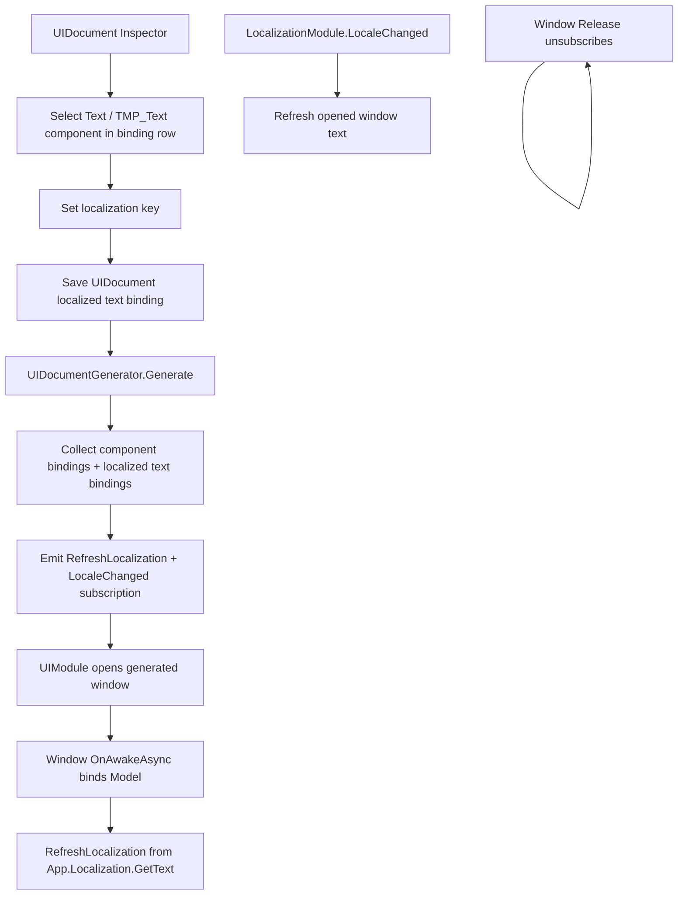

# ui-localization-binding design

## 0. 术语约定

| 术语 | 定义 | 防冲突结论 |
|---|---|---|
| UI localization binding | `UIDocument` 上保存的“文本组件 -> localization key”显式绑定 | 不是自动扫描场景/prefab，也不是翻译内容管理 |
| localizable text component | 可由绑定刷新 `.text` 的 `UnityEngine.UI.Text`、`TMPro.TMP_Text` 或其常见派生类型 | 不包含图片、音频、字体 fallback、RTL 排版 |
| localization key | `LocalizationModule.GetText(key)` 使用的稳定文本标识 | 不复用 Config 表主键；本 feature 只保存 key，不保存语言包 |
| generated localization refresh | `UIDocumentGenerator` 生成的窗口代码：打开时设置文本，语言变化时重新设置文本 | 消费 `App.Localization.LocaleChanged`，不把本地化逻辑塞进 `UIModule` |
| static localized label | 不带运行时参数的 UI 文案，例如按钮、标题、固定提示 | 本 feature 首版只覆盖这一类；动态格式化文本由 controller 手写 |

## 1. 决策与约束

### 需求摘要

做什么：在现有 `UIDocument` Inspector / code generator 链路中增加本地化文本设置。UI 开发者可以对已绑定的 `Text` / `TMP_Text` 组件填写 localization key；生成窗口代码时，生成器会在窗口 `OnAwakeAsync()` 绑定组件后调用 `App.Localization.GetText(key)` 设置文本，并订阅 `LocalizationModule.LocaleChanged` 在语言切换时刷新。

为谁：维护 UI prefab 和窗口代码的 UI 开发者，以及希望 UI 文案不再硬编码在 prefab / controller 中的框架维护者。

成功标准：

- `UIDocument` Inspector 能对已选择的 Text / TMP 文本组件填写 localization key。
- 本地化绑定保存到 `UIDocument` 序列化数据，不依赖 Editor 临时状态。
- 生成代码能在窗口打开时把绑定文本替换为 `App.Localization.GetText(key)`。
- `App.Localization.SetLocale()` 触发 `LocaleChanged` 后，已打开窗口的绑定文本刷新。
- 窗口释放时取消语言变化订阅，不留下事件引用。
- 未配置本地化 binding 的窗口生成代码不引用 `LocalizationModule`。
- 本 feature 不修改 `LocalizationModule` 的包加载、fallback、format、missing 记录语义。

### 明确不做

- 不做机器翻译、翻译平台、语言包编辑器或 localization key 管理后台。
- 不自动扫描场景、prefab 或所有 `Text` / `TMP_Text` 并替换文案；必须在 `UIDocument` Inspector 中显式配置。
- 不支持动态格式化参数、复数、性别、日期/货币格式化；这些由 controller 调用 `App.Localization.Format()` 手写。
- 不做字体 fallback、RTL 排版、本地化图片、音频或 prefab 变体。
- 不修改 `UIModule` 的窗口打开、关闭、Back、安全区或资源生命周期语义。
- 不让 `LocalizationModule` 依赖 UI；依赖方向只允许生成的 UI 窗口代码消费 Localization。

### 复杂度档位

- `Robustness = L3`：本地化 key 和组件引用是 serialized/prefab 输入，必须校验空 key、缺失组件、不支持组件类型和重复绑定。
- `Structure = modules`：新增 runtime UI binding 数据类型和 Editor-only drawer/generator 扩展，避免继续把所有 Inspector 逻辑塞进单个文件。
- `Compatibility = additive serialized schema`：在 `UIDocument` 增加本地化绑定数组，不破坏既有 `mappings` 组件绑定结构。
- `Dependency = optional consumer`：只有配置了 localization binding 的生成窗口才引用 `App.Localization`；`UIModule` 本身不声明 Localization 依赖。

### 关键决策

1. 本地化绑定挂在 `UIDocument`，不挂在 `UIModule`。
   - 采用：`UIDocument` 保存文本组件与 key 的 authoring 数据；生成窗口代码负责刷新。
   - 拒绝：让 `UIModule` 遍历所有窗口并自动找文本。
   - 原因：`UIModule` 只管窗口生命周期和资源，不应知道每个业务文案 key。

2. 绑定必须显式配置，首版不自动扫描替换。
   - 采用：只有用户在 Inspector 中填写 key 的文本组件才进入生成代码。
   - 拒绝：扫描所有 Text/TMP_Text 并按对象名猜 key。
   - 原因：自动猜 key 容易误改静态占位、运行时动态文本和调试文本。

3. 生成代码订阅 `LocalizationModule.LocaleChanged`。
   - 打开窗口时先完成组件绑定，再刷新初始文本，再进入 controller 生命周期。
   - 语言变化时只刷新本窗口已配置的 static localized labels。
   - 释放窗口时取消订阅；取消订阅用 `App.TryGetRegistered<LocalizationModule>()`，避免 Release 期间意外启动模块。

4. 生成器以当前代码入口 `App` 为准。
   - 当前仓库运行时模块入口是 `App.UI`、`App.Localization`、`App.Input`。
   - 本 feature 修改 `UIDocumentGenerator` 时，新增本地化代码使用 `App.Localization`。
   - 如果同次生成文件需要继续输出打开/关闭 helper，应同步使用 `App.UI`，不再新增 `Super.UI` 引用。
   - 原因：当前代码库没有 `Super` 类型，生成代码应对齐实际入口。

5. 首版只覆盖静态文本。
   - `LocalizationModule.GetText(key)` 负责 fallback 和 missing 记录。
   - 动态数值、倒计时、玩家名、物品数量等由 controller 在业务时机调用 `Format()` 或手动设置。
   - 这样避免生成器预设参数来源或监听任意业务状态。

## 2. 名词与编排

### 2.1 名词层

#### 现状

- `Assets/GameDeveloperKit/Runtime/Localization/LocalizationModule.cs` 已提供 `GetText()`、`Format()`、`LocaleChanged` 和 `Snapshot()`。
- `Assets/GameDeveloperKit/Runtime/UI/UIDocument.cs` 保存 full screen root、safe area root 和 `UIBindMapping[] mappings`，当前没有本地化绑定数据。
- `Assets/GameDeveloperKit/Runtime/UI/UIBindMapping.cs` 保存 `Name`、`Target` 和 `Component[] Components`。
- `Assets/GameDeveloperKit/Editor/UI/UIDocumentInspector.cs` 已提供 Code Generation 区、AutoBind、TreeView 和组件多选下拉。
- `Assets/GameDeveloperKit/Editor/UI/UIDocumentGenerator.cs` 会根据 `UIDocument.Mappings` 生成 Window / Model / Module / Controller 四件套，并按组件类型生成 model 字段。
- `Assets/GameDeveloperKit/Runtime/UI/UIModule.cs` 只管理窗口 root、layer、safe area、打开关闭和资源句柄，不消费 Localization。

#### 变化

新增运行时序列化数据：

```csharp
// 来源：Assets/GameDeveloperKit/Runtime/UI/UILocalizedTextBinding.cs
[Serializable]
public sealed class UILocalizedTextBinding
{
    public Component Component;
    public string Key;
}
```

扩展 `UIDocument`：

```csharp
// 来源：Assets/GameDeveloperKit/Runtime/UI/UIDocument.cs
public IReadOnlyList<UILocalizedTextBinding> LocalizedTexts { get; }
```

生成代码目标示例：

```csharp
// 来源：UIDocumentGenerator 生成的 ExampleWindow.g.cs
private void RefreshLocalization()
{
    Model.text_title.text = App.Localization.GetText("ui.main.title");
    Model.btn_start_text.text = App.Localization.GetText("ui.main.start");
}

private void OnLocaleChanged(LocalizationChangedEventArgs args)
{
    RefreshLocalization();
}
```

Editor-only 名词：

- `UIDocumentLocalizationDrawer`：在 Inspector 中显示每个已选择文本组件的 localization key 输入。
- `LocalizedTextBindingInfo`：生成器内部收集结果，包含 mapping name、field name、component type、key。

### 2.2 编排层



#### 现状

- UI prefab 文本可以通过 `UIDocument` 绑定到 generated model，但生成器不处理本地化 key。
- `LocalizationModule.LocaleChanged` 已存在，但 UI 生成代码没有订阅刷新路径。
- UI 文案如果要本地化，当前只能在 controller 手写 `App.Localization.GetText()` 并自行订阅/刷新。

#### 变化

1. Inspector 设置本地化 key。
   - 对每个 binding row 中已选择的 Text / TMP_Text 组件，显示 localization key 输入。
   - key 为空表示该组件不参与本地化刷新。
   - 保存时写入 `UIDocument` 的 `LocalizedTexts` 数组；删除组件或清空 key 会移除对应 binding。

2. 生成前校验。
   - `LocalizedTexts.Component` 不能为空。
   - component 必须属于某个 `UIBindMapping.Target` 且出现在该 mapping 的 `Components` 中。
   - component 类型必须是支持的文本类型。
   - key 必须非空白。
   - 同一个 component 不允许绑定多个 key。

3. 生成刷新代码。
   - 生成器先按现有规则生成 model 字段。
   - 对每条 localization binding，用该组件对应的 model 字段生成 `.text = App.Localization.GetText(key)`。
   - 如果窗口没有 localization bindings，不生成 `RefreshLocalization()`、不引用 `GameDeveloperKit.Localization`。
   - 如果有 localization bindings，生成 `LocaleChanged` 订阅、刷新方法和 Release 取消订阅代码。

4. 运行时刷新。
   - 窗口 `OnAwakeAsync()` 中完成 `Model` 赋值后立即刷新初始文本。
   - `LocalizationModule.LocaleChanged` 后刷新所有 configured static labels。
   - `Release()` 中取消订阅并清空 model，避免关闭窗口后仍被事件持有。

#### 流程级约束

- 错误语义：生成阶段发现空 key、缺失组件、非文本组件、组件不属于 mapping 或重复 component binding 时，抛 `GameException` 并显示在 Inspector dialog。
- 幂等性：重复生成同一 `UIDocument` 输出稳定文本；语言切换多次只刷新当前打开窗口，不重复订阅。
- 顺序：组件绑定早于初始本地化刷新；初始刷新早于 controller `OnAwakeAsync()`，让 controller 看到当前语言文本。
- 依赖方向：`UIModule` 不依赖 `LocalizationModule`；只有生成窗口代码在存在 localization bindings 时消费 `App.Localization`。
- 可观测点：生成 report / dialog 能指出 mapping、component 和 key；运行时 missing key 继续由 `LocalizationModule` missing 记录观察。

### 2.3 挂载点清单

1. `UIDocument.LocalizedTexts` serialized field：删除后 prefab 无法保存文本 key 绑定。
2. `UIDocument` Inspector 本地化 key 输入：删除后用户无法在 UI 模块编辑器里维护 localization settings。
3. `UIDocumentGenerator` 本地化代码生成分支：删除后已保存 key 不会在运行时生效。
4. generated window `LocaleChanged` subscription：删除后语言切换不会刷新已打开窗口。
5. generated window `Release()` unsubscribe：删除后关闭窗口可能保留事件引用。

拔除沙盘：去掉这些挂载点后，`LocalizationModule` 仍可由业务手写调用，`UIModule` 仍能打开窗口；只是 UIDocument 显式本地化绑定和生成刷新能力消失。

### 2.4 推进策略

1. Editor 结构微重构：把 `UIDocumentInspector` 中已有 TreeView 嵌套类搬到独立 Editor-only 文件。
   - 退出信号：Inspector 行为不变，AutoBind、组件下拉和 TreeView 仍可用，Editor 编译通过。
2. runtime 数据骨架：新增 `UILocalizedTextBinding`，并让 `UIDocument` 暴露只读 `LocalizedTexts`。
   - 退出信号：prefab 可序列化保存空本地化绑定数组，旧 `mappings` 不受影响。
3. Inspector 设置入口：在绑定行或详情区为 Text / TMP_Text 组件显示 localization key 输入。
   - 退出信号：选择文本组件后可填写 key，清空 key 会移除 binding。
4. 生成器收集与校验：把 localized text bindings 映射到已有 model 字段。
   - 退出信号：缺失组件、非文本组件、组件未选入 binding、重复 component 和空 key 都能失败定位。
5. 生成刷新代码：输出初始刷新、`LocaleChanged` 订阅和 Release 取消订阅。
   - 退出信号：带 key 的窗口生成 `RefreshLocalization()`，无 key 的窗口不引用 Localization。
6. 验证覆盖：补齐生成代码编译、语言切换刷新、释放取消订阅和范围守护。
   - 退出信号：Editor / Runtime 快速编译通过，关键验收场景有自动测试或手工证据。

### 2.5 结构健康度与微重构

##### 评估

- compound convention 检索：未命中“目录组织 / 命名 / 归属 / UI / Localization / UIDocument”相关 convention。
- 文件级 — `Assets/GameDeveloperKit/Runtime/UI/UIDocument.cs`：职责清晰，新增只读 `LocalizedTexts` 属性属于同一 document 数据边界，改动密度低。
- 文件级 — `Assets/GameDeveloperKit/Runtime/UI/UIBindMapping.cs`：本 feature 不修改组件绑定 schema。
- 文件级 — `Assets/GameDeveloperKit/Editor/UI/UIDocumentInspector.cs`：当前已超过 700 行，混合 generator 区、bindings toolbar、AutoBind、component menu、TreeView 嵌套类；本 feature 还要加入 localization key UI，继续堆会加重职责混杂。
- 文件级 — `Assets/GameDeveloperKit/Editor/UI/UIDocumentGenerator.cs`：当前承担生成四件套和字段命名；新增本地化刷新代码属于生成器职责延伸，但要避免把收集/校验写成大函数。
- 目录级 — `Assets/GameDeveloperKit/Editor/UI/`：当前文件数少，但 UI editor helper 已开始变多；新增 `BindingTreeView.cs`、`UIDocumentLocalizationDrawer.cs` 或等价 helper 不会造成目录摊平。

##### 结论：做微重构（拆文件）

实现阶段第一步先做只搬不改行为的 Editor 结构微重构：

- 搬什么：把 `UIDocumentInspector` 内部的 `BindingTreeView` / `BindingTreeItem` 搬到独立 Editor-only 文件；必要时把组件菜单 item 小结构也搬出。
- 搬到哪：`Assets/GameDeveloperKit/Editor/UI/BindingTreeView.cs` 和相邻 helper 文件。
- 行为不变怎么验证：Editor 编译通过；打开现有 `UIDocument` Inspector 时 Code Generation、AutoBind、TreeView、组件多选下拉行为不变。

本地化 UI 再作为新增 drawer/helper 落入 `Editor/UI/`，避免继续扩大 `UIDocumentInspector.cs`。

##### 超出范围的观察

- `UIDocumentGenerator` 历史生成代码里仍有 `Super.UI`，而当前仓库只有 `App.UI`。本 feature 修改生成器时应避免新增 `Super` 引用；是否把已有 `Super.UI` 输出修成 `App.UI` 需要在实现时作为生成代码可编译的前置修正记录清楚。
- 如果未来要做 localization key 管理、语言包编辑或缺失 key 批量扫描，应另起 Localization Editor / Config integration feature，不放进 UIDocument Inspector。

## 3. 验收契约

| 编号 | 输入 / 触发 | 期望可观察结果 |
|---|---|---|
| N1 | 打开带 `UIDocument` 的 prefab Inspector | 已有绑定编辑能力仍可用，文本组件可看到 localization key 设置入口 |
| N2 | 为 `b_Title` 选择 `Text` 组件并填写 key `ui.title` | `UIDocument.LocalizedTexts` 保存该组件和 key |
| N3 | 为 `b_Start` 选择 `TextMeshProUGUI` / `TMP_Text` 并填写 key `ui.start` | 生成器识别为可本地化文本组件 |
| N4 | 点击 Generate Code | 生成窗口代码包含 `RefreshLocalization()` 和 `App.Localization.GetText("ui.title")` |
| N5 | 没有任何 localization binding 的 UIDocument 生成代码 | 生成代码不引用 `GameDeveloperKit.Localization`，不订阅 `LocaleChanged` |
| N6 | 打开生成窗口且当前 locale 已注册 key | 文本组件显示当前语言文本 |
| N7 | 窗口已打开时调用 `App.Localization.SetLocale("en-US")` | 已绑定文本刷新为 en-US 文本 |
| N8 | 关闭 / Release 窗口后再次切换语言 | 已关闭窗口不再收到刷新，不抛空引用 |
| N9 | localization key 缺失 | 文本显示 key 或 fallback 结果，missing 记录由 `LocalizationModule.Snapshot()` 可观察 |
| B1 | localization binding 的 key 为空白 | 生成失败，错误定位到 component / binding |
| B2 | localization binding 的 component 引用为空 | 生成失败，错误定位到本地化绑定 |
| B3 | localization binding 指向非 Text/TMP 组件 | 生成失败，错误说明组件类型不支持 |
| B4 | localization binding 指向的组件不在对应 `UIBindMapping.Components` 中 | 生成失败，提示先在 UIDocument binding 中选择该组件 |
| B5 | 同一个文本组件绑定了两个 key | 生成失败，不随机选择一个 key |
| E1 | 实现中修改 `LocalizationModule.GetText()` / `LocaleChanged` 语义来迁就 UI | 判定为超范围 |
| E2 | 实现中让 `UIModule` 声明依赖 `LocalizationModule` | 判定为超范围 |
| E3 | 实现中自动扫描所有 prefab 文本并写入 key | 判定为超范围 |

### 明确不做的反向核对项

- 不应出现机器翻译、翻译平台、语言包编辑器或 localization key 管理后台。
- 不应出现自动扫描场景/prefab 并替换所有文本的逻辑。
- 不应出现动态格式化参数、复数、性别、日期/货币格式化生成逻辑。
- 不应出现字体 fallback、RTL、本地化图片、音频或 prefab 变体实现。
- 不应修改 `UIModule` 的打开、关闭、Back、安全区或资源生命周期语义。
- 不应让 `LocalizationModule` 引用 UI 命名空间或 UI 类型。

## 4. 与项目级架构文档的关系

验收通过后需要更新 `.codestable/architecture/ARCHITECTURE.md`：

- 记录 UI 子系统的 `UIDocument` 可保存显式 `UILocalizedTextBinding`，用于把已绑定文本组件映射到 localization key。
- 记录生成窗口代码在存在 localization bindings 时消费 `App.Localization.GetText()` 和 `LocalizationModule.LocaleChanged`，但 `UIModule` 本体不依赖 Localization。
- 记录首版只覆盖静态 Text/TMP 文本，不做动态格式化、字体/RTL、本地化图片或语言包编辑。
- 记录依赖方向：Localization 是运行时文本查询能力，UI 生成代码是消费方；Localization 不反向引用 UI。
