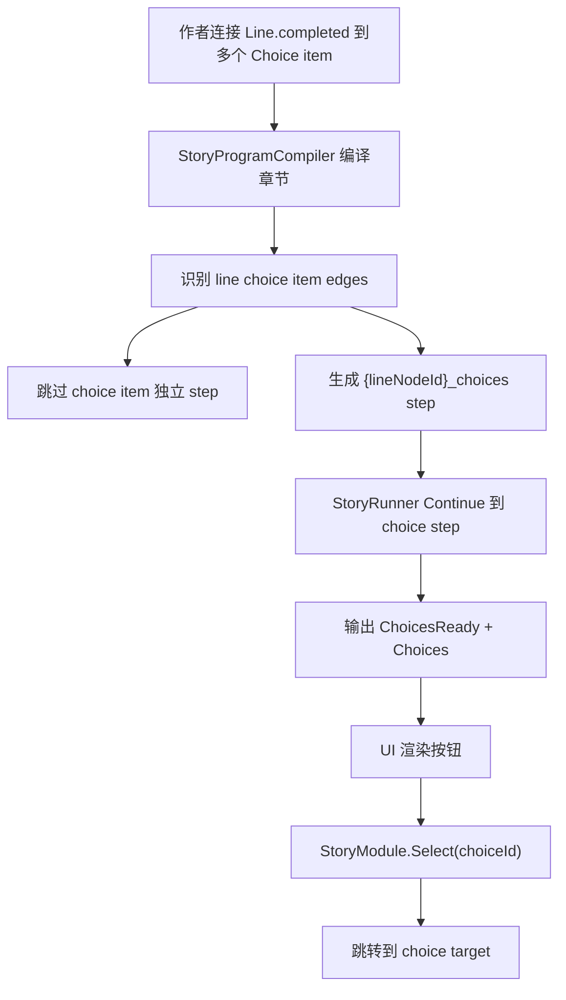

# Choice Item Branching Contract Design

## 0. 术语约定

| 术语 | 定义 | 防冲突结论 |
|---|---|---|
| Line node | 作者图中的 `Dialogue` / `Narration` 文本节点 | 完成端口是 `completed` |
| Choice item node | 作者图中的 `NodeKind.Choice` 节点，一个节点只表示一个玩家可选项 | 不是独立运行步骤；主路径必须由 line node 汇聚后合成 |
| Synthetic choice step | 编译器为 line node 生成的 `StoryStepKind.Choice` 运行时步骤 | step id 默认为 `{lineNodeId}_choices` |
| ChoicesReady output | 运行时对 UI 表达“当前可渲染选项已就绪”的输出 | 现状叫 `StoryOutputKind.Choice`；本 feature 改名/别名到 `ChoicesReady`，避免和 step kind 混淆 |
| Select contract | UI 在玩家选择后只调用 `Select(choiceId)` 推进 | `choiceId` 使用 choice item node id |
| Choice condition | 选项可见条件 | line 到 choice item 的边条件与 choice item 的 selected 边条件按 AND 合并 |

## 1. 决策与约束

### 需求摘要

做什么：把 `Dialogue/Narration.completed -> 多个 Choice item -> selected 分支目标` 从“已有一部分实现”固化为正式 authoring、compiler、runtime 契约。

为谁：剧情策划、剧情 UI/表现层、`StoryProgramCompiler` 维护者，以及后续图上校验和示例剧情 fixture。

成功标准：

- 作者图里，一个 `Choice` 节点只代表一个选项项，节点标题/字段在图上表达给作者看。
- 编译器把同一个 line node 连接到的多个 choice item 合成为一个稳定的 `StoryStepKind.Choice`。
- 合成 step 的每个 `StoryChoice` 使用 choice item node id 作为 `ChoiceId`，使用 `textKey` 作为显示文本键，使用 `selected` 目标作为推进目标。
- 运行时在文本 Continue 后输出 `ChoicesReady`，UI 只读取 `Choices` 并调用 `Select(choiceId)`。
- 旧的“独立 Choice step 有多个输出端口”只作为兼容手写/迁移输入，不作为 Story Editor 作者图主语义。

明确不做：

- 不做命令节点字段类型化、资源 ObjectField 或 command argument 导出；留给 `typed-command-fields`。
- 不做 graph 错误 badge、字段红框或 validation overlay；留给 `story-graph-validation-feedback`。
- 不扩展复杂表达式编辑器；本次只合并现有边条件和节点条件来源。
- 不引入 Yarn Spinner / Ink runtime，也不引入 Unity 官方 Graph Toolkit。
- 不恢复 `unit`、`payload`、owner action/transition 为作者主界面概念。

### 复杂度档位

走 Story 编译/运行时契约默认档位，偏离点如下：

- `Compatibility = controlled-breaking-name`：允许把运行时输出名从 `Choice` 收敛到 `ChoicesReady`，但实现时要考虑已有测试/调用方的过渡。
- `Idempotency = stable-ids`：同一作者图重复编译必须得到相同 synthetic step id、choice id 和 choice 顺序。
- `Isolation = editor-authoring -> compiler -> runtime`：作者图语义只在 compiler 前处理，runtime 不引用 editor graph 或 layout。

### 关键决策

1. `NodeKind.Choice` 在 Story Editor 作者图中命名为“选项项节点”。
   - 它只能接在 line node 的 `completed` 后。
   - 它只能从 `selected` 单连到分支目标或结束。
   - 它不再作为作者图中的独立 runtime step 执行。

2. Line node 负责触发一次玩家选择。
   - line node 自身仍编译为 `StoryStepKind.Line`。
   - line node 的 `completed` 如果连接 choice item，则额外生成一个 synthetic choice step。
   - line node 的普通直连模式和 choice item 模式不能混合；这个规则已经由 port policy 阻止，compiler 仍要兜底报错。

3. `ChoicesReady` 是 UI 面向语义。
   - 现有 `StoryOutputKind.Choice` 容易和 `StoryStepKind.Choice` 混淆。
   - 本 feature 要让运行时输出契约表达为 `ChoicesReady`；实现可选择新增 enum 成员并保留 `Choice` 兼容别名，或一次性改名并同步测试。

4. Choice item 的文本键必须稳定。
   - 主契约：`TextKey = choiceNode.Parameters["textKey"]`。
   - 为兼容已有旧数据，可保留 title/node id fallback，但 compiler 必须产生 warning；新作者图和示例 fixture 必须填 `textKey`。

## 2. 名词与编排

### 2.1 名词层

#### 现状

- `StoryEditorPortPolicy` 已允许 `Dialogue/Narration.completed` 多连到多个 `Choice`，并限制 `Choice.selected` 单连分支目标。
- `StoryProgramCompiler.BuildLineChoiceStep()` 已能扫描 line node 到 choice item 的边，生成 `{lineNodeId}_choices` 的 `StoryStepKind.Choice`，并跳过 choice item 节点本身。
- `StoryProgramCompiler.BuildChoiceStep()` 仍支持旧式独立 `NodeKind.Choice`，把不同输出端口编译成一个 choice step 的多个 `StoryChoice`。
- `StoryRunner` 对 `StoryStepKind.Choice` 输出 `StoryOutputKind.Choice`，`StoryModule.Select(choiceId)` 委托到 runner。
- `StoryChoice` 已包含 `ChoiceId`、`TextKey`、`Condition`、`Target`、`Tags`。

#### 变化

作者图契约固定为：

```text
Dialogue.completed
  -> Choice(textKey=choice.help).selected -> Branch A
  -> Choice(textKey=choice.leave).selected -> Branch B
```

编译后契约固定为：

```text
Line step:      stepId = line_intro, kind = Line
Choice step:    stepId = line_intro_choices, kind = Choice
StoryChoice[0]: choiceId = choice_help, textKey = choice.help, target = Branch A
StoryChoice[1]: choiceId = choice_leave, textKey = choice.leave, target = Branch B
```

运行时输出契约固定为：

```csharp
output.Kind == StoryOutputKind.ChoicesReady
output.Choices[i].ChoiceId == choiceItemNode.NodeId
module.Select(choiceId)
```

Choice item 到 `StoryChoice` 的字段映射：

| 字段 | 来源 | 约束 |
|---|---|---|
| `ChoiceId` | choice item `NodeId` | 同一 synthetic step 内唯一 |
| `TextKey` | `Parameters["textKey"]` | 新图必填；fallback 只兼容旧数据并 warning |
| `Condition` | incoming edge conditions AND selected edge conditions | 两侧都没有时为 null |
| `Target` | choice item 的唯一 `selected` 输出目标 | 缺失或多条都编译失败 |
| `Tags` | choice item `Parameters["tags"]` | 可选，逗号/分号/竖线分隔口径沿用现状 |

### 2.2 编排层



#### 现状

编译器已经按 line node 额外插入 synthetic choice step，但这套逻辑仍和旧式 `BuildChoiceStep()` 并存，且 `StoryOutputKind.Choice` 命名会让作者图 choice item、runtime choice step、UI choice output 三层概念混在一起。

#### 变化

1. 编译器先建立 choice item id 集合：所有从 line `completed` 指向的 `NodeKind.Choice` 都是 choice item。
2. 编译普通节点时跳过 choice item，不让它们生成独立 runtime step。
3. 编译 line node 后，如果存在 choice item 边，追加一个 synthetic choice step。
4. synthetic step 的 choice 顺序以 line node `completed` 的出边顺序为准；重复编译不改变顺序。
5. 每个 choice item 必须恰好一个 `selected` 输出目标；无目标或多目标都是 compiler error。
6. line completed 的 edge conditions 与 choice selected edge conditions 合并为 AND。
7. `StoryRunner` 执行到 synthetic choice step 时输出 `ChoicesReady`，并只等待 `Select(choiceId)`。
8. `Select(choiceId)` 找不到当前输出里的 choice 时抛定位错误；成功后记录 history 并跳到该 choice target。

#### 流程级约束

- 错误语义：compiler 错误必须包含 `story/chapter/node/port` 或 `choice` 定位，方便后续图上校验回指节点。
- 顺序：先保留旧式独立 Choice step 兼容测试，再把 Story Editor 的主路径改为 choice item 合成；不要让兼容路径影响作者图 UI。
- 幂等性：synthetic step id 先尝试 `{lineNodeId}_choices`；冲突时使用现有 `_2` 后缀规则。
- Runtime 边界：`StoryRunner` 只看 `StoryProgram`，不读取 `NodeDefinition`、authoring edge 或 graph layout。
- UI 边界：UI 不直接执行 target，不读 compiler 内部 edge；只能消费 output.Choices 并调用 `Select(choiceId)`。

### 2.3 挂载点清单

- `StoryProgramCompiler` 的 line choice item 识别与 synthetic step 生成：删除后作者图多个 Choice item 不会变成 runtime 选择。
- `StoryChoice` / `StoryStepKind.Choice` / `StoryOutputKind.ChoicesReady`：删除后 runtime 无法表达可选择项。
- `StoryRunner.Select(choiceId)` 与 `StoryModule.Select(choiceId)`：删除后 UI 无法把玩家选择反馈给剧情运行时。
- `StoryEditorPortPolicy` 的 line-to-choice 输入约束：删除后 compiler 会收到不可解释的混合连接。

### 2.4 推进策略

1. 微重构：把 `StoryProgramCompiler` 中 choice 编译相关 helper 拆到 compiler partial 文件。
   退出信号：行为不变，现有 editor compiler tests 仍通过构建。
2. 编译契约收紧：明确 choice item 识别、跳过独立 step、selected 单目标、条件合并和 textKey warning/error 语义。
   退出信号：合法 choice item 图生成 synthetic step，非法图返回带定位的 compiler error。
3. Runtime 输出命名：把当前选择输出语义收敛为 `StoryOutputKind.ChoicesReady`，并同步创建/测试口径。
   退出信号：Continue 到选择步骤时输出 kind 为 `ChoicesReady`，`Choices` 列表完整。
4. 选择推进闭环：补齐 `Select(choiceId)` 成功、错误 id、非选择状态调用和 history 记录场景。
   退出信号：选择后跳到目标 step/完成状态，错误包含 story/chapter/step/choice。
5. Story Editor 作者图口径：确保默认/示例创建的 Choice item 带图上文本键字段，不把旧式多端口 Choice 暴露为主流程入口。
   退出信号：v4 fixture 或测试使用 line-to-choice-item-to-target 语义。
6. 测试与证据：补齐 compiler/runtime/editor 关键场景并运行相关构建。
   退出信号：Editor.Tests、Runtime.Tests 相关构建通过；diff check 通过。

### 2.5 结构健康度与微重构

##### 评估

- 文件级 - `StoryProgramCompiler.cs`：当前约 1760 行，已经同时承担节点编译、choice 合成、command、condition、migration 兼容和大量 helper。继续在单文件里加 choice 契约会让核心流程更难读。
- 文件级 - `StoryRunner.cs`：约 600 行，职责集中在运行时解释器状态机。本 feature 只改 choice 输出命名和选择推进测试，不需要拆 runner。
- 文件级 - `StoryOutput.cs` / `StoryChoice.cs`：较小，适合直接承载输出命名和 choice 值对象契约。
- 目录级 - `Assets/GameDeveloperKit/Editor/StoryEditor/Compiler/`：目前只有一个 compiler 文件，新增 partial 文件能把 choice 编译逻辑聚到同目录，不改变命名空间或模块边界。
- compound convention 搜索未命中现有 Story compiler 文件拆分约定。

##### 结论：做微重构（拆文件）

先把 `StoryProgramCompiler` 中 choice 相关 helper 拆到同目录 partial 文件，例如 `StoryProgramCompiler.Choice.cs`。这是“只搬不改行为”的微重构：保留静态类、命名空间和私有 helper 可见性，通过 `partial` 维持调用关系，然后再在该局部文件内收紧 choice item 契约。

独立退出信号：

- 拆分后 `StoryProgramCompiler` 仍编译。
- 现有 `ProgramCompiler_WhenLineConnectsChoiceItemNodes_BuildsChoiceStepAfterLine` 行为不变。
- 旧式独立 Choice step 测试仍保留，确保兼容路径未被误删。

##### 超出范围的观察

- `StoryProgramCompiler` 还可以继续按 command/branch/target/condition 拆更多 partial，但本 feature 只拆 choice 相关逻辑。
- 长期可以把旧式独立 Choice step 标成 legacy compiler path；本 feature 只明确 Story Editor 不把它作为主 authoring 入口。

## 3. 验收契约

| 编号 | 输入 / 触发 | 期望可观察结果 |
|---|---|---|
| N1 | Line.completed 连接两个 Choice item，两个 Choice item 各自 selected 到目标 | 编译生成 line step + `{lineNodeId}_choices` synthetic choice step |
| N2 | 上述合法图编译后检查 steps | choice item node id 不作为独立 step 出现在 chapter steps 中 |
| N3 | 合成 step 的 choices | `ChoiceId` 等于 choice item node id，`TextKey` 来自 `textKey` 参数，target 来自 `selected` 边 |
| N4 | line->choice 边有条件，choice.selected 边也有条件 | runtime `StoryChoice.Condition` 为 AND 合并 |
| N5 | choice item 没有 selected 输出 | 编译失败，错误定位到 choice item node |
| N6 | choice item 有多个 selected/输出目标 | 编译失败，错误定位到 choice item node |
| N7 | line completed 同时连 Choice item 和普通目标 | 编译失败，错误定位到 line completed 端口 |
| N8 | choice item 缺 `textKey` | 新图至少产生 warning 或 error；若兼容 fallback，warning 包含 node id |
| N9 | synthetic step id `{lineNodeId}_choices` 与已有节点/step 冲突 | 编译生成稳定后缀 id，不覆盖已有 step |
| N10 | runner Continue 通过 line 后进入合成选择步骤 | 输出 `StoryOutputKind.ChoicesReady`，`Choices.Count` 与可用选项一致 |
| N11 | UI 调用 `Select(validChoiceId)` | runner 跳到该 choice target，history 记录 choice id |
| N12 | UI 调用不存在的 choice id | 抛 `GameException`，错误包含 story/chapter/step/choice |
| N13 | 非选择等待状态调用 `Select(choiceId)` | 抛当前没有激活选择的错误 |
| N14 | choice condition 为 false | `ChoicesReady.Choices` 中不包含该选项；全部不可用时抛“无可用选项”错误 |
| N15 | Story Editor 默认/测试 fixture 创建选项分支 | 使用 line-to-choice-item-to-selected-target，不暴露旧式多端口 Choice 主入口 |

### 明确不做的反向核对项

- 不应新增命令字段 ObjectField、资源 GUID 导出或 command argument schema。
- 不应新增 graph validation overlay、字段红框或错误 badge。
- 不应让 runtime 引用 `EditorNodeGraphKit`、UI Toolkit、UnityEditor 或 GraphView。
- 不应把 `NodeKind.Choice` 在 Story Editor 主流程中继续当作“一个节点内部有多个选项端口”的作者入口。
- 不应恢复 `unit`、`payload`、owner action/transition 为作者主界面概念。

## 4. 与项目级架构文档的关系

验收通过后需要更新 `.codestable/architecture/ARCHITECTURE.md` 的 Story Editor / Editor Node Graph 现状：

- Choice item node 是作者图中的一个玩家可选项，不作为独立 runtime step。
- `StoryProgramCompiler` 将 line completed 的多个 choice item 合成为 synthetic `StoryStepKind.Choice`。
- 运行时选择输出为 `ChoicesReady`，UI 只通过 `Select(choiceId)` 推进。
- Story runtime 继续只消费 `StoryProgram`，不引用 editor graph 或 layout。

