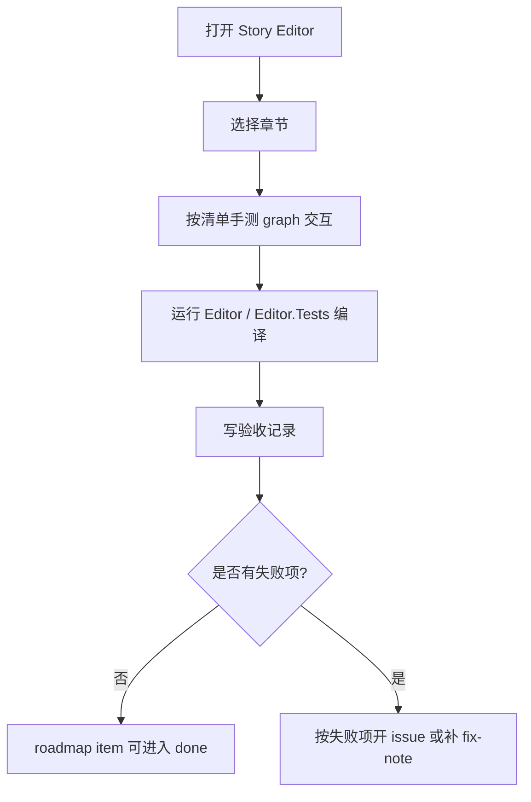

# Editor Graph Manual Acceptance Design

## 0. 术语约定

| 术语 | 定义 | 防冲突结论 |
|---|---|---|
| Editor Node Graph Kit | `Assets/GameDeveloperKit/Editor/NodeGraph/` 下的项目内 UI Toolkit 节点图库 | 区别于 Unity 官方 Graph Toolkit；当前 Unity 2022.3 下先用它承载 ShaderGraph 式交互 |
| graph area | `EditorNodeGraphCanvas` 内实际承载节点、连线、pan/zoom 的区域 | 区别于整个 Story Editor 窗口和左侧剧情树 |
| manual acceptance | 在真实 Unity Editor 窗口里按清单操作并记录结果 | 不替代自动测试；用于补上 UITK 鼠标/键盘事件在真实窗口中的证据 |
| box selection | 在 graph area 空白处按住左键拖出矩形并选中相交节点 | 只属于通用节点图交互；Story 语义仍由 adapter/window 处理 |
| palette drag | 从“节点库”拖模板到 graph area 创建节点 | 不再是单击创建；也不依赖 UnityEditor 原生 `DragAndDrop` 作为唯一通道 |

## 1. 决策与约束

### 需求摘要

做什么：把 Story Editor 目前最容易退化的基础图交互整理成正式验收闭环，包括真实窗口操作清单、自动测试兜底和修复记录。

为谁：剧情编辑器使用者和后续 `story-graph-port-policy`、`choice-item-branching-contract` 等语义 feature。

成功标准：真实 Unity Editor 中能完成右键创建、Space 创建、Delete 删除、Esc 取消、F 聚焦、拖拽节点、端口拖线、palette 拖入、框选节点、pan/zoom、缩放后 wire 对齐；失败项必须有 issue/fix-note 或明确遗留。

明确不做：

- 不调整 Story 节点连接语义；端口合法性收紧留给 `story-graph-port-policy`。
- 不重做选项节点 runtime 语义；留给 `choice-item-branching-contract`。
- 不引入官方 Graph Toolkit 包，也不恢复 GraphView。
- 不在 runtime 里引用 `EditorNodeGraphKit`、UI Toolkit editor 类型或 UnityEditor API。

### 复杂度档位

走 Editor 工具交互验收默认档位，无额外高并发、外部 SDK、数据迁移或 runtime 持久化偏离。

### 关键决策

1. 真实 Editor 手测是本 feature 的一等输出。
   - 原因：UI Toolkit 的 mouse capture、panel 坐标、键盘焦点和 `GenericMenu` 显示无法只靠 `dotnet build` 证明。
2. 自动测试只覆盖可稳定离屏验证的契约。
   - 覆盖：adapter 渲染、创建节点委托、连接校验委托、缩放锚点、Delete 委托、runtime 不引用 editor graph。
   - 不强行模拟完整鼠标拖拽路径；真实拖拽由 manual acceptance 清单证明。
3. graph kit 仍保持业务无关。
   - Story 节点语义和中文业务规则放在 `StoryEditorGraphAdapter`，不下沉到 `EditorNodeGraphKit`。

## 2. 名词与编排

### 2.1 名词层

#### 现状

- `EditorNodeGraphCanvas` 是复用画布入口，已通过 `IEditorNodeGraphAdapter` 获取 nodes/wires/templates，并负责 pan/zoom、wire 绘制、右键菜单、快捷键和 palette 拖入。
- `EditorNodeGraphNodeView` 是节点视图，负责节点拖拽、端口 dot 和节点内字段。
- `EditorNodeGraphPaletteView` 是节点库，负责模板展示和拖拽事件。
- `StoryEditorWindow` 通过 `StoryEditorGraphAdapter` 把剧情章节图接入通用画布。
- `EditorNodeGraphTests` 已有若干离屏测试，但无法替代真实窗口中的鼠标/键盘事件验收。

#### 变化

- 新增“验收记录”名词：每次真实 Editor 操作按场景记录 `通过 / 失败 / 阻塞` 和必要说明。
- 将 graph 交互通过三层证据收敛：
  - 自动测试：可离屏验证的 graph kit 契约。
  - 编译验证：Editor / Editor.Tests csproj 通过。
  - 手测记录：真实 Story Editor 窗口里的交互清单。
- 不新增 runtime 名词，不改变 `StoryProgram` / `StoryRunner` / `StoryModule`。

#### 接口示例

```text
输入：打开 Story Editor，选择章节，按住节点库“对白”拖入 graph area 后松手
输出：画布中创建一个“对白”节点；单击节点库不创建节点；节点库拖动过程中显示节点名预览

输入：选中节点后按 Delete
输出：调用 adapter.DeleteSelection()，节点或连线从当前章节移除，画布刷新
```

### 2.2 编排层



#### 现状

Story Editor 能打开并显示 `EditorNodeGraphCanvas`，但先前多次出现节点拖拽、端口连线、palette 拖入、缩放锚点和 wire 对齐问题。当前代码中已有修补：

- graph kit 使用 `LocalToWorld(evt.localMousePosition)` 做节点/端口拖拽坐标。
- canvas 缩放使用鼠标所在 graph point 锚定。
- content transform origin 设为左上角，避免缩放后 wire/node 坐标漂移。
- palette 拖入改为内部事件流，避免 UITK mouse capture 与 UnityEditor `DragAndDrop` 交接失败。
- Delete/Esc/Space/F 和右键创建菜单已集中在 `EditorNodeGraphCanvas`。

#### 变化

本 feature 不扩大行为，只把这些交互纳入正式验收：

1. 启动 Story Editor 并选择章节。
2. 对 graph area 执行清单操作。
3. 失败项要么当场修 issue，要么记录阻塞原因。
4. 通过后回写 roadmap，让 `story-graph-port-policy` 能按依赖启动。

#### 流程级约束

- 错误语义：手测失败不允许写“已通过”；必须记录失败项和下一步。
- 顺序约束：`story-graph-port-policy` 之前完成本项，避免语义规则叠在不稳定交互上。
- 扩展点位置：通用交互修复只在 `EditorNodeGraphKit`；Story 业务连接规则只在 adapter/schema。
- 可观测点：每个手测场景都有可肉眼确认的结果或自动测试对应项。

### 2.3 挂载点清单

本 feature 不引入新的用户入口或 runtime 挂载点。它复用以下既有入口：

- `GameDeveloperKit/剧情编辑器` 菜单项：打开 Story Editor。
- `EditorNodeGraphCanvas`：Story Editor 的 graph 主画布。
- `IEditorNodeGraphAdapter`：业务模型接入 graph kit 的唯一边界。

删除本 feature 的验收记录不会删除编辑器能力；但删除这些既有入口会让本 feature 的验收对象消失。

### 2.4 推进策略

1. 交互清单固化：把 Story Editor 的 graph 操作列成可执行验收场景。
   退出信号：每个场景都有触发动作和期望结果。
2. 自动测试对齐：确认可离屏验证的 graph kit 契约已有测试覆盖，缺口补测试。
   退出信号：Editor.Tests 编译通过，测试项覆盖 Delete、缩放锚点、palette 外部释放、adapter 边界等契约。
3. 真实 Editor 手测：在 Unity Editor 中按清单操作 Story Editor。
   退出信号：每个场景记录 `通过 / 失败 / 阻塞`。
4. 失败项闭环：对失败项开 issue/fix-note 或记录阻塞。
   退出信号：没有未解释的失败项。
5. roadmap 回写：验收通过后将 `editor-graph-manual-acceptance` 标为 done。
   退出信号：items.yaml 校验通过。

### 2.5 结构健康度与微重构

##### 评估

- 文件级 — `Assets/GameDeveloperKit/Editor/NodeGraph/EditorNodeGraphCanvas.cs`：承担通用画布交互，职责集中但事件较多；本 feature 只做验收和少量测试，不继续把 Story 语义塞入该文件。
- 文件级 — `Assets/GameDeveloperKit/Editor/NodeGraph/EditorNodeGraphNodeView.cs`：承担节点视图和端口拖拽，职责仍在节点视图范围内；本 feature 不改节点语义。
- 文件级 — `Assets/GameDeveloperKit/Editor/StoryEditor/Window/StoryEditorWindow.cs`：窗口文件较大，但本 feature 不往窗口追加业务表单或新语义。
- 目录级 — `Assets/GameDeveloperKit/Editor/NodeGraph/`：已作为通用 graph kit 目录存在，文件数少，继续放通用图交互代码合理。
- 目录级 — `.codestable/features/2026-06-20-editor-graph-manual-acceptance/`：新增 feature spec 目录，符合现有路径命名。

##### 结论：不做微重构

原因：本 feature 的核心是验收闭环，不是新增复杂实现。现有 `Editor/NodeGraph/` 已经是前一条 feature 抽出的通用目录；此处再拆会把验收工作扩大成结构重组。

##### 超出范围的观察

- `StoryEditorWindow.cs` 仍偏大，长期可以继续拆 toolbar/tree/workspace/asset commands，但这属于 `cs-refactor` 或后续 editor shell hardening，不阻塞本 feature。

## 3. 验收契约

### 关键场景清单

| 编号 | 输入 / 触发 | 期望可观察结果 |
|---|---|---|
| N1 | 打开 `GameDeveloperKit/剧情编辑器` | 窗口打开，左侧为中文剧情树，中间为 graph 画布 |
| N2 | 选择章节 | 画布显示开始/结束和已有节点，开始节点无输入端口 |
| N3 | graph 空白处右键 | 出现中文创建菜单，能创建节点到鼠标所在 graph 位置 |
| N4 | graph 获得焦点后按 Space | 出现创建菜单，不要求点在节点上 |
| N5 | 从节点库拖节点到画布释放 | 创建对应节点；单击节点库不创建 |
| N6 | 拖拽节点标题/空白区域 | 节点跟随鼠标移动，连线端点同步移动 |
| N7 | 从输出端口拖到合法输入端口 | 连线创建；非法连接显示中文原因 |
| N8 | 从输出端口拖到空白处 | 出现“创建并连接”菜单，创建后自动连接 |
| N9 | 滚轮缩放 | 缩放以鼠标所在 graph point 为锚点，画面不向右下漂移 |
| N10 | 缩放后观察已有连线 | wire 与端口 dot 对齐，不明显脱离 |
| N11 | 中键或 Alt+左键拖动画布 | 画布平移，节点和 wire 一起移动 |
| N12 | 选中节点或连线后按 Delete / Backspace | 删除选中项并刷新画布 |
| N13 | 端口拖线过程中按 Esc | 取消 pending wire，不创建连线 |
| N14 | 选中节点后按 F | 视图聚焦到选中节点；无选中时聚焦所有节点 |
| N15 | graph 空白处左键拖出框选矩形 | 框选过程显示半透明矩形；松手后框内节点保持选中态，Delete / Backspace 可批量删除可删除节点 |

### 明确不做的反向核对项

- 不应在 runtime 代码中出现 `EditorNodeGraph`、`UnityEditor.Experimental.GraphView` 或 Graph Toolkit editor 类型引用。
- 不应在本 feature 中新增 Story 端口合法性表；连接语义收紧留给 `story-graph-port-policy`。
- 不应恢复节点库单击创建节点。
- 不应把 `unit`、`payload`、owner action/transition 重新暴露为 Story Editor 主编辑入口。

## 4. 与项目级架构文档的关系

验收通过后，architecture 可在 editor tooling 相关章节补充当前现状：

- `Editor/NodeGraph/` 是项目内通用 UI Toolkit 节点图库。
- Story Editor 通过 adapter 使用通用节点图库。
- 画布交互的真实验收结果属于当前编辑器能力现状，不进入 runtime 架构。

本 feature 不改变 `StoryProgram`、`StoryModule` 或 runtime bridge 的系统级结构。
