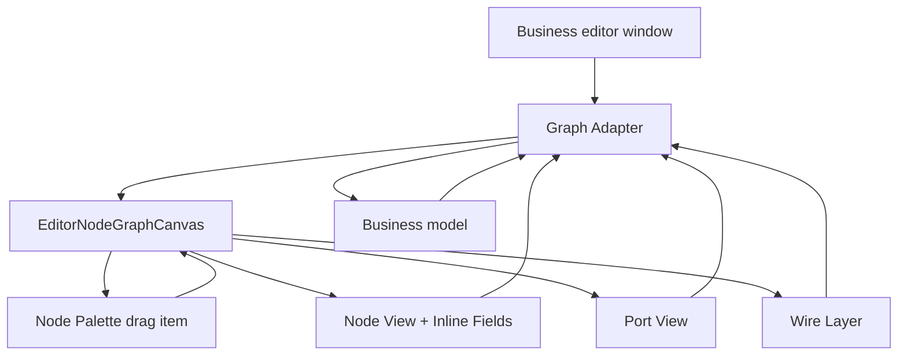

# editor-node-graph-kit design

## 0. 术语约定

| 术语 | 定义 | 防冲突结论 |
|---|---|---|
| Editor Node Graph Kit | 可复用编辑器节点图库 | 新概念；区别于 Unity Graph Toolkit 和旧 GraphView |
| Graph Canvas / 图画布 | 承载节点、连线、网格、平移、缩放、选择的 UI Toolkit 控件 | 当前雏形在 `StoryEditorCanvas` |
| Graph Adapter / 图适配器 | 业务编辑器把自己的节点/连线/字段转换给节点图库的桥 | 剧情编辑器提供 Story adapter，库不认识剧情 |
| Graph Node View / 节点视图 | 可拖拽、带端口和节点内字段的可视节点 | 通用控件，不绑定 `StoryAuthoringNode` |
| Graph Port / 端口 | 圆点式输入/输出连接点，带方向、容量、颜色、tooltip | 替代按钮式“进入/完成”端口 |
| Graph Wire / 连线 | 端口到端口的贝塞尔线，支持拖拽预览、选择、删除 | 不再由业务窗口直接绘制 |
| Node Palette / 节点库 | 可拖拽的节点模板列表 | 单击不创建，拖到画布才创建 |
| Inline Field / 节点内字段 | 节点上的 TextField/Toggle/Dropdown/FloatField 等参数编辑控件 | 剧情节点参数不再依赖右侧检查器 |
| Blackboard / 黑板 | 可选的图级概要、变量或统计面板 | 节点图库只提供承载区，不解释内容 |

## 1. 决策与约束

### 需求摘要

做什么：把当前 Story Editor 里仿 ShaderGraph 的节点图从剧情窗口里抽出来，做成项目内可复用的 Editor 节点图库。它提供节点编辑器的通用交互：格子背景、画布拖拽、鼠标位置锚定缩放、节点拖拽、圆点端口、端口拖线连线、从节点库拖拽创建节点、节点内字段编辑、选择/删除/minimap/blackboard 承载。

为谁：Story Editor、后续可能出现的行为树、任务流、资源构建流、UI 绑定流、输入动作流等 Editor 工具。

成功标准：

- Story Editor 不再自己维护画布 pan/zoom/edge/node drag 细节，只通过 adapter 提供剧情节点数据和命令回调。
- 节点库条目单击不会创建节点；必须拖到画布或从端口拖出后选择/拖入节点。
- 节点参数默认在节点上编辑，右侧检查器不是主路径；剧情编辑器可以完全不显示检查器。
- 端口是圆点式可视端点，拖线连接时能命中目标端口，连线语义由 adapter 校验。
- 缩放以鼠标所在画布位置为锚点，不再偏右下漂移。

### 明确不做

- 不引入 Unity Graph Toolkit 包；当前 Unity `2022.3.62f2c1` 与官方 Graph Toolkit 版本不匹配。
- 不使用 GraphView 作为新库基础；GraphView 在当前项目里已经暴露了连线和拖拽问题。
- 不做 runtime 节点执行系统；这是 Editor UI 组件库。
- 不内置剧情、行为树、任务系统语义；业务语义通过 adapter 注入。
- 不做 NodeCanvas 级别的完整商业插件能力，如变量调试器、运行时断点、子图资产引用、多人协作。
- 不在第一版做复杂框选、多选移动、复制粘贴、撤销重做、对齐分布；可以保留扩展点。

### 复杂度档位

- `Robustness = L3`：Editor 工具组件，交互要稳定，但失败不影响 runtime 存档。
- `Structure = reusable-editor-kit + adapters`：通用节点图库与业务编辑器分离。
- `Compatibility = internal-breaking-ok`：当前 StoryEditor 仍在新功能开发中，允许重写它的画布接入。
- `Extensibility = adapter-driven`：端口、字段、模板、连线规则都由 adapter/schema 提供。

### 关键决策

1. 抽出项目内 `EditorNodeGraphKit`，不直接等待官方 Graph Toolkit。
   - 采用：UI Toolkit 自绘 canvas + 通用 view model。
   - 拒绝：继续把通用画布逻辑藏在 StoryEditorWindow。
   - 原因：后续编辑器也需要 NodeCanvas/ShaderGraph 式体验。

2. 业务数据所有权仍归业务编辑器。
   - 采用：Kit 只发 `CreateNode`、`MoveNode`、`Connect`、`SetField` 等请求。
   - 拒绝：Kit 保存 ScriptableObject 或剧情资产。
   - 原因：通用库不应知道 story/behavior/task 的持久化模型。

3. 参数节点内编辑优先。
   - 采用：Inline Field schema 直接渲染在 node body。
   - 拒绝：默认要求右侧 inspector 填参数。
   - 原因：用户明确希望图形化，不到处手动填写表单。

4. Palette 采用拖拽创建。
   - 采用：节点库 item 鼠标拖到 canvas 才创建。
   - 拒绝：单击即创建。
   - 原因：单击容易误创建，且不符合 ShaderGraph/NodeCanvas 直觉。

## 2. 名词与编排

### 2.1 名词层

#### 现状

- `StoryEditorWindow` 内部直接声明 `StoryEditorCanvas`、`StoryEditorNodeView`、`StoryEditorEdgeLayer`，这些类型绑定 `StoryAuthoringNode/Edge`，不能被其他编辑器复用。[StoryEditorWindow.cs](</E:/Black Rain/Assets/GameDeveloperKit/Editor/StoryEditor/Window/StoryEditorWindow.cs:1432>)
- 画布已经有 grid/pan/zoom/edge preview 的雏形，但端口是按钮式，不是圆点端点；节点参数只是摘要，详细参数仍在右侧检查器。[StoryEditorWindow.cs](</E:/Black Rain/Assets/GameDeveloperKit/Editor/StoryEditor/Window/StoryEditorWindow.cs:1740>)
- 节点库目前由 `Button` 构成，点击就调用 `AddNodeAt` 在画布中心创建节点，容易误创建。[StoryEditorWindow.cs](</E:/Black Rain/Assets/GameDeveloperKit/Editor/StoryEditor/Window/StoryEditorWindow.cs:274>)
- Story Editor 方案已经明确 Graph 只是 authoring 前端，runtime 不依赖图编辑器；因此通用图编辑器可以落在 Editor 目录，不碰 runtime。[story-editor-design.md](</E:/Black Rain/.codestable/features/2026-06-20-story-editor/story-editor-design.md:307>)

#### 变化

新增通用 editor-only 契约：

```csharp
public sealed class EditorNodeGraphCanvas : VisualElement
{
    public void SetAdapter(IEditorNodeGraphAdapter adapter);
    public void Rebuild();
}

public interface IEditorNodeGraphAdapter
{
    IReadOnlyList<EditorGraphNodeModel> Nodes { get; }
    IReadOnlyList<EditorGraphWireModel> Wires { get; }
    IReadOnlyList<EditorGraphNodeTemplate> Templates { get; }
    EditorGraphConnectionResult CanConnect(EditorGraphPortRef output, EditorGraphPortRef input);
    void CreateNode(EditorGraphNodeTemplate template, Vector2 graphPosition, EditorGraphPortRef connectFrom);
    void MoveNode(string nodeId, Vector2 graphPosition);
    void Connect(EditorGraphPortRef output, EditorGraphPortRef input);
    void Disconnect(string wireId);
    void SetNodeField(string nodeId, string fieldId, string value);
}
```

核心 model：

- `EditorGraphNodeModel`
  - `NodeId`
  - `Title`
  - `Subtitle`
  - `Category`
  - `Position`
  - `InputPorts`
  - `OutputPorts`
  - `Fields`
- `EditorGraphPortModel`
  - `PortId`
  - `Label`
  - `Direction`
  - `Capacity`
  - `Color`
  - `Tooltip`
- `EditorGraphFieldModel`
  - `FieldId`
  - `Label`
  - `Value`
  - `ValueType`
  - `Options`
  - `Tooltip`
- `EditorGraphNodeTemplate`
  - `TemplateId`
  - `DisplayName`
  - `Category`
  - `DefaultTitle`
  - `Ports`
  - `Fields`

Story Editor 变成使用方：

- `StoryEditorGraphAdapter`
  - 读取 `StoryAuthoringChapter.Nodes/Edges/Layout`
  - 把 `NodeSchemaRegistry` 映射为 node templates、ports、inline fields
  - 接收 kit 的 move/connect/set-field/create 请求后修改 `StoryAuthoringAsset`

### 2.2 编排层



#### 现状

- Story Editor 的 window 同时负责布局、业务选择、节点创建、画布交互、节点绘制、连线绘制和参数检查器，职责混在一个文件里。
- 交互问题集中在自绘 canvas：滚轮锚点不符合预期、节点/端口命中不够像 Graph、节点库误创建。
- 如果直接在 `StoryEditorWindow` 继续修，后续其他 editor 还会重复造一套节点图。

#### 变化

1. 通用库初始化。
   - 业务窗口创建 `EditorNodeGraphCanvas`。
   - 业务窗口提供 `IEditorNodeGraphAdapter`。
   - Canvas 从 adapter 拉取 nodes/wires/templates，渲染 palette、node、ports、wire、grid、minimap。

2. 创建节点。
   - 用户从 Node Palette 拖拽 template。
   - 拖拽进入 canvas 后显示 ghost preview。
   - 松手时 canvas 把 template 和 graph position 交给 adapter。
   - adapter 创建业务节点并更新业务模型。
   - canvas rebuild。

3. 连线。
   - 用户从 output port 圆点拖出 wire preview。
   - 悬停到 input port 时调用 `CanConnect` 获取状态。
   - 松手在合法 input port 上时调用 `Connect`。
   - 松手在空白处时触发可选 create-and-connect palette。

4. 节点编辑。
   - 节点标题和常用字段直接在 node body 中编辑。
   - Field 变更调用 adapter `SetNodeField`。
   - 业务窗口可选择不显示 inspector；如果显示，也只能作为高级调试。

5. 画布变换。
   - 平移只改变 canvas viewport pan。
   - 缩放按 `graphPointBefore = ScreenToGraph(mouse)`、`graphPointAfter` 校正 pan，保证鼠标下 graph point 不漂移。
   - wire layer 和 node layer 使用同一 transform。

#### 流程级约束

- Kit 只存在于 Editor asmdef，不进入 Runtime。
- Kit 不引用 `GameDeveloperKit.Story`，避免和剧情系统耦合。
- Adapter 是唯一业务边界；通用控件不直接修改业务资产。
- 所有可见文案由 adapter/template 提供；Kit 自己只提供通用中文默认文案。
- 连接规则必须由 adapter 决定，Kit 只做交互和可视反馈。
- 节点字段变化要 debounce 或 delayed，避免每个字符都重建全画布。
- View model id 必须稳定；Kit 不用列表索引作为节点/连线 key。

### 2.3 挂载点清单

1. `EditorNodeGraphCanvas`：删掉后所有复用图编辑器失去主画布。
2. `IEditorNodeGraphAdapter`：删掉后业务模型无法接入通用画布。
3. `EditorGraphNode/Port/Wire/Field/Template` model：删掉后节点库无法表达业务图。
4. Story Editor adapter：删掉后剧情编辑器无法使用通用图库，但通用库仍可服务其他编辑器。
5. Node palette drag/drop：删掉后节点创建又回到误点击或右键菜单。

### 2.4 推进策略

1. Kit 契约落盘。
   - 退出信号：Editor-only 类型能表达 nodes、ports、wires、fields、templates 和 adapter 回调。

2. Canvas 交互内核。
   - 退出信号：grid、pan、鼠标锚点 zoom、node drag、wire preview、port hit-test、selection 可由纯 UI Toolkit 控件完成。

3. Palette 拖拽创建。
   - 退出信号：单击 palette 不创建节点，拖到 canvas 才调用 adapter create。

4. Inline field 渲染。
   - 退出信号：Text/Number/Bool/Option 字段能在节点内编辑并调用 adapter。

5. Story Editor 接入。
   - 退出信号：StoryEditorWindow 使用通用 canvas，去掉主检查器，剧情参数在节点上编辑。

6. 验证覆盖。
   - 退出信号：editor tests 覆盖 palette 不误创建、拖拽创建、端口连接、鼠标锚点缩放、runtime 不引用 kit。

### 2.5 结构健康度与微重构

##### 评估

- 文件级 — `Editor/StoryEditor/Window/StoryEditorWindow.cs`：当前超过两千行，且同时包含窗口布局、业务操作、通用画布、节点 view、edge layer、minimap。继续追加交互会让职责更混乱。
- 目录级 — `Editor/StoryEditor/`：这是剧情编辑器专用目录，不适合放通用节点图库。
- 目录级 — `Editor/`：已有多个 editor 工具；新增 `Editor/NodeGraph/` 或 `Editor/Graph/` 都可能和旧 `StoryEditor/Graph` 混淆。

##### 结论：做微重构（拆文件 + 新建通用目录）

这是从业务窗口里抽通用控件，不是行为语义改动。先把通用画布相关类型移到 `Assets/GameDeveloperKit/Editor/NodeGraph/`，保留 Editor-only 边界；Story Editor 只保留 adapter 和业务命令。验证方式：

- `dotnet build GameDeveloperKit.Editor.csproj --no-restore` 通过。
- Story Editor 现有 editor tests 通过编译。
- Runtime csproj 不引用 `Editor/NodeGraph`。

##### 建议沉淀的 convention

- 后续项目内可视化节点编辑器优先复用 `EditorNodeGraphKit`，业务编辑器只写 adapter，不复制 pan/zoom/wire/node drag。

##### 超出范围的观察

- Undo/Redo、多选框选、复制粘贴、子图资产化、运行时调试 overlay 可以后续拆 feature。
- 如果升级 Unity 到 Graph Toolkit 支持版本，`EditorNodeGraphKit` 可以作为 adapter 兼容层或逐步替换为官方 Graph Toolkit。

## 3. 验收契约

| 编号 | 输入 / 触发 | 期望可观察结果 |
|---|---|---|
| N1 | 打开 Story Editor | 使用通用 `EditorNodeGraphCanvas`，窗口里不再直接声明业务绑定 canvas 类型 |
| N2 | 从节点库单击“播放视频” | 不创建节点 |
| N3 | 从节点库拖拽“播放视频”到画布 | 在释放位置创建节点 |
| N4 | 滚轮缩放画布 | 鼠标下的 graph position 保持稳定，不向右下漂移 |
| N5 | 拖拽节点 | 节点位置更新，连线跟随 |
| N6 | 从 output 圆点拖到 input 圆点 | 创建连线，非法连接有可视反馈且不写入业务模型 |
| N7 | 从 output 圆点拖到空白 | 出现创建并连接入口，创建节点后自动连线 |
| N8 | 修改节点内字段 | 业务模型参数更新，不需要右侧检查器 |
| N9 | Story Editor 主界面 | 不显示“检查器”作为主参数编辑列 |
| N10 | 新建另一个 editor adapter 的测试假实现 | 能复用 canvas 渲染和基础交互，不引用剧情类型 |
| B1 | Adapter `CanConnect` 返回失败 | 连线不创建，并显示失败状态 |
| B2 | Adapter 创建节点失败 | canvas 不产生半节点，状态区显示错误 |
| B3 | Runtime build | 不包含 `EditorNodeGraphKit` 或 UI Toolkit editor 类型 |
| E1 | 通用图库引用 `GameDeveloperKit.Story` | 判定为错误 |
| E2 | Story Editor 继续复制 pan/zoom/wire 绘制逻辑 | 判定为错误 |
| E3 | 节点库单击仍创建节点 | 判定为错误 |
| E4 | 参数必须到 inspector 才能填写 | 判定为错误 |

### 明确不做的反向核对项

- 不做 runtime 执行。
- 不做完整 Graph Toolkit 替代品。
- 不做复杂多选/复制粘贴/UndoRedo。
- 不让通用库知道剧情、任务、行为树等业务概念。

## 4. 与项目级架构文档的关系

验收通过后需要更新 `.codestable/architecture/ARCHITECTURE.md`：

- 记录 `Editor/NodeGraph/` 是项目内复用节点图库。
- 记录 Story Editor 通过 adapter 使用节点图库。
- 记录 runtime 不依赖 editor graph kit。

