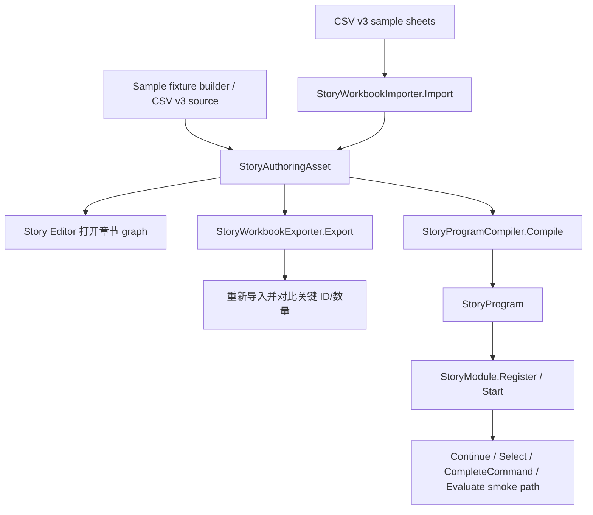

# Sample Story Graph Fixture Design

## 0. 术语约定

| 术语 | 定义 | 防冲突结论 |
|---|---|---|
| Sample story graph fixture | 项目内长期维护的一份标准 Story authoring 样例 | 不是临时单元测试 helper，也不是产品正式剧情 |
| CSV v3 fixture | `story.csv` / `chapters.csv` / `nodes.csv` / `edges.csv` / `parameters.csv` / `conditions.csv` / `layout.csv` / `warnings.csv` 组成的交换目录 | 继续使用现有 `StoryCsvExchange` 表头，不新增 Excel sheet |
| Authoring asset fixture | 由样例数据创建的 `StoryAuthoringAsset` | 主真源可来自 builder 或 CSV；实现阶段不能手写 Unity `.meta` |
| Canonical graph | 可在 Story Editor 中打开、结构清楚、布局稳定的标准图 | 不是自动布局器，只提供一份固定坐标布局 |
| Runtime smoke path | 从 sample graph 编译得到 `StoryProgram` 后能启动并推进到 Line / Choice / Command / Wait / End 的代表路径 | 不替代表现层，不实际播放媒体或小游戏 |

## 1. 决策与约束

### 需求摘要

做什么：补一份标准示例剧情图，覆盖 3-4 章、多段小剧情、旁白、对白、玩家选项、命令、条件/分支、等待、跳转章节和稳定布局。它既能被 Story Editor 打开手测，也能被自动测试用于 CSV round-trip、compiler 和 runtime 注册/推进回归。

为谁：剧情策划、编辑器维护者、`StoryProgramCompiler` / `StoryModule` 维护者，以及后续验收 Story Editor 的人。

成功标准：

- 打开样例时左侧 story tree 显示一个 story、一个 volume、3-4 个 chapter，每章有 Start/End 和多个语义节点。
- 每个章节的 graph 有稳定布局，节点标题是中文且能看出用途，不出现 `next_2` 这类无语义标题。
- 样例覆盖 `Dialogue`、`Narration`、多个 `Choice` item、`PlayVideo`、`ShowImage`、`PlayAudio`、`Wait`、`JumpChapter`、`FlagCheck` 或 `Compare`、`MiniGame`。
- 文本节点 `completed -> 多个 Choice.selected -> 分支目标` 使用已拍板的选项项契约。
- 命令节点字段使用现有 typed schema 键，资源字段保存稳定字符串，例如 `guid:sample_video_intro` 或业务资源 key。
- CSV v3 导出后再导入，story/chapter/node/edge/parameter/condition/layout 的关键数量和 ID 不丢失。
- 样例编译为 `StoryProgram` 无 error；warning 要么为 0，要么是明确预期的兼容 warning。
- Runtime 能注册样例 program，并至少跑通一条包含 line、choice、command、wait、chapter jump/end 的 smoke path。

明确不做：

- 不在本 feature 中新增剧情表现播放器、视频播放、图片显示、音频播放、小游戏实现或 UI 按钮渲染。
- 不引入 Yarn Spinner / Ink，也不把样例改成脚本语言。
- 不改 CSV v3 schema，不恢复 `volumes.csv` / `units.csv` / legacy action/interaction/transition sheet。
- 不恢复 `unit`、`payload`、owner action/transition 作为作者主界面概念。
- 不把 Unity object 实例或 Editor 类型写入 runtime `StoryProgram`。
- 不做自动布局算法；本 feature 只提供一份人工可读的固定 layout。

### 复杂度档位

- `Robustness = L3`：fixture 会成为后续回归基线，必须能检测导入导出、编译和 runtime 注册问题。
- `Structure = sample-data + tests`：主体是样例数据和验证入口，不新增 runtime 业务模块。
- `Compatibility = replace weak sample, keep CSV v3`：可以替换或扩充现有 `Assets/GameDeveloperKit/Simples/*.csv` 的空壳数据，但不改交换格式。
- `Localization = zh-CN authoring`：节点标题、章节标题和样例可见文本使用中文；参数 key 仍使用 runtime schema 英文字段。

### 关键决策

1. 样例用 Story 语义作为唯一表达。
   - 节点种类来自 `NodeKind` / `NodeSchemaRegistry`。
   - 参数 key 使用 `textKey`、`speaker`、`clip`、`image`、`wait`、`duration`、`chapterId`、`flag`、`operator`、`miniGameId` 等现有 schema。
   - 不再补 legacy `NodeType`、`Payload`、`Unit` 或 owner action 表。

2. 样例覆盖“真实作者会用”的小闭环，而不是枚举所有节点。
   - 核心路径优先覆盖文本、选项、命令、条件、等待和跳转。
   - `Switch`、`Parallel`、`Random`、`Portal`、`Qte`、`Hotspot` 等可留到后续专项 fixture；本 feature 不把样例塞成节点大全。

3. 数据真源需要可重复生成或可直接交换。
   - 首选用一个 sample fixture builder 生成 `StoryAuthoringAsset` 和 CSV v3，避免手写 Unity serialized asset。
   - 如果保留 CSV 文件作为可读样例，CSV 行必须和 builder / import/export round-trip 一致。
   - 不手动创建 `.meta`；需要 asset 时由 Unity API 创建。

4. 现有 `Assets/GameDeveloperKit/Simples` 需要被收敛。
   - 现状 CSV 只有 Start、空边/参数/条件和不匹配 layout，容易误导验收。
   - 实现阶段应选择“替换为完整 CSV v3 样例”或“迁到更清晰的 Samples 路径并保留导入测试”，但不能继续留下半成品作为默认样例。

## 2. 名词与编排

### 2.1 名词层

#### 现状

- `StoryCsvExchange` 已支持 CSV v3：`story.csv`、`chapters.csv`、`nodes.csv`、`edges.csv`、`parameters.csv`、`conditions.csv`、`layout.csv`、`warnings.csv`。
- `StoryWorkbookExporter.Export()` / `StoryWorkbookImporter.Import()` 已有 round-trip 测试，但 fixture 只覆盖很小的单章旧样例。
- `StoryEditorTests.CreateSemanticGraphAsset()` 当前只有 2 章、小量节点，且第二章只有一个 target/end 节点，不足以作为编辑器展示样例。
- `Assets/GameDeveloperKit/Simples/*.csv` 当前是空壳：story/chapter 只有少量行，edges/parameters/conditions 近乎空，layout 引用多处不存在节点。
- `NodeSchemaRegistry` 已声明 Story 节点字段和中文 display name；命令资源字段已是 `AssetReference`。
- `StoryProgramCompiler` 已支持文本、选项项合成、命令、条件、等待、跳转章节和 runtime choice 输出。

#### 变化

新增标准样例名词：

```text
SampleStoryGraph
  StoryId = sample_story_graph
  Version = 1.0.0
  EntryVolumeId = volume_black_rain

Volume
  volume_black_rain / 第一卷：黑雨
  EntryChapterId = chapter_arrival

Chapters
  chapter_arrival / 雨夜抵达
  chapter_station / 旧车站
  chapter_alley / 暗巷
  chapter_final / 余波
```

章节结构示例：

| Chapter | 覆盖节点 | 关键用途 |
|---|---|---|
| 雨夜抵达 | Start、Narration、PlayVideo、Dialogue、Choice x2、FlagCheck、ShowImage、Wait、JumpChapter、End | 开场、媒体命令、玩家选择、条件分支、跨章节 |
| 旧车站 | Start、Narration、PlayAudio、Dialogue、Choice x2、SetFlag、Compare、JumpChapter、End | 音频命令、状态设置、比较条件、回流/前进 |
| 暗巷 | Start、Dialogue、MiniGame、Choice x2、ClearFlag、JumpChapter、End | 小游戏 outcome、多分支结果、失败回流 |
| 余波 | Start、Narration、Dialogue、StopAudio 或 EmitEvent、Wait、End | 收束结尾、外部事件/等待 |

参数示例：

```text
line_arrival_intro:
  kind = Narration
  textKey = story.arrival.intro

video_intro:
  kind = PlayVideo
  clip = guid:sample_video_intro
  wait = true

choice_help_guard:
  kind = Choice
  textKey = story.choice.help_guard

flag_has_badge:
  kind = FlagCheck
  flag = has_station_badge

jump_station:
  kind = JumpChapter
  chapterId = chapter_station
```

CSV v3 行为保持现有表头：

```text
story.csv: storyId,version,entryVolumeId
chapters.csv: volumeId,volumeTitle,volumeEntryChapterId,chapterId,title,entryNodeId
nodes.csv: chapterId,nodeId,title,nodeKind
edges.csv: chapterId,edgeId,fromNodeId,fromPortId,fromPortLabel,targetKind,targetChapterId,targetNodeId
parameters.csv: chapterId,nodeId,key,value
conditions.csv: chapterId,edgeId,conditionId,payloadKey,payloadValues
layout.csv: graphId,nodeId,x,y
warnings.csv: severity,source,message
```

布局约束：

- `graphId = volume_black_rain/{chapterId}`。
- Start 固定在每章左侧，End 固定在右侧或右下。
- 主流程从左到右，选项项上下展开，跳转章节节点靠右。
- 每个节点都有 layout 行；layout 不引用不存在的节点。

### 2.2 编排层



#### 现状

当前有三条断开的路径：编辑器可以打开任意 `StoryAuthoringAsset`，CSV 可以 round-trip 一个小样例，compiler 可以编译若干测试内构造的 definition。但没有一份共享样例同时进入“编辑器可视化、CSV 交换、compiler、runtime 注册/推进”这四条路径。

#### 变化

1. 生成或导入标准样例。
   - 入口可以是 sample builder 或 CSV v3 目录。
   - 构造后调用 `EnsureDefaults()` / authoring validation，确保每章 Start/End 和 edge cardinality 正常。
   - 样例 `EntryVolumeId` 指向 `volume_black_rain`，volume 的 `EntryChapterId` 指向 `chapter_arrival`。

2. 编辑器打开样例。
   - 左侧 tree 显示 story -> volume -> chapters。
   - 选中每个 chapter 后 graph 节点布局稳定，字段在节点内可见，diagnostics 无 error。
   - 样例节点标题使用中文语义标题，如“播放开场视频”“选择：帮助守卫”“条件：拥有站台徽章”。

3. CSV v3 round-trip。
   - 导出产生 8 个 CSV sheet，且不生成 legacy `volumes.csv` / `units.csv`。
   - 导入到新 asset 后，关键 story/volume/chapter/node/edge/parameter/condition/layout ID 保持。
   - `warnings.csv` 为空或只包含预期 warning；不允许隐藏 error。

4. 编译为 runtime program。
   - 编译报告无 error。
   - 选项项合成为 `{lineNodeId}_choices` runtime step。
   - 命令节点导出 typed command arguments，资源字段仍是稳定字符串。
   - 条件/分支和 chapter jump target 能通过 runtime validation。

5. Runtime smoke path。
   - `StoryModule.Register(program)` 成功。
   - `StartProgram(sample_story_graph)` 进入入口章节。
   - 代表路径能观察到 `Line`、`Command`、`ChoicesReady`、`Wait`、`Completed` 或章节切换后的输出。
   - 对命令节点只调用 `CompleteCommand(commandId, outcomeId)` 模拟表现层完成，不实际播放资源。

#### 流程级约束

- 错误语义：fixture 自身不能依赖 expected error 才通过；如果需要 warning 场景，必须单独命名为 warning fixture，不混入 canonical fixture。
- 顺序：先保证 authoring/CSV 样例稳定，再接 compiler 和 runtime smoke，最后把手测记录挂到 acceptance。
- 幂等性：重复生成/导入样例不应创建重复 chapter/node/edge ID。
- 可读性：fixture 是给人看的样例，节点标题和布局比覆盖节点数量更重要。
- Runtime 边界：样例资源 ID 是字符串，不要求项目里真实存在对应 VideoClip/Texture/AudioClip。

### 2.3 挂载点清单

- 标准样例数据入口：删除后用户和测试都没有可打开的多章节 Story 样例。
- CSV v3 样例目录或生成导出：删除后无法用真实多章节内容验收导入导出。
- Sample fixture builder / helper：删除后自动测试只能复制大量构造代码，fixture 难以维护。
- Compiler/runtime smoke 测试：删除后样例可能只“看起来能打开”，但不能保证可编译可注册。
- 手测记录：删除后无法证明样例在 Story Editor 中作为图形化参考可读可用。

### 2.4 推进策略

1. 样例拓扑定型：确定 story/volume/chapter/node/edge/parameter/layout 的 canonical 数据。
   退出信号：纸面拓扑覆盖目标节点种类，且每章从 Start 到 End 或 JumpChapter 有清晰路径。
2. Fixture builder：用代码构造 canonical `StoryAuthoringAsset`，避免手写 Unity serialized asset。
   退出信号：builder 生成的 asset authoring validation 无 error，章节/节点/边 ID 稳定。
3. CSV v3 样例接通：让 canonical fixture 可导出为 CSV v3，并能从 CSV 导入回同等关键结构。
   退出信号：round-trip 后 storyId、volume entry、chapter ids、node ids、edge ids、parameters、conditions、layout 关键值一致。
4. Compiler/runtime smoke：把样例编译成 `StoryProgram` 并注册/推进代表路径。
   退出信号：compiler 无 error；runtime 能输出 line/choice/command/wait，并能通过 Select/CompleteCommand 继续。
5. Editor 手测样例：用 Story Editor 打开 canonical fixture，记录章节树、节点布局、字段和 diagnostics 状态。
   退出信号：手测记录说明每章可打开、布局可读、无 error、选项/命令/条件字段在节点上可见。
6. 文档与回归收口：把样例用途写入 acceptance，并视实现结果回填 requirement/architecture。
   退出信号：后续验收知道从哪里打开样例、跑哪些测试、哪些范围不属于 fixture。

### 2.5 结构健康度与微重构

##### 评估

- 文件级 - `Assets/GameDeveloperKit/Tests/Editor/StoryEditorTests.cs`：当前已经超过 2000 行，包含 CSV、compiler、window v4、helper 构造等多类测试。继续把大型 canonical fixture 构造塞进此文件会加重维护成本。
- 文件级 - `Assets/GameDeveloperKit/Editor/StoryEditor/Excel/StoryCsvExchange.cs`：职责集中在导入导出；本 feature 只消费 CSV v3，不应为 fixture 特判交换逻辑。
- 文件级 - `Assets/GameDeveloperKit/Editor/StoryEditor/Window/StoryEditorWindow.cs`：窗口已经偏大，但样例 fixture 不需要改窗口结构。
- 目录级 - `Assets/GameDeveloperKit/Simples/`：现有目录名疑似拼写错误且混有空壳 CSV 和其他示例资源目录；如果继续作为 canonical fixture 入口，需要把内容完整化并在文档里说明用途。
- 目录级 - `Assets/GameDeveloperKit/Tests/Editor/`：测试已经集中在单文件；新增共享 fixture helper 更适合独立文件，避免继续拉长 `StoryEditorTests.cs`。
- compound convention 检索未命中关于 Story sample fixture 或 CSV 样例目录的长期约定；现有架构约束强调 EditorNodeGraphKit/runtime 隔离与 CSV v3 交换格式。

##### 结论：做微重构（拆出 fixture helper）

本 feature 做一个安全的“只新增/搬出构造职责”微重构：把 canonical story graph 构造从测试主文件中分离为独立 helper。它不改变运行时行为，只减少测试文件继续膨胀。

拆分方案：

- 新增 sample fixture helper，负责构造 canonical `StoryAuthoringAsset`、提供预期 ID/数量和代表 runtime 路径描述。
- `StoryEditorTests.cs` 只调用 helper 进行 round-trip、compiler 和 smoke 断言。
- CSV exchange、compiler、window 不为 sample 写特判。

独立退出信号：

- `StoryEditorTests.cs` 不新增大段 node/edge 构造重复代码。
- fixture helper 能被 CSV、compiler、window 相关测试复用。
- 构建通过后再补 CSV 文件或 editor 手测记录。

##### 超出范围的观察

- `StoryEditorTests.cs` 长期值得按 CSV / compiler / window / graph kit 分文件；这会改变测试组织面较大，建议后续走 `cs-refactor`。
- `Assets/GameDeveloperKit/Simples/` 的命名是否改为 `Samples` 涉及 Unity 资产路径和 `.meta`，本 feature 只在实现阶段做必要的最小整理，不把全项目样例目录规范化作为前置。

## 3. 验收契约

| 场景 | 输入 / 触发 | 期望可观察结果 |
|---|---|---|
| A1 canonical asset 构造 | 调用 sample fixture builder | 得到 `StoryAuthoringAsset`，storyId/version/entryVolumeId/volume entry/chapter entry 均为预期值，authoring validation 无 error |
| A2 章节覆盖 | 检查 canonical asset | 存在 4 个章节；每章至少有 Start/End 和 4 个以上语义节点 |
| A3 选项契约 | 检查入口章节文本节点出边 | 一个 `Dialogue` 或 `Narration.completed` 连接多个 `Choice` 节点；每个 Choice 的 `selected` 单连到不同目标 |
| A4 命令字段 | 检查命令节点参数 | `PlayVideo.clip`、`ShowImage.image`、`PlayAudio.clip` 等字段使用 schema key，资源值为稳定字符串，缺字段不出现 |
| A5 CSV 导出 | 对 canonical asset 调用 export | 生成 CSV v3 8 个 sheet，不生成 legacy `volumes.csv` / `units.csv`，导出 report 无 error |
| A6 CSV 导入回归 | 把导出的 CSV 导入新 asset | story/chapter/node/edge/parameter/condition/layout 的关键 ID 和数量保持，validation 无 error |
| A7 编译 | 对 canonical asset 编译 `StoryProgram` | compiler report 无 error，program 可通过 `StoryModule.Register` |
| A8 runtime smoke | 启动 sample program 并推进代表路径 | 能观察到 line/choice/command/wait/chapter jump 或 completed；表现层命令通过 `CompleteCommand` 模拟 |
| A9 编辑器手测 | 在 Story Editor 打开 sample fixture | 左侧树、章节 graph、节点字段、端口和布局可读，无红色 error；手测记录写明结果 |
| E1 反向范围 | grep sample 实现 | 不引入 Yarn/Ink，不新增 legacy unit/payload 主界面概念，不让 runtime 引用 editor graph 或 Unity object |
| E2 不做自动布局 | 修改节点坐标后导出/导入 | runtime definition 不因 layout 改变；fixture 不声称提供自动布局能力 |

## 4. 架构与文档回写

- `requirements/story-editor.md`：acceptance 后补一条实现进展，说明 Story Editor 已有可打开/可编译/可导入导出的多章节示例剧情图。
- `requirements/story-module.md`：如果 runtime smoke path 落地，可补实现进展，说明 StoryProgram 的注册、选择、命令完成、等待和章节跳转已有样例回归；不把它标成完整播放器能力。
- `architecture/ARCHITECTURE.md`：acceptance 后在 Story Editor / Editor Node Graph 章节补充 canonical sample fixture 的位置、覆盖面和用途。
- `roadmap/story-editor-hardening/items.yaml`：设计批准时把 `sample-story-graph-fixture` 改为 `in-progress` 并写入 feature 目录；验收通过后改为 `done`。

## 5. 自查

- 现状引用：已对齐 `StoryCsvExchange` CSV v3 表头、`NodeSchemaRegistry` 字段、`StoryProgramCompiler` 能力和现有空壳 sample 状态。
- 范围边界：只做样例数据、builder、CSV/编译/runtime/editor 验收入口，不做播放器、脚本语言或自动布局。
- 可卸载性：删除 sample 数据入口、fixture helper、相关 tests 和手测记录后，本 feature 在用户视角消失，不影响 Story runtime 核心。
- 微重构：只拆 fixture helper，不碰 CSV exchange/窗口/编译器语义。
- 复杂度档位：按 L3 fixture 回归处理，避免把样例当临时测试数据。
