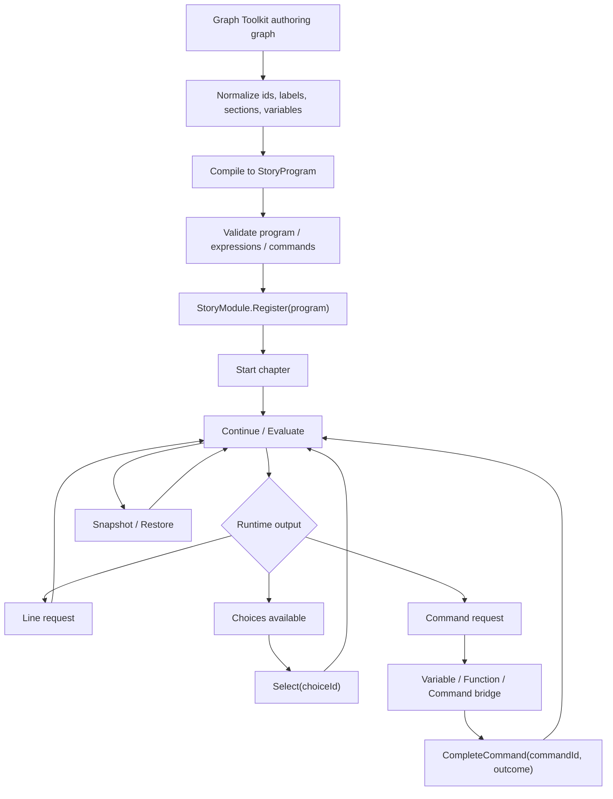

# story-editor v4 design

## 0. 术语约定

| 术语 | 定义 | 防冲突结论 |
|---|---|---|
| Story Editor v4 | 新一代剧情编辑器 | 目标使用 Graph Toolkit；不再沿用 GraphView 的 owner-action/transition 工作流 |
| StoryProgram | 编译后的运行时剧情程序 | runtime 唯一主输入；不依赖 Graph Toolkit / GraphView / ScriptableObject |
| Chapter / 章节 | Yarn node / Ink knot 风格的剧情段落入口 | runtime 主组织单位；替代旧 unit 作为可执行分段 |
| Section / 小节 | Ink stitch 风格的编辑器内子段 | 默认 editor-only，用于折叠和组织，不作为 runtime snapshot 层级 |
| Step / 指令 | 编译后的最小执行语义，如 Line、Choice、Command、Branch、Jump、Wait、End | runtime 解释 Step，不解释编辑器节点 |
| Graph Node / 图节点 | 编辑器画布上的可视元素 | 可编译成一个或多个 Step；不是 runtime 节点的唯一形态 |
| Line / 文本行 | 需要表现层展示的一句对白或旁白 | 只提供 speaker、text key、tags、metadata；不直接渲染 UI |
| Choice / 选项 | 玩家可选择的分支 | 选项文本、条件和目标都在图上可见 |
| Command / 命令 | Yarn command 风格的外部动作请求，如播放视频、设置标记、打开小游戏 | 替代大量硬编码 action node；由 game bridge 执行 |
| Function / 函数 | Yarn function / Ink external function 风格的外部只读查询 | 用于条件表达式，不直接改变游戏状态 |
| Variable Store / 变量存储 | Yarn variable storage 风格的变量读写接口 | StoryModule 不直接依赖 DataModule；业务可把变量存储接到 DataModule |
| Tag / 标签 | Yarn / Ink 风格的行级或节点级 metadata | 可用于本地化、表演提示、镜头、调试，不作为跳转逻辑 |
| Graph Toolkit | Unity 新的节点工具框架 | 只作为 Editor authoring 前端；不提供 runtime backend |
| Editor Node Graph Kit | 项目内复用节点图库 | 当前 Unity 版本不能用官方 Graph Toolkit 时，Story Editor v4 先通过它获得 ShaderGraph 式交互 |
| Legacy v3 Definition | 当前 `Definition/Chapter/NodeKind/Edge` 模型 | 作为迁移输入保留一段时间，不再作为 v4 主模型 |

## 1. 决策与约束

### 需求摘要

做什么：按 Yarn Spinner / Ink 的思路，把剧情系统重新收敛为“叙事脚本语义 + 可视化 Graph authoring + 独立 runtime 解释器”。编辑器用 Graph Toolkit 重写，提供类似 ShaderGraph 的格子背景、拖动画布、拖拽节点、端口建节点、中文字段和 tooltip；运行时不再暴露旧 `unit`、`payload`、owner action/interaction/transition 结构。

为谁：剧情策划、叙事设计师、玩法程序、表现层程序，以及后续需要从编辑器稳定导出剧情程序的工具链。

成功标准：

- 作者看到的是章节、文本、选项、条件、命令和跳转，不再看到 `unit`、`payload`、`next_2`、owner port 这类内部实现。
- Graph 是主编辑入口；常用动作如播放视频、设置变量、触发事件、打开小游戏都能作为 Command 节点或命令块直接接入流程。
- Runtime 消费 `StoryProgram`，通过 `Continue/Select/CompleteCommand/Evaluate/CreateSnapshot/Restore` 推进，不依赖 Editor 数据结构。
- 条件和变量采用 Yarn / Ink 风格：变量有类型，条件是表达式，外部函数只读查询，外部命令负责改变游戏。
- Graph Toolkit 是目标编辑器框架，但先做 Unity 版本兼容验证；当前项目是 Unity `2022.3.62f2c1`，官方 Graph Toolkit `0.4.0-exp.2` 要求 Unity `6000.2+` 且仍是 experimental，不能把 runtime 绑定到它。

### 明确不做

- 不内置 Yarn Spinner 或 Ink 第三方 runtime，也不直接导入 `.yarn` / `.ink` 作为主真源；只是借鉴它们的叙事语义。
- 不做完整脚本语言、Lua、复杂 VM 或通用任务系统。
- 不让 StoryModule 直接调用 Resource / Localization / Data / Procedure / UI / Sound；只通过 bridge 事件和接口交给业务层。
- 不在 runtime 中播放视频、弹按钮、显示字幕、加载资源、保存存档。
- 不把 Graph Toolkit 对象、GraphView 对象或 ScriptableObject authoring model 作为运行时契约。
- 不继续把 `unit` 作为主工作流；旧 unit 只能迁移成 chapter / section / subgraph。
- 不把 `Sequence / Merge / Parallel` 作为首版核心叙事节点；顺序由文本/指令流表达，合流由 jump target 表达，真正并行交给 command 或后续扩展。
- 不以 Excel 为唯一真源；CSV/Excel 只是交换格式，主 authoring 真源是 Story Graph / Story Source。

### 复杂度档位

- `Robustness = L4`：StoryProgram、变量、条件、命令和 snapshot 都是运行时契约，必须强校验，失败不能半注册 / 半恢复。
- `Structure = runtime-contract + compiler + editor-frontend + bridge`：运行时、编译器、Graph Toolkit 编辑器和业务桥接分层。
- `Compatibility = breaking-v4-with-migration`：允许打破 v3 authoring 模型，但必须提供迁移报告。
- `Idempotency = stable-ids`：重复编译同一 graph 不改变 story/chapter/step/choice/command id。
- `Extensibility = schema-driven`：命令、函数、变量类型、节点模板通过 registry 扩展，不靠在 Inspector 手填 payload。

### 关键决策

1. Runtime 主模型改成 `StoryProgram`。
   - 采用：`StoryProgram -> Chapters -> Steps`。
   - 拒绝：继续让 runtime 直接解释 editor graph nodes。
   - 原因：Yarn / Ink 的稳定点是编译后的叙事程序，不是编辑器 UI。

2. Graph Toolkit 只做 authoring 前端。
   - 采用：Graph Toolkit graph 编译为 StoryProgram。
   - 兼容路径：当前 Unity 2022.3 暂用 `EditorNodeGraphKit` 作为项目内 UI Toolkit 节点图适配层，后续升级 Unity 后可替换或桥接到官方 Graph Toolkit。
   - 拒绝：运行时保存 Graph Toolkit graph asset 或直接执行 graph node。
   - 原因：官方 Graph Toolkit 不提供 runtime execution backend，且当前项目 Unity 版本不满足最新官方包要求。

3. Command 替代大量 action node。
   - 采用：`播放视频`、`显示图片`、`播放音频`、`发送事件`、`设置标记`、`小游戏` 都是 command schema 的预设。
   - 拒绝：为每种表现建一个 runtime 节点类型并在 Timeline 特判。
   - 原因：Yarn command 的可扩展性更适合游戏侧表现差异。

4. 变量和条件按小表达式处理。
   - 采用：`bool/number/string` 变量、比较、and/or/not、外部 function。
   - 拒绝：条件节点到处铺满主流程图，或把条件塞进不透明 payload。
   - 原因：条件通常是选项/边的可用规则，只有复杂复用时才需要图上可视节点。

5. `unit` 删除为主概念。
   - 采用：旧 unit 迁移为 chapter、section 或 subgraph。
   - 拒绝：继续保留 story > volume > chapter > unit > node 五层。
   - 原因：用户已经明确反馈系统层级过重，Yarn / Ink 也不需要额外 unit 层。

6. `Payload` 从 UI 消失。
   - 采用：作者编辑 typed fields、tags 和 command args；导出时内部可序列化为参数字典。
   - 拒绝：在 Inspector 显示 payload key/value 作为主要编辑面。
   - 原因：payload 是程序扩展载体，不是剧情作者的工作语言。

## 2. 名词与编排

### 2.1 名词层

#### 现状

- 当前 runtime `Definition` 已经是 v3 章节图主模型，保存 `StoryId/Version/EntryChapterId/Chapters`，但仍保留 obsolete volume 构造和迁移警告。[Definition.cs](</E:/Black Rain/Assets/GameDeveloperKit/Runtime/Story/Definition/Definition.cs:11>)
- 当前 `NodeKind` 已经包含 Flow / Action / Interaction / Condition / Auxiliary 五类，但 taxonomy 偏大，`Sequence/Parallel/Merge/Random` 等节点没有足够清晰的独立 runtime 语义。[NodeType.cs](</E:/Black Rain/Assets/GameDeveloperKit/Runtime/Story/Definition/NodeType.cs:8>)
- 当前 `Timeline` 能注册、启动、触发 action、激活 interaction、按 edge 条件推进、snapshot restore；这说明 runtime 有可跑主线，不是空壳。[Timeline.cs](</E:/Black Rain/Assets/GameDeveloperKit/Runtime/Story/Execution/Timeline.cs:10>)
- 当前 `StoryAuthoringAsset` 仍同时携带 `EntryVolumeId`、`EntryChapterId`、`Volumes`、`Chapters`、legacy `Units`、payload、owner actions/interactions/transitions，说明编辑器模型还在迁移态。[StoryAuthoringAsset.cs](</E:/Black Rain/Assets/GameDeveloperKit/Editor/StoryEditor/Model/StoryAuthoringAsset.cs:11>)
- 当前 `StoryModule` 不直接依赖 Resource / Data / Procedure / Localization，边界是对的，v4 应继续保留这种 runtime 独立性。[StoryModule.cs](</E:/Black Rain/Assets/GameDeveloperKit/Runtime/Story/StoryModule.cs:8>)

#### 变化

运行时主契约改为：

```csharp
public sealed class StoryProgram
{
    public string StoryId { get; }
    public string Version { get; }
    public string EntryChapterId { get; }
    public IReadOnlyList<StoryChapter> Chapters { get; }
    public StoryVariableSchema Variables { get; }
    public StoryCommandSchema Commands { get; }
}

public sealed class StoryChapter
{
    public string ChapterId { get; }
    public string Title { get; }
    public string EntryStepId { get; }
    public IReadOnlyList<StoryStep> Steps { get; }
}

public sealed class StoryStep
{
    public string StepId { get; }
    public StoryStepKind Kind { get; }
    public StoryStepData Data { get; }
    public IReadOnlyList<string> Tags { get; }
}
```

`StoryStepKind` 首版收敛为：

| Kind | 语义 |
|---|---|
| `Start` | 章节入口，只出现在编译后 |
| `Line` | 对白 / 旁白 / 可本地化文本 |
| `Choice` | 一组选项，选项带 text key、condition、target |
| `Command` | 外部命令，如 `play_video intro wait:true` |
| `Branch` | 条件分支，通常由 edge condition 或 condition block 编译而来 |
| `Jump` | 跳到 step / chapter / story end |
| `Wait` | 等待秒数或等待外部 signal |
| `End` | 结束章节或结束故事 |

核心值对象：

```csharp
public sealed class StoryChoice
{
    public string ChoiceId { get; }
    public string TextKey { get; }
    public StoryExpression Condition { get; }
    public StoryTarget Target { get; }
}

public sealed class StoryCommand
{
    public string CommandId { get; }
    public string Name { get; }
    public StoryArgumentBag Arguments { get; }
    public bool WaitForCompletion { get; }
    public IReadOnlyList<string> OutcomePorts { get; }
}

public sealed class StoryExpression
{
    public StoryExpressionKind Kind { get; }
    public IReadOnlyList<StoryExpression> Inputs { get; }
    public StoryValue Literal { get; }
    public string VariableName { get; }
    public string FunctionName { get; }
}
```

Bridge 契约：

```csharp
public interface IStoryVariableStore
{
    bool TryGet(string name, out StoryValue value);
    void Set(string name, StoryValue value);
}

public interface IStoryFunctionResolver
{
    StoryValue Evaluate(string functionName, IReadOnlyList<StoryValue> args, StoryRuntimeContext context);
}

public interface IStoryCommandHandler
{
    void Execute(StoryCommandRequest request);
}
```

Editor authoring model：

- `StoryGraphAsset`
  - `storyId`
  - `version`
  - `entryChapterId`
  - `chapters`
  - `variables`
  - `commandSchemas`
  - `layout`
  - `migrationReport`
- `StoryChapterGraph`
  - `chapterId`
  - `title`
  - Graph Toolkit graph model
  - local sections / subgraphs
- Graph 节点模板
  - 文本节点：speaker、textKey、inlineText、tags
  - 选项节点：choices list、condition、ports
  - 命令节点：command name、typed args、wait、outcomes
  - 条件块：expression builder
  - 跳转节点：target chapter / step / story end
  - 辅助节点：comment、group、portal、bookmark、todo

### 2.2 编排层



#### 现状

- 当前运行时进入节点后，按 `NodeKind` 分类决定是否 queue action、activate interaction，然后沿 edge 推进；这比 v2 简化，但仍把“编辑器节点类型”直接作为 runtime 执行概念。
- 当前选择和外部完成 API 面向 node id / outcome id，能跑，但还没形成 Yarn / Ink 那种 `continue -> line/choice/command -> continue/select/complete` 的解释器协议。
- 当前 Editor 侧仍围绕 authoring asset 直接建图，兼容 legacy volume/unit/payload/action/interaction/transition，导致 UI 字段和连接语义都重。
- 当前 GraphView 问题已经多次暴露：连接时多线、节点拖拽异常、菜单绑定位置不自然、画布交互不稳定。v4 应避免继续在 GraphView 上堆补丁。
- 当前 Story Editor v4 兼容层里已经出现 `StoryEditorV4Canvas/NodeView/EdgeLayer`，这些交互应下沉到 `EditorNodeGraphKit`，否则后续其他编辑器会重复实现 pan/zoom/wire/port/palette。

#### 变化

1. Authoring。
   - 打开 Story Editor v4 后，左侧只显示 `剧情 > 章节`，可选显示 editor-only folder / volume，但不会进入 runtime。
   - 中央节点图通过 `EditorNodeGraphKit` 打开一个 chapter graph，使用格子背景、pan/zoom、minimap、context menu、blackboard；参数优先在节点内编辑，不把右侧 inspector 作为主编辑路径。
   - 所有 UI 文案中文化；字段通过 `tooltip` 解释含义；内部 id 默认折叠到“调试信息”。
   - 画布空白右键、端口拖出空白、工具栏添加都能创建节点；不是只有点在节点上才出现菜单。

2. 编译。
   - Graph 保存 authoring-friendly 结构，编译器把 graph 转成 `StoryProgram`。
   - 编译器负责把 section/subgraph/portal/reroute/comment/group 归一化为 step / jump / metadata。
   - 节点标题和端口 label 永远使用业务语义；内部 id 只保证稳定，不作为 UI 主标题。
   - 编译结果可导出 JSON；CSV/Excel 作为交换格式从 StoryProgram 或 StoryGraphAsset 生成。

3. Runtime。
   - `StoryModule.Register(StoryProgram)` 校验并注册程序。
   - `Start(storyId, chapterId)` 创建 runner。
   - `Continue()` 执行到下一个需要外部响应的输出：line、choice、command、wait 或 completed。
   - `Select(choiceId)` 沿选择目标推进。
   - `CompleteCommand(commandId, outcomeId)` 完成等待型命令并沿 outcome 推进。
   - `Evaluate(time)` 只处理 wait / timed choice / timed command，不自动接管 Unity Update。
   - `CreateSnapshot()` / `Restore()` 保存当前位置、pending output、局部变量、history、completed。

4. Bridge。
   - VariableStore 负责 `$变量` 的读写，可由业务接入 DataModule。
   - FunctionResolver 负责只读查询，如 `has_item("key")`、`affinity("npc") > 10`。
   - CommandHandler 执行副作用，如播放视频、打开小游戏、设置业务 flag、触发事件。
   - StoryModule 只发请求，不直接知道资源、本地化、UI、小游戏实现。

5. 节点 taxonomy。
   - 主流程节点：开始、文本、选项、命令、条件、跳转、等待、结束。
   - 表现节点：作为命令模板出现，例如 `播放视频` 是 `Command(play_video)`，不是 runtime hardcoded kind。
   - 条件节点：默认内嵌到边/选项；复杂时使用 condition block 编译成 expression。
   - 辅助节点：注释、分组、传送点、书签、待办、局部子图，默认不进入 runtime。
   - 废弃或降级：Sequence、Merge、Parallel、Random 不作为首版核心节点。

#### 流程级约束

- 错误语义：所有错误至少包含 story id；编译错误继续包含 chapter / graph node / port / field；运行时错误继续包含 chapter / step / output。
- 幂等性：同一 graph 重复编译不改变 id；自动生成 id 只在首次创建元素时产生。
- 版本：StoryProgram 带 `programVersion` 和 `schemaVersion`；snapshot restore 必须校验 story id 和兼容版本。
- 可观察点：runner 输出 `LineReady`、`ChoicesReady`、`CommandRequested`、`VariableChanged`、`ChapterChanged`、`Completed`。
- 扩展点：新增命令 / 函数 / 节点模板必须注册 schema，schema 包含中文名、字段、默认值、tooltip、端口、是否等待。
- 循环保护：无输出的纯 jump/branch 循环必须有 guard，避免一次 Continue 卡死。
- 范围守护：Graph Toolkit 编译层可以在 Editor asmdef；StoryProgram / Runner / Bridge 契约必须在 Runtime asmdef。

### 2.3 挂载点清单

1. `StoryProgram` runtime 契约：删除后 v4 runtime 无法注册或执行剧情。
2. `StoryRunner` / `StoryModule` v4 执行入口：删除后无法 Continue / Select / CompleteCommand / Snapshot。
3. `StoryGraphAsset` + Graph Toolkit editor：删除后作者失去可视化编辑入口，但 runtime program 仍可由其他工具生成。
4. `EditorNodeGraphKit`：删除后当前 Unity 2022.3 下的 ShaderGraph 式 authoring 交互消失，Story Editor v4 只能退回表单/旧 GraphView。
5. `StoryCompiler`：删除后 editor graph 无法生成 runtime program。
6. `StoryBridge` interfaces：删除后剧情无法接入变量、函数和命令。
7. v3 -> v4 migration pipeline：删除后旧 story authoring 数据无法平滑迁移。

拔除沙盘：去掉以上挂载点后，v4 剧情系统整体消失；Resource / Localization / Data / Procedure / UI / Sound 不应被连带删除。

### 2.4 推进策略

1. Graph Toolkit 兼容验证。
   - 退出信号：确认当前 Unity 2022.3 是否能引入目标包；若不能，形成“升级 Unity 6000.2+ / 暂用 GraphView 兼容层 / 推迟 editor v4”的明确结论。

2. StoryProgram 契约与 schema。
   - 退出信号：可用纯内存对象描述章节、文本、选项、条件、命令、跳转、变量和 tag。

3. StoryRunner v4。
   - 退出信号：`Start -> Continue -> Line/Choice/Command -> Select/Complete -> Completed` 的最小闭环跑通，且 snapshot restore 不半更新。

4. Variable / Function / Command bridge。
   - 退出信号：变量读写、条件函数、等待型命令 outcome 都能通过外部实现接入，不依赖 DataModule 或 ResourceModule。

5. Compiler / validator。
   - 退出信号：authoring graph 能稳定编译为 StoryProgram；缺字段、断边、未知命令、非法变量类型会给出带定位的错误。

6. Graph Toolkit editor v4。
   - 退出信号：左侧中文 story tree、基于 `EditorNodeGraphKit` 的 ShaderGraph 风格画布、节点拖拽、圆点端口拖线建节点、节点内中文字段、tooltip、minimap、blackboard、context menu 可用。

7. v3 migration。
   - 退出信号：当前 `Definition/NodeKind/Edge` 和 `StoryAuthoringAsset` 能迁移为 v4 graph / program；无法自动迁移的 unit、parallel、payload、legacy owner 字段写入报告。

8. 导入导出与验证。
   - 退出信号：JSON/CSV round-trip 保持 story/chapter/step/choice/command id；核心场景有 runtime/editor/compiler 测试或可复核证据。

### 2.5 结构健康度与微重构

##### 评估

- 文件级 — `Runtime/Story/Execution/Timeline.cs`：当前负责 v3 node/edge 推进、action/interaction 激活、condition、snapshot。v4 runner 行为会明显不同，不适合继续在同一类里追加分支。
- 文件级 — `Runtime/Story/Definition/NodeType.cs`：当前 enum、schema、port、parameter registry 混在一个文件中，且 taxonomy 偏大。v4 应拆成 Program schema、Command schema、Expression schema。
- 文件级 — `Editor/StoryEditor/Model/StoryAuthoringAsset.cs`：当前文件承担 defaults、legacy migration、semantic migration、authoring model 多重职责，v4 不应继续在此文件内加 Graph Toolkit model。
- 目录级 — `Editor/StoryEditor/`：当前目录服务 GraphView/v3 editor；v4 Graph Toolkit 最好用新目录隔离，降低旧编辑器迁移风险。
- 目录级 — `Runtime/Story/`：当前 runtime v3 已可跑；v4 应在新子域中先并行落地契约，避免一开始就破坏现有测试。

##### 结论：不做单独微重构，v4 新建并行结构

这是契约级 redesign，不是只搬不改行为。实现时不先重构旧 v3 文件，而是新增 v4 契约、runner、compiler、Graph Toolkit editor；旧 v3 只作为迁移输入。等 v4 验收后，再决定是否删除 v3 editor 或保留一段兼容期。

建议结构：

- `Runtime/Story/Program/`：StoryProgram、StoryChapter、StoryStep、StoryExpression、StoryValue。
- `Runtime/Story/Runtime/`：StoryRunner、StoryOutput、Snapshot、loop guard。
- `Runtime/Story/Bridge/`：VariableStore、FunctionResolver、CommandHandler。
- `Editor/StoryEditorV4/GraphToolkit/`：Graph Toolkit graph asset、nodes、wires、inspector、palette。
- `Editor/NodeGraph/`：当前 Unity 2022.3 下复用的 UI Toolkit 节点图库，提供 canvas、node、port、wire、palette、inline fields。
- `Editor/StoryEditorV4/Compiler/`：Graph -> StoryProgram 编译、校验、导出。
- `Editor/StoryEditorV4/Migration/`：v3 asset / definition -> v4 graph/program 迁移。

##### 建议沉淀的 convention

- Story runtime 永远消费编译后的 program，不消费 editor graph。
- Story Editor 的作者界面不显示 payload / owner / next_x / unit 这类内部兼容字段。
- 新增剧情表现能力优先做 command schema，而不是新增 runtime hardcoded node kind。

##### 超出范围的观察

- 如果要真的引入 Yarn Spinner 或 Ink 作为可选导入格式，应另起 `story-yarn-ink-import` feature。
- 如果要升级 Unity 到 6000.2+ 以使用 Graph Toolkit，应另起 Unity upgrade / package compatibility 任务。
- 如果要做复杂表达式语言、调试断点、剧情热重载、多人协作锁定，也应拆成后续 feature。

## 3. 验收契约

| 编号 | 输入 / 触发 | 期望可观察结果 |
|---|---|---|
| N1 | 打开 Story Editor v4 | 左侧显示中文 `剧情 / 章节` 树，不显示 unit、payload、action、transition 旧分组 |
| N2 | 打开一个章节 | 中央显示 Graph Toolkit 画布，支持格子背景、pan、zoom、拖拽节点、框选 |
| N3 | 在画布空白右键 | 出现中文创建菜单，含文本、选项、命令、条件、跳转、等待、结束、注释等分类 |
| N4 | 从端口拖到空白处 | 弹出按端口语义过滤的创建菜单，创建节点后自动连线 |
| N5 | 创建文本节点 | 节点标题显示对白/旁白意图，属性面板显示说话人、文本键、正文预览、标签和 tooltip |
| N6 | 创建选项节点并添加选项 | 每个选项出口显示业务文案或 `选项：xxx`，不显示 `next_2` |
| N7 | 创建播放视频命令 | 图上显示 `命令：播放视频`，字段为视频 key、是否等待、完成/失败 outcome，不暴露 payload |
| N8 | 给选项添加条件 | 条件以表达式或条件块显示，编译后成为 StoryExpression |
| N9 | 创建注释、分组、传送点、书签 | 这些元素影响编辑体验和 layout，不作为 runtime Step 执行 |
| N10 | 编译 graph | 生成 StoryProgram，包含 chapters、steps、choices、commands、expressions、tags |
| N11 | 注册合法 StoryProgram | StoryModule 校验通过，不需要 Graph Toolkit 或 Editor 类型 |
| N12 | Start + Continue | runner 输出 line / choice / command，而不是直接调用 UI 或资源模块 |
| N13 | Select(choiceId) | runner 沿选择目标进入下一个 step，history 记录选择 |
| N14 | CompleteCommand(commandId, outcomeId) | 等待型命令按 outcome 进入目标 step |
| N15 | Evaluate(time) | wait 或 timed output 按传入时间推进；StoryModule 不自动注册 Timer |
| N16 | CreateSnapshot + Restore | story/chapter/step/pending output/history/local variables/completed 一致 |
| N17 | 导出再导入 | story/chapter/step/choice/command id 和中文 label 保持稳定 |
| B1 | 当前 v3 asset 迁移 | 能转换的 Dialogue/Choice/Action/Edge 迁移到 v4；unit/payload/parallel 等无法完整转换处写入报告 |
| B2 | Graph Toolkit 包不可用于当前 Unity | 兼容验证阶段明确失败原因和替代路径，不影响 StoryProgram runtime 设计 |
| B3 | 缺少命令 schema | 编译失败，错误包含 chapter、graph node、command name |
| B4 | 条件引用不存在变量或函数 | 编译或注册失败，错误包含 expression 和字段定位 |
| B5 | 纯 jump 循环没有输出 | Continue 触发 loop guard，错误包含 story/chapter/step |
| B6 | snapshot 指向不存在 step | Restore 失败，当前 runner 不半更新 |
| E1 | Runtime 代码引用 UnityEditor、Graph Toolkit 或 GraphView | 判定为错误 |
| E2 | StoryModule 直接调用 Resource / Localization / Data / Procedure / UI / Sound | 判定为错误 |
| E3 | 作者主界面继续显示 payload key/value、unit、owner action、owner transition | 判定为错误 |
| E4 | 普通动作必须先挂到某个 owner node 才能执行 | 判定为错误 |
| E5 | 继续把 `Sequence / Merge / Parallel` 作为首版必需核心节点 | 判定为过度复杂 |

### 明确不做的反向核对项

- 不应出现 runtime 必须加载 Graph Toolkit graph asset 才能跑剧情。
- 不应出现 StoryProgram 中保存 editor-only layout、group、comment 作为执行步骤。
- 不应出现播放视频、显示字幕、打开小游戏的具体 Unity 表现代码写进 StoryModule。
- 不应出现为了变量持久化而让 StoryModule 直接依赖 DataModule。
- 不应出现为了本地化而让 StoryModule 直接依赖 LocalizationModule。
- 不应出现以节点坐标、Excel 行号或列表索引作为剧情逻辑主键。

## 4. 与项目级架构文档的关系

验收通过后需要更新 `.codestable/architecture/ARCHITECTURE.md`：

- 记录 Story runtime v4 的主契约是 `StoryProgram / StoryRunner / StoryBridge`。
- 记录 Graph Toolkit 只是 Story Editor v4 的 authoring 前端，不进入 runtime。
- 记录 `unit`、`payload`、owner action/interaction/transition 只作为 legacy migration 输入。
- 记录新增剧情表现优先注册 command schema，避免膨胀 runtime hardcoded node kind。
- 记录 StoryModule 继续不直接依赖 Resource / Localization / Data / Procedure / UI / Sound。

## 5. 参考资料

- Yarn Spinner 文档：[Scripting Fundamentals](https://yarnspinner.dev/docs/yarn/02-fundamentals/)、[Flow Control](https://docs.yarnspinner.dev/write-yarn-scripts/scripting-fundamentals/flow-control)、[Variable Storage](https://yarnspinner.dev/docs/unity/10-components/03-variable-storage/)。
- Yarn Spinner 文档：[Commands / Functions](https://github.com/YarnSpinnerTool/YSDocs/blob/main/docs/yarn-spinner-for-unity/creating-commands-functions.md)。
- Ink 文档：[Writing With Ink](https://github.com/inkle/ink/blob/master/Documentation/WritingWithInk.md)。
- Unity Graph Toolkit 文档：[Introduction](https://docs.unity3d.com/Packages/com.unity.graphtoolkit%400.4/manual/introduction.html)、[Features](https://docs.unity3d.com/Packages/com.unity.graphtoolkit%400.4/manual/features.html)、[Wire features](https://docs.unity3d.com/Packages/com.unity.graphtoolkit%400.4/manual/wire-features.html)。
- Unity Graph Toolkit 文档：[Installation](https://docs.unity3d.com/Packages/com.unity.graphtoolkit%400.4/manual/installation.html)。`com.unity.graphtoolkit@0.4.0-exp.2` 仍为 experimental，要求 Unity Editor `6000.2` 或更高。
