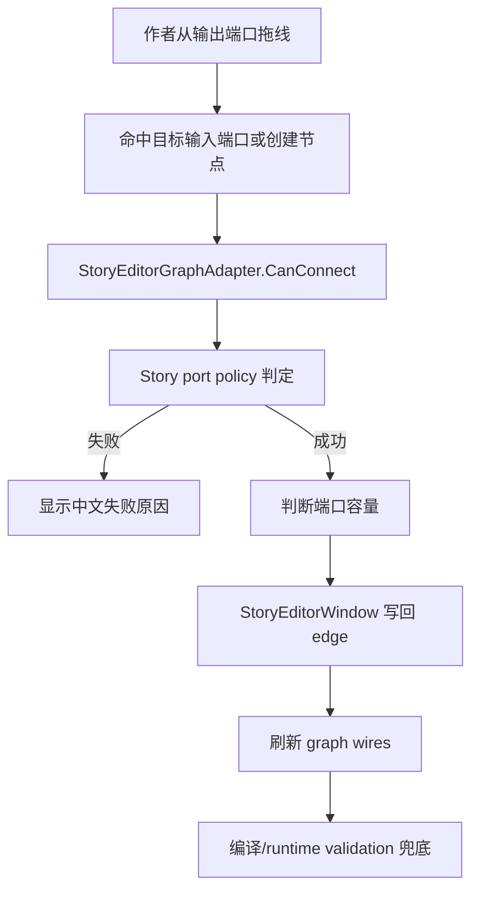

# Story Graph Port Policy Design

## 0. 术语约定

| 术语 | 定义 | 防冲突结论 |
|---|---|---|
| Story port policy | Story authoring 图的业务端口连接规则 | 区别于 `EditorNodeGraphKit` 的通用端口/连线交互；后者只问 adapter 能不能连 |
| Port role | 端口语义角色，如入口、完成、选择后、命令 outcome、条件结果 | 不等同于 `PortDirection`；方向只是输入/输出，role 决定能连接什么 |
| Port capacity | 端口出线容量：单连或多连 | 单连端口新连接采用替换语义；多连端口允许多个不同目标 |
| Semantic connection result | 带中文原因的连接判定结果 | UI 只显示结果；规则集中在 Story adapter/schema 层 |
| Line node | `Dialogue` / `Narration` 文本节点 | 输出 `completed`；可接普通流程，也可多连到多个 `Choice` 形成玩家选项 |
| Choice item node | 一个 `Choice` 节点代表一个玩家可选项 | 输入只能来自 line node 的 `completed`，输出 `selected` 单连到分支目标或结束 |
| Command outcome port | 命令节点 schema 定义的结果端口，如 `completed`、`success`、`fail` | 本 feature 只约束端口合法性；字段类型化留给 `typed-command-fields` |
| Auxiliary node | 注释、分组、书签、待办、传送点、转接点等编辑辅助元素 | 默认不进入 runtime 必需流程；不得连接到 runtime-required flow，除非后续单独定义 portal/reroute 编译语义 |

## 1. 决策与约束

### 需求摘要

做什么：把 Story Editor 当前偏宽松的 `CanConnect`、`IsMultipleOutputPort`、schema 端口和 runtime 校验口径收敛成一张稳定端口策略，让作者拖线时能明确知道“这个端口是什么、能连到哪里、能连几条、为什么不能连”。

为谁：剧情策划、后续选项分支/命令字段/图上校验 feature，以及维护 `StoryEditorGraphAdapter` 和 `StoryProgramCompiler` 的程序。

成功标准：

- 开始/结束节点的端口、删除、palette 暴露规则稳定。
- 文本节点、选项节点、命令 outcome、条件分支、跳转/等待和辅助节点的连接规则可表格化核对。
- 单连端口不会在 authoring 数据中留下多条同源同端口边；多连只在明确语义允许时发生。
- 非法连接在 graph 交互时给出中文原因，原因包含节点/端口语义。
- Story 专有规则不下沉到 `EditorNodeGraphKit`，runtime 不引用 editor graph。

明确不做：

- 不改“对白/旁白 completed 连接多个 Choice 节点后如何编译成 runtime Choice step”的细节；留给 `choice-item-branching-contract`。
- 不做命令节点字段类型化、资源 ObjectField 或 command argument 导出；留给 `typed-command-fields`。
- 不做图上红点、错误 badge、validation overlay；留给 `story-graph-validation-feedback`。
- 不引入官方 Graph Toolkit，也不改 `EditorNodeGraphKit` 为 Story 专用。
- 不恢复 `unit`、`payload`、owner action/transition 为作者主界面概念。

### 复杂度档位

走 Editor 语义策略默认档位，偏离点如下：

- `Robustness = L3`：端口策略会影响 authoring 数据和编译可解释性，必须有自动测试覆盖合法/非法/边界连接。
- `Compatibility = breaking-authoring-semantics`：允许收紧旧图中不清晰的连接，但错误必须可定位、可理解。
- `Isolation = editor-policy + runtime-validation`：编辑器先阻止坏连接，runtime validation 仍兜底非法数据。

### 关键决策

1. Story port policy 集中在 Story 语义适配层。
   - `EditorNodeGraphKit` 继续只调用 `IEditorNodeGraphAdapter.CanConnect()`。
   - Story 规则由 `StoryEditorGraphAdapter` 和相邻的 Story policy/schema 承担，不进入通用节点图库。

2. 单连端口采用“新连接替换旧目标”的 authoring 语义。
   - 当前 `StoryEditorWindow.AddEdgeToChapter()` 已对非多连端口移除旧边再添加新边。
   - 设计要求 adapter 判定、窗口写回和 runtime validation 的容量口径一致，避免 UI 说能连但 runtime 报重复。

3. 多连只给明确语义。
   - 文本节点 `completed -> Choice` 允许多连，表示一次玩家选择中的多个选项项。
   - 文本节点 `completed` 不能同时混合“直连普通流程目标”和“连接多个 Choice 选项项”两种模式。
   - schema 显式 `Multiple` 的 outcome 允许多连，例如当前 `Parallel.completed` 的“并行分支”。
   - 其他 `completed` 默认单连，不再因为动态端口或旧边残留而隐式多连。

4. 辅助节点先不参与 runtime-required flow。
   - `Comment/Group/Bookmark/Todo` 这类纯编辑节点无连接能力。
   - `Reroute/PortalIn/PortalOut/DebugLog` 当前虽有 schema 输出，但 runtime/compiler 语义不够稳定；本 feature 先禁止接入必需流程，后续若要恢复，需要单独设计 portal/reroute 编译契约。

## 2. 名词与编排

### 2.1 名词层

#### 现状

- `EditorNodeGraphModels` 已有通用 `EditorGraphPortDirection`、`EditorGraphPortCapacity`、`EditorGraphConnectionResult`，但不包含 Story 语义。
- `NodeSchemaRegistry` 定义 `NodeKind`、分类、输出端口和参数；目前所有非开始节点在 graph 中都有通用输入 `in`。
- `StoryEditorGraphAdapter.CanConnect()` 已阻止未选章节、无效端口、自连、目标不存在、目标为开始节点，并对 `Choice` 做少量特殊判断，但其他节点几乎都能互连。
- `StoryEditorWindow.IsMultipleOutputPort()` 对 `Dialogue/Narration.completed -> Choice` 特判多连，否则读取 schema `PortDefinition.Multiple`。
- `StoryModule.ValidateEdges()` 检查端口是否存在和单输出重复，但 `HasOutputPort()` 当前会在节点存在任意 multiple 输出端口时接受任意 port id，容易把动态/未知端口放进 runtime。
- `StoryProgramCompiler` 已能把 line node 连多个 choice item node 编译成合成 choice step，但选项分支的完整 runtime 契约由下一项固化。

#### 变化

新增“Story 端口策略”作为可测试契约，最小名词如下：

```text
StoryPortRule
  nodeKind
  input: allowed/denied + reason
  outputs: portId -> role + capacity + allowedTargets

StoryConnectionPolicy
  Evaluate(outputRef, inputRef, chapter): SemanticConnectionResult
  IsMultipleOutput(node, portId, targetNode): bool
  HasDeclaredOutput(nodeKind, portId): bool
```

实现阶段可以选择新建 helper 或保留在 adapter 内部，但对外契约必须表现为：

- graph 渲染的端口列表只显示当前节点声明或策略允许的端口。
- `CanConnect()` 返回中文 `EditorGraphConnectionResult`，失败原因具体到节点/端口语义。
- 写回连线时遵循同一容量判断。
- runtime validation 的端口存在性不再放宽到“节点有任意 multiple 输出就接受任意端口”。

#### 端口策略表

| 节点 | 输入 | 输出 | 容量 | 合法目标 |
|---|---|---|---|---|
| `Start` | 无输入 | `completed` | 单连 | 任意 runtime flow 目标，不能是 `Start` 或辅助节点 |
| `End` | 允许被 runtime flow 连接 | 无输出 | - | - |
| `Dialogue/Narration` | 允许被 runtime flow 连接 | `completed` | 普通目标单连；目标为 `Choice` 时多连；两种模式不能混合 | 普通 runtime flow 目标，或多个 `Choice` |
| `Choice` | 只允许来自 `Dialogue/Narration.completed` | `selected` | 单连 | 普通 runtime flow 目标或 `End` |
| 命令/动作节点 | 允许被 runtime flow 连接 | schema outcome | 按 schema | 普通 runtime flow 目标或 `End` |
| 条件节点 | 允许被 runtime flow 连接 | `true/false` 或 schema outcome | 单连 | 普通 runtime flow 目标或 `End` |
| `JumpChapter` | 允许被 runtime flow 连接 | `completed` | 单连 | 普通 runtime flow 目标或 `End`；跨章节目标仍由后续 UI/校验处理 |
| `Wait/InputWait/Qte/Hotspot/MiniGame` | 允许被 runtime flow 连接 | schema outcome | 按 schema | 普通 runtime flow 目标或 `End` |
| `Sequence/Switch/Random/Merge/Parallel` | 暂按 legacy routing 节点处理 | schema outcome | 按 schema | 普通 runtime flow 目标或 `End`；不新增隐藏端口 |
| 辅助节点 | 不作为 runtime flow 目标 | 无 runtime flow 输出 | - | 不参与必需流程连接 |

#### 中文失败语义

| 场景 | 失败提示口径 |
|---|---|
| 未选择章节 | `请先选择章节。` |
| 无效端口 | `端口无效。` |
| 自连 | `不能把节点连接到自己。` |
| 目标是开始节点 | `开始节点不能作为目标。` |
| 从结束节点拖出 | `结束节点没有输出端口。` |
| 连到辅助节点 | `辅助节点不参与剧情运行流程，不能作为流程目标。` |
| 从辅助节点拖出 | `辅助节点不参与剧情运行流程，不能连接到剧情节点。` |
| 连到 Choice 但来源不是文本 completed | `选项节点只能接在对白或旁白的完成端口后。` |
| Choice 用非 selected 输出 | `选项节点只能从“选择后”端口连接分支目标。` |
| 文本 completed 已连接多个 Choice 又直连普通节点 | `文本完成端口已经连接选项，不能再直连普通节点。请先删除选项连线。` |
| 未声明输出端口 | `该节点没有这个输出端口。` |
| 单连端口重复创建完全相同边 | `这条连线已经存在。` |

### 2.2 编排层



#### 现状

当前 graph kit 的交互已经通过 N1-N15 手测，连线拖拽、端口命中、空白处创建并连接都能走 adapter。问题在于 Story adapter 的语义规则还太松：只对开始节点和 Choice 做少量判断，辅助节点、结束节点输出、未知端口、条件/命令 outcome、legacy routing 节点容量等没有统一表。

#### 变化

1. `CanConnect()` 先做通用存在性检查，再进入 Story policy。
2. Story policy 读取 `NodeSchemaRegistry` 和固定语义表，判定输出端口是否存在、来源节点是否允许拖出、目标节点是否允许作为 runtime flow 目标。
3. 对 `Choice` 输入做强约束：只允许 `Dialogue/Narration.completed`。
4. 对 `Choice.selected` 做强约束：只能单连到分支目标或结束节点。
5. 对辅助节点做强约束：不参与 runtime flow 连接。
6. 对文本 `completed` 的直连模式和选项模式做互斥：从直连切到第一个 Choice 时移除旧直连；已有 Choice 边时再直连普通节点要失败并提示先删除选项连线。
7. 对单连端口写回时保持替换旧边；对完全相同的重复边仍提示已存在。
8. Runtime validation 使用同一“声明端口存在性”口径兜底，拒绝未知端口和 editor-only 节点进入 runtime definition。

#### 流程级约束

- 错误语义：所有拖线失败必须返回中文，不使用“这个端口不能连接到该节点”作为最终兜底文案，除非带上具体端口语义。
- 顺序：本 feature 先稳定端口合法性，再进入选项编译契约和命令字段类型化。
- 幂等性：重复拖同一条线不增加重复 edge；单连端口改目标后最多保留一条该 port 的 edge。
- 扩展点：新增节点类型时必须在 schema 或 policy 中声明输入、输出、容量和合法目标，否则默认不能连接。
- Runtime 边界：运行时只校验 `Definition/NodeKind/Edge`，不引用 `EditorNodeGraphKit`、UI Toolkit 或 UnityEditor API。

### 2.3 挂载点清单

- `StoryEditorGraphAdapter.CanConnect()`：删除后 graph 拖线无法获得 Story 语义判定。
- `StoryEditorWindow` 的连线写回容量判断：删除后单连/多连策略无法落实到 authoring asset。
- `NodeSchemaRegistry` 的端口 schema：删除后 policy 无法知道节点声明了哪些输出端口。
- `StoryModule.ValidateDefinition()` / `ValidateEdges()`：删除后外部导入或旧数据可绕过 editor 生成非法 runtime definition。

这些挂载点删除后，本 feature 的能力就消失；`EditorNodeGraphKit` 的节点拖拽、palette、pan/zoom 等通用交互不属于本 feature 的挂载点。

### 2.4 推进策略

1. 策略契约落盘：把节点分类、端口、容量、目标和中文失败原因整理为可测试表。
   退出信号：design/checklist 中每类节点都有明确规则。
2. Editor adapter 策略接入：让 `CanConnect()` 使用 Story port policy 返回具体中文原因。
   退出信号：合法/非法连接结果可通过 Editor 测试反射或公开 seam 验证。
3. 写回容量对齐：让单连替换、多连保留和重复边提示使用同一容量口径。
   退出信号：同一个单连端口反复改目标后 authoring edges 中只剩一条该 port 边。
4. Runtime validation 兜底：收紧输出端口存在性和 editor-only 节点/辅助节点进入 runtime 的校验口径。
   退出信号：未知端口、重复单输出、editor-only 节点非法数据会失败并带定位。
5. 测试与证据：补齐 adapter/policy/runtime validation 场景。
   退出信号：Editor.Tests 或 Runtime.Tests 覆盖关键规则，相关 csproj build 通过。

### 2.5 结构健康度与微重构

##### 评估

- 文件级 - `StoryEditorGraphAdapter.cs`：当前约 300 行，职责是 Story authoring model 到通用 graph model 的适配。继续堆更多 `if` 会让端口策略和渲染/字段构建混在一起。
- 文件级 - `StoryEditorWindow.cs`：当前超过千行，承担窗口、树、命令、选择、节点/边写回和校验刷新。本 feature 只需要它消费容量判断，不应继续把完整策略塞进窗口。
- 文件级 - `NodeType.cs`：runtime schema registry 已较集中，包含 enum/schema/默认注册。端口声明仍是它的职责，但不应把 editor-only 连接提示写入 runtime schema。
- 目录级 - `Assets/GameDeveloperKit/Editor/StoryEditor/`：已有 `Migration/`、`Window/` 和 adapter；新增一个小的 Story policy helper 放在该目录或 `Policy/` 子目录是合理延伸。
- compound convention 搜索未命中现有“Story policy 目录组织”约定。

##### 结论：做微重构（拆出 Story 端口策略）

这是本 feature 的核心结构动作，不是泛泛重构：把“连接语义判定”从 adapter/window 的零散判断中拆成独立 Story policy/helper，adapter 和 window 都调用它。拆分边界只覆盖连接策略，不搬动 graph kit、不改 UI 外壳、不改编译器主流程。

独立退出信号：

- 拆分后编译通过。
- adapter 仍只通过 `EditorGraphConnectionResult` 对 graph kit 暴露结果。
- window 写回边时不再有一套和 adapter 不一致的多连判断。

##### 超出范围的观察

- `StoryEditorWindow.cs` 仍偏大，后续可拆 story tree、toolbar、asset commands 和 graph workspace；这不阻塞本 feature。
- `NodeType.cs` 长期可拆 enum/schema/registry，但这属于 runtime schema 重组，不在本 feature 中处理。

## 3. 验收契约

| 编号 | 输入 / 触发 | 期望可观察结果 |
|---|---|---|
| N1 | Start 节点渲染到 graph | 没有输入端口，有且只有 `completed` 输出端口；节点不在 palette，不能删除 |
| N2 | 从任意节点连到 Start | 连接失败，提示 `开始节点不能作为目标。` |
| N3 | 从 End 节点拖线 | 连接失败或无可拖输出端口，提示结束节点没有输出端口 |
| N4 | 连到 End 节点 | 允许作为 runtime flow 目标；End 无输出 |
| N5 | Dialogue/Narration.completed 连到普通 runtime 节点 | 允许；作为普通目标时该 port 保持单连替换语义 |
| N6 | Dialogue/Narration.completed 连到多个 Choice | 允许多条边，表示多个玩家选项项；从直连切到第一个 Choice 时移除旧直连 |
| N7 | 非文本节点连到 Choice | 失败，提示 `选项节点只能接在对白或旁白的完成端口后。` |
| N8 | 文本节点非 completed 端口连到 Choice | 失败，提示 Choice 只能接文本完成端口 |
| N9 | Choice.selected 连到普通 runtime 节点或 End | 允许；同一 selected 端口第二次连到新目标时替换旧目标 |
| N10 | Choice 使用未知/非 selected 输出端口连线 | 失败，提示 `选项节点只能从“选择后”端口连接分支目标。` |
| N11 | 命令/动作节点从 schema outcome 端口连线 | 允许，容量按 schema；未知端口失败 |
| N12 | 条件节点从 true/false 或 schema outcome 连线 | 允许，容量按 schema；未知端口失败 |
| N13 | 辅助节点作为来源或目标参与 runtime flow | 失败，提示辅助节点不参与剧情运行流程 |
| N14 | 单连端口重复连接完全相同目标 | 不新增重复 edge，提示这条连线已经存在 |
| N15 | 文本 completed 已连接多个 Choice 后再直连普通节点 | 连接失败，提示先删除选项连线，不自动删除多个选项 |
| N16 | 单连端口改连不同目标 | authoring edges 中只保留该 from node + port 的新边 |
| N17 | runtime definition 含未知输出端口 | 注册/校验失败，错误包含 story/chapter/node/edge/port |
| N18 | runtime definition 含 editor-only 辅助节点 | 注册/校验失败，错误包含 story/chapter/node/kind |

### 明确不做的反向核对项

- 不应把 `Choice` 分支合成 step 的编译细节改写成本 feature 验收条件。
- 不应新增命令字段 ObjectField、资源 GUID 导出或 typed argument schema。
- 不应在 `EditorNodeGraphKit` 中引用 `NodeKind`、`Story` 或中文 Story 业务规则。
- 不应让 runtime 引用 `EditorNodeGraphKit`、UI Toolkit、UnityEditor 或 GraphView。
- 不应继续允许未知输出端口因为节点存在 multiple port 就通过 runtime validation。

## 4. 与项目级架构文档的关系

验收通过后需要更新 `.codestable/architecture/ARCHITECTURE.md` 的 Story Editor / Editor Node Graph 现状：

- Story 专有连接语义由 Story port policy/schema 维护。
- `EditorNodeGraphKit` 仍只负责业务无关交互，连接合法性只问 adapter。
- Start/End/Text/Choice/Command/Condition/Auxiliary 的端口规则已稳定。
- Runtime validation 作为 editor 之外的数据兜底，不引用 editor graph。
