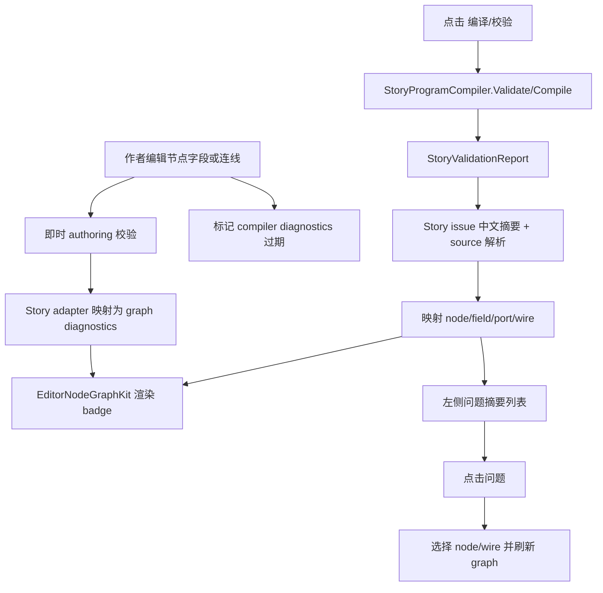

# Story Graph Validation Feedback Design

## 0. 术语约定

| 术语 | 定义 | 防冲突结论 |
|---|---|---|
| Graph diagnostic | 可挂到 graph 元素上的通用诊断项，包含严重级别、中文消息和目标 | 不等同于 Story compiler issue；它是 `EditorNodeGraphKit` 可复用的显示模型 |
| Diagnostic target | 诊断定位目标：graph、node、field、port、wire | 通用图库只认识这些目标，不认识 `Story`、`NodeKind` 或章节 |
| Story validation source | Story 校验来源字符串或结构化定位，如 `story:x/chapter:y/node:z/field:clip` | Story adapter 负责把它映射为 diagnostic target |
| Issue badge | 节点、字段、端口或连线上的错误/警告视觉标记 | 只表达状态和 tooltip，不替代左侧问题列表 |
| Validation summary | 中文问题摘要列表，可点击选择对应图元素 | 复用现有左侧 report 容器，但需要和 graph diagnostic 同源 |
| Stale diagnostics | 图编辑后还未重新编译得到的旧问题 | 必须有“需重新编译/校验”的状态，避免作者相信过期结果 |

## 1. 决策与约束

### 需求摘要

做什么：把当前只在左侧文本列表出现的编译/校验问题，投影到 Story Editor 节点图上。作者能在节点、字段、端口和连线上看到错误/警告，点击问题列表能定位到对应图元素。

为谁：剧情策划、内容维护者，以及维护 `StoryEditorGraphAdapter`、`StoryProgramCompiler`、`EditorNodeGraphKit` 的程序。

成功标准：

- 缺必填字段、字段类型错误、手填资源 key warning 能显示到节点内具体字段。
- 断边、未知输出端口、非法 Choice 分支、selected 缺目标等能显示到端口或连线附近。
- 编译失败和迁移 warning 仍在左侧问题列表显示，并使用中文摘要。
- 点击问题列表中的可定位问题后，graph 选中对应节点或连线，并在节点内字段/端口上保留高亮。
- `EditorNodeGraphKit` 只新增通用诊断显示能力，不引用 Story 专有类型。
- Runtime 不引用 editor graph、UI Toolkit 或 UnityEditor。

明确不做：

- 不重新设计端口连接策略；沿用已完成的 `story-graph-port-policy`。
- 不改变 Choice item 合成 runtime choice step 的语义；沿用 `choice-item-branching-contract`。
- 不扩展命令字段 schema 或资源 ObjectField；沿用 `typed-command-fields`。
- 不做完整表达式编辑器、变量黑板校验、运行时断点调试或 graph 自动修复。
- 不把 `unit`、`payload`、owner action/transition 恢复成作者主界面概念。
- 不切换官方 Graph Toolkit；当前仍基于项目内 `EditorNodeGraphKit`。

### 复杂度档位

- `Robustness = L3`：诊断反馈不改变 runtime 行为，但会决定作者能否修对内容，必须覆盖定位、过期状态和边界错误。
- `Structure = reusable-graph-kit + story-adapter`：通用 graph kit 承载通用 badge/样式/点击接口，Story source 解析和中文消息归 Story 层。
- `Compatibility = additive`：不破坏现有 `StoryValidationReport` 调用方；可在其上增加结构化定位或解析层。
- `Localization = zh-CN first`：新增作者可见文案使用中文；compiler 旧英文 message 可在 Story adapter 映射为中文摘要。

### 关键决策

1. GraphKit 只接收业务无关 diagnostics。
   - `EditorGraphNodeModel`、`EditorGraphFieldModel`、`EditorGraphPortModel`、`EditorGraphWireModel` 可以携带通用 issue 摘要。
   - `EditorNodeGraphNodeView` 和 wire layer 只根据严重级别加样式、tooltip、badge。
   - 通用层不解析 `story:/chapter:/node:` 字符串。

2. Story adapter 是 source mapping 的唯一入口。
   - `StoryValidationReport.Issues` 或本地 authoring validation 结果先转换为 Story graph diagnostics。
   - source 中的 `node`、`field`、`port`、`edge`、`chapter` 由 adapter/window 映射到当前章节 graph。
   - 无法映射到当前章节的 issue 仍在左侧 summary 显示，但不强行在画布上挂错节点。

3. 校验分两层：即时 authoring 校验 + 编译校验。
   - 即时 authoring 校验负责缺 required 字段、明显断边、辅助节点错误接入、未知端口等能从当前 authoring graph 直接判断的问题。
   - 编译校验负责 synthetic choice、command argument、target chapter、runtime program 可注册等跨步骤问题。
   - 图编辑后标记已有 compiler diagnostics 为 stale；用户点击“编译/校验”后刷新正式报告。

4. 中文摘要由 Story 侧统一整理。
   - compiler 现有部分 message 是英文，例如 `Required command field is missing.`。
   - 本 feature 不要求一次性重写所有 compiler message，但 Story Editor 展示层必须给常见错误提供中文摘要和原始 source tooltip。

## 2. 名词与编排

### 2.1 名词层

#### 现状

- `StoryValidationReport` 只有 `Severity`、`Source`、`Message`，source 使用字符串，如 `story:compiler_story/chapter:chapter_01/node:video/field:clip`。
- `StoryEditorWindow` 持有 `m_Report`，左侧 `RefreshReport()` 只把 `issue.ToString()` 渲染成 label，点击不能定位 graph。
- `StoryEditorGraphAdapter` 构建 `EditorGraphNodeModel`、`EditorGraphWireModel`、`EditorGraphFieldModel` 时没有诊断信息。
- `EditorNodeGraphModels` 只有 node/wire/template/field/port 基础属性，没有 issue/diagnostic 模型。
- `EditorNodeGraphNodeView` 已能渲染节点、字段、端口和 tooltip；`EditorNodeGraphWireLayer` 已能按 selected 绘制 wire，但没有 warning/error 样式。
- `StoryProgramCompiler` 和 runtime validation 已能产出定位 source 或异常消息，缺字段、非法 choice selected、未知端口、editor-only 节点、command schema 缺失等已有测试覆盖。

#### 变化

新增通用 graph 诊断名词：

```text
EditorGraphDiagnostic
  DiagnosticId
  Severity: Info | Warning | Error
  TargetKind: Graph | Node | Field | Port | Wire
  NodeId
  FieldId
  PortId
  WireId
  Message
  Tooltip
  Stale
```

模型挂载规则：

| 目标 | 挂载位置 | 表现 |
|---|---|---|
| Graph | canvas status / blackboard summary | 显示“当前图有 X 个错误 / Y 个警告” |
| Node | `EditorGraphNodeModel` | 节点边框/标题显示错误或警告 badge |
| Field | `EditorGraphFieldModel` | 字段容器红/黄边、tooltip 显示问题 |
| Port | `EditorGraphPortModel` | 端口 dot/row 显示错误或警告状态 |
| Wire | `EditorGraphWireModel` | wire 用错误/警告颜色绘制；可点击选中 |

Story source 映射示例：

```text
source = story:new_story/chapter:chapter_01/node:video/field:clip
-> target = Field(nodeId: video, fieldId: clip)

source = story:new_story/chapter:chapter_01/node:choice_help/port:selected
-> target = Port(nodeId: choice_help, portId: selected)

source = story:new_story/chapter:chapter_01/node:parallel/edge:edge_parallel_branch/port:branch_1
-> target = Wire(wireId: edge_parallel_branch), fallback Port(nodeId: parallel, portId: branch_1)
```

中文摘要映射示例：

| 原始 message / 场景 | 中文摘要 |
|---|---|
| `Required command field is missing.` | `必填命令字段未填写。` |
| `Command field must be a number.` | `字段必须填写数字。` |
| `Command field must be a boolean.` | `字段必须填写布尔值。` |
| `Asset reference uses a manual string fallback.` | `资源引用是手填字符串，建议改为资源选择。` |
| `Choice item node must have exactly one selected target.` | `选项必须且只能连接一个“选择后”目标。` |
| `Line completed output cannot mix choice items and direct flow targets.` | `文本完成端口不能同时连接选项和普通流程。` |
| unknown output port/runtime validation | `输出端口未在节点 schema 中声明。` |
| editor-only node/runtime validation | `辅助节点不能进入运行时剧情流程。` |

### 2.2 编排层



#### 现状

当前编辑器只有“点击编译后更新左侧 report”的路径，graph 自身不知道问题。字段编辑会 `Rebuild()`，但不会触发校验；连线失败只临时显示 status，合法但不完整的图需要等编译后才知道哪里错。

#### 变化

1. 图变更后运行轻量 authoring 校验。
   - 字段写回、连线新增/删除、节点新增/删除、章节切换后刷新本地 diagnostics。
   - 只做低成本、当前章节可判断的规则：required 字段空、schema 类型基本解析、runtime 节点缺输入/缺必要输出、edge target missing、unknown port、辅助节点接入等。

2. 编译/校验按钮刷新正式报告。
   - `StoryProgramCompiler.Compile()` 仍是正式可导出判断。
   - 编译结果的 issues 统一走 Story source mapping。
   - 编译成功但有 warning 时仍显示 warning badge。

3. GraphKit 渲染 diagnostics。
   - 节点视图按最高严重级别加 class。
   - 字段/端口/连线各自按最高严重级别显示样式。
   - tooltip 合并最多 2-3 条摘要；更多问题在左侧列表看完整内容。

4. 左侧 summary 与 graph 同源。
   - 每条 issue 显示严重级别、中文摘要、定位。
   - 可定位 issue 点击后调用 adapter/window 选择 node 或 wire；field/port issue 选择其 node 并通过样式标出字段/端口。
   - 当前章节外 issue 显示“位于章节：xxx”，点击后切换章节或只提示定位不可见；实现阶段可先支持当前章节定位。

5. 过期状态明确显示。
   - 图编辑后，上一次 compile report 标记为 stale。
   - stale issue 可继续显示为淡色或在 summary 顶部提示“图已修改，请重新编译确认。”
   - 本地 authoring diagnostics 始终是当前图即时结果。

#### 流程级约束

- 错误语义：作者可见的主文案必须是中文；原始 source/message 可放 tooltip，方便程序追查。
- 定位优先级：field > port > wire > node > chapter > graph；source 同时包含 edge 和 port 时优先 wire，找不到 wire 再退到 port。
- 幂等性：重复校验同一图不应累积重复 diagnostics；diagnostic id 由 source + severity + message 或本地规则稳定生成。
- 性能：轻量校验只遍历当前 asset/chapter，不做昂贵资源加载；ObjectField 资源是否存在只检查 stable value 格式，不强制导入/加载资源。
- Runtime 边界：runtime validation 仍可抛英文 `GameException`，但 Story Editor 展示层负责中文化常见错误；runtime 不依赖 editor 诊断模型。

### 2.3 挂载点清单

- `EditorNodeGraphKit` graph model / node view / wire layer：删除后通用节点图无法显示 node/field/port/wire 诊断。
- `StoryEditorGraphAdapter` diagnostics 映射：删除后 Story compiler/source issue 无法挂到 graph 元素。
- `StoryEditorWindow` report/summary 交互：删除后左侧问题列表无法和 graph 选择联动，也无法显示 stale 状态。
- `StoryProgramCompiler` / `StoryValidationReport`：删除后正式编译问题来源消失；即时校验只能覆盖浅层错误。
- Story authoring lightweight validator：删除后作者必须点击编译才看到缺字段、断边等当前图问题。

这些挂载点删除后，本 feature 在用户视角会消失。端口策略、Choice 编译和命令字段类型化本身不是本 feature 的挂载点，只是诊断来源。

### 2.4 推进策略

1. 通用诊断模型：让 `EditorNodeGraphKit` 可以承载 node/field/port/wire diagnostics，但不渲染 Story 语义。
   退出信号：测试 adapter 可给节点/字段/端口/连线传入 warning/error，视图出现对应 class/tooltip。
2. Story source 解析与中文摘要：把 `StoryValidationIssue` 转成 Story graph diagnostics 和 summary item。
   退出信号：常见 compiler messages 能映射到 field/port/wire/node，未知 message 至少保留原文和 source。
3. 即时 authoring 校验：覆盖当前章节缺 required 字段、字段类型、未知端口、缺目标、辅助节点非法接入和必要流程断边。
   退出信号：不点击编译也能在图上看到浅层错误，编辑修复后 badge 消失。
4. 编译 report 接入：点击编译后把正式 `StoryValidationReport` 投影到 graph 和左侧 summary。
   退出信号：缺 command 字段、非法 choice selected、manual asset warning 都能定位到图上。
5. 点击定位与 stale 状态：summary 项可选中 node/wire，并在图修改后标记旧编译结果过期。
   退出信号：点击问题后 graph selection 与 badge 保持一致；图修改后出现“请重新编译确认”提示。
6. 测试与证据：补 EditorNodeGraphKit boundary、Story mapping、compiler issue 投影和 runtime/editor 隔离。
   退出信号：Editor.Tests / Runtime.Tests 构建通过；grep 仍确认 GraphKit 不含 Story 专有引用，runtime 不含 editor graph。

### 2.5 结构健康度与微重构

##### 评估

- 文件级 - `EditorNodeGraphModels.cs`：当前较小，适合新增通用诊断值对象和模型属性；不应把渲染逻辑放进去。
- 文件级 - `EditorNodeGraphNodeView.cs`：已承担节点、字段、端口和字段控件创建，新增诊断样式是自然扩展，但若把 issue 合并/选择逻辑塞进去会变胖。
- 文件级 - `EditorNodeGraphWireLayer.cs`：只负责 grid、wire、pending wire 绘制；新增 wire severity 颜色是自然扩展。
- 文件级 - `StoryEditorGraphAdapter.cs`：当前同时构建 nodes/wires/templates/fields/ports 和 port policy。新增 Story issue 映射会明显扩大职责，适合拆到相邻 partial/helper。
- 文件级 - `StoryEditorWindow.cs`：超过千行，已有 report 容器和 selection 状态。新增 summary 点击、stale 状态和校验刷新如果全塞进主文件会继续加重窗口职责。
- 目录级 - `Assets/GameDeveloperKit/Editor/NodeGraph/`：是通用 graph kit 目录，新增通用诊断模型不需要新子目录。
- 目录级 - `Assets/GameDeveloperKit/Editor/StoryEditor/`：已有 adapter 和 window 子目录；Story-specific diagnostics 可放同目录新文件或 `Validation/` 子目录。
- compound convention 搜索未命中现有诊断/目录组织约定。

##### 结论：做微重构（拆出 Story diagnostics helper）

本 feature 需要新增一块“Story issue -> graph diagnostic”的转换逻辑。为避免继续把 `StoryEditorGraphAdapter.cs` 和 `StoryEditorWindow.cs` 撑大，实现前先把 Story-specific diagnostics 放到独立 helper/小模型中。

拆分方案：

- 通用层：在 `EditorNodeGraphModels.cs` 扩展通用诊断模型；`NodeView/WireLayer` 只消费模型。
- Story 层：新增 Story diagnostics helper，负责 source 解析、中文摘要、本地 authoring 校验和当前章节过滤。
- Window 层：只负责保存当前 diagnostics、刷新 summary、处理点击定位和 stale 标记。

独立退出信号：

- `EditorNodeGraphKit` grep 仍不含 `GameDeveloperKit.Story`、`StoryEditor`、`NodeKind`、`StoryCommand`、`PlayVideo`。
- `StoryEditorWindow` 不直接解析 `story:/chapter:/node:` 字符串；解析逻辑集中在 Story diagnostics helper。
- 构建通过后再接入具体 validation 场景。

##### 超出范围的观察

- `StoryEditorWindow.cs` 仍值得后续按 toolbar/tree/report/workspace 拆分；本 feature 只拆 diagnostics 相关逻辑。
- `StoryValidationReport` 长期可升级为结构化 `StoryValidationLocation`，但本 feature 为兼容现有 compiler/report 调用，先用 source parser 和可选辅助结构，不强制重写所有 report 产生点。

## 3. 验收契约

| 编号 | 输入 / 触发 | 期望可观察结果 |
|---|---|---|
| N1 | 当前章节 PlayVideo 缺必填 `clip` | 图上 PlayVideo 节点和 `clip` 字段显示 error；左侧 summary 显示中文“必填命令字段未填写” |
| N2 | `Wait.duration=fast` | `duration` 字段显示 error，summary 显示“字段必须填写数字” |
| N3 | `wait=maybe` 或布尔字段非法 | 对应字段显示 error，summary 显示“字段必须填写布尔值” |
| N4 | 资源字段为 `intro.mp4` 手填字符串 | 字段显示 warning，summary 显示“资源引用是手填字符串，建议改为资源选择” |
| N5 | Choice item 没有 `selected` 输出目标 | Choice 节点和 `selected` 端口显示 error，summary 中文提示“选项必须且只能连接一个选择后目标” |
| N6 | 文本 completed 同时连接 Choice 和普通节点 | 文本节点 `completed` 端口显示 error，summary 提示不能混连 |
| N7 | authoring edge 使用未知输出端口 | 对应 wire 或来源 port 显示 error；runtime/compiler source 中包含 edge 时优先高亮 wire |
| N8 | 辅助节点参与 runtime flow | 辅助节点显示 error，summary 提示辅助节点不能进入运行时剧情流程 |
| N9 | edge 目标节点不存在或目标章节不存在 | 对应 wire 显示 error；找不到 wire 时挂到来源 node/port |
| N10 | 点击 summary 中的 field issue | graph 选中对应节点，字段保持 error 样式和 tooltip |
| N11 | 点击 summary 中的 wire issue | graph 选中对应连线，wire 使用 selected + error/warning 样式 |
| N12 | 图编辑后未重新编译 | 上一次 compiler diagnostics 标记为过期，summary 顶部显示“图已修改，请重新编译确认” |
| N13 | 修复字段后本地校验刷新 | 对应 field/node badge 消失；若还有 stale compiler issue，则以过期状态显示 |
| N14 | 当前章节外 issue | summary 显示章节定位；不把 issue 错挂到当前画布节点 |
| N15 | NodeGraphKit grep | `Assets/GameDeveloperKit/Editor/NodeGraph` 不引用 Story/NodeKind/GraphView |
| N16 | Runtime grep | `Assets/GameDeveloperKit/Runtime` 不引用 EditorNodeGraph/UI Toolkit editor graph/UnityEditor |

### 明确不做的反向核对项

- 不应新增自动修复按钮或自动改线逻辑。
- 不应把 Story-specific source parser 放进 `EditorNodeGraphKit`。
- 不应让 Runtime 的 `StoryProgram` 或 validation 类型引用 editor diagnostic 模型。
- 不应把旧 `unit`、`payload`、owner action/transition 显示回主 graph 或 summary。
- 不应要求所有 compiler message 在本 feature 中改成中文源文案；展示层中文化常见错误即可。

## 4. 与项目级架构文档的关系

验收通过后需要更新 `.codestable/architecture/ARCHITECTURE.md` 的 Story Editor / Editor Node Graph 现状：

- `EditorNodeGraphKit` 支持业务无关 graph diagnostics，可渲染 node/field/port/wire 的 error/warning。
- Story diagnostics helper 负责把 `StoryValidationReport` 和 authoring 校验结果映射到 graph diagnostics。
- Story Editor 左侧 summary 与 graph badge 同源，支持点击定位和 stale compiler report 提示。
- Runtime 仍只消费 `StoryProgram`，不引用 editor graph 或诊断模型。
