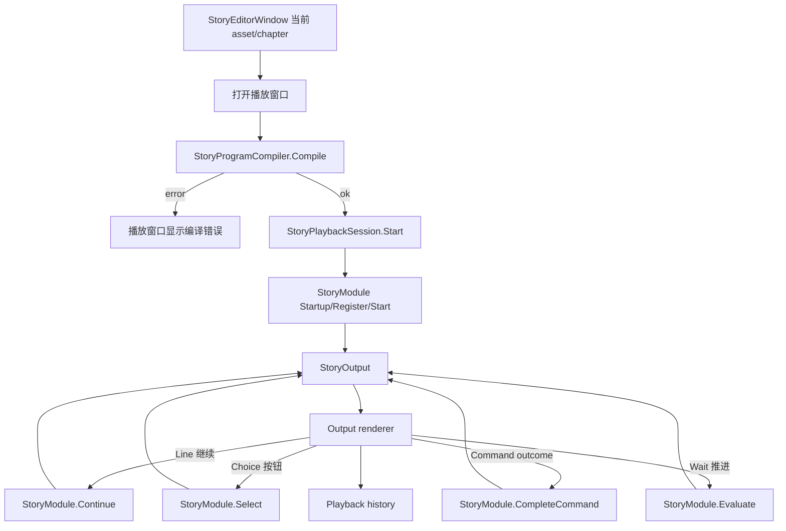

# Story Playback Window Design

## 0. 术语约定

| 术语 | 定义 | 防冲突结论 |
|---|---|---|
| Playback window | Story Editor 打开的独立 EditorWindow，用来在编辑器里运行当前剧情 | 不是 Player 运行时 UI，也不是 Inspector |
| Playback session | 一次由 `StoryProgram`、`StoryModule`、当前章节和当前输出组成的播放会话 | 不等同于 graph preview；它真实调用 runtime API 推进 |
| Output renderer | 播放窗口中把 `StoryOutput` 渲染成文本、按钮、命令卡、等待控件和完成状态的 UI | 只做 Editor 展示，不进入 runtime |
| Command presentation | Editor 中展示 `StoryCommand.Name`、arguments、outcome，并允许手动完成命令 | 不替代业务 command handler，不承诺真实播放所有资源 |
| Media preview adapter | 可选的 Editor-only 资源预览层，例如 guid 能解析到 VideoClip/AudioClip/Texture 时显示预览信息 | 首版可只做资源解析和手动完成，不把媒体播放写进 `StoryModule` |
| Playback history | 播放窗口记录每次输出、选择、命令 outcome 和等待推进的列表 | 用于观察流程，不改变 `StoryRunner.History` 契约 |

## 1. 决策与约束

### 需求摘要

做什么：在 Story Editor 增加一个“运行时播放窗口”。从当前 `StoryAuthoringAsset` 编译出 `StoryProgram`，使用运行时 `StoryModule` 注册并启动，然后在 Editor 窗口中显示每一步输出。作者可以点击继续、选择真实选项、完成命令 outcome、推进等待，并查看历史，从而看见完整剧情流程。

为谁：剧情策划、编辑器维护者、`StoryProgramCompiler` / `StoryModule` 维护者，以及验收示例剧情图的人。

成功标准：

- 从 Story Editor 的当前剧情/章节可以打开播放窗口。
- 打开时会编译当前 authoring graph；有 compiler error 时窗口显示中文错误并不启动会话。
- 无 error 时使用 `StoryModule.Register(program)` / `StartProgram(storyId, chapterId)` 或等价 `Start(program, chapterId)` 启动，而不是复制一份 editor-only runner。
- `Line` 输出显示章节、step、speaker、textKey、tags，并通过“继续”推进。
- `ChoicesReady` 输出显示每个 `StoryChoice` 为按钮，点击后调用 `Select(choiceId)` 推进。
- `Command` 输出显示 command id/name、arguments、waitForCompletion、outcome ports；等待型或有 outcome 的命令通过 outcome 按钮调用 `CompleteCommand(commandId, outcomeId)` 推进。
- `Wait` 输出显示等待秒数，支持手动推进到完成；可选自动计时只调用 `Evaluate(time)`。
- `Completed` 输出显示完成状态，历史中能看到前序输出。
- 播放窗口不使用 `unit`、`payload`、owner action/transition 作为作者概念。

明确不做：

- 不在 `StoryModule` 中渲染对白、按钮、视频、图片或音频。
- 不把 `UnityEditor`、UI Toolkit、Editor graph、`AssetDatabase` 或 Unity object 实例写入 runtime `StoryProgram`。
- 不做 Player 运行时 dialogue UI、字幕系统、语音同步、Timeline/Cinemachine 播放或存档 UI。
- 不引入 Yarn Spinner / Ink，也不改剧情为脚本语言。
- 不替代业务 command handler；首版只提供 Editor 手动完成和可解析资源的信息展示。
- 不在播放窗口里编辑 graph 参数；参数仍在节点图上编辑，播放窗口只读编译结果。

### 复杂度档位

- `Robustness = L3`：播放窗口会成为剧情流程验收入口，必须真实驱动 runtime API 并暴露错误。
- `Structure = editor harness over runtime`：新增 Editor-only harness，runtime 只复用现有 `StoryModule` / `StoryRunner`。
- `Compatibility = additive`：不删除现有黑板自动 smoke；可把按钮文案调整为“快速预览”和“打开播放窗口”。
- `Localization = zh-CN first`：新增可见文案和 tooltip 使用中文。

### 关键决策

1. 播放窗口真实使用运行时模块。
   - 会话持有一个新的 `StoryModule` 实例，调用 `Startup()` 后注册 program。
   - 推进只通过 `Continue()`、`Select(choiceId)`、`CompleteCommand(commandId, outcomeId)`、`Evaluate(time)`。
   - 不再像当前 `StoryEditorPlaybackPreview` 那样默认选择第一个选项并隐藏过程。

2. Editor 窗口承担表现层职责。
   - `StoryOutput` 是 runtime 对表现层的请求；播放窗口就是一个 Editor-only 表现层。
   - Line/Choice/Command/Wait/Completed 都在窗口里显式展示。
   - 资源类 command 只展示参数和解析状态；能解析到 Editor asset 时可显示 asset 名称/类型，是否真正播放媒体作为后续增强。

3. 命令推进必须 outcome 化。
   - `StoryCommand.OutcomePorts` 有值时，每个 outcome 是一个按钮。
   - `WaitForCompletion == true` 且无 outcome 时提供“完成命令”按钮，传入空 outcome 或默认 outcome，由 runtime 当前语义决定。
   - 非等待命令只允许“继续”，避免把非阻塞命令误当阻塞。

4. 现有自动预览保留为 smoke，不再承担完整播放。
   - 黑板现有 `播放当前章节` 只适合快速断链检查。
   - 新入口建议命名为 `打开播放窗口`，用户从当前 story/chapter 启动交互式播放。

## 2. 名词与编排

### 2.1 名词层

#### 现状

- `StoryEditorWindow.CreateGraphBlackboard()` 当前有 `播放当前章节` 按钮，点击后调用 `PlaySelectedChapter()`。
- `PlaySelectedChapter()` 会编译 `StoryAuthoringAsset`，再调用 `StoryEditorPlaybackPreview.Play(program, chapterId)`。
- `StoryEditorPlaybackPreview` 位于 `StoryEditorWindow.cs` 末尾，使用 `new StoryRunner(program, StoryEditorPreviewFunctionResolver.Instance)`，并自动执行默认路径：Line 自动 Continue、ChoicesReady 自动选第一个、Command 自动选第一个 outcome、Wait 自动 Evaluate 到结束。
- `StoryModule.Program.cs` 已提供 runtime program API：`Register()`、`Start(program, chapterId)`、`StartProgram(storyId, chapterId)`、`Continue()`、`Select()`、`CompleteCommand()`、`Evaluate()`、`CreateSnapshot()`。
- `StoryOutput` 已能表达 `Line`、`ChoicesReady`、`Command`、`Wait`、`Completed`，并携带 chapter、step、speaker、textKey、choices、command、waitSeconds。

#### 变化

新增 Editor-only 名词：

```text
StoryEditorPlaybackWindow
  Input: StoryAuthoringAsset + optional chapterId
  Owns: StoryPlaybackSession
  Shows: current output + history + controls

StoryPlaybackSession
  Program: compiled StoryProgram
  Module: StoryModule
  CurrentOutput: StoryOutput
  History: editor display records

StoryPlaybackRecord
  Index
  ChapterId
  StepId
  Kind
  Summary
  Action
```

会话启动示例：

```text
authoring asset + chapterId
  -> StoryProgramCompiler.Compile(asset, out report)
  -> if report.HasErrors: show diagnostics
  -> StoryModule.Startup()
  -> StoryModule.SetFunctionResolver(editor resolver)
  -> StoryModule.Start(program, chapterId)
  -> render CurrentOutput
```

输出 UI 示例：

| Runtime output | 播放窗口表现 | 用户动作 |
|---|---|---|
| `Line` | 显示说话人、文本 key、章节、step、tags | 点击“继续”调用 `Continue()` |
| `ChoicesReady` | 每个 choice 一颗按钮，显示 textKey / choiceId / tags | 点击按钮调用 `Select(choiceId)` |
| `Command` | 命令卡显示 name、arguments、outcome ports、resource 解析状态 | 点击 outcome 或继续 |
| `Wait` | 显示 waitSeconds 和当前推进时间 | 点击“完成等待”调用 `Evaluate(waitSeconds)` |
| `Completed` | 显示剧情完成和最后章节/step | 可重启当前章节 |

### 2.2 编排层



主流程：

1. 作者在 Story Editor 选择 story/chapter，点击 `打开播放窗口`。
2. 播放窗口接收 `StoryAuthoringAsset` 与 chapter id。
3. 窗口编译当前 authoring asset；compiler error 直接显示，不创建 runtime session。
4. 编译成功后创建 `StoryPlaybackSession`，启动 `StoryModule` 并注册 program。
5. 每次 runtime 返回 `StoryOutput` 后，窗口添加 history record 并刷新当前输出区域。
6. 用户通过当前输出区域按钮推进；每个按钮只调用 runtime module 的公开推进 API。
7. 重启时释放旧 session，重新编译并启动当前章节。

流程级约束：

- 错误语义：compiler error、runtime `GameException`、非法空输出都显示为播放窗口错误卡，并保留历史。
- 顺序语义：一次只允许一个 active session；窗口关闭时 shutdown session module。
- 幂等语义：重启当前章节会重新编译和重置变量，不复用旧 runner 状态。
- 扩展点：function resolver、command presentation、media preview adapter 只在 Editor playback 层替换，不改 runtime。
- 可观测点：当前 chapter/step/output kind、history、command arguments、choice id、snapshot summary。

### 2.3 挂载点

1. Story Editor 打开播放窗口入口：删除后用户无法从当前图启动交互式播放。
2. `StoryEditorPlaybackWindow`：删除后 feature 主 UI 消失。
3. `StoryPlaybackSession`：删除后窗口无法通过 runtime module 管理 start/continue/select/command/wait。
4. Output renderer：删除后无法观察 Line/Choice/Command/Wait/Completed。
5. 播放窗口手测记录/验收场景：删除后无法证明“真实播放”闭环。

### 2.4 推进策略

1. 微重构：把现有 `StoryEditorPlaybackPreview` 相关类型从窗口大文件拆到 Playback 目录，行为不变。
   退出信号：现有黑板快速预览仍能编译调用，Editor 编译通过。
2. Playback session 骨架：封装 compile/start/restart/shutdown/current output/history/error。
   退出信号：给定 sample program 能通过 session 启动到第一个 output。
3. 播放窗口静态 UI：新增独立 EditorWindow，显示 header、当前输出区、历史区、错误区和重启/继续控件。
   退出信号：从菜单或 Story Editor 入口能打开窗口并显示当前 story/chapter。
4. 输出交互接通：实现 Line/ChoicesReady/Command/Wait/Completed 的按钮推进。
   退出信号：sample fixture 可手动走过选择、命令 outcome、等待和章节跳转。
5. 命令参数展示和资源解析：显示 command argument 键值，资源字符串可尝试解析为 Editor asset 并显示解析结果。
   退出信号：PlayVideo/ShowImage/PlayAudio 命令可看见资源 key 或 asset 信息，且可手动完成。
6. 验证和文档收口：补自动测试覆盖 session 推进，补手测记录，更新 requirement/architecture 现状。
   退出信号：dotnet build 通过；手测记录覆盖示例播放主路径和至少一个分支。

### 2.5 结构健康度与微重构

- compound convention 检索：未命中专门针对 Story playback window 的长期目录约定；已有架构约束强调 `EditorNodeGraphKit` / runtime 隔离、Story 专有语义留在 Story adapter/window/schema 层。
- 文件级 - `Assets/GameDeveloperKit/Editor/StoryEditor/Window/StoryEditorWindow.cs`：已超过 1500 行，并且末尾包含自动播放预览 helper。继续追加完整播放窗口会扩大窗口类职责。
- 文件级 - `StoryEditorPlaybackPreview`：当前是可独立搬迁的 editor helper，适合作为安全微重构目标。
- 目录级 - `Assets/GameDeveloperKit/Editor/StoryEditor/`：已有 `Migration/`、`UI/`、`Window/`。新增 `Playback/` 能表达播放窗口和 session 归属，不污染通用 `EditorNodeGraphKit`。

结论：做文件级微重构，并新增 `Playback/` 目录。先把自动 preview 类型搬出 `StoryEditorWindow.cs`，保持命名空间和行为不变；再在同目录新增 interactive playback session/window。验证靠 Editor 编译和现有快速预览入口。

超出范围的观察：`StoryEditorWindow.cs` 仍可以继续拆 toolbar/tree/workspace/asset commands，但这会改变窗口组织，不作为本 feature 前置。

## 3. 验收契约

| 场景 | 输入 / 触发 | 期望可观察结果 |
|---|---|---|
| N1 打开入口 | 在 Story Editor 选中示例章节并点击 `打开播放窗口` | 独立窗口打开，显示 storyId、version、chapter、编译状态 |
| N2 编译失败 | 当前图存在必填字段缺失或断边 | 播放窗口显示中文编译错误，不启动 runtime session |
| N3 启动 runtime | sample fixture 编译无 error | session 使用 `StoryModule` 启动，并显示第一个 runtime output |
| N4 Line 推进 | 当前 output 为 `Line` | 显示 speaker/textKey/tags；点击继续后进入下一 output |
| N5 Choice 推进 | 当前 output 为 `ChoicesReady` | 显示所有可用选项按钮；点击某个 choice 后按该分支推进 |
| N6 Command 展示 | 当前 output 为 `Command` | 显示 command id/name、arguments、waitForCompletion、outcome ports |
| N7 Command 完成 | 等待型或有 outcome command | 点击 outcome 后调用 `CompleteCommand` 并进入目标 output |
| N8 Wait 推进 | 当前 output 为 `Wait` | 显示 waitSeconds；点击完成等待后调用 `Evaluate(waitSeconds)` 推进 |
| N9 Completed | 流程走到 End | 显示完成状态，继续按钮不可用，允许重启当前章节 |
| N10 历史记录 | 完整播放一条路径 | history 列出每次 output 和用户动作，包含 chapter/step/kind |
| N11 重启章节 | 点击重启当前章节 | 旧 session 清理，新 session 从该章节 entry 重新开始 |
| N12 关闭窗口 | 关闭播放窗口 | session shutdown，不留下活动 runner |
| E1 范围守护 | grep runtime Story 目录 | 不出现 `EditorNodeGraph`、`UnityEditor.Experimental.GraphView`、UI Toolkit editor graph 或播放窗口类型引用 |
| E2 范围守护 | 播放媒体命令 | 首版不要求真实视频/音频播放；必须显示命令和资源 key，并能手动完成 |
| E3 范围守护 | grep author-facing UI | 不恢复 `unit`、`payload`、owner action/transition 作为播放窗口概念 |

## 4. 落档与后续

- `roadmap/story-editor-hardening/items.yaml`：本 design 批准后把 `story-playback-window` 改为 `in-progress` 并写入 feature 目录；验收通过后改为 `done`。
- `requirements/story-editor.md`：验收通过后追加“Editor 内运行时播放窗口”实现进展，但 requirement 仍可保持 draft，直到整体 Story Editor 能满足稳定交付标准。
- `architecture/ARCHITECTURE.md`：验收通过后在 Story Editor / Editor Node Graph 现状中补充播放窗口边界：Editor-only harness 使用 runtime `StoryModule`，runtime 不反向引用 Editor。
- 后续可单独设计“真实媒体预览 adapter”：如果要在 Editor 中实际播放 VideoClip/AudioClip，需要另起 feature 明确资源解析、播放控制和 Unity Editor 生命周期。
