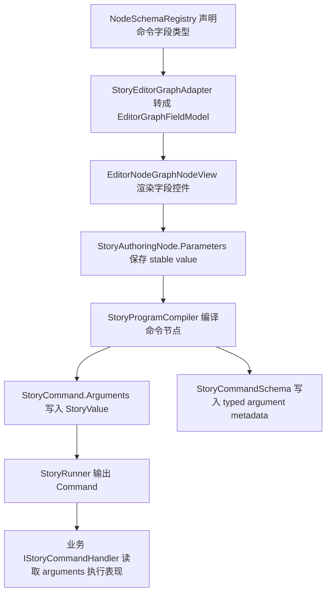

# Typed Command Fields Design

## 0. 术语约定

| 术语 | 定义 | 防冲突结论 |
|---|---|---|
| Command node | Story 作者图中会编译为 `StoryStepKind.Command` 的动作节点，如 `PlayVideo` / `PlayAudio` / `ShowImage` / `ExternalAction` | 不恢复旧 owner action；仍是独立语义节点 |
| Typed field | 由 `NodeParameterDefinition` 声明的字段类型、必填性、提示和可选项 | 现状已有 `String/Number/Boolean/Option`，本 feature 扩展媒体/资源字段 |
| Asset reference field | 编辑器里可用 `ObjectField` 选择 Unity asset 的字段 | runtime 不保存 Unity object；编译后导出 GUID / address / key 字符串 |
| Runtime argument | `StoryCommand.Arguments` 内的 `StoryValue` | 只允许 `Boolean/Number/String/Null`，不新增 Unity object 值类型 |
| Command argument schema | `StoryCommandSchema` 中对 command 参数的声明 | 现状只有参数名；本 feature 让它携带参数定义或等价 typed metadata |

## 1. 决策与约束

### 需求摘要

做什么：把播放视频等命令节点从“图上填字符串参数”收敛到 schema 驱动的类型化字段；媒体/资源类字段在 Editor authoring 中可以选择 Unity asset 或资源引用，编译后的 `StoryProgram` 只携带稳定 runtime 参数。

为谁：剧情策划、表现层 command handler、`StoryProgramCompiler` 维护者，以及后续图上校验反馈。

成功标准：

- `PlayVideo.clip` 不再只是普通字符串字段，schema 能表达“这是视频资源引用”。
- Story Editor 节点图能为资源字段展示选择控件；字段 tooltip 仍为中文并带参数键。
- authoring asset 可以保存可序列化的资源引用信息；编译后的 `StoryCommand.Arguments["clip"]` 是稳定字符串，例如 asset GUID 或业务资源 key。
- `StoryCommandSchema` 能让 runtime / handler 看到参数名和类型 metadata，不只是一组字符串参数名。
- 缺失必填命令字段或资源字段无法解析时，编译失败并定位到 story / chapter / node / field。

明确不做：

- 不在 `StoryModule` 里播放视频、加载资源或绑定具体 UI。
- 不把 Unity object 实例、`UnityEngine.Object` 类型引用、`AssetDatabase` 或 UI Toolkit `ObjectField` 写入 runtime `StoryProgram`。
- 不做 Addressables / ResourceModule 的完整资源管线，也不规定业务最终加载方式。
- 不做 graph validation overlay、错误 badge 或字段红框；留给 `story-graph-validation-feedback`。
- 不做完整命令插件系统或第三方 command handler 自动发现。

### 复杂度档位

- `Robustness = L3`：命令字段进入可交付 authoring/runtime 契约，缺必填、类型不匹配、资源无法解析都必须有定位错误。
- `Structure = modules`：需要同时改 runtime schema、Editor graph field model、Story adapter/window 和 compiler，不能把所有逻辑堆进单文件。
- `Compatibility = backward-compatible`：已有字符串参数 authoring / tests 继续可编译；资源字段新增稳定导出，不破坏旧 `StoryArgumentBag.GetString()` 调用。
- `Isolation = editor-authoring -> compiler -> runtime`：Editor 可以使用 `ObjectField` / `AssetDatabase`，runtime 只消费 `StoryProgram` 和 string/number/bool arguments。

### 关键决策

1. `NodeParameterDefinition` 继续作为节点字段唯一 schema 来源。
   - 字段类型、必填、tooltip、可选项和资源类型都从 schema 生成。
   - Story Editor 不在窗口里硬编码 `PlayVideo.clip` 的 UI。

2. 媒体/资源字段编译为稳定字符串。
   - Editor authoring 可保存 object reference 或 GUID。
   - `StoryProgram` 中只保存 `StoryValue.FromString(stableId)`。
   - 首版稳定 id 优先使用 Unity asset GUID；没有 asset 时允许保留已有手填字符串，作为兼容输入。

3. `StoryCommandSchema` 升级为 typed metadata。
   - 旧 `ArgumentNames` 可保留兼容读取。
   - 新 metadata 至少包含 key、display label、value type、required 和 resource object type / hint。

4. 字段类型化先覆盖命令节点。
   - `Dialogue.textKey`、`Choice.textKey`、condition 参数仍走现有类型。
   - 资源字段首批覆盖 `PlayVideo.clip`，可顺手覆盖 `ShowImage.image`、`PlayAudio.clip`，但不扩成完整资源系统。

## 2. 名词与编排

### 2.1 名词层

#### 现状

- `ParameterValueType` 位于 `Assets/GameDeveloperKit/Runtime/Story/Definition/NodeType.cs`，当前只有 `String`、`Number`、`Boolean`、`Option`。
- `NodeParameterDefinition` 是 readonly struct，只保存 `Key`、`Label`、`ValueType`、`Required`。
- `NodeSchemaRegistry.RegisterDefaults()` 把 `PlayVideo.clip`、`ShowImage.image`、`PlayAudio.clip` 都注册为 `ParameterValueType.String`。
- `StoryAuthoringNode.Parameters` 保存 `List<StoryAuthoringParameter>`，每个参数只有 `Key` 和 `Value` 字符串。
- `EditorGraphFieldValueType` 只支持 `Text`、`Number`、`Boolean`、`Option`；`EditorNodeGraphNodeView.CreateField()` 对应 `TextField`、`FloatField`、`Toggle`、`DropdownField`。
- `StoryProgramCompiler.BuildCommandStep()` 用 `BuildArguments(node.Parameters)` 把所有非 `wait` 参数按 `ParseValue()` 变为 `StoryValue`，`StoryCommandSchema` 只记录 `ArgumentNames`。
- `StoryCommandDefinition` 当前只包含 command name、display name、wait、argument names、outcome ports。

#### 变化

新增或扩展的名词：

```csharp
// 来源：Assets/GameDeveloperKit/Runtime/Story/Definition/NodeType.cs
public enum ParameterValueType
{
    String,
    Number,
    Boolean,
    Option,
    AssetReference
}

public readonly struct NodeParameterDefinition
{
    public string Key { get; }
    public string Label { get; }
    public ParameterValueType ValueType { get; }
    public bool Required { get; }
    public string Tooltip { get; }
    public string ResourceType { get; }
    public IReadOnlyList<string> Options { get; }
}
```

```csharp
// 来源：Assets/GameDeveloperKit/Runtime/Story/Program/StorySchema.cs
public sealed class StoryCommandArgumentDefinition
{
    public string Key { get; }
    public string Label { get; }
    public ParameterValueType ValueType { get; }
    public bool Required { get; }
    public string ResourceType { get; }
}
```

接口行为示例：

```text
PlayVideo node parameters:
  clip = guid:9f1c...
  wait = true

Compiled command:
  command.Name = "play_video"
  command.Arguments["clip"] = StoryValue.FromString("guid:9f1c...")
  command.Arguments["wait"] is not exported as argument
  command.WaitForCompletion = true

Command schema:
  play_video.arguments["clip"].ValueType = AssetReference
  play_video.arguments["clip"].ResourceType = "UnityEngine.Video.VideoClip"
```

兼容输入示例：

```text
Legacy/manual node parameter:
  clip = intro.mp4

Compiled command:
  command.Arguments["clip"] = "intro.mp4"
  compiler warning: resource field uses manual string fallback
```

### 2.2 编排层



#### 现状

当前流程是 schema 声明参数名和基础类型，graph node 直接渲染基础 UI，参数以字符串写回 authoring；compiler 不按 schema 校验命令字段，而是把 `ParameterBag.Values` 全量转 `StoryValue` 并注册 argument names。运行时只校验 command schema 是否存在，不校验参数是否满足 schema。

#### 变化

1. schema 层给命令参数补齐 typed metadata。
   - `PlayVideo.clip` 改为 `AssetReference`，resource type 为 `UnityEngine.Video.VideoClip`。
   - `ShowImage.image` / `PlayAudio.clip` 可以同样声明为 asset reference，resource type 分别为 texture/audio clip。
   - `Compare.operator` 的 option 列表从硬编码 `OptionsFor(parameter)` 迁回 schema。

2. graph kit 支持资源字段视图，但保持业务无关。
   - 通用 `EditorGraphFieldValueType` 新增 `AssetReference`。
   - `EditorGraphFieldModel` 只携带 resource type / value / tooltip，不依赖 Story 类型。
   - `EditorNodeGraphNodeView` 在 Editor 中用 `ObjectField` 渲染 asset field；当无法解析对象时仍显示 stable string。

3. Story adapter/window 负责 Story 语义和 Unity asset 转换。
   - adapter 把 `NodeParameterDefinition.ResourceType` 映射到 graph field。
   - window 在字段写回时保存 stable value；若收到 object field 选择结果，用 `AssetDatabase.AssetPathToGUID()` 转成 `guid:{guid}`。

4. compiler 按 schema 编译命令参数。
   - 对 command node 获取 `NodeSchemaRegistry.Get(node.Kind)`。
   - required 字段空值时报 error，定位 `story/chapter/node/field`。
   - `Number/Boolean` 按 schema 解析，解析失败时报 error。
   - `AssetReference` 要求 stable value 非空；`guid:` / 手填 key 都导出为 string，但手填 key 可 warning。
   - `wait` 保持 command step 控制字段，不进入 arguments。

5. runtime schema 能描述 typed arguments。
   - `StoryCommandDefinition` 增加 argument definitions；`ArgumentNames` 保留由 definitions 派生或兼容构造。
   - `StoryModule.Program.Validation` 校验 command step 的 arguments 是否满足 command schema：缺 required、类型不匹配、未知 command 继续报定位错误。

#### 流程级约束

- 错误语义：compiler 和 runtime validation 的错误必须包含 `story/chapter/node/field/command` 或 `step/argument` 定位。
- 兼容性：已有字符串 `clip = intro.mp4` 不直接失败；作为手动 resource key 进入 runtime，并产生 warning，方便旧数据迁移。
- Runtime 边界：`StoryProgram`、`StoryCommand`、`StoryCommandSchema` 不直接引用 `UnityEngine.Object`、`UnityEditor.AssetDatabase`、`ObjectField`、editor graph 类型或 `UnityEngine.Video.VideoClip` 类型；resource type 只允许作为字符串 metadata 保存。
- GraphKit 边界：`EditorNodeGraphKit` 只知道通用 asset field，不知道 `NodeKind.PlayVideo` 或 Story command 语义。
- 顺序：先把 schema metadata 打通，再加 ObjectField 选择，再收紧 compiler/runtime 校验，避免 UI 先行但编译不可验证。

### 2.3 挂载点清单

- `NodeSchemaRegistry` 默认命令节点 schema：新增/修改 `PlayVideo` 等命令参数的 typed metadata。
- `EditorNodeGraphKit` field model / node view：新增通用 asset reference field 渲染能力。
- `StoryEditorGraphAdapter` / `StoryEditorWindow`：把 Story schema 映射为 graph 字段，并把 editor object 选择写回 stable value。
- `StoryProgramCompiler` command 编译：按 schema 导出 arguments 与 command argument definitions。
- `StoryModule.Program.Validation`：runtime 兜底校验 command arguments 满足 typed schema。

### 2.4 推进策略

1. schema 名词骨架：扩展 `ParameterValueType`、`NodeParameterDefinition`、`StoryCommandArgumentDefinition` / `StoryCommandDefinition`，保留旧构造兼容。
   退出信号：现有 Runtime.Tests / Editor.Tests 构建通过，旧 `ArgumentNames` 读取仍可用。
2. 命令 schema 声明：把媒体命令字段改为 asset reference，并把 option 列表迁入 schema。
   退出信号：schema 查询能拿到 `PlayVideo.clip` 的 asset 类型 metadata。
3. graph 字段视图：让 `EditorNodeGraphKit` 支持 asset reference 字段，Story adapter 能把命令字段映射为资源选择控件。
   退出信号：V4 graph model 中 `PlayVideo.clip` 字段类型为 asset reference，仍可写回参数。
4. 编译器导出：按 schema 编译 command arguments 与 typed command schema，处理 required/type/resource 错误和兼容 warning。
   退出信号：合法 PlayVideo 编译为 stable string argument；缺 clip / number 解析错误会定位 field。
5. runtime validation：按 `StoryCommandSchema` 校验 command arguments。
   退出信号：缺 required argument、类型不匹配、未知 command 都在 register 阶段失败并带定位。
6. 测试与证据：补齐 editor graph model、compiler、runtime validation 关键场景并运行构建。
   退出信号：Editor.Tests、Runtime.Tests 构建通过，checklist 关键场景均有证据。

### 2.5 结构健康度与微重构

##### 评估

- 文件级 — `Assets/GameDeveloperKit/Runtime/Story/Definition/NodeType.cs`：约 22KB，已同时包含 node enum、parameter enum、port definition、schema definition 和 registry 默认注册。本 feature 需要改 schema 类型与默认注册，属于同一职责内扩展，但文件已经偏胖。
- 文件级 — `Assets/GameDeveloperKit/Editor/StoryEditor/Compiler/StoryProgramCompiler.cs`：约 52KB，command 编译 helper 仍在主文件中；上个 feature 已把 choice helper 拆成 partial。本 feature 会改 command 编译、argument 构建和 schema 注册，继续堆在主文件会加重职责混杂。
- 文件级 — `Assets/GameDeveloperKit/Editor/NodeGraph/EditorNodeGraphNodeView.cs`：约 15KB，字段控件创建集中在 `CreateField()`，新增 asset field 是自然扩展，暂不需要拆。
- 文件级 — `Assets/GameDeveloperKit/Editor/StoryEditor/StoryEditorGraphAdapter.cs` / `StoryEditorWindow.cs`：adapter 负责映射，window 已偏大但本 feature 只需字段写回和 asset 解析，不做窗口拆分。
- 目录级 — `Assets/GameDeveloperKit/Editor/StoryEditor/Compiler/`：当前只有主 compiler 和 choice partial，新增 command partial 符合既有拆分方向，不构成目录摊平。
- 目录级 — `Assets/GameDeveloperKit/Editor/NodeGraph/`：已有 6 个主要源码文件，本 feature 不新增多个同层业务文件。
- compound convention 搜索未命中现有目录组织 / 文件归属约定。

##### 结论：做微重构（拆文件）

先把 `StoryProgramCompiler` 中 command 编译相关 helper 拆到 `StoryProgramCompiler.Command.cs`，与现有 `StoryProgramCompiler.Choice.cs` 对齐。该步骤只搬不改行为，然后在 command partial 内实现 typed argument 编译。

##### 方案

- 搬什么：`BuildCommandStep()`、`RegisterCommandSchema()`、`BuildArguments()`、`BuildArgumentNames()`、`BuildCommandDefinition()`、`GetCommandName()` 以及紧密依赖的 command helper。
- 搬到哪：`Assets/GameDeveloperKit/Editor/StoryEditor/Compiler/StoryProgramCompiler.Command.cs`，同 namespace、同 partial class。
- 行为不变怎么验证：搬迁后 `dotnet build GameDeveloperKit.Editor.Tests.csproj --no-restore` 通过；现有 PlayVideo compiler tests 保持不变。
- 步骤序列：
  1. 新建 command partial 并移动 command helper。
  2. 保持方法签名与调用点不变。
  3. 构建通过后再进行 typed command fields 主体修改。

##### 超出范围的观察

- `NodeType.cs` 仍偏胖，长期可把 schema registry 和 enum/definition 类型拆开；这会影响 Runtime Definition 组织，建议后续单独走 `cs-refactor`，本 feature 不阻塞。
- `StoryEditorWindow.cs` 仍偏大，后续可拆 asset commands / graph workspace / story tree；本 feature 不做窗口级重构。

## 3. 验收契约

| 编号 | 输入 / 触发 | 期望可观察结果 |
|---|---|---|
| N1 | 查询 `NodeSchemaRegistry.Get(NodeKind.PlayVideo)` | `clip` 参数类型为 `AssetReference`，必填，resource type 指向 `UnityEngine.Video.VideoClip` |
| N2 | Story Editor graph model 构建 PlayVideo 节点 | `clip` 字段的 graph field 类型为 asset reference，tooltip 为中文并包含参数键 |
| N3 | 在 graph 字段中写入 `guid:{guid}` | authoring node 参数保存 stable value，不保存 Unity object 实例 |
| N4 | PlayVideo 节点 `clip=guid:{guid}`、`wait=true` 编译 | `StoryCommand.Arguments["clip"]` 为 string，值为同一 stable id；`wait` 不进入 arguments；`WaitForCompletion=true` |
| N5 | PlayVideo 节点沿用旧字符串 `clip=intro.mp4` 编译 | 编译通过并产生兼容 warning；runtime argument 值为 `intro.mp4` |
| N6 | PlayVideo 缺少必填 `clip` | compiler 失败，错误定位到 `story/chapter/node/field:clip` |
| N7 | Wait.duration 或其他 Number 字段填非法数字 | compiler 或 validation 失败，错误定位到对应 field |
| N8 | Boolean 字段填非法值 | compiler 或 validation 失败，错误定位到对应 field |
| N9 | `StoryCommandSchema` 中 `play_video` | 包含 typed argument definition，`ArgumentNames` 仍包含 `clip` |
| N10 | runtime 注册一个 command step，schema 要求 `clip` 但 arguments 缺失 | `StoryModule.Register(program)` 失败，错误包含 `story/chapter/step/command/argument` |
| N11 | runtime 注册一个 command step，schema 要求 Number 但 argument 是 String | 注册失败并定位 argument |
| N12 | Runtime Story 程序 grep | 不引用 `UnityEditor`、`ObjectField`、`AssetDatabase` 或 `UnityEngine.Video.VideoClip` 类型；只允许资源类型字符串 metadata |
| N13 | EditorNodeGraphKit grep | 不引用 `NodeKind.PlayVideo`、`StoryCommand` 或 Story 专有 command 名 |
| N14 | 旧 compiler PlayVideo 测试 | 仍能用字符串参数编译并通过旧读取方式 `GetString("clip")` |

### 明确不做的反向核对项

- 不应在 runtime `StoryProgram` / `StoryCommand` / `StoryCommandSchema` 中保存 Unity object 实例。
- 不应让 `StoryModule` 调用 ResourceModule、VideoPlayer 或 UI。
- 不应在 `EditorNodeGraphKit` 中出现 `NodeKind`、`PlayVideo`、`StoryCommand` 等 Story 业务语义。
- 不应新增 graph validation overlay、错误 badge 或字段红框。
- 不应引入 Addressables 或完整资源加载管线。

## 4. 与项目级架构文档的关系

验收通过后需要更新 `.codestable/architecture/ARCHITECTURE.md` 的 Story Editor / Editor Node Graph 现状：

- 命令字段类型由 `NodeParameterDefinition` / `NodeSchemaRegistry` 统一声明。
- Editor graph 可展示 asset reference 字段，但 `StoryProgram` runtime 只保存 stable string argument。
- `StoryCommandSchema` 包含 typed command argument metadata，runtime validation 可据此兜底。
- `EditorNodeGraphKit` 仍保持业务无关；Story asset 解析只在 Story adapter/window/editor compiler 边界内。

