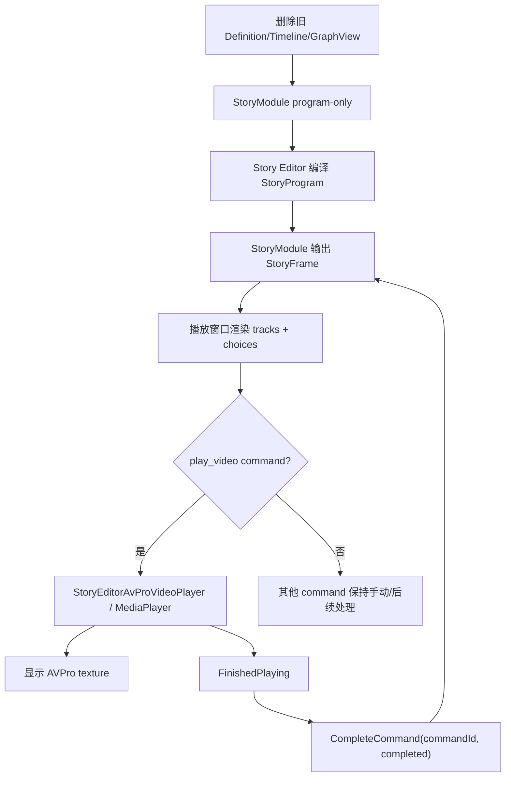

# Story Cleanup AVPro Playback Design

## 0. 术语约定

| 术语 | 定义 | 防冲突结论 |
|---|---|---|
| 旧 Story runtime | `Definition` / `Timeline` / `ActionRequest` / `InteractionRequest` / `Payload` / `NodeType` 等事件式运行时 | 本 feature 删除，不再兼容 |
| 当前 Story runtime | `StoryProgram` / `StoryRunner` / `StoryFrame` / `StoryCommand` | 保留并作为唯一运行时契约 |
| 旧 Story editor | `StoryEditorWindow`、GraphView 旧画布、Definition mapper/exporter、CSV v2/v3 旧交换路径 | 删除或从主编译路径移除 |
| 当前 Story editor | Story Editor + `EditorNodeGraphKit` + `StoryAuthoringAsset` + `StoryProgramCompiler` | 保留并继续收敛 |
| AVPro 播放层 | Editor 播放窗口中用于执行 `play_video` command track 的表现层 | 只依赖 AVProVideo，不再支持 Unity `VideoPlayer` |
| 资源路径 | 编译后 command argument 中保存的 `Assets/...` 字符串 | 不保存 `guid:`；AVPro 播放层按路径解析 |

## 1. 决策与约束

### 需求摘要

做什么：移除前几轮保留下来的 Story 旧版兼容代码，避免 `volume/unit/payload/action/interaction/timeline` 与 v4 graph/program/frame 同时存在；同时把播放窗口从“只展示命令、手动完成”推进到对 `play_video` 命令使用 AVProVideo 真实播放，播放结束或错误后再驱动 `StoryModule.CompleteCommand()`。

为谁：剧情编辑器使用者、Story runtime 维护者、后续节点库精简和多轨播放实现。

成功标准：

- Runtime Story 只保留 `StoryProgram` / `StoryRunner` / `StoryFrame` 主路径；`StoryModule` 不再暴露 `Register(Definition)`、`Start(string storyId, ...)` 返回 `Timeline`、旧事件和旧条件解析器。
- 删除旧 `Definition` / `Execution` / `Events` / 旧 integration 类型，或把仍需复用的 schema 类型重命名迁出旧概念文件。
- Story Editor 不再依赖 `StoryDefinitionMapper`、旧 GraphView、旧 `StoryEditorWindow`、旧 CSV/Definition exporter。
- `StoryAuthoringAsset` 去掉 `Units`、legacy owner actions/interactions/transitions、`NodeType`、`Payload` 等迁移入口；节点参数只保留 `Parameters`。
- 资源字段编译为 `Assets/...` 路径字符串；不再写入 `guid:`。
- 播放窗口对 `play_video` command track 创建 AVPro `MediaPlayer`，打开 `Assets/...` 对应文件，显示视频纹理和播放状态。
- `play_video` 等待完成时由 AVPro `FinishedPlaying` 或错误按钮/错误事件触发 `CompleteCommand(commandId, "completed")` 或显示错误，不能一点击播放就直接完成。
- 不支持 Unity 内置 `VideoPlayer`，不写双后端抽象。

明确不做：

- 不兼容旧 v2/v3 Definition/Timeline 资产或测试。
- 不保留旧 Story Editor 菜单入口和 GraphView 画布。
- 不实现 Player 正式剧情 UI；本次 AVPro 播放先落在 Editor 播放窗口。
- 不把 AVPro 类型放进 `StoryProgram`、`StoryRunner` 或 Story runtime 数据模型。
- 不支持 Unity `VideoPlayer` 后端。
- 不在本 feature 彻底重做节点库语义；节点精简仍由后续 story-editor-node-simplification 承接。

### 复杂度档位

- `Compatibility = breaking-clean`：用户已确认可以完全重构，不保留老版本代码。
- `Architecture = runtime-data / presentation-player`：Story runtime 仍只输出 `StoryFrame` 数据；AVPro 是表现层。
- `Dependency = explicit-avpro-editor`：编辑器程序集需要引用 `AVProVideo.Runtime`，但 Runtime Story 程序集不引用 AVPro。
- `Verification = compile + grep + editor manual`：删除旧路径后必须用编译和 grep 证明没有残留；AVPro 播放需人工在播放窗口验证。

### 关键决策

1. 清理优先级高于兼容。
   - `StoryModule.cs` 当前仍同时维护 `m_Definitions` / `Current Timeline` 和 `m_Programs` / `CurrentRunner`。
   - 本 feature 将 `StoryModule` 收敛为 v4 program-only 门面。
   - 旧 runtime 测试删除或改写为 `StoryProgram` 等价测试。

2. `StoryAuthoringAsset` 保留为 v4 authoring asset，但清掉迁移包袱。
   - 保留：storyId、version、entryChapterId、chapters、layout、node parameters、edges、conditions。
   - 删除：entryVolumeId、volumes、units、nodeType、payload、owner actions/interactions/transitions、legacy migration messages。
   - 原因：这些字段会把旧 “volume/unit/payload” 概念继续暴露到编辑器和测试里。

3. `NodeKind` / `NodeSchemaRegistry` 需要从旧 Definition 目录迁出。
   - 当前 `NodeKind`、`NodeParameterDefinition`、`NodeSchemaRegistry` 位于 `Runtime/Story/Definition/NodeType.cs`，文件名和 legacy 类型混在一起。
   - 新位置建议为 `Runtime/Story/AuthoringSchema/` 或 `Runtime/Story/Program/` 下的独立 schema 文件。
   - `NodeType` enum 删除；`NodeKind` 成为唯一节点种类。

4. AVPro 只在播放窗口层执行。
   - Editor 播放窗口读取 `StoryFrame.Tracks`，发现 command name 为 `play_video` 时交给 `StoryEditorAvProVideoPlayer`。
   - 该类内部创建隐藏 `GameObject` + `RenderHeads.Media.AVProVideo.MediaPlayer`，通过 `OpenMedia(MediaPathType.AbsolutePathOrURL, fullPath, true)` 播放。
   - UI Toolkit 用 `Image` 或 IMGUI 容器展示 `MediaPlayer.TextureProducer.GetTexture()`。
   - `MediaPlayer.Events` 监听 `FirstFrameReady`、`FinishedPlaying`、`Error`。

5. 编译后资源只保存路径。
   - `StoryProgramCompiler.Command` 对 `AssetReference` 字段只接受或规范化为 `Assets/...`。
   - `guid:` 输入可以在编辑器字段写入时立即转换为 path；编译产物不得保留 `guid:`。
   - 播放层把 `Assets/...` 转为 `Path.GetFullPath(path)` 给 AVPro。

## 2. 名词与编排

### 2.1 名词层

#### 现状

- Runtime 目录同时有 `Definition/`、`Execution/`、`Events/`、`Integration/` 与 `Program/`、`Runtime/` 两套模型。
- `StoryModule.cs` 管旧 `Definition` 注册、`Timeline` 启动、旧事件转发；`StoryModule.Program.cs` 管新 `StoryProgram`。
- `Module.Validation.cs` 校验旧 `Definition`，`StoryModule.Program.Validation.cs` 校验新 `StoryProgram`。
- `StoryOutput.cs` 文件实际已经定义 `StoryFrame` / `StoryFrameTrack`，文件名和旧输出概念不一致。
- `Editor/StoryEditor` 中 v4 仍复用 `Model/`、`Compiler/`、`Validation/`，但旧 `Window/`、`Graph/`、`Mapping/`、`Export/`、`Excel/` 仍存在。
- `StoryProgramCompiler.Command` 对 asset reference 允许 `guid:`，播放窗口也会解析 `guid:`。
- AVProVideo 已在项目中，运行时 asmdef 名称为 `AVProVideo.Runtime`，核心类型为 `RenderHeads.Media.AVProVideo.MediaPlayer`。

#### 变化

Runtime 公开面收敛为：

```csharp
public sealed partial class StoryModule : GameModuleBase
{
    public StoryRunner CurrentRunner { get; }
    public StoryProgram CurrentProgram { get; }
    public StoryFrame CurrentFrame { get; }
    public IStoryVariableStore VariableStore { get; }
    public IStoryFunctionResolver FunctionResolver { get; }

    public void SetFunctionResolver(IStoryFunctionResolver resolver);
    public void Register(StoryProgram program);
    public bool HasProgram(string storyId);
    public bool TryGetProgram(string storyId, out StoryProgram program);
    public bool UnregisterProgram(string storyId);
    public StoryRunner Start(StoryProgram program, string chapterId = null);
    public StoryRunner StartProgram(string storyId, string chapterId = null);
    public StoryFrame Continue();
    public StoryFrame Select(string choiceId);
    public StoryFrame CompleteCommand(string commandId, string outcomeId);
    public StoryFrame Evaluate(double time);
    public StorySnapshot CreateSnapshot();
    public StoryRunner Restore(StorySnapshot snapshot);
}
```

Editor AVPro 播放层新增：

```csharp
internal sealed class StoryEditorAvProVideoPlayer : IDisposable
{
    public bool IsPlaying { get; }
    public bool IsFinished { get; }
    public string ErrorMessage { get; }
    public Texture CurrentTexture { get; }

    public bool Play(StoryCommand command, string assetPath);
    public void Stop();
    public void Update();
}
```

播放窗口不直接把 AVPro 事件写进 runtime；它只在 `FinishedPlaying` 时调用现有 `StoryPlaybackSession.CompleteCommand(commandId, "completed")`。

### 2.2 编排层



主流程：

1. 实现第一步先做纯清理：让 runtime/editor/tests 编译失败点集中暴露。
2. 将 `NodeKind`/schema 从旧 `NodeType.cs` 拆出，删除 `NodeType` 和旧 Definition/Timeline 类型。
3. `StoryModule` 删除旧字段、旧事件、旧 API，只保留 program API。
4. `StoryAuthoringAsset` 删除 legacy 序列化字段和迁移逻辑，示例 fixture 直接生成 v4 chapters。
5. `StoryProgramCompiler` 改为从 `StoryAuthoringAsset`/v4 authoring model 编译，不通过 `StoryDefinitionMapper.Build(asset)` 中转。
6. `AssetReference` 字段在编辑器字段写回和编译时都规范化为 `Assets/...`。
7. 播放窗口启动后扫描当前 frame 的 command tracks；`play_video` track 用 AVPro 播放，其他 command 仍按当前命令卡展示。
8. AVPro 播放结束后，播放窗口调用 `CompleteCommand` 推进到下一 frame；播放中如果 frame 同时有 choices，选项仍可立即显示。

流程级约束：

- 错误语义：AVPro 打开失败或 Error event 显示中文错误，不静默推进；用户可手动完成命令用于继续排查流程。
- 生命周期：播放窗口关闭、重启章节、切换 session 时必须销毁 AVPro GameObject 并移除事件监听。
- 顺序语义：同一 frame 只有当前 `play_video` 命令实例会绑定 AVPro 播放；进入下一 frame 前停止旧视频。
- 资源语义：只接受 `Assets/...`、绝对路径或 URL；`guid:` 在编译产物中视为错误或提前转换。
- 隔离语义：`GameDeveloperKit.Runtime.asmdef` 不引用 `AVProVideo.Runtime`；`GameDeveloperKit.Editor.asmdef` 可以引用 `AVProVideo.Runtime`。

### 2.3 挂载点

1. Runtime Story program-only API：删除后旧 Timeline 仍会继续污染主路径。
2. v4 authoring schema 清理：删除后 `unit/payload/nodeType` 仍会在编辑器和测试中出现。
3. 编译器路径化资源字段：删除后播放窗口仍会遇到 `guid:`，不符合用户要求。
4. 播放窗口 AVPro presenter：删除后 `play_video` 仍只是命令卡，无法真实播放。
5. AVPro asmdef 引用和生命周期管理：删除后编辑器无法编译或关闭窗口后残留播放器。

### 2.4 推进策略

1. Runtime 旧路径删除与 schema 拆分。
   退出信号：`Runtime/Story` 下不再有 `Definition/Execution/Events/Integration` legacy 类型；`StoryModule` program-only 编译通过。
2. Editor v4 authoring model 清理。
   退出信号：`StoryAuthoringAsset` 不再暴露 volumes/units/payload/nodeType/owner actions/interactions/transitions；示例 fixture 仍能创建 v4 asset。
3. Compiler/validator 直连 v4 authoring。
   退出信号：`StoryProgramCompiler.Compile(asset)` 不再调用 `StoryDefinitionMapper`; v4 tests 通过；旧 mapper/exporter/csv/window/graph 删除。
4. 资源路径规范化。
   退出信号：编译产物中的 asset references 保存 `Assets/...`；grep 不再出现写入 `guid:` 的编译路径。
5. 播放窗口 AVPro 视频 presenter。
   退出信号：`play_video` 命令在播放窗口中真实打开 AVPro，显示纹理，结束后推进 command。
6. 验证与落档。
   退出信号：Runtime/Editor/Tests 编译通过；grep 旧 API 和 `VideoPlayer` 无残留；手测示例视频播放和“视频 + 选项”同帧。

### 2.5 结构健康度与微重构

- compound convention 检索：未命中 Story cleanup / AVPro 播放的既有 decision。
- 文件级 - `StoryModule.cs`：职责混杂，旧 Timeline 与新 Program 并存；本次直接删除旧半边而非继续 partial 兼容。
- 文件级 - `StoryOutput.cs`：文件名误导，内容是 `StoryFrame`；本次应重命名为 `StoryFrame.cs`。
- 文件级 - `StoryAuthoringAsset.cs`：承担 v4 数据、v2/v3 迁移、legacy owner 展开、unit/volume flatten，已经过胖；本次允许破坏式删除迁移逻辑，必要时拆 `StoryAuthoringTypes.cs`。
- 目录级 - `Editor/StoryEditor`：当前混有 v4 必需 model/compiler/validation 和旧 window/graph/export/mapping/excel。建议重组为 `Editor/StoryEditor/Authoring`、`Compiler`、`Validation`，旧目录只在迁移完成后删除。
- 目录级 - `Runtime/Story`：旧目录过多，清理后保留 `Program/`、`Runtime/`、可选 `AuthoringSchema/`。

结论：本 feature 的第一步就是破坏式结构清理，不做兼容微重构。风险由分步编译和 grep 守护控制。

## 3. 验收契约

| 场景 | 输入 / 触发 | 期望可观察结果 |
|---|---|---|
| N1 Runtime 旧 API 清理 | grep `Register(Definition)` / `Timeline` / `ActionRequest` | Story runtime 主代码无旧 API 和旧事件 |
| N2 旧目录清理 | 检查 `Runtime/Story` | 不再有旧 `Definition/Execution/Events/Integration` 残留目录 |
| N3 v4 compiler 可用 | 示例 `StoryAuthoringAsset` 编译 | 得到 `StoryProgram`，无旧 mapper 中转 |
| N4 authoring 无 unit/payload | 打开/检查 v4 authoring model | 不暴露 `Units`、`Payload`、`NodeType`、owner actions/interactions/transitions |
| N5 资源保存路径 | 编译含视频节点的示例 | `play_video.clip` 为 `Assets/GameDeveloperKit/...mp4` 路径，不是 `guid:` |
| N6 播放窗口打开视频 | 播放含 `play_video` 的章节 | AVPro 打开视频并显示画面/状态 |
| N7 视频完成推进 | AVPro 触发 `FinishedPlaying` | 播放窗口调用 `CompleteCommand(commandId, "completed")`，进入下一 frame |
| N8 视频错误 | 视频路径不存在 | 播放窗口显示错误，不自动完成命令 |
| N9 视频 + 选项同帧 | frame 同时含 play_video command 和 choices | 视频播放区域和选项按钮同时可见，选择不依赖视频结束 |
| N10 生命周期 | 关闭/重启播放窗口 | AVPro MediaPlayer 事件解绑，隐藏 GameObject 销毁 |
| E1 范围守护 | grep `VideoPlayer` | 新代码不引用 Unity `VideoPlayer` |
| E2 范围守护 | grep runtime Story | Runtime Story 不引用 `AVProVideo`、`UnityEditor`、`AssetDatabase`、UI Toolkit editor 类型 |
| E3 范围守护 | grep old story terms | 无 `StoryGraphView`、`StoryEditorWindow`、`StoryDefinitionMapper`、`StoryDefinitionExporter`、`StoryCsvExchange` |
| E4 编译验证 | dotnet build Runtime/Editor/Runtime.Tests/Editor.Tests | 全部通过，或记录 Unity/AVPro 环境导致的明确阻塞 |

## 4. 落档与后续

- `requirements/story-module.md`：验收后记录 program-only runtime 和 Editor AVPro 真实视频播放进展。
- `requirements/story-editor.md`：验收后记录旧编辑器路径删除和播放窗口真实视频预览。
- `architecture/ARCHITECTURE.md`：验收后更新 Story Editor / runtime 边界：Story runtime 不播放媒体，Editor playback 只用 AVProVideo。
- 后续 feature：`story-editor-node-simplification` 基于清理后的 v4 模型精简节点库，不再受旧 unit/payload/action/interaction 影响。
