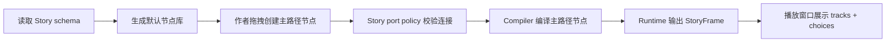

# Story Editor Node Simplification Design

## 0. 背景与术语

Story Editor 当前已经有通用 `EditorNodeGraphKit`、Story adapter、运行时播放窗口和多轨 `StoryFrame`。问题不再是节点图能否编辑，而是默认节点库仍暴露 `Parallel`、`Merge`、`Switch`、`Random`、条件族、标记族和辅助节点，作者会把“表现同时发生”误建成流程并行，且示例里仍有 `FlagCheck` / `Compare` / `Comment` / `Group` 等高成本概念。

本 feature 使用“作者主路径节点”表示默认可创建、可在样例中出现、可编译为运行时的 Story 节点。`Start` / `End` 是章节边界节点，不出现在节点库。`EditorNodeGraphKit` 继续保持通用画布，不理解剧情节点分组或语义。

## 1. 决策与约束

- 放置位置：节点语义属于 Story authoring/schema/compiler 层；通用 `EditorNodeGraphKit` 不新增任何 Story 分组、命令或连接规则。
- 主路径保留：`Dialogue`、`Narration`、`PlayVideo`、`ShowImage`、`PlayAudio`、`Wait`、`Choice`、`JumpChapter`、`MiniGame`、`EmitEvent`、`Start`、`End`。
- 主路径移除或隐藏：`Parallel`、`Merge`、`Switch`、`Random`、`Sequence`、`Branch`、`Condition`、`FlagCheck`、`Compare`、`And`、`Or`、`Not`、`Once`、`Cooldown`、`SetFlag`、`ClearFlag`、`Reroute`、`Comment`、`Group`、`PortalIn`、`PortalOut`、`Bookmark`、`Todo`、`DebugLog`。
- 多轨表达：视频 + 选项、图片 + 音频 + 选项、旁白 + 音效 + 选项不靠 `Parallel/Merge`，而靠线性内容节点被 runtime 合成同一 `StoryFrame`。
- 资源字段继续保存 `Assets/...` 路径，不保存 guid；播放视频仍只由 Editor playback 的 AVPro 层处理。
- 复杂度档位：默认档位。该 feature 是编辑器/编译器语义收敛，不引入脚本语言、表达式编辑器或第三方 runtime。

明确不做：

- 不恢复旧版 `unit`、`payload`、Definition/Timeline/GraphView/CSV 兼容路径。
- 不把条件编辑器、变量黑板、flag 系统或脚本 VM 塞回默认节点库。
- 不在 runtime 播放视频、图片或音频。
- 不修改通用 NodeGraph 的业务边界。
- 不承诺兼容已经手工创建的旧复杂节点；旧节点应在校验/编译时被明确提示为不支持。

## 2. 设计

### 2.1 名词层

现状：

- `NodeKind` 定义了流程、内容、交互、条件、辅助等大量节点，见 `Assets/GameDeveloperKit/Runtime/Story/AuthoringSchema/NodeKind.cs`。
- `NodeSchemaRegistry.RegisterDefaults()` 注册全部节点；`StoryEditorGraphAdapter.BuildTemplates()` 与 `StoryEditorWindow.ShowCreateNodeMenuAtCanvasCenter()` 遍历全部 schema，导致 palette 和创建菜单暴露过多节点。
- `StoryProgramCompiler.CompileNode()` 仍会编译条件族、redirect 类节点、标记命令和辅助转接节点。
- `StorySampleGraphFixture` / tests 仍把条件、标记、注释、分组作为 canonical 示例的一部分。

变化：

- 引入“默认作者节点集”作为 Story 的唯一可创建节点来源；palette 和工具栏创建菜单只显示默认作者节点集。
- `NodeSchemaRegistry` 默认注册主路径节点；被移除的节点不再作为正常 schema 暴露。若实现为了编译期过渡保留 enum 值，也必须让 schema/template/示例/新建入口不再出现它们。
- `StoryProgramCompiler` 对非主路径节点给出明确中文/可定位错误，或在完全删除 enum 后自然无法创建这些节点；不再把 `Parallel/Merge/Switch/Random/Condition/Flag` 当可运行主路径。
- 示例剧情图改为只使用主路径节点，并覆盖多轨组合：视频 + 选项、图片 + 音频 + 选项、旁白 + 音效 + 选项、对话 + 选项。

节点集示例：

```text
边界：Start, End
内容：Dialogue, Narration
媒体：PlayVideo, ShowImage, PlayAudio
流程：Wait, JumpChapter
交互：Choice, MiniGame
扩展：EmitEvent
```

### 2.2 编排层



现状：

- 创建入口直接遍历所有 `NodeSchemaRegistry.Schemas`。
- 端口策略仍按大类处理辅助/条件等节点。
- 编译器把条件和 redirect 节点编译成 `Branch` 或跳转式 step，掩盖了这些节点在当前 runtime 下语义不完整的问题。
- 样例 smoke 能通过，但样例本身会强化旧复杂节点是推荐用法。

变化：

- 创建入口统一走 Story adapter 的默认模板集合；工具栏菜单、右键/Space/palette 拖入都得到同一套节点。
- 连接规则只维护主路径端口语义：Start 无输入，End 无输出，文本 completed 可直连普通节点或多连 Choice，Choice.selected 单连目标，命令/等待/跳转按 schema 输出。
- 编译器主路径只接受默认作者节点；遇到移除节点返回定位错误，例如“该节点已退出 Story 默认作者路径，请改用线性内容节点和多轨帧表达”。
- 示例和自动测试改为验证新节点库没有高成本节点，并用多轨 runtime 行为证明不需要 `Parallel/Merge`。

### 2.3 挂载点

- Story node schema：删除或隐藏高成本节点后，节点库和字段 UI 的可见能力发生变化。
- Story adapter/window 创建入口：统一以默认作者节点集生成模板和菜单。
- Story compiler：拒绝旧复杂节点，保证 runtime 不继续接受伪并行、复杂条件和辅助运行节点。
- Canonical sample graph：改为新作者主路径的示例，作为后续验收基准。
- Tests/validation：增加节点库、样例和编译拒绝场景，防止旧节点回流。

### 2.4 推进策略

1. 先建立默认作者节点集和创建入口过滤，退出信号是 palette/menu 不再出现移除节点。
2. 收紧 schema/端口策略/诊断文案，退出信号是主路径节点端口仍可正常连接，旧节点不会被当作合法运行节点。
3. 收紧 compiler 主路径，退出信号是默认节点可编译，旧复杂节点会产生明确定位错误。
4. 重做 canonical sample，退出信号是样例只包含主路径节点且覆盖多轨组合。
5. 更新 tests 和 CodeStable 文档，退出信号是构建/测试通过，roadmap 能据此进入 acceptance。

### 2.5 结构健康度与微重构

compound/convention 检索结论：当前相关长期约束已在 architecture 中记录，核心是 `EditorNodeGraphKit` 通用边界、Story port policy 边界、Story runtime/editor 隔离边界，没有发现要求新目录组织的额外 convention。

文件级评估：

- `StoryEditorGraphAdapter.cs` 已同时承载 adapter、port policy 和 diagnostics，偏胖；但本 feature 的核心不是拆文件。考虑到 Unity 生成 `.csproj` 对新增 `.cs` 文件可能不能立即纳入命令行 build，本次不把拆 partial 文件作为前置。
- `StoryProgramCompiler.cs` 也偏胖，并已有 partial 文件；本 feature 可优先改现有编译路径和已有 partial，不为结构美化扩大范围。
- `NodeSchemaRegistry.cs` 注册逻辑集中但可接受，节点精简本身就在这个职责内。

目录级评估：

- Story authoring schema、compiler、StoryEditor 目录位置与现有架构一致；不做目录重组。

结论：本次不做微重构。原因是当前目标是语义收敛，且新增文件可能受 Unity `.csproj` 刷新限制影响验证可靠性。超出范围的观察：后续可以单独走 refactor，把 `StoryEditorGraphAdapter` 中的 port policy/diagnostics 拆出独立文件。

## 3. 验收契约

- 输入：打开 Story Editor 节点库或创建菜单。期望：只显示主路径节点；不显示并行、合流、多路分支、随机、条件、标记、辅助节点。
- 输入：创建 `Dialogue/Narration -> 多个 Choice -> 各自目标`。期望：连接合法，编译后生成 runtime choices，播放窗口显示选项。
- 输入：创建 `PlayVideo -> Dialogue/Narration -> Choice` 或 `ShowImage -> PlayAudio -> Narration -> Choice`。期望：运行时同一 frame 可包含媒体/音频/文本/选项，不需要 Parallel/Merge。
- 输入：旧资源中存在被移除节点。期望：校验或编译给出定位错误，不静默编译成不清晰流程。
- 输入：canonical sample graph。期望：不包含移除节点，资源字段仍是 `Assets/...` 路径，runtime smoke 仍可走完整流程。
- 反向核对：Runtime Story 目录不引用 Editor graph、UnityEditor、AssetDatabase、AVProVideo 或具体媒体类型；NodeGraph kit 不引用 Story/NodeKind。

## 4. 接口契约

默认作者节点集需要有一个可 grep 的单一来源，供 adapter/menu/tests 使用：

```csharp
IsDefaultAuthoringNode(NodeKind kind) -> bool
```

节点创建入口必须共享这套判断。禁止在 palette、右键菜单、工具栏菜单各自维护一份不同过滤逻辑。

旧节点处理契约：

- 新建入口不可创建。
- 示例不可使用。
- 编译不可静默接受。
- 错误必须至少定位到 `story/chapter/node`。

多轨 authoring 契约：

```text
媒体节点 -> 文本节点 -> Choice item...
```

表示同一表现帧的组合链路。Runtime frame builder 负责把可连续消费的非阻塞轨道和 choice gate 聚合到当前 `StoryFrame`，作者不需要显式合流。

## 5. 卸载方式

如果需要撤销该 feature，恢复点只有 Story 层：恢复旧 schema/template 过滤、compiler 对旧节点的接受、sample fixture 中旧节点覆盖和对应 tests。通用 NodeGraph 不应有任何需要撤销的业务逻辑。
