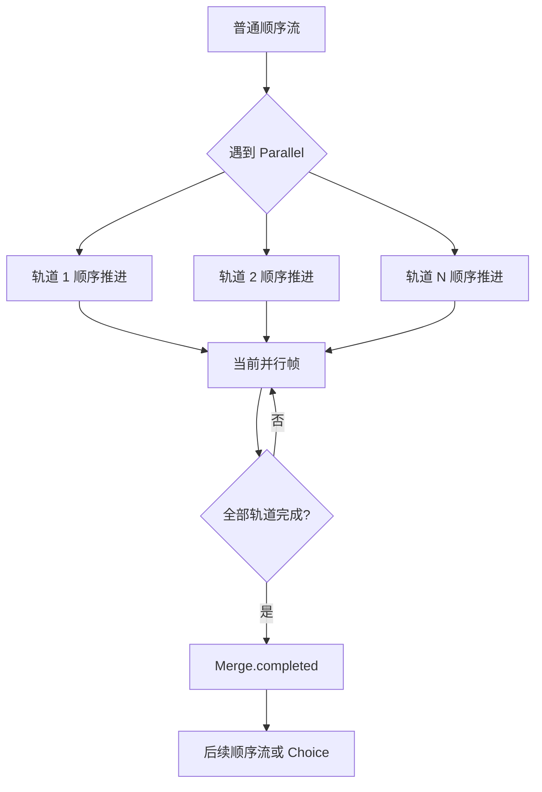

# Story Explicit Parallel Merge Design

## 0. 背景与术语

当前 Story 已经有 `StoryFrame` 多轨输出，但 `StoryRunner.BuildFrame()` 会把连续的 `Line/Command/Wait/Choice` 顺序步骤自动聚合成一个 frame。这个规则能让“视频 + 选项”同屏出现，但会破坏节点图直觉：`ShowImage -> PlayAudio -> Narration -> Choice` 在图上明显是顺序流，不应该被 runtime 偷偷解释为并行表现。

本 feature 把“顺序流”和“并行表现”拆开：

- 顺序流：普通连线永远表示先后执行。
- 并行块：`Parallel -> 多个轨道 -> Merge` 才表示多条表现轨道同时进入同一运行帧。
- 合流策略：首版只做“全部轨道完成后继续”，不做任意轨道完成、竞速或取消其它轨道。
- 轨道闸口：轨道内的阻塞 `Command`、`Wait` 会阻塞该轨道；普通文本通过 `Continue()` 推进到 `Merge`；`Merge` 等全部轨道完成。
- 真实分支：`Choice` 是控制流分支，必须放在 `Merge` 之后；首版默认作者路径禁止在 `Parallel` 轨道内放 `Choice`。
- 表现并行：runtime 仍不播放媒体，只把多个轨道当前可观察输出合成 `StoryFrame.Tracks`。

需要正面修正的既有文档假设：

- `2026-06-21-story-runtime-multitrack-frame` 曾把“连续表现步骤聚合”为实现策略。
- `2026-06-21-story-editor-node-simplification` 曾把 `PlayVideo -> Text -> Choice` 作为同帧组合契约。
- 本 feature 通过显式 `Parallel/Merge` 取代这两个假设；普通线性链路回归顺序语义。

## 1. 决策与约束

做什么：

- 恢复 `Parallel` / `Merge` 为 Story 作者主路径节点，但这次必须有完整 runtime 语义。
- 修改 runtime 解析规则：普通顺序节点不再自动多轨聚合。
- 让 compiler 把 authoring graph 中的 `Parallel/Merge` 编译成可运行的并行块。
- 让播放窗口可以显示并行块中多个分支的 `StoryFrame` 输出。

为谁：

- 剧情作者：图里能看懂“哪里是顺序，哪里是并行”。
- 运行时表现层：能同时看到视频/图片/音频/文本；选项在合流后作为真实分支显示。
- Story Editor：端口和诊断能明确提示并行/合流约束。

成功标准：

- `ShowImage -> PlayAudio -> Narration -> Choice` 运行时按顺序输出四个停点或帧，不自动合并。
- `Parallel` 的多个轨道在同一 `StoryFrame` 中输出 tracks。
- `Merge` 等所有轨道完成后才继续到后续节点。
- 视频、音频、对白可以同时显示/播放；`Choice` 接在 `Merge.completed` 后作为后续真实分支。
- `Parallel` 没有对应 `Merge`、轨道未接入 `Merge`、轨道内出现 `Choice`、`Merge` 来源不属于同一个 `Parallel` 时，图诊断和编译报告定位报错。
- `EditorNodeGraphKit` 仍不理解 Story 业务语义；规则只在 Story adapter/compiler/runtime 层。

明确不做：

- 不做通用 DAG 工作流引擎。
- 不做嵌套并行块。
- 不做“任意一个轨道完成就继续”“按权重选择轨道”“轨道互相取消”等高级合流策略。
- 不做跨章节并行；并行块必须在同一 chapter 内闭合。
- 不做 runtime 媒体播放、资源加载、UI 渲染或 AVProVideo 依赖。
- 不恢复 `Switch/Random/Sequence/Condition/Flag/Auxiliary` 为默认节点库。
- 不兼容旧的伪并行语义；旧 `Parallel/Merge` 若不满足新结构，按错误处理。

复杂度档位：

- `Robustness = L3`：并行块会影响 Story runtime 主状态机，必须覆盖选择、命令、等待、恢复、编译错误和播放窗口观察。
- `Compatibility = breaking-clean`：接受破坏式修正线性自动聚合语义。
- `Scope = one-level-parallel`：首版只做单层并行块，避免一次性引入递归 DAG 状态机。

## 2. 设计

### 2.1 名词层

现状：

- `NodeKind.Parallel` / `NodeKind.Merge` 已存在，`NodeSchemaRegistry` 也注册了 schema，但 `IsDefaultAuthoringNode()` 当前返回 false。
- `StoryStepKind` 没有并行/合流 step kind，runtime 只能按单一 `m_CurrentStepIndex` 线性推进。
- `StoryRunner.BuildFrame()` 会从当前 step 线性向后扫描，并把连续的 text/command/wait/choice 合成一个 frame。
- `StoryAuthoringEdge` 能表达一个输出端口到一个目标节点，但没有并行块 id、分支 id 或合流配对字段。
- `StoryProgramCompiler` 当前会拒绝非默认作者节点，因此 `Parallel/Merge` 无法编译。

变化：

新增运行时名词：

```csharp
public enum StoryStepKind
{
    Parallel,
    Merge,
    ...
}

public sealed class StoryParallelBranch
{
    public string BranchId { get; }
    public string Label { get; }
    public StoryTarget Entry { get; }
}

public enum StoryMergePolicy
{
    All = 0
}
```

扩展 `StoryStepData`：

```csharp
public sealed class StoryStepData
{
    public IReadOnlyList<StoryParallelBranch> Branches { get; }
    public StoryMergePolicy MergePolicy { get; }
    public string ParallelStepId { get; }
}
```

运行时分支状态示例：

```csharp
internal sealed class StoryParallelFrame
{
    public StoryStep ParallelStep { get; }
    public StoryStep MergeStep { get; }
    public IReadOnlyList<StoryBranchCursor> Branches { get; }
}

internal sealed class StoryBranchCursor
{
    public string BranchId { get; }
    public string ChapterId { get; }
    public string StepId { get; }
    public bool Completed { get; }
    public StoryFrame CurrentFrame { get; }
}
```

作者图节点：

- `Parallel`：一个输入端口，一个动态多输出端口集合；输出端口命名为 `branch_1`、`branch_2` 等，显示名可编辑为“视频轨”“文本轨”“音频轨”。
- `Merge`：多个输入来源，一个 `completed` 输出；参数 `policy=all`，首版固定不可改或仅显示为只读。
- `Parallel` / `Merge` 重新进入默认作者节点集，但仍由 Story schema/adapter 注册，不进入通用 NodeGraph。

### 2.2 编排层



现状：

- 单 runner 只有一个当前 step index。
- 普通线性链路可以被自动聚合成一个 frame。
- `Choice` gate、`Command` gate、`Wait` gate 都以当前 frame 为单位处理。

变化：

1. 顺序解析规则收紧。
   - `BuildFrame()` 不再向后扫多个普通顺序 step。
   - 当前 step 是 `Line/Command/Wait/Choice` 时，只输出当前 step 对应 frame。
   - `Choice` 仍可带 choices；由文本节点多连 Choice item 编译出的 synthetic choice step 仍按单 step 输出。

2. 并行块解析。
   - runner 遇到 `Parallel` step 时，创建一个并行运行上下文。
   - 每个 branch cursor 从对应 entry target 开始，在同一 chapter 内独立顺序推进。
   - 每个 branch 只推进到下一个可观察 frame、gate、Merge 或 End-like 完成状态。
   - runner 把所有未完成 branch 的当前输出合成为一个 `StoryFrame`。

3. 合流完成。
   - branch 到达同一个 `Merge` 时，该 branch 标记完成。
   - `MergePolicy.All` 下，全部 branch 完成后，主 runner 跳到 `Merge.completed` 的目标。
   - 如果某 branch 进入 `Choice`、`StoryEnd` 或跳章节，编译阶段直接拒绝；并行块首版不允许把真实控制分支、跨章节或剧情结束藏在轨道内。

4. gate 处理。
   - 默认作者路径下并行块内不产生 choices；`Choice` 接在 `Merge.completed` 后，以普通顺序帧处理。
   - `CompleteCommand(commandId,outcomeId)` 只推进包含该 command 的 branch。
   - `Evaluate(time)` 推进所有当前处于 wait gate 且等待时间已满足的 branch。
   - 没有 gate 的 branch 可自动推进到下一个 gate 或 Merge；没有 gate 但有可观察输出时是否需要 `Continue()`，沿用当前 frame 行为。

5. 播放窗口显示。
   - `StoryFrame.Tracks` 保持平铺，但每个 track 需要能显示 branch label。
   - 最小实现可以在 `StoryFrameTrack.Tags` 或新增 `BranchId/BranchLabel` 上承载来源分支；推荐新增显式字段，避免把结构信息塞进 tags。

流程约束：

- 并行块必须单入口、单合流。
- 首版禁止嵌套并行；compiler 发现 `Parallel` 轨道内还有 `Parallel` 报错。
- 首版禁止轨道跳出合流到并行块外其它节点；轨道末端必须到同一个 `Merge`。
- 首版禁止轨道内 `Choice`、`JumpChapter` 和 `StoryEnd`。
- 普通顺序链路不再自动产生多轨 frame。

### 2.3 挂载点

- Runtime program contract：新增 `Parallel/Merge` step 和 branch metadata；删除后 feature 无法运行。
- StoryRunner parallel context：实现多 branch cursor、gate 推进和合流策略；删除后只能回到单游标顺序推进。
- StoryProgramCompiler：把 authoring `Parallel/Merge` 转为 runtime 并行块，并校验块结构；删除后编辑器节点无法运行。
- StoryEditorPortPolicy / diagnostics：允许并校验 `Parallel/Merge` 连接规则；删除后作者无法得到正确图反馈。
- Playback window：显示 branch-aware frame；删除后无法验证“视频 + 选项”等并行运行效果。

### 2.4 推进策略

1. 运行时顺序语义修正
   - 退出信号：`ShowImage -> PlayAudio -> Narration -> Choice` 不再输出一个多轨 frame，而是按顺序停在每个可观察 step。

2. 并行 program contract
   - 退出信号：`StoryStepKind.Parallel/Merge`、branch metadata 和 validation 能表达一个两分支并行块。

3. Runner 并行上下文
   - 退出信号：多个轨道都能推进到当前 frame，并在同一 `StoryFrame` 输出 tracks。

4. Gate 与合流推进
   - 退出信号：command/wait 只推进所在轨道，全部轨道到达 `Merge` 后继续后续顺序节点或选项。

5. Compiler 与端口策略
   - 退出信号：作者图中的 `Parallel -> 轨道 -> Merge` 可编译；非法结构有 graph diagnostic 和 compiler error。

6. 示例、播放窗口与测试
   - 退出信号：canonical sample 包含至少一个“视频 + 音频 + 对白轨道”并行块，Merge 后接选项；播放窗口可观察；runtime/editor builds 通过。

### 2.5 结构健康度与微重构

compound convention 检索结论：`2026-06-20-explore-story-system-completeness` 已指出旧 `Branch/Sequence/Parallel/Merge/Random` flow 节点缺少清晰 runtime 语义；这次设计正面补齐 `Parallel/Merge`，但不恢复其它 flow 节点。

文件级评估：

- `StoryRunner.cs` 当前同时承担主状态机、frame 构建、choice/command/wait 推进、snapshot、history、表达式求值，继续把并行上下文塞进同文件会过载。
- `StoryStep.cs` / `StoryFrame.cs` 还能承载少量 contract 扩展，但并行 branch/context 类型建议独立文件。
- `StoryProgramCompiler.cs` 已是 partial，可以新增或使用已有 partial 文件承载 parallel 编译和结构校验。
- `StoryEditorGraphAdapter.cs` 偏胖，但之前因 Unity `.csproj` 刷新限制没有拆；本 feature 的端口策略改动可先留在现有文件，后续单独 refactor。

目录级评估：

- Runtime Story 目录已有 `Program/` 和 `Runtime/` 分层；parallel contract 放 `Program/`，runner context 放 `Runtime/`，符合现有结构。
- Editor compiler 已有 `Compiler/` partial 结构，新增 parallel 编译文件符合现状。

结论：做文件级微重构，作为实现第一步。

- 新增 `Runtime/Story/Program/StoryParallel.cs` 放 `StoryParallelBranch`、`StoryMergePolicy`。
- 新增 `Runtime/Story/Runtime/StoryRunner.Parallel.cs` 放 branch cursor 和并行 frame 推进 helper。
- 新增或使用 `Editor/StoryEditor/Compiler/StoryProgramCompiler.Parallel.cs` 放 authoring 并行块编译/校验。

验证方式：每步保持 runtime/editor build 绿灯；若 Unity 生成 `.csproj` 未包含新增文件，则先在 Unity 里刷新或临时落到已有 partial，不能手改生成 csproj。

## 3. 验收契约

- 输入：普通顺序链 `ShowImage -> PlayAudio -> Narration -> Choice`。期望：运行时按顺序输出，不自动合成一个多轨 frame。
- 输入：`Parallel` 三轨，轨道 A 为 `PlayVideo(wait=true) -> Merge`，轨道 B 为 `PlayAudio -> Merge`，轨道 C 为 `Narration -> Merge`，然后 `Merge.completed -> Choice`。期望：播放窗口同一 frame 显示视频命令、音频命令和文本；全部轨道完成后才显示选项。
- 输入：`Parallel` 三轨，图片、音频、文本分别进入同一个 `Merge`，`Merge` 后接选项。期望：同一 frame 可显示三个轨道输出，所有轨道完成后继续到选项。
- 输入：轨道没连到 `Merge`。期望：图上 diagnostic 和 compiler report 定位到 parallel/branch。
- 输入：轨道内出现 `Choice`。期望：图上 diagnostic 和 compiler report 提示选项必须接在 `Merge` 之后。
- 输入：`Merge` 收到来自不同 `Parallel` 的分支。期望：编译失败并定位到 merge。
- 输入：并行块内嵌套 `Parallel`。期望：首版编译失败并提示不支持嵌套并行。
- 输入：并行轨道内 `JumpChapter` 或 StoryEnd。期望：首版编译失败并提示并行块必须在同一章节内合流。
- 反向核对：`EditorNodeGraphKit` 不引用 Story/NodeKind；Runtime Story 不引用 UnityEditor、AssetDatabase、UI Toolkit、AVProVideo 或具体媒体类型。
- 反向核对：`Switch/Random/Sequence/Condition/Flag/Auxiliary` 不因本 feature 重新进入默认节点库。

## 4. 接口契约

作者图：

```text
Parallel
  branch_video -> PlayVideo(wait=true) -> Merge
  branch_audio -> PlayAudio -> Merge
  branch_dialogue -> Narration -> Merge
Merge.completed -> Choice
Choice.selected -> Next
```

运行时输出：

```csharp
StoryFrame.Tracks:
  [branch_video] Command(play_video)
  [branch_audio] Command(play_audio)
  [branch_dialogue] Text(narration)
```

建议扩展：

```csharp
public sealed class StoryFrameTrack
{
    public string BranchId { get; }
    public string BranchLabel { get; }
}

public sealed class StoryChoice
{
    public string BranchId { get; }
}
```

如果不想改 `StoryChoice` 构造面，可在 runner 内维护 `choiceId -> branchId` 映射，但播放窗口仍需要能展示 choice 所属分支。

编译契约：

- `Parallel` 输出端口生成 `StoryParallelBranch`。
- 每个 branch entry 必须能沿控制流到达同一个 `Merge`。
- `Merge` 必须只属于一个 `Parallel`。
- `Merge.completed` 必须有一个后续目标，或显式连到 End。

## 5. 卸载方式

撤销该 feature 时，需要移除 `Parallel/Merge` 默认作者节点、compiler 对并行块的接受、runtime 并行上下文、播放窗口 branch 展示和相关测试。普通顺序流仍应保留“不会自动多轨聚合”的修正；如果要恢复旧自动聚合，需要单独重新设计并说明为什么线性连线可以表示并行表现。
