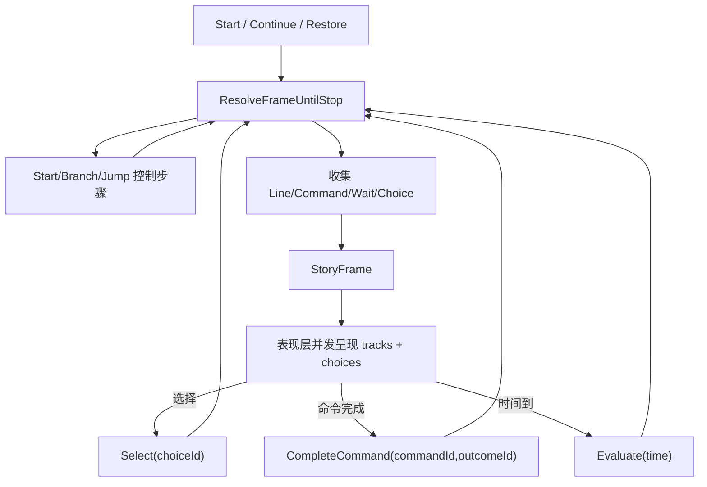

# Story Runtime Multitrack Frame Design

## 0. 术语约定

| 术语 | 定义 | 防冲突结论 |
|---|---|---|
| StoryFrame | 运行时一次可观察剧情帧 | 替代“一个停点只能有一个 Line/Command/Choice 输出”的主契约 |
| Frame track | StoryFrame 内的一条表现轨，如文本、命令、等待 | 只描述表现层要做什么，不播放资源 |
| Text track | 旁白/对白轨 | 由现有 Line step 派生，保留 speaker/textKey/tags |
| Command track | 命令轨，包括视频、图片、音频、事件和小游戏 | 复用 StoryCommand，不保存 Unity object，不直接执行播放 |
| Choice gate | 帧内选项闸口 | 选项可以和视频/图片/音频同帧出现，通过 Select(choiceId) 推进 |
| Command gate | 帧内命令闸口 | 仅阻塞型命令或带 outcome 命令需要 CompleteCommand 推进 |
| Frame output API | Story runtime 对外返回 StoryFrame 的推进 API | 替代旧 StoryOutput，不做兼容投影 |
| 表现层并发 | UI 同时展示多个 track | 不是 runtime 多线程，也不是作者图 Parallel/Merge |

## 1. 决策与约束

### 需求摘要

做什么：破坏式重构 `StoryProgram` / `StoryRunner` 的可观察输出。当前 runtime 一次只能返回一个 `StoryOutputKind.Line`、`ChoicesReady`、`Command` 或 `Wait`，导致“播放视频同时显示选项”“图片 + 音频 + 选项”“旁白 + 音效 + 选项”“对话 + 选项”必须用 Parallel/Merge 或拆成多个顺序步骤伪造。新模型要让同一个剧情帧能同时包含多个表现轨和选项，并由表现层并发呈现。

为谁：剧情编辑器作者、运行时表现层、Story Editor 播放窗口、后续节点库精简工作。

成功标准：

- runtime 暴露 `StoryFrame`，能同时携带 text、command、wait 和 choices。
- `StoryRunner.Start/Continue/Select/CompleteCommand/Evaluate/Restore` 的推进结果直接返回完整 frame，而不是旧 output。
- 一个 frame 中可以同时包含 `play_video` command track 和 choices；播放窗口/表现层能立即看到选项。
- 一个 frame 中可以同时包含 `show_image`、`play_audio`、text 和 choices。
- 选择仍通过 `Select(choiceId)` 推进；阻塞命令仍通过 `CompleteCommand(commandId, outcomeId)` 推进。
- 非阻塞 command track 进入 frame 后不强制阻断选项显示。
- `StoryModule` 不播放视频/音频、不加载资源、不渲染 UI，只产出数据。
- Runtime 目录不引用 EditorNodeGraph、UI Toolkit、AssetDatabase、VideoClip 或 Editor 播放窗口类型。

明确不做：

- 不实现通用并行 DAG 执行器，不恢复 Parallel/Merge 作为作者主路径。
- 不在 runtime 内播放视频、图片、音频、字幕、按钮、Timeline 或 Cinemachine。
- 不把 Unity object、guid 解析器、AssetDatabase 或 UI Toolkit 类型放入 `StoryProgram`。
- 不在本 feature 精简 Story Editor 节点库；节点精简由后续 `story-editor-node-simplification` 承接。
- 不做完整脚本语言、Yarn Spinner/Ink runtime 或复杂时间轴编辑器。
- 不保留 `StoryOutput` 兼容投影；播放窗口、测试和调用侧随本 feature 一次性迁移到 `StoryFrame`。

### 复杂度档位

- `Robustness = L3`：这是 Story runtime 主推进契约，必须覆盖选择、命令、等待、恢复和错误路径。
- `Compatibility = breaking-clean`：接受破坏式重构，优先消除旧输出模型和兼容层。
- `Architecture = runtime-contract-first`：先固化 runtime 数据模型，再让编辑器根据它精简节点。
- `Localization = data-only`：runtime 不做中文 UI；错误消息保持当前 `GameException` 风格。

### 关键决策

1. `StoryFrame` 成为完整运行时输出。
   - 采用：`StoryRunner.CurrentFrame` / `StoryModule.CurrentFrame` 暴露完整帧。
   - 删除：`StoryOutput CurrentOutput` 兼容投影和旧 output 主路径。
   - 原因：旧 output 只能表达一种 kind，无法承载“视频 + 选项”。

2. 多轨是“表现组合”，不是执行并行。
   - frame 中多个 track 同时交给表现层。
   - runtime 仍是单 runner、单当前章节、单当前推进位置。
   - Parallel/Merge 不再承担视频和选项同显语义。

3. 选择和命令闸口分离。
   - frame 可同时 `WaitsForChoice == true` 和包含 command tracks。
   - 非阻塞命令不阻止选择；阻塞命令只在没有 choice gate 时阻止自动推进。
   - 带 outcome 的命令仍通过 `CompleteCommand` 决定后续目标。

4. 编译器先支持“连续表现步骤聚合”。
   - 不要求首版改 authoring 图为复杂容器节点。
   - 规则：连续的 Line / Command / Wait / Choice 可以聚合为一个 frame；Branch / Jump / End 仍是控制步骤。
   - 后续编辑器节点精简可把“帧”作为作者语义，用更直观的节点组合导出同样 program。

5. 命令分类不进通用 NodeGraph。
   - Story-specific 命令仍由 Story schema/compiler 定义。
   - runtime frame 只读取 `StoryCommand` 和 command schema，不让 `EditorNodeGraphKit` 参与业务判断。

## 2. 名词与编排

### 2.1 名词层

#### 现状

- `StoryStepKind` 当前包含 `Start`、`Line`、`Choice`、`Command`、`Branch`、`Jump`、`Wait`、`End`。`StoryStepData` 用 `TextKey/Speaker/Command/Choices/Condition/Target/WaitSeconds/Tags` 承载单步数据。
- `StoryOutputKind` 当前是 `None/Line/ChoicesReady/Command/Wait/Completed`，`StoryOutput` 一次只携带一种输出；该旧模型将在本 feature 中从主运行时 API 移除。
- `StoryRunner.ResolveUntilStop()` 遇到第一个可见 step 就返回：Line 进入 `AwaitingContinue`，Choice 进入 `AwaitingChoice`，Command 按 wait/outcome 进入 `AwaitingCommand` 或 `AwaitingContinue`，Wait 进入 `AwaitingTime`。
- `StoryProgramCompiler` 当前把媒体节点编译成 `StoryStepKind.Command`，`PlayVideo` 和 `MiniGame` 默认 `waitForCompletion = true`；文本连多个 Choice item 时会生成 synthetic `{lineNodeId}_choices` step。
- 播放窗口已经真实调用 `StoryModule`，但只能渲染当前 `StoryOutput`，所以用户自连的“媒体 + 选项”如果被编译成顺序输出，就看不到同一帧。

#### 变化

新增 runtime contract：

```csharp
public enum StoryFrameTrackKind
{
    Text = 0,
    Command = 1,
    Wait = 2
}

public sealed class StoryFrameTrack
{
    public StoryFrameTrackKind Kind { get; }
    public StoryStep Step { get; }
    public string TextKey { get; }
    public string Speaker { get; }
    public StoryCommand Command { get; }
    public double WaitSeconds { get; }
    public IReadOnlyList<string> Tags { get; }
}

public sealed class StoryFrame
{
    public StoryProgram Program { get; }
    public StoryChapter Chapter { get; }
    public StoryStep AnchorStep { get; }
    public IReadOnlyList<StoryFrameTrack> Tracks { get; }
    public IReadOnlyList<StoryChoice> Choices { get; }
    public bool WaitsForChoice { get; }
    public bool WaitsForCommand { get; }
    public bool WaitsForTime { get; }
    public bool IsCompleted { get; }
}
```

推进 API：

```csharp
public sealed class StoryRunner
{
    public StoryFrame CurrentFrame { get; }
    public StoryFrame Start(string chapterId = null);
    public StoryFrame Continue();
    public StoryFrame Select(string choiceId);
    public StoryFrame CompleteCommand(string commandId, string outcomeId);
    public StoryFrame Evaluate(double time);
    public StoryFrame Restore(StorySnapshot snapshot);
}

public sealed partial class StoryModule
{
    public StoryFrame CurrentFrame => CurrentRunner?.CurrentFrame;
    public StoryFrame Continue();
    public StoryFrame Select(string choiceId);
    public StoryFrame CompleteCommand(string commandId, string outcomeId);
    public StoryFrame Evaluate(double time);
}
```

旧 `StoryOutput` / `StoryOutputKind` 不再作为 runtime 主输出契约。播放窗口历史、UI 分支和测试断言改为读取 `StoryFrame.IsCompleted`、`Tracks`、`Choices` 与 gate flags。

### 2.2 编排层



主流程：

1. `Start` / `Continue` / `Restore` 调用新的 `ResolveFrameUntilStop()`。
2. runner 跳过 `Start`，执行 `Branch` / `Jump` 等控制步骤，直到遇到可见步骤或完成。
3. frame builder 从当前位置连续收集表现步骤：
   - `Line` 变成 text track。
   - `Command` 变成 command track。
   - `Wait` 变成 wait track。
   - `Choice` 变成 frame choices。
4. 遇到 `Choice` 后 frame 停止收集，状态进入 choice gate。
5. 遇到阻塞 command 且没有 choice gate 时，状态进入 command gate。
6. 遇到 wait 且没有 choice/command gate 时，状态进入 time gate。
7. 非阻塞 command 不阻止继续收集后续 Line/Choice/Wait；它只是同帧表现轨。
8. 表现层读取 `CurrentFrame.Tracks` 并同时渲染媒体/音频/文本，读取 `Choices` 渲染按钮。
9. 玩家选择调用 `Select(choiceId)`，runner 按 choice target 跳转。
10. 阻塞命令完成调用 `CompleteCommand(commandId, outcomeId)`，runner 按 outcome target 或顺序推进。
11. 等待完成调用 `Evaluate(time)` 或 `Continue()`，runner 继续解析下一帧。

流程级约束：

- 错误语义：choice 无可用项、branch/jump 缺 target、command id 不匹配等错误沿用 `GameException`，消息中包含 story/chapter/step。
- 顺序语义：frame 内 track 保持编译后 step 顺序，表现层决定实际播放排布。
- 闸口优先级：choice gate 优先于 command/time gate；用户选择后，未阻塞的表现 track 是否继续播放由表现层处理，runtime 只推进剧情状态。
- 命令完成：只有当前 frame 中存在且需要完成的 command 才能 `CompleteCommand`；否则抛错。
- 快照语义：snapshot 仍保存当前 chapter/step/time/history/completed；恢复后重新解析出当前 frame，不序列化 Editor UI 状态。
- 可观测点：CurrentFrame、Tracks、Choices、Wait flags、History。

### 2.3 挂载点

1. `StoryFrame` / `StoryFrameTrack` runtime contract：删除后多轨输出能力消失。
2. `StoryRunner.CurrentFrame` 和 frame 解析流程：删除后 runner 又只能输出单步。
3. `StoryModule.CurrentFrame` 和推进 API 返回 frame 的桥接：删除后外部表现层拿不到完整帧。
4. 播放窗口的 frame renderer：删除后 Editor 内无法观察同帧 tracks + choices。
5. Story compiler 的帧聚合规则：删除后 authoring 图仍无法表达“媒体 + 选项”同帧。

### 2.4 推进策略

1. Runtime 名词骨架：新增 `StoryFrame`、`StoryFrameTrack` 和创建 helper。
   退出信号：runtime 编译通过，能手动构造 text/command/wait/choice frame。
2. Runner frame 解析：把 `ResolveUntilStop()` 升级为 frame builder，并让推进 API 直接返回 `StoryFrame`。
   退出信号：单步 Line/Choice/Command/Wait/Completed 场景能通过 `CurrentFrame` 表达等价信息，旧 `CurrentOutput` 调用侧已迁移。
3. 多轨聚合语义：支持连续 presentation steps 合并为一个 frame，choice 与非阻塞/表现命令同帧可见。
   退出信号：构造 `PlayVideo -> Choice` 或 `ShowImage -> PlayAudio -> Narration -> Choice` program 时，一个 frame 同时含 command/text/choices。
4. 命令/选择/等待闸口：收紧 `Select`、`CompleteCommand`、`Evaluate` 对当前 frame 的合法性和推进规则。
   退出信号：非法 choice/command 抛错，合法 choice/outcome/time 推进到正确目标。
5. StoryModule 桥接与播放窗口读取：让 Editor 播放窗口只渲染 `CurrentFrame`。
   退出信号：播放窗口能同屏显示视频命令、文本和选项。
6. 测试与文档收口：补 runtime/editor tests、更新 requirement/architecture 和播放窗口验收说明。
   退出信号：runtime/editor build 通过，runtime 隔离 grep 通过，示例覆盖至少两个多轨组合。

### 2.5 结构健康度与微重构

- compound convention 检索：未命中 StoryFrame 或多轨 runtime 的既有 decision/convention。
- 文件级 - `StoryRunner.cs`：约 3 万字节，已经承担状态机、表达式求值、变量、历史、快照和输出解析。继续在同文件追加 frame builder 会明显增加职责混杂。
- 文件级 - `StoryOutput.cs`：约 6 千字节，当前只表达旧单输出；把 frame 类型继续塞进同文件会让新旧契约边界不清。
- 目录级 - `Assets/GameDeveloperKit/Runtime/Story/Runtime/`：当前平铺 9 个文件，尚可接受；新增 `StoryFrame.cs` 比塞进旧文件更清楚。

结论：做文件级微重构，但只拆运行时解析职责，不改外部行为。建议在实现第一步先把 frame 解析相关 helper 放到 `StoryRunner.Frame.cs` partial 文件，`StoryFrame` 独立成 `StoryFrame.cs`；保留原 `StoryRunner.cs` 的公开 API 和表达式/变量逻辑。验证靠 `dotnet build GameDeveloperKit.Runtime.csproj --no-restore` 和现有 runtime/editor tests。

超出范围的观察：旧 `Definition/Execution` 目录仍保留 volume/unit/payload/action/interaction 等历史模型，和 v4 `Program/Runtime` 模型并存，确实增加理解成本；但这属于更大的 Story runtime cleanup，不作为本 feature 前置。

## 3. 验收契约

| 场景 | 输入 / 触发 | 期望可观察结果 |
|---|---|---|
| N1 单文本帧 | program 为 Start -> Line -> End | `CurrentFrame.Tracks` 有 1 条 text track，track kind 为 Text |
| N2 单选项帧 | program 为 Start -> Choice -> End | `CurrentFrame.Choices` 有可用选项；`WaitsForChoice == true` |
| N3 视频 + 选项 | program 为 Start -> PlayVideo(command) -> Choice -> End | 同一个 frame 同时包含 command track 和 choices，播放窗口可立即显示选项 |
| N4 图片 + 音频 + 旁白 + 选项 | program 为 ShowImage -> PlayAudio -> Narration -> Choice | 同一个 frame tracks 顺序为 command、command、text，并包含 choices |
| N5 非阻塞命令 | command `WaitForCompletion=false` 且无 outcome，后接 Choice | command track 不阻止 choices 进入同一 frame |
| N6 阻塞命令 | command `WaitForCompletion=true` 且无 Choice | frame `WaitsForCommand == true`；未完成时 Continue 不跳过该命令 |
| N7 命令 outcome | command 有 outcome ports | `CompleteCommand(commandId,outcomeId)` 跳到对应 target |
| N8 选择推进 | frame 有 choices，点击某 choice | `Select(choiceId)` 按 choice target 推进到下一 frame |
| N9 等待推进 | frame 只有 wait track | `Evaluate(waitSeconds)` 或等价完成等待后进入下一 frame |
| N10 完成帧 | 走到 End | `CurrentFrame.IsCompleted == true`，tracks 和 choices 为空 |
| B1 空选项 | Choice step 全部条件不可用 | runner 抛包含 story/chapter/step 的 `GameException` |
| B2 非当前命令完成 | `CompleteCommand` 传入不在当前 frame 的 commandId | runner 抛命令不匹配错误 |
| B3 快照恢复 | 在多轨 frame 上 CreateSnapshot 后 Restore | 恢复后 `CurrentFrame` 重新解析出同一 chapter/step 的 tracks/choices |
| E1 范围守护 | grep runtime Story 目录 | 不出现 EditorNodeGraph、UnityEditor、AssetDatabase、ObjectField、VideoClip、StoryEditorPlaybackWindow 引用 |
| E2 范围守护 | 编译 StoryProgram | 不保存 Unity object；资源仍是 `StoryValue` 字符串/数字/布尔等基础值 |
| E3 范围守护 | Story Editor 节点库 | 本 feature 不移除/隐藏节点；节点精简必须留给下一项 roadmap |

## 4. 落档与后续

- `roadmap/story-editor-hardening/items.yaml`：本 design 启动后把 `story-runtime-multitrack-frame` 改为 `in-progress` 并写入 feature 目录。
- `requirements/story-module.md`：验收通过后追加多轨帧实现进展；能力仍可保持 draft，直到 Story runtime cleanup 和 editor node simplification 完成。
- `architecture/ARCHITECTURE.md`：验收通过后补充 `StoryFrame` 现状、旧 `StoryOutput` 主路径移除、runtime 不播放资源的边界。
- 后续 `story-editor-node-simplification`：基于 `StoryFrame` 把作者主路径改成内容/媒体/音频/选项组合，默认隐藏 Parallel/Merge、随机、复杂条件和辅助节点。
