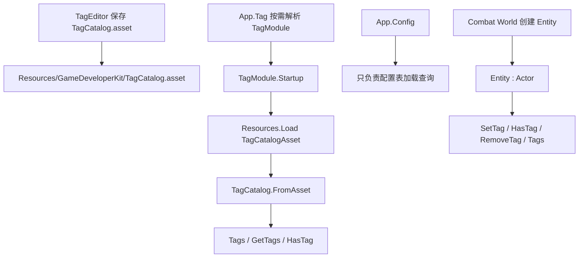

# tag-module-actor design

## 0. 术语约定

| 术语 | 定义 | 防冲突结论 |
|---|---|---|
| TagCatalog | 项目标签目录，只读描述有哪些合法标签组和标签项 | 现有 `Assets/GameDeveloperKit/Runtime/Config/Tags/TagCatalog.cs` 已有同名类型；本 feature 复用语义并迁出 Config 归属，不新造平行目录模型 |
| TagModule | 运行时模块入口，负责加载和查询 `TagCatalog` | 代码中当前没有 `TagModule`；新增为独立 `IGameModule`，不和 Timer handle 的单个 `Tag` 字符串混用 |
| Actor | Core 中可被打运行时标签的对象基类 | 代码中当前没有 `Actor`；它不是“所有对象的祖先”，只表示需要对象级标签状态的业务对象 |
| actor tag | 挂在某个 `Actor` 实例上的运行时标签 key | 区分于 `TagCatalog` 的“标签定义目录”；actor tag 可以用目录校验，但存储在对象实例上 |
| Entity | Combat 子系统中的战斗实体句柄 | 现状为 `Assets/GameDeveloperKit/Runtime/Combat/Entity.cs` 的 `sealed class Entity`；本 feature 只让它继承 Actor，不改变 Massive 实体身份语义 |

术语 grep 结果：Runtime 中已有 Config/TagCatalog、Timer handle `Tag`、Story/Debug 的只读 `Tags` payload，以及 Combat `Entity`；没有已有 `Actor` / `TagModule` 类型。设计需要避免把 payload tags、Timer tag 和 Actor 标签混成同一层概念。

## 1. 决策与约束

### 需求摘要

目标：把项目级标签目录从 `ConfigModule` 的 partial API 中独立出来，形成 `TagModule`；在 Core 新增 `Actor`，支持设置 tag、获取 tag、`HasTag`、`RemoveTag`、`Tags { get; }`；让 Combat `Entity` 继承 `Actor`。

成功标准：
- 业务可通过 `App.Tag` 查询项目标签目录，不再需要为标签目录启动 `App.Config`。
- `ConfigModule` 的配置表职责不再包含标签目录加载和查询。
- `Actor` 提供对象级标签状态，`Entity` 可直接使用这些 API。
- 没有把所有 class 强制继承 `Actor`；只有需要对象级标签能力的类型接入。

明确不做：
- 不改 `Assets/Resources/GameDeveloperKit/TagCatalog.asset` 的资源路径和编辑器保存位置。
- 不把 Unity `GameObject.tag`、AssetDatabase label、Story/Debug payload tags 统一改成 Actor tag。
- 不给 `Actor` 添加生命周期、组件系统、事件、世界归属、持久化或网络同步。
- 不让所有 runtime class 继承 `Actor`，也不把 `GameModuleBase`、配置行、值对象、handle、payload 改成 Actor。
- 不改变 Combat 组件匹配系统；首版 actor tag 不参与 Massive filter / SystemRegistration 匹配。
- 不提供运行时写回标签目录、远端热更新或玩家存档标签。

### 复杂度档位

走对外发布的库/框架内部模块默认档位：L3 + modules + budgeted + public + stable + tested + validated。偏离点：
- Performance = reasonable（偏离 budgeted）：actor tag 首版只做对象本地少量字符串集合，不进入热路径 ECS filter；无需提前做性能预算。
- Observability = opaque（偏离 traced）：TagModule 沿用当前 Config 标签目录静默加载语义，缺失 asset 返回空目录；不新增日志/metrics。
- Compatibility = current-only：`ConfigModule.Tags` 是否保留兼容 facade 作为 implement 决策点；本设计推荐首版移除或标记迁移，不承诺长期双入口。

### 关键决策

1. TagCatalog 属于 TagModule，不属于 ConfigModule。
   - 原因：`.codestable/requirements/tag-management.md` 把标签目录定义为独立项目能力，Config 需求只负责配置表读取；现有 `ConfigModule.Startup()` 同步加载标签目录让访问标签隐式启动 Resource/Download 依赖，职责偏宽。

2. TagCatalog 资源路径保持不变。
   - 原因：`TagCatalogAsset.ResourcePath = "GameDeveloperKit/TagCatalog"`、`AssetPath = "Assets/Resources/GameDeveloperKit/TagCatalog.asset"` 已被 `TagEditor` 和 ResourceEditor provider 使用。迁移模块入口不需要移动资产，保留路径能降低 Unity serialized asset 风险。

3. Actor 是窄基类，不是全局根类型。
   - 原因：C# 单继承会把继承位占掉；让所有 class 继承 Actor 会污染模块、配置行、值对象、payload 和纯工具类型，还会让“是否有标签”变成默认能力而不是显式业务语义。

4. Entity 继承 Actor，但 Entity 身份仍由 Combat/Massive 决定。
   - 原因：`Entity` 当前是 `sealed class Entity : IEquatable<Entity>`，相等性基于 world + id + version。继承 Actor 只增加对象级标签状态，不改变 `Equals/GetHashCode/ToString/IsAlive`。

5. Actor tag 首版只存储 key，不直接强制要求 TagModule 中存在。
   - 原因：对象级标签可能在目录加载前创建，或者用于业务临时标签。可提供校验辅助，但 `Actor.SetTag("enemy")` 不能强制依赖 `App.Tag`，否则 Core 会反向依赖具体模块入口。

### 前置依赖

无。现有代码支持先新增独立模块和 Core 类型，再收口 Config partial API。

## 2. 名词与编排

### 2.1 名词层

#### 现状

- `ConfigModule` 位于 `Assets/GameDeveloperKit/Runtime/Config/ConfigModule.cs`，继承 `GameModuleBase`，启动时 `Clear()` 后调用 `LoadTagCatalog()`；配置表加载、缓存、下载和 Resource 读取都在同一模块中。
- `ConfigModule.Tags` partial 位于 `Assets/GameDeveloperKit/Runtime/Config/Tags/ConfigModule.Tags.cs`，持有 `TagCatalog m_Tags`，公开 `Tags`、`TryGetTagGroup()`、`GetTags()`、`HasTag()`，并用 `Resources.Load<TagCatalogAsset>(TagCatalogAsset.ResourcePath)` 加载目录。
- 标签目录值对象位于 `Assets/GameDeveloperKit/Runtime/Config/Tags/`：`TagCatalogAsset`、`TagGroupDefinition`、`TagDefinition`、`TagCatalog`、`TagGroup`。命名空间是 `GameDeveloperKit.Config`。
- `TagEditor` 位于 `Assets/GameDeveloperKit/Editor/TagEditor/`，使用 `GameDeveloperKit.Config` 下的 `TagCatalogAsset` / definition 类型，保存到 `TagCatalogAsset.AssetPath`。
- `App` 位于 `Assets/GameDeveloperKit/Runtime/App.cs`，已有 `App.Config`，没有 `App.Tag`。
- `Entity` 位于 `Assets/GameDeveloperKit/Runtime/Combat/Entity.cs`，当前 `sealed class Entity : IEquatable<Entity>`，组件 API 委托给 `World`；没有对象级 tag API。

#### 变化

- 新增 `GameDeveloperKit.Tag` runtime 模块：
  - `TagModule : GameModuleBase`：加载并缓存 `TagCatalog`，公开 `Tags`、`TryGetTagGroup()`、`GetTags()`、`HasTag()`。
  - `TagCatalog` / `TagCatalogAsset` / `TagGroup` / `TagGroupDefinition` / `TagDefinition` 迁到 Tag 模块命名空间，语义保持只读目录和 editor serializable definition。
- 收口 Config：
  - `ConfigModule.Startup()` 不再加载 tag catalog。
  - `ConfigModule` 不再持有 `m_Tags` 作为自身状态。
  - `App.Config` 回到纯配置表读取入口。
- 扩展 App：
  - 新增 `public static TagModule Tag => GetModule<TagModule>();`。
- 新增 Core `Actor`：
  - 存储运行时对象级标签。
  - API 只处理字符串 tag key，不包含 group/category 语义。
  - `Tags` 暴露只读快照或只读视图，调用方不能绕过方法直接改内部集合。
- 调整 Combat Entity：
  - `Entity` 从 `sealed class Entity : IEquatable<Entity>` 变为可继承 Actor 的实体句柄，例如 `public class Entity : Actor, IEquatable<Entity>`。
  - 保留现有组件 API 和相等性。

#### 接口示例

```csharp
// 来源：新增 Runtime/Tag/TagModule.cs
var tagModule = App.Tag;
var hasEnemy = tagModule.HasTag(TagCatalogAsset.AssetTagsGroupKey, "enemy");
var tags = tagModule.GetTags(TagCatalogAsset.AssetTagsGroupKey);

// 缺失 group 时：GetTags("missing") 抛 GameException；HasTag("missing", "enemy") 返回 false
```

```csharp
// 来源：新增 Runtime/Core/Actor.cs；Entity 由 World/EntityManager 创建
var entity = App.Combat.World.Entities.Create();
entity.SetTag("enemy");
entity.SetTag("boss");

var isEnemy = entity.HasTag("enemy");      // true
var all = entity.Tags;                     // ["enemy", "boss"]，外部只读
var removed = entity.RemoveTag("enemy");   // true
var missing = entity.GetTag("enemy");      // null 或 default，按实现阶段确定稳定签名

// SetTag(null) / SetTag(" ") 抛 ArgumentNullException / ArgumentException
```

推荐 Actor 最小 API 形状：

```csharp
public abstract class Actor
{
    public IReadOnlyCollection<string> Tags { get; }

    public string GetTag(string tag);
    public bool SetTag(string tag);
    public bool HasTag(string tag);
    public bool RemoveTag(string tag);
    public void ClearTags();
}
```

`GetTag(string tag)` 的语义建议是“按大小写不敏感匹配返回内部规范化后的 tag；不存在返回 null”。如果你实际想要的是“获取某个 group 下当前 tag 值”，那 Actor API 需要改成 `SetTag(groupKey, tagKey)` / `GetTag(groupKey)`，这是另一个名词模型，需要在 review 时拍板。

### 2.2 编排层



#### 现状

- 标签目录加载被编排在 `ConfigModule.Startup()` 中。任何访问 `App.Config.Tags` 的代码都会按 `ConfigModule` 的模块依赖先启动 `ResourceModule`、`DownloadModule`，再同步 `Resources.Load` 标签目录。
- `ProcedureModuleTests` 中已有通过 `App.Config.Tags` 在 procedure enter 阶段检查 Config tags 可用的场景，说明当前标签目录被当作 Config 附带能力使用。
- `TagEditor` 的保存链路已经独立在 Editor 目录，只是 runtime asset 类型来自 `GameDeveloperKit.Config`。
- Combat Entity 创建流程为 `EntityManager.Create()` -> `GetOrCreate()` -> `new Entity(m_World, entifier)` -> `m_World.NotifyEntityChanged(entity, null)`。

#### 变化

- 标签目录加载从 Config 启动流程移到 TagModule 启动流程：
  - `App.Tag` 首次访问时启动 `TagModule`。
  - `TagModule.Startup()` 同步加载 `TagCatalogAsset` 并构建 `TagCatalog`；缺失 asset 返回 `TagCatalog.Empty`。
  - `TagModule.Shutdown()` 清空为 `TagCatalog.Empty`。
- Config 启动流程不再碰 TagCatalog：
  - `App.Config` 不隐式提供 `Tags`。
  - Config 表加载、缓存、下载逻辑保持原状。
- Editor 保存流程保持资源路径不变：
  - `TagCatalogEditorStore.LoadOrCreate()` 仍创建/保存 `Assets/Resources/GameDeveloperKit/TagCatalog.asset`。
  - 仅更新引用的命名空间/类型归属。
- Entity 创建流程只在对象类型上接入 Actor：
  - `EntityManager.GetOrCreate()` 仍构造 Entity 句柄。
  - 新 Entity 初始无 actor tag；后续调用方显式 `SetTag()`。
  - Destroy/Clear/Rebuild 不需要额外 tag 编排，因为 tag 状态跟随 Entity 句柄缓存；实体销毁后旧 entity `IsAlive == false`，标签不参与存活判断。

#### 流程级约束

- 错误语义：TagCatalog 构建继续沿用重复 group/tag 抛 `GameException`、空 key 抛明确异常的语义；Actor API 对 null/空 tag 抛标准参数异常。
- 幂等性：`TagModule.Startup()` 可重复创建空/有效 catalog；`Shutdown()` 后重置为空；`Actor.SetTag("x")` 重复调用不产生重复项。
- 顺序约束：`Actor` 不主动访问 `App.Tag`，避免 Core -> App/Tag 的反向依赖；需要校验目录合法性时由调用方先查 `App.Tag.HasTag()` 再设置。
- 兼容策略：实现阶段需要决定是否保留 `ConfigModule.Tags` 短期 facade。若保留，应只转发到 `App.Tag`，并避免 `ConfigModule` 自持一份 catalog；若不保留，需要同步修正 tests 和调用点。
- 可观测点：TagModule 可通过公共 `Tags.Groups.Count` 和 `HasTag()` 被测试观察；Actor 可通过 `Tags` 只读集合观察。

### 2.3 挂载点清单

1. `App.Tag`：`Assets/GameDeveloperKit/Runtime/App.cs` — 新增公共模块入口，删掉后业务无法按需访问 TagModule。
2. `TagModule` 注册类型：新增 runtime `TagModule : GameModuleBase` — 模块 resolver 通过类型按需创建，删掉后标签目录独立能力消失。
3. `TagCatalog.asset` 资源路径：`Assets/Resources/GameDeveloperKit/TagCatalog.asset` / `TagCatalogAsset.ResourcePath` — 保持既有路径作为 TagModule 默认加载点，删掉或改名后运行时目录加载行为消失或改变。
4. `Actor` 基类：`Assets/GameDeveloperKit/Runtime/Core/Actor.cs` — 提供对象级标签能力，删掉后 Entity 的 Set/Has/Remove/Tags 能力消失。
5. `Entity : Actor`：Combat Entity 类型声明 — 接入 Actor 能力，删掉后 Combat 实体不再支持对象级标签。

### 2.4 推进策略

1. 编排骨架：新增 TagModule 入口并让 App 能按需解析。
   - 退出信号：`App.Tag` 返回已启动模块，缺失 asset 时 `Tags` 为空目录且不启动 Config。
2. 名词迁移：把 TagCatalog 相关 runtime 类型从 Config 归属迁到 Tag 归属。
   - 退出信号：TagEditor、ResourceEditor provider、runtime tests 均引用新命名空间，资源路径保持不变。
3. Config 收口：移除 ConfigModule 的 tag 状态和启动加载。
   - 退出信号：ConfigModule 测试仍覆盖表加载，且标签查询测试转移到 TagModule。
4. Actor 能力：在 Core 新增 Actor 并覆盖 tag API 行为。
   - 退出信号：null/空、重复添加、大小写匹配、移除和只读 Tags 都有可观察验证。
5. Entity 接入：让 Combat Entity 继承 Actor 并保持 Combat 身份语义。
   - 退出信号：现有 Entity 组件/相等性测试通过，新增 Entity tag 场景通过。
6. 验收补齐：同步调用点、模块依赖测试和架构记录。
   - 退出信号：运行时快速编译和相关测试通过，架构文档记录 TagModule 与 Actor 边界。

### 2.5 结构健康度与微重构

##### 评估

- compound convention：按 `.codestable/tools/search-yaml.py --dir .codestable/compound --filter doc_type=decision --filter category=convention --query "目录组织 命名 归属"` 未命中已有目录/命名 convention。
- 文件级 — `Assets/GameDeveloperKit/Runtime/App.cs`：约 617 行，集中暴露模块入口和 resolver；本次只新增一个 using 和一个属性，属于现有职责延伸。
- 文件级 — `Assets/GameDeveloperKit/Runtime/Config/ConfigModule.cs`：约 385 行，配置表职责较集中；本次删除 tag startup/clear 触点，属于瘦身。
- 文件级 — `Assets/GameDeveloperKit/Runtime/Config/Tags/ConfigModule.Tags.cs`：约 62 行，职责完全是 Config tag facade；本次应删除或改成短期转发 facade。
- 文件级 — `Assets/GameDeveloperKit/Runtime/Combat/Entity.cs`：约 133 行，实体句柄职责清晰；本次只改继承声明，属于窄接入。
- 目录级 — `Assets/GameDeveloperKit/Runtime/Core/`：约 8 个 C# 文件，已有核心契约和基类；新增 `Actor.cs` 属于 Core 公共基础类型，但要避免继续把业务模块塞进 Core。
- 目录级 — `Assets/GameDeveloperKit/Runtime/Tag/`：当前不存在；本次新增独立目录承载 TagModule 和目录值对象，避免继续摊平 Config。
- 目录级 — `Assets/GameDeveloperKit/Editor/TagEditor/`：已有专属目录，编辑器代码不需要搬迁。

##### 结论：不做前置微重构

本次需要的是模块边界迁移，不是“只搬不改行为”的安全微重构。新增 `Runtime/Tag/` 是 feature 主体的一部分；删除/转发 `ConfigModule.Tags` 也是行为边界变更，不能伪装成前置微重构。

##### 超出范围的观察

- `App.cs` 已超过 600 行且承担 resolver、生命周期、模块属性三类职责；拆分 `App.ModuleProperties.cs` / `App.Resolver.cs` 可能更清晰，但涉及 public entry 文件组织，不阻塞本 feature。建议后续如持续增长再走 `cs-refactor`。
- `Core/` 已接近“所有基础类型都往里放”的边界；Actor 放 Core 可以接受，因为用户明确希望 Core 新建 Actor，后续不要把 TagModule 或业务系统放进 Core。

## 3. 验收契约

### 关键场景清单

| 编号 | 输入 / 触发 | 期望可观察结果 |
|---|---|---|
| N1 | 访问 `App.Tag` | 返回 `TagModule`，且 `App.TryGetRegistered<ConfigModule>(out _) == false` |
| N2 | 项目存在 `TagCatalog.asset` 且包含 `asset-tags/enemy` | `App.Tag.HasTag("asset-tags", "enemy") == true`，`GetTags("asset-tags")` 返回只读目录项 |
| N3 | 项目缺失 `TagCatalog.asset` | `App.Tag.Tags == TagCatalog.Empty` 或等价空目录，启动不抛异常 |
| N4 | `TagCatalogAsset` 内同组出现 `enemy` 和 `Enemy` | 构建目录抛包含 duplicate tag key 的 `GameException` |
| N5 | `Actor.SetTag("enemy")` 后查询 | `HasTag("enemy") == true`，`Tags` 包含 `enemy` |
| N6 | 重复 `Actor.SetTag("enemy")` | 返回值显示未新增或保持幂等，`Tags` 不出现重复项 |
| N7 | `Actor.RemoveTag("enemy")` | 第一次返回 true 且后续 `HasTag("enemy") == false`；再次删除返回 false |
| N8 | `Actor.SetTag(null)` / `Actor.SetTag(" ")` | 分别抛 `ArgumentNullException` / `ArgumentException` |
| N9 | Combat `Entity` 创建后调用 Actor API | 可 `SetTag/HasTag/RemoveTag`，现有 `AddComponent/HasComponent/GetComponent` 行为不变 |
| N10 | Entity 销毁后旧句柄 | `IsAlive == false` 语义不变；actor tags 不影响销毁、查找和相等性 |

### 明确不做的反向核对项

- 代码不应把 `GameModuleBase`、`IConfig` 行类型、Debug payload、Story step/output、Timer handle 改成继承 `Actor`。
- `Actor` 代码中不应调用 `App.Tag`、`TagModule`、`Resources.Load` 或 Editor API。
- `TagModule` 不应声明 `ResourceModule` / `DownloadModule` 依赖，只按当前 TagCatalog asset 路径同步读取 Resources。
- 不应修改 `TagCatalogAsset.ResourcePath` / `AssetPath` 导致现有 `Assets/Resources/GameDeveloperKit/TagCatalog.asset` 失效。
- 不应让 actor tag 参与 `SystemRegistration.Matches` / Massive filter 匹配。
- 不应把 Unity `GameObject.tag` 或 AssetDatabase labels 自动写入某个 Actor 实例。

## 4. 与项目级架构文档的关系

acceptance 阶段需要更新 `.codestable/architecture/ARCHITECTURE.md`：

- 新增或补充 Tag 子系统：`TagModule` 是项目标签目录运行时入口，读取 `Resources/GameDeveloperKit/TagCatalog`，提供 `Tags` / `GetTags` / `HasTag`。
- 在 Config 子系统描述中移除“Config 承载 Tags”的现状，记录 Config 回到配置表读取。
- 在 Core / Combat 相关约束中记录：`Actor` 是可打对象级标签的窄基类；`Entity` 继承 Actor，但 Actor tag 不参与 Combat ECS 组件匹配。
- 在已知约束中记录：不要求所有 class 继承 Actor；Actor 不反向依赖 TagModule；标签目录和对象标签是两层语义。

拔除沙盘：删除 `Runtime/Tag/`、移除 `App.Tag`、回滚 `Entity : Actor`、恢复/删除 Config tag facade，并清理相关 tests 后，独立标签目录和对象级 Actor tag 能力应消失；Config 表加载、TagEditor asset 路径、Combat 组件系统不应因此失效。
