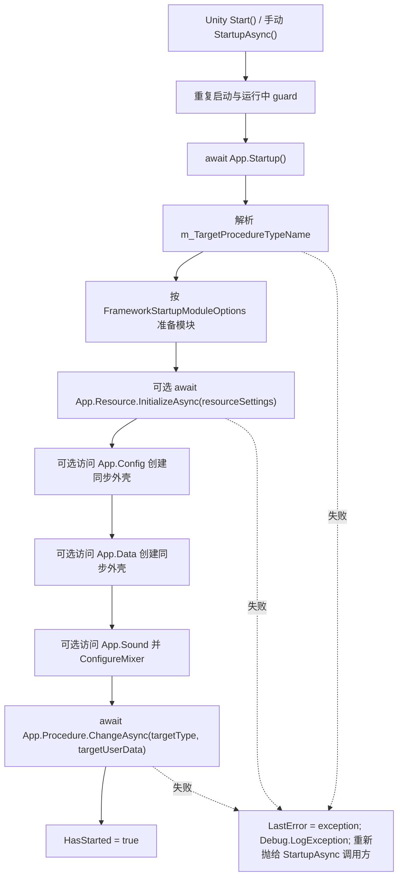

# startup-component-entry design

## 0. 术语约定

| 术语 | 当前定义 | 本次约定 |
|---|---|---|
| FrameworkStartup | 当前 runtime 没有可挂载启动组件；旧 `Startup.cs` MonoBehaviour 已删除 | 新增可挂载场景组件，名字不用 `Startup`，避免恢复旧默认脚本语义 |
| 目标 Procedure | `ProcedureModule.ChangeAsync(Type, object)` 可直接切到非抽象 `ProcedureBase` 类型 | Inspector 下拉只选择初始化完成后进入的目标 Procedure，不选择 startup procedure |
| 模块 ready | `App.Startup()` 只切 App lifecycle；`App.X` 只创建同步模块外壳；`ResourceModule.InitializeAsync()` 才是资源显式 ready | Startup 组件只调用现有 ready API，不新增 Config/Data 的宽泛 InitializeAsync |
| Startup 模块配置项 | `ResourceSettings` / `SoundMixerSettings` 曾可作为 Resources 下的 ScriptableObject 资产 | 改为 `FrameworkStartupModuleOptions` 内嵌的 `[Serializable]` 普通配置对象，由启动组件显式传入 Resource/Sound 模块 |
| Runtime Startup 脚本 | architecture 现状写明 `Startup : MonoBehaviour` 默认场景脚本已删除 | 本次新增的是显式挂载的 `FrameworkStartup`，不是默认自动存在的 `Startup.cs` |

防冲突结论：

- `FrameworkStartup` 不是 `ProcedureBase`，不新增 `StartupProcedureBase` / `DefaultStartupProcedure`。
- `FrameworkStartup` 不使用 `App.Procedure.RequestChange()`；外部组件进入流程时直接 `ChangeAsync(targetProcedureType, userData)`。
- 本 feature 不恢复旧 `Assets/GameDeveloperKit/Runtime/Startup.cs`，不让 `App.Startup()` 自动注册模块或自动进入 Procedure。
- 本 feature 不注册剧情、不播放剧情、不打开 LoadingWindow、不做章节预加载、不等待 AVPro 首帧。
- 本 feature 不再让 Resource/Sound 配置通过 `Resources.Load<ResourceSettings>()` 或 `Resources.Load<SoundMixerSettings>()` 自举。

## 1. 决策与约束

### 需求摘要

做什么：新增一个可挂在 Unity 场景 GameObject 上的 `FrameworkStartup` 组件。组件在启动时调用 `App.Startup()`，按 Inspector 配置准备必要模块，然后切换到 Inspector 选择的目标 Procedure。

为谁：项目场景、示例和后续剧情测试入口需要一个统一的启动挂载点，不再把资源初始化、Procedure 切换或 demo bootstrap 放进 StoryPlayback/AVPro 播放层。

成功标准：

- 场景挂上 `FrameworkStartup` 后，组件能解析目标 Procedure 类型并调用 `App.Procedure.ChangeAsync(targetProcedureType, userData)`。
- 资源初始化开启时，组件在切目标 Procedure 前用内嵌 `ResourceSettings` 完成 `App.Resource.InitializeAsync(resourceSettings)`。
- Config/Data 只按配置创建同步模块外壳，不凭空新增 `ConfigModule.InitializeAsync()` 或 `DataModule.InitializeAsync()`。
- Sound 解析开启时，组件在切目标 Procedure 前创建 `App.Sound` 并应用内嵌 `SoundMixerSettings`。
- Inspector 目标 Procedure 下拉只显示可创建的 `ProcedureBase` 派生类型，并序列化 AssemblyQualifiedName。
- 错误目标类型、空目标类型或启动失败时可观察到异常，不静默吞掉。

### 明确不做

- 不新增 Startup Procedure，也不把 Startup 做成 Procedure。
- 不修改 `App.Startup()` 的当前语义：它仍不预加载默认模块、不自动切 Procedure。
- 不新增 Config/Data 的聚合初始化 API；具体配置表或存档加载由目标 Procedure 或后续 feature 明确声明。
- 不保留 `ResourceSettings.asset` 或 `SoundMixerSettings.asset` 作为 Runtime 默认配置来源。
- 不引入 StoryPlayback、AVProVideo、LoadingWindow、LoadingController、章节预加载或剧情注册逻辑。
- 不自动把组件塞进所有场景，不新增场景模板或菜单向导。
- 不手写 Unity `.meta` 文件。

### 复杂度档位

走 Unity runtime 工具默认档位，偏离点：

- Robustness = L3：启动组件是场景入口，目标类型、重复启动、启动失败和销毁 shutdown 都要有明确行为。
- Testability = tested：组件需要有可测试的 `StartupAsync()`，避免只能靠 Unity `Start()` 时机做黑盒验证。
- Compatibility = current-only：这是未发布中的项目内部启动入口，不承诺兼容旧 `Startup.cs` 组件。

### 关键决策

1. 新组件命名为 `FrameworkStartup`，不叫 `Startup`。
   - 旧 `Startup.cs` 的含义是默认 runtime bootstrap，已经删除。
   - 新入口是用户显式挂载的场景组件，名字上应避免让旧约束失效得不清不楚。

2. 目标流程通过 `ChangeAsync(Type, object)` 进入。
   - `RequestChange()` 的语义是 Procedure enter/leave 切换期间的 pending request。
   - `FrameworkStartup` 在 Procedure 外部，不处于 `IsChanging` 生命周期内，直接 `ChangeAsync` 是正确入口。

3. Resource/Sound 设置内嵌到 Startup 模块配置。
   - 旧资源初始化参数对象在 `ResourceSettings` 已直接内嵌到 Startup 后只剩一层转发壳，不再保留。
   - `ResourceSettings` / `SoundMixerSettings` 不再继承 `ScriptableObject`，不再作为 Resources asset 加载。
   - 组件保存内嵌 `ResourceSettings` / `SoundMixerSettings` 和开关，运行时直接调用 `App.Resource.InitializeAsync(resourceSettings)`，并显式调用 `App.Sound.ConfigureMixer(soundMixerSettings)`。

4. Config/Data 首版只做同步外壳解析。
   - `ConfigModule` 当前已有 `Startup()`、`LoadTableAsync<TRow>()`，没有可由 Inspector 稳定选择的通用表清单。
   - `DataModule` 当前已有 `LoadDataAsync<T>()`，同样需要类型化 slot 声明；不在本 feature 硬造字符串式泛型配置。

## 2. 名词与编排

### 2.1 名词层

#### 现状

- `App.Startup()` 位于 `Assets/GameDeveloperKit/Runtime/App.cs`，当前只切换 App lifecycle，不预加载默认模块。
- `App.Resource` / `App.Config` / `App.Data` 会按需创建同步模块外壳；其中 `ResourceModule.InitializeAsync(resourceSettings)` 是显式资源 ready。
- `ProcedureModule.ChangeAsync(Type, object)` 位于 `Assets/GameDeveloperKit/Runtime/Procedure/ProcedureModule.cs`，会校验目标类型并懒创建 Procedure。
- 旧 runtime `Startup.cs` 已删除，architecture 约束写明框架不再提供默认 `Startup : MonoBehaviour` 场景入口。

#### 变化

新增可挂载组件契约：

```csharp
// 来源：GameDeveloperKit.Runtime planned public startup component
public sealed class FrameworkStartup : MonoBehaviour
{
    [SerializeField] private string m_TargetProcedureTypeName;
    [SerializeField] private UnityEngine.Object m_TargetUserData;
    [SerializeField] private FrameworkStartupModuleOptions m_Modules;
    [SerializeField] private bool m_ShutdownAppOnDestroy;

    public bool IsRunning { get; }
    public bool HasStarted { get; }
    public Exception LastError { get; }
    public Type TargetProcedureType { get; }

    public UniTask StartupAsync();
}
```

新增启动模块配置：

```csharp
// 来源：GameDeveloperKit.Runtime planned startup options
[Serializable]
public sealed class FrameworkStartupModuleOptions
{
    [SerializeField] private bool m_InitializeResource;
    [SerializeField] private ResourceSettings m_ResourceSettings = new ResourceSettings();
    [SerializeField] private bool m_ResolveConfigModule;
    [SerializeField] private bool m_ResolveDataModule;
    [SerializeField] private bool m_ResolveSoundModule;
    [SerializeField] private SoundMixerSettings m_SoundMixerSettings = new SoundMixerSettings();

    public bool InitializeResource { get; }
    public ResourceSettings ResourceSettings { get; }
    public bool ResolveConfigModule { get; }
    public bool ResolveDataModule { get; }
    public bool ResolveSoundModule { get; }
    public SoundMixerSettings SoundMixerSettings { get; }

}
```

新增 Editor authoring 入口：

```csharp
// 来源：GameDeveloperKit.Editor planned startup inspector
[CustomEditor(typeof(FrameworkStartup))]
public sealed class FrameworkStartupInspector : Editor
{
    // 使用 TypeCache.GetTypesDerivedFrom<ProcedureBase>() 生成目标 Procedure 下拉。
}
```

接口示例：

```csharp
// 场景组件配置：
// Target Procedure = GameDeveloperKit.Scripts.StoryTestProcedure
// Initialize Resource = true
// Resource Settings = inline ResourceSettings
// Resolve Sound Module = true
// Sound Mixer Settings = inline SoundMixerSettings

await startup.StartupAsync();

// 可观察结果：
// App.Resource.IsInitialized == true
// App.TryGetRegistered<SoundModule>(out _) == true
// App.Procedure.Current.GetType() == typeof(StoryTestProcedure)
```

### 2.2 编排层



#### 现状

- 场景若要启动框架，需要业务脚本自行 `await App.Startup()`、按需初始化 Resource，再 `App.Procedure.ChangeAsync<T>()`。
- StoryPlayback 合并后不再保留 `StoryRuntimeDemoBootstrap`，播放层也不应继续承接 App/Resource/Procedure 编排。
- 旧 Procedure bootstrap flow 支持 Procedure 内部 `RequestChange()`，但这不适合 Procedure 外部组件。

#### 变化

1. `FrameworkStartup.Start()` 调用 `StartupAsync().Forget(LogException)`；测试或业务也可直接 await `StartupAsync()`。
2. `StartupAsync()` 对重复调用做 guard：
   - 已启动则直接返回。
   - 运行中再次调用则等待同一轮启动结果，避免双切 Procedure。
3. 启动顺序固定：
   - `await App.Startup()`。
   - 解析并校验目标 Procedure type。
   - 根据 options 初始化 Resource / 解析 Config / 解析 Data / 解析并配置 Sound。
   - `await App.Procedure.ChangeAsync(targetType, m_TargetUserData)`。
4. `OnDestroy()` 若 `m_ShutdownAppOnDestroy == true`，触发 `App.Shutdown()`，并记录异常到 Unity log。

#### 流程级约束

- 错误语义：`StartupAsync()` 被 await 时向调用方抛异常；Unity `Start()` 自动调用时记录 `LastError` 并 `Debug.LogException`。
- 顺序：Resource ready 必须发生在目标 Procedure enter 之前；目标 Procedure enter 中可假定配置的 resource ready 已完成。
- 来源：Resource/Sound 的 settings 只能来自启动组件内嵌配置或调用方显式传入 `ResourceSettings` / `SoundMixerSettings`，不从资源包自举。
- 幂等：同一个组件同一生命周期只执行一轮成功启动；重复调用不重复 `ChangeAsync()`。
- 类型校验：空 type name、`Type.GetType()` 失败、非 `ProcedureBase`、abstract、open generic 都视为启动错误。
- 可观测点：`IsRunning`、`HasStarted`、`LastError`、`TargetProcedureType` 用于测试和调试。
- 扩展点：后续如需启动时加载具体配置表/存档，应新增类型化 startup load list，不把泛型类型压成不透明字符串。

### 2.3 挂载点清单

1. `FrameworkStartup` runtime component：新增场景可挂载入口；删除后本 feature 在 Player 场景中消失。
2. `FrameworkStartup` serialized configuration：`m_TargetProcedureTypeName`、`m_TargetUserData`、`m_Modules`、`m_ShutdownAppOnDestroy` 是 prefab/scene authoring 表面。
3. `FrameworkStartupInspector`：新增目标 Procedure 下拉和配置校验；删除后仍可手填字符串，但失去可用 authoring 体验。
4. `FrameworkStartupModuleOptions`：新增模块 ready 配置对象；删除后组件无法表达 Resource ready、Config/Data shell 准备和 Sound mixer 配置。

拔除沙盘：移除以上四项后，项目回到业务自行写 MonoBehaviour 调 `App.Startup()` / `App.Resource.InitializeAsync(resourceSettings)` / `App.Sound.ConfigureMixer(settings)` / `App.Procedure.ChangeAsync()` 的状态；StoryPlayback、Runtime/Story 和 ProcedureModule 自身不应受影响。

### 2.4 推进策略

1. Runtime 组件骨架：新增 `FrameworkStartup`、`FrameworkStartupModuleOptions` 和可 await 的 `StartupAsync()`。
   - 退出信号：可通过代码创建组件并调用 `StartupAsync()`，重复调用不重复执行启动流程。
2. Procedure 类型解析与切换：接入 AssemblyQualifiedName 解析、类型校验和 `ChangeAsync(Type, userData)`。
   - 退出信号：有效目标 Procedure 成为 `App.Procedure.Current`，无效目标类型抛明确异常。
3. 模块 ready 编排：接入 Resource 初始化、Config/Data 同步外壳解析和 Sound 显式配置。
   - 退出信号：开启资源初始化时目标 Procedure enter 前 `App.Resource.IsInitialized == true`；Config/Data 只创建模块，不新增 InitializeAsync；开启 Sound 解析时 `SoundModule` 注册并应用内嵌 mixer settings。
4. Editor 下拉：新增 `FrameworkStartupInspector`，用 `TypeCache` 枚举可创建 Procedure。
   - 退出信号：Inspector 下拉写入目标 Procedure 的 AssemblyQualifiedName，并过滤 abstract / generic / 非 Procedure 类型。
5. 覆盖验证：补 Runtime/Editor 侧可验证场景和反向 grep。
   - 退出信号：关键验收场景有测试或 grep 证据，Runtime 编译通过。

### 2.5 结构健康度与微重构

##### 评估

- compound convention 检索：未命中 startup / procedure / 目录组织相关 convention。
- 文件级 - `Assets/GameDeveloperKit/Runtime/App.cs`：约 552 行，职责是模块 resolver 与 lifecycle；本 feature 不修改它，避免把场景启动职责塞进 App 静态入口。
- 文件级 - `Assets/GameDeveloperKit/Runtime/Procedure/ProcedureModule.cs`：约 439 行，已有直接 `ChangeAsync(Type, object)`，本 feature 不修改 ProcedureModule。
- 文件级 - `Assets/GameDeveloperKit/Tests/Runtime/ProcedureModuleTests.cs`：约 653 行，已有 Procedure 行为测试；本 feature 若补测试应新增独立 startup 测试文件，不继续塞进 ProcedureModuleTests。
- 目录级 - `Assets/GameDeveloperKit/Runtime/`：当前顶层 C# 文件 2 个；新增一个框架入口组件不会造成摊平拥挤。
- 目录级 - `Assets/GameDeveloperKit/Editor/`：根目录当前无 C# 文件但已有多个子目录；新增 inspector 应落到新的 `Editor/Startup/` 或等价子目录，避免根目录堆放。

##### 结论：不做前置微重构

本 feature 新增独立文件，不需要先拆 `App.cs` 或 `ProcedureModule.cs`。实现时应把 runtime 组件与 editor inspector 分开落位；如果后续启动组件继续扩展出配置表/存档类型清单，再单独评估 `Runtime/Startup/` 子目录是否稳定化。

##### 超出范围的观察

- `.codestable/requirements/framework-startup.md` 仍保留旧“一键按依赖启动默认模块”的愿景文字；本 feature 会把它推进为“显式挂载 + 按需 resolver + 显式 ready”方向，acceptance 时建议用 `cs-req update` 同步 requirement。

## 3. 验收契约

| 编号 | 输入 / 触发 | 期望可观察结果 |
|---|---|---|
| N1 | 场景组件配置有效目标 Procedure，调用 `StartupAsync()` | `App.Startup()` 完成，`App.Procedure.Current` 为目标 Procedure |
| N2 | `m_TargetUserData` 配置为 Unity Object | 目标 Procedure 的 `OnEnterAsync(previous, userData)` 收到同一个对象引用 |
| N3 | 启用 Resource 初始化并配置内嵌 `ResourceSettings` | 目标 Procedure enter 前 `App.Resource.IsInitialized == true` |
| N4 | 不启用 Resource 初始化 | 组件不隐式调用 `App.Resource.InitializeAsync()`；依赖资源的后续 API 仍按 ResourceModule 现有 guard 报错 |
| N5 | 启用 Config/Data 同步外壳解析 | 启动后 `App.TryGetRegistered<ConfigModule>()` / `App.TryGetRegistered<DataModule>()` 按配置为 true |
| N6 | 目标 Procedure type name 为空、找不到、非 Procedure、abstract 或 open generic | `StartupAsync()` 抛明确异常，`LastError` 记录该异常，不切换流程 |
| N7 | 同一组件启动中重复调用 `StartupAsync()` | 复用同一轮启动结果，不重复进入目标 Procedure |
| N8 | `m_ShutdownAppOnDestroy == true` 且组件销毁 | 触发 `App.Shutdown()`，关闭已注册模块 |
| N9 | Inspector 打开 `FrameworkStartup` | 目标 Procedure 下拉只列可创建的 `ProcedureBase` 派生类型，并写入 AssemblyQualifiedName |
| N10 | 启用 Sound 同步外壳解析并配置内嵌 `SoundMixerSettings` | 启动后 `App.TryGetRegistered<SoundModule>()` 为 true，`SoundModule` 不从 Resources 加载 mixer settings |
| B1 | grep runtime | 不新增 `StartupProcedureBase`、`DefaultStartupProcedure` 或 `ProcedureStartup` |
| B2 | grep `App.Startup()` 实现 | 不让 `App.Startup()` 自动注册默认模块或自动切 Procedure |
| B3 | grep StoryPlayback / Story runtime | 不出现 `FrameworkStartup`、`LoadingWindow`、章节预加载或剧情注册逻辑 |
| B4 | grep Resource/Sound settings | 不存在 `Resources.Load<ResourceSettings>()` / `Resources.Load<SoundMixerSettings>()`，`ResourceSettings` / `SoundMixerSettings` 不继承 `ScriptableObject` |
| B5 | 编译验证 | `dotnet build GameDeveloperKit.Runtime.csproj --no-restore` 通过，Editor 侧若受 Unity 生成 csproj 残留影响则记录原因 |

反向核对项：

- 不新增 Config/Data 的 `InitializeAsync()`。
- 不在 `FrameworkStartup` 中调用 `App.Procedure.RequestChange()`。
- 不把 Startup 组件放入 `GameDeveloperKit.StoryPlayback`。
- 不把 Resource/Sound 配置重新做回 ScriptableObject 或 Resources 默认资产。
- 不手写或修改 Unity `.meta` 文件。

## 4. 与项目级架构文档的关系

验收通过后需要更新 `.codestable/architecture/ARCHITECTURE.md`：

- Module Lifecycle / App Module Resolver 小节应区分“无默认 `Startup.cs` 自动脚本”和“存在可显式挂载的 `FrameworkStartup` 组件”。
- Procedure 小节应记录外部启动组件使用 `ChangeAsync(Type, object)` 进入目标 Procedure，`RequestChange()` 仍只用于 Procedure 切换期间。
- 已知约束应记录 Startup 组件不承接 StoryPlayback、Loading UI、章节预加载或业务剧情注册。

同时建议后续单独更新 `.codestable/requirements/framework-startup.md`，把旧“按依赖启动默认模块”的愿景改为当前显式挂载与显式 ready 模型。
