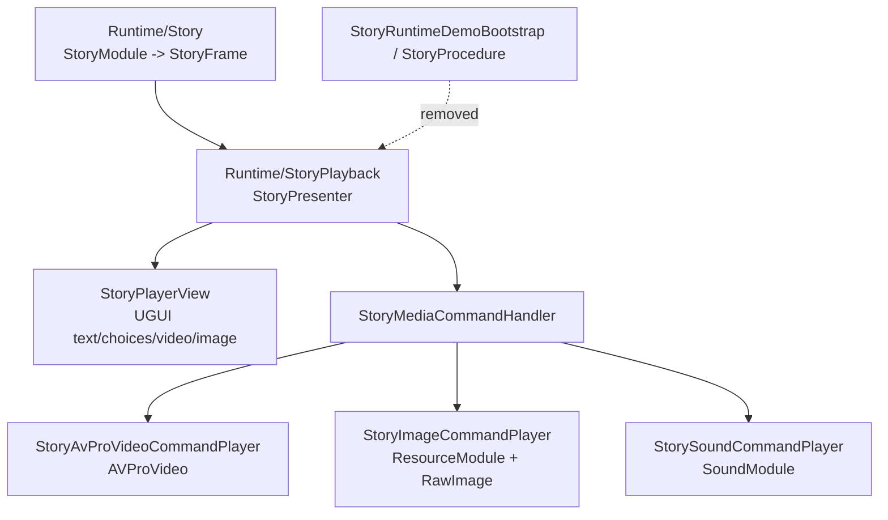

# StoryPlayback Package Merge Design

## 0. 术语约定

| 术语 | 定义 | 防冲突结论 |
|---|---|---|
| `Runtime/Story` | 纯剧情运行时核心，维护 `StoryProgram`、`StoryModule`、`StoryRunner`、`StoryFrame`、命令数据协议 | 不引用 AVProVideo、UGUI、TextMeshPro、ResourceModule、SoundModule、Procedure、Loading UI |
| `StoryPlayback` | 新的默认剧情播放程序集/目录，承载 UGUI/Sound/AVPro 的 Story Player 实现 | 替代 `GameDeveloperKit.StoryPresentation` 和 `GameDeveloperKit.StoryPresentation.AVPro`，不是新增第三层抽象 |
| 播放协调类型 | `StoryPresenter`、`IStoryFramePresenter`、`IStoryCommandHandle`、`IStoryCommandHandler`、`StoryMediaCommandHandler` 等把 `StoryFrame` 派发给表现层的类型 | 现位于 `Runtime/Story/Runtime/IStoryCommandHandler.cs`，本 feature 迁入 `StoryPlayback` |
| 命令数据协议 | `StoryMediaCommandNames` 中的 `play_video`、`show_image`、`play_audio`、`source`、`clip`、`image` 等常量 | 保留在 `Runtime/Story`，因为 Editor schema、compiler、runtime validation 和 tests 共同引用 |
| AVPro 播放实现 | `StoryAvProVideoCommandPlayer`、`StoryAvProVideoPlayback`、`StoryVideoPathResolver` | 合并进 `StoryPlayback`，AVPro 是默认实现细节，不再是独立 presentation package |
| 旧引导职责 | `StoryRuntimeDemoBootstrap`、`StoryProcedure`、`StoryProcedureRequest` 中的 App/Resource init、Loading、章节预加载、Procedure 切换 | 本 feature 删除，不在 `StoryPlayback` 内替代；后续由 `startup-procedure-entry` 和 `story-test-scripts-entry` 承接 |

术语 grep 结论：现有代码只有 `GameDeveloperKit.StoryPresentation`、`GameDeveloperKit.StoryPresentation.AVPro`，没有 `GameDeveloperKit.StoryPlayback`；`StoryPlaybackSession` 是 Editor-only 播放会话，不等同本 runtime 播放包。

## 1. 决策与约束

### 需求摘要

做什么：创建 `Assets/GameDeveloperKit/Runtime/StoryPlayback` 和 `GameDeveloperKit.StoryPlayback` asmdef，迁移现有默认播放视图、播放协调器、图片/音频/AVPro 视频播放器、视频路径解析器和 prefab；删除旧 `StoryPresentation` / `StoryPresentation.AVPro` 对外程序集以及 AVPro 层中不该存在的 runtime bootstrap/procedure。

为谁：框架维护者、Story runtime/Editor 后续功能开发者、使用 `StoryPlayerView` 播放剧情的业务脚本。

成功标准：

- `GameDeveloperKit.StoryPlayback` 是唯一 runtime Story 播放程序集。
- `StoryPlayerView.Play()` / `PlayRegistered()` 仍能播放 `StoryProgram` 或已注册 Story。
- 视频仍通过 AVProVideo 播放，图片仍通过 `ResourceModule` 输出到 UGUI `RawImage`，音频仍通过 `SoundModule` 播放。
- `StoryVideoPathResolver` 的三来源规则保留：`streaming_assets`、`persistent_data_path`、`network_stream`。
- `Runtime/Story` 不再承载播放协调类型，只保留命令数据协议。
- `StoryRuntimeDemoBootstrap`、`StoryProcedure`、`StoryProcedureRequest` 不再编译进播放包。
- Editor 和 tests 的 asmdef 引用从旧 `StoryPresentation.AVPro` 更新到 `StoryPlayback`。

明确不做：

- 不实现 AVPro 视频队列预热/缓冲；该能力归 `story-playback-video-prewarm`。
- 不实现通用 Startup Procedure；该能力归 `startup-procedure-entry`。
- 不创建 `Scripts/StoryTest` 剧情测试入口；该能力归 `story-test-scripts-entry`。
- 不保留旧 `GameDeveloperKit.StoryPresentation` 或 `GameDeveloperKit.StoryPresentation.AVPro` 兼容 shim。
- 不改变 `StoryProgram`、`StoryFrame`、Story Editor authoring schema 或 compiler 的数据语义。
- 不改图片/音频资源加载策略，不把视频接回 ResourceModule/资源包。
- 不手写 Unity `.meta` 文件；涉及 prefab/asset 迁移时只移动已有文件或让 Unity 生成。

### 复杂度档位

本 feature 按框架 runtime 包迁移处理，偏离内部工具默认档位：

- `Robustness = L3`：公共播放 API、路径解析和命令执行句柄要保留现有输入校验与明确异常语义。
- `Structure = modules`：目标是拆程序集/目录边界，必须按模块依赖方向组织。
- `Compatibility = current-only`：按用户决策删除旧 presentation asmdef，不承诺旧程序集名兼容。
- `Testability = tested`：现有 StoryPresenter/media handler/path resolver 行为需要迁移测试或更新测试引用，不能只靠编译。

### 关键决策

1. `StoryPlayback` 是合并包，不是接口层。
   - 旧 `StoryPresentation` 和 `StoryPresentation.AVPro` 都消失；AVPro 直接作为默认视频实现存在于 `StoryPlayback`。
   - C# namespace 可暂时沿用 `GameDeveloperKit.Story`，减少源代码调用点 churn；边界以 asmdef/目录为准。

2. `StoryMediaCommandNames` 保留在 `Runtime/Story`。
   - 该类型被 Editor schema、compiler、runtime validation、Runtime/Editor tests 广泛使用。
   - 它描述 command argument 协议，不依赖播放实现；迁走会把 Editor/compiler 不必要地绑到 `StoryPlayback`。

3. 播放协调类型迁入 `StoryPlayback`。
   - `StoryPresenter`、`IStoryFramePresenter`、`IStoryCommandHandle`、`IStoryCommandHandler`、`IStoryVideoCommandPlayer`、`IStoryImageCommandPlayer`、`IStoryAudioCommandPlayer`、`StoryMediaCommandHandler`、`StoryMediaCommandUtility` 都是播放执行/协调层。
   - 这些类型依赖 command handle 生命周期和表现层完成回调，不属于纯 runtime story progression。

4. 删除旧 `StoryProcedure` 和 demo bootstrap，不做等价替代。
   - 它们混入 App startup、Resource initialize、Loading UI、章节媒体预加载、Procedure 切换，违反 roadmap 边界。
   - 本 feature 只保留 `StoryPlayerView` 级播放能力；启动链路由后续 feature 明确设计。

## 2. 名词与编排

### 2.1 名词层

#### 现状

- `Assets/GameDeveloperKit/Runtime/Story/Runtime/IStoryCommandHandler.cs` 是 1037 行混合文件，包含 command handle、command handler、媒体命令名、媒体命令工具、播放协调器 `StoryPresenter`。
- `Assets/GameDeveloperKit/Runtime/StoryPresentation/GameDeveloperKit.StoryPresentation.asmdef` 只承载 `StoryImageCommandPlayer`、`StorySoundCommandPlayer`。
- `Assets/GameDeveloperKit/Runtime/StoryPresentation.AVPro/GameDeveloperKit.StoryPresentation.AVPro.asmdef` 承载 `StoryPlayerView`、AVPro 视频播放器、视频路径解析器、prefab，以及 `StoryRuntimeDemoBootstrap` / `StoryProcedure` / `StoryProcedureRequest`。
- `Assets/GameDeveloperKit/Editor/GameDeveloperKit.Editor.asmdef` 和 `Assets/GameDeveloperKit/Tests/Editor/GameDeveloperKit.Editor.Tests.asmdef` 直接引用 `GameDeveloperKit.StoryPresentation.AVPro`。
- `StoryPlayerViewPrefabBuilder` 的 prefab 路径仍指向 `Assets/GameDeveloperKit/Runtime/StoryPresentation.AVPro/StoryPlayerView.prefab`。

#### 变化

- 新增 runtime 播放程序集：

```json
{
  "name": "GameDeveloperKit.StoryPlayback",
  "rootNamespace": "GameDeveloperKit",
  "references": [
    "GameDeveloperKit.Runtime",
    "AVProVideo.Runtime",
    "UniTask",
    "UnityEngine.UI",
    "Unity.TextMeshPro"
  ],
  "autoReferenced": true
}
```

- `Runtime/Story` 保留：

```csharp
// 来源：Runtime/Story command data protocol
public static class StoryMediaCommandNames
{
    public const string PlayVideo = "play_video";
    public const string ShowImage = "show_image";
    public const string PlayAudio = "play_audio";
    public const string ClipArgument = "clip";
    public const string ImageArgument = "image";
    public const string VideoSourceArgument = "source";
    public const string VideoSourceStreamingAssets = "streaming_assets";
    public const string VideoSourcePersistentDataPath = "persistent_data_path";
    public const string VideoSourceNetworkStream = "network_stream";
    public const string CompletedOutcome = "completed";
}
```

- `StoryPlayback` 承载播放协调 API：

```csharp
// 来源：StoryPlayback public playback coordination surface
public interface IStoryFramePresenter
{
    void Present(StoryFrame frame, StoryPresenter presenter);
    void Clear(StoryFrame frame);
}

public sealed class StoryPresenter : IDisposable
{
    public StoryPresenter(StoryModule module, IStoryFramePresenter framePresenter = null);
    public StoryFrame Start(StoryProgram program, string chapterId = null);
    public StoryFrame StartProgram(string storyId, string chapterId = null);
    public StoryFrame Continue();
    public StoryFrame Select(string choiceId);
    public StoryFrame CompleteCommand(string commandId, string outcomeId);
    public StoryFrame Evaluate(double time);
    public void AddCommandHandler(IStoryCommandHandler handler);
    public void Stop();
}
```

- `StoryPlayback` 承载默认播放组件：

```csharp
// 来源：StoryPlayback default UGUI/AVPro view
public sealed class StoryPlayerView : MonoBehaviour, IStoryFramePresenter
{
    public void ConfigureModules(
        StoryModule storyModule,
        ResourceModule resourceModule = null,
        SoundModule soundModule = null);

    public void Play(StoryProgram program, string chapterId = null);
    public void PlayRegistered(string storyId, string chapterId = null);
    public void StopPlayback();
}
```

- 删除的名词：
  - `StoryRuntimeDemoBootstrap`
  - `StoryProcedure`
  - `StoryProcedureRequest`
  - `GameDeveloperKit.StoryPresentation`
  - `GameDeveloperKit.StoryPresentation.AVPro`

### 2.2 编排层



#### 现状

当前播放流程已经能跑通，但边界混杂：

1. `StoryModule` 输出 `StoryFrame`。
2. `StoryPresenter` 位于 `Runtime/Story`，读取 frame tracks 并派发 command handler。
3. 默认图片/音频播放器位于 `StoryPresentation`，默认 AVPro 播放器和 `StoryPlayerView` 位于 `StoryPresentation.AVPro`。
4. `StoryRuntimeDemoBootstrap` 额外做 `App.Startup()`、`App.Resource.InitializeAsync()`、Loading UI、章节媒体预加载、首帧等待和 `App.Procedure.ChangeAsync<StoryProcedure>()`。
5. `StoryProcedure` 负责查找/实例化 `StoryPlayerView` 并调用 `Play()`，把播放行为包装成 Procedure。

#### 变化

1. 包边界先成型：创建 `StoryPlayback` asmdef，让默认播放类和播放协调类型编译到同一程序集。
2. Story 核心瘦身：`Runtime/Story` 删除播放协调类型，仅保留命令数据协议和剧情推进 API。
3. 默认播放保持等价：`StoryPlayerView` 仍在 `Awake`/`Update` 中绑定按钮、刷新 AVPro 纹理、推进等待时间；命令播放器的完成/失败/取消语义不变。
4. 引导职责剥离：删除 `StoryRuntimeDemoBootstrap`、`StoryProcedure`、`StoryProcedureRequest`，同步删除或改写依赖这些类型的测试。
5. 引用收敛：Editor、Editor.Tests、Runtime.Tests 按实际使用改引用 `GameDeveloperKit.StoryPlayback`；不再引用旧 presentation asmdef。
6. Prefab 路径收敛：`StoryPlayerView.prefab` 迁移到 `Runtime/StoryPlayback`，Editor prefab builder 指向新路径。

流程级约束：

- 依赖方向：`StoryPlayback -> GameDeveloperKit.Runtime`，不得出现 `Runtime/Story -> StoryPlayback`。
- 错误语义：迁移后 `StoryPlayerView.LastError`、`StoryPresenter.LastError`、command handle `Fail()` 语义保持现状。
- 生命周期：`StoryPlayerView.OnDestroy()` 仍释放 presenter 和命令播放器；AVPro playback 仍解绑事件、stop、close、destroy GameObject。
- 兼容性：不保留旧 asmdef；外部旧程序集引用需要更新。
- 观测点：编译/测试中不应再出现 `GameDeveloperKit.StoryPresentation` 或 `GameDeveloperKit.StoryPresentation.AVPro` 引用。

### 2.3 挂载点清单

- `Assets/GameDeveloperKit/Runtime/StoryPlayback/GameDeveloperKit.StoryPlayback.asmdef`：新增唯一默认 Story 播放程序集。
- Editor asmdef 引用：`GameDeveloperKit.Editor` 从旧 `StoryPresentation.AVPro` 改为 `GameDeveloperKit.StoryPlayback`。
- Test asmdef 引用：Story 播放相关 tests 改为引用 `GameDeveloperKit.StoryPlayback`，纯 Story runtime tests 不再隐式依赖播放类型。
- `StoryPlayerView.prefab` runtime 资源路径：从 `Runtime/StoryPresentation.AVPro` 迁到 `Runtime/StoryPlayback`，PrefabBuilder 指向新路径。
- 旧 presentation asmdef：删除 `GameDeveloperKit.StoryPresentation` 和 `GameDeveloperKit.StoryPresentation.AVPro` 对外入口。

### 2.4 推进策略

1. 结构微重构：先把 `IStoryCommandHandler.cs` 中的数据协议与播放协调类型拆开，保持行为不变。
   退出信号：`Runtime/Story` 仍编译，`StoryMediaCommandNames` 调用点不需要引用 StoryPlayback。
2. 播放包骨架：创建 `StoryPlayback` asmdef/目录并迁移图片、音频、AVPro、`StoryPlayerView` 和播放协调类型。
   退出信号：`StoryPlayerView` 和三个默认命令播放器在 `GameDeveloperKit.StoryPlayback` 中编译。
3. 旧引导清理：删除旧 bootstrap/procedure/request 和两个旧 presentation asmdef，更新 prefab 路径。
   退出信号：grep 不再命中旧类型作为可编译类型；PrefabBuilder 指向新 prefab 路径。
4. 引用与测试接线：更新 Editor/Test asmdef 和测试归属，清理对旧程序集/旧 Procedure 的反射断言。
   退出信号：Editor、Runtime/Editor tests 引用新程序集名，旧程序集名无引用。
5. 验证：运行可用的 dotnet build / Unity test 编译验证。
   退出信号：至少 `GameDeveloperKit.Runtime.csproj`、`GameDeveloperKit.Editor.csproj`、`GameDeveloperKit.Editor.Tests.csproj` 通过，无法运行项说明原因。

### 2.5 结构健康度与微重构

##### 评估

- compound convention 检索：`search-yaml.py --filter doc_type=decision --filter category=convention --query "目录组织 OR 命名 OR 归属"` 未命中既有 convention。
- 文件级 — `Assets/GameDeveloperKit/Runtime/Story/Runtime/IStoryCommandHandler.cs`：1037 行，混合命令数据协议、命令句柄、handler 接口、media handler、frame presenter、StoryPresenter；本次要拆出多组类型，符合“单文件 > 500 行 + 多职责 + 多处独立改动”触发条件。
- 文件级 — `StoryRuntimeDemoBootstrap.cs`：包含 App startup、Resource init、Loading UI、章节预加载、AVPro 预热和 Procedure 切换；本 feature 不在该文件内改造，直接删除旧引导职责。
- 文件级 — `StoryAvProVideoCommandPlayer.cs`：约 400 行，包含 command player 与 playback 实例两个强相关类型；本次只迁移归属，不拆内部类。
- 目录级 — `Runtime/StoryPresentation` 与 `Runtime/StoryPresentation.AVPro`：两个目录都是旧包边界；继续新增会延续分裂。
- 目录级 — `Runtime/StoryPlayback`：全新目录，本 feature 会放入 5+ 个播放文件和一个 prefab；这是新的稳定归属目录，不再细分 `AVPro` 子目录，避免把 AVPro 重新包装成独立层。

##### 结论：微重构（拆文件）

本 feature 第一阶段必须做“只搬不改行为”的拆文件微重构，把混合在 `IStoryCommandHandler.cs` 的类型拆成 Story 核心协议和 StoryPlayback 播放协调两组。该拆分是包迁移的前置，且可用编译和现有测试证明行为不变。

##### 方案

- 搬什么：
  - `StoryMediaCommandNames` 留在 `Runtime/Story`，单独成为命令数据协议文件。
  - `IStoryCommandHandle`、`StoryCommandHandle`、`IStoryCommandHandler`、`IStoryVideoCommandPlayer`、`IStoryImageCommandPlayer`、`IStoryAudioCommandPlayer`、`StoryMediaCommandHandler`、`StoryMediaCommandUtility`、`IStoryFramePresenter`、`StoryPresenter` 搬入 `Runtime/StoryPlayback`。
- 搬到哪：
  - `Assets/GameDeveloperKit/Runtime/Story/Runtime/StoryMediaCommandNames.cs`
  - `Assets/GameDeveloperKit/Runtime/StoryPlayback/StoryCommandHandle.cs`
  - `Assets/GameDeveloperKit/Runtime/StoryPlayback/StoryCommandHandler.cs`
  - `Assets/GameDeveloperKit/Runtime/StoryPlayback/StoryMediaCommandHandler.cs`
  - `Assets/GameDeveloperKit/Runtime/StoryPlayback/StoryPresenter.cs`
- 行为不变怎么验证：
  - 对外成员签名保持与现状一致。
  - StoryPresenter/media handler 相关测试仍覆盖 start、command complete、stop、audio/image 离帧停止。
  - `StoryMediaCommandNames` 调用点不需要新增 `StoryPlayback` 引用。
  - 编译通过且旧 presentation 程序集名不再出现。
- 步骤序列：
  1. 拆出 `StoryMediaCommandNames`，保留 namespace 和常量值。
  2. 搬播放协调类型到 `StoryPlayback`，保持 namespace 与 public API。
  3. 更新 tests/asmdef 引用，让播放协调测试引用新程序集。
  4. 再迁移默认播放器类与 prefab。

##### 建议沉淀的 convention

- 是否稳定模式：稳定模式。
- 规则一句话：Story 播放实现统一放 `Runtime/StoryPlayback`；`Runtime/Story` 只保存剧情数据、推进 API 和命令数据协议。
- 适用范围：Story runtime / playback 后续功能。
  → 建议 implement 跑通后走 `cs-decide` 归档为 architecture/constraint 或 convention。

##### 超出范围的观察

- `StoryRuntimeDemoBootstrap` 中已有一套 AVPro 预热视频逻辑，但与 loading/procedure/resource preload 强耦合；后续 `story-playback-video-prewarm` 应重新设计可复用队列，不直接搬这段内部类。
- `StoryPlayerView` 仍同时承担 UGUI 渲染、按钮事件、AVPro 纹理刷新和模块解析；本 feature 保持行为等价，后续如要拆 View/Renderer 可单独走 `cs-refactor`。

## 3. 验收契约

| 场景 | 输入 / 触发 | 期望可观察结果 |
|---|---|---|
| N1 新播放程序集 | Unity/编译解析 asmdef | 存在 `GameDeveloperKit.StoryPlayback`，旧 `GameDeveloperKit.StoryPresentation` / `.AVPro` 不再作为 runtime asmdef 存在 |
| N2 纯 Story 核心 | grep `Runtime/Story` | 不出现 `RenderHeads.Media.AVProVideo`、`UnityEngine.UI`、`TMPro`、`ResourceModule`、`SoundModule`、`ProcedureBase`、`LoadingModule` 引用 |
| N3 命令协议保留 | 编译 Editor schema/compiler/tests | `StoryMediaCommandNames` 仍可从 `GameDeveloperKit.Runtime` 使用，常量值不变 |
| N4 播放 API 保持 | 调用 `StoryPlayerView.Play(program, chapterId)` | 能创建/使用 `StoryPresenter` 并渲染 frame，不要求启动 App/Procedure |
| N5 视频播放保持 | `play_video` command，source/clip 合法 | `StoryAvProVideoCommandPlayer` 使用 `StoryVideoPathResolver` 打开 AVPro，首帧事件仍能驱动 `StoryPlayerView` 输出 |
| N6 图片/音频保持 | `show_image` / `play_audio` command | 图片仍走 `ResourceModule` + `RawImage`，音频仍走 `SoundModule` |
| N7 删除旧引导 | grep `StoryRuntimeDemoBootstrap` / `StoryProcedureRequest` / `StoryProcedure` | 不再存在可编译 runtime 类型；相关旧测试已删除或改写 |
| N8 旧程序集清理 | grep `GameDeveloperKit.StoryPresentation` | 不再有 asmdef reference、Type.GetType 反射或 Editor/Test 引用 |
| N9 Prefab 路径 | 运行 StoryPlayerView prefab builder 或 grep prefab path | 新路径指向 `Assets/GameDeveloperKit/Runtime/StoryPlayback/StoryPlayerView.prefab` |
| E1 范围守护 | grep `StoryAvProVideoPreloadQueue` 或新增预热状态 | 本 feature 不新增视频预热队列 |
| E2 范围守护 | grep Startup/Procedure 新入口 | 本 feature 不新增通用 Startup Procedure 或 StoryTest Procedure |
| E3 范围守护 | grep `UnityEngine.Video.VideoPlayer` | 不新增 Unity 内置 VideoPlayer 后端 |

明确不做的反向核对：

- 不应新增 `GameDeveloperKit.StoryPresentation` 兼容 asmdef。
- 不应把 `StoryRuntimeDemoBootstrap` 的 Loading UI 或 Resource 初始化逻辑搬进 `StoryPlayback`。
- 不应修改 `StoryProgram` / `StoryFrame` 序列化数据结构。
- 不应让 `Runtime/Story` 依赖 `GameDeveloperKit.StoryPlayback`。

## 4. 与项目级架构文档的关系

验收后需要更新 `.codestable/architecture/ARCHITECTURE.md` 的 Story 小节：

- 名词：`GameDeveloperKit.StoryPlayback` 取代旧 `GameDeveloperKit.StoryPresentation` 和 `GameDeveloperKit.StoryPresentation.AVPro`，作为默认 runtime Story 播放包。
- 结构：`Runtime/Story` 只保存剧情核心与命令数据协议；`StoryPlayback` 依赖 Story 核心并持有 UGUI/Sound/AVPro 实现。
- 约束：AVProVideo 只进入 `StoryPlayback` 和 Editor playback；Startup/Loading/Procedure/章节预加载不属于 `StoryPlayback`。
- 旧约束修正：architecture 中“AVProVideo 只允许存在于 `StoryPresentation.AVPro`”需要改为 `StoryPlayback`。
