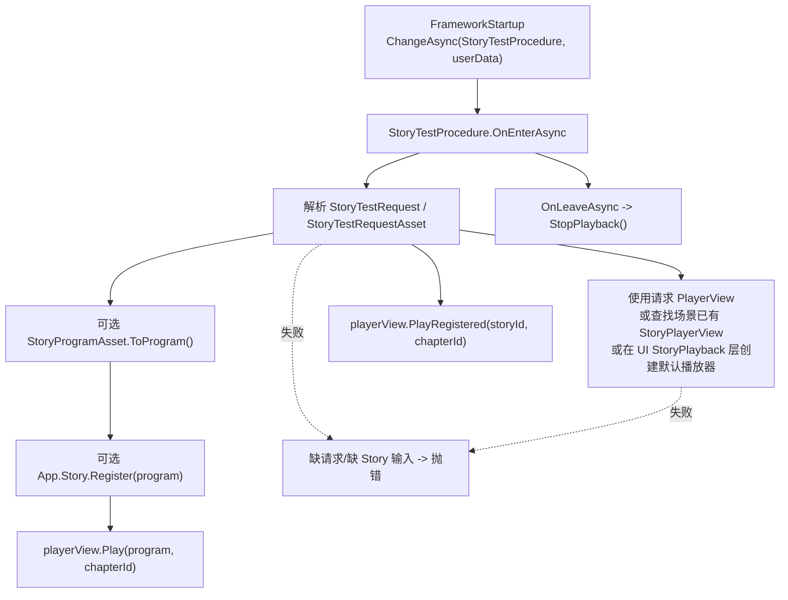

# story-test-scripts-entry design

## 0. 术语约定

| 术语 | 当前定义 | 本次约定 |
|---|---|---|
| Scripts StoryTest | roadmap 中的项目级测试入口，不属于 framework runtime 必选模块 | 新增 `Assets/GameDeveloperKit/Scripts/StoryTest` 独立 asmdef |
| StoryTestProcedure | 旧 `StoryProcedure` 已随 StoryPlayback 合并删除 | 新 Procedure 只消费请求、注册剧情、调用 `StoryPlayerView` 播放 |
| StoryTestRequest | roadmap 契约中的代码侧请求对象 | 普通 C# 请求，适合 `App.Procedure.ChangeAsync(typeof(StoryTestProcedure), request)` |
| StoryTestRequestAsset | `FrameworkStartup.m_TargetUserData` 只能序列化 `UnityEngine.Object` | 新增 ScriptableObject 桥接，让 Inspector 能传入 runtime `StoryProgramAsset`、章节和播放器引用 |
| StoryPlayerView | 位于 `GameDeveloperKit.StoryPlayback`，负责 UGUI/AVPro/Sound/Image 播放 | StoryTest 接收显式引用、复用场景已有播放器，或在缺省时创建默认播放器并调用 `Play()` / `PlayRegistered()` |

防冲突结论：

- `StoryTestProcedure` 不恢复旧 `StoryRuntimeDemoBootstrap`。
- `StoryTestRequestAsset` 是 Scripts 测试层的 Inspector 桥，不进入 `Runtime/Story` 或 `Runtime/StoryPlayback`。
- 本 feature 不创建 Startup 组件；Startup 已由 `FrameworkStartup` 承接。
- 本 feature 不从资源包自动加载 `StoryPlayerView.prefab`，不打开 Loading UI，不做资源或章节预加载；未传入播放器时创建默认 `StoryPlayerView` 并挂到 UI 的 `StoryPlayback` 层。

## 1. 决策与约束

### 需求摘要

做什么：在 `Assets/GameDeveloperKit/Scripts/StoryTest` 下创建独立剧情测试程序集，提供一个很薄的 `StoryTestProcedure`。它进入时读取请求，必要时把 `StoryProgram` 注册进 `App.Story`，然后调用场景中的 `StoryPlayerView` 播放指定 Story/Chapter。

为谁：剧情编辑器/运行时调试场景、后续人工验证 StoryPlayback 的简单入口、需要通过 `FrameworkStartup` 进入剧情播放测试流程的人。

成功标准：

- 存在独立 `GameDeveloperKit.Scripts.StoryTest` asmdef，引用 `GameDeveloperKit.Runtime`、`GameDeveloperKit.StoryPlayback` 和 UniTask。
- `FrameworkStartup` 可以选择 `StoryTestProcedure` 作为目标 Procedure，并通过 `StoryTestRequestAsset` 传入 runtime `StoryProgramAsset`。
- 代码侧可以用 `StoryTestRequest` 传入 `StoryProgram` / `storyId` / `chapterId` / `StoryPlayerView`，也可以不传播放器并使用默认运行时播放器。
- `StoryTestProcedure` 只注册和播放剧情；不初始化 Resource/Config/Data/Sound，不打开 UI 窗口，不做章节预加载，不等待 AVPro 首帧。
- 请求缺失、没有 `StoryProgram` 且没有 `StoryId` 时抛明确错误；没有可用 `StoryPlayerView` 时自动创建默认播放器。

### 明确不做

- 不在 `Runtime/Story` 或 `Runtime/StoryPlayback` 里新增测试入口。
- 不恢复 `StoryRuntimeDemoBootstrap`、`StoryProcedure`、`StoryProcedureRequest`。
- 不调用 `App.Startup()`、`App.Resource.InitializeAsync()`、`App.Sound.ConfigureMixer()`、`App.Config` 或 `App.Data`。
- 不打开 `LoadingWindow`、不做 loading UI；`UIModule` 只用于提供默认播放器的最高层级挂载点。
- 不扫描章节资源、不预加载图片/音频/视频、不等待 AVPro `FirstFrameReady`。
- 不从资源包自动加载 `StoryPlayerView.prefab`；请求显式传入 prefab 时才实例化 prefab，否则使用 `StoryPlayerView.CreateDefault()` 创建默认 UGUI 播放器。
- 不引用 Editor-only `StoryProgramCompiler`、`StorySampleGraphFixture`、`AssetDatabase` 或 Story Editor 类型。

### 复杂度档位

走项目脚本/示例入口默认档位，偏离点：

- Robustness = L2：入口面向测试场景，错误要清楚，但不做完整业务恢复。
- Structure = isolated assembly：必须放在 `Scripts/StoryTest`，避免重新污染 Runtime 播放包。
- Compatibility = current-only：旧 `StoryProcedureRequest` 不兼容迁移，按新边界重建薄入口。
- Testability = tested：需要覆盖 request asset、代码 request、缺省播放器自动创建和范围守护。

### 关键决策

1. 请求分为代码对象和 Inspector asset 两层。
   - `StoryTestRequest` 保持 roadmap 契约，是普通 C# 对象。
   - `StoryTestRequestAsset` 只负责把 `FrameworkStartup` 可传的 `UnityEngine.Object` 转成 `StoryTestRequest`。
   - 这样不需要修改 `FrameworkStartup.m_TargetUserData` 的类型，也不把测试数据塞进 Startup。

2. 播放器来源优先显式配置，缺省时由运行时创建。
   - 优先使用 request 里的 `StoryPlayerView`。
   - 未配置时查找场景中已存在的 `StoryPlayerView`。
   - 若 request 显式提供 `PlayerViewPrefab`，则实例化到 `UILayer.StoryPlayback`。
   - 仍找不到时调用 `StoryPlayerView.CreateDefault()`，在 `UIModule` 的 `StoryPlayback` 层下创建默认 UI、视频 `RawImage`、对白和按钮。

3. Procedure 只做薄编排。
   - 如果请求含 `StoryProgram`，注册/播放该程序。
   - 如果请求只含 `StoryId`，调用 `PlayRegistered(storyId, chapterId)`。
   - 离开 Procedure 时只停止由本 Procedure 启动的播放器，避免旧视频/音频残留。

4. 模块 ready 仍归 Startup 或业务。
   - `StoryTestProcedure` 可以访问 `App.Story` 创建 StoryModule 同步外壳，因为它要注册剧情。
   - 它不得初始化 Resource/Sound；`StoryPlayerView` 执行媒体命令时仍按自身现有规则使用已经 ready 的模块。

## 2. 名词与编排

### 2.1 名词层

#### 现状

- `StoryPlayerView` 位于 `Assets/GameDeveloperKit/Runtime/StoryPlayback/StoryPlayerView.cs`，已有 `Play(StoryProgram, chapterId)`、`PlayRegistered(storyId, chapterId)`、`StopPlayback()`。
- `StoryProgramAsset` 位于 `Assets/GameDeveloperKit/Runtime/Story/Program/StoryProgramAsset.cs`，可以 `ToProgram()` 生成 runtime `StoryProgram`。
- `FrameworkStartup` 位于 `Assets/GameDeveloperKit/Runtime/FrameworkStartup.cs`，目标 userData 是 `UnityEngine.Object`。
- 旧 `StoryProcedure` / `StoryProcedureRequest` 已删除，StoryPlayback 不再承接 Procedure 引导。
- `Assets/GameDeveloperKit/Scripts` 目前没有稳定剧情测试 asmdef。

#### 变化

新增 Scripts 程序集：

```json
{
  "name": "GameDeveloperKit.Scripts.StoryTest",
  "rootNamespace": "GameDeveloperKit",
  "references": [
    "GameDeveloperKit.Runtime",
    "GameDeveloperKit.StoryPlayback",
    "UniTask"
  ],
  "autoReferenced": true
}
```

新增代码侧请求：

```csharp
namespace GameDeveloperKit.Scripts.StoryTest
{
    public sealed class StoryTestRequest
    {
        public StoryProgram Program { get; }
        public string StoryId { get; }
        public string ChapterId { get; }
        public StoryPlayerView PlayerView { get; }
        public StoryPlayerView PlayerViewPrefab { get; }
    }
}
```

新增 Inspector 桥接 asset：

```csharp
namespace GameDeveloperKit.Scripts.StoryTest
{
    [CreateAssetMenu(fileName = "StoryTestRequest", menuName = "GameDeveloperKit/Story/Test Request")]
    public sealed class StoryTestRequestAsset : ScriptableObject
    {
        [SerializeField] private StoryProgramAsset m_ProgramAsset;
        [SerializeField] private string m_StoryId;
        [SerializeField] private string m_ChapterId;
        [SerializeField] private StoryPlayerView m_PlayerView;

        public StoryTestRequest ToRequest();
    }
}
```

新增测试 Procedure：

```csharp
namespace GameDeveloperKit.Scripts.StoryTest
{
    public sealed class StoryTestProcedure : ProcedureBase
    {
        public override UniTask OnEnterAsync(ProcedureBase previous, object userData);
        public override UniTask OnLeaveAsync(ProcedureBase next, object userData);
        public override void OnUpdate(float deltaTime, float unscaledDeltaTime);
    }
}
```

接口示例：

```csharp
// FrameworkStartup:
// Target Procedure = GameDeveloperKit.Scripts.StoryTest.StoryTestProcedure
// Target UserData = StoryTestRequestAsset
// StoryTestRequestAsset.ProgramAsset = Assets/GameDeveloperKit/Story/sample_story_graph.runtime.asset
// StoryTestRequestAsset.PlayerView = scene StoryPlayerView

await startup.StartupAsync();

// 可观察结果：
// App.Story.HasProgram("sample_story_graph") == true
// StoryPlayerView.CurrentFrame != null
```

### 2.2 编排层



#### 现状

当前可播放剧情的能力在 `StoryPlayerView`，但没有项目级测试 Procedure。`FrameworkStartup` 可以进入任意可创建 Procedure，却没有一个“注册 runtime story asset 并播放”的目标 Procedure 可选。旧 AVPro 层的 demo/bootstrap 已删除，并且不应在 StoryPlayback 中恢复。

#### 变化

1. `StoryTestProcedure.OnEnterAsync()` 读取 userData：
   - `StoryTestRequest`：直接使用。
   - `StoryTestRequestAsset`：调用 `ToRequest()`。
   - 其他类型或 null：抛 `GameException`，提示需要 StoryTestRequest。
2. 请求归一化：
   - `StoryTestRequestAsset.ProgramAsset != null` 时生成 `StoryProgram`。
   - `StoryId` 为空且存在 `Program` 时使用 `Program.StoryId`。
   - `Program` 与 `StoryId` 都为空时抛错。
3. 播放器解析：
   - 优先使用 request 的 `PlayerView`。
   - 为空时查找场景内已有 `StoryPlayerView`。
   - 有 `PlayerViewPrefab` 时实例化到 `App.UI.GetLayerRoot(UILayer.StoryPlayback)`。
   - 仍为空时调用 `StoryPlayerView.CreateDefault()` 创建默认 UGUI 播放器，默认播放器必须包含视频 `RawImage`、图片 `RawImage`、对白文本、继续按钮和选项按钮模板。
4. 播放启动：
   - 有 `Program` 时，先确保 `App.Story` 中注册该 Story，再调用 `playerView.Play(program, chapterId)`。
   - 无 `Program` 但有 `StoryId` 时，调用 `playerView.PlayRegistered(storyId, chapterId)`。
   - 调用后若 `playerView.LastError` 立即存在，作为启动失败抛出。
5. `OnLeaveAsync()` 停止由当前 Procedure 启动的播放器；`OnUpdate()` 不做额外推进，因为 `StoryPlayerView.Update()` 已负责等待帧和纹理刷新。

#### 流程级约束

- 错误语义：缺少请求、缺少 story 输入或播放启动立即失败时，`OnEnterAsync()` 抛异常，`FrameworkStartup.LastError` 可观察；缺少播放器不再是错误路径。
- 顺序：StoryTest 不调用 `App.Startup()`；调用方必须先通过 `FrameworkStartup` 或自有入口启动 App。
- 模块：StoryTest 只访问 `App.Story`；不访问 Resource/Config/Data/Sound ready API。
- 幂等：同一个 `StoryId` 已注册时不重复注册；直接进入播放。
- 生命周期：离开 Procedure 停止当前播放器；显式传入或场景复用的播放器不销毁，Procedure 创建的 prefab/default 播放器会销毁。
- 可观测点：`App.Story.HasProgram(storyId)`、`StoryPlayerView.CurrentFrame`、`StoryPlayerView.LastError`、`App.Procedure.CurrentType`。

### 2.3 挂载点清单

1. `GameDeveloperKit.Scripts.StoryTest.asmdef`：独立测试程序集；删除后本 feature 不再编译。
2. `StoryTestProcedure`：`FrameworkStartup` 目标 Procedure 下拉可选择的测试流程；删除后无法从 Startup 直接进入剧情测试。
3. `StoryTestRequest`：代码侧 userData 契约；删除后测试代码无法直接构造播放请求。
4. `StoryTestRequestAsset`：Inspector userData 桥接；删除后 `FrameworkStartup` 不能从 Inspector 传入 StoryProgramAsset/PlayerView。
5. Runtime tests 对新程序集的引用：证明入口可用；删除后缺少回归保护。

拔除沙盘：删除 `Assets/GameDeveloperKit/Scripts/StoryTest` 和 tests 引用后，FrameworkStartup、StoryPlayback、Runtime/Story 仍保持可编译；只是失去项目级剧情测试入口。

### 2.4 推进策略

1. Scripts 包骨架：创建 `Assets/GameDeveloperKit/Scripts/StoryTest` 和独立 asmdef。
   - 退出信号：程序集引用 `GameDeveloperKit.Runtime`、`GameDeveloperKit.StoryPlayback`、`UniTask`，不引用 Editor 程序集。
2. 请求契约：实现 `StoryTestRequest` 与 `StoryTestRequestAsset`，覆盖 program/storyId/chapter/playerView 输入。
   - 退出信号：asset 能转成 request，缺少 Story 输入时抛明确错误。
3. Procedure 编排：实现 `StoryTestProcedure` 的进入、离开和播放器解析流程。
   - 退出信号：传入 request 后能注册并播放 Story；离开时显式播放器只停止，Procedure 创建的播放器会销毁。
4. 测试接线：补 Runtime tests 或等价验证，覆盖代码 request、asset request、缺省播放器、无效请求。
   - 退出信号：测试能证明 `FrameworkStartup -> StoryTestProcedure -> StoryPlayerView` 最窄链路可用。
5. 范围守护与编译：grep 反向边界并运行可用 dotnet build。
   - 退出信号：无旧 bootstrap/loading/preload/startup 逻辑回流，相关程序集编译通过。

### 2.5 结构健康度与微重构

##### 评估

- compound convention 检索：未命中 StoryTest / Scripts 目录组织相关 convention。
- 文件级 - `FrameworkStartup.cs`：已承担启动组件职责；本 feature 不修改它，避免把 StoryTest 请求解析塞进 Startup。
- 文件级 - `StoryPlayerView.cs`：已有播放视图职责；本 feature 允许新增默认 UGUI 创建入口，但不把 StoryTest Procedure 放回播放包。
- 文件级 - `ProcedureModule.cs`：已有 Procedure 创建和切换能力；本 feature 不修改 ProcedureModule。
- 目录级 - `Assets/GameDeveloperKit/Scripts`：当前不存在稳定目录；新增 `StoryTest` 子目录比在根部摊平脚本更清晰。
- 目录级 - `Assets/GameDeveloperKit/Runtime/StoryPlayback`：已是默认播放层；本 feature 不继续往该目录加入测试 Procedure。

##### 结论：不做前置微重构

本 feature 是新增独立 Scripts 测试入口，不需要先拆现有 Runtime 文件。实现时只新增 `Scripts/StoryTest` 子目录和测试文件；如果后续还会增加更多项目级示例脚本，再单独评估 `Assets/GameDeveloperKit/Scripts` 下的长期目录约定。

##### 超出范围的观察

- `StoryPlayerView` 仍直接显示 `TextKey`，没有接入 LocalizationModule；这不阻塞测试入口，后续如要做正式播放器 UI 再单独设计。
- `FrameworkStartup` 的 userData 目前只能是 `UnityEngine.Object`，所以本 feature 用 request asset 桥接；若以后要支持任意序列化 userData，需要走 Startup 另一个 feature。

## 3. 验收契约

| 编号 | 输入 / 触发 | 期望可观察结果 |
|---|---|---|
| N1 | 编译解析 `Assets/GameDeveloperKit/Scripts/StoryTest` | 存在 `GameDeveloperKit.Scripts.StoryTest` asmdef，引用 Runtime、StoryPlayback、UniTask |
| N2 | `FrameworkStartup` 选择 `StoryTestProcedure`，userData 为 `StoryTestRequestAsset` | Startup 完成后当前 Procedure 为 `StoryTestProcedure`，并进入剧情播放 |
| N3 | `StoryTestRequestAsset.ProgramAsset` 指向 runtime StoryProgramAsset | Procedure 进入时调用 `ToProgram()`，`App.Story.HasProgram(program.StoryId)` 为 true |
| N4 | 代码传入 `StoryTestRequest`，包含 `Program`、`ChapterId`、`PlayerView` | 指定 PlayerView 播放该 Program 和章节 |
| N5 | request 只包含已注册的 `StoryId` | Procedure 调用 `PlayRegistered(storyId, chapterId)` |
| N6 | request 未配置 `PlayerView`，场景里已有一个 `StoryPlayerView` | Procedure 使用场景中已有播放器，不实例化 prefab |
| N7 | request 未配置 `PlayerView`、场景无播放器且未传 prefab | Procedure 在 `UILayer.StoryPlayback` 下创建默认播放器，默认播放器含视频 `RawImage` 并进入播放 |
| N8 | request 为空、类型不支持或没有 Program/StoryId | `OnEnterAsync()` 抛明确异常，Startup 可记录 `LastError` |
| N9 | 离开 `StoryTestProcedure` | 由本 Procedure 启动的显式播放器只 `StopPlayback()`；由 Procedure 创建的默认播放器或 prefab 实例会销毁 |
| B1 | grep `Assets/GameDeveloperKit/Scripts/StoryTest` | 不出现 `App.Startup()`、`InitializeAsync()`、`ConfigureMixer()`、`LoadingWindow`、`FirstFrameReady` 等启动/加载职责；允许使用 `UIModule` 获取默认播放器挂载层 |
| B2 | grep Runtime/StoryPlayback | 不新增 `StoryTestProcedure`、`StoryTestRequest` 或 `StoryTestRequestAsset` |
| B3 | grep 旧类型 | 不恢复 `StoryRuntimeDemoBootstrap`、`StoryProcedure`、`StoryProcedureRequest` |
| B4 | grep Editor-only API | Scripts StoryTest 不引用 `UnityEditor`、`AssetDatabase`、`StoryProgramCompiler` 或 `StorySampleGraphFixture` |
| B5 | 编译验证 | Runtime、StoryPlayback、Scripts StoryTest 以及相关 tests 编译通过，无法运行 Unity batchmode 时记录原因 |

反向核对项：

- 不从资源包自动加载 `StoryPlayerView.prefab`；缺省播放器由运行时代码直接创建。
- 不从资源包自动加载播放器 prefab；只在请求显式提供 prefab 或缺省无播放器时创建实例，并只销毁 Procedure 自己创建的实例。
- 不初始化 Resource/Config/Data/Sound。
- 不做章节媒体预加载。
- 不等待视频首帧。

## 4. 与项目级架构文档的关系

验收通过后需要更新 `.codestable/architecture/ARCHITECTURE.md`：

- Story 小节补充 `Scripts/StoryTest` 当前存在一个项目级测试入口。
- 已知约束补充 StoryTest 只注册/播放剧情，不承担 Startup、Loading、资源初始化、章节预加载或 AVPro 预热。
- roadmap 验收时把 `story-test-scripts-entry` 标为 done；最终架构回写仍留给 `story-playback-architecture-acceptance`。
