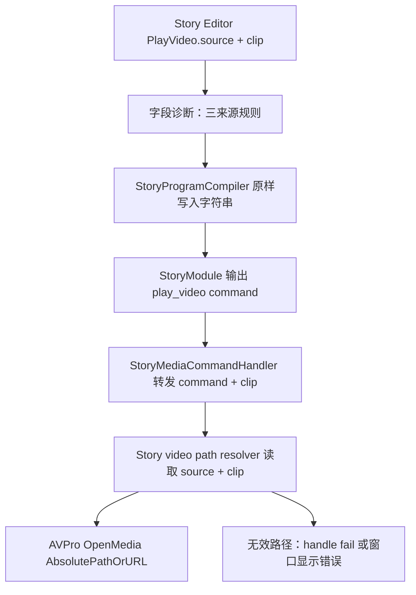

# Story Video Local Paths Design

## 0. 术语约定

| 术语 | 定义 | 防冲突结论 |
|---|---|---|
| Story 视频来源 | `play_video` 节点选择视频来自哪里 | 只允许三种：`streaming_assets`、`persistent_data_path`、`network_stream` |
| Story 视频路径 | `play_video` 命令参数 `clip` 中保存的字符串 | 仍是 Story command argument，不引入 Unity `VideoClip`、`guid:` 或 ResourceModule asset key |
| StreamingAssets 来源 | 指向 `Application.streamingAssetsPath` 下文件；`clip` 示例：`videos/0.mp4` 或 `Assets/StreamingAssets/videos/0.mp4` | 用于随包视频；运行时解析为 `Application.streamingAssetsPath/videos/0.mp4` |
| 持久化目录来源 | 指向 `Application.persistentDataPath` 下文件；`clip` 示例：`videos/0.mp4` | 用于下载/更新后视频；运行时解析为 `Application.persistentDataPath/videos/0.mp4` |
| 网络流来源 | 指向 AVPro 可打开的网络地址；`clip` 示例：`https://example.com/0.mp4` | 用于远端视频或直播流；运行时原样交给 AVPro |
| 项目资源包路径 | 指向普通 `Assets/...` 资产的路径，示例：`Assets/GameDeveloperKit/Simples/videos/0.mp4` | 不再是视频节点合法来源；图片和音频保持现有资源语义 |
| AVPro 路径解析 | 把 Story command 里的 `source + clip` 转为 `MediaPlayer.OpenMedia(MediaPathType.AbsolutePathOrURL, ...)` 可打开的路径 | Editor preview 与 Player 侧需要复用同一口径，避免一边能播一边不能播 |

## 1. 决策与约束

### 需求摘要

做什么：剧情编辑系统中 `PlayVideo.clip` 当前仍大量使用普通 `Assets/GameDeveloperKit/Simples/videos/...` 路径，这会把大视频资源当成项目资源/资源包资产看待。需要让视频节点显式支持三种来源：`StreamingAssets`、`Application.persistentDataPath` 和网络流，并统一 Story Editor 播放窗口、Player 侧 AVPro 播放器、示例 fixture 与诊断文案。

为谁：剧情编辑器使用者、Story Player 表现层、负责视频资源部署/更新的人。

成功标准：

- `play_video` 节点提供视频来源字段，且只支持 `streaming_assets`、`persistent_data_path`、`network_stream` 三种值。
- `source=streaming_assets` 时，`clip` 解析到 `Application.streamingAssetsPath` 下。
- `source=persistent_data_path` 时，`clip` 解析到 `Application.persistentDataPath` 下。
- `source=network_stream` 时，`clip` 必须是网络流地址并原样交给 AVPro。
- Editor 播放窗口与 Player 侧 `StoryAvProVideoCommandPlayer` 对同一个 `clip` 得到一致的 AVPro 打开路径。
- 示例 Story 资产和 canonical fixture 的视频路径改为 `Assets/StreamingAssets/videos/...`，不再指向 `Assets/GameDeveloperKit/Simples/videos/...`。
- `PlayVideo.clip` 的本地诊断不再把非普通 `Assets/...` 路径提示成“不推荐资源引用”；普通非 StreamingAssets `Assets/...` 视频直接判为不合法来源。
- Runtime Story 核心仍只保存字符串，不依赖 `Application.streamingAssetsPath`、`Application.persistentDataPath`、AVProVideo、AssetDatabase 或 ResourceModule。

明确不做：

- 不把视频资源重新接回 `ResourceModule` / 资源包 / AssetBundle。
- 不改变图片 `show_image.image` 和音频 `play_audio.clip` 的现有加载策略。
- 不引入 Unity 内置 `VideoPlayer`。
- 不支持任意本地绝对路径作为视频节点来源；本地视频只来自 StreamingAssets 或 `Application.persistentDataPath`。
- 不在 Story runtime 数据模型中保存平台绝对路径；绝对路径只在播放适配层解析产生。
- 不手动创建或移动 Unity `.meta` 文件；已有资源移动由 Unity/用户工作树负责。

### 复杂度档位

走项目内部工具默认档位，无偏离。补充两个相关维度：

- `Compatibility = current-only`：新 authoring/fixture 走三来源模型；旧普通 `Assets/...` 视频路径只用于诊断迁移提示，不保留为合法运行时来源。
- `Security = validated`：路径字符串来自 authoring/配置，解析器只做白名单前缀、空值和 `guid:` 拒绝，不做沙箱式权限隔离。

### 关键决策

1. 视频路径解析归 StoryPresentation / Editor playback，不进入 Story runtime。
   - `StoryMediaCommandHandler` 当前只从 command 取 `clip` 字符串并转发给 `IStoryVideoCommandPlayer`。
   - 保持这个边界；新增共享解析器应落在 AVPro 表现层可访问的位置，避免 `Runtime/Story` 依赖 Unity 路径 API。

2. 视频节点显式记录来源，不只靠路径前缀猜。
   - `NodeParameterDefinition` 当前已支持 `ParameterValueType.Option`，可承载 `streaming_assets`、`persistent_data_path`、`network_stream` 三个选项。
   - `clip` 保留为视频路径/URL 字符串；播放器拿到 `StoryCommand` 后可以同时读取 `source` 和 `clip`，不需要改 `IStoryVideoCommandPlayer.PlayVideo(command, context, clipPath)` 签名。

3. StreamingAssets 是随包视频的默认推荐表达。
   - 当前工作树已出现 `Assets/StreamingAssets/videos/0.mp4`、`2.mp4`、`4.mp4`、`6.mp4` 等文件，并且样例资产已经被改成 `Assets/StreamingAssets/videos/...`。
   - 编译产物继续保存这类稳定字符串；播放时才映射到 `Application.streamingAssetsPath`。

4. 持久化目录来自 `Application.persistentDataPath`，由 `source` 字段表达。
   - Player 侧现状会把普通相对路径用 `Path.GetFullPath(assetPath)` 解析到当前进程工作目录，含义不稳定。
   - 变化后普通相对路径只在已选来源的根目录下解释；`source=persistent_data_path` 时解析为 `Path.Combine(Application.persistentDataPath, clip)`。

5. Editor 预览和 Player 播放器共享同一套视频路径规则。
   - `StoryEditorAvProPlayback.ResolveMediaPath()` 目前只支持 URL、普通 `Assets/...` 和绝对路径，不支持 `StreamingAssets/` 前缀和持久化目录。
   - `StoryAvProVideoCommandPlayer.ResolveMediaPath()` 已支持 StreamingAssets，但仍把普通相对路径转成当前工作目录。
   - 本 feature 要把差异收口，避免编辑器预览和 Player 运行结果不同。

## 2. 名词与编排

### 2.1 名词层

#### 现状

- `NodeSchemaRegistry` 在 `Runtime/Story/AuthoringSchema/NodeSchemaRegistry.cs` 中声明 `PlayVideo.clip` 为 `AssetReference`，资源类型字符串为 `video`。
- `NodeParameterDefinition` / `ParameterValueType.Option` 已支持选项字段，当前 `JumpChapter.chapterId` 等路径已经能在 Story Editor 渲染选项型字段。
- `StoryProgramCompiler.BuildArguments()` 在 `Editor/StoryEditor/Compiler/StoryProgramCompiler.cs` 中把 asset reference 原样编译为 `StoryValue.FromString(value)`；`IsProjectAssetReference()` 只把普通 `Assets/...` 且 AssetDatabase 可加载的路径视为推荐，其余给 warning。
- `StoryEditorGraphAdapter.IsRecommendedAssetReference()` 也只推荐普通 `Assets/...` 项目资源路径，诊断文案是“建议使用 Assets/... 路径”。
- `StoryEditorAvProPlayback.ResolveMediaPath()` 把普通 `Assets/...` 映射到项目根目录下的文件，拒绝 `guid:`，不识别 `StreamingAssets/` 或持久化前缀。
- `StoryAvProVideoCommandPlayer.ResolveMediaPath()` 识别 `Assets/StreamingAssets/` 和 `StreamingAssets/`，但普通相对路径会落到 `Path.GetFullPath(assetPath)`。
- `StoryAuthoringAssetStore` 中 `IntroVideoPath` / `AlleyVideoPath` / `MapImagePath` 仍指向 `Assets/GameDeveloperKit/Simples/videos/...`；当前工作树里这些视频资源已删除并迁移到 `Assets/StreamingAssets/videos/`。

#### 变化

- `PlayVideo` 节点参数新增来源选项，编译后与 `clip` 一起进入 `StoryCommand.Arguments`：

```csharp
// 来源：NodeSchemaRegistry PlayVideo schema
Option("source", "来源", required: true, options:
    "streaming_assets",
    "persistent_data_path",
    "network_stream")
Asset("clip", "视频", "video", true)
```

- 新增或收敛一个视频路径解析契约，供 Editor preview 和 Player AVPro 共用：

```csharp
// 来源：StoryPresentation.AVPro / Editor playback path resolver
public static string ResolveVideoPath(string source, string clip)
// source=streaming_assets, clip="videos/0.mp4" -> Application.streamingAssetsPath + "/videos/0.mp4"
// source=streaming_assets, clip="Assets/StreamingAssets/videos/0.mp4" -> Application.streamingAssetsPath + "/videos/0.mp4"
// source=persistent_data_path, clip="videos/0.mp4" -> Application.persistentDataPath + "/videos/0.mp4"
// source=network_stream, clip="https://example.com/0.mp4" -> 原样返回
// source 缺失 / 非三选一、clip 为空、guid、普通资源包 Assets 路径、任意本地绝对路径 -> invalid
```

- `PlayVideo.clip` 的合法值由 `source` 决定：
  - `streaming_assets`：允许 `videos/0.mp4` 或过渡期可识别的 `Assets/StreamingAssets/videos/0.mp4`，最终解析到 `Application.streamingAssetsPath` 下。
  - `persistent_data_path`：允许相对路径，如 `videos/0.mp4`，最终解析到 `Application.persistentDataPath` 下。
  - `network_stream`：只允许 AVPro 可打开的网络流地址，如 `http://`、`https://` 或业务确认的流协议。
  - 错误或 invalid：空值、`guid:`、普通非 StreamingAssets `Assets/...`、任意本地绝对路径、普通相对路径但没有来源。

- 示例数据更新：
  - `IntroVideoPath` → `Assets/StreamingAssets/videos/0.mp4`
  - `AlleyVideoPath` → `Assets/StreamingAssets/videos/4.mp4` 或当前样例资产一致的目标文件
  - 图片路径不跟随视频策略，保留/迁移到图片自己的位置。

### 2.2 编排层



#### 现状

当前流程是线性数据透传：authoring 字段写 `clip` 字符串，compiler 原样保存到 `StoryCommand.Arguments`，Editor 播放窗口和 Player AVPro 各自解析。解析分叉导致：

- Editor preview 对 `StreamingAssets/videos/0.mp4` 返回 `null`，但 Player 侧可解析。
- Player 侧对 `intro.mp4` 这类普通相对路径会解析到进程当前目录，容易误以为可用。
- 诊断仍鼓励普通 `Assets/...`，与“视频放 StreamingAssets / persistentDataPath”目标冲突。

#### 变化

1. 字段编辑/诊断：`PlayVideo` 增加 `source` 选项，`clip` 按所选来源校验；普通资源包路径直接提示不支持。
2. 编译：compiler 原样保存 `source` 和 `clip` 字符串，不把路径转成平台绝对路径；来源缺失、非法来源、`guid:` 或不匹配来源的路径给 error。
3. Editor playback：调用共享解析器，按 `source + clip` 支持 StreamingAssets、`Application.persistentDataPath` 和网络流。
4. Player AVPro：调用同一解析器；普通相对路径只在已选本地来源根目录下解释，不再落到进程工作目录。
5. 示例/测试：canonical fixture、示例资产和相关断言迁移到 StreamingAssets 视频路径。

流程级约束：

- 错误语义：路径无法解析时，Editor 播放窗口显示中文错误；Player 侧 command handle `Fail(GameException)`。
- 幂等性：同一 `clip` 字符串重复解析无副作用；解析器不检查下载、不创建目录、不移动文件。
- 顺序/并发：不改变 AVPro 播放实例生命周期；每个命令仍由播放器实例负责事件解绑和销毁。
- 扩展点：业务仍可通过 `StoryAvProVideoCommandPlayer.PathResolver` 覆盖解析策略。
- 可观测点：播放窗口继续显示原始 `clip`，并可显示解析后的实际路径用于排查。

### 2.3 挂载点清单

- `PlayVideo.source` 节点字段：新增三来源选项，删掉它视频节点就失去来源选择能力。
- `PlayVideo.clip` 字段诊断规则：修改视频路径字段的来源匹配错误提示。
- Story AVPro 视频路径解析器：Editor preview 与 Player 播放共同挂入的路径转换入口。
- canonical Story sample fixture：示例剧情视频路径切到 `Assets/StreamingAssets/videos/...`。
- 现有播放窗口视频预览：显示原始路径和解析结果，路径错误时给中文错误。

### 2.4 推进策略

1. 编排骨架：抽出/收敛视频路径解析契约，并让 Editor preview 与 Player AVPro 都走同一规则。
   退出信号：同一组输入在两个入口解析结果一致。
2. 计算节点：实现三来源解析，覆盖 StreamingAssets、`Application.persistentDataPath`、网络流、`guid:`、普通资源包路径和本地绝对路径。
   退出信号：路径解析测试覆盖正常与错误输入。
3. 字段诊断：新增/渲染 `PlayVideo.source`，并调整 `clip` 的来源匹配规则和中文提示。
   退出信号：三种合法来源不报错；普通非 StreamingAssets `Assets/...`、绝对路径、`guid:` 和来源缺失均报错。
4. 示例数据：更新 fixture、示例资产和相关测试断言的视频路径。
   退出信号：grep 不再命中 `Assets/GameDeveloperKit/Simples/videos/*.mp4` 作为视频 clip。
5. 验证：运行可用的 Runtime/Editor 测试或编译，并记录无法运行的 Unity/AVPro 限制。
   退出信号：测试/编译通过，或阻塞原因清楚。

### 2.5 结构健康度与微重构

##### 评估

- compound convention 检索：`search-yaml.py --filter doc_type=decision --filter category=convention --query "目录组织 OR 命名 OR 归属"` 未命中既有 convention。
- 文件级 — `Assets/GameDeveloperKit/Editor/StoryEditor/Playback/StoryEditorAvProPlayback.cs`：244 行，职责集中在 Editor AVPro 预览；本次只替换路径解析入口，改动密度低。
- 文件级 — `Assets/GameDeveloperKit/Runtime/StoryPresentation.AVPro/StoryAvProVideoCommandPlayer.cs`：449 行，包含播放器与播放实例两个类；本次只调整 `ResolveMediaPath` 或改为委托共享解析，改动可控。
- 文件级 — `Assets/GameDeveloperKit/Editor/StoryEditor/StoryEditorGraphAdapter.cs`：1588 行，文件偏大且包含字段映射、诊断、窗口回调等多职责；本次只改 asset reference 诊断规则，不在这里继续拆。
- 文件级 — `Assets/GameDeveloperKit/Editor/StoryEditor/Compiler/StoryProgramCompiler.cs`：1868 行，已偏胖；本次只调整 asset reference warning/error 语义，不做 compiler 拆分。
- 目录级 — `Assets/GameDeveloperKit/Runtime/StoryPresentation.AVPro/`：同层约 22 个文件，已有 AVPro 表现层归属；若新增解析器文件，会落在现有 AVPro 表现层目录或其轻量子目录，新增数量小于目录重组阈值。
- 目录级 — `Assets/GameDeveloperKit/Editor/StoryEditor/Playback/`：文件数量少，适合保留 Editor preview 专属桥接。

##### 结论：不做微重构

本次不做“只搬不改行为”的微重构，原因：实际行为变化集中在路径规则，不需要先搬文件才能安全实现；两个偏胖文件属于既有结构债，拆分会扩大范围。新增共享解析器若实现阶段判断必须新建文件，应放在 AVPro 表现层可访问位置，保持 Runtime Story 核心隔离。

##### 超出范围的观察

- `StoryProgramCompiler.cs` 与 `StoryEditorGraphAdapter.cs` 长期偏胖，后续可走 `cs-refactor` 拆 command argument validation / field diagnostics，但不阻塞本 feature。

## 3. 验收契约

| 场景 | 输入 / 触发 | 期望可观察结果 |
|---|---|---|
| N1 StreamingAssets 完整路径 | `Assets/StreamingAssets/videos/0.mp4` | Editor preview 与 Player AVPro 均解析到 `Application.streamingAssetsPath/videos/0.mp4` |
| N2 StreamingAssets 短路径 | `StreamingAssets/videos/0.mp4` | 解析结果与 N1 一致 |
| N3 持久化路径 | `source=persistent_data_path`, `clip=videos/0.mp4` | 解析到 `Application.persistentDataPath/videos/0.mp4` |
| N4 网络流 | `source=network_stream`, `clip=https://example.com/video.mp4` | 原样传给 AVPro |
| N5 绝对路径 | 任意本地绝对路径 | 判为无效，不作为视频节点来源 |
| N6 `guid:` 输入 | `guid:xxxx` | 字段诊断/编译/播放至少一处明确判为无效，播放不静默尝试 |
| N7 普通相对路径无来源 | `source` 缺失，`clip=videos/0.mp4` | 判为无效，不解析到当前工作目录 |
| N8 普通 Assets 视频 | `Assets/GameDeveloperKit/Simples/videos/0.mp4` | 判为无效，提示视频只支持 StreamingAssets、persistentDataPath 或网络流 |
| N9 示例剧情 | 打开 canonical sample / 编译 sample | `play_video.clip` 使用 `Assets/StreamingAssets/videos/...` |
| N10 播放窗口 | 播放含 StreamingAssets 视频的章节 | AVPro 显示视频纹理，错误时显示中文路径错误 |
| E1 范围守护 | grep `ResourceModule` / `LoadAssetAsync` 在视频播放器改动中 | 不新增通过资源包加载视频的路径 |
| E2 范围守护 | grep Runtime Story 核心 | 不新增 AVProVideo、AssetDatabase、UnityEditor、Application 路径 API 依赖 |
| E3 范围守护 | grep `VideoPlayer` | 不新增 Unity 内置 VideoPlayer 后端 |
| E4 回归 | 图片/音频命令测试 | `show_image` 与 `play_audio` 现有资源语义不被视频路径规则误改 |

明确不做的反向核对：

- `StoryMediaCommandHandler` 不应调用 `App.Resource` 或 `ResourceModule`。
- `Runtime/Story` 不应出现 `Application.streamingAssetsPath`、`Application.persistentDataPath` 或 `AVProVideo`。
- 新代码不应新增 `UnityEngine.Video.VideoPlayer` 引用。

## 4. 与项目级架构文档的关系

验收后需要更新 `.codestable/architecture/ARCHITECTURE.md` 的 Story Editor / StoryPresentation.AVPro 小节：

- 名词：`play_video.source + clip` 是视频文件位置引用，只支持 StreamingAssets、`Application.persistentDataPath` 和网络流三种来源，不再等同普通项目资源路径。
- 动词骨架：Editor preview 与 Player AVPro 通过同一视频来源解析规则把 command argument 转为 AVPro 打开路径。
- 约束：Story runtime 核心仍不加载媒体；视频不走 ResourceModule / AssetBundle；播放适配层负责平台路径解析与错误展示。
