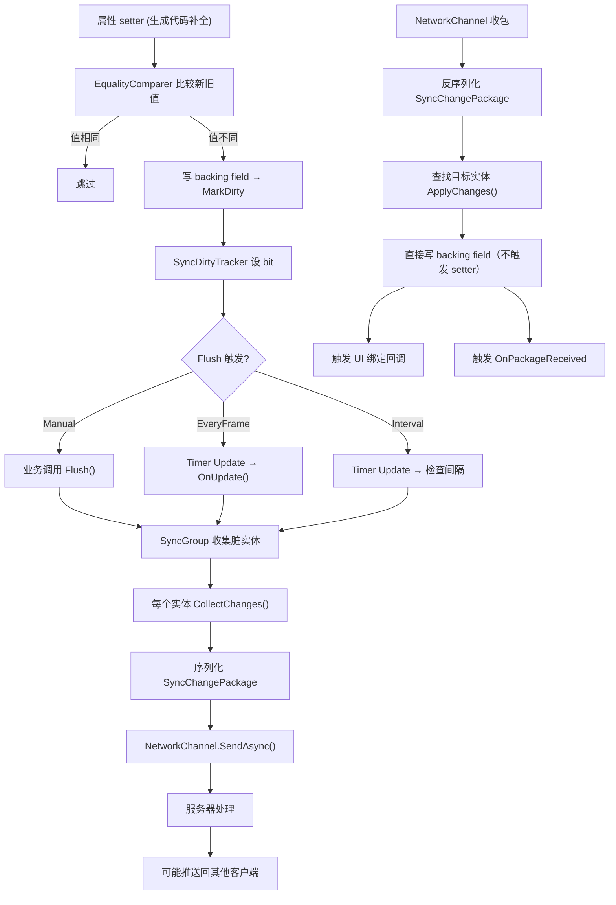

# sync-module design

## 0. 术语锁定

| 术语 | 含义 |
|---|---|
| Sync 实体 | 被 `[Sync]`（类级）标记的 `partial class` 实例，或拥有 `[Sync]` 属性的类实例，由 SyncModule 管理生命周期 |
| Sync 属性 | 被 `[Sync]`（属性级）标记的 `partial` 属性，或 `[Sync]` 类级标记下所有 public `partial` 属性，写入时由生成器补全的 setter 拦截并设脏标 |
| 字段组 | 同一 class 内所有 Sync 属性自动归为一组，以声明类路径为标识 |
| 脏标 (Dirty) | 字段自上次 flush 后已变更的标记 |
| Sync 组 | 一组共享相同同步策略的实体，绑定一个 Network channel |
| 变更包 | 一次 flush 的增量变更集合，包含多个 `SyncFieldChange` |
| Flush | 收集所有脏字段、序列化、发送的过程 |

## 1. 决策与约束

### 功能放在哪儿

SyncModule 是一个新的独立运行时模块，放在 `Runtime/Sync/` 目录下。
与现有模块的关系：
- **依赖 NetworkModule**：通过 `App.Network` 创建/获取 channel 进行收发
- **不依赖 EventModule**：Sync 变更不通过 Event 派发（避免 Event 的 queue 延迟），接收到的变更直接应用到实体
- **不依赖 DataModule**：Sync 管理的实体是内存中的实时状态，不是持久化数据
- **类比于 EventModule + SourceGenerator 的模式**：属性和源码生成器组合，编译期生成拦截代码，运行时设脏标

### 复杂度档位

偏离项目默认（内部工具 L2 + functions + reasonable + logged）：

| 维度 | 档位 | 理由 |
|---|---|---|
| 健壮性 | **L3 严防** | 网络输入校验、序列化异常隔离、channel 断线处理 |
| 结构 | **modules** | 新 Runtime/Sync 目录，源码生成器独立项目 |
| 可观测性 | **traced** | 同步链路可追踪：哪条变更、何时 flush、发送/接收状态 |
| 可演进性 | **active** | 当前在迭代，接口会随 UI 绑定、冲突策略等扩展调整 |

其余维度走默认：性能=reasonable, 可读性=team, 并发=single-threaded, 可测试性=testable, 安全性=validated。

### 不做什么（首版）

- **不做引用类型 / 集合属性同步**：`[Sync]` 仅支持值类型和 string
- **不做客户端预测 / 回滚**：不实现 prediction + reconciliation
- **不做冲突自动解决**：接收端直接覆盖；冲突策略预留扩展点但不实现
- **不做离线队列**：断线期间变更不缓存，flush 直接丢弃
- **不做加密 / 鉴权**：依赖 NetworkModule 已有能力
- **不做多播 / 房间**：Sync 组一对一绑定 channel，房间路由属于上层业务
- **不做服务端权威校验**：Sync 只管收发，服务端逻辑由业务实现

### 复杂度档位偏离确认

以上 L3 严防、traced 两个档位偏离项目内部工具默认，请确认是否接受。

## 2. 编排与变化

### 2.1 名词层

#### 现状

不存在 SyncModule 或任何 Sync/SyncClass/SyncField 相关类型。现有相关能力：
- `NetworkModule` (`Runtime/Network/NetworkModule.cs`)：提供 `CreateChannel()` / `GetChannel()` / channel 收发
- `EventModule` + `EventBindingSourceGenerator`：属性 + 源码生成器模式，`BindingAttribute` 标记 event handle 后生成自动订阅代码
- `DataModule` (`Runtime/Data/DataModule.cs`)：数据持久化管理，使用 `DataSlot` / `DataEntry` 模式

#### 变化

**SyncAttribute** — 统一的同步标记属性，可放在类或属性上：
```csharp
[AttributeUsage(AttributeTargets.Class | AttributeTargets.Property)]
public sealed class SyncAttribute : Attribute { }
```

**类级 `[Sync]`** — 标记整个类，该类的所有 public `partial` 属性全部参与同步，自动归为一个字段组：
```csharp
// 类级标记：所有 public partial 属性自动成为 Sync 属性
// 生成器补全 get/set，setter 中自动设脏标
[Sync]
public partial class PlayerState
{
    public partial int Health { get; set; }      // 自动同步
    public partial string Name { get; set; }     // 自动同步
    private int LocalCache { get; set; }          // 不同步（非 public）
}
```

**属性级 `[Sync]`** — 标记个别 `partial` 属性，按声明类的路径自动归组：
```csharp
// 属性级标记：只有标记的 partial 属性参与同步，按 class 路径自动成组
public partial class GameSettings
{
    [Sync] public partial float MasterVolume { get; set; }   // 归入 GameSettings 组
    [Sync] public partial bool Fullscreen { get; set; }      // 归入 GameSettings 组
    public string DebugLabel { get; set; }                    // 不同步（非 partial）
}
```

**类级 + 属性级混合** — 类级 `[Sync]` 的类内，可以额外用 `[Sync]` 标记非 public 属性使其参与同步：
```csharp
[Sync]
public partial class MixedExample
{
    public partial int A { get; set; }           // 自动同步（类级）
    public partial string B { get; set; }        // 自动同步（类级）
    [Sync] private partial int C { get; set; }   // 显式标记，覆盖类级规则，也参与同步
    private int D { get; set; }                   // 不同步
}
```

**编译器约束** — 源码生成器扫描时强制要求：
- 标记 `[Sync]` 的属性必须是 `partial` 属性（`partial` 关键字），否则编译报错
- 标记 `[Sync]` 的类必须是 `partial class`，否则编译报错
- 仅支持值类型和 `string`，引用类型/集合属性标记 `[Sync]` 编译报错（首版）

**SyncDirtyTracker** — 运行时赃标追踪器，由源码生成器为每个拥有 Sync 属性的类生成。类级 `[Sync]` 自动扫描所有 public `partial` 属性分配 bit 位；属性级 `[Sync]` 只为标记属性分配 bit 位：
```csharp
// 类级 [Sync] 生成：PlayerState 的 tracker
internal sealed class PlayerState_SyncTracker
{
    private uint m_DirtyMask;
    public bool IsDirty => m_DirtyMask != 0;
    public void MarkHealth() => m_DirtyMask |= 1 << 0;   // partial int Health
    public void MarkName()   => m_DirtyMask |= 1 << 1;   // partial string Name
    public uint GetMask() => m_DirtyMask;
    public void Clear() => m_DirtyMask = 0;
}

// 属性级 [Sync] 生成：GameSettings 的 tracker
internal sealed class GameSettings_SyncTracker
{
    private uint m_DirtyMask;
    public bool IsDirty => m_DirtyMask != 0;
    public void MarkMasterVolume() => m_DirtyMask |= 1 << 0;  // [Sync] float MasterVolume
    public void MarkFullscreen()   => m_DirtyMask |= 1 << 1;  // [Sync] bool Fullscreen
    public uint GetMask() => m_DirtyMask;
    public void Clear() => m_DirtyMask = 0;
}
```

**属性 setter 拦截** — 源码生成器补全 `partial` 属性的 get/set，setter 中比较新旧值并自动调用 `Mark*()`：
```csharp
// 生成代码示例：PlayerState 的 Health 属性补全
public partial int Health
{
    get => m_Health;
    set
    {
        if (EqualityComparer<int>.Default.Equals(m_Health, value)) return;
        var old = m_Health;
        m_Health = value;
        m_Tracker.MarkHealth();
        Group?.MarkDirty(EntityId, 0);
    }
}
private int m_Health;
```

来源：源码生成器项目 `GameDeveloperKit.Sync.SourceGenerator/`  
说明：每个 Sync 属性编译期分配固定 bit 位，`Mark*()` 方法在 setter 拦截中自动调用。类级扫描时只取 public `partial` 实例属性，过滤 static；混合模式下 `[Sync]` 标记的 private `partial` 属性也分配 bit。上限 32 个 Sync 属性（uint bitmask），超出编译期报错。值比较用 `EqualityComparer<T>.Default`，避免装箱。

**SyncFieldChange** — 单个字段变更的值对象（位于 Runtime/Sync）：
```csharp
public readonly struct SyncFieldChange
{
    public int FieldIndex { get; }
    public object OldValue { get; }
    public object NewValue { get; }
}
```

**SyncChangePackage** — 一次 flush 的变更包（位于 Runtime/Sync）：
```csharp
public sealed class SyncChangePackage
{
    public int EntityId { get; set; }
    public long SequenceId { get; set; }
    public long Timestamp { get; set; }
    public List<SyncFieldChange> Changes { get; set; }
}
```

**SyncGroup** — 同步组，管理一组实体的 flush 策略（位于 Runtime/Sync）：
```csharp
public sealed class SyncGroup
{
    public string Name { get; }
    public SyncFlushMode FlushMode { get; set; } // 见下文
    public float FlushInterval { get; set; }      // FlushMode=Interval 时生效

    public void RegisterEntity(ISyncEntity entity);
    public void UnregisterEntity(int entityId);
    public ISyncEntity GetEntity(int entityId);
    public void MarkDirty(int entityId, int fieldIndex);
    public void Flush();                           // 手动 flush
    internal void OnUpdate();                      // Timer Update 驱动自动 flush
}
```

**SyncFlushMode** 枚举：
```csharp
public enum SyncFlushMode
{
    Manual,     // 业务手动调用 Flush()
    EveryFrame, // 每帧 flush
    Interval,   // 按 FlushInterval 间隔 flush
}
```

**ISyncEntity** — Sync 实体契约（由源码生成器为每个拥有 Sync 属性的类生成实现）：
```csharp
public interface ISyncEntity
{
    int EntityId { get; }
    SyncGroup Group { get; }
    bool IsDirty { get; }
    SyncChangePackage CollectChanges();
    void ApplyChanges(SyncChangePackage package);
    void ClearDirty();
}
```

**SyncModule** — 模块本体（位于 Runtime/Sync）：
```csharp
[ModuleDependency(typeof(NetworkModule))]
[ModuleDependency(typeof(TimerModule))]
public sealed class SyncModule : GameModuleBase
{
    // 管理 SyncGroup
    public SyncGroup CreateGroup(string name, string channelName, SyncFlushMode mode);
    public SyncGroup GetGroup(string name);
    public bool TryGetGroup(string name, out SyncGroup group);

    // 注册/注销实体到 group
    public void RegisterToGroup(string groupName, ISyncEntity entity);
    public void UnregisterFromGroup(string groupName, int entityId);

    // 手动 flush 指定 group
    public void FlushGroup(string groupName);
    // 手动 flush 全部 group
    public void FlushAll();

    // UI 绑定
    public IDisposable BindToUI<T>(ISyncEntity entity, int fieldIndex, Action<T> onValueChanged);

    // 接收端回调注册
    public event Action<SyncChangePackage> OnPackageReceived;
}
```

App 入口（App.cs 新增）：
```csharp
public static SyncModule Sync => GetModule<SyncModule>();
```

### 2.2 编排层

#### 主流程



#### 发送流程详解

1. **属性写入拦截**：源码生成器为每个 Sync 属性（类级扫描的 public `partial` 属性 + 属性级 `[Sync]` 标记属性）补全 setter，拦截写入 → 比较新旧值（`EqualityComparer<T>.Default`）→ 值不同时设脏标 → 执行实际赋值。
2. **Flush 触发**：根据 SyncGroup 的 `FlushMode`：
   - `Manual`：业务在合适时机调用 `SyncModule.FlushGroup(name)`
   - `EveryFrame`：SyncModule 注册 Timer `UpdateTimerHandle`，每帧遍历 group 并 flush
   - `Interval`：同一 Update handle 中检查 `Time.realtimeSinceStartup - lastFlushTime >= FlushInterval`
3. **收集变更**：`Group.Flush()` 遍历已注册实体，对 `IsDirty=true` 的调用 `entity.CollectChanges()` 收集 `SyncFieldChange[]`
4. **序列化发送**：`SyncChangePackage` 序列化为 JSON 或 MessagePack，通过 `IChannel.SendAsync()` 发送
5. **清脏标**：发送成功后调用 `entity.ClearDirty()`

#### 接收流程详解

1. **收包**：SyncModule 在创建 SyncGroup 时向对应 NetworkChannel 注册全局 message listener
2. **反序列化**：收到 message 后反序列化为 `SyncChangePackage`
3. **应用变更**：按 `EntityId` 查找目标实体，调用 `entity.ApplyChanges(package)` —— 生成代码实现的 apply 逻辑直接写私有 backing field，不经过 partial 属性 setter（避免设脏标导致死循环）
4. **通知**：触发 `OnPackageReceived` 事件和已注册的 UI 绑定回调

#### 流程级约束

- **错误隔离**：单个实体的 `CollectChanges` / `ApplyChanges` 抛异常不阻断同组其他实体
- **发送和接收独立**：发送失败不阻断接收，接收失败不阻断发送
- **幂等性**：接收端 `ApplyChanges` 可重复调用同个 package，结果一致（覆盖写）
- **并发**：所有公开 API 假定 Unity 主线程调用
- **序列化异常**：序列化/反序列化失败记录错误到 Debug log，不抛给调用方

### 2.3 挂载点

按"删了它 feature 是否消失"判据：

1. **`[Sync]` 属性定义**（Runtime/Sync）— 删掉后编译期无标记，源码生成器无输入
2. **`App.Sync` 模块入口**（App.cs）— 删掉后无法按需获取 SyncModule
3. **`SyncModule.RegisterToGroup()` / `UnregisterFromGroup()`** — 删掉后实体无法接入同步
4. **`SyncGroup.Flush()` / OnUpdate() 驱动** — 删掉后脏标不发送
5. **`SyncModule.OnPackageReceived` 事件** — 删掉后接收端无通知（但 ApplyChanges 仍执行）

### 2.4 推进策略

按 paradigm 维度切片，每步独立可验证：

| 步骤 | 内容 | 退出信号 |
|---|---|---|
| 1 | **源码生成器**：Sync 属性（类级/属性级）+ 生成器项目 + 类级 public partial 属性扫描 + 属性级标记 + partial 属性 setter 补全 + 生成 ISyncEntity 实现 + SyncDirtyTracker | 编译通过 + 手动检查生成代码含 Mark/Collect/Apply + 类级/属性级/混合均正确 + 非 partial 编译报错 |
| 2 | **SyncModule 骨架**：SyncModule.cs + App.Sync 入口 + NetworkModule 依赖声明 + TimerModule 依赖声明 | 编译通过 + App.Sync 不抛异常（同步外壳创建成功） |
| 3 | **SyncGroup + 发送链路**：SyncGroup 注册/注销 + FlushMode 三种 + 序列化发送 + Timer Update 驱动 | 手写 Sync 实体改属性 → flush → Network channel 收到包 |
| 4 | **接收链路**：message listener + 反序列化 + ApplyChanges + OnPackageReceived | 模拟服务器推包 → 实体属性被更新 → 事件触发 |
| 5 | **UI 绑定**：BindToUI API + 回调注册/注销 + 接收端变更触发 UI 刷新 | 注册 UI 绑定 → 收到包 → 回调触发 |
| 6 | **测试覆盖**：生成器单元测试 + SyncModule 集成测试 + 错误路径（断线/序列化失败） | 全部通过 |

### 2.5 结构健康度与微重构

**评估前查 compound convention**：compound 目录无相关目录组织/文件归属 convention。

**文件级评估**：
- `App.cs`（618 行）— 本次只加 1 行 `App.Sync` 属性，改动量 < 1 行逻辑。文件偏大但本次改动极微，不触发拆分。
- 其余全部新文件，落在 `Runtime/Sync/` 下。

**目录级评估**：
- `Runtime/` 下现有 19 个子目录，新增 `Sync/` 是第 20 个，未超阈值。
- `Runtime/Sync/` 初始文件清单约 6-7 个 .cs 文件（SyncModule, SyncGroup, SyncAttribute, SyncFieldChange, SyncChangePackage, SyncFlushMode, ISyncEntity），加上源码生成器独立项目。

**结论：不做微重构。**
原因：改动量集中在新建文件，`App.cs` 仅加一行属性，无文件偏胖或目录摊平问题。

超出范围的观察：无。

## 3. 验收契约

### 正常路径

1. **属性变更 → 脏标 → flush → 发送**：Sync 属性被赋值（值不同）→ setter 设脏 → 同组 flush → 变更包到达 Network channel
2. **类级 `[Sync]` 自动成组**：`[Sync]` 标记 partial class → 所有 public `partial` 属性自动视为 Sync 属性 → 生成 tracker 含全部属性的 bit 位
3. **属性级 `[Sync]` 按路径归组**：同一 class 内多个 `[Sync]` 属性 → 自动归入该 class 的字段组 → 共享 tracker
4. **接收变更 → 应用到实体**：收到 `SyncChangePackage` → 对应 entity.ApplyChanges() → 属性值更新（绕过 setter 拦截，避免重入）
5. **UI 绑定自动刷新**：注册 `BindToUI(entity, fieldIndex, callback)` → 收到该属性变更 → callback 触发
6. **UI 反向同步**：业务代码在 UI 回调中直接写 `entity.Health = slider.value` → setter 拦截 → 设脏 → flush → 发送到服务器
7. **EveryFrame 自动 flush**：`FlushMode.EveryFrame` 的 group 每帧自动 flush 脏实体
8. **多个 SyncGroup 隔离**：Group A flush 只发送 A 的实体变更，不影响 Group B

### 边界路径

9. **值未变化不设脏**：setter 拦截中 `oldValue == newValue` → 不调用 MarkDirty → 不产生变更
10. **空 group flush**：group 中无脏实体时 flush → 无序列化 → 无发送
11. **未注册实体写属性**：未注册到 group 的实体写 Sync 属性 → MarkDirty 调用到 null group → 不崩溃（生成代码做空检查）
12. **属性数超限编译报错**：单个 class 超过 32 个 Sync 属性 → 生成器报编译错误（uint bitmask 上限）
13. **非 partial 属性标记报错**：`[Sync]` 标记非 `partial` 属性 → 生成器报编译错误
14. **非 partial class 标记报错**：`[Sync]` 标记非 `partial class` → 生成器报编译错误

### 错误路径

15. **序列化失败**：CollectChanges 中序列化异常 → 记录错误日志 → 该实体跳过 → 继续处理同组其他实体
16. **Network channel 未连接时 flush**：SendAsync 失败 → 记录错误 → 清脏标（避免脏标积压导致后续全量重发）
17. **接收端 unknown entity**：收到非本组注册 entityId 的 package → 记录警告 → 跳过
18. **ApplyChanges 异常**：反序列化成功后 apply 抛异常 → 记录错误 → 不阻断后续 package 处理

### 明确不做反向核对

- [ ] 不缓存断线期间变更（离线队列）
- [ ] 不自动重发失败的变更包
- [ ] 不支持 `List<T>` / `Dictionary<K,V>` 等集合属性的 `[Sync]`
- [ ] 不做全量快照校验（只有增量 diff）
- [ ] 不在 EventModule 中为 Sync 变更发送事件

## 4. 交叉关注

### 与 NetworkModule 的交互契约

- SyncModule 声明 `[ModuleDependency(typeof(NetworkModule))]`，由 App resolver 递归创建
- SyncModule 通过 `App.Network.GetChannel(name)` 获取已创建 channel（不自行创建）
- 发送消息通过 `IChannel.SendAsync()`，服务端需能解析 `SyncChangePackage`
- 接收消息通过 `IChannel` 的 message listener 注册

### 与 TimerModule 的交互契约

- SyncModule 声明 `[ModuleDependency(typeof(TimerModule))]`
- `EveryFrame` / `Interval` 模式的 SyncGroup 通过 `TimerModule.OnUpdate()` 注册 update handle
- `Shutdown()` 时取消所有 timer handles

### 与 UI 的交互

- `BindToUI<T>()` 返回 `IDisposable`，窗口关闭时 dispose 取消绑定
- UI 绑定在接收端变更时触发，不阻塞主线程
- 绑定不反向：UI 输入 → Sync 属性的路径由业务层自行处理（直接给属性赋值，setter 自然触发拦截）

### 源码生成器独立项目

- 位于 `GameDeveloperKit.Sync.SourceGenerator/`
- 参考 `GameDeveloperKit.Event.SourceGenerator/` 的项目结构
- 生成代码输出到 `{DeclaringClass}_Sync.g.cs`，包含 ISyncEntity 实现 + SyncDirtyTracker + partial 属性 get/set 补全 + ApplyChanges 实现
- 类级 `[Sync]` 扫描规则：取所有 public `partial` 实例属性
- 属性级 `[Sync]` 扫描规则：取标记的 `partial` 实例属性（含 private/protected）
- 混合模式：类级 `[Sync]` + 类内个别 `[Sync]` 标记的 private `partial` 属性 → 并集分配 bit 位
- setter 值比较使用 `EqualityComparer<T>.Default`，避免装箱
- ApplyChanges 直接写私有 backing field，绕过 setter 避免重入
- 约束检查：非 `partial` 属性/类标记 `[Sync]` → 编译报错；非值类型/string → 编译报错
