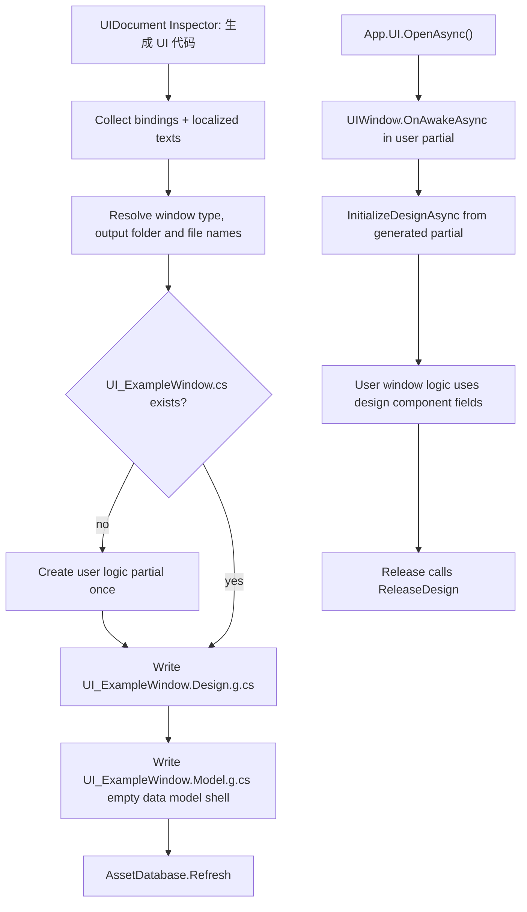

# ui-window-partial-codegen design

## 0. 术语约定

| 术语 | 定义 | 防冲突结论 |
|---|---|---|
| `UI_ExampleWindow` | 本次目标窗口类型名，继承 `GameDeveloperKit.UI.UIWindow` | 不指框架级 `UIModule`；它是具体业务窗口类型 |
| Window logic partial | 用户可编辑的 `UI_ExampleWindow.cs`，承载窗口业务逻辑 | 取代当前首次生成的 `ExampleController.cs` |
| Window design partial | 自动生成的 `UI_ExampleWindow.Design.g.cs`，承载 `UIOption`、组件字段、绑定初始化、本地化刷新和设计侧释放 | 和 logic partial 是同一个 C# 类型，不是派生类 |
| Data model | `UI_ExampleWindow` 的数据模型类型，只承载数据定义和后续数据绑定字段 | 当前尚未实现数据绑定，因此生成空 `*.Model.g.cs` 壳 |
| Window output folder | 选中输出目录下按 prefab 原名创建的一级子目录，例如 `UI_ExampleWindow.prefab` 输出到 `UI_ExampleWindow/` | 文件夹名就是当前 prefab 的文件名，不去前缀/后缀 |
| Per-window module | 当前生成的 `ExampleModule.g.cs` / 目标中的 `UI_ExampleModule` | 本 feature 停止生成；框架级 `GameDeveloperKit.UI.UIModule` 保留 |
| Controller | 当前生成的 `ExampleController.cs` | 本 feature 停止生成；用户逻辑直接写在窗口 partial |

防冲突结论：

- `.codestable/features/2026-05-27-ui-module/ui-module-design.md` 把四件套 `Window / Controller / Module / Model` 作为首版目标；本 feature 是对这条生成契约的收敛和替代。
- `.codestable/features/2026-05-31-uidocument-inspector-bindings/uidocument-inspector-bindings-design.md` 曾把“不改变四件套结构”列为范围守护；本 feature 明确突破这条历史守护，只调整生成代码结构，不改变 Inspector 绑定数据 schema。
- `UIModule` 仍是运行时打开窗口的框架模块；“不需要 module”只指每个窗口额外生成的 `UI_ExampleModule` helper。
- 组件引用属于 View/Design 绑定，不属于数据 Model；`Model` 留给数据定义和后续数据绑定能力，当前没有数据绑定时也生成空 `*.Model.g.cs` 壳。

## 1. 决策与约束

### 需求摘要

做什么：调整 `UIDocumentGenerator` 的输出契约，让 UI prefab 生成的代码从当前 `LoadingWindow.g.cs` + `LoadingModel.g.cs` + `LoadingModule.g.cs` + `LoadingController.cs`，收敛为“同一个窗口类型的 partial 文件”：

- `UI_ExampleWindow/UI_ExampleWindow.cs`：用户可编辑，`public sealed partial class UI_ExampleWindow : UIWindow`，承载实际逻辑。
- `UI_ExampleWindow/UI_ExampleWindow.Design.g.cs`：自动生成，给同一个 `UI_ExampleWindow` 注入 `UIOption`、组件字段、绑定初始化、本地化刷新和释放 helper。
- `UI_ExampleWindow/UI_ExampleWindow.Model.g.cs`：自动生成空壳，作为数据定义和后续数据绑定字段的承载点。

为谁：维护 UI prefab 绑定和窗口逻辑的业务开发者。目标是减少每个 UI 页面生成的顶层类型数量，让读代码时只围绕一个窗口类型展开。

成功标准：

- 对 `UI_ExampleWindow` 触发生成后，不再生成 `UI_ExampleModule.g.cs` 或 `UI_ExampleController.cs`。
- 业务逻辑写在 `UI_ExampleWindow.cs`，绑定代码写在 `UI_ExampleWindow.Design.g.cs`，二者编译后是同一个 `UI_ExampleWindow` 类型。
- 组件引用字段直接生成在 `UI_ExampleWindow.Design.g.cs`，不进入 `Model`。
- 当前未实现数据绑定时，`UI_ExampleWindow.Model.g.cs` 只生成空 `Model` 壳，不包含组件引用字段。
- 选中 `xxx` 作为输出目录时，实际输出到 `xxx/UI_ExampleWindow/`，避免多个窗口文件平铺在同一目录。
- 现有 `UIDocument` 的 `Mappings` / `LocalizedTexts` 数据继续可用，字段命名规则和本地化刷新语义不倒退。
- 生成文件只覆盖 `.g.cs`；用户可编辑的 `UI_ExampleWindow.cs` 只在不存在时创建。

### 明确不做

- 不修改 `UIModule.OpenAsync<T>()`、`Close<T>()`、`Switch<T>()`、`Back()`、安全区、资源加载或窗口栈语义。
- 不修改 `UIDocument` / `UIBindMapping` / `UILocalizedTextBinding` 的序列化结构。
- 不新增 UI Toolkit runtime、Addressables、动画框架或第三方依赖。
- 不继续生成每窗口 `Module` helper，也不生成 `Controller` 骨架。
- 不自动删除用户已编辑的旧 controller 文件；本仓库现有空的 Loading 示例可以在实现阶段作为迁移样本人工清理。
- 不把窗口命名、绑定字段命名扩展成完整 UI 命名规范治理；本 feature 只定义本次生成契约。

### 复杂度档位

走项目内部 Editor 工具默认档位，偏离点：

- `Compatibility = controlled generated API break`：这是生成代码契约变更，旧业务若引用 `LoadingModule.OpenAsync()`、`LoadingController` 或顶层 `LoadingModel`，需要迁移到 `App.UI.OpenAsync<LoadingWindow>()` / 窗口 partial / design 组件字段。
- `Robustness = L3`：生成器输出源码，必须在生成阶段发现非法类型名、重复字段、无效组件、本地化绑定不匹配等问题，不能生成半可编译代码。
- `Structure = modules`：`UIDocumentGenerator.cs` 已接近 700 行，本次先把模板输出做文件级微重构，再改生成契约。

### 关键决策

1. 每个 UI 页面只保留一个业务可见窗口类型。
   - 采用：`UI_ExampleWindow` 继承 `UIWindow`，业务逻辑和绑定设计通过 partial 拆文件。
   - 拒绝：继续生成 `UI_ExampleWindowController` 和 `UI_ExampleModule`。
   - 原因：Controller / Module 两层没有承载独立生命周期或模块边界，只让简单页面多出跳转类型。

2. 生成设计 partial，不让用户手写绑定细节。
   - `UI_ExampleWindow.Design.g.cs` 继续由 `UIDocumentGenerator` 覆盖。
   - 该文件暴露初始化/释放设计绑定的 helper，并维护 localization 订阅。
   - 用户逻辑文件调用这些 helper，避免业务代码手写 `Document.GetComponent<T>()`。

3. 用户逻辑文件只首次创建，之后不覆盖。
   - 首次生成 `UI_ExampleWindow.cs`，内容是最小可编译骨架。
   - 用户后续在这里写 `OnOpenAsync()`、按钮事件、状态刷新等实际逻辑。
   - 重新生成只更新 `.Design.g.cs` 和 `.Model.g.cs`。

4. 组件字段生成到 design partial，Model 只放数据。
   - 目标访问示例：`btn_close`、`text_title` 作为 `UI_ExampleWindow.Design.g.cs` 内的窗口成员字段。
   - 原因：这些字段是 prefab 组件引用，不是业务数据；放进 `Model` 会把 View 绑定和数据状态混在一起。
   - 当前数据绑定尚未实现，因此生成器输出空 `*.Model.g.cs` 壳。

5. 旧 helper 不再作为便捷入口。
   - 打开窗口统一使用 `App.UI.OpenAsync<UI_ExampleWindow>()`。
   - 关闭窗口统一使用 `App.UI.Close<UI_ExampleWindow>()`。
   - 不生成 `UI_ExampleModule.OpenAsync()` 包装，避免每个窗口多一个静态门面。

## 2. 名词与编排

### 2.1 名词层

#### 现状

- `Assets/GameDeveloperKit/Editor/UI/UIDocumentGenerator.cs` 现在根据 `UIDocument.Mappings` 生成 `Window.g.cs`、`Model.g.cs`、`Module.g.cs`，并首次生成 `Controller.cs`。
- 当前 `LoadingWindow.g.cs` 持有 `LoadingController m_Controller`，生命周期回调全部转发到 controller。
- 当前 `LoadingModel.g.cs` 是顶层 `LoadingModel`，不是 `LoadingWindow` 的内嵌类型。
- 当前 `LoadingModule.g.cs` 只是 `App.UI.OpenAsync<LoadingWindow>()` / `Close<LoadingWindow>()` 的静态包装。
- `Assets/GameDeveloperKit/Runtime/UI/UIWindow.cs` 已提供 `OnAwakeAsync()`、`OnOpenAsync()`、`OnEnable()`、`OnDisable()`、`Release()` 生命周期，足够让具体窗口直接承载业务逻辑。

#### 变化

生成输出从四件套改为三份围绕同一类型的文件；`Model.g.cs` 当前为空壳，后续有数据绑定字段后填充数据字段：

```text
UI_ExampleWindow.cs              // 用户可编辑，只首次创建
UI_ExampleWindow.Design.g.cs     // 自动生成，可覆盖
UI_ExampleWindow.Model.g.cs      // 当前生成空壳；未来有数据绑定字段时填充数据字段
```

这些文件写入选中输出目录下的窗口子目录：

```text
xxx/UI_ExampleWindow/UI_ExampleWindow.cs
xxx/UI_ExampleWindow/UI_ExampleWindow.Design.g.cs
xxx/UI_ExampleWindow/UI_ExampleWindow.Model.g.cs
```

目标用户文件示例：

```csharp
// 来源：UIDocumentGenerator 首次创建 UI_ExampleWindow.cs
using Cysharp.Threading.Tasks;
using GameDeveloperKit.UI;

public sealed partial class UI_ExampleWindow : UIWindow
{
    public override async UniTask OnAwakeAsync()
    {
        await InitializeDesignAsync();
    }

    public override UniTask OnOpenAsync()
    {
        return UniTask.CompletedTask;
    }

    public override void Release()
    {
        ReleaseDesign();
        base.Release();
    }
}
```

目标 Design partial 示例：

```csharp
// 来源：UIDocumentGenerator 覆盖 UI_ExampleWindow.Design.g.cs
using Cysharp.Threading.Tasks;
using GameDeveloperKit.UI;

[UIOption("Assets/GameDeveloperKit/Simples/UI/UI_ExampleWindow.prefab", UILayer.Window)]
public sealed partial class UI_ExampleWindow
{
    private global::UnityEngine.UI.Button btn_close;

    private UniTask InitializeDesignAsync()
    {
        btn_close = Document.GetComponent<global::UnityEngine.UI.Button>("b_Close");
        return UniTask.CompletedTask;
    }

    private void ReleaseDesign()
    {
        btn_close = null;
    }
}
```

目标 Model partial 示例（当前空壳）：

```csharp
// 来源：UIDocumentGenerator 覆盖 UI_ExampleWindow.Model.g.cs
public sealed partial class UI_ExampleWindow
{
    public sealed class Model
    {
    }
}
```

目标 Model partial 示例（未来数据绑定接入后）：

```csharp
// 来源：UIDocumentGenerator 覆盖 UI_ExampleWindow.Model.g.cs
public sealed partial class UI_ExampleWindow
{
    public sealed class Model
    {
        public int player_level;
        public string player_name;
    }
}
```

本地化绑定保留在 design partial 内：

```csharp
// 来源：UIDocumentGenerator 覆盖 UI_ExampleWindow.Design.g.cs
private void RefreshLocalization()
{
    text_title.text = App.Localization.GetText("ui.example.title");
}
```

### 2.2 编排层



#### 现状

- `UIDocumentInspector.Generate()` 只把 className、outputFolder、uiPath、layer 传给 `UIDocumentGenerator.Generate()`。
- `UIDocumentGenerator.Generate()` 内部固定拼出 `className + "Window"`、`className + "Controller"`、`className + "Module"`、`className + "Model"`。
- `GenerateWindow()` 生成生命周期 override，并把所有业务生命周期转发给 controller。
- `GenerateModule()` 总是生成静态 helper。
- `GenerateController()` 在 controller 不存在时创建用户可编辑文件。

#### 变化

1. 名称解析：
   - 如果 prefab 名已经是 `UI_ExampleWindow`，窗口类型保留为 `UI_ExampleWindow`。
   - 如果 prefab 名不是合法类型名，仍按现有规则转换为合法 C# 类型名，再补齐窗口后缀。
   - Model 文件名与窗口类型统一，`UI_ExampleWindow` 对应 `UI_ExampleWindow.Model.g.cs`；当前没有数据绑定时输出空壳。
   - 输出子目录由 prefab 文件名派生，`UI_ExampleWindow.prefab` 输出到 `UI_ExampleWindow/`，`Loading.prefab` 输出到 `Loading/`。

2. 输出文件：
   - 先在选中输出目录下创建窗口子目录。
   - 子目录中的 `.Design.g.cs` 每次覆盖。
   - 子目录中的 `.Model.g.cs` 每次覆盖；没有数据绑定字段时生成空 `Model` 壳。
   - 子目录中的 `UI_ExampleWindow.cs` 只在不存在时创建；若选中目录根部已有同名用户逻辑文件，不自动搬迁或覆盖。
   - 不写 `*Module.g.cs`。
   - 不写 `*Controller.cs`。

3. 生命周期：
   - 业务窗口仍通过 `UIWindow` 标准生命周期被 `UIModule` 调用。
   - 生成的 logic skeleton 在 `OnAwakeAsync()` 调用 `InitializeDesignAsync()`。
   - 生成的 logic skeleton 在 `Release()` 调用 `ReleaseDesign()` 后再 `base.Release()`。
   - 用户可以在同一个 `UI_ExampleWindow.cs` 中扩展 `OnOpenAsync()`、`OnEnable()`、`OnDisable()`，或者在 `OnAwakeAsync()` 调用设计初始化后追加业务初始化。

4. 本地化：
   - 有 `LocalizedTexts` 时，`.Design.g.cs` 生成 `RefreshLocalization()`、`LocaleChanged` 订阅和取消订阅。
   - 无 `LocalizedTexts` 时，生成代码不引用 `GameDeveloperKit.Localization`。
   - 订阅/取消仍封装在 `InitializeDesignAsync()` / `ReleaseDesign()` 中。

#### 流程级约束

- 错误语义：类型名非法、输出目录为空、uiPath 为空、字段名重复、组件缺失、本地化组件未绑定等继续在生成阶段抛 `GameException` 或 `ArgumentException`。
- 幂等性：重复生成同一 prefab 时，`.g.cs` 输出稳定；用户编辑过的 `UI_ExampleWindow.cs` 不被覆盖。
- 顺序：运行时 `OnAwakeAsync()` 必须先执行设计初始化，再执行用户自己的依赖绑定逻辑。
- 可卸载性：删掉 `.Design.g.cs` 后，窗口逻辑文件仍可见，但组件绑定能力消失并应编译失败提示缺失 helper 或组件字段。未来有数据绑定时，删掉 `.Model.g.cs` 只会移除数据绑定模型。
- 兼容性：旧 `*Module.g.cs`、`*Controller.cs` 不再由生成器维护；实现阶段迁移当前 Loading 示例时要先确认 controller 无业务代码。

### 2.3 挂载点清单

1. `UIDocumentGenerator` 输出契约：新增 `.Design.g.cs` 和空壳 `.Model.g.cs`，停止输出 per-window Module / Controller。
2. `UI_ExampleWindow.cs` 首次创建骨架：删除后用户没有窗口业务逻辑承载点。
3. `UI_ExampleWindow.Design.g.cs`：删除后 `UIOption`、绑定初始化、本地化刷新和释放 helper 消失。
4. design partial 组件字段：删除后强类型组件缓存消失。
5. `UIDocumentInspector.Generate()` 到 generator 的名称输入：删除后无法从 prefab 名推导新窗口类型和文件名。

拔除沙盘：移除这些挂载点后，`UIModule` 仍能打开手写 `UIWindow`，但 UIDocument 绑定代码不会再按新 partial 契约生成；旧四件套生成也不会恢复。

### 2.4 推进策略

1. 模板输出微重构：把 `UIDocumentGenerator` 里的脚本文本生成函数拆到 generator partial/helper 文件，只搬不改行为。
   - 退出信号：旧四件套输出内容不变，Editor 编译通过。
2. 名称契约：实现 `UI_ExampleWindow` 类型名和 `.Design` / `.Model` 文件名推导。
   - 退出信号：给定 prefab 名 `UI_ExampleWindow` 时，生成目标文件名和类型名符合第 2.1 节示例。
3. 新 partial 输出：生成 user logic skeleton 和 design partial，组件字段全部落在 design partial。
   - 退出信号：新生成结果不包含顶层 model、nested component model、module 或 controller 类型。
4. 生命周期与本地化接入：把组件字段初始化、localization 订阅/刷新和释放放进 design helper。
   - 退出信号：打开窗口后组件字段可用；语言切换刷新；Release 取消订阅并清空组件字段。
5. 迁移样本与范围守护：迁移当前 Loading 示例，确认旧 controller/module 不再被新窗口引用。
   - 退出信号：grep 不再命中新生成代码对 `LoadingController` / `LoadingModule` 的引用。
6. 验证覆盖：补生成器单元/编辑器验证或至少编译验证，覆盖正常、边界、错误场景。
   - 退出信号：`dotnet build GameDeveloperKit.Runtime.csproj --no-restore` 通过，Editor 侧生成器相关编译可验证。

### 2.5 结构健康度与微重构

##### 评估

- compound convention 检索：未命中“目录组织 / 命名 / 归属 / UI / 生成 / codegen”相关 convention decision。
- 文件级 - `Assets/GameDeveloperKit/Editor/UI/UIDocumentGenerator.cs`：当前约 692 行，混合收集校验、字段命名、四类脚本模板输出和本地化代码输出。本次会集中改模板输出，继续直接追加会让文件更胖。
- 文件级 - `Assets/GameDeveloperKit/Editor/UI/UIDocumentInspector.cs`：当前约 1130 行，但本 feature 只需要调整生成入口名称传递，改动密度低；不把 Inspector 拆分作为前置。
- 文件级 - `Assets/GameDeveloperKit/Runtime/UI/UIWindow.cs`：生命周期契约足够，本次不需要改。
- 目录级 - `Assets/GameDeveloperKit/Editor/UI/`：当前已有 `BindingTreeView.cs`、`UIDocumentGenerator.cs`、`UIDocumentInspector.cs`、`UIDocumentLocalizationDrawer.cs` 等文件；新增一个 generator partial/helper 属于现有 UI editor 工具归属，不需要重组目录。
- 目录级 - `Assets/GameDeveloperKit/Runtime/UI/Custom/`：当前有 Loading 四件套示例；迁移后文件数量减少，不需要新目录。

##### 结论：做微重构（拆文件）

先做文件级、只搬不改行为的微重构：

- 搬什么：把 `UIDocumentGenerator` 中负责生成 Window / Model / Module / Controller 文本的模板函数，以及必要的小型 template helper，搬到相邻 partial/helper 文件。
- 搬到哪：`Assets/GameDeveloperKit/Editor/UI/UIDocumentGenerator.Templates.cs` 或等价相邻文件。
- 行为不变怎么验证：微重构后用同一份 `UIDocument` 生成旧四件套，输出文本无语义差异；Editor 编译通过。

完成该微重构后，再把模板输出替换成新 partial 契约。

##### 超出范围的观察

- `UIDocumentInspector.cs` 已经偏胖，后续如果继续加生成选项、命名预览或批量迁移工具，建议单独走 `cs-refactor` 拆 Inspector。
- 如果团队要长期统一 `UI_` 前缀、`Window` 后缀、`.Design` / `.Model` 文件名规则，implement 跑通后可考虑用 `cs-decide` 归档为 convention。

## 3. 验收契约

| 编号 | 输入 / 触发 | 期望可观察结果 |
|---|---|---|
| N1 | 对无数据绑定的 prefab `UI_ExampleWindow.prefab` 点击“生成 UI 代码”，并选择输出目录 `xxx` | 输出 `xxx/UI_ExampleWindow/UI_ExampleWindow.cs`、`xxx/UI_ExampleWindow/UI_ExampleWindow.Design.g.cs`、`xxx/UI_ExampleWindow/UI_ExampleWindow.Model.g.cs`，Model 为空壳且不含组件字段 |
| N2 | 再次生成同一个 prefab | `.Design.g.cs` 被更新，`UI_ExampleWindow.cs` 不被覆盖 |
| N3 | 查看生成源码 | `public sealed partial class UI_ExampleWindow : UIWindow` 只作为同一个窗口类型存在，不出现 `UI_ExampleController` 或 `UI_ExampleModule` |
| N4 | 绑定 `b_Close` 的 Button 组件 | `UI_ExampleWindow.Design.g.cs` 包含 `btn_close` 字段，并通过 `Document.GetComponent<Button>("b_Close")` 赋值 |
| N5 | 业务逻辑访问绑定 | `UI_ExampleWindow.cs` 可直接访问同一 partial 类型中的 `btn_close` 组件字段 |
| N6 | 配置 Text/TMP localization key 后生成 | `.Design.g.cs` 包含 `RefreshLocalization()` 和 `App.Localization.GetText(key)`，无 localization binding 时不引用 Localization |
| N7 | 打开生成窗口 | `OnAwakeAsync()` 调用设计初始化后，组件绑定字段非空 |
| N8 | 关闭 / Release 生成窗口 | `ReleaseDesign()` 取消 localization 订阅并清空组件字段，随后调用 `base.Release()` |
| N9 | 迁移当前 Loading 示例 | 新生成代码不再引用 `LoadingController`、`LoadingModule` 或顶层 `LoadingModel` |
| B1 | prefab 名不是合法 C# 类型名 | 生成器给出合法类型名或明确错误，不输出非法源码 |
| B2 | 用户已经编辑过 `UI_ExampleWindow.cs` | 重新生成不覆盖用户文件 |
| B3 | 绑定组件形成重复字段名 | 生成失败并提示重复字段，不随机加后缀 |
| B4 | 本地化绑定组件未被 UI binding 选中 | 生成失败并提示先选择组件 |
| E1 | 实现中修改 `UIModule` 打开/关闭/Back/资源生命周期 | 判定为超范围 |
| E2 | 实现中继续生成 `*Module.g.cs` 或 `*Controller.cs` | 判定为未完成 |
| E3 | 实现中把组件绑定字段生成到 Model | 判定为未完成 |

### 明确不做的反向核对项

- 不应修改 `UIDocument` / `UIBindMapping` / `UILocalizedTextBinding` 序列化字段。
- 不应修改 `UIModule` 的窗口加载、层级、安全区、Back、Switch 或资源释放语义。
- 不应新增 Addressables、UI Toolkit runtime、动画框架或第三方依赖。
- 不应生成 per-window `Module` helper。
- 不应生成 per-window `Controller`。
- 不应把组件绑定字段生成到 `Model`。
- 当前无数据绑定时 `*.Model.g.cs` 应为空壳，不应包含组件字段。

## 4. 与项目级架构文档的关系

验收通过后需要更新 `.codestable/architecture/ARCHITECTURE.md` 的 UI 现状：

- 记录 `UIDocumentGenerator` 的当前生成契约已经从四件套收敛为 window partial + design partial + data model partial 空壳。
- 记录 per-window `Module` / `Controller` 不再是推荐或生成结构；业务逻辑写在具体 `UIWindow` partial。
- 记录 generated design partial 负责 `UIOption`、组件字段、组件绑定、本地化刷新和释放 helper；`Model` 只用于数据绑定。
- 记录 `UIModule` 本体的打开关闭、安全区、资源释放和窗口栈语义不随本 feature 改变。
