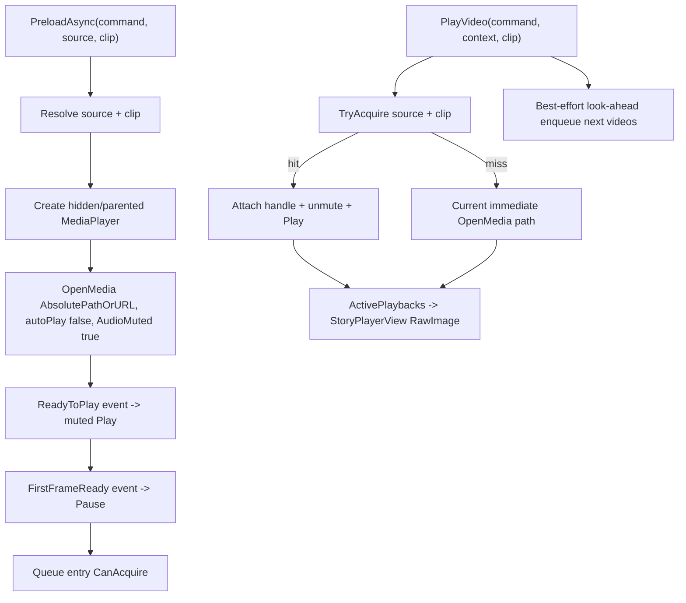

# Story Playback Video Prewarm Design

## 0. 术语约定

| 术语 | 定义 | 防冲突结论 |
|---|---|---|
| AVPro 视频预热 | 在真正执行 `play_video` 前，提前创建 AVPro `MediaPlayer` 并打开视频，等待 `ReadyToPlay` 或 `FirstFrameReady` | 只属于 `GameDeveloperKit.StoryPlayback`，不进入 `Runtime/Story` |
| 预热队列 | 按 `source + clipPath` 保存未被播放命令占用的预热播放器 | 不等同旧 `StoryRuntimeChapterPreload`，不扫描图片/音频，不显示 Loading UI |
| 预热句柄 | 调用方观察某条预热视频状态的对象 | 与 `IStoryCommandHandle` 区分：预热不推进剧情，也不完成 Story command |
| Acquire | `PlayVideo()` 命中队列后取得预热播放器所有权 | Acquire 后该播放器从队列移除，生命周期交给 `StoryAvProVideoPlayback` |
| ReadyToPlay | AVPro 已加载到可播放状态 | 对应 `MediaPlayerEvent.EventType.ReadyToPlay` |
| FirstFrameReady | AVPro 已产出可显示首帧纹理 | 对应 `MediaPlayerEvent.EventType.FirstFrameReady`，是减少 RawImage 空白期的主要目标 |
| 前瞻预热 | 当前视频开始播放后，播放器按当前 `StoryRuntimeContext` 尝试把后续少量视频命令放入队列 | best-effort 队列填充，不是章节资源预加载，不保证分支预测正确 |

术语 grep 结论：当前代码未出现 `StoryAvProVideoPreloadQueue`、`StoryAvProVideoPreloadHandle` 或 `StoryAvProVideoPreloadStatus`；历史旧 bootstrap 中有 `StoryRuntimeAvProPreloadedVideo`，但它与 Loading/Resource/章节扫描强耦合，本 feature 不复用该类型。

## 1. 决策与约束

### 需求摘要

做什么：在 `GameDeveloperKit.StoryPlayback` 的 AVPro 视频播放层增加队列预热能力。队列可以提前打开 `streaming_assets`、`persistent_data_path`、`network_stream` 三类视频，并在真正执行 `play_video` 时优先复用匹配的 `MediaPlayer`，避免每次切换都重新 OpenMedia 到首帧。

为谁：使用 `StoryPlayerView` 播放剧情的人、需要减少视频切换黑屏/空白期的剧情表现层、后续想手动预热首个视频的业务脚本。

成功标准：

- 存在 `StoryAvProVideoPreloadQueue`、`StoryAvProVideoPreloadHandle`、`StoryAvProVideoPreloadStatus` 三个预热名词。
- 预热队列按 `source + clipPath` 作为匹配 key，路径解析仍走 `StoryVideoPathResolver` 的三来源规则。
- `PreloadAsync()` 创建隐藏/挂载到播放根下的 AVPro `MediaPlayer`，打开视频并记录 `ReadyToPlay` / `FirstFrameReady` / `Failed` / `Canceled` 状态。
- `StoryAvProVideoCommandPlayer.PlayVideo()` 先尝试 Acquire 匹配预热播放器；命中时不重新创建/打开播放器，未命中时保持当前即时打开播放逻辑。
- Acquire 后播放器归 `StoryAvProVideoPlayback`，继续沿用 command handle 的完成、失败、取消、停止和释放语义。
- 队列容量满时只淘汰未 Acquire 的旧项，不停止 `ActivePlaybacks`。
- 预热失败只落到 preload handle，不自动 fail Story command；真正播放时仍由 `PlayVideo()` 的打开/播放结果决定。
- `StoryPlayerView` 创建默认 AVPro command player 时启用小容量队列，并允许配置 look-ahead 数量。

明确不做：

- 不恢复 `StoryRuntimeDemoBootstrap`、`StoryProcedure`、`StoryProcedureRequest` 或旧章节媒体预加载。
- 不打开 LoadingWindow，不等待首帧后再切 Procedure，不做 App/Resource/Config/Data/Sound 初始化。
- 不预加载图片或音频；本 feature 只处理 AVPro 视频。
- 不把视频接回 ResourceModule、AssetBundle 或 Resources。
- 不引入 Unity 内置 `VideoPlayer` 或可替换视频后端。
- 不修改 `StoryProgram`、`StoryFrame`、Story Editor graph 或 Story command 数据结构。
- 不在 `Runtime/Story` 引入 AVProVideo、UGUI、Application 路径 API 或 StoryPlayback 依赖。

### 复杂度档位

本 feature 走 runtime 播放组件默认档位，并显式偏离：

- `Robustness = L3`：预热、Acquire、取消、Dispose、容量淘汰都要有明确终态，重复调用不能泄漏 AVPro GameObject。
- `Structure = modules`：新增队列/句柄/状态独立文件，不把所有逻辑继续塞进 `StoryAvProVideoCommandPlayer.cs`。
- `Performance = budgeted`：容量默认小，避免无限 MediaPlayer；切换收益来自复用首帧纹理，不追求全章节全量缓存。
- `Concurrency = single-threaded`：公开 API 假定 Unity 主线程调用；不提供后台线程安全队列。
- `Testability = tested`：队列 key、容量、状态转换、Acquire ownership 和范围守护需要测试或编译证据。

### 关键决策

1. 预热队列放在 `StoryPlayback`，不放回 Story 核心。
   - `Runtime/Story` 只输出 command 数据和 `StoryRuntimeContext`。
   - AVPro `MediaPlayer`、首帧、纹理和播放器对象生命周期是播放实现细节。

2. 队列 key 使用 `source + clipPath`，路径解析仍集中在 `StoryVideoPathResolver`。
   - 视频来源已经只有 `streaming_assets`、`persistent_data_path`、`network_stream`。
   - 预热与播放必须使用同一来源语义，不能出现预热能打开但播放不能打开的分叉。

3. `StoryAvProVideoPlayback` 拆出“准备播放器”和“绑定 command handle 播放”两个阶段。
   - 当前 `StoryAvProVideoPlayback` 构造时必须有 command handle，`Play()` 直接 `OpenMedia(..., autoPlay:true)`。
   - 预热需要先没有 command handle 地创建/打开 AVPro，再在 Acquire 后绑定真实 command handle。

4. FirstFrame 预热采用“静音播放到首帧后暂停”的策略。
   - AVPro 通常需要播放推进才能产生首帧；只 `OpenMedia(autoPlay:false)` 不保证 RawImage 立即可见。
   - 预热阶段 `AudioMuted = true`，收到 `FirstFrameReady` 后 `Pause()`；Acquire 播放时恢复音频并继续 `Play()`。

5. 默认前瞻是 best-effort，不做剧情语义预测。
   - `StoryAvProVideoCommandPlayer` 可以在当前视频开始后，按当前章节步骤顺序扫描后续少量 `play_video` 命令并入队。
   - 它不追踪分支条件、不解析 graph target、不跨章节、不预热图片/音频；错预热的条目只占用队列容量，后续会被淘汰或清理。

## 2. 名词与编排

### 2.1 名词层

#### 现状

- `StoryAvProVideoCommandPlayer` 位于 `Assets/GameDeveloperKit/Runtime/StoryPlayback/StoryAvProVideoCommandPlayer.cs`，持有 `m_Playbacks`、`PathResolver`、`ActivePlaybacks` 和 `PlaybackStarted`。
- `StoryAvProVideoPlayback` 当前同文件内定义，内部构造函数要求 `StoryCommand` + `StoryCommandHandle` + resolved path；`Play()` 会创建 `MediaPlayer` 并立即 `OpenMedia(MediaPathType.AbsolutePathOrURL, ResolvedPath, true)`。
- `StoryPlayerView.EnsurePresenter()` 创建 `StoryAvProVideoCommandPlayer`，但没有预热配置，也不暴露预热入口；`UpdateVideoOutput()` 只从 `ActivePlaybacks` 找首帧纹理绑定到视频 `RawImage`。
- `StoryVideoPathResolver` 已支持三来源路径解析。
- 旧 `StoryRuntimeDemoBootstrap` 中曾有 `StoryRuntimeAvProPreloadedVideo`，但它扫描章节全部媒体、加载图片/音频资源、打开 Loading UI、等待首帧后切 Procedure，已被 roadmap 明确拆出播放层。

#### 变化

- 新增预热状态：

```csharp
// 来源：GameDeveloperKit.StoryPlayback AVPro prewarm
public enum StoryAvProVideoPreloadStatus
{
    Pending,
    ReadyToPlay,
    FirstFrameReady,
    Failed,
    Canceled
}
```

- 新增预热句柄：

```csharp
// 来源：GameDeveloperKit.StoryPlayback AVPro prewarm
public sealed class StoryAvProVideoPreloadHandle
{
    public StoryCommand Command { get; }
    public string Source { get; }
    public string ClipPath { get; }
    public string ResolvedPath { get; }
    public StoryAvProVideoPreloadStatus Status { get; }
    public Exception Error { get; }
    public bool IsTerminal { get; }
    public bool CanAcquire { get; }

    public event Action<StoryAvProVideoPreloadHandle> StatusChanged;
}
```

- 新增预热队列：

```csharp
// 来源：GameDeveloperKit.StoryPlayback AVPro prewarm
public sealed class StoryAvProVideoPreloadQueue : IDisposable
{
    public StoryAvProVideoPreloadQueue(
        Transform parent = null,
        bool dontDestroyOnLoad = true,
        int capacity = 2);

    public int Capacity { get; }
    public int Count { get; }

    public UniTask<StoryAvProVideoPreloadHandle> PreloadAsync(
        StoryCommand command,
        string source,
        string clipPath,
        CancellationToken cancellationToken = default);

    public bool TryAcquire(
        string source,
        string clipPath,
        out StoryAvProVideoPlayback playback);

    public void Release(string source, string clipPath);
    public void Clear();
}
```

- 扩展 AVPro command player：

```csharp
// 来源：StoryAvProVideoCommandPlayer
public sealed class StoryAvProVideoCommandPlayer : IStoryVideoCommandPlayer, IDisposable
{
    public Func<string, string> PathResolver { get; set; }
    public StoryAvProVideoPreloadQueue PreloadQueue { get; set; }
    public int PreloadLookAheadCount { get; set; }

    public UniTask<StoryAvProVideoPreloadHandle> PreloadVideoAsync(
        StoryCommand command,
        CancellationToken cancellationToken = default);

    public IStoryCommandHandle PlayVideo(
        StoryCommand command,
        StoryRuntimeContext context,
        string clipPath);
}
```

- 调整播放实例生命周期：
  - `StoryAvProVideoPlayback` 可以由即时播放路径创建，也可以由队列预热路径创建。
  - 预热阶段可以没有 command handle；Acquire 后绑定 command/handle、恢复音频、订阅取消/停止，并进入 active playback。
  - 若 Acquire 时已经 `HasFirstFrame == true`，`PlaybackStarted` / `FirstFrameReady` 要能立即触发，让 `StoryPlayerView` 同帧把纹理放到 `RawImage`。

### 2.2 编排层



#### 现状

当前播放流程是线性的：

1. `StoryMediaCommandHandler.Execute()` 从 command 取 `clip`，调用 `IStoryVideoCommandPlayer.PlayVideo(command, context, clip)`。
2. `StoryAvProVideoCommandPlayer.PlayVideo()` 解析路径、创建 `StoryAvProVideoPlayback`、加入 `m_Playbacks`、调用 `playback.Play()`。
3. `StoryAvProVideoPlayback.Play()` 创建 AVPro `MediaPlayer` 并 `OpenMedia(..., autoPlay:true)`。
4. `FirstFrameReady` 后 `StoryAvProVideoCommandPlayer.PlaybackStarted` 通知 `StoryPlayerView`，`StoryPlayerView.UpdateVideoOutput()` 才能把纹理设置给 `RawImage`。

这意味着每次切到新视频都要等待创建播放器、打开媒体、解码到首帧，中间 `RawImage` 没有新纹理时会出现空白期。

#### 变化

1. 队列预热：业务或 command player 前瞻调用 `PreloadAsync()`，队列为 `source + clip` 创建预热播放器。
2. 状态推进：AVPro 事件把 handle 从 `Pending` 推进到 `ReadyToPlay` / `FirstFrameReady`；错误推进到 `Failed`，取消推进到 `Canceled`。
3. 播放接管：`PlayVideo()` 解析同一个 `source + clip` 后先 `TryAcquire()`；命中则把预热播放器转为 active playback，未命中则走原即时播放逻辑。
4. UI 输出：Acquire 的播放器若已有首帧，`StoryPlayerView` 不需要等新 OpenMedia，下一次 `UpdateVideoOutput()` 或 immediate callback 就能绑定纹理。
5. 前瞻填充：当前 `play_video` 开始后，command player 根据 `StoryRuntimeContext.Chapter.Steps` 中当前 step 的后续顺序，最多 enqueue `PreloadLookAheadCount` 个 `play_video`。

流程级约束：

- 错误语义：预热失败只设置 preload handle 的 `Failed` 和 `Error`；不调用 command handle `Fail()`。真实 `play_video` 命令只在 `PlayVideo()` 自身打开/播放失败时 fail。
- 幂等性：同一 `source + clip` 已在队列中时，重复 `PreloadAsync()` 返回同一语义的 handle，不创建第二个 AVPro 播放器。
- 容量：容量满时淘汰最旧且未 Acquire 的条目；不得 dispose `ActivePlaybacks`。
- 取消：传入 cancellation token 取消 pending/ready entry 时，条目标记 `Canceled` 并释放 AVPro 对象；已 Acquire 的播放不受该 token 影响。
- 顺序：`TryAcquire()` 只对 `ReadyToPlay` 或 `FirstFrameReady` 条目成功；仍在 `Pending` 的条目不阻塞同步 `PlayVideo()`，播放路径会走即时 fallback 并可释放旧 pending entry。
- 生命周期：`StoryAvProVideoCommandPlayer.Dispose()` 必须同时 dispose active playbacks 和 `PreloadQueue`。
- 可观测点：preload handle 暴露 source、clip、resolved path、status 和 error；`PlaybackStarted` 继续只表示 active playback 可显示。
- 扩展点：`PathResolver` 兼容保留；存在自定义 resolver 时，预热与即时播放必须共用同一个 resolved path 口径。

### 2.3 挂载点清单

- `StoryAvProVideoCommandPlayer.PreloadQueue`：新增默认 AVPro 播放器的队列挂入口，删掉它预热能力即消失。
- `StoryAvProVideoCommandPlayer.PreloadLookAheadCount`：新增前瞻预热配置，控制自动 enqueue 后续视频数量。
- `StoryAvProVideoPreloadQueue`：新增公开队列 API，承载手动预热、容量、Acquire、Release 和 Clear。
- `StoryAvProVideoPreloadHandle` / `StoryAvProVideoPreloadStatus`：新增可观察状态契约。
- `StoryPlayerView` 视频播放器配置：默认创建 command player 时配置小容量队列与 look-ahead，不接入 LoadingWindow 或 UIModule 业务逻辑。

### 2.4 推进策略

1. 结构微重构：先把 `StoryAvProVideoPlayback` 从 command player 文件拆出，保持即时播放行为不变。
   退出信号：`StoryAvProVideoCommandPlayer` 的 public API 和即时播放路径不变，相关程序集编译通过。
2. 队列名词骨架：新增 preload status、handle、queue 的基本状态机和容量管理。
   退出信号：可在不接 StoryPresenter 的情况下创建队列、入队、重复入队、淘汰、清理。
3. AVPro 准备节点：让队列创建 MediaPlayer、监听 ReadyToPlay/FirstFrameReady/Error，并在首帧后暂停。
   退出信号：预热状态能从 Pending 推进到 ReadyToPlay/FirstFrameReady/Failed/Canceled，Dispose 无遗留 GameObject。
4. PlayVideo 接管：`PlayVideo()` 先 Acquire，命中走预热播放器，未命中走即时打开；active playback 语义保持。
   退出信号：命中预热时不重新 OpenMedia，FirstFrameReady 可立即驱动 RawImage；未命中时现有测试/行为不退化。
5. 前瞻与默认配置：接入 `PreloadLookAheadCount`，并让 `StoryPlayerView` 默认创建小容量队列。
   退出信号：当前视频播放后会 best-effort enqueue 后续视频；不触碰 Loading/Procedure/Resource 初始化。
6. 验证与范围守护：补测试/编译/grep，覆盖 queue 状态、容量、Acquire ownership、路径三来源和明确不做。
   退出信号：可用 build/tests 通过，或 Unity/AVPro runtime 限制已记录。

### 2.5 结构健康度与微重构

##### 评估

- compound convention 检索：`search-yaml.py --filter doc_type=decision --filter category=convention --query "目录组织 OR 命名 OR 归属"` 未命中既有 convention。
- 文件级 — `Assets/GameDeveloperKit/Runtime/StoryPlayback/StoryAvProVideoCommandPlayer.cs`：355 行，当前混合 command player 与 playback 两个类；本次要新增预热队列接线、Acquire 分支和生命周期拆分，继续塞入会接近/超过 500 行且职责变多。
- 文件级 — `Assets/GameDeveloperKit/Runtime/StoryPlayback/StoryPlayerView.cs`：739 行，偏胖，职责包含默认 UI 创建、模块解析、Presenter wiring、UGUI 渲染、按钮事件和视频纹理刷新；本次只新增少量视频预热配置，不重构 UI。
- 目录级 — `Assets/GameDeveloperKit/Runtime/StoryPlayback/`：当前约 11 个非 `.meta` 文件，本次会新增 3 个左右预热相关文件；目录已经是稳定播放包归属，但暂不拆 `AVPro/` 子目录，避免把 AVPro 重新包装成独立层。

##### 结论：微重构（拆文件）

第一步先做“只搬不改行为”的文件级微重构：把 `StoryAvProVideoPlayback` 从 `StoryAvProVideoCommandPlayer.cs` 拆到独立 `StoryAvProVideoPlayback.cs`。这能让 command player 文件继续承担编排入口，播放实例文件承担 AVPro 生命周期，后续新增 queue/handle/status 不把一个文件推成混合大文件。

##### 方案

- 搬什么：`StoryAvProVideoPlayback` 整个类型及其 AVPro playback 生命周期逻辑。
- 搬到哪：`Assets/GameDeveloperKit/Runtime/StoryPlayback/StoryAvProVideoPlayback.cs`。
- 行为不变怎么验证：拆分后 `StoryAvProVideoCommandPlayer.PlayVideo()` 的 public API、事件和即时播放路径保持一致；`GameDeveloperKit.StoryPlayback.csproj` 编译通过。
- 步骤序列：
  1. 新建 playback 文件，保持 namespace、类型名、成员可见性不变。
  2. 从 command player 文件删除原类型定义，只保留 command player。
  3. 编译 StoryPlayback，确认无接口签名变化。

##### 超出范围的观察

- `StoryPlayerView.cs` 已明显偏胖，后续如果继续扩默认 UI，建议单独走 `cs-refactor` 拆默认 UI builder / runtime renderer；本 feature 不做 UI 结构重划。

## 3. 验收契约

| 场景 | 输入 / 触发 | 期望可观察结果 |
|---|---|---|
| N1 手动预热 StreamingAssets | `source=streaming_assets`, `clip=Assets/StreamingAssets/videos/0.mp4` | preload handle 进入 `ReadyToPlay` 或 `FirstFrameReady`，resolved path 位于 `Application.streamingAssetsPath` |
| N2 手动预热 persistentDataPath | `source=persistent_data_path`, `clip=videos/0.mp4` | resolved path 位于 `Application.persistentDataPath` |
| N3 手动预热网络流 | `source=network_stream`, `clip=https://example.com/video.mp4` | resolved path 原样为 URL，并交给 AVPro `AbsolutePathOrURL` |
| N4 重复预热同一 key | 连续调用 `PreloadAsync(command, source, clip)` | 队列不创建重复 MediaPlayer，返回同一队列条目的状态观察 |
| N5 容量淘汰 | 容量为 1 时预热两个不同视频 | 第一个未 Acquire 条目被释放，第二个保留；active playback 不受影响 |
| N6 PlayVideo 命中预热 | 预热条目已 FirstFrameReady 后执行同 source/clip 的 `play_video` | `PlayVideo()` Acquire 该播放器，不重新打开同一媒体；`ActivePlaybacks` 包含 acquired playback |
| N7 PlayVideo 未命中预热 | 队列为空或条目仍 Pending 时执行 `play_video` | 保持当前即时 OpenMedia 播放行为，并返回有效 command handle |
| N8 预热失败 | source/clip 非法或 AVPro Error | preload handle 为 `Failed`，Story command 不自动失败；后续 `PlayVideo()` 决定真实播放结果 |
| N9 取消预热 | cancellation token 在 Acquire 前取消 | handle 为 `Canceled`，MediaPlayer 释放；不会进入 `ActivePlaybacks` |
| N10 前瞻预热 | 当前视频播放后，后续章节步骤中存在其他 `play_video` | command player best-effort enqueue 最多 `PreloadLookAheadCount` 个后续视频 |
| N11 RawImage 首帧 | Acquire 已有首帧的 playback | `StoryPlayerView.UpdateVideoOutput()` 能拿到 `CurrentTexture` 并显示 `VideoOutput` |
| B1 范围守护 | grep `LoadingWindow` / `LoadingModule` / `App.Startup` / `ChangeAsync` | 本 feature 不新增启动、Loading 或 Procedure 编排 |
| B2 范围守护 | grep `ResourceModule` / `LoadAssetAsync` in video prewarm files | 预热视频不走资源包或图片/音频预加载 |
| B3 范围守护 | grep `Runtime/Story` | 不新增 AVProVideo、UGUI、Application 路径 API 或 StoryPlayback 依赖 |
| B4 范围守护 | grep `UnityEngine.Video.VideoPlayer` | 不新增 Unity 内置 VideoPlayer 后端 |

明确不做的反向核对：

- 新代码不应恢复 `StoryRuntimeDemoBootstrap`、`StoryProcedure` 或 `StoryProcedureRequest`。
- `StoryAvProVideoPreloadQueue` 不应调用 `App.Resource`、`LoadingModule`、`App.Procedure` 或 `UIModule`。
- `StoryPlayerView` 只配置/使用视频预热队列，不等待预热完成后再开始剧情。
- `Runtime/Story` 不应引用 `RenderHeads.Media.AVProVideo`。

## 4. 与项目级架构文档的关系

验收后需要更新 `.codestable/architecture/ARCHITECTURE.md` 的 Story / StoryPlayback 小节：

- 名词：补充 `StoryAvProVideoPreloadQueue`、`StoryAvProVideoPreloadHandle`、`StoryAvProVideoPreloadStatus`。
- 动词骨架：记录 `PlayVideo()` 优先 Acquire 预热播放器，未命中时 fallback 到即时打开；`StoryPlayerView` 通过 active playback 纹理更新 `RawImage`。
- 约束：预热只负责 AVPro `MediaPlayer` 准备和复用，不做章节资源预加载、Loading UI、Procedure 切换、ResourceModule 视频加载或 Story 核心依赖。

验收后还需要更新 `.codestable/requirements/story-module.md`：追加 StoryPlayback 已支持 AVPro 视频队列预热；若该 roadmap 最后一项也完成，可再评估 requirement 是否从 `draft` 升为 `current`。
