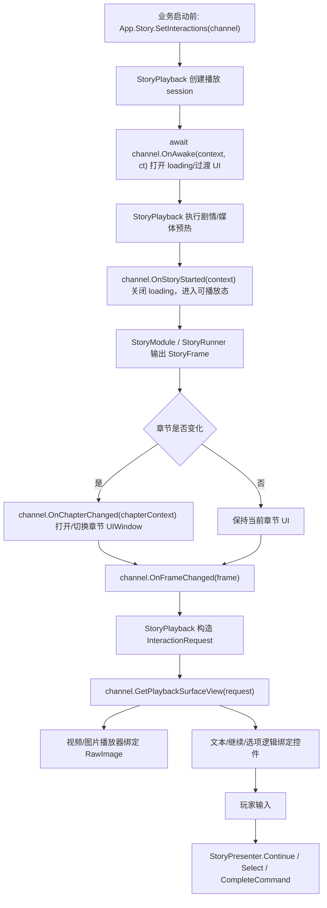

# Story Playback View Input Layers Design

## 0. 术语约定

| 术语 | 定义 | 防冲突结论 |
|---|---|---|
| `IInteractionChannel` | 剧情交互通道入口；接收 story/chapter/frame 生命周期通知，按章节创建或切换 UI，并返回播放所需 surface | 本 feature 只保留这一层交互接口，不再拆 provider/controller/旧 layer |
| `InteractionRequest` | StoryPlayback 向交互通道询问 surface 时传入的请求对象，包含当前 frame、track、command、choices 和请求类型 | 不是新的 Story runtime step，也不写入 `StoryFrame` |
| `PlaybackSurfaceView` | 交互通道返回的当前 UI surface 集合，例如视频 `RawImage`、图片 `RawImage`、文本、继续按钮、选项按钮列表、自定义根节点 | 只是 UI 引用集合，不表达 layout slot / anchor preset |
| Chapter UI | 交互通道根据当前章节打开或复用的 UIWindow / prefab / 场景 UI | `StoryModule` 不知道窗口类型、prefab 或创建过程 |
| `StoryPlayerView` | 现有 UGUI 播放组件和默认 fallback UI | 保留兼容；默认实现可以包装成一个 interaction channel |

接口命名结论：保留 `IInteractionChannel` 作为唯一交互通道入口；不再使用 `IStoryPlaybackSurfaceProvider`、`IStoryChapterInteractionProvider`、旧名 `IStoryInteractionLayer` / `IStoryInteractionChannel` 或 `IStoryInteractionController`。它们会把一个很直接的问题拆成多层心理负担。

## 1. 决策与约束

### 需求摘要

做什么：新增一个简单交互通道注册入口：

```csharp
App.Story.SetInteractions(interactionChannel);
```

播放时，StoryPlayback 把当前 story/chapter/frame 的生命周期通知交互通道。交互通道自己决定当前章节要打开哪个 UIWindow、使用哪个 prefab、怎么布局。StoryPlayback 只在需要播放视频、显示图片、渲染文本或显示按钮时，构造 `InteractionRequest`，调用：

```csharp
var surface = interactionChannel.GetPlaybackSurfaceView(request);
```

然后把返回的 `RawImage`、文本、按钮和容器交给媒体播放器或默认输入逻辑使用。

为谁：需要章节专属 UI 的剧情业务、需要非全屏视频/图片 surface 的互动影游流程、后续 seek/QTE/unlock 等交互扩展。

成功标准：

- 对外只需要理解一个入口：`App.Story.SetInteractions(channel)`。
- `IInteractionChannel` 收到 awake / story started / chapter changed / frame changed / story stopped 通知。
- `OnAwake` 在剧情预热前调用并返回 `UniTask`，可用于打开 loading 或过渡 UI；`OnStoryStarted` 固定表示剧情预热完成，可关闭 loading。
- 章节切换必须先通知 interaction channel，再请求当前 frame 的 surface，避免拿到上一章或空 UI。
- `GetPlaybackSurfaceView(request)` 能返回视频 `RawImage`、图片 `RawImage`、文本、继续按钮、等量 `ChoiceButtons` 和 custom root。
- 默认 `StoryPlayerView` 仍能作为 fallback 跑现有测试，不要求业务一开始就写自定义 channel。
- `Runtime/Story` 的 `StoryRunner`、`StoryFrame`、`StoryStep`、`Parallel + Wait + Choice/Command` 语义不改。

### 复杂度档位

- `Structure = simple`：只新增一个交互通道接口和两个数据对象，不设计 provider/controller/旧 layer 三套扩展点。
- `UI topology = chapter-driven`：不同章节 UI 由 interaction channel 自己创建或切换，Story 不关心 UIWindow 细节。
- `Compatibility = high`：`StoryPlayerView.Play()`、`PlayRegistered()`、`StopPlayback()`、`Continue()`、`Select()` 保持兼容。
- `Runtime coupling = controlled`：调用形态是 `App.Story.SetInteractions(...)`，实现上应放在 StoryPlayback 扩展/registry 中，避免 `Runtime/Story` 直接依赖 UGUI/AVPro。
- `Future extensibility = reserved`：seek/QTE/unlock 后续都通过 request + surface 复用这个入口，不再加平行交互体系。

### 命名约束

现有运行时代码已经位于 `GameDeveloperKit.Story` 命名空间，新增公开类型不再默认加 `Story` 前缀。本 feature 使用 `IInteractionChannel`、`InteractionRequest`、`PlaybackSurfaceView`、`DefaultInteractionChannel`。已有 `StoryFrame`、`StoryCommand`、`StoryPresenter`、`StoryPlayerView` 等类型保持原名，不在本 feature 中做全仓库重命名；如果后续要清理 `StoryProgram` / `StoryFrame` 这类历史命名，应单独走 refactor。

### 关键决策

1. `App.Story.SetInteractions(channel)` 是唯一业务注册入口。
   - 调用侧不需要理解 surface provider、chapter provider、旧 layer 或 controller。
   - 实现侧可以用 StoryPlayback extension method / registry 达成这个调用形态，保持 Story 核心不引用 UI 类型。

2. Interaction channel 接收章节，而不是让 Story 推断 UI。
   - `OnChapterChanged(context)` 是硬生命周期事件。
   - channel 可以在这里打开 `Chapter1StoryWindow`、关闭上一章窗口、缓存当前 surface。
   - StoryPlayback 后续所有 surface 请求都基于这个已切好的章节 UI。

3. `GetPlaybackSurfaceView(request)` 是唯一 surface 查询口。
   - 视频、图片、文本、继续、选项、自定义 UI 都用同一个 request 询问。
   - request 里带 frame / track / command / choices，channel 可以按章节和请求类型返回不同 UI 引用。

4. StoryPlayback 负责把 frame 投影成 request。
   - Story runtime 不新增 `Interactions` 集合。
   - `Choice` 仍来自 `frame.Choices`，继续仍来自 frame gate，媒体仍来自 command track。

5. 默认实现只覆盖 continue / choice / text / media surface。
   - QTE、unlock、seek 不在本 feature 实现。
   - 后续实现这些能力时新增 request kind 或 command kind，而不是新增另一套 provider/controller。

### 明确不做

- 不新增 `IStoryPlaybackSurfaceProvider`、`IStoryChapterInteractionProvider`、旧名 `IStoryInteractionLayer` / `IStoryInteractionChannel`、`IStoryInteractionController`。
- 不修改 `StoryFrame`、`StoryRunner`、`StoryStepKind`、快照或历史选择模型。
- 不新增 `TimedChoice`、layout slot、anchor preset、normalized rect 或 Runtime/Story 呈现协议。
- 不实现过渡视频 seek；它属于 `story-transition-video-seek-controls`。
- 不实现 QTE / unlock 的具体玩法；这里只保留 custom surface 能力。
- 不让 Story runtime 创建 UIWindow、实例化 prefab 或管理 UI 生命周期。
- 不改 `StoryEditorPlaybackWindow`；Editor 预览后续可以复用相同概念，但不在本 feature 交付。

## 2. 名词与编排

### 2.1 名词层

#### 现状

- `App.Story` 是 `StoryModule` 按需解析入口，当前只负责注册/启动/推进 `StoryProgram`。
- `StoryPresenter` 位于 `Assets/GameDeveloperKit/Runtime/StoryPlayback/StoryPresenter.cs`，已经是 StoryPlayback 侧协调器：它拿到 `StoryFrame` 后调用 `IStoryFramePresenter.Present()`，再 dispatch command handler。
- `StoryPlayerView` 位于 `Assets/GameDeveloperKit/Runtime/StoryPlayback/StoryPlayerView.cs`，当前把 UI 创建、文本渲染、继续按钮、选项按钮、视频纹理刷新和等待推进都写在同一个组件里。
- `StoryRunner` / `StoryFrame` 已经能输出 text track、command track、wait track、choices 和 chapter 信息，足够让播放层构造交互请求。

#### 变化

只新增一个交互通道入口：

```csharp
public interface IInteractionChannel : IDisposable
{
    UniTask OnAwake(InteractionContext context, CancellationToken cancellationToken);
    void OnStoryStarted(InteractionContext context);
    void OnChapterChanged(ChapterInteractionContext context);
    void OnFrameChanged(StoryFrame frame);
    PlaybackSurfaceView GetPlaybackSurfaceView(InteractionRequest request);
    void Tick(float deltaTime);
    void OnStoryStopped();
}
```

注册入口保持一个调用点：

```csharp
public static class ModuleInteractionExtensions
{
    public static void SetInteractions(
        this StoryModule module,
        IInteractionChannel channel);

    public static IInteractionChannel GetInteractions(this StoryModule module);
}
```

说明：这两个 extension API 放在 StoryPlayback assembly / 包侧实现，调用上仍是 `App.Story.SetInteractions(channel)`。这样不需要让 `Runtime/Story` 直接引用 UGUI 类型。

请求对象：

```csharp
public enum InteractionRequestKind
{
    Text = 0,
    Continue = 1,
    Choice = 2,
    Video = 3,
    Image = 4,
    Custom = 5
}

public readonly struct InteractionRequest
{
    public InteractionRequestKind Kind { get; }
    public StoryFrame Frame { get; }
    public StoryFrameTrack Track { get; }
    public StoryCommand Command { get; }
    public IReadOnlyList<StoryChoice> Choices { get; }
}
```

surface 返回值：

```csharp
public sealed class PlaybackSurfaceView
{
    public RawImage VideoOutput { get; }
    public RawImage ImageOutput { get; }
    public TMP_Text SpeakerText { get; }
    public TMP_Text BodyText { get; }
    public Button ContinueButton { get; }
    public IReadOnlyList<Button> ChoiceButtons { get; }
    public RectTransform CustomRoot { get; }
}
```

`ChoiceButtons` 由 UI 侧提供，播放层只按 `request.Choices` 顺序绑定已有按钮。`Choice` request 下 `ChoiceButtons.Count` 必须等于 `request.Choices.Count`；数量不一致视为自定义 UI 配置错误，不由 StoryPlayback 动态生成 prefab 或补按钮。

默认实现：

- `DefaultInteractionChannel`：包装现有 `StoryPlayerView` 的 serialized fields，保持默认播放器行为。
- 自定义业务实现：在 `OnChapterChanged()` 里打开或切换 UIWindow，并在 `GetPlaybackSurfaceView()` 中返回当前章节窗口里的 surface。

### 2.2 编排层



#### 现状

当前 frame 进入时：

1. `StoryPresenter.PresentFrame(frame)` 调用 `StoryPlayerView.Present(frame, presenter)`。
2. `StoryPlayerView.RenderFrame(frame)` 直接清理按钮、显示文本、生成 choice button、显示或隐藏 continue。
3. `StoryPresenter.DispatchCommands(frame)` 再执行媒体命令。
4. `StoryPlayerView.Update()` 刷新视频纹理并推进 wait frame。

这个流程能跑，但 UI 和输入都绑死在默认 `StoryPlayerView` 上。

#### 变化

新的编排顺序：

1. 业务或默认播放器调用 `App.Story.SetInteractions(channel)` 注册当前交互通道。
2. 播放 session 建立后、剧情预热开始前，StoryPlayback 调用并等待 `channel.OnAwake(context, cancellationToken)`；channel 可以在这里打开 loading、章节过渡或预创建窗口根。
3. StoryPlayback 执行剧情和媒体预热；这一阶段不请求播放 surface，也不推进剧情输入。
4. 预热完成后，StoryPlayback 调用 `channel.OnStoryStarted(context)`；该回调表示剧情已经 ready，channel 可以关闭 loading 并显示首个章节 UI 容器。
5. 每次拿到新 `StoryFrame` 后，StoryPlayback 比较上一帧 chapter id：
   - chapter 变化：先调用 `channel.OnChapterChanged(chapterContext)`。
   - chapter 未变：不重复打开 UIWindow。
6. chapter 通知完成后，调用 `channel.OnFrameChanged(frame)`。
7. StoryPlayback 根据当前 frame 创建 surface 请求：
   - `Text`：frame 中有 text track。
   - `Continue`：frame 未完成且没有 choice / command / time gate。
   - `Choice`：`frame.Choices.Count > 0`。
   - `Video`：command track name 为 `play_video`。
   - `Image`：command track name 为 `show_image`。
   - `Custom`：后续 QTE / unlock / seek 等扩展使用。
8. 每个需要 UI 引用的地方调用 `channel.GetPlaybackSurfaceView(request)`。
9. 视频/图片播放器使用返回的 `RawImage`；文本/继续使用返回的 TMP/Button；选项使用返回的 `ChoiceButtons` 按顺序绑定。
10. `OnStoryStopped()` 在 `StopPlayback()` / presenter dispose 时调用，交互通道关闭本次剧情 UI 或清理引用。

默认 UI 出现规则：

| 请求 | 条件 | 使用 surface | 推进剧情 |
|---|---|---|---|
| `Text` | frame 有 text track | `SpeakerText` / `BodyText` | 不推进 |
| `Continue` | frame 无 choice / command / wait gate | `ContinueButton` | 点击 -> `StoryPresenter.Continue()` |
| `Choice` | `frame.Choices.Count > 0` | `ChoiceButtons`，数量等于 `frame.Choices.Count` | 点击 -> `StoryPresenter.Select(choiceId)` |
| `Video` | `play_video` command | `VideoOutput` | 视频 command handle 完成 |
| `Image` | `show_image` command | `ImageOutput` | 图片 command handle 完成 |

流程级约束：

- `OnChapterChanged()` 必须发生在同章节第一个 `GetPlaybackSurfaceView()` 之前。
- `OnAwake()` 必须早于剧情预热；`OnStoryStarted()` 必须晚于剧情预热，不能用作 loading 出现时机。
- `GetPlaybackSurfaceView()` 返回 null 或缺少必需控件时：
  - 没注册自定义 channel：使用默认 `StoryPlayerView` channel。
  - 注册了自定义 channel：视为配置错误，记录到 `StoryPlayerView.LastError` / `StoryPresenter.LastError`，不要静默落回旧章节 UI。
- `Choice` request 返回的 `ChoiceButtons` 必须与 `request.Choices` 等量；StoryPlayback 只绑定按钮，不实例化或销毁按钮 prefab。
- `OnFrameChanged()` 不能直接跳剧情；推进只能通过 context 中的 `StoryPresenter` 公开 API。
- interaction channel 可以创建 UIWindow，但 `StoryModule` 不知道窗口类型，也不管理窗口生命周期。
- `Tick(deltaTime)` 只用于 UI 动画、倒计时显示或默认等待推进协作，不重新解析 editor graph。
- 章节 UI 切换必须清理上一章临时按钮 listener 和旧 surface 引用，避免拿到错误 chapter 的 RawImage/Button。

### 2.3 挂载点清单

- `App.Story.SetInteractions(channel)`：唯一交互通道注册入口，删掉它则业务无法接管章节 UI。
- `IInteractionChannel.GetPlaybackSurfaceView(request)`：唯一 surface 查询入口，删掉它则视频/图片/按钮无法从章节 UI 获取。
- 生命周期通知：`OnAwake()` / `OnStoryStarted()` / `OnChapterChanged()` / `OnStoryStopped()`，删掉它会导致 loading/预热、章节切换和清理边界不明确。
- `DefaultInteractionChannel`：默认兼容路径，删掉它会破坏现有 `StoryPlayerView.CreateDefault()` 和测试入口。

### 2.4 推进策略

1. 单入口契约：新增 `IInteractionChannel`、`InteractionRequest`、`PlaybackSurfaceView` 和 `App.Story.SetInteractions` extension/registry。
   退出信号：调用侧只需要注册一个 channel；没有 provider/controller/旧 layer 类型。
2. 默认交互通道：把现有 `StoryPlayerView` 字段包装成 `DefaultInteractionChannel`，保持旧 UI 行为。
   退出信号：默认播放仍能显示文本、继续、选项、视频和图片。
3. 生命周期通知：在 StoryPlayback session 和 frame 切换时通知 `OnAwake`、`OnStoryStarted`、`OnChapterChanged`、`OnFrameChanged`、`OnStoryStopped`。
   退出信号：`OnAwake` 早于预热，`OnStoryStarted` 晚于预热；章节切换时 channel 先收到新 chapter，再发生任何 surface 查询。
4. Surface 查询接线：文本/继续/选项/video/image 都通过 `GetPlaybackSurfaceView(request)` 获取 UI 引用。
   退出信号：自定义章节 UI 能提供非全屏 `RawImage` 和独立按钮区域。
5. 错误与清理：缺失必需 surface 时报错；停止播放或章节切换时清理旧按钮 listener 和旧 UI 引用。
   退出信号：不会静默使用上一章控件，StopPlayback 后无临时按钮残留。
6. 验证与范围守护：补 runtime tests / grep / 编译，覆盖默认路径、自定义 channel、章节切换、缺失 surface 和 Runtime/Story 隔离。
   退出信号：测试通过，且没有新增 `TimedChoice`、slot、seek 或 Story runtime UI 创建逻辑。

### 2.5 结构健康度与微重构

##### 评估

- compound convention 检索：当前 `.codestable/compound/` 未发现 StoryPlayback 交互通道命名或目录组织 convention。
- 文件级 - `Assets/GameDeveloperKit/Runtime/StoryPlayback/StoryPlayerView.cs`：当前约 700 行，混合默认 UI 构造、模块解析、Presenter wiring、frame 渲染、按钮事件、视频纹理刷新和等待推进。本 feature 不能继续往这里塞章节 UI 逻辑。
- 文件级 - `Assets/GameDeveloperKit/Runtime/StoryPlayback/StoryPresenter.cs`：职责集中在 frame 派发和 command handle 管理，只需要接入 interaction channel 生命周期，不拆。
- 目录级 - `Assets/GameDeveloperKit/Runtime/StoryPlayback/`：新增 interaction channel 相关类型仍属于播放包，不另起模块。

##### 结论：做微重构（拆文件）

先把默认 UI surface 打包、按钮绑定和 frame UI 显示从 `StoryPlayerView` 拆到默认 interaction channel 相关文件中，保持旧行为不变。这样 `StoryPlayerView` 回到 host 角色，业务扩展只关心 `IInteractionChannel`。

##### 方案

- 搬什么：现有文本渲染、continue 绑定、choice button 监听绑定/清理、surface 打包逻辑。
- 搬到哪：`Runtime/StoryPlayback` 下新增 interaction channel / request / surface view / registry 文件。
- 行为不变怎么验证：`StoryPlayerView.CreateDefault()` 和 `StoryTestProcedure` 仍能跑同一套文本、继续、选项、视频、图片流程。
- 不搬什么：`StoryRunner` 状态机、`StoryFrame` 数据结构、Story Editor 播放窗口。

##### 超出范围的观察

- `StoryPlayerViewPrefabBuilder.cs` 仍生成底部 `DialoguePanel` fallback。后续如果要让默认 prefab 本身更中立，可以另起小 refactor；本 feature 只保证业务能通过 interaction channel 接管章节 UI。

## 3. 验收契约

| 场景 | 输入 / 触发 | 期望可观察结果 |
|---|---|---|
| N1 注册交互通道 | 调用 `App.Story.SetInteractions(customChannel)` 后播放剧情 | 播放期间使用 customChannel 生命周期和 surface，不需要注册 provider/controller/旧 layer |
| N2 默认兼容路径 | 未注册 custom channel，使用 `StoryPlayerView.CreateDefault()` | 文本、继续、选项、视频、图片仍按现有默认 UI 显示 |
| N3 预热生命周期 | 开始播放一个需要预热的 story | `OnAwake()` 先打开 loading/过渡 UI；预热完成后 `OnStoryStarted()` 被调用，loading 可关闭 |
| N4 章节切换通知 | 从 chapter1 播到 chapter2 | `OnChapterChanged(chapter2)` 先发生，之后才调用 chapter2 的 surface 查询 |
| N5 章节 UIWindow | custom channel 在 chapter1 打开 `Chapter1StoryWindow` | `GetPlaybackSurfaceView(Video)` 返回 chapter1 window 内的 `RawImage` |
| N6 文本 + 继续 | frame 有 text track 且无 blocking gate | `Text` request 返回文本控件，`Continue` request 返回按钮；点击后调用 `Continue()` |
| N7 选项 frame | frame.Choices 有多个选项 | `Choice` request 返回等量 `ChoiceButtons`；播放层按顺序绑定按钮，点击调用 `Select(choiceId)` |
| N8 视频 command | frame 有 `play_video` command | `Video` request 返回视频 `RawImage`，AVPro 输出到该 surface |
| N9 图片 command | frame 有 `show_image` command | `Image` request 返回图片 `RawImage`，图片输出到该 surface |
| N10 缺失 surface | custom channel 对 `Video` request 返回 null 或缺少 VideoOutput | 播放层报配置错误，不静默复用上一章或默认旧控件 |
| N11 StopPlayback | 播放停止或 presenter dispose | 调用 `OnStoryStopped()`，清理按钮 listener 和旧 UI 引用 |
| B1 范围守护 | grep `IStoryInteractionLayer` / `IStoryInteractionChannel` / `IStoryInteractionController` / `IStoryPlaybackSurfaceProvider` | 本 feature 不新增这些接口 |
| B2 范围守护 | grep `TimedChoice` / `StoryPresentationAnchorPreset` / `normalizedRect` | 不新增 timed choice 或 slot/layout 协议 |
| B3 范围守护 | grep `StoryRunner.Seek` / `Seek(` | 不新增剧情 seek 或视频 seek UI |
| B4 范围守护 | 检查 `Runtime/Story` | 不新增 UIWindow/prefab 创建逻辑，Story runtime 不管理 UI 生命周期 |

明确不做的反向核对：

- `StoryFrame` 不新增 `Interactions` 集合；request 投影是 StoryPlayback 内部行为。
- `StoryModule` 不负责创建章节 UIWindow；它只通过注册入口关联交互通道。
- 自定义 channel 可以控制 UI，但不能改变 `choiceId`、command outcome 或 frame gate 语义。

## 4. 与 roadmap / 架构文档的关系

本 feature 修正 `story-interactive-video` roadmap 中原先过细的 provider/channel/controller 接口口径。后续以本 design 的接口为准：

- `story-transition-video-seek-controls` 后续只需要新增 seek request / seek surface，不新增独立交互体系。
- `story-parallel-wait-interaction-flow` 只验证 `Parallel + Wait + Choice/Command` 到 frame 后，interaction channel 能返回选项 surface。
- `story-video-qte-command` / `story-unlock-interaction-flow` 可以通过 `Custom` request 获取章节 UI root。
- 验收时需要回写 `.codestable/architecture/ARCHITECTURE.md` 的 StoryPlayback 小节，记录 `App.Story.SetInteractions`、`IInteractionChannel`、chapter lifecycle 和 `GetPlaybackSurfaceView(request)` 边界。

本 feature 不回写 `.codestable/requirements/story-module.md` 的状态；实现和验收完成后再追加实现进展。
