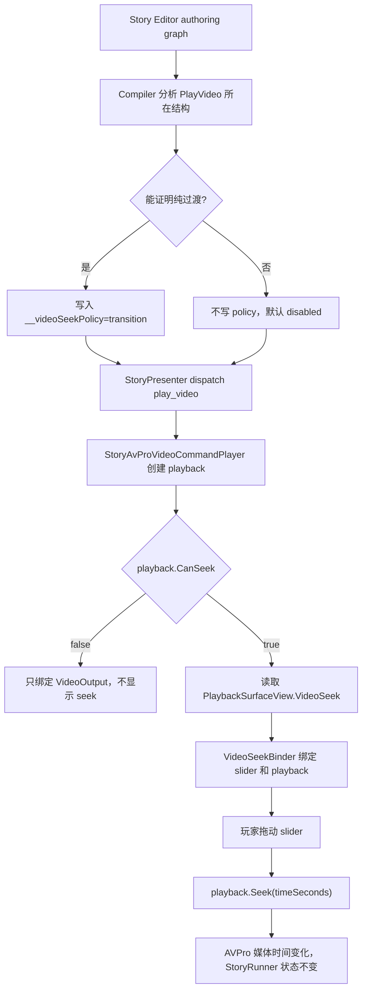

# Story Transition Video Seek Controls Design

## 0. 术语约定

| 术语 | 定义 | 防冲突结论 |
|---|---|---|
| compiler-inferred seek policy | 编译器从 Story authoring graph 推导出的内部视频 seek 策略 | 不暴露成节点字段，不要求作者手填 |
| transition video | 编译器能证明为纯过渡段的视频；允许默认 UI 显示时间条并调用 AVPro seek | 是结构推导结果，不是 `PlayVideo` 的公开参数 |
| branch interaction video | 编译器判断与选择、QTE、解锁、并行等待互动或其它 blocking interaction 绑定的视频 | 一律不可 seek |
| `__videoSeekPolicy` | 编译器写入 `play_video` command arguments 的内部保留参数 | 仅用于 runtime/player 通信；不进入 authoring schema / 节点 Inspector / command schema argument definitions |
| `VideoSeekSurface` | `PlaybackSurfaceView` 内的可选 UI 数据面，包含时间条 slider 和时间文本 | 不是新 interaction layer / provider / controller |
| `StoryAvProVideoPlayback.Seek(time)` | 播放层对当前 AVPro 媒体时间的 seek 操作 | 不等同于 `StoryRunner.Seek()`，不改变分支历史或章节位置 |

术语 grep 结论：当前代码里没有 `__videoSeekPolicy` / `VideoSeekSurface` / `VideoSeekPolicy`；`.codestable` 旧 roadmap 提到过公开 `playbackRole` 和 `ITransitionVideoControls`，本 design 按 review 收敛为 compiler 推导 + hidden metadata + 一个 surface 数据面。

## 1. 决策与约束

### 需求摘要

做什么：作者不填写 `playbackRole`。Story Editor compiler 从图结构推导 `play_video` 是否是纯过渡视频：

```text
PlayVideo -> Dialogue/Jump/End/普通后续流程     => 可推导为 transition，允许 seek
PlayVideo -> Choice / QTE / Unlock / 并行等待互动 => branch interaction，不允许 seek
```

编译器只在能证明纯过渡时，给编译产物写入内部参数：

```yaml
__videoSeekPolicy: transition
```

运行时缺少该内部参数时默认不可 seek。这样旧图、手写 program、分支互动视频都不会因为升级而自动获得拖动能力。

为谁：需要运行时视频播放器式拖动预览的互动影游流程，以及需要在 Story Editor 播放窗口预览纯过渡视频的作者。

成功标准：

- `PlayVideo` schema 不暴露 `playbackRole` 或 seek 开关。
- compiler 能对当前默认作者主路径推导 transition / disabled；不能证明纯过渡时一律 disabled。
- `transition` 视频在默认 runtime view 中显示 seek bar；拖动只改变当前 AVPro 媒体时间。
- 分支互动视频、并行等待互动视频、缺少内部 policy 的视频、loop 视频、duration 不可用视频不可 seek。
- Editor playback window 使用同一内部 policy 显示 transition slider。
- seek 不调用 `StoryRunner.Seek()` / `StoryModule.Seek()`，不改变 choice 历史、command outcome、chapter 或 runner time。

### 复杂度档位

- `Authoring API = hidden`：不新增作者字段；作者只通过图结构表达“纯过渡”或“互动视频”。
- `Inference = conservative`：compiler 只对窄白名单结构写入 `__videoSeekPolicy=transition`；任何不确定结构都 disabled。
- `Runtime boundary = playback-only`：seek 只落在 `GameDeveloperKit.StoryPlayback` 的 AVPro wrapper；`Runtime/Story` 仍只保存命令数据协议。
- `UI API surface = small`：只在现有 `PlaybackSurfaceView` 增加一个可选 seek surface，不新增 interaction provider/controller。
- `Editor scope = preview-only`：Editor 只做推导结果展示和播放窗口拖动预览，不新增 TimedChoice、AE 时间线或节点模板。

### 关键决策

1. 不暴露 `playbackRole`。
   - 选择/互动关系已经在图结构里，重复让作者填 role 会制造不一致。
   - 如果图结构和字段冲突，最终仍要相信图；所以字段没有必要。

2. 使用内部 metadata，而不是 runtime 重新分析 graph。
   - runtime `StoryProgram` 不保存 authoring graph edge。
   - compiler 是唯一能完整看到 node/edge/parallel block 的地方。
   - 因此 runtime 只消费 `__videoSeekPolicy`，缺失即 disabled。

3. 不新增 `ITransitionVideoControls`。
   - 控件由 interaction channel 通过同一个 `PlaybackSurfaceView` 返回。
   - 需要 seek UI 时返回 `VideoSeekSurface`；不提供时视频照常播放，只是没有可见时间条。

4. 推导规则宁可保守。
   - compiler 只能基于结构推导，不读取视频内容语义。
   - 只对明确纯过渡的结构启用 seek；复杂结构让作者调整图结构或等后续 feature 明确规则。

### 明确不做

- 不新增 `PlayVideo.playbackRole`、`seekable` 或任何作者可编辑 seek 开关。
- 不新增 `StoryRunner.Seek()`、`StoryModule.Seek()` 或剧情随机访问。
- 不新增 `TimedChoice`、`EvaluateMediaTime()`、media-time trigger 或 AE 式 timeline。
- 不允许 branch interaction、并行等待互动、缺省 policy、loop 视频、duration 不可用视频获得 seek。
- 不新增 `IStoryInteractionLayer` / `IStoryInteractionChannel` / `ITransitionVideoControls` / surface provider。
- 不让 `Runtime/Story` 引用 `Slider`、`RawImage`、AVPro、UIWindow 或 Editor 类型。
- 不实现带互动视频 seek 后的 choice/outcome 历史回放；未来若要做，必须先回 roadmap update。
- 不做播放/暂停按钮、倍速、章节选择、存档回放或资源加载策略改造。

## 2. 名词与编排

### 2.1 名词层

#### 现状

- `StoryMediaCommandNames` 定义 `play_video`、`source`、`clip`、`loop` 等媒体命令协议常量，但没有视频 seek policy。
- `NodeSchemaRegistry` 的 `PlayVideo` schema 只有 `source`、`clip`、`wait`、`loop` 参数；compiler 会把除 `wait` 外的 schema 参数写入 command arguments。
- `StoryProgramCompiler` 在 Editor 侧可访问完整 authoring graph、node kind、edge、parallel block 和 immediate target，是最适合推导 seek policy 的位置。
- `PlaybackSurfaceView` 当前提供 `VideoOutput`、`ImageOutput`、文本、继续按钮、等量选项按钮和 `CustomRoot`，没有时间条 surface。
- `StoryAvProVideoPlayback` 包装 AVPro `MediaPlayer`，只暴露纹理、首帧状态和 `IsPlaying`，没有 duration/current time/seek API。
- `StoryEditorAvProPlayback` 已在 Editor 播放窗口里真实播放 `play_video`，但没有 seek API 或时间条 UI。

#### 变化

新增内部媒体命令常量，继续放在现有协议类中：

```csharp
public static class StoryMediaCommandNames
{
    public const string VideoSeekPolicyArgument = "__videoSeekPolicy";
    public const string VideoSeekPolicyTransition = "transition";
}
```

`NodeSchemaRegistry` 不增加 `playbackRole` 字段。`StoryProgramCompiler` 在构建 `play_video` command arguments 后追加内部参数：

```csharp
if (CanInferTransitionVideo(node, graphContext))
{
    arguments[StoryMediaCommandNames.VideoSeekPolicyArgument] =
        StoryValue.FromString(StoryMediaCommandNames.VideoSeekPolicyTransition);
}
```

`__videoSeekPolicy` 不进入 `StoryCommandDefinition.ArgumentDefinitions`，因此不出现在节点字段 schema，也不作为作者可编辑 command argument。

`PlaybackSurfaceView` 增加一个可选 seek surface：

```csharp
public sealed class VideoSeekSurface
{
    public RectTransform Root { get; }
    public Slider Slider { get; }
    public TMP_Text TimeText { get; }
}

public sealed class PlaybackSurfaceView
{
    public VideoSeekSurface VideoSeek { get; }
}
```

说明：`VideoSeekSurface` 是 UI 引用集合，不含业务逻辑，不是交互通道接口。默认 view 会创建并返回它；自定义 channel 可以返回自己的 slider，也可以返回 null 选择不显示时间条。

`StoryAvProVideoPlayback` 增加播放层控制面：

```csharp
public bool CanSeek { get; }
public double DurationSeconds { get; }
public double CurrentTimeSeconds { get; }
public void Seek(double timeSeconds);
```

行为示例：

- compiler 写入 `__videoSeekPolicy=transition`、视频非 loop、duration 为 120 秒，调用 `Seek(35)` -> AVPro 当前媒体时间变为 35 秒，Story frame 不变。
- compiler 未写入 policy，调用 `Seek(35)` -> 抛配置错误或被 binder 拒绝调用；UI 不显示 slider。
- 手写 `StoryCommand` 缺少内部 policy -> `CanSeek=false`。

### 2.2 编排层



#### 现状

当前 runtime 播放流程是：

1. `StoryPresenter` 派发 `play_video` command。
2. `StoryAvProVideoCommandPlayer.PlayVideo()` 创建或 acquire `StoryAvProVideoPlayback`。
3. `StoryPlayerView.UpdateMediaSurfaces()` 通过 `InteractionRequestKind.Video` 获取 `RawImage`。
4. `StoryPlayerView.UpdateVideoOutput()` 把最后一个活跃 AVPro texture 写到当前 `VideoOutput`。
5. AVPro 完播事件完成 command，Story runner 正向推进。

当前 compiler 已经能访问图结构，并在编译 `PlayVideo` 时知道当前 node、出边、目标 node、parallel block 和 hidden choice item 规则。

#### 变化

新的 compiler 推导：

1. 对每个 `PlayVideo` 节点执行 seek policy 推导。
2. 满足以下全部条件才写入 `__videoSeekPolicy=transition`：
   - `loop != true`。
   - 当前节点不在 `Parallel` 分支块内。
   - 当前节点没有多 outcome 或多目标结构。
   - 当前节点的 immediate target 不是 `Choice`、`MiniGame`、带 outcome 的 command，或后续 QTE / Unlock command。
   - 当前节点不是合流前用于承载等待互动的背景视频。
3. 其它情况不写 policy，runtime 默认 disabled。

新的 runtime 编排：

1. `StoryAvProVideoPlayback` 在播放期间根据 command 判断 `CanSeek`：
   - `__videoSeekPolicy == transition`
   - `loop != true`
   - 当前 AVPro control/info 可用且 duration > 0
2. `StoryPlayerView` 仍用 `InteractionRequestKind.Video` 获取视频 surface，不新增 request kind。
3. 当当前活跃 video playback 可 seek 时，`StoryPlayerView` 读取同一个 `PlaybackSurfaceView.VideoSeek` 并交给内部 binder。
4. binder 在 `Update` 中刷新 slider 和时间文本；slider 用户变化时调用 `playback.Seek(timeSeconds)`。
5. playback 终止、frame 切换、StopPlayback 或绑定到非 seekable 视频时，binder 解绑并隐藏 seek surface。

新的 Editor 编排：

1. `StoryEditorPlaybackWindow` 不显示 `playbackRole` 编辑字段。
2. 播放窗口可以展示只读 “seek policy: transition/disabled” 诊断，来源是编译产物的内部 policy。
3. 当前视频为 transition 且 AVPro duration 可用时，视频预览下方显示 slider。
4. 拖动 slider 调用 `StoryEditorAvProPlayback.Seek(timeSeconds)`。
5. 完播仍由现有 Editor update 检测后调用 runtime `CompleteCommand()`。

流程级约束：

- seek 只改变 AVPro 媒体时间；不得调用 `Evaluate()`、`Continue()`、`Select()` 或 `CompleteCommand()`。
- 拖到末尾不手动完成 command，仍等待 AVPro 完播事件或现有 Editor 完播检测。
- compiler 不能证明纯过渡时必须 disabled，不能为了方便猜测启用 seek。
- branch interaction 视频即使 UI 返回了 `VideoSeekSurface` 也必须隐藏并解绑。
- duration 不可用、直播流、loop 视频或 playback 已终止时，slider 必须隐藏或禁用。
- 多个活跃视频同时存在时，只有当前输出到 `VideoOutput` 的 seekable playback 绑定 slider；多个 transition 视频同帧属于作者配置风险，首版不建立多条 seek bar。
- `GetPlaybackSurfaceView(Video)` 缺少 `VideoOutput` 仍是配置错误；缺少 `VideoSeek` 不是错误，只表示该 channel 不显示时间条。

### 2.3 挂载点清单

- compiler-inferred `__videoSeekPolicy`：编译产物内部 metadata — 新增隐藏写入点，删掉它则 runtime 无法区分 transition 视频。
- `PlaybackSurfaceView.VideoSeek`：interaction channel surface — 新增可选 UI 数据面，删掉它则 runtime 无法绑定章节 UI 的时间条。
- `StoryAvProVideoPlayback.Seek(time)`：AVPro 播放句柄 — 新增媒体 seek 入口，删掉它则时间条不能改变视频时间。
- 默认 `StoryPlayerView` seek bar：默认 fallback UI — 新增默认可见能力，删掉它则未自定义 channel 时没有运行时时间条。
- `StoryEditorPlaybackWindow` transition slider：Editor 预览入口 — 新增作者预览能力，删掉它则编辑器仍只能顺播视频。

### 2.4 推进策略

1. 编译推导：让 compiler 根据图结构写入隐藏 `__videoSeekPolicy=transition`。
   退出信号：纯过渡 PlayVideo 编译产物带内部 policy；Choice/Parallel/互动结构不带 policy。
2. AVPro seek 句柄：让 runtime/editor AVPro wrapper 暴露 `CanSeek`、current time、duration 和 `Seek(time)`。
   退出信号：带内部 policy 的 transition 视频 wrapper 可被 seek，缺省/互动/loop/duration 缺失不可 seek。
3. Runtime surface 接线：给 `PlaybackSurfaceView` 增加 `VideoSeekSurface`，默认 view 创建时间条，内部 binder 负责绑定和刷新。
   退出信号：默认 `StoryPlayerView` 播放 transition 视频时显示 slider，拖动只改变 AVPro 当前时间。
4. Editor 预览接线：播放窗口基于编译推导结果显示 transition slider。
   退出信号：Editor 中 transition 视频可拖动预览，branch/disabled 视频不显示 slider。
5. 范围守护与测试：补 compiler inference、runtime gating、surface 绑定和 Editor preview 的可观察验证。
   退出信号：测试/编译通过，grep 确认没有作者 role 字段、剧情 seek、TimedChoice 或新 interaction 接口。

### 2.5 结构健康度与微重构

##### 评估

- compound convention 检索：未命中 StoryPlayback 目录组织或命名 convention；只有旧 Story system completeness explore，已不适合作为当前约束。
- 文件级 — `Assets/GameDeveloperKit/Editor/StoryEditor/Compiler/StoryProgramCompiler.cs`：接近 2000 行，已经承担 graph 编译、parallel 分析、schema 导出和诊断；本 feature 需要新增推导逻辑，但应尽量放成独立 helper 方法，不混进主分支。
- 文件级 — `Assets/GameDeveloperKit/Runtime/StoryPlayback/StoryPlayerView.cs`：约 1244 行，已经承担默认 UI 创建、生命周期、surface 查询、输入绑定、视频输出刷新和预热。seek 逻辑不能整块塞进这个文件。
- 文件级 — `Assets/GameDeveloperKit/Runtime/StoryPlayback/StoryAvProVideoPlayback.cs`：约 401 行，职责集中在 AVPro playback 生命周期；新增 time/seek 属性属于自然扩展。
- 目录级 — `Assets/GameDeveloperKit/Runtime/StoryPlayback/`：约 44 个文件，目录偏平；但现有 StoryPlayback 包已经以类型名聚合，不在本 feature 做目录重组。

##### 结论：不做前置微重构

本 feature 不做“只搬不改行为”的微重构。原因是 compiler 推导和 seek 都是新增行为，不存在可先搬走的旧逻辑；新增绑定逻辑应落到新的内部 helper 中，`StoryPlayerView` 只保留调用点，避免继续膨胀。

##### 超出范围的观察

- `StoryProgramCompiler.cs` 和 `StoryPlayerView.cs` 都偏胖。后续若继续增加 QTE / unlock / parallel-wait 交互，建议单独走 `cs-refactor`，把 compiler 的 graph 分析 helper、默认 UI 构造、输入绑定、媒体 surface 更新拆成更明确的内部组件；本 feature 只约束新增逻辑不要继续堆进去。
- `Runtime/StoryPlayback` 目录已经偏平。若后续媒体/QTE/unlock 文件继续增加，可考虑按 `Media` / `Interaction` 分组重组目录；本 feature 不做目录搬迁。

## 3. 验收契约

| 场景 | 输入 / 触发 | 期望可观察结果 |
|---|---|---|
| N1 schema 不暴露 role | 查询 `NodeSchemaRegistry.Get(NodeKind.PlayVideo)` | 不存在 `playbackRole` / `seekable` 参数 |
| N2 纯过渡推导 | PlayVideo 线性指向普通后续流程后编译 | command arguments 包含内部 `__videoSeekPolicy=transition` |
| N3 Choice 禁用 | PlayVideo immediate target 是 Choice 后编译 | command arguments 不包含 `__videoSeekPolicy`，runtime `CanSeek=false` |
| N4 Parallel 禁用 | `Parallel` 中一轨 PlayVideo、一轨 Wait->Choice/Command 后编译 | PlayVideo command 不包含 `__videoSeekPolicy`，runtime `CanSeek=false` |
| N5 旧图兼容 | 旧 PlayVideo 节点不含任何 role 字段 | 编译通过；只有符合推导规则的纯过渡视频才获得内部 policy |
| N6 transition 可 seek | runtime 播放带内部 policy、非 loop、duration 可用的视频 | 默认 UI 显示时间条；拖动后 AVPro current time 变化 |
| N7 loop 不可 seek | 带内部 policy 但 `loop=true` | 不显示或禁用时间条；`CanSeek=false` |
| N8 自定义 channel 无 seek surface | transition 视频的 custom channel 只返回 `VideoOutput` | 视频正常播放；不自动创建额外 UI；不报缺少 seek surface 错误 |
| N9 解绑清理 | 视频完播、frame 切换或 StopPlayback | seek slider 解绑并隐藏，旧 listener 不再触发 |
| N10 Editor 预览 | Editor playback window 播放带内部 transition policy 的视频 | 视频预览下方显示 slider，拖动调用 Editor AVPro seek |
| N11 Editor disabled | Editor playback window 播放无内部 policy 视频 | 不显示 transition seek slider |
| B1 范围守护 | 代码 grep `playbackRole` / `seekable` in `NodeSchemaRegistry` | 不新增作者可编辑 role / seek 字段 |
| B2 范围守护 | 代码 grep `StoryRunner.Seek` / `StoryModule.Seek` | 本 feature 不新增剧情 seek |
| B3 范围守护 | 代码 grep `TimedChoice` / `EvaluateMediaTime` / `StoryPresentationAnchorPreset` | 不新增 timed choice 或 layout/presentation 协议 |
| B4 范围守护 | 代码 grep `ITransitionVideoControls` / `IStoryInteractionLayer` / `IStoryInteractionChannel` | 不新增额外交互层接口 |
| B5 Runtime 隔离 | 检查 `Assets/GameDeveloperKit/Runtime/Story` | 不引用 `Slider`、`RawImage`、AVPro、UIWindow 或 Editor API |

明确不做的反向核对：

- seek 不改变 `StoryFrame`、`StoryRunner` history、choice 状态、command outcome 或 chapter。
- 拖动 seek bar 不直接完成 command。
- 带互动视频 seek 历史回放不在本 feature 交付。
- 作者不能通过节点字段强行覆盖 compiler 推导结果。

## 4. 与项目级架构文档的关系

验收完成后需要回写 `.codestable/architecture/ARCHITECTURE.md`：

- `StoryProgramCompiler` 从 authoring graph 推导 `__videoSeekPolicy=transition`，不暴露 `playbackRole` 作者字段。
- `StoryPlayback` 的 AVPro wrapper 支持 playback-only `Seek(time)`，并明确不等同剧情 seek。
- `PlaybackSurfaceView` 可选提供 `VideoSeekSurface`；默认 `StoryPlayerView` 能为 compiler-inferred transition 视频显示时间条。
- Editor playback window 复用同一内部 policy 做过渡视频拖动预览。

`requirements/story-module.md` 在 acceptance 时追加实现进展；该 requirement 状态仍保持 `current`。
