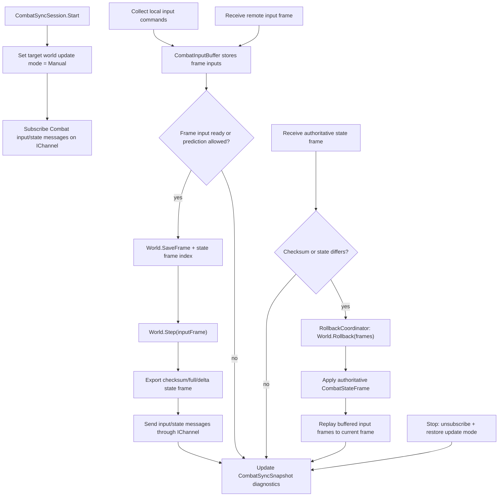

# combat-sync-core design

## 0. 术语约定

| 术语 | 定义 | 防冲突结论 |
|---|---|---|
| Combat Sync | Combat 模块内的联网仿真同步子域 | 不等同于 `.codestable/features/2026-06-22-sync-module` 的属性同步 draft；本 feature 只处理战斗仿真帧、输入、状态帧和回滚 |
| Frame Sync / 帧同步 | 按帧收集玩家输入，并用同一帧输入推进同一战斗世界 | 这里先定义为输入帧同步，不扩展成房间、匹配或服务器调度 |
| State Sync / 状态同步 | 发送或接收某一仿真帧的状态快照、差异或校验值 | 不自动同步所有 `ComponentBase` 字段，只有登记过的同步组件参与 |
| State Frame / 状态帧 | 带 `FrameIndex` 的战斗状态记录，可为 full、delta 或 checksum-only | 与 Story 的 `StoryFrame` 无关；本 feature 使用 `CombatStateFrame` 命名避免冲突 |
| Rollback / 回滚 | 回到历史状态帧，套用修正后的输入或权威状态，再重演到当前帧 | 不再只指 `MassiveWorld.Rollback(frames)`；Combat 层还要维护输入历史、状态帧索引和重演流程 |
| Prediction / 预测 | 缺远端输入时先用预测输入推进本地帧 | 首版作为 `CombatSyncSessionOptions` 的策略开关，不强制所有模式启用 |
| Reconciliation / 校正 | 收到迟到输入或权威状态后，比较状态并触发回滚重演 | 校正发生在 Combat Sync 层，不放到 NetworkModule |

术语 grep 结论：

- 现有 `CombatModule` 设计和架构文档明确“首版不做网络同步”，本 feature 是边界扩展，不覆盖旧 feature 的历史结论。
- 现有 `SyncModule` draft 是属性驱动数据同步，并明确不做 prediction / rollback；本 feature 不依赖它。
- `NetworkModule` 设计明确不引用战斗同步、rollback、frame sync 等类型；本 feature 让 Combat 引用 Network 的 `IChannel` / `Message`，不让 Network 反向引用 Combat。

## 1. 决策与约束

### 需求摘要

做什么：在 Combat 内新增同步子域，提供帧输入、状态帧、同步组件状态导出/应用、状态校验、网络消息接线和回滚重演的公共契约。同步战斗不再直接由 Timer FixedUpdate 推进默认 world，而是由 `CombatSyncSession` 在输入/状态条件满足时驱动 `World.Step(inputFrame)`，并在需要时调用 `World.Rollback(frames)` 后重演历史输入。

为谁：需要联网战斗、客户端预测、服务器权威状态校正、回放校验或战斗不同步定位的玩法和框架维护者。

成功标准：

- 本地 Combat 默认行为保持不变：未启用 sync session 时，`CombatModule` 仍由 Timer FixedUpdate 推进默认 world。
- 开启 sync session 后，可以把指定 world 切到手动推进，按 `CombatInputFrame` 逐帧 `Step`。
- 同步实体通过稳定的 `CombatSyncIdentity` 参与状态帧；状态帧不直接依赖本地 massive entity id 跨端一致。
- 已登记组件可以导出 full state、delta state 或 checksum，并能把收到的状态应用回 world。
- session 保存输入历史和状态帧索引；收到迟到输入或权威状态时，能回滚到目标帧并重演到当前帧。
- Combat 网络消息都定义在 Combat Sync 子域，使用 `IChannel` 发送/订阅，不修改 NetworkModule。
- 回滚不只依赖 massive ring buffer；Combat Sync 还维护 frame index、input history、state frame buffer 和校验结果。

### 明确不做

- 不实现匹配、房间、服务端进程、鉴权、断线重连、反作弊或网络延迟补偿策略服务。
- 不把 `.codestable/features/2026-06-22-sync-module` 的属性同步作为本 feature 前置依赖。
- 不让 NetworkModule 引用 Combat 类型，也不改 Network 的 codec / transport 抽象。
- 不自动同步所有 `ComponentBase` 派生类型；未登记 serializer 的组件不进入状态帧。
- 不自动修复非确定性战斗逻辑；随机数、浮点、时间读取、资源查询和外部副作用仍由业务约束。
- 不同步 GameObject、Transform、动画、特效、音效或 UI 表现状态。
- 不修改 `Assets/GameDeveloperKit/Plugins/massive/Runtime/` 第三方源码。
- 不把现有本地 Combat 默认启动改成网络模式。

### 复杂度档位

本 feature 偏向对外运行时框架能力，默认按“对外发布的库/服务”档位，偏离点：

- `Performance = budgeted`：每帧输入、状态帧和 rollback buffer 是热路径，状态导出默认需要可控间隔和容量上限。
- `Determinism = deterministic`：同步模式下同一输入帧必须产生可校验状态；不同步时要能定位帧号和校验差异。
- `Compatibility = backward-compatible`：现有本地 Combat API 和 Timer FixedUpdate 驱动默认不变，sync session 是显式启用。
- `Observability = instrumented`：同步帧、远端输入延迟、状态 hash、rollback 次数和最后错误需要进入诊断快照。
- `Concurrency = single-threaded orchestration`：所有同步 API 仍假定 Unity 主线程调用，不引入后台线程或 lock-based 安全承诺。

### 关键决策

1. Combat Sync 放在 Combat 模块内，而不是扩展独立 SyncModule。
   - 属性同步解决“对象字段变了怎么发出去”，战斗同步解决“哪一帧消费哪些输入、状态怎么校验、回滚怎么重演”。
   - 放在 Combat 内可以直接复用 `World.Tick`、`Step`、`SaveFrame`、`Rollback` 和系统生命周期语义。

2. 同步战斗使用显式手动推进模式。
   - 当前 `CombatModule` 自动注册 Timer `FixedUpdateTimerHandle` 推进默认 world。
   - 帧同步需要等输入或按预测策略推进，不能让 Timer 在缺输入时直接跑过目标帧。
   - 本 feature 给 CombatModule/World 增加 update mode：默认 `TimerFixedUpdate`，sync session 启动时对目标 world 使用 `Manual`，session 结束后恢复原模式。

3. FrameIndex 使用 Combat 仿真帧，不使用 Unity frame 或 Network sequence。
   - `CombatInputFrame.FrameIndex = N` 表示“推进到 N 这一帧需要消费的输入”。
   - `CombatStateFrame.FrameIndex = N` 表示“完成第 N 帧后 world 的状态”。
   - 初始状态帧为 0；`World.Tick` 仍是当前已完成固定帧计数。

4. State Frame 使用稳定同步身份，不跨端承诺 massive entity id 一致。
   - 现有 `Entity.Id` 来自本地 `MassiveWorld`，不同端实体创建顺序稍有差异就可能不一致。
   - 参与状态同步的实体必须持有 `CombatSyncIdentity`，状态帧使用 `SyncId` 定位实体。
   - massive id/version 仍可作为本地调试信息，但不作为网络协议主键。

5. 状态同步走显式 serializer registry。
   - 反射扫描所有组件会伤害 IL2CPP/AOT 可控性，也会把不该同步的字段带入协议。
   - 业务为需要同步的组件登记 `ICombatStateSerializer<TComponent>`，Combat Sync 只导出登记过的组件。
   - 未登记组件仍可参与本地系统和 massive rollback，但不进入 state frame。

6. RollbackCoordinator 包装 massive rollback，而不是替代它。
   - `World.Rollback(frames)` 仍负责恢复 ECS 存储和 Combat 系统匹配生命周期。
   - `CombatRollbackCoordinator` 负责把 frame index 映射到 massive rollback 距离，应用权威状态，重放 input history，并记录 rollback 原因。

7. Network 只是通道。
   - Combat Sync 定义自己的 `Message` 派生类型并通过 `IChannel.Subscribe<T>` / `SendAsync` 接线。
   - NetworkModule 不知道这些消息的含义，不持有 combat session、状态帧或 rollback 逻辑。

### 前置依赖

无实现前置微重构。需要先接受本 design 对 Combat 首版边界的扩展：Combat 将新增联网同步子域，但默认本地 Combat 行为保持不变。

## 2. 名词与编排

### 2.1 名词层

#### 现状

- `Assets/GameDeveloperKit/Runtime/Combat/CombatModule.cs`：`CombatModule` 通过 `[ModuleDependency(typeof(TimerModule))]` 依赖 Timer，startup 创建默认 `World` 并注册 `FixedUpdateTimerHandle`，固定 tag 为 `CombatModule.Update`。
- `Assets/GameDeveloperKit/Runtime/Combat/World.cs`：`World` 暴露 `FrameRate`、`FixedDeltaTime`、`Tick`、`Time`、`Update(deltaTime)`、`Step()`、`SaveFrame()`、`Rollback(frames)`；当前 `Step()` 不接收输入帧。
- `Assets/GameDeveloperKit/Runtime/Combat/EntityManager.cs`：当前有 create/destroy/add/remove/get，但没有“替换已有组件”的公开 `SetComponent`，状态应用只能绕开或 remove+add。
- `Assets/GameDeveloperKit/Runtime/Combat/SystemManager.cs`：系统匹配基于 massive filter，rollback 后通过匹配快照触发生命周期差异。
- `Assets/GameDeveloperKit/Runtime/Network/Message.cs`：网络消息只有 `MessageId`、`SequenceId`、`IsResponse` 基础契约。
- `Assets/GameDeveloperKit/Runtime/Network/IChannel.cs` 与 `NetworkChannel.cs`：channel 支持 `SendAsync`、`WaitAsync<TResponse>` 和 `Subscribe<TMessage>`；主动推送可通过 message type 分发。
- `Assets/GameDeveloperKit/Plugins/massive/Runtime/World/Massive/MassiveWorld.cs`：`SaveFrame()` 保存底层 world 副本，`Rollback(frames)` 恢复指定历史帧；不知道 Combat input history 或网络状态帧。

#### 变化

新增 update mode：

```csharp
// 来源：Assets/GameDeveloperKit/Runtime/Combat/CombatModule.cs CombatModule
public enum CombatWorldUpdateMode
{
    TimerFixedUpdate,
    Manual
}

public sealed partial class CombatModule : GameModuleBase
{
    public CombatWorldUpdateMode UpdateMode { get; }
    public void SetUpdateMode(CombatWorldUpdateMode mode);
    public CombatSyncSession CreateSyncSession(CombatSyncSessionOptions options);
    public CombatSyncSession CreateSyncSession(World world, CombatSyncSessionOptions options);
}
```

新增帧输入：

```csharp
// 来源：Assets/GameDeveloperKit/Runtime/Combat/Sync/CombatInputFrame.cs CombatInputFrame
public sealed class CombatInputFrame
{
    public long FrameIndex { get; }
    public IReadOnlyList<CombatInputCommand> Commands { get; }
    public bool IsPredicted { get; }
}

public readonly struct CombatInputCommand
{
    public int PlayerId { get; }
    public int CommandId { get; }
    public byte[] Payload { get; }
}
```

扩展 world 帧推进：

```csharp
// 来源：Assets/GameDeveloperKit/Runtime/Combat/World.cs World
public sealed class World : IDisposable
{
    public CombatInputFrame CurrentInputFrame { get; }
    public void Step(CombatInputFrame inputFrame);
    public bool SetComponent(Entity entity, ComponentBase component);
}
```

`Step()` 继续作为本地模式入口，等价于使用空输入帧；`Step(inputFrame)` 只在同步模式中设置 `CurrentInputFrame`，让系统通过 world 读取当前帧输入。

新增同步身份：

```csharp
// 来源：Assets/GameDeveloperKit/Runtime/Combat/Sync/CombatSyncIdentity.cs CombatSyncIdentity
public sealed class CombatSyncIdentity : ComponentBase
{
    public long SyncId;
}
```

新增状态帧：

```csharp
// 来源：Assets/GameDeveloperKit/Runtime/Combat/Sync/CombatStateFrame.cs CombatStateFrame
public sealed class CombatStateFrame
{
    public long FrameIndex { get; }
    public CombatStateFrameKind Kind { get; }
    public ulong Checksum { get; }
    public IReadOnlyList<CombatEntityState> Entities { get; }
}

public enum CombatStateFrameKind
{
    Full,
    Delta,
    ChecksumOnly
}
```

新增组件状态 serializer：

```csharp
// 来源：Assets/GameDeveloperKit/Runtime/Combat/Sync/ICombatStateSerializer.cs ICombatStateSerializer<TComponent>
public interface ICombatStateSerializer<TComponent> where TComponent : ComponentBase
{
    string ComponentId { get; }
    CombatComponentState Write(Entity entity, TComponent component);
    void Read(Entity entity, CombatComponentState state);
    ulong Hash(Entity entity, TComponent component);
}
```

新增 session 入口：

```csharp
// 来源：Assets/GameDeveloperKit/Runtime/Combat/Sync/CombatSyncSession.cs CombatSyncSession
public sealed class CombatSyncSession : IDisposable
{
    public CombatSyncSnapshot Snapshot { get; }

    public void Start();
    public void Stop();
    public void EnqueueLocalInput(CombatInputCommand command);
    public void Tick();
    public void ApplyRemoteInput(CombatInputFrame inputFrame);
    public void ApplyRemoteState(CombatStateFrame stateFrame);
}
```

新增网络消息：

```csharp
// 来源：Assets/GameDeveloperKit/Runtime/Combat/Sync/Messages/CombatStateFrameMessage.cs CombatStateFrameMessage
public sealed class CombatStateFrameMessage : Message
{
    public string SessionId { get; set; }
    public CombatStateFrame Frame { get; set; }
}

public sealed class CombatInputFrameMessage : Message
{
    public string SessionId { get; set; }
    public CombatInputFrame Frame { get; set; }
}
```

接口示例：

```csharp
// 来源：Assets/GameDeveloperKit/Runtime/Combat/Sync/CombatSyncSession.cs CombatSyncSession
var channel = App.Network.GetChannel("battle");
var session = App.Combat.CreateSyncSession(new CombatSyncSessionOptions
{
    SessionId = "battle-001",
    Channel = channel,
    Mode = CombatSyncMode.StateAuthority,
    RollbackWindowFrames = 90,
    StateFrameInterval = 3,
    AllowPrediction = true
});

session.RegisterStateSerializer(new PositionStateSerializer());
session.Start();
session.EnqueueLocalInput(new CombatInputCommand(playerId, moveCommandId, payload));
```

### 2.2 编排层



#### 现状

- Combat 默认 world 由 Timer FixedUpdate 自动推进，缺输入也会继续前进。
- `World.Step()` 只推进本地系统，不知道输入帧、预测帧或远端状态帧。
- `World.SaveFrame()` / `Rollback(frames)` 只保存/恢复 ECS 世界，不保存“这帧用了哪些输入”“这帧状态 hash 是什么”“回滚后如何重演”。
- Network 可以发送/接收 `Message`，但没有 Combat 专用消息或 session 绑定。

#### 变化

1. session 启动：
   - 校验 `World`、`IChannel`、session id 和 rollback window。
   - 将目标 world 的 update mode 切为 `Manual`，避免 Timer FixedUpdate 与同步 session 双重推进。
   - 注册 `CombatInputFrameMessage` 和 `CombatStateFrameMessage` 订阅。
   - 初始化 input buffer、state frame buffer、rollback coordinator 和 diagnostics snapshot。

2. 帧输入推进：
   - local input 先进入当前目标帧的本地输入列表。
   - remote input frame 按 `FrameIndex` 进入 input buffer；重复 frame/player 输入按幂等规则忽略或覆盖同源预测输入。
   - 当目标帧输入齐全，或 `AllowPrediction` 允许预测时，session 构造 `CombatInputFrame`。
   - session 在 step 前保存可回滚帧索引，调用 `World.Step(inputFrame)`，完成后导出 checksum 或状态帧。

3. 状态帧导出：
   - 只遍历持有 `CombatSyncIdentity` 的实体。
   - 对每个登记 serializer 的组件调用 `Write` / `Hash`。
   - 按 `StateFrameInterval` 发送 full/delta/checksum-only；首版至少支持 full 与 checksum-only，delta 可以按 serializer 能力逐步补。
   - 状态帧写入 `CombatStateFrameBuffer`，用于后续比较和 rollback 定位。

4. 状态帧接收与校正：
   - 收到 state frame 后先校验 session id、frame index、kind、checksum 和组件 id。
   - frame 太旧且已超出 rollback window 时记录失败，不尝试修正。
   - frame 在窗口内且 checksum 不一致时，rollback coordinator 计算相对回滚距离。
   - 先调用 `World.Rollback(frames)` 恢复 ECS，再应用权威 `CombatStateFrame`，随后按 input history 从目标帧后一帧重演到当前帧。
   - 重演结束后重新导出当前 checksum，写入 diagnostics。

5. session 停止：
   - 取消网络订阅，清空预测标记和临时 buffer。
   - 恢复 session 启动前的 update mode。
   - 不销毁 world；world 生命周期仍归 CombatModule 或调用方。

#### 流程级约束

- 错误语义：null world/channel/options 抛 `ArgumentNullException`；空 session id、无效 rollback window、state frame 缺身份或未知 component id 抛 `ArgumentException` 或记录为同步失败，按 API 是否由外部调用决定。
- 幂等性：同一 session、同一 frame、同一 player 的 input frame 重复到达不会重复推进；state frame 重复到达且 checksum 一致不触发 rollback。
- 顺序：sync session 只推进 `World.Tick + 1` 的输入帧；未来帧缓存，过去帧只用于校正。
- 回滚窗口：`RollbackWindowFrames` 不能大于 world 可保存状态能力；超窗 correction 只记录失败，不做半截 rollback。
- 预测：预测输入必须带 `IsPredicted`；真实输入到达且与预测不同才触发 rollback。
- 状态应用：`SetComponent` 替换组件实例时不得错误触发系统离开/进入，除非组件存在性发生变化或实体被创建/销毁。
- 可观测点：session id、current frame、last confirmed frame、last state checksum、pending remote input count、rollback count、last rollback frame/reason、last sync error。
- 网络边界：Network handler 抛异常只影响当前 session diagnostics，不阻断 channel 其他订阅。

### 2.3 挂载点清单

- `CombatModule` 同步入口：新增 `SetUpdateMode(...)` 与 `CreateSyncSession(...)`，删掉后同步战斗无法接管 world 推进。
- `World` 帧输入入口：新增 `Step(CombatInputFrame)`、`CurrentInputFrame` 与 `SetComponent(...)`，删掉后系统无法按帧消费输入或应用权威状态。
- `Assets/GameDeveloperKit/Runtime/Combat/Sync/`：新增 Combat Sync 公开契约、buffer、serializer、session 和 message 类型集合。
- `CombatSyncIdentity`：同步实体的稳定身份组件，删掉后状态帧无法跨端定位实体。
- `IChannel` message 订阅：`CombatSyncSession` 注册/取消 `CombatInputFrameMessage` 与 `CombatStateFrameMessage`，删掉后 Combat Sync 只剩本地回滚，不能网络同步。

### 2.4 推进策略

1. 编排骨架：新增 Combat Sync 目录、核心值对象和 session 空壳，CombatModule 能创建 session 但不推进 world。
   - 退出信号：session 可 start/stop，能注册/取消网络订阅，默认本地 Combat Timer 驱动不受影响。
2. 手动推进与输入帧：为 world 增加 manual update mode、`Step(CombatInputFrame)` 和 input buffer。
   - 退出信号：session 可以按连续 `CombatInputFrame` 推进 world tick，缺输入时不被 Timer 推过目标帧。
3. 状态帧与 serializer registry：实现 `CombatSyncIdentity`、组件 serializer 登记、full/checksum state frame 导出和 `SetComponent` 应用入口。
   - 退出信号：登记组件能生成可重复 checksum，并能把 full state frame 应用回同一 world。
4. RollbackCoordinator：接入 state frame buffer、input history、massive rollback 和重演流程。
   - 退出信号：收到窗口内不同 checksum 的权威状态后，world 回到目标帧、应用状态并重演到当前帧。
5. Network 接线：定义 Combat Sync message，接通 `IChannel.SendAsync` / `Subscribe<T>`，隔离 session id 和错误。
   - 退出信号：两个本地 fake channel/session 能交换 input frame 与 state frame，重复消息幂等。
6. 诊断与测试覆盖：补同步 snapshot、rollback 计数、错误路径和范围守护测试。
   - 退出信号：关键验收场景有自动测试或可观察证据，Runtime 快速编译通过。

### 2.5 结构健康度与微重构

##### 评估

- compound convention 检索：未命中 Combat/Sync/Network 目录组织、命名或归属 convention。
- 文件级 — `Assets/GameDeveloperKit/Runtime/Combat/CombatModule.cs`：159 行，职责是模块生命周期、默认 world、Timer handle 和 profile 软接入。本次只增加 update mode 与 session factory，属于同一模块编排职责，但具体同步逻辑必须放新文件。
- 文件级 — `Assets/GameDeveloperKit/Runtime/Combat/World.cs`：419 行，职责集中在 world 门面、固定步、实体组件和 rollback。本次增加 `Step(inputFrame)`、`SetComponent` 和 rollback capacity 会触碰世界公开契约，但仍属于 world 门面职责；不在此文件承载 session/buffer/serializer。
- 文件级 — `Assets/GameDeveloperKit/Runtime/Combat/EntityManager.cs`：318 行，本次可能增加替换组件的内部支撑，属于组件 mutation 入口延伸。
- 文件级 — `Assets/GameDeveloperKit/Tests/Runtime/CombatModuleTests.cs`：414 行，已有 Combat 本地行为测试较集中；本 feature 新增 `CombatSyncTests.cs`，避免继续把网络同步场景塞进本地模块测试文件。
- 目录级 — `Assets/GameDeveloperKit/Runtime/Combat/`：当前 10 个 `.cs` 文件；本次会新增多个同步类型，若继续平铺会扩大目录摊平。
- 目录级 — 目标新目录 `Assets/GameDeveloperKit/Runtime/Combat/Sync/`：新建子目录承载同步子域；可按 `Messages/` 子目录放网络消息，避免污染 Combat 根目录。

##### 结论：不做前置微重构

本次不搬迁既有 Combat 文件，只新增 `Runtime/Combat/Sync/` 子目录承载同步子域。现有 `CombatModule.cs`、`World.cs`、`EntityManager.cs` 的改动是公开契约延伸，不适合通过“只搬不改行为”的微重构解决。测试新增独立 `CombatSyncTests.cs`，不先拆旧 `CombatModuleTests.cs`。

##### 超出范围的观察

- Combat 根目录已经达到 10 个 `.cs` 文件，后续若 Combat 继续扩展技能、伤害、Buff、AI 等子域，建议走 `cs-refactor` 讨论 Combat 目录长期分层，而不是在本 feature 顺手搬。
- 当前 `ComponentBase` 是 class，底层 massive 默认可能只复制引用；严格 rollback 的组件需要 serializer 或 massive `ICopyable<T>` 策略约束。本 feature 通过 Combat Sync state frame 修正联网状态，但不彻底解决所有本地 class component 深拷贝问题。

## 3. 验收契约

### 关键场景清单

| 编号 | 输入 / 触发 | 期望可观察结果 |
|---|---|---|
| N1 | 未创建 sync session，正常访问 `App.Combat` | Combat 仍由 Timer FixedUpdate 推进默认 world，现有本地行为不变 |
| N2 | 创建 sync session 并 `Start()` | 目标 world 切到 manual mode，Timer FixedUpdate 不再推进该 world |
| N3 | session 收到连续 `CombatInputFrame` | world 按 frame index 顺序调用 `Step(inputFrame)`，`World.Tick` 与已完成 frame 对齐 |
| N4 | 输入帧缺远端输入且 `AllowPrediction=false` | session 不推进该帧，pending input 计数可观察 |
| N5 | 输入帧缺远端输入且 `AllowPrediction=true` | session 用预测输入推进，并把该帧标记为 predicted |
| N6 | 登记 `CombatSyncIdentity` 和组件 serializer 后导出 full state frame | state frame 使用 `SyncId` 定位实体，包含登记组件状态和 checksum |
| N7 | 未登记 serializer 的组件存在于实体上 | 该组件不进入 state frame，不影响本地 Combat 系统运行 |
| N8 | 对同一 world 应用刚导出的 full state frame | 应用后 checksum 与原 state frame 一致 |
| N9 | 收到当前帧 checksum 相同的 state frame | 不触发 rollback，last confirmed frame 更新 |
| N10 | 收到 rollback window 内 checksum 不同的权威 state frame | session 调用 rollback、应用权威状态、按 input history 重演到当前帧，并记录 rollback count |
| N11 | 收到超出 rollback window 的 state frame | 不尝试半截 rollback，记录 last sync error |
| N12 | 同一 input/state message 重复到达 | 不重复推进、不重复 rollback，处理结果幂等 |
| N13 | `CombatSyncSession.Stop()` | 取消网络订阅，恢复启动前 update mode，不销毁 world |
| E1 | `CreateSyncSession` 传入 null channel/world/options | 抛明确异常，不改变 Combat update mode |
| E2 | state frame 包含未知 component id | 记录同步失败或抛明确异常，不把未知 payload 写进 world |
| E3 | 权威状态要求创建缺失同步实体 | 创建/映射实体后持有相同 `CombatSyncIdentity.SyncId`，组件状态可应用 |
| E4 | Network handler 内部处理某条 Combat Sync 消息失败 | session snapshot 记录错误，channel 其他订阅不被 Combat Sync 阻断 |

### 明确不做的反向核对项

- 代码中不应新增匹配、房间、服务端进程、鉴权、断线重连或反作弊类型。
- `Assets/GameDeveloperKit/Runtime/Network/` 不应引用 `GameDeveloperKit.Combat` 或 Combat Sync 类型。
- 代码中不应让 `.codestable/features/2026-06-22-sync-module` 成为 Combat Sync 实现前置。
- 状态帧不应默认序列化所有 `ComponentBase` 字段；必须通过登记 serializer 进入同步。
- 代码中不应同步 GameObject、Transform、动画、特效、音效或 UI 表现状态。
- 代码中不应修改 `Assets/GameDeveloperKit/Plugins/massive/Runtime/`。
- 未启用 sync session 时不应改变现有 Combat Timer FixedUpdate 驱动。

## 4. 与项目级架构文档的关系

acceptance 阶段需要更新 `.codestable/architecture/ARCHITECTURE.md`：

- Combat 小节新增 Sync 子域：`CombatSyncSession`、`CombatInputFrame`、`CombatStateFrame`、`CombatSyncIdentity`、serializer registry 和 rollback coordinator。
- Combat 已知约束更新：Combat 不再笼统写“不做网络同步”，改为“默认本地模式不启用网络同步；显式 Combat Sync session 才接管 world 推进”。
- Network 小节补充边界：Network 仍不承载战斗同步语义；Combat Sync 只是消费 `IChannel`。
- 架构约束补充：同步实体使用稳定 `CombatSyncIdentity.SyncId`，状态帧不跨端依赖 massive entity id；未登记组件不进入状态帧。
- Debug/Profile 相关描述后续视实现决定：如果 session snapshot 接入 Combat profile，需要记录可观测字段。
