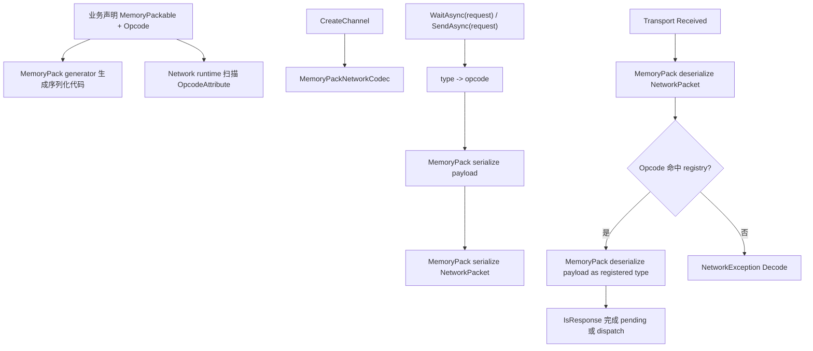

# network-memorypack-sourcegen design

## 0. 术语约定

| 术语 | 定义 | 防冲突结论 |
|---|---|---|
| **Opcode** | 每个 `Message` 派生类声明的稳定 wire code，用于 decode 时从 packet 找回 CLR 消息类型 | 新增 `[Opcode(int code)]`；替代手写 `RegisterMessage<T>()` 和 JSON `TypeName` |
| **Opcode Attribute** | `OpcodeAttribute(int code)`，标在具体网络消息类上 | 只描述协议 code；不做序列化生成，不引入协议组 |
| **MemoryPack Packet** | Network wire 上的二进制外壳，包含 `Opcode`、`SequenceId` 和 MemoryPack payload | 新增在 Network codec 内部；不复用 `JsonNetworkCodec.MessageEnvelope` 的 JSON 语义 |
| **Network Message** | 继承 `GameDeveloperKit.Network.Message` 的业务消息类型，序列化能力由 MemoryPack 自己的 source generator 提供 | 复用现有 `Message` 基类，不新增平行消息基类 |
| **Opcode Registry** | runtime 从已加载程序集扫描 `[Opcode]` 建出的 `opcode -> Type` / `Type -> opcode` 映射 | 内部实现细节，不暴露业务手动注册 API |
| **JSON Codec** | 原 `JsonNetworkCodec` + `TypeName` + Newtonsoft.Json 的消息编解码路径 | 本 feature 从 Network 默认路径移除，不保留 JSON fallback |

## 1. 决策与约束

### 需求摘要

- **做什么**：Network 默认消息编解码改用 Cysharp MemoryPack；删除 JSON envelope / Newtonsoft.Json 消息序列化路径；每个可通过默认 codec 发送的 `Message` 派生类必须声明 `[Opcode(code)]`。
- **为谁**：使用 GameDeveloperKit 网络能力的业务模块、战斗同步层和框架维护者。目标是让网络消息具备稳定二进制协议，同时不要求业务启动期手写注册代码。
- **成功标准**：
  - 声明 `[MemoryPackable] partial` + `[Opcode(1001)]` 的网络消息后，默认 codec 可按 opcode 编解码。
  - 默认 channel 使用 `MemoryPackNetworkCodec`；编码结果不包含 JSON 文本 payload。
  - 缺少 `[Opcode]`、重复 opcode、未知 opcode、MemoryPack payload 错误给出明确运行期错误。
  - `WaitAsync<TResponse>(request)` 仍表示“发送 request 并等待对应 `TResponse` 回包”，旧 public API 不因 codec 切换而改名。
- **明确不做什么**：
  - 不实现真实 socket transport、断线重连、心跳、限流、批量、鉴权、加密或服务器地址发现。
  - 不引入协议组、分组启用、group base id、group handler binding 或 per-channel group options。
  - 不设计或新增 GameDeveloperKit Network source generator、typed send/wait helper、handler installer 或 generator diagnostics。
  - 不使用 MessagePack-CSharp、protobuf 或自定义二进制序列化框架。
  - 不保留 Network JSON wire 兼容；旧 JSON 包不再由默认 codec 解码。
  - 不把 Debug log bridge、SyncModule 或具体业务协议塞进 NetworkModule。
  - 不做跨版本协议迁移工具；首版按客户端 / 服务端协议版本一致设计。

### 复杂度档位

走“对外发布的库/服务”默认档位，以下维度偏离：

- **性能 = reasonable**（偏离默认 budgeted）：首版用二进制 codec 去掉 JSON / payload reflection 热点，但不设明确延迟、吞吐或分配预算。
- **可观测性 = runtime error**（偏离默认 traced）：运行期通过 `NetworkException` / `LastException` 暴露，不新增 trace system 或自研 diagnostic。
- **兼容性 = current-only**（偏离默认 backward-compatible）：Network 默认 wire 从 JSON 切到 MemoryPack，不保留旧 JSON 包兼容。
- **安全性 = validated**（偏离默认 hardened）：校验外部 packet、未知 opcode、重复协议元数据；不做对抗性安全模型。

### 关键决策

1. **MemoryPack 是唯一默认消息序列化方案**
   - 默认 `NetworkModule.CreateChannel()` 使用 `MemoryPackNetworkCodec`。
   - `JsonNetworkCodec` 从 Network runtime 默认实现中删除，Network codec 不再引用 `Newtonsoft.Json`。
   - `INetworkCodec` 扩展点保留；外部如果需要 JSON，可以自带自定义 codec，但不属于本 feature 的兼容承诺。

2. **Opcode 使用全局扁平命名空间**
   - 业务通过 `[Opcode(1001)]` 声明稳定 wire code。
   - runtime opcode registry 做 `code <= 0`、duplicate code 的防御校验。
   - 收到未知非零 `Opcode` 直接 decode failure。

3. **MemoryPack generator 负责序列化，Network runtime 只调用序列化 / 反序列化**
   - 业务消息必须是 MemoryPack 支持的类型，通常为 `[MemoryPackable] partial`。
   - Network 不生成字段级序列化代码，也不生成 registry 注册代码。
   - `MemoryPackNetworkCodec` 调用 `MemoryPackSerializer.Serialize(Type, object)` / `Deserialize(Type, bytes)`。

4. **wire packet 不保存 JSON payload**
   - 外层 `NetworkPacket` 用 MemoryPack 序列化，字段包含 `Opcode`、`SequenceId`、`Payload`。
   - `MessageId` 仍保留在 `Message` 基类上，但不进入 payload 或 packet；decode 后回填为 `Opcode`。
   - `Payload` 是具体消息类型经过 MemoryPack 序列化得到的 bytes。
   - Decode 顺序固定为 packet -> opcode lookup -> payload decode。

5. **请求响应关系仍沿用现有 Message.IsResponse**
   - `WaitAsync<TResponse>(request)` 负责发送 request 并等待相同 `SequenceId` 的 response。
   - response message 继续通过 override `Message.IsResponse` 标记，或由自定义 codec/业务在派发前维护该语义。
   - 本 feature 不再新增 responseType 注册元数据。

6. **MemoryPack 依赖接入必须显式落在 Unity 编译链**
   - 当前项目 Unity 版本是 `2022.3.62f2c1`，满足 MemoryPack Unity source generator 的最低版本要求。
   - `Packages/manifest.json` 需要接入 MemoryPack Unity 包，让 runtime 代码能引用 `MemoryPack` namespace。
   - 若消息 payload 使用 Unity 内建类型，需同时依赖 MemoryPack 的 Unity 支持包；纯 C# DTO 可先只依赖核心 MemoryPack。

## 2. 名词与编排

### 2.1 名词层

**现状**：

- `Assets/GameDeveloperKit/Runtime/Network/Message.cs` 定义 `MessageId`、`SequenceId` 和虚拟 `IsResponse`。
- 原 `JsonNetworkCodec` 的 envelope 包含 `TypeName`、`MessageId`、`SequenceId`、`Payload`；decode 依赖 `Type.GetType(envelope.TypeName)` 和 Newtonsoft.Json。
- `NetworkModule.CreateChannel()` 默认创建 JSON codec。
- `NetworkChannel` 以 runtime `Type` 为 listener key，通过 `SendAsync`、`WaitAsync<TResponse>`、`Register<TMessage>` 和 `Subscribe<TMessage>` 提供收发流程。

**变化**：

新增 opcode attribute：

```csharp
// 来源：新增 Runtime/Network/Protocol
[AttributeUsage(AttributeTargets.Class, AllowMultiple = false, Inherited = false)]
public sealed class OpcodeAttribute : Attribute
{
    public OpcodeAttribute(int code);
    public int Code { get; }
}
```

新增 packet 类型：

```csharp
// 来源：新增 Runtime/Network/Codec
[MemoryPackable]
public partial struct NetworkPacket
{
    public int Opcode { get; set; }
    public long SequenceId { get; set; }
    public byte[] Payload { get; set; }
}
```

调整 `Message`：

```csharp
// 来源：调整 Runtime/Network/Message.cs
public abstract class Message
{
    [MemoryPackIgnore]
    public int MessageId { get; set; }

    [MemoryPackIgnore]
    public long SequenceId { get; set; }

    [MemoryPackIgnore]
    public virtual bool IsResponse => false;
}
```

新增默认 codec：

```csharp
// 来源：新增 Runtime/Network/Codec
public sealed class MemoryPackNetworkCodec : INetworkCodec
{
    public byte[] Encode(Message message);
    public Message Decode(byte[] data);
}
```

业务消息示例：

```csharp
[MemoryPackable]
[Opcode(1001)]
public partial class LoginRequest : Message
{
    public string UserName { get; set; }
}

[MemoryPackable]
[Opcode(1002)]
public partial class LoginResponse : Message
{
    public override bool IsResponse => true;
    public bool Succeeded { get; set; }
}
```

### 2.2 编排层



**变化**：

1. `NetworkModule.CreateChannel()` 保留旧 overload；默认 codec 从 `JsonNetworkCodec` 改成 `MemoryPackNetworkCodec`。
2. `MemoryPackNetworkCodec.Encode()` 先按 message concrete type 读取 `[Opcode]`，校验 / 写入 packet opcode，再用 MemoryPack 非泛型 API 序列化 payload。
3. `MemoryPackNetworkCodec.Decode()` 先反序列化 `NetworkPacket`，用 `Opcode` 查 runtime 类型，再用 MemoryPack 非泛型 API 反序列化 payload，并将 `MessageId` 回填为 `Opcode`、回填 `SequenceId` 到 message。
4. `NetworkChannel.Receive()` 的 response 判断保持基于 `Message.IsResponse`；`WaitAsync<TResponse>(request)` 保持当前“发送 request 并等待回包”的语义。

流程级约束：

- `[Opcode]` 缺失：使用默认 MemoryPack codec 发送该 message 时 encode failure。
- `Opcode <= 0`：runtime opcode registry 构建失败。
- duplicate opcode：runtime opcode registry 构建失败。
- 收到未知 opcode、空 payload、MemoryPack 反序列化失败时抛 `NetworkException(NetworkFailureKind.Decode)` 并记录到 `LastException`。
- MemoryPack packet 不包含 JSON payload；不存在 JSON fallback。
- 所有公开 API 仍按 Unity 主线程调用设计，不提供跨线程并发安全承诺。

### 2.3 挂载点清单

- `Packages/manifest.json` / 依赖管理入口：新增 Cysharp MemoryPack 相关依赖，让 Unity runtime 能解析 MemoryPack 类型。
- `Assets/GameDeveloperKit/Runtime/Network/Protocol/`：新增 `OpcodeAttribute` 和内部 `NetworkOpcodeRegistry`。
- `Assets/GameDeveloperKit/Runtime/Network/Codec/`：新增 `MemoryPackNetworkCodec` 和 `NetworkPacket`，并移除 Network 默认 JSON codec 挂载。
- `NetworkModule` 默认 codec：`CreateChannel()` 缺省使用 `new MemoryPackNetworkCodec()`。

### 2.4 推进策略

1. **微重构前置**：按第 2.5 节拆分 `NetworkChannel` partial 文件，只搬不改行为。
   - 退出信号：Runtime 与 Runtime.Tests 编译通过，现有 Network 测试行为不变。
2. **MemoryPack 依赖接入**：补齐 MemoryPack core / Unity 支持包接入，并让 runtime 代码能引用 `MemoryPack` namespace。
   - 退出信号：空白 `[MemoryPackable] partial` DTO 能在 Unity / dotnet 编译链中触发 MemoryPack generator 且无 analyzer 缺失错误。
3. **opcode 名词骨架**：落地 `[Opcode]`、`NetworkOpcodeRegistry` 和 `NetworkPacket`。
   - 退出信号：可从 message type 查 opcode、从 opcode 查 type，缺失 / 重复 / 非法 opcode 被拒绝。
4. **MemoryPack codec 接线**：新增 `MemoryPackNetworkCodec`，并把 `NetworkModule` 默认 codec 切换到 MemoryPack。
   - 退出信号：标记 `[Opcode]` 的消息可以 encode -> decode 往返，wire payload 不含 JSON。
5. **channel request-response 验证**：确认 `WaitAsync<TResponse>(request)` 在 MemoryPack packet 回包时仍按 `Message.IsResponse` 完成 pending response。
   - 退出信号：`WaitAsync<LoginResponse>(LoginRequest)` 在 MemoryPack packet 回包时返回正确响应。
6. **JSON 移除与验证收尾**：移除 `JsonNetworkCodec` 默认路径和 Network 内 Newtonsoft 引用，补齐 runtime 侧测试。
   - 退出信号：Network runtime 中不再命中 `JsonConvert` / JSON codec 路径；关键验收场景都有可观察证据。

### 2.5 结构健康度与微重构

本 feature 已按原设计拆分 `NetworkChannel` partial 文件，并把新增 codec / protocol 文件放入 `Runtime/Network/Codec` 与 `Runtime/Network/Protocol`。

## 3. 验收契约

### 关键场景清单

| 编号 | 输入 / 触发 | 期望可观察结果 |
|---|---|---|
| N1 | 声明 `[MemoryPackable]` + `[Opcode(1001)]` 的消息 | codec 可查到 opcode，并写出 `NetworkPacket.Opcode == 1001` |
| N2 | `NetworkModule` 创建默认 channel | 默认 channel 使用 `MemoryPackNetworkCodec`，不再创建 `JsonNetworkCodec` |
| N3 | 发送已标记 opcode 的 `LoginRequest` | codec 写出 MemoryPack `NetworkPacket`，`SequenceId` 与 request 一致，payload 非 JSON |
| N4 | 收到 `Opcode == 1002` 的 MemoryPack packet | codec 使用 opcode 反序列化为 `LoginResponse`，并将 `MessageId` 回填为 `Opcode`、回填 `SequenceId` |
| N5 | `LoginResponse.IsResponse == true` 后调用 `WaitAsync<LoginResponse>(request)` | request 被发送；收到相同 `SequenceId` 的 response 后 pending 完成并返回响应 |
| N6 | 收到主动推送消息且不是 response | channel 按现有 `Register<T>` / `Subscribe<T>` 机制分发 |
| B1 | 发送缺少 `[Opcode]` 的 message 类型 | 抛清晰的 encode failure，不调用 transport send |
| B2 | 收到未知 opcode 的 packet | decode 抛 `NetworkException(NetworkFailureKind.Decode)`，channel 记录 `LastException` |
| B3 | 收到空 payload 或 MemoryPack payload 与 opcode 类型不匹配 | decode 抛 `NetworkException(NetworkFailureKind.Decode)` |
| B4 | opcode 为 0 或负数 | runtime registry 参数校验失败 |
| E1 | 两个 message 使用同一 opcode | runtime registry 报 duplicate opcode |
| E2 | `[MemoryPackable]` 类型缺少 MemoryPack 可生成条件 | MemoryPack generator 或 serializer 暴露错误 |

### 明确不做的反向核对项

- Network codec 代码中不应再出现 `JsonConvert`、JSON envelope 或 JSON payload 编解码路径。
- Network 默认创建 channel 时不应再实例化 `JsonNetworkCodec`。
- 代码中不应新增 `ProtocolGroup`、`ProtocolBinding`、group key、group base id、per-channel group options 等协议组概念。
- 代码中不应新增 GameDeveloperKit Network source generator、typed helper、handler installer 或 generator diagnostic。
- 代码中不应新增 MessagePack-CSharp、protobuf 或自定义 binary serializer 依赖。
- `DebugLogPayload` / `DebugLogNetworkBridge` 不应迁入 `GameDeveloperKit.Network`。
- `INetworkCodec` 可以保留扩展点，但本 feature 不应保留 Network 内置 JSON fallback。

## 4. 与项目级架构文档的关系

acceptance 阶段需要回写 `.codestable/architecture/ARCHITECTURE.md` 的 Network 小节：

- 核心类型更新为 `MemoryPackNetworkCodec`、`NetworkPacket`、`OpcodeAttribute` 和 `NetworkOpcodeRegistry`。
- 关键行为更新为默认 channel 使用 MemoryPack binary packet；业务通过 `[Opcode]` 声明扁平全局 opcode；decode 只按 opcode 查类型，不再走 JSON fallback。
- 关键行为继续记录 `WaitAsync<TResponse>(request)` 发送 request 并等待 response；`SendAsync()` 只发送消息；主动推送仍按类型 listener 分发。
- 已知约束新增：Network 不引入协议组，不设计自研 Network source generator，不承载 transport、鉴权、重连、具体业务协议或 Debug log bridge；二进制协议首版为 current-only。
