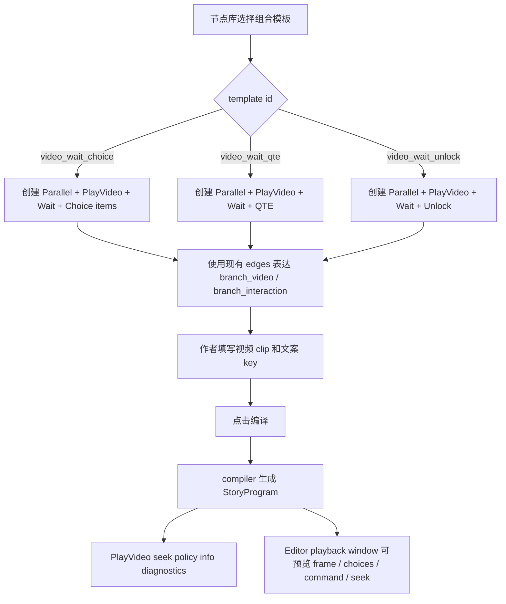

# Story Editor Interaction Authoring Patterns Design

## 0. 术语约定

| 术语 | 定义 | 防冲突结论 |
|---|---|---|
| 互动编排模板 | Story Editor 节点库里的组合模板，一次创建多个现有节点和连线 | 不是新的 `NodeKind`，不进入 runtime program |
| Wait-owned choice items | `Wait.completed` 连接多个 `Choice` item，由 compiler 合成一个 runtime Choice step | 用来表达“等待 N 秒后出现多个普通选项”，不新增 `TimedChoice` |
| Video interaction pattern | `Parallel + PlayVideo + Wait + Choice/QTE/Unlock` 的作者入口 | 只是一键生成图结构，运行时仍消费现有节点 |
| seek 推导诊断 | 编译成功后对 PlayVideo 节点显示的只读 `transition/disabled` 信息 | 不暴露 `playbackRole` / `seekable` 作者字段 |
| branch interaction video | 位于并行等待互动结构或直接承载 Choice/QTE/Unlock 的视频 | 默认不可 seek，和纯过渡视频区分由 compiler 推导 |

术语 grep 结论：当前代码已有 `Parallel`、`Wait`、`Choice`、`Qte`、`Unlock` 和 compiler-inferred `__videoSeekPolicy`；没有组合模板 id、`TimedChoice`、`playbackRole` 或 `StoryPresentationAnchorPreset` 的当前实现。已有 `story-submit-choice-command` 仍是 draft 且不在本 roadmap 条目内，本 feature 不实现单选/多选提交节点。

## 1. 决策与约束

### 需求摘要

做什么：把已经闭合的运行时互动能力变成 Story Editor 默认作者入口。作者在节点库中可以直接拖出三种组合：

```text
视频中途选项:
Parallel
├── branch_video: PlayVideo(wait=true)
└── branch_interaction: Wait(N) -> Choice item A/B -> selected targets

视频中途 QTE:
Parallel
├── branch_video: PlayVideo(wait=true)
└── branch_interaction: Wait(N) -> Qte(success/fail)

视频中途 Unlock:
Parallel
├── branch_video: PlayVideo(wait=true)
└── branch_interaction: Wait(N) -> Unlock(success/fail)
```

为谁：需要在 Story Editor 里快速配置互动影游段落的剧情作者。作者不应该手写一堆分散节点，也不应该被要求理解内部 `__videoSeekPolicy` 或视频 role 字段。

成功标准：

- 节点库出现三个组合模板：视频中途选项、视频中途 QTE、视频中途 Unlock。
- 模板只生成现有节点和连线，不新增 runtime step、command 或字段。
- `Wait.completed` 可以像 Dialogue/Narration/Merge 一样连接多个 Choice item，编译后 wait target 指向 synthetic choice step。
- 组合模板中的 PlayVideo 位于 Parallel 分支内，编译后不写入 `__videoSeekPolicy=transition`。
- 线性纯过渡 PlayVideo 仍由 compiler 推导为 transition，并在 Editor 中以只读信息展示。
- PlayVideo schema 不出现 `playbackRole` / `seekable`，布局仍完全交给 interaction channel。

### 复杂度档位

- `Runtime scope = none`：本 feature 不改 `Runtime/Story` 或 `Runtime/StoryPlayback` 的公开协议。
- `Editor authoring = pattern templates`：新增的是编辑器组合模板和端口/编译规则，不是新节点种类。
- `Choice model = existing item model`：多选项仍用多个普通 `Choice` item；提交式单选/多选留给独立 feature。
- `Seek model = compiler info`：继续由 compiler 推导 transition / disabled，Editor 只显示结果，不让作者手填。
- `Validation = graph + compiler`：图上先提示明显结构错误，compiler 继续做权威校验。

### 关键决策

1. 组合模板不进入 runtime。
   - 模板创建完成后，图里只剩 `Parallel`、`PlayVideo`、`Wait`、`Choice`、`Qte`、`Unlock` 等现有节点。
   - 删除模板能力不会影响旧资源或运行时 program。

2. `Wait` 需要成为 Choice item owner。
   - 视频 N 秒后出现多个选项时，单个 direct `Wait -> Choice` 只能表达一个选项，作者体验不够。
   - `Wait.completed -> Choice item A/B` 与现有 `Dialogue.completed -> Choice item A/B` 语义一致，只是出现时机由等待节点控制。

3. 模板默认值只填“结构必需且不会误导”的字段。
   - `PlayVideo.source=streaming_assets`、`wait=true`、`loop=false`。
   - `Wait.duration` 给一个可改的示例值。
   - QTE / Unlock 用可编译的最小参数和 success/fail target。
   - 视频 clip 仍需要作者选择真实资源；缺资源时保持现有字段诊断。

4. seek 诊断是只读结果，不是作者输入。
   - 编译成功后，PlayVideo 节点上可以显示 Info：`transition` 可显示时间条，`disabled` 不开放 seek。
   - 诊断来源是编译产物和 compiler 推导结果，不反向写回节点参数。

5. 不混入提交式单选/多选。
   - 普通 `Choice` 是点击即跳转。
   - “先选一个或多个答案再提交”是 blocking command 语义，应走 `story-submit-choice-command` 或后续 roadmap update。

### 明确不做

- 不新增 `TimedChoice`、`EvaluateMediaTime()`、media-time trigger 或 AE 式 timeline。
- 不新增 `StoryRunner.Seek()` / `StoryModule.Seek()` 或剧情随机访问。
- 不新增 `playbackRole`、`seekable`、layout slot、anchor、`StoryPresentationAnchorPreset` 或呈现协议字段。
- 不新增 `NodeKind.VideoChoiceTemplate` / `StoryStepKind.VideoChoice` / 任何 template runtime step。
- 不新增 QTE / Unlock command 协议；它们已经由前置 feature 闭合。
- 不实现单选提交、多选提交、题库、评分或提交后判分。
- 不改 runtime interaction channel、surface、默认播放 UI 或 AVPro seek 行为。
- 不让 `Runtime/Story` 引用 Editor graph、UI Toolkit、AVPro、UGUI 或 UIWindow 类型。

## 2. 名词与编排

### 2.1 名词层

#### 现状

- `NodeSchemaRegistry` 已把 `Parallel`、`Merge`、`Wait`、`Choice`、`PlayVideo`、`Qte`、`Unlock` 列入默认作者主路径。
- `StoryEditorGraphAdapter.BuildTemplates()` 当前只按 `NodeSchemaRegistry.Schemas` 生成单节点模板。
- `StoryEditorGraphAdapter.CreateNode()` 当前要求 `template.TemplateId` 能 parse 为 `NodeKind`，然后调用 `StoryEditorWindow.AddNodeFromGraph()`。
- `StoryEditorWindow` 已有 `AddNodeAt()`、`AddEdge()`、`CreateEdge()`、`AddEdgeToChapter()`、`NextParallelBranchPortId()`、`SetParameterValue()` 等能构造节点和连线的内部能力。
- `StoryEditorPortPolicy.CanOwnChoiceItems()` 当前只允许 Dialogue/Narration/Merge 拥有 Choice item；`Wait.completed -> Choice` 在图上会被拒绝。
- `StoryProgramCompiler.CanOwnChoiceItems()` 当前也只覆盖 Dialogue/Narration/Merge；`BuildWaitStep()` 不会为多个 Choice item 生成 synthetic choice step。
- `StoryEditorPlaybackWindow` 已显示只读 `seek policy: transition/disabled`，并只为带内部 transition policy 的视频显示 slider。
- `EditorGraphDiagnosticSeverity` 已支持 `Info`，Story graph 可以承载只读诊断。

#### 变化

新增 editor-only 模板 id，不进入 runtime schema：

```text
story.pattern.video_wait_choice
story.pattern.video_wait_qte
story.pattern.video_wait_unlock
```

模板显示：

```yaml
视频中途选项:
  category: 互动模板
  creates:
    - Parallel
    - PlayVideo(source=streaming_assets, wait=true, loop=false)
    - Wait(duration=3)
    - Choice item A(textKey=choice.option_a)
    - Choice item B(textKey=choice.option_b)
    - 两个默认后续 Narration 目标

视频中途 QTE:
  category: 互动模板
  creates:
    - Parallel
    - PlayVideo(source=streaming_assets, wait=true, loop=false)
    - Wait(duration=3)
    - Qte(inputActionId=space, durationSeconds=3, requiredCount=1, promptTextKey=qte.prompt)
    - success/fail 默认后续目标

视频中途 Unlock:
  category: 互动模板
  creates:
    - Parallel
    - PlayVideo(source=streaming_assets, wait=true, loop=false)
    - Wait(duration=3)
    - Unlock(puzzleType=node_unlock, promptTextKey=unlock.prompt)
    - success/fail 默认后续目标
```

`Wait` 扩展为 Choice item owner：

```text
Wait.completed -> Choice A(selected -> target A)
Wait.completed -> Choice B(selected -> target B)
```

编译后：

```yaml
wait_node:
  kind: Wait
  target: wait_node_choices

wait_node_choices:
  kind: Choice
  choices:
    - choiceId: choice_a
      target: target_a
    - choiceId: choice_b
      target: target_b
```

seek 诊断：

```yaml
PlayVideo in linear transition:
  graph diagnostic: Info / "编译器推导为纯过渡视频，可显示时间条"
  command argument: __videoSeekPolicy=transition

PlayVideo in Parallel interaction template:
  graph diagnostic: Info / "互动视频不开放 seek"
  command argument: absent
```

### 2.2 编排层



#### 现状

作者现在可以手动搭 `Parallel + Wait + Choice/QTE/Unlock`，但成本高且容易错：

1. 节点库一次只能创建一个节点。
2. Parallel 分支端口需要手动连出多个 `branch_*`。
3. QTE / Unlock outcome 必须补齐 success/fail 目标。
4. 多个普通选项如果要由 Wait 触发，目前缺少 Wait-owned Choice item 的图上规则和 compiler synthetic choice。
5. 是否可 seek 只有播放窗口的命令详情能看到，图上没有编译后提示。

#### 变化

创建模板时：

1. `StoryEditorGraphAdapter.BuildTemplates()` 在单节点模板之后追加三个组合模板。
2. `CreateNode()` 先识别组合模板 id；命中时调用 Story Editor 的组合创建入口；未命中时保持现有 NodeKind 单节点路径。
3. 组合创建入口在当前章节中批量创建节点、布局位置和连线：
   - 如果有 `connectFrom`，先把来源端口连到新建 `Parallel`。
   - `Parallel.branch_1 -> PlayVideo`，label 为视频轨。
   - `Parallel.branch_2 -> Wait`，label 为交互轨。
   - `Wait.completed -> Choice items / Qte / Unlock`。
   - QTE / Unlock 的 success/fail 连到默认后续目标，避免创建后立即缺 outcome。
4. 创建完成后选中新建节点组，刷新图和诊断。

编译时：

1. `StoryEditorPortPolicy` 允许 `Wait.completed -> Choice`，并允许 Wait.completed 多连到多个 Choice item。
2. compiler 把 Wait-owned Choice item 隐藏为 synthetic choice step，和 line/Merge choice item 共用目标/条件合并规则。
3. `BuildWaitStep()` 在 Wait 拥有 Choice item 时，target 指向 synthetic choice step；若同一端口混连 Choice item 和普通节点，返回定位错误。
4. `Parallel` 内的 PlayVideo 继续被 `CanInferTransitionVideo()` 判为 disabled，不写内部 seek policy。

诊断时：

1. 本地图诊断继续覆盖字段必填、类型、端口、Choice selected、Parallel 分支数量。
2. 编译成功后，Story Editor 基于 `m_LastCompiledProgram` 为当前章节 PlayVideo 节点生成 Info 诊断：
   - transition：显示可显示时间条。
   - disabled：显示互动/并行/缺省结构不开放 seek。
3. 图修改后，编译结果诊断标记 stale 或清空，避免展示旧推导。

流程级约束：

- 模板不能绕过 `StoryEditorPortPolicy` 的容量和合法性规则；批量创建也要写出可被普通图编辑器继续编辑的边。
- 模板创建的所有节点都必须是 `NodeSchemaRegistry.IsDefaultAuthoringNode()` 返回 true 的节点。
- 模板默认参数不能包含内部 `__videoSeekPolicy`，该字段只由 compiler 写入编译产物。
- `Wait.completed` 可以拥有 Choice item，但不能同时连普通流程目标和 Choice item。
- QTE / Unlock 模板默认必须产生 success/fail 两个 outcome target。
- 组合模板产生的视频默认不可 seek；作者要纯过渡视频时仍使用普通 PlayVideo 线性连接。

### 2.3 挂载点清单

- 组合模板 id 和节点库展示：删掉后作者入口回到手动搭图。
- 组合模板创建入口：删掉后模板无法批量生成 `Parallel + Wait + Choice/QTE/Unlock` 结构。
- Wait-owned Choice item 端口/编译规则：删掉后视频 N 秒后多个普通选项无法用现有 Choice item 模型表达。
- seek policy Info 诊断：删掉后作者只能在播放窗口命令详情里看到推导结果。
- Editor tests / sample assertions：删掉后模板是否仍只生成现有节点、是否不暴露 role 字段缺少守护。

### 2.4 推进策略

1. Wait-owned Choice item：扩展端口策略、compiler synthetic choice 和本地图上混连诊断。
   退出信号：`Wait.completed -> Choice A/B` 可连线，编译后等待结束出现两个普通 `StoryChoice`。
2. 组合模板注册：在节点库追加三个 editor-only pattern template id，并保持原单节点模板路径不变。
   退出信号：palette/menu 能看到三类互动模板，普通节点创建不受影响。
3. 组合模板创建：批量生成 `Parallel + PlayVideo + Wait + Choice/QTE/Unlock` 的现有节点和连线，并设置安全默认参数。
   退出信号：模板创建出的图可继续编辑；补齐视频 clip 后能编译；QTE/Unlock outcome 默认完整。
4. seek 推导诊断：编译成功后把 PlayVideo 的 transition/disabled 结果投影成 Info 诊断，并保持播放窗口现有 slider 行为。
   退出信号：纯过渡视频显示 transition 信息，模板里的并行互动视频显示 disabled 信息，图修改后诊断不过期误导。
5. 测试与范围守护：补 editor/compiler tests 和 grep。
   退出信号：相关 editor tests 通过；未新增 TimedChoice、playbackRole、seekable、layout slot、Story seek 或 runtime UI 依赖。

### 2.5 结构健康度与微重构

##### 评估

- compound convention 检索：未命中 Story Editor 组合模板、目录组织或命名相关 decision。
- 文件级 - `StoryEditorGraphAdapter.cs`：已经包含 adapter、port policy、diagnostics 三类职责；模板 id 注册可以小改，但组合创建细节不应继续堆在这里。
- 文件级 - `StoryEditorWindow.cs`：已经接近 1600 行，拥有节点增删改和边写回 helper；组合创建需要访问这些 helper，但不适合把大段模板构造塞进主文件。
- 文件级 - `StoryProgramCompiler.cs`：已经偏胖；Wait-owned choice 是 compiler 语义扩展，仍应沿用现有 choice helper，避免另起平行编译器。
- 目录级 - `Assets/GameDeveloperKit/Editor/StoryEditor/`：目录已有 `Compiler`、`Playback`、`UI`、`Window` 分组；新增模板构造代码可落在 `Window` partial 或小 helper，目录不需要重组。
- Runtime 目录：本 feature 不需要新增 Runtime/Story 或 StoryPlayback 文件。

##### 结论：不做前置微重构，新增模板构造落新 Editor 文件

本 feature 不做“只搬不改行为”的前置微重构。实现时允许把 `StoryEditorWindow` 改为 `partial`，把组合模板构造放到新的 editor-only partial 文件中；这不是移动旧行为，只是避免继续膨胀主窗口文件。`StoryEditorGraphAdapter` 只保留模板列表和分派，`StoryProgramCompiler` 只补 Wait-owned choice 的最小语义扩展。

##### 超出范围的观察

- `StoryEditorGraphAdapter.cs` 同时放 adapter、port policy、diagnostics，后续如果继续增加编辑器能力，建议单独走 `cs-refactor` 拆分。
- `StoryProgramCompiler.cs` 的 command / choice / parallel 逻辑继续增长，后续可以把 graph analysis helper 与 node build helper 分离；本 feature 不阻塞。
- 提交式单选/多选已经有 draft 设计，但不是本 roadmap 当前条目；若确认要做，应先回 roadmap update，再进入 feature-design/impl。

## 3. 验收契约

| 场景 | 输入 / 触发 | 期望可观察结果 |
|---|---|---|
| N1 模板可见 | 打开 Story Editor 节点库 | 存在视频中途选项、视频中途 QTE、视频中途 Unlock 三个组合模板 |
| N2 普通模板兼容 | 创建普通 PlayVideo / Wait / Choice 节点 | 仍走原单节点创建路径，节点和字段行为不变 |
| N3 视频中途选项模板 | 创建组合模板 | 生成 Parallel、PlayVideo、Wait、至少两个 Choice item 和 selected target，边使用现有 branch/completed/selected |
| N4 Wait 多选项 | `Wait.completed` 连两个 Choice item，各自 selected 到目标 | 图上允许连接，编译后 wait 结束输出两个 `StoryChoice` |
| N5 Wait 混连错误 | `Wait.completed` 同时连 Choice item 和普通节点 | 图上或 compiler 返回定位错误 |
| N6 QTE 模板 | 创建视频中途 QTE 模板并补齐视频 clip | 编译产物包含 `qte` command，success/fail outcome 均有目标 |
| N7 Unlock 模板 | 创建视频中途 Unlock 模板并补齐视频 clip | 编译产物包含 `unlock` command，success/fail outcome 均有目标 |
| N8 并行互动不可 seek | 编译三类模板中的 PlayVideo | command arguments 不包含 `__videoSeekPolicy=transition` |
| N9 纯过渡仍可 seek | 线性 PlayVideo 指向普通后续流程 | command arguments 包含 `__videoSeekPolicy=transition` |
| N10 seek 诊断 | 编译成功后查看当前章节 PlayVideo 节点 | 图上出现 Info 诊断，显示 transition 或 disabled 的只读推导结果 |
| N11 播放窗口兼容 | 用 Editor playback window 播放 transition / disabled 视频 | transition 视频显示 slider，disabled 视频不显示 slider |
| N12 stale 行为 | 编译成功后修改图结构 | 旧 seek 推导诊断被清空或标记过期，不继续当成最新结果 |
| B1 范围守护 | grep `TimedChoice` / `EvaluateMediaTime` | 本 feature 不新增媒体时间触发 |
| B2 范围守护 | grep `playbackRole` / `seekable` in authoring schema | PlayVideo 不暴露作者 role / seek 字段 |
| B3 范围守护 | grep `StoryRunner.Seek` / `StoryModule.Seek` | 不新增剧情 seek |
| B4 范围守护 | grep `StoryPresentationAnchorPreset` / layout slot / anchor | 不恢复呈现协议 |
| B5 Runtime 隔离 | 检查 `Assets/GameDeveloperKit/Runtime/Story` 和 StoryPlayback public surface | 不新增 runtime step、interaction channel 接口或 UI/Editor 引用 |
| B6 Submit choice 边界 | grep `submit_choice` 相关新增实现 | 本 feature 不实现单选/多选提交 command |

明确不做的反向核对：

- 模板创建后图里没有 template-only runtime 节点。
- 组合模板不写入内部 `__videoSeekPolicy` 参数。
- QTE / Unlock 协议不在本 feature 里二次定义。
- 普通 Choice 点击即跳转语义不变。

## 4. 与项目级架构文档的关系

本 feature 是 `story-interactive-video` roadmap 第 6 条，依赖 `story-transition-video-seek-controls`、`story-parallel-wait-interaction-flow`、`story-video-qte-command` 和 `story-unlock-interaction-flow`。它只把前置 runtime/playback 能力暴露成 Story Editor 默认作者路径。

验收完成后需要回写：

- `.codestable/architecture/ARCHITECTURE.md`：记录 Story Editor 支持组合互动模板、Wait-owned Choice item 和编译器 seek info 诊断。
- `.codestable/requirements/story-editor.md`：追加“编辑器可一键创建视频中途 Choice/QTE/Unlock 编排模板”的实现进展。
- `.codestable/roadmap/story-interactive-video/story-interactive-video-items.yaml`：验收时把本条从 `in-progress` 改为 `done`。
