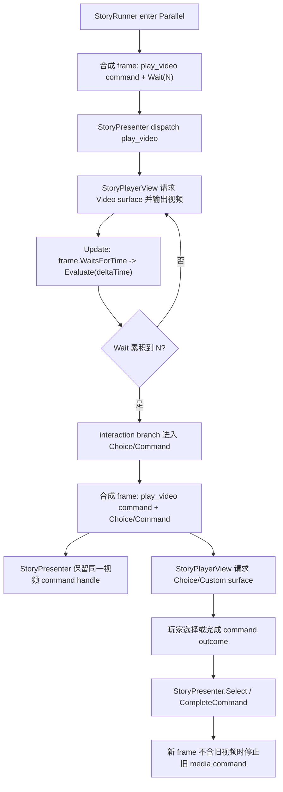

# Story Parallel Wait Interaction Flow Design

## 0. 术语约定

| 术语 | 定义 | 防冲突结论 |
|---|---|---|
| parallel wait interaction flow | 作者用 `Parallel` 分出媒体轨和交互轨，交互轨通过 `Wait(N)` 延迟进入 `Choice` 或 command | 不是新节点，不是新 runtime step |
| persistent media branch | 并行中的 `PlayVideo(waitForCompletion: true)` 分支；在等待轨推进期间继续保持 command track | 只表示 frame 中命令仍活跃，不表示剧情级 seek 或媒体时间绑定 |
| interaction branch | 并行中的 `Wait(N) -> Choice/Command` 分支 | UI 出现时机由 StoryPlayback 推进 `Evaluate(deltaTime)` 决定 |
| session-time trigger | `Wait` 使用 StoryPlayback update delta 累积时间 | 不读取 AVPro `CurrentTimeSeconds`，不调用 `EvaluateMediaTime()` |
| parallel interaction frame | wait 到点后合成出的同一 `StoryFrame`，通常同时包含视频 command track 和 choices/custom command track | `IInteractionChannel` 只按 frame 提供 surface |

术语 grep 结论：roadmap 已明确废弃 `TimedChoice`、media-time trigger 和 layout slot。现有代码里 `StoryRunner.EvaluateParallel()`、`StoryFrame.Choices`、`StoryPresenter` command key 和 `StoryPlayerView.Update()` 已经具备该流程的基础能力；本 feature 不引入新接口名。

## 1. 决策与约束

### 需求摘要

做什么：验证并补齐下面这种作者编排可以在运行时和 StoryPlayback 中闭合：

```text
Parallel
├── branch_video: PlayVideo(waitForCompletion: true) -> Merge
└── branch_interaction: Wait(35) -> Choice item... -> selected target
```

运行时初始 frame 同时包含视频 command 和 wait track；StoryPlayback 播放视频并按 update delta 推进 wait。wait 到点后，新的 frame 保留视频 command track，同时出现普通 `frame.Choices`。交互通道通过已有 `GetPlaybackSurfaceView(Choice)` 返回等量按钮，玩家点击后调用 `Select(choiceId)`。

为谁：需要影游式“视频播放到剧情时间点后出现选项/互动”的剧情作者和运行时播放层。

成功标准：

- 不新增 `TimedChoice`、`EvaluateMediaTime()`、media-time interaction model 或新 Story runtime step。
- `Wait` 触发基于 StoryPlayback session time，由 `Evaluate(deltaTime)` 推进。
- wait 到点后，视频 command track 保留在合成 frame 中，选项或 command interaction 能同帧呈现。
- `IInteractionChannel` 按已有 `InteractionRequestKind.Choice` / `Custom` 获取 UI surface，不新增一组 interaction layer 接口。
- 玩家选择后按现有并行选择语义跳到选择目标；不再出现在新 frame 的 sibling media command 由 `StoryPresenter` 停止。
- 并行等待互动视频不获得 transition seek policy，不显示 seek bar。

### 复杂度档位

- `Runtime model = reuse`：复用 `Parallel`、`Wait`、`Choice`、command outcome 和 `StoryFrame` gate flags。
- `Trigger clock = session time`：本 feature 不做 AVPro 媒体时间精确触发。
- `Playback change = integration`：主要补测试和小修兜底，避免为单一场景新增抽象。
- `UI boundary = existing channel`：仍通过 `IInteractionChannel` 提供 `RawImage`、文本、等量按钮和 custom root。
- `Editor scope = guard only`：只验证现有 authoring/compile 能表达该结构；一键模板留给 `story-editor-interaction-authoring-patterns`。

### 关键决策

1. `Wait(N)` 就是视频中途交互的主表达。
   - 这符合当前节点库，不需要 `TimedChoice`。
   - 如果未来需要严格绑定 AVPro 当前时间，必须回 roadmap update。

2. 视频保持活跃直到 frame 不再包含它。
   - wait 轨推进成 choice 时，video 分支仍处于 command frame，合成 frame 继续包含该 command track。
   - `StoryPresenter` 的 command key 包含 branch id，能识别同一并行视频命令，不重复执行也不误停。

3. 选择出现后仍是普通 `Choice`。
   - UI 不知道它来自“视频 35 秒”；它只看到 `frame.Choices`。
   - 按钮绑定继续走 `StoryPresenter.Select(choiceId)`。

4. 玩家选择默认跳出并行。
   - 现有 `SelectParallel()` 语义是选中后跳到 choice target，不等待 sibling branches。
   - 因此视频常见行为是：选项显示时视频还在，玩家选择后旧视频命令停止，目标剧情负责播放下一段或进入下一帧。

5. command interaction 只验证通用链路。
   - `Wait(N) -> command` 可以同帧叠加在视频 command 上。
   - QTE / unlock 的 payload、输入判定和 UI 玩法属于后续 feature。

### 明确不做

- 不新增 `TimedChoice`、`StoryInteractionKind.TimedChoice` 或 `EvaluateMediaTime()`。
- 不新增 `StoryRunner.Seek()`、`StoryModule.Seek()` 或让拖动时间条重放剧情状态。
- 不新增 `IStoryInteractionLayer`、`IStoryInteractionChannel`、surface provider 或 layout slot 协议。
- 不让 `Runtime/Story` 引用 UGUI、AVPro、UIWindow、Editor graph 或播放窗口类型。
- 不实现 QTE / unlock 的具体玩法，只保证 `Wait -> command` 这条泛化编排可被同帧呈现和完成。
- 不做 Story Editor 一键创建模板、节点面板优化或作者 UX；这些属于后续 editor authoring feature。
- 不保证 `Wait(N)` 与视频解码时间、seek 后媒体时间或掉帧后的 AVPro time 严格一致。
- 不让并行等待互动视频获得 `__videoSeekPolicy=transition`。

## 2. 名词与编排

### 2.1 名词层

#### 现状

- `StoryFrame` 已包含 `Tracks`、`Choices`、`WaitsForChoice`、`WaitsForCommand`、`WaitsForTime`。同一 frame 可同时有 command track、wait track 和 choices。
- `StoryRunner.BuildParallelFrame()` 会为每个 branch 建立 cursor；`CombineParallelFrame()` 把未完成分支的 tracks/choices/gate flags 合成一个 frame。
- `StoryRunner.EvaluateParallel()` 只推进当前处于 time wait 的 branch；其它 command branch 会原样保留。
- `StoryChoice.WithBranch(branchId)` 会把并行分支 id 写入 choice，`SelectParallel()` 通过 branch id 定位选择来源。
- `StoryPresenter.BuildCommandKey()` 使用 `branchId + commandId`，frame 切换时只停止下一帧中缺失的 blocking command。
- `StoryPlayerView.Update()` 在 `m_CurrentFrame.WaitsForTime` 时调用 `m_Presenter.Evaluate(Time.deltaTime)`；`RenderFrame()` 会按新 frame 请求 text、continue、choice、video、image surface。
- `PlaybackSurfaceView.ChoiceButtons` 已要求与 `frame.Choices` 等量，缺失或数量不匹配时报配置错误。
- 现有测试覆盖了 parallel wait、parallel choice、parallel command stop，但缺少“视频 command + wait -> choice/command 同帧叠加”的焦点验收。

#### 变化

本 feature 不新增公开 runtime 名词。它把下面的组合固化为受测契约：

```text
Initial frame:
  Tracks:
    Command(play_video, branch_video)
    Wait(35, branch_interaction)
  Gates:
    WaitsForCommand = true
    WaitsForTime = true

After Evaluate(35):
  Tracks:
    Command(play_video, branch_video)
  Choices:
    StoryChoice(..., BranchId = branch_interaction)
  Gates:
    WaitsForCommand = true
    WaitsForChoice = true
    WaitsForTime = false
```

通用 command interaction 的受测契约：

```text
Parallel
├── branch_video: PlayVideo(waitForCompletion: true)
└── branch_interaction: Wait(12) -> Command(name: custom_interaction, outcomes: success/fail)

After Evaluate(12):
  Tracks:
    Command(play_video, branch_video)
    Command(custom_interaction, branch_interaction)
  Gates:
    WaitsForCommand = true
```

对 StoryPlayback 而言，变化是补齐可观察保证：

- wait 到点后会再次 `OnFrameChanged(frame)`。
- 同一帧仍会发出 `InteractionRequestKind.Video`，确保当前章节视频 surface 仍是活跃输出目标。
- 同一帧会发出 `InteractionRequestKind.Choice`，让 channel 显示按钮。
- continue button 仍隐藏，因为 frame 有 choice 或 command gate。

### 2.2 编排层



#### 现状

当前流程已经接近目标：

1. `StoryRunner` 进入 parallel 时为每条 branch 创建 cursor。
2. video branch 停在 blocking command frame。
3. wait branch 停在 wait frame。
4. `CombineParallelFrame()` 合并为一个 frame。
5. `StoryPresenter` dispatch command，`StoryPlayerView.Update()` 推进 wait。
6. wait 到点后，`EvaluateParallel()` 只替换 wait branch，video branch 继续存在。

缺口是这些行为目前分散在多个老测试里，没有一条 feature 级验收能证明 video + wait -> choice/command 与 interaction channel、seek policy 边界一起成立。

#### 变化

实现阶段按“先验证，后小修”的顺序推进：

1. 补 runtime fixture：手写 `StoryProgram` 构造 `PlayVideo(wait=true)` + `Wait -> Choice`。
2. 验证 initial frame 同时有 video command 和 wait track。
3. 调用 `Evaluate(N)` 后验证 frame 同时保留 video command 并出现 choices。
4. 验证 `Select(choiceId)` 不等待 video branch，且选择目标进入新 frame。
5. 补 presenter 测试：wait 到点导致 frame 从 `video + wait` 变成 `video + choice` 时，不停止同一个 video handle；选择后新 frame 不含 video 时停止它。
6. 补 playback/channel 测试：`StoryPlayerView` 在 wait 到点后的 render 中请求 choice surface，同时 video surface 仍按 frame track 请求。
7. 补 compiler/editor guard：并行等待互动中的 `PlayVideo` 不写入 `__videoSeekPolicy=transition`，节点库不出现 `TimedChoice`。

流程级约束：

- `StoryPlayerView.Update()` 只在 `frame.WaitsForTime` 时推进 `Evaluate(deltaTime)`；choice 显示后不继续自动推进。
- choice 显示期间 `Continue` surface 不可见。
- `ChoiceButtons.Count != frame.Choices.Count` 必须继续报错。
- command interaction 使用 `CompleteCommand(commandId, outcomeId)` 推进，不建立独立 input state。
- 如果 wait branch 的 choice target 跳到 parallel 外，旧 video command 被停止是正确行为。
- 如果作者希望选择后视频继续，目标分支应显式进入包含目标视频的后续 frame；本 feature 不做“选择后保留 sibling video”的隐式规则。

### 2.3 挂载点清单

- `Parallel + Wait + Choice/Command` 编排契约：删掉它，视频中途交互就无法用现有节点表达。
- `StoryRunner.EvaluateParallel()` 的分支时间推进：删掉它，wait 轨无法在视频播放期间到点切换。
- `StoryPresenter` command handle 保留/停止策略：删掉它，wait 到点可能误停视频或选择后不清理旧媒体。
- `StoryPlayerView` wait 推进与 surface request：删掉它，默认播放器无法把 session time 推到 choice，也无法让 channel 显示按钮。
- compiler seek policy guard：删掉它，并行等待互动视频可能被误判为 transition 并显示 seek bar。

### 2.4 推进策略

1. Runtime 契约验证：补 `PlayVideo + Wait -> Choice` 和 `PlayVideo + Wait -> Command` 的并行程序验收。
   退出信号：`Evaluate(N)` 后 frame 保留 video command，并出现 choice 或 interaction command。
2. Presenter 命令生命周期：验证 wait-to-choice frame 切换不停止同一视频命令，选择跳出后停止旧视频。
   退出信号：测试能观察同一 command handle 保留到 choice frame，且在新 frame 缺失时被 stop。
3. StoryPlayback interaction channel：验证默认 view / custom channel 能在 wait 到点后请求 `Choice` surface，并保持 `Video` surface 请求。
   退出信号：channel 收到 `Video` 和 `Choice` request，choice 按等量按钮绑定，continue 隐藏。
4. Compiler / Editor 守护：补并行等待互动 graph 的编译与 seek policy 断言。
   退出信号：该结构可编译；其中 `PlayVideo` 不包含 `__videoSeekPolicy=transition`。
5. 范围守护与构建：跑相关测试和 grep。
   退出信号：构建/测试通过，且未出现 TimedChoice、media-time API、Story seek、新 interaction layer 或 Runtime/Story UI 引用。

### 2.5 结构健康度与微重构

##### 评估

- compound convention 检索：未命中 StoryPlayback interaction flow 的目录组织或命名 convention；当前约束以 roadmap 和 architecture 为准。
- 文件级 - `Assets/GameDeveloperKit/Runtime/Story/Runtime/StoryRunner.cs`：文件偏大且包含并行状态机，但本 feature 主要验证已有分支推进；除非测试暴露 bug，不做结构拆分。
- 文件级 - `Assets/GameDeveloperKit/Runtime/StoryPlayback/StoryPlayerView.cs`：文件偏大，已承担默认 UI、surface request、update 和媒体刷新；本 feature 应优先补测试，避免继续加新抽象。
- 文件级 - `Assets/GameDeveloperKit/Runtime/StoryPlayback/StoryPresenter.cs`：职责集中在 frame 派发和 command handle 生命周期；若发现误停/漏停，只做定点修复。
- 目录级 - `Assets/GameDeveloperKit/Tests/Runtime/` 与 `Assets/GameDeveloperKit/Tests/Editor/`：已有 StoryModule / StoryEditor / StoryPlayback 相关测试文件，新增测试放在既有归属内，不重组目录。

##### 结论：不做前置微重构

本 feature 不做“只搬不改行为”的微重构。原因是目标是把已存在的多轨编排链路锁进验收；前置拆 `StoryRunner` 或 `StoryPlayerView` 会放大风险并推迟真正验证。若实现中发现必须修改逻辑，按现有职责定点小修。

##### 超出范围的观察

`StoryRunner` 和 `StoryPlayerView` 都已经偏胖。后续 `story-video-qte-command`、`story-unlock-interaction-flow` 继续叠加后，建议单独走 `cs-refactor`，把并行分支计算、默认 UI 构造、surface 请求和媒体刷新拆成更小的内部组件；这不阻塞本 feature。

## 3. 验收契约

| 场景 | 输入 / 触发 | 期望可观察结果 |
|---|---|---|
| N1 初始并行帧 | program 为 `Parallel(video command, wait branch)` | frame 同时包含 `play_video` command track 和 wait track；`WaitsForCommand=true` 且 `WaitsForTime=true` |
| N2 wait 到点出现选项 | 对 N1 frame 调用 `Evaluate(waitSeconds)` | frame 保留 `play_video` command track，并出现 `frame.Choices`；choice 带 interaction branch id |
| N3 choice 期间 UI gate | wait 到点后的 frame 交给 `StoryPlayerView` | 请求 `Choice` surface，等量按钮被绑定；continue button 不显示 |
| N4 视频 surface 保留 | wait 到点后的 frame 仍含 `play_video` | 仍请求 `Video` surface；同一视频 command handle 不因 wait branch frame 切换被 stop |
| N5 选择后跳转 | 玩家点击 choice button 或调用 `Select(choiceId)` | 进入 choice target；如果新 frame 不含旧视频，旧视频 command handle 被 stop |
| N6 session time 触发 | StoryPlayback update 推进 wait | 只通过 `Evaluate(deltaTime)` 累积，不读取 AVPro current time |
| N7 command interaction | program 为 `PlayVideo + Wait -> custom command(success/fail)` | wait 到点后 frame 同时含视频 command 和 custom command；`CompleteCommand` outcome 可推进 |
| N8 并行互动视频不可 seek | 编译 `Parallel(PlayVideo, Wait->Choice/Command)` authoring graph | PlayVideo command 不包含 `__videoSeekPolicy=transition` |
| N9 choice button 数量错误 | custom channel 对 choice request 返回按钮数不等于 choices | 报配置错误，不静默复用旧按钮 |
| B1 范围守护 | grep `TimedChoice` / `EvaluateMediaTime` | 本 feature 不新增 timed choice 或媒体时间 runtime API |
| B2 范围守护 | grep `StoryRunner.Seek` / `StoryModule.Seek` | 不新增剧情 seek |
| B3 范围守护 | grep `IStoryInteractionLayer` / `IStoryInteractionChannel` / `IStoryPlaybackSurfaceProvider` | 不新增额外交互层接口 |
| B4 Runtime 隔离 | 检查 `Assets/GameDeveloperKit/Runtime/Story` | 不引用 UGUI、AVPro、UIWindow、Editor graph 或播放窗口类型 |
| B5 节点库守护 | 查询默认 authoring node | 不新增 `TimedChoice` 节点或 media-time trigger 字段 |

明确不做的反向核对：

- 不让 seek bar 或 AVPro 当前时间触发 choice。
- 不给 `PlayVideo` 增加 `playbackRole` / `seekable` 作者字段。
- 不实现 QTE / unlock payload、输入判定或 UI 玩法。
- 不做 Editor 一键创建模板。

## 4. 与 roadmap / 架构文档的关系

本 feature 是 `story-interactive-video` roadmap 第 3 条。它验证第 4.1 节的核心图编排契约，并为后续 `story-video-qte-command` 与 `story-unlock-interaction-flow` 提供共同底座。

验收完成后需要回写：

- `.codestable/architecture/ARCHITECTURE.md`：记录 `Parallel + Wait + Choice/Command` 已作为视频中途互动的运行时闭合路径；wait 使用 session time；并行互动视频不获得 transition seek。
- `.codestable/requirements/story-module.md`：追加“媒体播放到指定时机后出现选项”已通过 session-time `Parallel + Wait` 路径落地。
- `.codestable/roadmap/story-interactive-video/story-interactive-video-items.yaml`：验收时把本条从 `in-progress` 改为 `done`。
