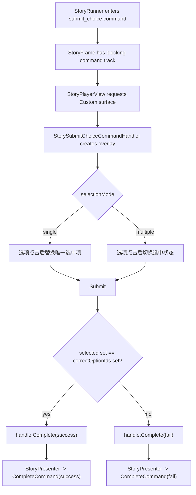

# Story Submit Choice Command Design

## 0. 术语约定

| 术语 | 定义 | 防冲突结论 |
|---|---|---|
| `submit_choice` command | Story command 名称，表示一次“先选择，再提交”的题目式互动 | 新 command，不是普通 `Choice`，不新增 `StoryStepKind` |
| Submit choice payload | `selectionMode`、`optionIds`、`optionTextKeys`、`correctOptionIds`、`promptTextKey` 等 command argument | 全部是 `StoryValue` 基础值；数组首版用稳定分隔字符串表达 |
| `selectionMode` | `single` 或 `multiple` | 决定默认 UI 是否允许选择一个或多个选项 |
| Single submit choice | 作者节点，编译为 `submit_choice(selectionMode=single)` | 不是现有 `NodeKind.Choice` 的替代品 |
| Multi submit choice | 作者节点，编译为 `submit_choice(selectionMode=multiple)` | 适合“选出所有正确答案” |
| Submit choice overlay | StoryPlayback 在 `Custom` surface 上显示的最小选择面板 | 默认只做选项按钮、提交、取消/失败 |
| Submit choice result | 玩家提交的 option id 集合 | 默认 handler 只用集合和 `correctOptionIds` 判断 success/fail；复杂判断交给业务 handler |

术语 grep 结论：现有 `Choice` 已稳定表示“点击某个选项立即走该分支”，不能复用为“先选中再提交”。`StoryValue` 当前只有 null / bool / number / string，没有数组值，因此首版 payload 中的 option 列表用 `|` 分隔字符串表达，后续若 StoryValue 扩展数组需另起 feature。

## 1. 决策与约束

### 需求摘要

做什么：新增两类作者节点：单选提交节点和多选提交节点。它们都编译为普通 blocking command：

```text
submit_choice(success/fail)
```

播放时，StoryPlayback 默认 handler 请求 `InteractionRequestKind.Custom` surface，在 `CustomRoot` 下显示题干、选项列表、提交按钮和取消/失败按钮。玩家可以先选择答案：

- 单选：最多选 1 个。
- 多选：可选多个。

点击提交后，默认 handler 读取 `correctOptionIds`，比较玩家选择集合是否完全相等。相等完成 `success`，不相等完成 `fail`。如果剧情需要“选 A 得 10 分、选 B 开隐藏线、部分正确”等复杂判断，业务提供自定义 command handler 或在 success/fail 后续节点里复用现有 `StoryExpression` / `IStoryFunctionResolver`，本 feature 不在 Story 核心内置题目判分系统。

为谁：需要剧情中出现“选择一个答案后提交”或“选择多个答案后提交”的互动作者，例如问答、调查、线索选择、证词选择。

成功标准：

- Story Editor 默认节点库能创建单选提交 / 多选提交节点。
- 两类节点都编译为 `submit_choice` command，携带 typed arguments 和 `success/fail` outcome。
- 默认 StoryPlayback 能在 `CustomRoot` 上显示最小选择提交 overlay。
- 单选模式最多保留一个选中项；多选模式允许多个选中项。
- 点击提交后，默认 handler 按 `correctOptionIds` 判断 success/fail 并推进剧情。
- 现有普通 `Choice` 的 `StoryFrame.Choices -> Select(choiceId)` 点击即跳转语义不变。

### 复杂度档位

- `Runtime model = command reuse`：复用 `StoryCommand` / outcome，不新增 `StoryStepKind`、`StoryFrame.Interactions` 或新 runtime gate。
- `Selection state = playback-local`：玩家临时勾选状态只存在于默认 overlay；不写入 `StorySnapshot`。
- `Payload model = string list`：首版用 `|` 分隔字符串保存 option ids / text keys，不扩展 `StoryValue` 数组。
- `Judge model = minimal`：默认只支持“提交集合完全等于正确集合”；复杂判断交给自定义 handler 或后续 feature。
- `UI = minimal default`：默认 UI 只保证可验收，不做完整问答编辑器、排序题、拖拽题或评分面板。

### 关键决策

1. 不改普通 `Choice`。
   - 普通 `Choice` 是运行时分支，点击按钮立即 `Select(choiceId)`。
   - 提交式选择有选中/取消/提交中间态，应走 command。

2. 单选和多选是两个作者节点，但共用一个 command。
   - 作者侧更直观：单选 / 多选分开创建。
   - runtime/playback 只处理 `submit_choice`，靠 `selectionMode` 决定 UI 行为。

3. 首版只定义 `success/fail`。
   - 答对走 success，答错或取消走 fail。
   - 不新增 `submitted`、`cancel`、`partial`、`timeout` 等默认 outcome。

4. 默认判断只做集合完全匹配。
   - 单选可以看作集合大小为 1。
   - 多选不关注顺序，去重后比较。
   - 未配置 `correctOptionIds` 是作者配置错误，不默认 success。

5. 复杂判断不进入 Story 核心。
   - 如果业务要把选择结果写入 DataModule、变量或积分系统，应自定义 handler。
   - 本 feature 不新增第二套 answer resolver；条件仍复用现有 `IStoryFunctionResolver`。

### 明确不做

- 不新增 `StoryStepKind.SingleChoice` / `StoryStepKind.MultiChoice` / `StoryStepKind.SubmitChoice`。
- 不修改 `StoryChoice`、`StoryFrame.Choices`、`StoryRunner.Select(choiceId)` 或普通 Choice 连接规则。
- 不扩展 `StoryValue` 数组类型；option 列表首版用字符串协议。
- 不新增题库系统、得分系统、部分正确、排序题、填空题、拖拽题、计时题或随机出题。
- 不新增 `timeout` / `partial` / `cancel` 默认 outcome；取消和失败都走 `fail`。
- 不把提交选择状态写入 `StorySnapshot`。
- 不接入 InputModule、手柄、键盘导航或 Unity Input System action asset。
- 不把 UI 逻辑放进 `Runtime/Story`，不让 Story 核心引用 UGUI、AVPro、UIWindow 或 Editor graph 类型。

## 2. 名词与编排

### 2.1 名词层

#### 现状

- `NodeKind.Choice` 位于 `Assets/GameDeveloperKit/Runtime/Story/AuthoringSchema/NodeKind.cs`，当前表示“选项项节点”；`Dialogue/Narration.completed -> 多个 Choice` 会由 compiler 合成 runtime `StoryStepKind.Choice`。
- `StoryChoice` 位于 `Assets/GameDeveloperKit/Runtime/Story/Program/StoryChoice.cs`，包含 `ChoiceId`、`TextKey`、`Condition`、`Target`；运行时通过 `StoryModule.Select(choiceId)` 立即跳转。
- `StoryCommand` / `StoryCommandDefinition` 已支持 command name、typed arguments、`WaitForCompletion`、`OutcomePorts` 和 `OutcomeTargets`。
- `StoryInteractionCommandNames` 已包含 `qte`、`unlock` 和 `success/fail` outcome。
- `StoryPlayerView` 对 QTE / unlock 这类互动 command 走 `InteractionRequestKind.Custom` + `CustomRoot`。

#### 变化

扩展 command 协议：

```csharp
public static class StoryInteractionCommandNames
{
    public const string SubmitChoice = "submit_choice";
    public const string SelectionModeArgument = "selectionMode";
    public const string SelectionModeSingle = "single";
    public const string SelectionModeMultiple = "multiple";
    public const string OptionIdsArgument = "optionIds";
    public const string OptionTextKeysArgument = "optionTextKeys";
    public const string CorrectOptionIdsArgument = "correctOptionIds";
    public const string PromptTextKeyArgument = "promptTextKey";
    public const string SuccessOutcome = "success";
    public const string FailOutcome = "fail";
}
```

新增作者节点：

```csharp
public enum NodeKind
{
    SingleSubmitChoice = 207,
    MultiSubmitChoice = 208
}
```

默认 schema：

```yaml
SingleSubmitChoice:
  displayName: 单选提交
  category: Interaction
  ports: [success, fail]
  parameters:
    promptTextKey: string required
    optionIds: string required       # "a|b|c"
    optionTextKeys: string required  # "answer.a|answer.b|answer.c"
    correctOptionIds: string required

MultiSubmitChoice:
  displayName: 多选提交
  category: Interaction
  ports: [success, fail]
  parameters:
    promptTextKey: string required
    optionIds: string required
    optionTextKeys: string required
    correctOptionIds: string required
```

编译产物示例：

```yaml
name: submit_choice
waitForCompletion: true
arguments:
  selectionMode: multiple
  promptTextKey: "question.find_clues"
  optionIds: "key|ticket|coin"
  optionTextKeys: "answer.key|answer.ticket|answer.coin"
  correctOptionIds: "key|ticket"
outcomes:
  success: chapter_01/right_answer
  fail: chapter_01/wrong_answer
```

默认 StoryPlayback handler：

```csharp
public sealed class StorySubmitChoiceCommandHandler : IStoryCommandHandler
{
    public bool CanHandle(StoryCommand command);
    public IStoryCommandHandle Execute(StoryCommand command, StoryRuntimeContext context);
}
```

### 2.2 编排层



#### 现状

普通 Choice 的运行时路径是：

1. compiler 生成 `StoryStepKind.Choice`。
2. `StoryFrame.Choices` 暴露可选项。
3. StoryPlayback 请求 `InteractionRequestKind.Choice` 并绑定等量按钮。
4. 玩家点击按钮后直接 `Select(choiceId)`，没有“提交”步骤，也没有在同一 frame 内保留多项临时选择。

QTE / unlock 的 command 路径已经证明：blocking command 可以请求 `CustomRoot`，由默认 handler 收集输入并完成 `success/fail`。

#### 变化

提交式选择走 command 路径：

1. 编译层把 `NodeKind.SingleSubmitChoice` / `NodeKind.MultiSubmitChoice` 编译为 `submit_choice` command。
2. compiler 自动写入 `selectionMode=single|multiple`，作者不需要手填。
3. compiler 校验：
   - `optionIds` 必填，拆分后至少 1 项。
   - `optionTextKeys` 必填，拆分后数量必须等于 `optionIds`。
   - option id 去重后数量不变，不能包含空项。
   - `correctOptionIds` 必填，且每个 correct id 必须存在于 `optionIds`。
   - single 模式下 `correctOptionIds` 只能有 1 项。
   - `success` / `fail` 两个 outcome 都必须有目标，其它 outcome 报错。
4. StoryPlayback 在 frame render 时对 `submit_choice` 请求 `Custom` surface；缺少 `CustomRoot` 是配置错误。
5. 默认 handler 解析 option 列表，创建最小 overlay：
   - prompt 文本。
   - 每个 option 一个按钮或 toggle。
   - submit 按钮。
   - fail/cancel 按钮。
6. 玩家点击 submit 后，handler 比较选中集合与 correct 集合：
   - 完全相等 -> `success`
   - 否则 -> `fail`
7. `StoryPresenter` 继续按 command handle outcome 推进剧情。

流程级约束：

- `submit_choice` command active 时 `WaitsForCommand=true`，continue button 不显示。
- 它可放在普通剧情流，也可放在 `Parallel + Wait(N)` 交互轨上，与视频同帧出现；默认不暂停媒体。
- 选中状态只存在 overlay 内；command stop/cancel 时清理 overlay，不触发 success/fail。
- 默认 handler 不把玩家选择写入 `StoryVariableStore` 或 `StorySnapshot`。
- 如果业务需要“后续节点根据具体选了哪些答案判断”，首版推荐业务自定义 command handler，把选择结果写入业务状态或变量，再用现有 function resolver 判断；本 feature 只内置 success/fail。
- 带 `submit_choice` 的互动视频不应获得 `__videoSeekPolicy=transition`。

### 2.3 挂载点清单

- `StoryInteractionCommandNames.SubmitChoice` command 协议：删掉后 editor/runtime/playback 无统一提交选择命令。
- `NodeKind.SingleSubmitChoice` / `NodeKind.MultiSubmitChoice` + 默认 schema：删掉后作者不能创建提交式单选/多选节点。
- Compiler 输出和校验：删掉后 option 列表、正确答案和 success/fail target 无稳定编译契约。
- StoryPlayback submit choice handler / overlay：删掉后默认播放器无法完成 blocking command。
- `Custom` surface request for `submit_choice`：删掉后章节 UI 无法提供提交式选择挂载根。

### 2.4 推进策略

1. 协议与 schema：新增 `submit_choice` command 常量、selection mode 常量、两个 NodeKind 和默认 schema。
   退出信号：查询默认节点库能看到单选提交 / 多选提交 schema，参数与端口正确。
2. Compiler 输出与校验：把两个节点编译为 `submit_choice` command，并校验 option / correct / outcome。
   退出信号：合法节点产出 typed command；非法 option 列表、非法正确答案、缺目标都有定位错误。
3. Runtime command 契约：补 command validation / runner 验收，覆盖 success/fail outcome 推进和与视频并行同帧。
   退出信号：`CompleteCommand(success/fail)` 能推进；`Parallel + Wait -> submit_choice` 到点后同帧保留视频和 submit_choice。
4. StoryPlayback Custom surface：让 `StoryPlayerView` 对 `submit_choice` 请求 `Custom` surface，并注册默认 handler。
   退出信号：channel 收到 `Custom` request；缺 `CustomRoot` 报配置错误；continue 隐藏。
5. 默认 overlay：实现单选/多选选中、提交判断、fail/cancel、stop/cancel 清理。
   退出信号：单选只保留一个选中项；多选可选多个；正确集合 success，错误集合 fail。
6. Seek guard 与范围守护：带 submit choice 的互动视频不写入 transition seek policy，并跑 build / grep。
   退出信号：不新增 StoryStepKind、TimedChoice、Story seek、InputModule 接入或 Runtime/Story UI 引用。

### 2.5 结构健康度与微重构

##### 评估

- compound convention 检索：未命中 submit choice / choice command 的长期命名约束；命中旧 choice item 经验，结论是普通 `Choice` 已有稳定语义，不应复用。
- 文件级 - `Assets/GameDeveloperKit/Runtime/Story/Runtime/StoryMediaCommandNames.cs`：当前承载媒体和互动 command 常量；扩展 `StoryInteractionCommandNames` 属于既有职责延伸。
- 文件级 - `Assets/GameDeveloperKit/Runtime/Story/AuthoringSchema/NodeSchemaRegistry.cs`：继续增加两个 schema 会变长，但仍是默认 schema registry 的既有职责。
- 文件级 - `Assets/GameDeveloperKit/Editor/StoryEditor/Compiler/StoryProgramCompiler.cs`：compiler 已偏胖；实现时应沿用 QTE / unlock 的 helper 风格，避免把解析逻辑散在主流程。
- 文件级 - `Assets/GameDeveloperKit/Runtime/StoryPlayback/StoryPlayerView.cs`：只允许加 `submit_choice` custom request 判定和 handler 注册，不把 overlay 逻辑塞进去。
- 目录级 - `Assets/GameDeveloperKit/Runtime/StoryPlayback`：默认互动 handler 正在增多，新增 submit choice handler 应落新文件，并同步 explicit csproj include。

##### 结论：不做前置微重构，新 handler 落新文件

本 feature 不做“只搬不改行为”的前置微重构。提交式选择是新互动能力，最小风险路径是复用现有 command/outcome/custom surface 模式，并把默认 overlay 放到独立 `StorySubmitChoiceCommandHandler.cs`。`StoryPlayerView` 只做注册和 custom request 判定。

##### 超出范围的观察

- `StoryProgramCompiler.cs` 后续会继续膨胀。建议在互动 command 增多后单独走 `cs-refactor`，拆 compiler command validation helper。
- 如果后续需要可视化编辑每个答案项，而不是 `|` 分隔字符串，应另起 Story Editor authoring feature，设计子项编辑 UI 或复合节点，不在本 feature 中临时扩展 schema 类型。

## 3. 验收契约

| 场景 | 输入 / 触发 | 期望可观察结果 |
|---|---|---|
| N1 schema | 查询默认节点 schema | 存在 `SingleSubmitChoice` / `MultiSubmitChoice`，参数为 prompt、optionIds、optionTextKeys、correctOptionIds，端口为 success/fail |
| N2 compile single | 编译单选提交节点 | 产物为 `StoryStepKind.Command`，command name 为 `submit_choice`，`selectionMode=single`，`waitForCompletion=true` |
| N3 compile multiple | 编译多选提交节点 | 产物为 `submit_choice` command，`selectionMode=multiple`，argument definitions typed |
| N4 option 校验 | optionIds 为空、含空项、重复，或 optionTextKeys 数量不一致 | compiler 返回定位错误 |
| N5 correct 校验 | correctOptionIds 为空、包含不存在 id，或 single 模式配置多个 correct | compiler 返回定位错误 |
| N6 outcome 校验 | success/fail 缺目标或出现其它 outcome | compiler 返回定位错误，runtime schema 不接受未声明 outcome |
| N7 success 推进 | 默认 overlay 选择正确集合并提交 | command handle 完成 `success`，StoryPresenter 推进 success target |
| N8 fail 推进 | 默认 overlay 选择错误集合、空提交或点击 Fail/Cancel | command handle 完成 `fail`，StoryPresenter 推进 fail target |
| N9 single UI | single 模式连续点击两个选项 | 只保留最后一个选中项 |
| N10 multiple UI | multiple 模式点击多个选项 | 可同时保留多个选中项，再次点击可取消 |
| N11 surface request | frame 有 `submit_choice` command | channel 收到 `Custom` request；缺 CustomRoot 报配置错误；continue button 不显示 |
| N12 并行视频 | `Parallel(PlayVideo, Wait -> submit_choice)` 到点 | frame 同时包含 video command 和 submit_choice command，不暂停视频 |
| N13 stop/cancel 清理 | command 离开 frame 或播放停止 | overlay 被清理，stop/cancel 不触发 success/fail |
| N14 不可 seek | 编译包含 submit choice 的互动视频结构 | `play_video` 不包含 `__videoSeekPolicy=transition` |
| B1 范围守护 | grep `StoryStepKind.SingleSubmitChoice` / `StoryStepKind.MultiSubmitChoice` / `StoryStepKind.SubmitChoice` | 本 feature 不新增 submit choice runtime step |
| B2 范围守护 | grep `TimedChoice` / `EvaluateMediaTime` / `StoryRunner.Seek` / `StoryModule.Seek` | 不新增媒体时间 trigger 或剧情 seek |
| B3 输入边界 | grep InputModule / Unity Input System action asset 接入 | 默认 submit choice 不接入平台输入映射 |
| B4 Runtime 隔离 | 检查 `Assets/GameDeveloperKit/Runtime/Story` | 不引用 UGUI、AVPro、UIWindow、Editor graph 或播放窗口类型 |

明确不做的反向核对：

- 普通 `Choice` 点击即跳转语义不变。
- 不新增 `partial` / `timeout` / `cancel` 默认 outcome。
- 不把玩家提交的具体答案写入 `StorySnapshot`。
- 不实现完整题库/问卷/评分系统。

## 4. 与 roadmap / 架构文档的关系

本 feature 是 `story-interactive-video` 之外新增的互动 command 能力，依赖已经落地的 `story-playback-view-input-layers` 和 `story-parallel-wait-interaction-flow`，并复用 QTE / unlock 的 command outcome + Custom surface 路线。

当前 roadmap 未列 `story-submit-choice-command` 条目；如果确认它属于互动视频路线，需要先回写 roadmap items，把它放在 `story-editor-interaction-authoring-patterns` 之前，因为 editor 模板应只开放 runtime/playback 已闭合的互动节点。

验收完成后需要回写：

- `.codestable/architecture/ARCHITECTURE.md`：记录 `submit_choice` command 协议、单选/多选提交节点、默认 Custom overlay、success/fail outcome 和普通 Choice 不变的边界。
- `.codestable/requirements/story-module.md`：追加“提交式单选/多选互动通过 command outcome 推进”的实现进展。
- `.codestable/roadmap/story-interactive-video/story-interactive-video-items.yaml`：如果本 feature 被纳入 roadmap，验收时把对应条目改为 done。
