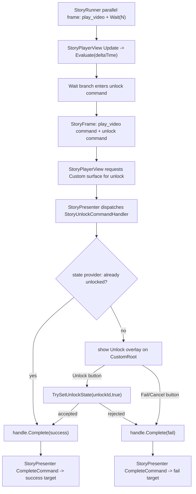

# Story Unlock Interaction Flow Design

## 0. 术语约定

| 术语 | 定义 | 防冲突结论 |
|---|---|---|
| `unlock` command | Story command 名称，表示一次解锁类互动 | 新 command，不是 `StoryStepKind`，不复用 `MiniGame` |
| Unlock payload | `unlockId`、`puzzleType`、`promptTextKey` 三个 command argument | 全部是 `StoryValue` 基础值，不保存 UI prefab 或 DataModule 对象 |
| `puzzleType` | `line_connect`、`node_unlock`、`custom` 三个首版枚举值 | 只描述玩法类型，不在 Story 核心实现玩法规则 |
| Unlock state provider | 读写 `unlockId -> unlocked` 的业务状态适配器 | 不直接依赖 DataModule；业务可自行包装 DataModule |
| Unlock overlay | StoryPlayback 在 `Custom` surface 上显示的最小解锁面板 | 默认只做确认/失败按钮，复杂玩法交给自定义 UI / handler |
| Unlock condition | 解锁是否可出现、后续分支是否可走的条件 | 复用现有 `StoryExpression` / `IStoryFunctionResolver`，不新增第二套 condition resolver |

术语 grep 结论：当前生产代码无 `unlock` / `Unlock` Story 互动协议；roadmap 4.6 有解锁协议草案，但代码已有 `IStoryFunctionResolver`，所以本 feature 不再新增 `IConditionResolver`。

## 1. 决策与约束

### 需求摘要

做什么：支持作者用现有多轨编排在视频或普通剧情流程中出现解锁互动：

```text
Parallel
├── branch_video: PlayVideo(waitForCompletion: true)
└── branch_interaction: Wait(20) -> unlock(success/fail)
```

wait 到点后，frame 同时包含视频 command 和 `unlock` command。StoryPlayback 默认 unlock handler 请求 `InteractionRequestKind.Custom` surface，在 `CustomRoot` 下显示最小 overlay：提示文本、玩法类型、当前状态、Unlock 按钮和 Fail/Cancel 按钮。默认 handler 通过 `IUnlockStateProvider` 读写 `unlockId`：已经解锁时直接完成 `success`；点击 Unlock 且状态写入成功后完成 `success`；点击 Fail/Cancel 或状态写入被拒绝时完成 `fail`。业务要连线、节点解锁、热点判定或复杂 UI 时，提供自定义 interaction channel / command handler / state provider，不改 Story 核心。

为谁：需要影游式“视频或剧情流程中出现解锁互动，并按成功/失败进入不同剧情分支”的剧情作者和播放层。

成功标准：

- `unlock` 编译为普通 `StoryCommand`，command schema 包含 typed arguments 和 `success/fail` outcome。
- `Wait(N) -> unlock` 可与 `PlayVideo` 并行，同帧保留视频 command 与 unlock command。
- 默认 StoryPlayback 能在 `CustomRoot` 上显示 unlock overlay，并通过 `StoryCommandHandle.Complete("success"|"fail")` 推进剧情。
- 默认 handler 能通过 `IUnlockStateProvider` 读写 unlock state，已解锁时幂等完成 success。
- unlock 不暂停视频/音频，不显示 continue button，不获得 transition seek policy。

### 复杂度档位

- `Runtime model = command reuse`：复用 `StoryCommand` / outcome，不新增 `StoryStepKind` 或 `StoryFrame.Interactions`。
- `State model = provider backed`：Story 核心只保存 `unlockId` 等基础参数；解锁状态由 provider 承接，不进入 StorySnapshot。
- `Playback UI = minimal default`：默认 UI 只保证可验收 success/fail，不做完整谜题玩法。
- `Editor scope = schema/compiler only`：本 feature 增加 Unlock 作者节点 schema 和编译校验；一键模板、图上组合 UX 留给 `story-editor-interaction-authoring-patterns`。
- `Condition = existing resolver`：解锁出现条件和分支条件继续使用现有 `StoryExpression` / `IStoryFunctionResolver`。

### 关键决策

1. Unlock 是 command，不是新 runtime step。
   - Story 核心只看到 blocking command 和 declared outcome。
   - 继续保持 `Parallel + Wait + Choice/Command` 的统一模型。

2. 首版只保证 `success/fail`，且两个 outcome 都必须声明目标。
   - 默认 handler 会真实走 `fail`，所以 fail target 不能是隐式可选。
   - 不新增 `canceled`、`timeout`、`locked` 等默认 outcome。

3. 条件系统不再新建。
   - roadmap 里的 condition resolver 由现有 `IStoryFunctionResolver` 承接。
   - unlock state provider 只负责状态读写，不负责表达式求值。

4. 默认 overlay 走 `Custom` surface。
   - 与 QTE 共用 `InteractionRequestKind.Custom` 和 `PlaybackSurfaceView.CustomRoot`。
   - 缺少 `CustomRoot` 时是配置错误。

5. 默认 state provider 是播放层会话内存，业务持久化要自定义。
   - StoryPlayback 可提供 session-local provider 让默认 UI 可运行。
   - 自定义 channel 可实现 `IUnlockStateProvider` 或由业务 handler 接管持久化。

### 明确不做

- 不新增 `StoryStepKind.Unlock`、`TimedChoice`、`EvaluateMediaTime()` 或媒体时间 trigger。
- 不新增 `StoryRunner.Seek()` / `StoryModule.Seek()`，不让带 unlock 的互动视频获得 transition seek。
- 不实现完整连线解锁、节点编辑器、热点编辑器、拖拽路径判定、手柄/触摸映射或平台输入系统。
- 不新增 `IConditionResolver`；条件仍走现有 `IStoryFunctionResolver`。
- 不把 unlock state 写入 StorySnapshot；需要持久化时由业务 provider 自己落 DataModule 或存档。
- 不做 Editor 一键创建 `Parallel + Wait + Unlock` 模板；只让 Unlock 节点本身可 authoring / compile。
- 不把 unlock UI 逻辑放进 `Runtime/Story`，不让 Story 核心引用 UGUI、AVPro、UIWindow 或 Editor graph 类型。

## 2. 名词与编排

### 2.1 名词层

#### 现状

- `StoryCommand` / `StoryCommandDefinition` 已支持 command name、typed arguments、`WaitForCompletion`、`OutcomePorts` 和 `OutcomeTargets`。
- `StoryInteractionCommandNames` 目前只有 `qte`、`success/fail` 和 QTE payload key，没有 `unlock` 协议。
- `NodeSchemaRegistry` 默认作者节点已有 `Qte`，没有 `Unlock`。
- `StoryProgramCompiler.BuildCommandStep()` 已能把 action/interaction 节点导出为 command，并有 QTE 特化校验。
- `StoryModule.Program.Validation` 已兜底校验 command typed arguments 和 declared outcome。
- `StoryRunner` 已通过 `StoryExpression` / `IStoryFunctionResolver` 执行条件，不需要新增 condition resolver。
- `StoryPlayerView.UpdateCustomSurfaces()` 目前只对 `qte` 请求 `Custom` surface。
- `StoryQteCommandHandler` 已证明默认 command overlay 可以挂在 `CustomRoot` 并用 command handle 推进 outcome。

#### 变化

扩展 Story runtime 数据协议常量：

```csharp
public static class StoryInteractionCommandNames
{
    public const string Unlock = "unlock";
    public const string SuccessOutcome = "success";
    public const string FailOutcome = "fail";
    public const string UnlockIdArgument = "unlockId";
    public const string PuzzleTypeArgument = "puzzleType";
    public const string PuzzleTypeLineConnect = "line_connect";
    public const string PuzzleTypeNodeUnlock = "node_unlock";
    public const string PuzzleTypeCustom = "custom";
    public const string PromptTextKeyArgument = "promptTextKey";
}
```

新增 unlock state provider：

```csharp
public interface IUnlockStateProvider
{
    bool TryGetUnlockState(string unlockId, out bool unlocked);
    bool TrySetUnlockState(string unlockId, bool unlocked, out string errorMessage);
}
```

默认作者节点：

```csharp
public enum NodeKind
{
    // existing...
    Unlock = 206
}
```

`NodeSchemaRegistry` 增加默认 schema：

```yaml
Unlock:
  displayName: Unlock
  category: Interaction
  ports: [success, fail]
  parameters:
    unlockId: string required
    puzzleType: option(line_connect,node_unlock,custom) required
    promptTextKey: string required
```

编译产物示例：

```yaml
name: unlock
waitForCompletion: true
arguments:
  unlockId: "chapter_01.door"
  puzzleType: "node_unlock"
  promptTextKey: "unlock.door"
outcomes:
  success: chapter_01/unlocked_line
  fail: chapter_01/locked_line
```

新增默认 StoryPlayback handler：

```csharp
public sealed class StoryUnlockCommandHandler : IStoryCommandHandler
{
    public bool CanHandle(StoryCommand command);
    public IStoryCommandHandle Execute(StoryCommand command, StoryRuntimeContext context);
}
```

该 handler 从 `StoryPlayerView` 获取当前 `CustomRoot` 和 `IUnlockStateProvider`。如果 provider 已显示 `unlockId` 解锁，立即 `Complete("success")`；否则创建最小 overlay。点击 Unlock 写入 provider 并完成 success；点击 Fail/Cancel 或 provider 拒绝写入时完成 fail。

### 2.2 编排层



#### 现状

QTE 已经补齐 “custom command -> Custom surface -> default overlay -> command outcome” 的基本路径。unlock 的缺口在于：

1. 没有稳定的 `unlock` command name / argument schema / outcome schema。
2. 没有 unlock state provider，默认播放层无法表达“已解锁 / 写入解锁状态”。
3. Story Editor 默认节点库没有 Unlock 节点。
4. `StoryPlayerView` 不会对 `unlock` 请求 `Custom` surface。
5. 默认播放层没有 unlock overlay 和 success/fail 输入。

#### 变化

1. 编译层把 `NodeKind.Unlock` 编译为 `unlock` command，强制 `waitForCompletion=true`，强制 `success/fail` 都有目标。
2. 编译层校验：
   - `unlockId` 必填且非空。
   - `puzzleType` 必填且只能是 `line_connect` / `node_unlock` / `custom`。
   - `promptTextKey` 必填。
   - `success` / `fail` 端口都必须有目标。
   - 出现其它 outcome 时返回定位错误。
3. StoryPlayback 在 frame render 时对 `unlock` command 请求 `InteractionRequestKind.Custom` surface；缺少 `CustomRoot` 时报配置错误。
4. StoryPlayback 注册 `StoryUnlockCommandHandler`，handler 使用当前 unlock state provider 和 CustomRoot 承接默认 UI。
5. `StoryPresenter` 继续只看 command handle 完成事件；不为 unlock 增加特殊推进 API。

流程级约束：

- unlock command 与视频同帧出现时，不停止视频、不暂停音频。
- unlock command active 时 frame 仍 `WaitsForCommand=true`，continue button 不显示。
- 已解锁的 `unlockId` 默认幂等完成 success，不重复显示 overlay。
- Fail/Cancel 不写入 unlock state，只完成 fail outcome。
- command 被 `Stop()` / `Cancel()` 时 overlay 必须清理，不调用 success/fail。
- unlock state provider 失败返回映射为 fail outcome；provider 缺失或 CustomRoot 缺失属于配置错误。
- 默认 unlock 不读取 AVPro current time，也不影响 transition video seek 判定。

### 2.3 挂载点清单

- `StoryInteractionCommandNames.Unlock` command 协议：删掉后 runtime/playback/editor 无统一 command name 与参数 key。
- `IUnlockStateProvider` + 默认 session state provider：删掉后默认 unlock 无法表达已解锁状态和写入结果。
- `NodeKind.Unlock` + `NodeSchemaRegistry` 默认 schema：删掉后作者不能创建/编译 Unlock 节点。
- StoryPlayback unlock handler 注册：删掉后 `unlock` command 会停在 blocking command，默认播放器无法完成 outcome。
- `Custom` surface request for `unlock`：删掉后 interaction channel 无法提供 unlock overlay 挂载根。
- Compiler transition seek guard：删掉后带 unlock 的互动视频可能被误判为 transition 并显示 seek bar。

### 2.4 推进策略

1. Command 协议与 state provider：建立 `unlock` command 常量、puzzle type 常量、`IUnlockStateProvider` 和默认 session provider。
   退出信号：runtime / playback 可通过 provider 读写 `unlockId` 状态，缺省 provider 能支撑默认 UI 测试。
2. Authoring schema 与 compiler：建立 `NodeKind.Unlock`、默认 schema、compiler 输出和 unlock 专用校验。
   退出信号：编译 Unlock 节点得到 `unlock` command，参数与 `success/fail` outcome 正确，非法 puzzleType / 缺目标给出定位错误。
3. Runtime 并行契约与状态契约：补 `Parallel + PlayVideo + Wait -> unlock` 运行时验收，并覆盖 success/fail outcome。
   退出信号：wait 到点后 frame 同时包含 video command 与 `unlock` command，`CompleteCommand(success/fail)` 可推进。
4. StoryPlayback custom surface 与默认 overlay：让 `StoryPlayerView` 对 `unlock` 请求 `Custom` surface，并注册默认 handler / overlay。
   退出信号：channel 收到 `Video` 与 `Custom` request；已解锁自动 success；点击 Unlock 写 state 并 success；点击 Fail/Cancel fail；stop 清理 overlay。
5. Editor / seek guard 与范围守护：补带 unlock 的视频不写入 `__videoSeekPolicy=transition`，并跑 build / grep。
   退出信号：未出现 TimedChoice、EvaluateMediaTime、Story seek、InputModule 接入、`IConditionResolver` 或 Runtime/Story UI 引用。

### 2.5 结构健康度与微重构

##### 评估

- compound convention 检索：未命中 Story unlock / command interaction / 目录组织相关 decision。
- 文件级 - `Assets/GameDeveloperKit/Runtime/Story/Runtime/StoryMediaCommandNames.cs`：当前同时承载媒体命令和互动命令常量，扩展 `StoryInteractionCommandNames` 属于既有职责延伸。
- 文件级 - `Assets/GameDeveloperKit/Runtime/Story/AuthoringSchema/NodeSchemaRegistry.cs`：增加一个 schema 属于既有职责延伸。
- 文件级 - `Assets/GameDeveloperKit/Editor/StoryEditor/Compiler/StoryProgramCompiler.cs`：compiler 已偏胖，但 command 节点编译集中在这里；unlock 校验应沿用 QTE helper 风格，避免大段散落。
- 文件级 - `Assets/GameDeveloperKit/Runtime/StoryPlayback/StoryPlayerView.cs`：已经承担 surface request、media refresh、wait 推进和 handler 注册；本 feature 只允许加 unlock custom request 判定和 handler 注册。
- 文件级 - `Assets/GameDeveloperKit/Runtime/StoryPlayback/StoryMediaCommandHandler.cs`：已包含 media handler、QTE handler 和 QTE overlay；继续塞 unlock handler 会把文件职责推向“所有默认互动”。
- 目录级 - `Assets/GameDeveloperKit/Runtime/StoryPlayback`：目录已偏平且 csproj 是 explicit compile include；新增文件需要同步 include，但比继续堆同一文件更清晰。

##### 结论：不做前置微重构，新 unlock handler 落新文件

本 feature 不做“只搬不改行为”的前置微重构。实现时新增 `StoryUnlockCommandHandler.cs` 承载默认 unlock handler / overlay / default state provider，并同步 `GameDeveloperKit.StoryPlayback.csproj` compile include；不移动 QTE 代码，不拆 StoryPlayerView。这样能把新增玩法放在明确文件内，避免继续膨胀 `StoryMediaCommandHandler.cs`，同时不引入目录重组风险。

##### 超出范围的观察

- `StoryPlayerView.cs`、`StoryProgramCompiler.cs` 和 `StoryMediaCommandHandler.cs` 都已出现职责拥挤。后续 `story-editor-interaction-authoring-patterns` 前，建议单独走 `cs-refactor`，拆 StoryPlayback 默认 command handlers / overlays、surface request 和 compiler command validation helper。
- 如果后续 unlock 发展成多种真实谜题玩法，应另起 feature 设计玩法插件接口；本 feature 只做 command protocol、state provider 和最小默认 overlay。

## 3. 验收契约

| 场景 | 输入 / 触发 | 期望可观察结果 |
|---|---|---|
| N1 Unlock schema | 查询默认节点 schema | 存在 `NodeKind.Unlock`，参数为 `unlockId`、`puzzleType`、`promptTextKey`，端口为 `success/fail` |
| N2 Unlock compile | 编译单个 Unlock 节点 | 产物为 `StoryStepKind.Command`，command name 为 `unlock`，`waitForCompletion=true`，schema argument definitions typed |
| N3 参数校验 | unlockId / promptTextKey 缺失或 puzzleType 非法 | compiler 返回定位错误 |
| N4 outcome 校验 | success/fail 缺目标或出现其它 outcome | compiler 返回定位错误，runtime schema 不接受未声明 outcome |
| N5 并行 Unlock | `Parallel(PlayVideo, Wait -> Unlock)`，Evaluate 到点 | frame 同时包含 video command 和 unlock command，`WaitsForCommand=true` |
| N6 state 已解锁 | provider 返回 unlockId 已解锁 | 默认 handler 不显示 overlay，直接完成 `success` |
| N7 unlock 成功 | 默认 overlay 点击 Unlock，provider 接受写入 | provider 状态变为 unlocked，handle 完成 `success` 并推进 success target |
| N8 unlock 失败 | 默认 overlay 点击 Fail/Cancel 或 provider 拒绝写入 | 不写入 unlocked，handle 完成 `fail` 并推进 fail target |
| N9 surface request | wait 到点后的 frame 交给 StoryPlayerView | channel 收到 `Custom` request；若同帧有视频也收到 `Video` request；continue button 不显示 |
| N10 缺 CustomRoot | channel 对 Unlock custom request 返回 null root | 报配置错误，不静默吞掉 unlock |
| N11 stop/cancel 清理 | Unlock command 离开 frame 或播放停止 | overlay 被清理，handle stop/cancel 不触发 success/fail |
| N12 Unlock 视频不可 seek | 编译包含 Unlock 的互动视频结构 | `play_video` 不包含 `__videoSeekPolicy=transition` |
| B1 范围守护 | grep `StoryStepKind.Unlock` / `TimedChoice` / `EvaluateMediaTime` | 本 feature 不新增 unlock runtime step 或媒体时间 runtime API |
| B2 范围守护 | grep `StoryRunner.Seek` / `StoryModule.Seek` | 不新增剧情 seek |
| B3 条件边界 | grep `IConditionResolver` | 不新增第二套 condition resolver，仍复用 `IStoryFunctionResolver` |
| B4 输入边界 | grep InputModule / Unity Input System action asset 接入 | 默认 unlock 不接入平台输入映射 |
| B5 Runtime 隔离 | 检查 `Assets/GameDeveloperKit/Runtime/Story` | 不引用 UGUI、AVPro、UIWindow、Editor graph 或播放窗口类型 |

明确不做的反向核对：

- 不新增 `StoryStepKind.Unlock`。
- 不新增 `locked` / `canceled` / `timeout` 默认 unlock outcome。
- 不做完整连线、节点或热点谜题编辑器。
- 不做 Editor 一键创建 `Parallel + Wait + Unlock` 模板。
- 不让 unlock 影响 transition video seek 判定之外的剧情 seek / media time 逻辑。

## 4. 与项目级架构文档的关系

本 feature 是 `story-interactive-video` roadmap 第 5 条，依赖 `story-playback-view-input-layers`、`story-parallel-wait-interaction-flow`，并复用 `story-video-qte-command` 已验证的 Custom surface / command outcome 路径。

验收完成后需要回写：

- `.codestable/architecture/ARCHITECTURE.md`：记录 `unlock` command 协议、`IUnlockStateProvider`、默认 StoryPlayback unlock handler / Custom surface overlay、success/fail outcome 约束、默认不暂停媒体和无 media-time trigger。
- `.codestable/requirements/story-module.md`：追加“解锁类互动通过 command outcome 和 unlock state provider 推进”实现进展。
- `.codestable/roadmap/story-interactive-video/story-interactive-video-items.yaml`：验收时把本条从 `in-progress` 改为 `done`。
