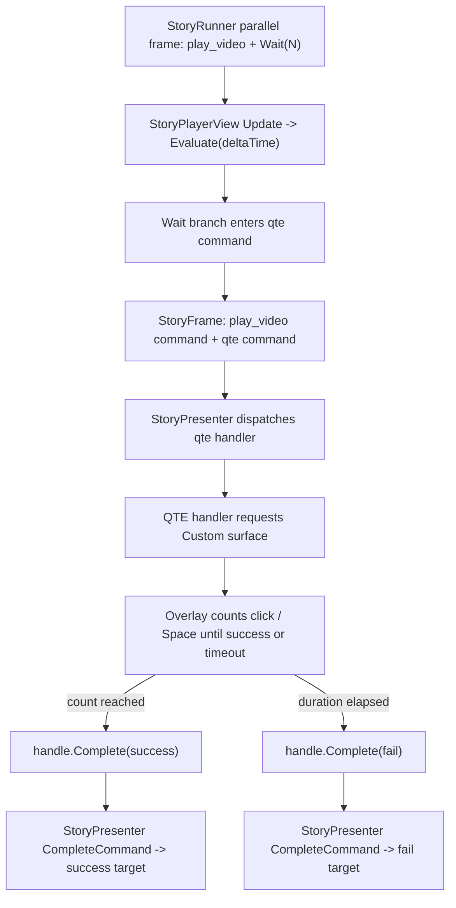

# Story Video QTE Command Design

## 0. 术语约定

| 术语 | 定义 | 防冲突结论 |
|---|---|---|
| `qte` command | Story command 名称，表示一次限时快速输入互动 | 新 command，不是 `StoryStepKind`，不复用旧 `MiniGame` |
| QTE payload | `inputActionId`、`durationSeconds`、`requiredCount`、`promptTextKey` 四个 command argument | 全部是 `StoryValue` 基础值，不保存 Unity InputAction |
| QTE overlay | StoryPlayback 在 `Custom` surface 上显示的最小 UI | 默认实现只做点击/Space 累计；业务可用自定义 channel 接管 |
| QTE success/fail | `qte` command 声明的两个 outcome | 首版只允许 `success` / `fail`，`timeout` / `canceled` 只保留为 roadmap 未来词 |
| session-time QTE | QTE 倒计时由 StoryPlayback update delta 推进 | 不读取 AVPro current time，不新增 `EvaluateMediaTime()` |

术语 grep 结论：当前代码无 `Qte` / `qte` runtime 类型；roadmap 已把 QTE 收敛为 command/outcome，并明确输入映射使用最小键盘或点击实现。现有 `MiniGame` 是历史默认作者节点，不承接本 feature 的 QTE 名词。

## 1. 决策与约束

### 需求摘要

做什么：支持作者用下面的现有多轨编排在视频播放中出现 QTE：

```text
Parallel
├── branch_video: PlayVideo(waitForCompletion: true)
└── branch_interaction: Wait(12) -> qte(success/fail)
```

wait 到点后，frame 同时包含视频 command 和 `qte` command。StoryPlayback 默认 QTE handler 请求 `InteractionRequestKind.Custom` surface，在 `CustomRoot` 下显示一个最小 overlay：提示文本、进度、剩余时间和输入按钮。玩家在 `durationSeconds` 内达到 `requiredCount` 次输入则完成 `success`，超时则完成 `fail`。默认输入只支持按钮点击和 Space 键；业务要复杂按键、手柄、连打节奏或暂停策略时，用自定义 interaction channel / command handler 接管。

为谁：需要影游式“视频播放到某个剧情时间点后出现简单 QTE，并按成功/失败进入不同剧情分支”的剧情作者和播放层。

成功标准：

- `qte` 编译为普通 `StoryCommand`，command schema 包含 typed arguments 和 `success/fail` outcome。
- `Wait(N) -> qte` 可与 `PlayVideo` 并行，同帧保留视频 command 与 QTE command。
- 默认 StoryPlayback 能在 `CustomRoot` 上显示 QTE overlay，并通过 `StoryCommandHandle.Complete("success"|"fail")` 推进剧情。
- QTE 期间不暂停视频/音频，不显示 continue button，不获得 transition seek policy。
- QTE 倒计时使用 StoryPlayback session time，不读取 AVPro 当前媒体时间。

### 复杂度档位

- `Runtime model = command reuse`：复用 `StoryCommand` / outcome，不新增 `StoryStepKind` 或 `StoryFrame.Interactions`。
- `Playback UI = minimal default`：默认 UI 只保证可验收点击/Space 输入，不做完整输入系统。
- `Editor scope = schema/compiler only`：本 feature 增加 QTE 作者节点 schema 和编译校验；一键模板、图上模板 UX 留给 `story-editor-interaction-authoring-patterns`。
- `Clock = session time`：QTE duration 由 StoryPlayback update delta 推进，不绑定 AVPro media time。
- `Extensibility = command handler override`：业务可注册更高优先级 handler 或自定义 interaction channel，不改 Story 核心。

### 关键决策

1. QTE 是 command，不是新 runtime step。
   - Story 核心只看到 blocking command 和 declared outcome。
   - 这保持 `Parallel + Wait + Choice/Command` 的统一模型。

2. 首版只保证 `success/fail`。
   - `timeout`、`canceled` 会让节点端口和运行时分支多出未验证语义，暂不进入默认 schema。
   - 超时映射为 `fail`，取消/停止只清理 overlay，不推进分支。

3. 默认输入只做点击和 Space。
   - 这是验收友好的最小实现。
   - 不接入 InputModule、不保存 InputAction、不处理手柄或平台输入映射。

4. QTE overlay 走 `Custom` surface。
   - `InteractionRequestKind.Custom` 与 `PlaybackSurfaceView.CustomRoot` 已存在，适合作为章节 UI 的自定义互动根。
   - 若 `CustomRoot` 缺失，默认 handler 报配置错误；业务自定义 channel 必须显式提供。

5. 不暂停媒体。
   - roadmap 要求默认不暂停音视频。
   - 如果业务要暂停视频/音频，应在自定义 handler 或后续 roadmap update 中设计，不在本 feature 偷加开关。

### 明确不做

- 不新增 `StoryStepKind.Qte`、`TimedChoice`、`EvaluateMediaTime()` 或媒体时间 trigger。
- 不新增 `StoryRunner.Seek()` / `StoryModule.Seek()`，不让 QTE 视频获得 transition seek。
- 不接入 InputModule、Unity Input System action asset、手柄、触摸手势或平台输入映射。
- 不实现复杂 QTE 玩法，例如节奏判定、方向键序列、长按、连线、随机键位、惩罚窗口。
- 不新增 `timeout` / `canceled` 默认 outcome；首版只允许 `success` / `fail`。
- 不做 Editor 一键创建 `Parallel + Wait + QTE` 模板；只让 QTE 节点本身可 authoring / compile。
- 不把 QTE UI 逻辑放进 `Runtime/Story`，不让 Story 核心引用 UGUI、AVPro、UIWindow 或 Editor graph 类型。

## 2. 名词与编排

### 2.1 名词层

#### 现状

- `StoryCommand` / `StoryCommandDefinition` 已支持 command name、typed arguments、`WaitForCompletion`、`OutcomePorts` 和 `OutcomeTargets`。
- `NodeSchemaRegistry` 当前默认作者节点包含 `MiniGame`，它编译为 `mini_game` command，outcome 为 `success/fail/cancel`，但没有 QTE payload。
- `StoryProgramCompiler.BuildCommandStep()` 对 action/interaction command 统一导出 `StoryCommand`，`outcomePorts` 来自节点出边；`PlayVideo` 和 `MiniGame` 被强制 wait。
- `StoryModule.Program.Validation` 已按 `StoryCommandDefinition.ArgumentDefinitions` 校验 required、number、boolean、string、option、asset reference 参数。
- `StoryPresenter` 会 dispatch command handler，并在 `IStoryCommandHandle.Completed` 后调用 `StoryModule.CompleteCommand(commandId, outcomeId)`。
- `StoryPlayerView` 已在 frame render 时请求 Text / Continue / Choice / Video / Image surface；`InteractionRequestKind.Custom` 和 `PlaybackSurfaceView.CustomRoot` 已存在，但未知 command 尚未请求 Custom surface。

#### 变化

新增 QTE 命令协议常量，放在 Story runtime 数据协议层：

```csharp
public static class StoryInteractionCommandNames
{
    public const string Qte = "qte";
    public const string SuccessOutcome = "success";
    public const string FailOutcome = "fail";
    public const string InputActionIdArgument = "inputActionId";
    public const string DurationSecondsArgument = "durationSeconds";
    public const string RequiredCountArgument = "requiredCount";
    public const string PromptTextKeyArgument = "promptTextKey";
}
```

新增作者节点：

```csharp
public enum NodeKind
{
    // existing...
    Qte = 205
}
```

`NodeSchemaRegistry` 增加默认作者节点 schema：

```yaml
Qte:
  displayName: QTE
  category: Interaction
  ports: [success, fail]
  parameters:
    inputActionId: string required
    durationSeconds: number required
    requiredCount: number optional
    promptTextKey: string required
```

编译产物示例：

```yaml
name: qte
waitForCompletion: true
arguments:
  inputActionId: "space"
  durationSeconds: 3.0
  requiredCount: 5
  promptTextKey: "qte.break_free"
outcomes:
  success: chapter_01/qte_success
  fail: chapter_01/qte_fail
```

新增 StoryPlayback 默认 handler：

```csharp
public sealed class StoryQteCommandHandler : IStoryCommandHandler
{
    public bool CanHandle(StoryCommand command);
    public IStoryCommandHandle Execute(StoryCommand command, StoryRuntimeContext context);
}
```

该 handler 持有 `IInteractionChannel` resolver 或由 `StoryPlayerView` 提供当前 channel，执行时请求 `Custom` surface，创建/复用最小 overlay，并返回 `StoryCommandHandle`。overlay 成功时 `Complete("success")`，超时时 `Complete("fail")`。

### 2.2 编排层



#### 现状

当前 `story-parallel-wait-interaction-flow` 已证明视频 command 分支和 `Wait -> custom command` 分支能同帧存在，并且 `CompleteCommand(outcome)` 可推进 interaction branch。缺口在于：

1. 没有稳定的 `qte` command name / argument schema / outcome schema。
2. Story Editor 默认节点库没有 QTE 节点。
3. StoryPlayback 默认 view 不会对未知 command 请求 `Custom` surface。
4. 没有默认 QTE UI 与倒计时输入逻辑。

#### 变化

1. 编译层把 `NodeKind.Qte` 编译为 `qte` command，强制 `waitForCompletion=true`，强制 outcome ports 为 `success/fail`。
2. 编译层校验：
   - `durationSeconds > 0`
   - `requiredCount >= 1`；缺省时按 `1`
   - `promptTextKey` 必填
   - `inputActionId` 必填，但默认 handler 首版只识别 `space` / `click` 文案，不做真实 InputAction 解析
   - `success` / `fail` 端口都必须有目标
3. StoryPlayback 在 frame render 时对 `qte` command 请求 `InteractionRequestKind.Custom` surface；缺少 `CustomRoot` 时报配置错误。
4. StoryPlayback 注册 `StoryQteCommandHandler`，它创建 overlay 并把倒计时和输入计数绑定到 command handle。
5. `StoryPresenter` 继续只看 command handle 完成事件；不为 QTE 增加特殊推进 API。

流程级约束：

- QTE command 在同一 frame 中有视频 command 时，不停止视频、不暂停音频。
- QTE command active 时 frame 仍 `WaitsForCommand=true`，continue button 不显示。
- QTE overlay 对同一 command 只创建一个 active session；重复 render 不重复绑定输入。
- command 被 `Stop()` / `Cancel()` 时 overlay 必须清理，不调用 success/fail。
- QTE 完成后使用 `StoryCommandHandle.Complete(outcome)`，由 `StoryPresenter` 统一推进剧情。
- `qte` command 的 `success/fail` outcome 必须声明；其它 outcome 在注册或编译时被拒绝。
- 默认 QTE 倒计时使用 `Time.unscaledDeltaTime` 或 `StoryPlayerView.Update()` delta，不依赖 AVPro current time。

### 2.3 挂载点清单

- `NodeKind.Qte` + `NodeSchemaRegistry` 默认 schema：删掉后作者不能创建/编译 QTE 节点。
- `StoryInteractionCommandNames.Qte` command 协议：删掉后 runtime/playback/editor 无统一 command name 与参数 key。
- StoryPlayback QTE command handler 注册：删掉后 `qte` command 会停在 blocking command，默认播放器无法完成 outcome。
- `Custom` surface request for `qte`：删掉后 interaction channel 无法提供 QTE overlay 挂载根。
- Compiler transition seek guard：删掉后带 QTE 的互动视频可能被误判为 transition 并显示 seek bar。

### 2.4 推进策略

1. Command 协议与 schema：建立 `qte` command 常量、`NodeKind.Qte`、默认 schema 和 compiler 输出。
   退出信号：编译 QTE 节点得到 `qte` command，schema 参数和 `success/fail` outcome 正确。
2. Runtime 校验与并行契约：补 `Parallel + PlayVideo + Wait -> qte` 的运行时验收。
   退出信号：wait 到点后 frame 同时包含 video command 与 `qte` command，`CompleteCommand(success/fail)` 可推进。
3. StoryPlayback custom surface：让 `StoryPlayerView` 对 `qte` 请求 `Custom` surface，并保持 continue 隐藏、video surface 保留。
   退出信号：测试 channel 收到 `Video` 与 `Custom` request，缺少 `CustomRoot` 报配置错误。
4. 默认 QTE handler / overlay：实现最小点击/Space 输入、倒计时、success/fail 完成和 stop/cancel 清理。
   退出信号：达到 requiredCount 完成 success，超时完成 fail，停止命令不推进 outcome。
5. Editor / seek guard：补 QTE 节点编译校验和带 QTE 的视频不写入 `__videoSeekPolicy=transition`。
   退出信号：非法 duration / requiredCount / outcome 目标给出定位错误；QTE 互动视频不显示 seek policy。
6. 范围守护与构建：跑相关 build / tests / grep。
   退出信号：未出现 TimedChoice、EvaluateMediaTime、Story seek、InputModule 接入或 Runtime/Story UI 引用。

### 2.5 结构健康度与微重构

##### 评估

- compound convention 检索：未命中 Story QTE / command interaction / 目录组织相关 decision。
- 文件级 - `Assets/GameDeveloperKit/Runtime/StoryPlayback/StoryPlayerView.cs`：约 1265 行，已承担默认 UI、surface request、media 刷新和 wait 推进；本 feature 只应接入 Custom request 与 QTE handler，不继续把完整玩法堆进该文件。
- 文件级 - `Assets/GameDeveloperKit/Editor/StoryEditor/Compiler/StoryProgramCompiler.cs`：约 1904 行，compiler 已集中处理所有 Story authoring 节点；QTE compiler 支持属于既有职责延伸，但应尽量用小 helper。
- 文件级 - `Assets/GameDeveloperKit/Runtime/Story/AuthoringSchema/NodeSchemaRegistry.cs`：约 185 行，增加一个 schema 属于既有职责延伸。
- 目录级 - `Assets/GameDeveloperKit/Runtime/StoryPlayback`：当前同层文件约 44 个，本次预计新增 QTE handler/overlay 相关文件，目录已偏平。
- 目录级 - `Assets/GameDeveloperKit/Runtime/Story/Runtime`：当前同层文件约 18 个，新增一个 command names 文件或扩展现有命令协议文件可接受。

##### 结论：不做前置微重构

本 feature 不做“只搬不改行为”的微重构。原因是 QTE 的主风险在协议边界和播放闭环，不在文件搬迁；先重组 StoryPlayback 目录会放大 diff 并影响刚稳定的播放层。实现时 QTE 默认玩法必须留在 StoryPlayback command handler 边界内，`StoryPlayerView` 只做注册和 `Custom` request 接线；若当前 Unity 生成的 csproj 仍使用 explicit compile include，可以暂挂在现有 command handler 文件中，后续目录重组时再拆独立文件。

##### 超出范围的观察

- `StoryPlayerView.cs` 和 `StoryProgramCompiler.cs` 已偏胖。后续 `story-unlock-interaction-flow` 继续叠加后，建议单独走 `cs-refactor`，拆 StoryPlayback 默认 surface/overlay、media refresh、input binding，以及 compiler 的节点构建 helper；本 feature 不阻塞。
- `StoryPlayback` 目录同层文件较多。若后续 QTE/Unlock/Hotspot 增加更多默认互动组件，建议再评估是否拆 `Interaction/`、`Media/`、`Commands/` 子目录。

## 3. 验收契约

| 场景 | 输入 / 触发 | 期望可观察结果 |
|---|---|---|
| N1 QTE schema | 查询默认节点 schema | 存在 `NodeKind.Qte`，参数为 `inputActionId`、`durationSeconds`、`requiredCount`、`promptTextKey`，端口为 `success/fail` |
| N2 QTE compile | 编译单个 QTE 节点 | 产物为 `StoryStepKind.Command`，command name 为 `qte`，`waitForCompletion=true`，schema argument definitions typed |
| N3 参数校验 | duration <= 0 或 requiredCount < 1 | compiler 或 runtime validation 返回定位错误 |
| N4 outcome 校验 | success/fail 缺目标或出现其它默认 outcome | compiler 返回定位错误，runtime schema 不接受未声明 outcome |
| N5 并行 QTE | `Parallel(PlayVideo, Wait -> QTE)`，Evaluate 到点 | frame 同时包含 video command 和 qte command，`WaitsForCommand=true` |
| N6 success 推进 | 默认 QTE overlay 输入达到 requiredCount | qte handle 完成 `success`，StoryPresenter 推进到 success target |
| N7 fail 推进 | duration 到期未达到 requiredCount | qte handle 完成 `fail`，StoryPresenter 推进到 fail target |
| N8 surface request | wait 到点后的 frame 交给 StoryPlayerView | channel 收到 `Custom` request；若同帧有视频也收到 `Video` request；continue button 不显示 |
| N9 缺 CustomRoot | channel 对 QTE custom request 返回 null root | 报配置错误，不静默吞掉 QTE |
| N10 stop/cancel 清理 | QTE command 离开 frame 或播放停止 | overlay 被清理，handle stop/cancel 不触发 success/fail |
| N11 不暂停媒体 | QTE 与 video 同帧出现 | video command handle 保持活跃，不调用 pause/seek |
| N12 QTE 视频不可 seek | 编译包含 QTE 的互动视频结构 | `play_video` 不包含 `__videoSeekPolicy=transition` |
| B1 范围守护 | grep `TimedChoice` / `EvaluateMediaTime` | 本 feature 不新增 timed choice 或媒体时间 runtime API |
| B2 范围守护 | grep `StoryRunner.Seek` / `StoryModule.Seek` | 不新增剧情 seek |
| B3 输入边界 | grep InputModule / Unity Input System action asset 接入 | 默认 QTE 不接入平台输入映射 |
| B4 Runtime 隔离 | 检查 `Assets/GameDeveloperKit/Runtime/Story` | 不引用 UGUI、AVPro、UIWindow、Editor graph 或播放窗口类型 |

明确不做的反向核对：

- 不新增 `StoryStepKind.Qte`。
- 不新增 `timeout` / `canceled` 默认 QTE outcome。
- 不做 Editor 一键创建 `Parallel + Wait + QTE` 模板。
- 不让 QTE 影响 transition video seek 判定之外的剧情 seek / media time 逻辑。

## 4. 与项目级架构文档的关系

本 feature 是 `story-interactive-video` roadmap 第 4 条，依赖 `story-playback-view-input-layers` 和 `story-parallel-wait-interaction-flow`。

验收完成后需要回写：

- `.codestable/architecture/ARCHITECTURE.md`：记录 `qte` command 协议、默认 StoryPlayback QTE handler / Custom surface overlay、success/fail outcome 约束、默认不暂停媒体和无 media-time trigger。
- `.codestable/requirements/story-module.md`：追加“视频播放中的 QTE 通过 command outcome 推进”实现进展。
- `.codestable/roadmap/story-interactive-video/story-interactive-video-items.yaml`：验收时把本条从 `in-progress` 改为 `done`。
