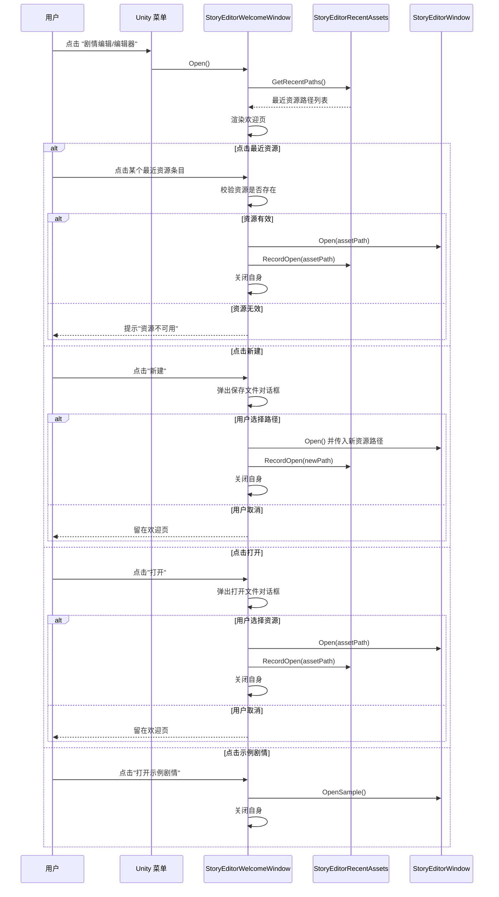

# 剧情编辑器欢迎页 Design

## 0. 术语约定

| 术语 | 定义 | 防冲突结论 |
|---|---|---|
| 欢迎页 (Welcome Page) | 剧情编辑器的启动首页，提供新建/打开/最近资源/示例入口和快速开始引导 | grep 确认项目中无同名概念 |
| 最近资源 (Recent Resources) | 用户最近在剧情编辑器中打开过的 `StoryAuthoringAsset` 路径列表 | 与 Unity `EditorPrefs` 已有 key 前缀 `StoryEditor.` 不冲突（现有无此前缀的 key） |
| 快速开始引导 (Quick Start Guide) | 欢迎页上的静态引导文字，说明剧情编辑器的基本使用步骤 | 不引入新术语 |

## 1. 决策与约束

### 需求摘要

- **做什么**：在剧情编辑器启动时先展示一个欢迎引导页，替代当前直接打开完整编辑器的行为
- **为谁**：策划和内容作者，尤其是首次使用剧情编辑器的用户
- **成功标准**：
  1. 点击菜单"剧情编辑器"后看到欢迎页而非直接进入编辑器
  2. 欢迎页显示最近打开的资源列表（按时间倒序），可点击打开
  3. 欢迎页提供新建、打开、打开示例剧情的入口按钮
  4. 欢迎页显示快速开始引导文字
  5. 从欢迎页进入编辑器后，编辑器表现与直接从菜单打开一致
- **明确不做**：
  - 不做资源模板市场
  - 不做版本更新日志 / changelog
  - 不做云端同步
  - 不改变编辑器窗口本身的任何行为
  - 不在欢迎页做资源的删除、重命名等管理操作

### 复杂度档位

走"项目内部工具"默认档位，无偏离：
- 健壮性 = L2（够用）
- 结构 = functions（同一窗口内拆方法）
- 性能 = reasonable
- 可读性 = team
- 可演进性 = active
- 可观测性 = logged（Editor 日志即可）
- 可测试性 = testable

### 关键决策

1. **欢迎页是独立 `EditorWindow`，不是 `StoryEditorWindow` 的内部视图**
   - 理由：独立窗口意味着欢迎页关闭不影响编辑器生命周期，编辑器关闭也不影响欢迎页状态。两个窗口各自独立，职责清晰。
   - 被拒方案：在 `StoryEditorWindow` 内部加一个"首页" tab —— 这会让 `StoryEditorWindow` 同时承担"引导"和"编辑"两个职责，违反单一职责；且切换 tab 不等于"引导完成进入编辑器"的心智模型。

2. **菜单入口从 `StoryEditorWindow.Open()` 改为 `StoryEditorWelcomeWindow.Open()`**
   - 理由：用户点击菜单的预期是"打开剧情编辑器"，欢迎页是这个流程的第一步。不改变用户的操作路径。
   - `StoryEditorWindow.Open()` 保留为 public static，供欢迎页和未来其他入口调用。

3. **最近资源列表用 `EditorPrefs` 持久化，存 JSON 数组**
   - 理由：数据量极小（路径列表），不需要文件 I/O；Unity Editor 重启后 EditorPrefs 仍然有效；不需要引入新依赖。
   - 存储 key：`StoryEditor.RecentAssets`
   - 格式：`["Assets/Path/To/Asset1.asset", "Assets/Path/To/Asset2.asset"]`，最多保留 10 条，新条目放最前，重复条目去重并移到最前。

4. **最近资源只记录"在编辑器中实际打开过的资源"，不在欢迎页中手动管理**
   - 当 `StoryEditorWindow` 成功加载一个资源后，由编辑器窗口（或欢迎页在打开编辑器前）写入记录。
   - 欢迎页只读不写；不提供删除/清空最近列表的 UI。
   - 无效路径（资源已删除或移动）在欢迎页上灰显并标注"不可用"，点击时提示用户。

5. **欢迎页的 UI 风格与现有 Story Editor 保持一致**
   - 复用 `StoryEditorWindow.uss` 中的颜色变量和视觉风格（深色背景、圆角面板）。
   - 欢迎页有自己的 USS 文件 `StoryEditorWelcomeWindow.uss`，按需引用或复制公共样式。

### 前置依赖

无。本 feature 不依赖其他未完成的工作。

## 2. 名词与编排

### 2.1 名词层

#### 现状

- **`StoryEditorWindow`** — `Assets/GameDeveloperKit/Editor/StoryEditor/Window/StoryEditorWindow.cs`
  - 静态方法 `Open()` 和 `OpenSample()` 是外部唯一入口（通过 `[MenuItem]` 绑定）
  - `CreateGUI()` 立即加载/创建 `StoryAuthoringAsset` 并构建完整编辑器布局
  - 不记录打开历史

- **菜单入口** — 位于同一文件的 `[MenuItem]` 属性
  - `GameDeveloperKit/剧情编辑/编辑器` → `StoryEditorWindow.Open()`
  - `GameDeveloperKit/剧情编辑/打开示例剧情图` → `StoryEditorWindow.OpenSample()`

#### 变化

| 动作 | 对象 | 动机 |
|---|---|---|
| 新增 | `StoryEditorWelcomeWindow` 类 | 欢迎页窗口主体，独立 `EditorWindow` |
| 新增 | `StoryEditorRecentAssets` 静态辅助类 | 封装最近资源列表的读写（EditorPrefs + JSON） |
| 修改 | `StoryEditorWindow.Open()` 菜单绑定 | 改绑到 `StoryEditorWelcomeWindow.Open()` |
| 修改 | `StoryEditorWindow.OpenSample()` 菜单绑定 | 改绑到欢迎页的示例入口路径 |
| 不变 | `StoryEditorWindow.Open()` / `.OpenSample()` | 保留为 public static，供欢迎页调用 |

**`StoryEditorRecentAssets` 接口示例：**

```csharp
// 来源：新增 Editor/StoryEditor/Welcome/StoryEditorRecentAssets.cs
public static class StoryEditorRecentAssets
{
    // 返回最近资源路径列表（新在前），已过滤无效路径
    // 输入：无
    // 输出：IReadOnlyList<string>，元素为 "Assets/..." 格式的资产路径
    public static IReadOnlyList<string> GetRecentPaths();

    // 记录一个资源路径到最近列表
    // 输入：assetPath — "Assets/..." 格式路径，null/空/非 Assets 开头 → 忽略
    // 输出：无
    public static void RecordOpen(string assetPath);
}
```

**`StoryEditorWelcomeWindow` 关键公共接口示例：**

```csharp
// 来源：新增 Editor/StoryEditor/Welcome/StoryEditorWelcomeWindow.cs
public sealed class StoryEditorWelcomeWindow : EditorWindow
{
    // 打开欢迎窗口（菜单入口）
    [MenuItem("GameDeveloperKit/剧情编辑/编辑器")]
    public static void Open();

    // 更新最近资源列表并刷新 UI
    internal void RefreshRecentList();
}
```

### 2.2 编排层

#### 主流程图



#### 现状

- 编排拓扑：线性，菜单项 → `StoryEditorWindow.Open()` / `.OpenSample()` → `CreateGUI()` → 编辑器就绪
- `Open()` 内部：`GetWindow<StoryEditorWindow>()` → 设置 title/minSize → `Show()`
- `CreateGUI()` 内部：`StoryAuthoringAssetStore.LoadOrCreate()` → `EnsureDefaults()` → `SelectDefaults()` → `BuildLayout()` → `RefreshAll("就绪。")`

#### 变化

在现有线性流程的**最前面**插入一个欢迎页作为门面：

1. 菜单项不再直接调用 `StoryEditorWindow.Open()`，改为调用 `StoryEditorWelcomeWindow.Open()`
2. 欢迎窗口打开后渲染静态引导内容 + 动态最近资源列表
3. 用户在欢迎页做出选择后，欢迎页创建/复用 `StoryEditorWindow` 并传入资源路径（或调用现有的 `Open()` / `OpenSample()`），然后关闭自身
4. 从欢迎页进入的编辑器行为与原来完全一致

**`StoryEditorWindow` 需要新增一个接受资源路径的重载：**

```csharp
// 在现有 Open() 基础上增加
public static void Open(string assetPath);
// 行为：打开窗口 → 加载指定路径的资源 → CreateGUI() → 记录到最近列表
```

#### 流程级约束

- **窗口关系**：欢迎页和编辑器窗口是两个独立的 `EditorWindow` 实例，不是父子关系。欢迎页关闭自身后，编辑器窗口独立存在。
- **重复打开**：如果欢迎页已存在，`Open()` 应该聚焦已有窗口而非创建新窗口（与现有 `StoryEditorWindow.Open()` 的 `GetWindow<>()` 行为一致）。
- **取消操作**：用户在新建/打开的文件对话框中取消时，留在欢迎页，不关闭窗口。
- **资源校验**：点击最近资源前校验路径有效性（`AssetDatabase.LoadAssetAtPath` 非 null），无效资源灰显。
- **错误处理**：资源加载失败时在欢迎页显示错误提示，不静默失败。

### 2.3 挂载点清单

| 挂载位置 | 动作 | 说明 |
|---|---|---|
| `[MenuItem("GameDeveloperKit/剧情编辑/编辑器")]` | 修改 | 目标从 `StoryEditorWindow.Open()` 改为 `StoryEditorWelcomeWindow.Open()` |
| `[MenuItem("GameDeveloperKit/剧情编辑/打开示例剧情图")]` | 修改 | 目标从 `StoryEditorWindow.OpenSample()` 改为在欢迎页中提供示例入口（可仍走 `StoryEditorWindow.OpenSample()` 进编辑器） |
| `EditorPrefs` key `StoryEditor.RecentAssets` | 新增 | 持久化最近打开的资源路径列表 |

共 3 条，在 3-5 条的正常区间内。

### 2.4 推进策略

前端 UI 型 feature，按"静态结构 → 交互逻辑 → 联调收尾"推进：

```
1. 静态结构：创建 StoryEditorWelcomeWindow + USS 布局（静态内容占位，按钮无行为）
   退出信号：菜单点击后看到欢迎窗口，布局与设计一致

2. 交互逻辑：实现按钮行为（新建/打开/示例）+ StoryEditorRecentAssets
   退出信号：点击新建/打开能弹出文件对话框；点击示例能打开编辑器

3. 最近资源：实现最近列表的读写、校验、渲染和点击
   退出信号：打开一个资源后关闭编辑器，重新打开欢迎页能看到该资源

4. 联调收尾：修改现有菜单绑定 + 确保编辑器窗口从欢迎页进入后行为不变
   退出信号：所有验收场景手动通过
```

### 2.5 结构健康度与微重构

#### 评估

- **文件级 — `StoryEditorWindow.cs`**：62447 字节，约 1689 行
  - 行数：显著超过 500 行。但本次改动极轻——仅新增一个静态重载 `Open(string assetPath)`（约 10 行），以及可选地将 `[MenuItem]` 属性迁出到欢迎窗口。不触碰核心编辑逻辑。
  - 职责：承担窗口布局、工具栏、树视图、画布、选择管理、节点/边 CRUD、诊断刷新等多项职责。但这是已有的结构问题，本次改动不加重。
  - 改动密度：1 处新增方法 + 可能移除 2 个 `[MenuItem]`，逻辑独立。

- **目录级 — `Editor/StoryEditor/`**：根级 7 个子目录 + 3 个 .cs 文件
  - 本次新增 `Welcome/` 子目录，含 1-2 个 .cs 文件 + 1 个 .uss 文件
  - 目录已有明确分组（Compiler / Model / Playback / Samples / UI / Validation / Window），新增 Welcome 符合分组惯例
  - 无摊平问题

#### 结论：不做微重构

`StoryEditorWindow.cs` 虽然偏大（1689 行），但本次改动仅触及入口方法（新增一个重载 + 可能迁移 `[MenuItem]`），不涉及核心编辑逻辑，微重构收益不抵风险。文件职责混杂是已有结构问题，写进"超出范围的观察"供后续考虑。

#### 超出范围的观察

- `StoryEditorWindow.cs`（1689 行）：混合了窗口布局、工具栏、树视图交互、画布管理、节点/边 CRUD、诊断刷新、选择管理、布局持久化、节点创建策略等多类职责。
  → 建议后续走 `cs-refactor` 拆分为 `StoryEditorWindow.Layout.cs` / `.Selection.cs` / `.NodeOps.cs` / `.Diagnostics.cs` 等 partial 文件，本 feature 不动。

## 3. 验收契约

### 关键场景清单

**正常路径：**

| # | 输入/触发 | 期望可观察结果 |
|---|---|---|
| N1 | 点击菜单 `GameDeveloperKit/剧情编辑/编辑器` | 打开欢迎窗口，标题为"剧情编辑器"，显示快速开始引导、新建/打开/示例按钮、最近资源区域 |
| N2 | 欢迎页点击"新建"→ 选择保存路径 → 确认 | 欢迎页关闭，编辑器窗口打开并显示新建的空白剧情资源 |
| N3 | 欢迎页点击"打开"→ 选择一个 `.asset` 文件 → 确认 | 欢迎页关闭，编辑器窗口打开并加载所选资源 |
| N4 | 欢迎页点击"打开示例剧情" | 欢迎页关闭，编辑器窗口打开并加载示例剧情图 |
| N5 | 打开一个资源后关闭编辑器，重新打开欢迎页 | 最近资源列表第一条是刚打开的资源 |
| N6 | 反复打开同一资源多次 | 最近列表中该资源只出现一次（去重），位置在最前 |
| N7 | 最近资源列表超过 10 条 | 列表只保留最近的 10 条，旧条目被裁剪 |

**边界路径：**

| # | 输入/触发 | 期望可观察结果 |
|---|---|---|
| N8 | 点击最近列表中已被删除/移动的资源 | 显示提示"资源不可用"，不关闭欢迎页 |
| N9 | 最近列表为空（首次使用） | 最近资源区域显示"暂无最近资源"或隐藏该区域 |
| N10 | 欢迎页已打开时再次点击菜单 | 聚焦已有欢迎窗口，不创建第二个 |
| N11 | 在文件对话框中点击取消 | 留在欢迎页，窗口不关闭 |
| N12 | 从欢迎页进入编辑器后关闭编辑器 | 欢迎页不重新出现，也不影响下次从菜单打开 |

**错误路径：**

| # | 输入/触发 | 期望可观察结果 |
|---|---|---|
| N13 | 最近资源路径指向非 `StoryAuthoringAsset` 类型的资源 | 灰显该条目并标注"类型不匹配"，点击时提示 |

### 明确不做的反向核对项

- 代码中不应出现模板市场、版本更新日志、changelog 相关 UI 或逻辑
- 代码中不应出现网络请求或云端 API 调用
- 欢迎页不应修改 `StoryAuthoringAsset` 或 `StoryAuthoringChapter` 的数据
- `StoryEditorWindow` 的核心编辑行为（节点/边 CRUD、编译、播放）不受欢迎页影响

## 4. 与项目级架构文档的关系

- `architecture/ARCHITECTURE.md` 的 "Story Editor / Editor Node Graph" 节：
  - 需要在 `StoryEditorWindow` 入口描述中补充：菜单入口现先经过 `StoryEditorWelcomeWindow`，用户选择资源后才进入编辑器窗口
  - 新增 `StoryEditorWelcomeWindow` 的简要描述（独立 EditorWindow，VS Code 风格欢迎页）

- 本 feature 改动局限在 Story Editor 的 Editor 层，无系统级 Runtime 影响。
