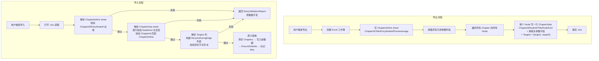

# Story Excel 导入导出 & 章节预览图

## 0. 术语约定

| 术语 | 定义 | 防冲突结论 |
|---|---|---|
| ChapterDefine | Excel 章节元数据 sheet，每行一个 `StoryAuthoringChapter` 的基本信息 | 不与 Luban 的 `ConfigDefine` 命名冲突 |
| ChapterData | Excel 节点数据 sheet，每行一个 `StoryAuthoringNode`，包含所有参数和出边 | 与 Luban 配置表无关，纯 Story Editor 工具 |
| Targets | 节点的出边数组，纯节点 ID 列表 | 不编码端口/条件信息，连接语义由目标节点的 NodeKind 隐式决定 |
| 预览图 | 章节关联的一张 Unity Texture2D，编辑器章节列表显示缩略图，运行时通过 `StoryChapter.PreviewImagePath` 可用 | 不与 `ShowImage.command` 冲突 |

## 1. 决策与约束

### 需求摘要

- **做什么**：提供 Editor 菜单导入/导出剧情图 Excel；为章节增加可选预览图配置，编辑器和运行时均可访问
- **为谁**：剧情策划/作者
- **成功标准**：
  1. 导出 Excel 后不做修改重新导入，节点图完全一致（幂等往返）
  2. Excel 中参数以平铺列呈现，无需手写 JSON
  3. ChapterDefine + ChapterData 两张 sheet 覆盖所有 chapter 元数据和节点/边数据
  4. 章节预览图在 Story Editor 章节树中显示缩略图，运行时 `StoryChapter.PreviewImagePath` 可读
- **明确不做什么**：
  - 不做增量导入（每次导入覆盖全部 chapters）
  - 不导出/导入节点布局位置（`StoryGraphLayout`）
  - 不导出 `StoryAuthoringVolume` 卷分组
  - 不在 Targets 列编码端口/条件信息
  - 预览图不保存 Unity object 引用进 runtime（只传路径字符串）

### 复杂度档位

走"项目内部工具"默认档位（L2 + functions + reasonable + team + active + logged + testable），无偏离。

### 关键决策

**D1: 导入库——复用 Luban 的 ExcelDataReader**

Luban 目录下已有 `ExcelDataReader.dll`（MIT 许可），支持 .xlsx 读取。将其放入 Editor 插件目录引用，无需额外 NuGet 包。

**D2: 导出库——EPPlus**

导入验证 Epic/Unity 生态兼容性后添加 EPPlus NuGet 依赖写入 .xlsx。EPPlus 5.x 需要商用许可则降级到 4.x（LGPL）或切 ClosedXML（MIT）。

**D3: Excel 两表结构**

一个 `.xlsx` 文件 = 一个 `StoryAuthoringAsset`，两张 sheet：

- **ChapterDefine**：章节元数据（ChapterId / Title / EntryNodeId / PreviewImage）
- **ChapterData**：所有节点，用 ChapterId 列区分归属，每行一个节点

理由：两张表语义清晰，ChapterDefine 给策划看章节概览，ChapterData 是真正的节点编辑表。

**D4: 参数平铺为独立列**

ChapterData 包含所有 NodeKind 可能的参数字段作为独立列。不相关的节点留空。

**D5: Targets 简化——纯节点 ID 数组**

Targets 列为 `[node_1, node_2, ...]` 格式，只列出目标节点 ID。端口分配（completed / branch / selected / outcome）在导入时根据源节点的 NodeKind 和目标节点的特征隐式推导，不需要 Excel 作者手动指定。

**D6: 预览图——Editor + Runtime 双通道**

`StoryAuthoringChapter` 存 `Texture2D` 引用（Editor 侧），编译器将其路径写入 `StoryChapter.PreviewImagePath`（Runtime 侧），`StoryProgramAsset.ChapterData` 序列化该路径字符串。与现有 PlayVideo.clip 的 `AssetReference → StoryValue.FromString("Assets/...")` 模式一致。

**D7: 导入模式——全量覆盖**

每次导入清空现有 Chapters，用 Excel 完整替换，然后调用 `EnsureDefaults()`。

### 前置依赖

无。

## 2. 名词与编排

### 2.1 名词层

#### 现状

**文件**: `Assets/GameDeveloperKit/Editor/StoryEditor/Model/StoryAuthoringAsset.cs`

```
StoryAuthoringChapter
├── ChapterId, Title, EntryNodeId
├── Nodes → List<StoryAuthoringNode>  (NodeId, Title, NodeKind, Parameters[], Conditions[])
└── Edges → List<StoryAuthoringEdge>  (EdgeId, FromNodeId, FromPortId, FromPortLabel, TargetKind, TargetChapterId, TargetNodeId, Conditions[])

StoryAuthoringParameter: Key + Value (均为字符串)
```

**文件**: `Assets/GameDeveloperKit/Runtime/Story/Program/StoryProgram.cs`

```
StoryChapter
├── ChapterId, Title, EntryStepId
└── Steps → List<StoryStep>
```

**文件**: `Assets/GameDeveloperKit/Runtime/Story/Program/StoryProgramAsset.cs`

`ChapterData`、`StepData` 等 DTO 类型——`SetProgram()` / `ToProgram()` 做运行时类型 ↔ 可序列化 DTO 的双向映射。

**文件**: `Assets/GameDeveloperKit/Editor/StoryEditor/Compiler/StoryProgramCompiler.cs`

`CompileChapter()` 读取 `StoryAuthoringChapter.Nodes/Edges` 并编译为 `StoryChapter.Steps`。不涉及图片路径。

#### 变化

**修改类型 A: `StoryAuthoringChapter`**

```
StoryAuthoringChapter  ← 新增字段
├── + [SerializeField] private Texture2D m_PreviewImage
├── + [SerializeField] private string m_Description
├── + public Texture2D PreviewImage { get; set; }
└── + public string Description { get; set; }
```

**修改类型 B: `StoryChapter`（Runtime）**

```
StoryChapter  ← 新增字段
├── + public string PreviewImagePath { get; }  // "Assets/..." 或 null
└── + public string Description { get; }        // 章节简介，或 null
```

构造函数新增可选参数 `previewImagePath`、`description`。

**修改类型 C: `StoryProgramAsset.ChapterData`**

```
ChapterData  ← 新增字段
├── + [SerializeField] private string m_PreviewImagePath
├── + [SerializeField] private string m_Description
└── FromChapter / ToChapter 映射两个新字段
```

**修改类型 D: `StoryProgramCompiler`**

`CompileChapter()` 在构造 `StoryChapter` 时：
- 从 `StoryAuthoringChapter.PreviewImage` 提取 `AssetDatabase.GetAssetPath()` 传入 `previewImagePath`
- 直接传入 `StoryAuthoringChapter.Description`

与现有 `TryBuildArgumentValue(ParameterValueType.AssetReference)` 模式一致。

**新增类型 E: `StoryExcelExporter`（Editor-only）**

```
Assets/GameDeveloperKit/Editor/StoryEditor/Excel/StoryExcelExporter.cs

static class StoryExcelExporter
    Export(StoryAuthoringAsset, string outputPath) → void
    内部：
      BuildChapterDefineSheet()   → 写 ChapterDefine（含 Description / PreviewImage）
      BuildChapterDataSheet()     → 写 ChapterData
      BuildArgsCell()             → Parameters → "key=value;key=value" 字符串
      BuildTargetsCell()          → Edges → "[node_1, node_2]" 字符串
```

**新增类型 F: `StoryExcelImporter`（Editor-only）**

```
Assets/GameDeveloperKit/Editor/StoryEditor/Excel/StoryExcelImporter.cs

static class StoryExcelImporter
    Import(string inputPath, StoryAuthoringAsset target) → StoryValidationReport
    内部：
      ParseChapterDefineSheet()   → 解析章节元数据（含 Description / PreviewImage）
      ParseChapterDataSheet()     → 解析节点（解析 Args 字符串 → Parameters 列表）
      ParseArgsCell()             → "key=value;..." → List<StoryAuthoringParameter>
      ResolveTargets()            → Targets 数组 → StoryAuthoringEdge 列表
      AtomicReplace()             → 校验全通过后写入
```

**新增类型 G: `ChapterPreviewDrawer`（Editor-only）**

```
Assets/GameDeveloperKit/Editor/StoryEditor/ChapterPreviewDrawer.cs

// 在 StoryEditorWindow 章节树中渲染 PreviewImage 缩略图
```

#### Excel Schema（名词契约）

**ChapterDefine sheet：**

| 列 | 类型 | 必填 | 说明 |
|---|---|---|---|
| ChapterId | string | 是 | 唯一标识，如 chapter_01 |
| Title | string | 否 | 中文标题，如"第一章" |
| Description | string | 否 | 章节简介 |
| EntryNodeId | string | 是 | 起始节点 ID，如 chapter_01_entry |
| PreviewImage | string | 否 | 预览图资源路径，如 `Assets/.../preview.png` |

**ChapterData sheet：**

| 列 | 类型 | 必填 | 说明 |
|---|---|---|---|
| ChapterId | string | 是 | 所属章节 ID |
| NodeId | string | 是 | 节点唯一 ID |
| Title | string | 否 | 节点显示名 |
| NodeKind | string | 是 | 枚举名（Dialogue / Narration / PlayVideo / ...） |
| Args | string | 否 | 参数，`key1=value1;key2=value2` 格式 |
| Targets | string | 否 | 出边数组，格式 `[node_1, node_2]`，空表示无出边 |

Args 示例：
- Dialogue: `speaker=EXAMPLE_SPEAKER;textKey=EXAMPLE_DIALOGUE_KEY`
- Narration: `textKey=EXAMPLE_NARRATION_KEY`
- PlayVideo: `source=streaming_assets;clip=Assets/Video/intro.mp4;loop=false;wait=true`
- Wait: `duration=5`
- JumpChapter: `chapterId=chapter_02`
- Qte: `inputActionId=qte_01;durationSeconds=10;requiredCount=5;promptTextKey=qte_prompt`
- Unlock: `unlockId=door_01;puzzleType=line_connect;promptTextKey=unlock_hint`

Targets 语义规则：
- 空 → 无出边（End 节点、部分命令节点）
- `[node_a]` → 单目标直接流程
- `[node_a, node_b]` → 多目标。若是 Choice 节点则为多个选项；若是 Parallel 节点则为多个分支
- 跨章跳转走 Args 中的 `chapterId`，不在 Targets 中编码

**接口示例**：

```csharp
// 导出
StoryExcelExporter.Export(authoringAsset, "C:/export/my_story.xlsx");
// → .xlsx 含 ChapterDefine（N 行）+ ChapterData（M 行），参数平铺为独立列

// 导入
var report = StoryExcelImporter.Import("C:/export/my_story.xlsx", authoringAsset);
// 正常：report.HasErrors == false，authoringAsset 被完整替换
// 异常：report 列出具体错误行号，authoringAsset 原数据不变
```

### 2.2 编排层

#### 主流程图



#### 现状

Editor 菜单分布在 `StoryEditorWindow`，数据流 Editor ↔ `StoryAuthoringAsset` ↔ `StoryProgramCompiler`，不涉及外部文件导入导出。

#### 变化

新增两条 `[MenuItem]`：
- `GameDeveloperKit/剧情编辑/导出当前剧情为 Excel`
- `GameDeveloperKit/剧情编辑/从 Excel 导入剧情`

**导出编排**：读取当前 `StoryAuthoringAsset` → 遍历所有 Chapter 的所有 Node → 投影到 ChapterDefine + ChapterData → 写 .xlsx。纯数据投影，不修改任何状态。

**导入编排**：读取 .xlsx → 解析 ChapterDefine → 解析 ChapterData → 解析 Targets 构建 Edge 列表 → 全部校验通过后原子写入。任何一步失败，原数据不变。

**Targets 解析逻辑**（`ResolveTargets`）：

```
对每个 Node 行：
  if Targets 为空 → 无出边
  else:
    解析 Targets 中的节点 ID 列表
    for (i = 0; i < targets.Length; i++):
      创建 StoryAuthoringEdge:
        EdgeId = auto-generated
        FromNodeId = 当前 NodeId
        FromPortId = 根据 NodeKind 和目标索引推导
        TargetKind = Node
        TargetChapterId = 当前 ChapterId（或目标节点所属 ChapterId）
        TargetNodeId = targets[i]
```

FromPortId 推导规则：
- 单目标 → `"completed"`
- Choice 多目标 → 每个目标 `"completed"`（编译器将目标节点视为 Choice item）
- Parallel 多目标 → `"branch_1"`, `"branch_2"`, ...
- Command 多目标 → 按顺序映射到 schema 声明的 outcome port

#### 流程级约束

- **导入原子性**：所有 sheet 全部解析成功后才写入，任何失败保持原数据
- **幂等往返**：导出→不做修改导入→节点图完全一致。参数列必须按固定顺序，Targets 数组元素顺序稳定
- **Args 格式稳定性**：导出时按 key 字母序排列 `key=value` 对，保证幂等往返不受参数书写顺序影响
- **PreviewImage 不进入 compile 核心逻辑**：编译器仅在构造 `StoryChapter` 时传递路径，不影响 Step 编译
- **错误报告一致性**：导入校验错误通过 `StoryValidationReport` 返回，与 compiler 错误同风格

### 2.3 挂载点清单

| 挂载位置 | 动作 |
|---|---|
| `Assets/GameDeveloperKit/Editor/StoryEditor/Excel/StoryExcelExporter.cs` | 新增：导出逻辑 |
| `Assets/GameDeveloperKit/Editor/StoryEditor/Excel/StoryExcelImporter.cs` | 新增：导入逻辑 |
| `Assets/GameDeveloperKit/Editor/StoryEditor/Model/StoryAuthoringAsset.cs` — `StoryAuthoringChapter` | 修改：新增 `PreviewImage` 字段 |
| `Assets/GameDeveloperKit/Runtime/Story/Program/StoryProgram.cs` — `StoryChapter` | 修改：新增 `PreviewImagePath`、`Description` 字段 |
| `Assets/GameDeveloperKit/Runtime/Story/Program/StoryProgramAsset.cs` — `ChapterData` | 修改：新增 `m_PreviewImagePath`、`m_Description` 序列化字段 |
| `Assets/GameDeveloperKit/Editor/StoryEditor/Compiler/StoryProgramCompiler.cs` | 修改：传递 PreviewImage 路径和 Description 到 StoryChapter |
| `Assets/GameDeveloperKit/Editor/StoryEditor/Window/StoryEditorWindow.cs` | 修改：章节树渲染缩略图 |
| Editor `[MenuItem]` × 2 | 新增：导入/导出菜单入口 |
| `Luban/ExcelDataReader.dll` 放入 Editor 插件目录 | 新增：导入依赖引用 |
| `Packages/manifest.json` | 修改：添加 EPPlus NuGet（导出依赖） |

### 2.4 推进策略

```
1. 依赖集成：ExcelDataReader 放入 Editor 插件目录 + 添加 EPPlus NuGet + 验证 Unity Editor 可读写 .xlsx
   退出信号：Editor 测试脚本中成功创建/读取/写入一个简单 .xlsx

2. 导出 ChapterDefine：实现 StoryExcelExporter，先只写 ChapterDefine sheet
   退出信号：导出的 .xlsx 包含章节元数据，Excel 中可正常打开

3. 导出 ChapterData（参数平铺 + Targets）：补齐节点数据导出，参数列动态收集，Targets 为 [nodeId, ...]
   退出信号：sample_story_graph 完整导出，Excel 中所有参数可读，Targets 列为纯节点 ID 数组

4. 导入 ChapterDefine + ChapterData 解析：实现 StoryExcelImporter，校验 sheet 结构 + 必填字段 + NodeKind 合法性
   退出信号：对合法 Excel 返回空错误，对非法 Excel 返回带行号的校验错误

5. 导入 Targets 解析 + 原子写入：解析 Targets 构建 Edge，全部校验通过后写入 StoryAuthoringAsset
   退出信号：导出→不做修改导入→graph 完全一致（幂等往返）

6. 预览图 Editor 侧：StoryAuthoringChapter 加 PreviewImage 字段，章节树显示缩略图
   退出信号：Inspector 中设置后章节列表可见缩略图，关闭重开不变

7. 预览图 Runtime 通道：编译器 → StoryChapter → StoryProgramAsset 全链路
   退出信号：导出 StoryProgramAsset 后在 runtime 读取 StoryChapter.PreviewImagePath 有值

8. 菜单接入 + 端到端验证
   退出信号：通过菜单完成导出→修改导入→编译→播放全流程
```

### 2.5 结构健康度与微重构

##### 评估

- 文件级 — `StoryAuthoringAsset.cs`：~480 行，含 9 个类型。本次只加一个 `Texture2D` 字段。
- 文件级 — `StoryProgram.cs`：~80 行，本次加一个 string 字段，改动极小。
- 文件级 — `StoryProgramAsset.cs`：~520 行（DTO 类型全在一个文件）。本次加一个 string 字段和映射。
- 文件级 — `StoryProgramCompiler.cs`：~2300 行（非常大）。本次只加一行 `previewImagePath` 参数传递。
- 目录级 — `StoryEditor/`：需新增 `Excel/` 子目录（2 个新文件）。

##### 结论：不做

本次各文件改动量均极小（1-2 个字段/参数），不触发结构健康度阈值。

##### 超出范围的观察

- `StoryProgramAsset.cs`：所有 ChapterData/StepData/ChoiceData 等 DTO 类型（~520 行）塞在一个文件。→ 建议后续走 `cs-refactor` 拆分。
- `StoryProgramCompiler.cs`：~2300 行单体文件。→ 建议后续走 `cs-refactor` 拆分。
- `StoryAuthoringAsset.cs`：9 个类型混在一个文件。→ 建议后续走 `cs-refactor` 拆分。

## 3. 验收契约

### 关键场景清单

**导出：**

| # | 输入/触发 | 期望可观察结果 |
|---|---|---|
| E1 | 导出 `sample_story_graph` | ChapterDefine 有 4 行（含 Description 列），ChapterData 含所有节点，Args 列为 `key=value;...` 格式，Targets 列为 `[node_xxx]` 格式 |
| E2 | Excel 在 Excel/WPS 中打开 | 6 列清晰可读，Args 为 `key=value` 对，Targets 为纯 ID 数组 |
| E3 | 空章节导出 | ChapterData 至少有 Start/End 两行，Targets 列有值（Start→End） |
| E4 | 导出到已有路径 | 覆盖写入 |

**导入：**

| # | 输入/触发 | 期望可观察结果 |
|---|---|---|
| I1 | E1 导出的 Excel 不做修改导入 | 节点图完全一致（node 数、edge 数、parameters 逐项比对） |
| I2 | 缺失 ChapterId 列的 Excel | `HasErrors == true`，原数据不变 |
| I3 | ChapterData 含不存在的 NodeKind 字符串 | report 列出非法行号和值 |
| I4 | Targets 引用不存在的 NodeId | report 列出悬空引用 |
| I5 | 非 .xlsx 文件 | 立即返回错误 |
| I6 | 含额外未知 sheet | 忽略，只处理 ChapterDefine / ChapterData |

**预览图：**

| # | 输入/触发 | 期望可观察结果 |
|---|---|---|
| P1 | Inspector 设章节 PreviewImage | 字段序列化，重开 Editor 保留 |
| P2 | 章节树有预览图 | 显示缩略图，无图的显示默认占位 |
| P3 | 导出 Excel | ChapterDefine 含 Description 和 PreviewImage 列 |
| P4 | 编译后 Runtime 读取 | `StoryChapter.PreviewImagePath` 非空（设过图）或 null（未设）；`Description` 非空或 null |
| P5 | Args 往返 | 导出 `source=streaming_assets;clip=Assets/...` → 导入 → 参数完全一致 |

### 明确不做的反向核对项

- 导入/导出不应改变 `StoryAuthoringAsset.StoryId`、`Version`
- 导入不应修改 `StoryGraphLayout`
- `StoryRunner`、`StoryFrame`、`StoryStep` 中不应出现 `PreviewImage`、`Description` 相关引用
- 导入不应自动创建 chapter（ChapterDefine 没列出的 chapter 不创建）

## 4. 与项目级架构文档的关系

本 feature 改动涉及 Story 编辑器工具链 + Runtime StoryChapter/StoryProgramAsset 模型。

`architecture/ARCHITECTURE.md` 需更新：
- Story Editor 节：追加 Excel 导入导出功能说明
- StoryChapter 类型：补充 `PreviewImagePath`、`Description` 字段
- 新增约束：预览图为 Editor 侧 Texture2D 引用，Runtime 侧只保留路径字符串；Description 为纯文本简介
